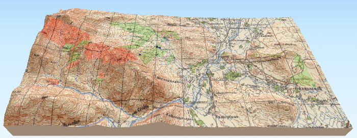
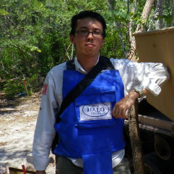

===============================================
Danish Demining Group using QGIS in Afghanistan
===============================================

The Danish Demining Group (DDG), the specialised mine action unit of the Danish Refugee Council, has been working in Afghanistan since 1999, undertaking humanitarian mineclearance, unexploded ordnance (UXO) disposal and mine risk education. DDG Afghanistan delivers humanitarian mine action to save life, strengthen the sense of safety through risk education and help remove obstacles to the productive use of resources, helping to realise Afghanistan’s development potential. Since the start of operations in Afghanistan, DDG has removed over 24,000 landmines and over 940,000 pieces of UXO. Currently, DDG is working in the northern provinces of Balkh and Samangan, and the central provinces of Kabul, Parwan and Panjshir.

In Afghanistan, mineclearance activities are coordinated through the Mine Action Coordination Centre for Afghanistan (MACCA), who collect and disseminate geospatial information on known hazards (minefields, battlefields, ‘spot’ UXO tasks), and update this information as clearance progresses. New shapefiles of these ‘hazard polygons’ are issued by the MACCA on a regular basis, and mineclearance organisations can use these to assess the situation of mineclearance in their areas of operation. DDG is trialling the use of QGIS within the organization to replace the expensive commercial softwares it has used in the past.

   Digital elevation models allow DDG to get an idea of the location of a minefield

The use of geospatial data is most useful in the planning and survey phases. In Afghanistan, security problems and rugged terrain mean that physical re-survey of known sites is not always easy. Instead, the use of a mixture of data --– satellite or aerial photography underlays, digitized Soviet-era topographic maps, hazard shapefiles and digital elevation models –-- allow DDG to get an idea of the location of a minefield in relation to the terrain and surrounding natural and physical features before sending in a survey team. QGIS plugins add useful capabilities, like the ability to visualise terrain in 3D. The attached screenshot above –-- made using the plugin Qgis2threejs --- shows an area just south of the Darulaman Palace in Kabul, with active minefields (along the ridgelines on the left) shown in red over a Soviet topographic raster layer combined with SRTM data. Minefields already cleared show as light green.

.. figure:: ./images/afghanistan2.jpg
   :alt: Active hazardous areas shown in red. Hazardous areas already cleared show as light green.
   :scale: 90%
   :align: right

   Active hazardous areas shown in red. Hazardous areas already cleared show as light green.

Kabul University’s campus is still contaminated with suspected hazardous areas --– thought to comprise of air-dropped bombs or similar ordnance. While not posing any immediate threat to students or staff, these hazards will require eventual clearance to allow future construction within an educational institution vital to Afghanistan’s future development. The hazards are also notable as among the last significant remaining hazardous areas in the Kabul metropolitan area. By using QGIS to combine the hazard polygons from earlier surveys with highly accurate aerial photography provided by the USGS, discrepancies can be noted –-- e.g. where the polygons do not match the shape of the buildings, as evident in the northwest part of the campus --- which can direct survey teams to places to first conduct a more accurate re-survey.

QGIS also syncs well with data collected from field operations using handheld Garmin GPS, allowing clearance maps to be made with the locations of mines found and destroyed.

The use of QGIS, along with a renewed interest in data analysis, has spurred new ways of looking at the data available, and combining it with other data sources to better target mineclearance activities. It is also driving improved mapping capabilities within the organisation, and an ability to better communicate the impact of its work to international donors. In a part of the world where ‘formal’ GIS training is difficult to acquire, the collaborative nature of the QGIS user community is greatly appreciated, as technical problems can often be solved by consulting online forums. In short, QGIS is playing a role in working towards ridding Afghanistan of landmines and UXO.

Link
====

* Danish Demining Group http://www.danishdemininggroup.dk/

Author
======

   Edward Crowther

Edward Crowther is Deputy Country Director at Danish Demining Group Afghanistan. Prior to joining DDG in Afghanistan, Edward worked with the humanitarian mineclearance agency The HALO Trust in Angola and Sri Lanka. He holds an MSc in Development Studies from the University of London’s School of Oriental and African Studies.
