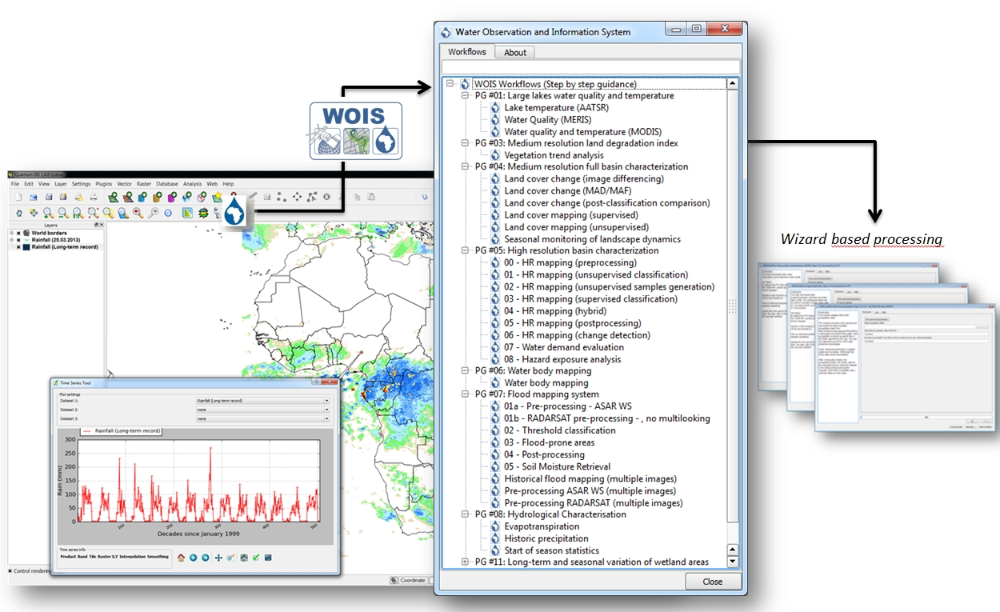

=======================================================================================================================================
Water Observation and Information System: Enabling the Use of Earth Observation Data for Integrated Water Resource Management in Africa
=======================================================================================================================================

The Water Observation and Information System (WOIS) is an open source software tool for monitoring, assessing and inventorying water resources in a cost-effective manner using Earth Observation (EO) data. The WOIS has been developed under the TIGER-NET project, which is a major component of the TIGER initiative of the European Space Agency (ESA) and whose main goal is to support the African Earth observation capacity for water resource monitoring. TIGER-NET aims to support the satellite-based assessment and monitoring of water resources from watershed to cross-border basin levels through the provision of a free and powerful software package, with associated capacity building, to African  authorities. 

System Description
------------------

The WOIS can be seen as a multipurpose system consisting of a spatial database, facilities for extracting and processing EO data, and integrative tools and models aimed at decision support e.g. hydrological modelling and GIS-embedded visualization and analysis tools. The WOIS is designed around QGIS, which acts as the front-end Graphical-User-Interface (GUI).  QGIS was chosen as the central integrating platform, due to its clear and accessible GUI, strong development community, ease of implementing additional functionalities through Python plugins and its high level of interoperability with major GIS data formats through the use of the Geospatial Data Abstraction Library (GDAL/OGR) library. 

Moreover, the integrated Processing Toolbox, formerly known as SEXTANTE, brings the ability to easily incorporate geoprocessing algorithms from various applications into QGIS. It acts as a joint repository for a wide range of algorithms, some native to QGIS and others imported from external applications, such as GRASS GIS or the Orfeo Toolbox. Support for algorithms from ESA’s BEAM, NEST and Sentinel-1 Toolbox software and for setting up and executing SWAT based hydrological models was added to the Processing Toolbox during the WOIS development. The toolbox also allows for easy incorporation of custom R and Python scripts. The inputs and outputs of the Processing Toolbox algorithms can be evaluated with the QGIS capabilities of data I/O, rendering or map creation.

A key advantage of the Processing Toolbox is the ability to seamlessly use functionalities from different algorithm providers for data processing and analysis. This can be used to create automatic processing models and, through a QGIS plugin developed during the TIGER-NET project, to sequentially combine algorithms from the different providers into wizard-based processing chains. This functionality was used to create a library of standardized workflows (with instructions) for performing common but complex tasks related to EO data analysis within water resource management.

   The WOIS graphical user interface, including the embedded workflow library (center) and wizard-based processing workflow (right)

The operational and practical use of the WOIS to support integrated water resource management in Africa has been demonstrated via a series of user specific demonstration cases covering a wide range of themes and information products. These include: lake water quality; flood monitoring; land degradation and land cover characterization; water bodies mapping and hydrological modelling. The demonstration cases have several stages. First, customized end-to-end processing workflows are developed for the requested products and applications. Those workflows are subsequently used for product derivation over significant areas and time periods as requested by the users. In the final step, the workflows (i.e. their stability/performance and ease of use) as well as the product outcomes are being evaluated in close dialogue with the users.

.. figure:: ./images/africa_tiger2.jpg
   :alt: Sentinel-1 flood monitoring of Caprivi flood plain, Namibia.
   :scale: 600
   :align: center

   Sentinel-1 flood monitoring of Caprivi flood plain, Namibia.

Conclusion
----------

The development of the WOIS represents a successful example of a user-driven and collaborative development model, where functionalities have been designed, developed and evaluated through user-designated cases in order to demonstrate the real impact of the system on enhancing water management and integrated water resource management plans. The WOIS is already implemented in major African river basin authorities, several African ministries and agencies, as well as in research and humanitarian organizations. It will therefore continue to develop in response to continued user requirements for new functionalities and functional improvements and due to general software, algorithm and method enhancements.

A particular focus will be on ensuring the support and implementation of processing capacity for the new Sentinel satellite system by integrating the ESA Sentinel toolboxes into WOIS and developing dedicated production workflows. The next release of WOIS (due in the second half of April 2015) will already incorporate Sentinel-1 Toolbox and a number of workflows utilizing this new radar dataset for flood monitoring, water body mapping, etc. This will turn WOIS into a fully-operational monitoring system. Through provision of this license-free, powerful and extendable system, and through continued capacity building and training efforts, the project thrives to build the basis for an extension, i.e. roll-out to other countries and regions in Africa and beyond.

References
----------

* Bauer-Gottwein, P., Jensen, I. H., Guzinski, R., Bredtoft, G. K. T., Hansen, S., & Michailovsky, C. I. (2015). Operational river discharge forecasting in poorly gauged basins: the Kavango River basin case study. Hydrology and Earth System Sciences, 19(3), 1469-1485.

* Guzinski, R.; Kass, S.; Huber, S.; Bauer-Gottwein, P.; Jensen, I.H.; Naeimi, V.; Doubkova, M.; Walli, A.; Tottrup, C. Enabling the Use of Earth Observation Data for Integrated Water Resource Management in Africa with the Water Observation and Information System. Remote Sens. 2014, 6, 7819-7839.

* Walli, A., Tottrup, C., Naeimi, V., Bauer-Gottwein, P., Bila, M., Mufeti, P., Tumbulto, J.W., Rajah, C., Moloele, L.S. & Koetz, B. “TIGER-NET—Enabling an earth observation capacity for integrated water resource management in Africa,” presented at the ESA Living Planet Symp., Edinburgh, U.K., Sep. 11–13, 2013.

Links
-----

* More information about the WOIS software and the TIGER-NET project can be found on the project’s website: www.tiger-net.org

* More information about ESA’s TIGER initiative can be found on the initiative’s website: http://www.tiger.esa.int/ WOIS is available for download (after registration) from the TIGER website (http://www.tiger.esa.int/page_eoservices_wois.php) with source code of the developed plugins, scripts, models and workflows available from the project’s GitHub page (https://github.com/TIGER-NET)

* More information about the new Sentinel satellites can be found on ESA’s website: http://www.esa.int/Our_Activities/Observing_the_Earth/Copernicus/Overview4

Author
======

This article was contributed by Radoslaw Guzinski (WOIS software developer) with contributions from the TIGER-NET technical teams at DHI-GRAS (www.dhi-gras.com), GeoVille (www.geoville.com), the technical universities in Vienna (http://rs.geo.tuwien.ac.at/) and Copenhagen (http://www.env.dtu.dk/) as well as the European Space Agency ( www.esa.int).
