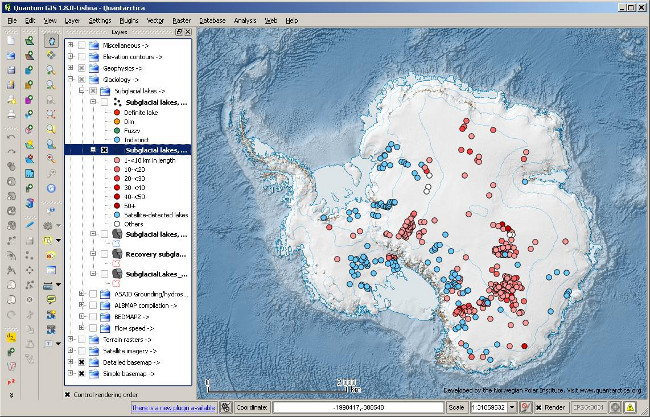

======================================
Quantarctica: An Antarctic GIS package
======================================

Quantarctica is a collection of Antarctic geographical datasets, such as base
maps, satellite imagery, glaciology and geophysics data from data centres
around the world, prepared for viewing in QGIS. The package is developed by
the Norwegian Polar Institute, as a tool for the research community, for
classrooms and for operational use in Antarctica –-- freely available for
non-commercial purposes.

About the project
=================

   Screenshot from Quantarctica, showing one of the subglacial lakes datasets.

Quantarctica (QGIS + Antarctica) was first developed for in-house use at the
Norwegian Polar Institute, as a tool for our glaciologists. There was a need
for a low or no cost complete GIS with essential datasets –-- ready-to-use,
easy-to-use, functionality rich and with offline capabilities. QGIS seemed to
be a perfect choice of GIS for the collected datasets.

Quantarctica has been used to examine geographical data from continental to
local scales, for viewing scientific project data on top of base maps or with
other scientific datasets, and to prepare maps for publications and proposals.
Quantarctica has so far proven to be a great tool, and a very good alternative
and supplement to other software used by the researchers. It has provided new
opportunities for our researchers in their daily work.

.. figure:: ./images/quantarctica2.jpg
   :alt: Quantarctica is also useful when navigating on the Antarctic ice shelves thanks to the GPS tracking capabilities within QGIS.
   :scale: 100%
   :align: left

   Quantarctica is also useful when navigating on the Antarctic ice shelves
   thanks to the GPS tracking capabilities within QGIS.

Since Quantarctica first came in use by our glaciologists three years ago,
there has been many requests in the research community outside the institute
to share this product, and we started to develop a public and improved version
to replace the in-house version. Following Antarctic field testing, and adding
new relevant datasets, Quantarctica version 1.0 was finally completed and made
available for download in July 2013.

Quantarctica is to be all about community effort. With contributions we aim to
expand with data from other disciplines, such as oceanography, atmospheric
sciences, geology and biology, and hope and believe that this tool can be
useful for the Antarctic community –-- as a complete Antarctic GIS package.

Links
=====

* Quantarctica website: http://quantarctica.org/
* Norwegian Polar Institute: http://www.npolar.no/en/

Authors
=======

.. figure:: ./images/quantarctica3.jpg
   :alt: Anders Skoglund and Kenichi Matsuoka
   :height: 220
   :align: left

   Anders Skoglund and Kenichi Matsuoka

This article was contributed in August 2013 by Anders Skoglund (left), GIS
specialist, and Kenichi Matsuoka (right), glaciologist, both at the Norwegian
Polar Institute.
