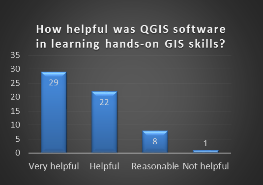

===========================================================
QGIS for distance learning and teaching GIS at Universities
===========================================================

Introduction
============

The University of Southern Queensland (USQ) is a regional university located in south-east Queensland, Australia. It has 28,000 students studying both on and off campus. The access of off-campus students to modern technologies such as Internet services varies widely. They also use different types of computers (e.g. Notebook, Desktop etc.) with different operating systems (e.g. Windows, MacOS, and Linux).

Providing education in both an On-campus and Off-campus mode has many technological challenges. Teaching a GIS course requires overcoming these challenges. On average, 300-350 students enrol in the basic GIS course every year. About 80% of them study in the off-campus mode.

.. figure:: ./images/australia_distance_learning1.png
   :alt: USQ Main Campus Map created using QGIS
   :align: center

   USQ Main Campus Map created using QGIS

QGIS at the University of Southern Queensland
=============================================

GIS education is incomplete without hands-on processing skills. However, providing hands-on GIS skills to off-campus students is not easy because of issues of internet access, cost of software licenses and compatibility with different computer Operating Systems.

The traditional GIS education program at USQ was originally designed to provide different levels of access to GIS learning resources. On-campus students received simultaneous hands-on GIS instruction while the Off-campus students attended a residential school at USQ’s main campus later on to receive hands-on GIS instruction. Providing different levels of instruction to different groups of students enrolled in the same course at the same time wasn’t considered fair to the students. Removing this inequity became a priority.

Different open access geospatial software programs were evaluated for our needs. QGIS was found to be the most suitable to overcome almost all of the challenges we faced. The particular advantages included its free availability, user-friendliness, adaptability and platform independency. We adopted it and enriched it with additional learning resources developed at USQ.

The traditional ‘cook-book’ tutorial method of teaching was replaced with contemporary audio-visual demonstration presentations followed by problem-based hands-on learning exercises. The course assessments (assignments) were rewritten to require use of GIS software. Students completed more than 24 QGIS based hands-on exercises and an assignment during the semester.

On average, 93% of the students in the course used QGIS software and the instructional resources. Voluntary feedback was received from 51% of the QGIS users. The results (Figure 2) show the majority (82%) of the students rated QGIS software and the hands-on learning resources as, ‘helpful’ to ‘very helpful’ in learning GIS. Most others rated it as ‘reasonable’.

   Students response graph

Feedback comments to the question, *"what were the best aspects of this course"* included:

- *The detail in the recorded QGIS audio-visuals.*
- *Using and learning QGIS software*
- *The QGIS software was interesting*
- *I liked the course especially using QGIS*
- *Good choice to use open source software*
- *Videos to help navigate QGIS were fantastic*
- *The practical activities and teaching of QGIS*
- *Having hands on use of programmes through QGIS*
- *QGIS was great to get experience using GIS software*
- *The QGIS training videos helped to learn the basics of a GIS package*
- *The lectures helped with the QGIS by showing you exactly how to use the program*
- *The use of QGIS helped break apart and understand theory delivered in this course*
- *The QGIS exercises are well designed and take students step by step through the process of using a GIS*

It is clear that student’s benefited substantially from the use of QGIS. QGIS provided the same learning opportunity for each student enrolled in the course irrespective of where they were or how they accessed the material

Conclusion
==========

In conclusion, using QGIS software in teaching GIS courses at educational institutions with an online learning environment offers large benefits to both the students and the university. However, there are two important aspects to successfully using QGIS for learning and teaching. Firstly, there is a need to develop customised hands-on learning resources suitable for local environment and secondly, the assessment procedure should require use of the software.

Authors
=======

Dr Badri Basnet (basnetb@usq.edu.au) is a Senior Lecturer at the University of Southern Queensland (USQ), where he teaches Geographic Information Systems (GIS) and other related courses.  Badri has extensive teaching experiences in higher education institutions in and outside Australia. He is heavily involved in scholarship of learning and teaching of GIS courses in an online (or distance) education environment. His learning and teaching research focus is in the development and use of open educational resources in GIS education.

Dr Ernest Dunwoody (edunwoody1@gmail.com) specialises in GIS and remote sensing image analysis applications. This includes ecosystem analysis, sustainable development plans for natural areas, soils mapping, and precision agriculture applications. He has found the wide range of embedded functions, Plugins, and processing tools available through QGIS give it unparalleled flexibility in processing. This familiarity allows him to develop instructional QGIS videos based on Australian spatial data sets.

