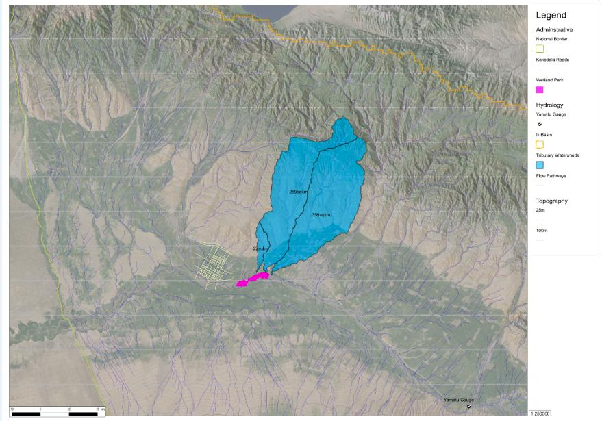
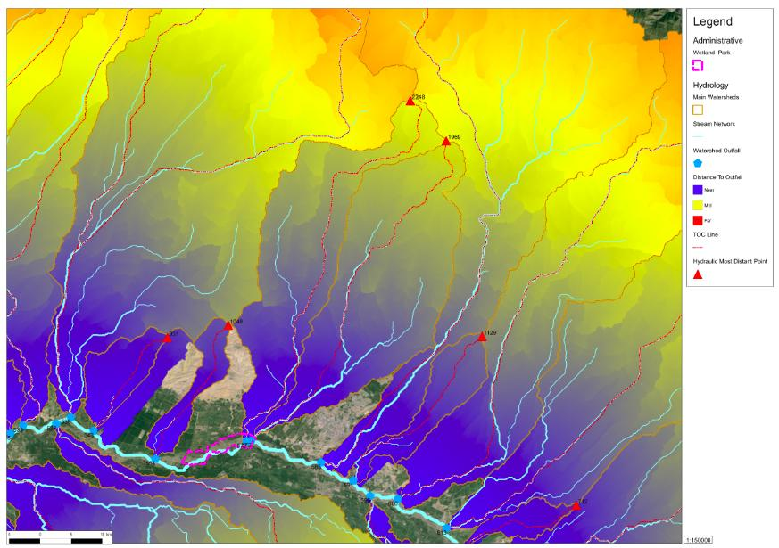

===========================================
Producing an arcHYDRO like output with QGIS
===========================================

I work for a urban planning company in China.  It is often difficult to design proper environmental protection because the common sources of data may be a state secret or may not even exist.  Frequently, we are asked to do designs without proper survey data.   In addition there is usually not enough time for a proper study.  My background is in Urban Planning with a minor in Environmental Science. 

The task was plan a conservation park on the Chinese side of the Ili River which supplies 80% of the water to Lake Balkhash.  FOSS GIS application + FOSS GIS data stores + FOSS GIS education were all critical to reconstruct and model the Hydrological and Ecological processes necessary for authentic conservation planning.  As a non-scientist with no prior training or experience I could not have done it without all three.  My company did not and would not pay to purchase GIS software to run the industry standard arcHYDRO.

Story
=====
   
With some trial and error I was able to produce an arcHYDRO like output from QGIS.  Beginning with a USGS Hydrosheds DEM which was converted into a Regularized Spline with Tension using the GRASS functions inside QGIS and training by Helena Mitsova.  The RST surface was analyzed this surface to find the catchments and flow paths, and resulting vector topologies were cleaned up in QGIS to generate the Hydrologic network and also to build up the attribute tables.

.. figure:: ./images/china_hydro3.jpg
   :alt: Curve Number Grid
   :height: 220
   :align: left

This network was ranked by r.stream extension in GRASS to build Hortons and Hacks stream ordering.  Then a distance to outlet surface grid was generated and analyzed by zonal statistics to find the farthest point.  Next, r.drain in GRASS to trace a time of concentration line.  Finally v.net in GRASS was used to build a network of pour points, flow paths, TOC paths, and HMDP for each watershed.  In this workflow, the QGIS tool attribute by location was invaluable.

.. figure:: ./images/china_hydro4.jpg
   :alt: Flow Key
   :height: 220
   :align: left

After the basic hydrologic network was finished I used UN FAO soils database with table joins to classify soils.  Then using query functions in QGIS the FAO soils were converted to USDA soils.  A previously downloaded USGS ETM7+ grid was classified with the i.cluser and r.maxlik in GRASS into a NLCD grid.  By using reclassification tables I converted the landcover to Manning's n-value grid for overland flow.  Finally I wrote a lookup table in r.mapcalc and merged the soil and landcover grids into and NRCS TR-55 curve numbers following the arcHYDRO methodology.

.. figure:: ./images/china_hydro5.jpg
   :alt: Flow rates
   :height: 220
   :align: left

To create the rainfall grids I performed statistical analysis on GHCN tables to find rainfall depths for design storms of 1,2,5,10,50,100 year returns. Then I downloaded a free sample grid of PRISM for China and assuming a linear relationship, converted average cell values to maximum cell values in order to build maximum rainfall intensity grids.

Conclusion
==========

I began using QGIS out of desperation for lack of arcMAP but now I never want to go back.  The investment of time in FOSS is worthwhile because you can take it with you to any job.  The combination of GRASS QGIS PostGIS gives you the full functionality of expensive GIS systems.   The online learning resources provided were as valuable as the actual software.  I was able to learn QGIS fast enough to produce a great project in a fast based real world industry environment.
 
Author
======

   Robert Ward

Robert Ward is an Urban Designer and GIS Analyst at Parsons Brinkerhoff working at the intersection of high technology and high art.  He has taught at Tongji University and Autodesk University.  He is interested in GIS-based Hydrologic & Hydraulic modelling, Landscape Ecology modelling, Ecosystem Valuation, Transportation Modelling and GIS-Based Design Visualization. 
