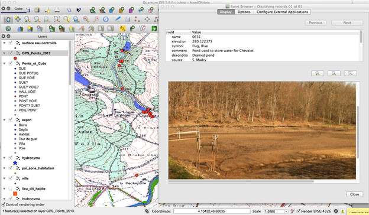

================================================
The Burgundy Historical Landscapes Working Group 
================================================

An interdisciplinary group of researchers based at the University of North Carolina have been working in the Burgundy region of France for over 30 years. We are trying to understand the changing patterns of human settlement and land use over a period of 2,000 years from the Iron Age, Gallo-Roman, Medieval periods into the present.  Our project has included a wide variety of disciplinary researchers, and part of our project includes how to conduct such long-duration interdisciplinary research activities. GIS, GPS and remote sensing have been integral to our work, and our GIS database was first created in 1986, one of the first such archaeological applications.  We have done archaeological, historical, geological, ecological, and ethnographic research in the area surrounding the commune of Uxeau, in Southern Burgundy, which is a rich and resilient landscape that has maintained productivity and stability for an extended period.

.. figure:: ./images/france_burgundy.jpg
   :alt: Our research area in Southern Burgundy, France. This research was done in and around the commune of Uxeau, shown at center right.
   :scale: 90%
   :align: left
      
   Our research area in Southern Burgundy, France. This research was done in and around the commune of Uxeau, shown at center right.

Our Project and how QGIS is used
================================

Our research, organized by the theoretical framework of Historical Ecology, centers on the interaction of people, their societies, natural and built environments, and how these have changed over time. Using a collection of historical maps of the area dating back to 1659, we have scanned, digitized and extracted features for a total of 21 maps into our extensive project GIS database. Features in our database include land cover (forest, vineyards, pasture and agriculturecropland), ponds and streams, mills, roads and buildings from these different dates, where possible. We also have cadastral parcel data from 1834, 1964 and 2012, giving us detailed data on changing patterns of detailed land use for the commune of Uxeau (see location in Figure 1). Our project is interdisciplinary, and we have conduced extensive field surveys, oral history and ethnographic interviews, documentary research in various librariesarchives, and geological and ecological analysis (see Figure 3).

An important feature of this landscape is water, and that is one of the fociuses of our current research. The area is interlaced with streams that have been dammed to form ponds, many dating to at least the middle ages. The creation and maintenance of these ponds with their earthen dams required a great deal of labor and expense. Our research has shown that these man-made ponds were used to water livestock, raise fish for domestic consumption and sale, launder clothing, soak hemp for processing, and for recreation. One of the most important functions of ponds in the past was to run mills, primarily for grinding grain, but also for pressing oil and cutting lumber. Many of these mills have disappeared and many of the surviving mill buildings are endangered due to neglect or redevelopment. Our recent field survey of ponds and mill sites identified from the historical maps was designed to document the remaining pond and mill sites, verify our historical data, test new GIS and GPS technologies, and better understand the conditions and changing function of these features in the present economy.

Our field surveys included assessing, videoing and photographing these sites, verifying their location by taking GPS points and, through the use of our Garmin GPS, to align historical maps with the present landscape (see Figure 2). We also conducted interviews with some of the present owners of pond and mill sites. Our work has documented 52 ponds and 27 mills in the region.

The data and types of analyses we are currently using to study this complex landscape include a series of maps ranging in date from 1759 to 2012, which are integrated within our larger GIS database, historical records such as cadastral tax records, agricultural reports, and population data from censuses and parish/civil registers, environmental data from ponds (pollen, sediment geochemistry, grain size, stable isotopes), and oral history/ethnographic interviews with local rural inhabitants.

nd photos of mills and other historical or archaeological sites.
   :scale: 90%
   :align: left
   
   A view of our project QGIS database. At right is the eVis GPS ground photo and data of a recently drained pond dating back at least to 1834. In the GIS image at center top you can see the location of the pond as a yellow dot. Red dots show other eVis ground photos of mills and other historical or archaeological sites.

Conclusion
==========

Our project started using GRASS in 1986, and has continued to use this, as well as commercial ArcGIS and a variety of other tools such as Photoshop, Garmin’s BaseCamp, eVis and others. With many collaborators at various institutions in the US and Europe, and graduate students coming and going, using free and open source tools makes a lot of sense. We have found that the combination of QGIS and GRASS provides capable data analysis and visualization, ease of use, interoperability, and portability for our project. Archaeologists have had a strong presence in the GRASS and open source GIS communities for many years, and have contributed much to this important effort, developing and sharing many capabilities. I have taught several 4-day QGIS/GRASS/R short courses in France over the years, sharing these tools with many archaeologists from throughout France.

Our research will continue to explore the long-term history of the inhabitants’ relationship with this landscape and we will expand our work beyond our current focus on mills and ponds to include changing patterns of forests, pastures and meadows, croplands and former vineyards in the area.

.. figure:: ./images/france_burgundy3.jpg
   :alt: From top left going clockwise: Some of the local Charolais cattle, doing ethnographic interviews with local farmers, a GIS map showing forest change from 1759 to 1983, and a book of Uxeau 1791 cadastral tax records. In the center is a color 1759 Cassini map of the area.
   :scale: 90%
   :align: left
   
   From top left going clockwise: Some of the local Charolais cattle, doing ethnographic interviews with local farmers, a GIS map showing forest change from 1759 to 1983, and a book of Uxeau 1791 cadastral tax records. In the center is a color 1759 Cassini map of the area.

Contact
=======

* Project website: http://burgundylandscapes.com with more information and online publications.
* Dr. Scott Madry: http://scottmadry.web.unc.edu or email: madrys ‘at’ email.unc.edu

Authors
=======

.. figure:: ./images/france_burgundy4.png
   :alt: Jones, Tickner and Madry doing field work
   :height: 220
   :align: left

   Jones, Tickner and Madry doing field work

This article was contributed in August 2013 by Dr. Scott Madry. He is a research associate professor in the Curriculum in Archaeology at the University of North Carolina at Chapel Hill’s Research Laboratories of Archaeology. He is on the faculty of the International Space University in Strasbourg, France, and is a chercheur associé du Laboratoire Archéologie et Territoires de l'UMR 7324 CITERES, Université François-Rabelais/CNRS. This research project is conducted collaboratively with Dr. Elizabeth A. Jones, historical anthropologist (UNC), Dr. Amanda B. Tickner, paleoethnobotanist (UNC) and Dr. D. Seth Murray, ethnographer and oral historian (NCSU).
