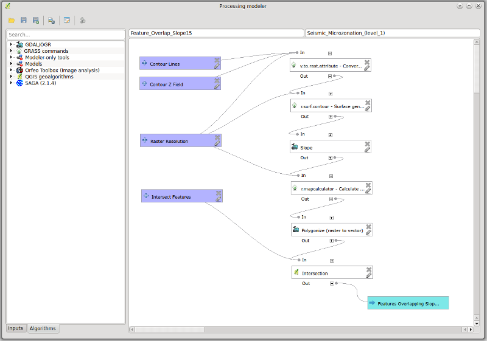
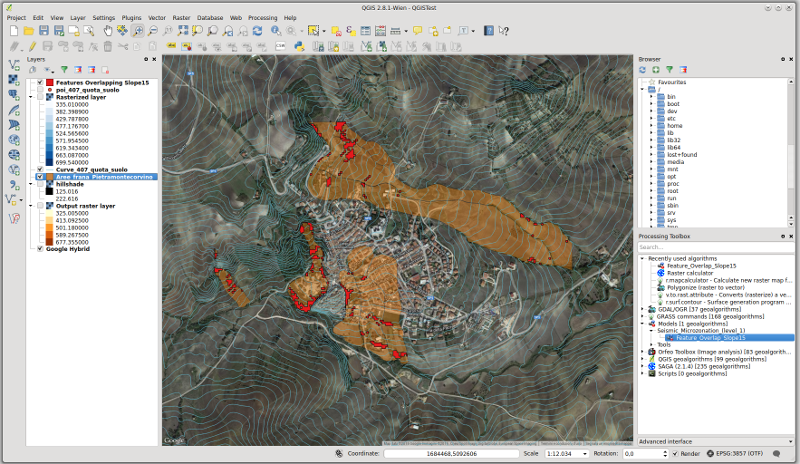

===============================================================================
QGIS geoprocessing model to simplify first level seismic microzonation analysis
===============================================================================

The Institute of Environmental Geology and Geoengineering (IGAG) of the National
Research Council (CNR) is located in Rome, in the Area of Research "Roma 1".
It was founded in 2002 by regrouping five former research Institutes and Centers
that had been active for more than 40 years in their field of expertise.
IGAG covers a wide range of scientific topics in the field of Earth sciences,
mainly focusing towards the study of:

* Environmental geochemistry and remediation of contaminated soils and waters;
* Mineral deposits and mineral processing, including the treatment of waste waters;
* Geoengineering and safety of rock excavations;
* Recent geological evolution;
* Mitigation of natural hazards;
* Geoarchaeology and archaeometry.
* Marine Geology
* Geomatics, GIS analysis and development.

The level 1 seismic microzonation study of the Pietramontecorvino area (Apulia,
Southern Italy, located along the Central-Southern Apennine chain) is part of a project,
in collaboration with the Basin Authority of Apulia (Puglia AdB) and the Department of
Geology and Geophysics (DGG) of the University of Bari, aimed at the seismic microzonation
of 63 Municipalities of the area of Foggia. The activity was promoted by the Italian
Department of Civil Protection (DPC) and financed by the Interministerial Committee
for Economic Planning (CIPE n. 20/2004).

QGIS geoprocessing tool for first level seismic microzonation studies
=====================================================================

The seismic microzonation evaluate the seismic hazard at the local scale proposing
to identify areas of territory characterized by homogeneous seismic behavior.
The first level of seismic microzoning has the purpose of defining the lithological
properties and geometry of geological units that characterize these portions of
territory (microzones).

The observation of the damage caused by an earthquake often shows variations at local
scale caused not only by geological structures but also by different quality and
type of building structures, resulting in different seismic hazards.

The seismic microzonation evaluates the local seismic hazard, through the identification
of areas of territory characterized by homogeneous seismic behavior.

The Guidelines and Criteria for Seismic microzoning 2008 (http://www.protezionecivile.gov.it/jcms/it/view_pub.wp?contentId=PUB1137)
provide standards for seismic microzoning studies on Italian territory;
they distinguish three levels of increasing depth (from 1 to 3).

The first level seismic microzonation consists in the creation of three thematic maps:

#. Survey map containing the surveys for seismic microzonation studies;
#. Geo-lithological map, obtained from detailed scale geological and geomorphological
   maps integrating existing lithological, stratigraphic and geotechnical data related to surveys;
#. Level 1 seismic microzonation map (the principal product of level 1 microzonation),
   identifying the microzones into three categories of local hazards:

   * Stable zones;
   * Stable zones prone to ground amplification;
   * Unstable zones.

The scope of this work is to contribute to the creation of a methodology for processing
topographical, geological, geophysical and geo-technical data aimed at level 1 seismic
microzonation map drafting, through the use of open source tools.

The Graphical Modeler tool integrated in the latest version of QGIS (2.8.1 as of writing)
has been used for the creation of a simple geoprocessing model. This tool is useful to
automate one of the analysis commonly performed for the creation of level 1 seismic
microzonation maps, in particular to identify unstable zones as polygon features.

The model makes use of different open source software and libraries (GRASS, GDAL, QGIS),
demonstrating the usefulness of QGIS as a simplified and unified interface for heterogeneous
GFOSS (Geospatial Free and Open Source Software) tools (Fig. 1).

   (Fig. 1) Screenshot from the geoprocessing model.
   
The model takes as input (Fig. 2):

* A shapefile of contour lines containing a field with elevation values;
* The name of the field  containing elevation values;
* The desired raster resolution in meters for DEM and Slope (default 10);
* A polygon shapefile from which features intersecting areas with slope greater than 15 degrees will be extracted;
* The name of the resulting polygon layer.

.. figure:: ./images/italy_igag2.png
   :alt: Model input form (left) and execution log (right)
   :scale: 90%
   :align: right

   (Fig. 2) Model input form (left) and execution log (right).

When launched, the model performs the following operations:

* The GRASS tool v.to.rast.attribute converts contour elevation lines to raster,
  taking the contour shapefile, the name of the z field and the raster resolution as input;
* The GRASS tool r.surf.contour generates the elevation model taking as input the rasterized
  temporary output from previous step and the raster resolution;
* The GDAL tool “gdaldem” generates the slope expressed as degrees from the elevation model;
* The GRASS tool r.mapcalculator is used to generate a 1 bit raster identifying areas with
  slope greater than 15 degrees (this value is coded in the microzonation guidelines,
  and so it is fixed), using the expression:

if(A>15,1,null())

where A is the temporary slope raster generated by gdaldem;

* The GDAL tool “gdal_polygonize” converts the 1 bit raster to polygons;
* The QGIS tool “Intersection” is used to overlay the areas with slope greater
  than 15 degrees with the chosen intersection layer.

The result is a polygon layer with areas prone to instability due to a slope value greater
than 15 degrees, automatically extracted from a thematic map such as a landslides polygon layer
(Fig. 3) or a lithological map.

   (Fig. 3) The model output (in red) shows highly unstable areas extracted from a landslides layer (orange).

Conclusions
===========

This work clearly demonstrates that open source GIS tools like QGIS, GRASS, GDAL/OGR, can successfully
be used for spatial analysis and data processing aimed at first level seismic microzonation  studies.
In this example work, QGIS has been used as a simplified and unified interface for different high
quality GFOSS tools; the Graphical Modeler allows to intuitively construct geoprocessing models
that can be easily shared as portable and cross-platform tools that doesn't require expensive software licenses.
The tool leverages the QGIS modeling capabilities to graphically chain different algorithms,
defining input and output parameters and leaving to the software the task of managing
intermediate data output. The use of GRASS algorithms does not require defining and using
a GRASS database and mapset, greatly simplifying the design of the model.
Future developments include the creation of a package of tools and models, based on open source software,
that can be used to simplify and speed up spatial analysis tasks necessary for seismic microzonation studies.

References
==========

* G. Baldassarre; Gallicchio, S.; Giannandrea, P. & Tropeano, M.: "Relazione Finale Geolitologica
  per la microzonazione sismica di livello 1dei Comuni della Provincia di Foggia Dipartimento
  di Geologia e Geofisica dell'Università di Bari, 2011"
* Cavinato,G.P.; Cavuoto, G.; Coltella, M.; Cosentino, G.; Paolucci, E.; Peronace, E. & Simionato,
  M.: "Studio di fattibilità per il monitoraggio e la messa in sicurezza delle aree urbane a rischio
  di stabilità statica e vulnerabilità strutturale del Comune e della Provincia di Foggia -
  CIPE 20/2004 Consiglio Nazionale delle Ricerche - Istituto di Geologia Ambientale e Geoingegneria, 2013, 526"
* Contributi per l'aggiornamento degli "Indirizzi e criteri per la microzonazione sismica " 2008.
  Ingegneria sismica, Pàtron Editore Bologna, 2011 (http://www.protezionecivile.gov.it/jcms/it/view_pub.wp?contentId=PUB28083)
* Gruppo di lavoro MS, 2008. Indirizzi e criteri per la microzonazione sismica.
  Conferenza delle Regioni e delle Province autonome - Dipartimento della protezione civile, Roma,
  3 vol. e Dvd, Presidenza del Consiglio dei Ministri, Dipartimento di Protezione Civile, 2008, 424.
  (http://www.protezionecivile.gov.it/jcms/it/view_pub.wp?contentId=PUB1137)

Authors
=======

This article was contributed March 2015 by Giuseppe Cosentino and Francesco Pennica (www.igag.cnr.it).

   Giuseppe Cosentino

Giuseppe Cosentino <g.cosentino@igag.cnr.it> is geologist and technologist specializied
in Geographic Information Systems for the management of geological and engineering hazards.
Currently working in the field of seismic microzonation and environmental characterization
of the lands in contaminated sites.
Areas of interest: geological and environmental hazards, cartography, structural geology, explorative drillings.

.. figure:: ./images/francesco_pennica.png
   :alt: Francesco Pennica
   :height: 200
   :align: left

   Francesco Pennica

Francesco Pennica provides GIS and  WebGIS software development and data management:
GeoServer, MapServer, ArcGIS Server, GeoNetwork OGC standard based webgis services, Java,
HTML, CSS, Javascript, Python, PHP languages and frameworks, WebGIS front-end development
with OpenLayers, ExtJS, GeoExt, JQuery, GWT, Ext-GWT, Google Maps API
SQL, geodatabase management, PostgreSQL, PostGIS, GIS desktop software based analysis and
scripting (ArcGIS, GRASS, GFOSS tools), Software configuration and management in Linux
and Windows based servers and desktops.

