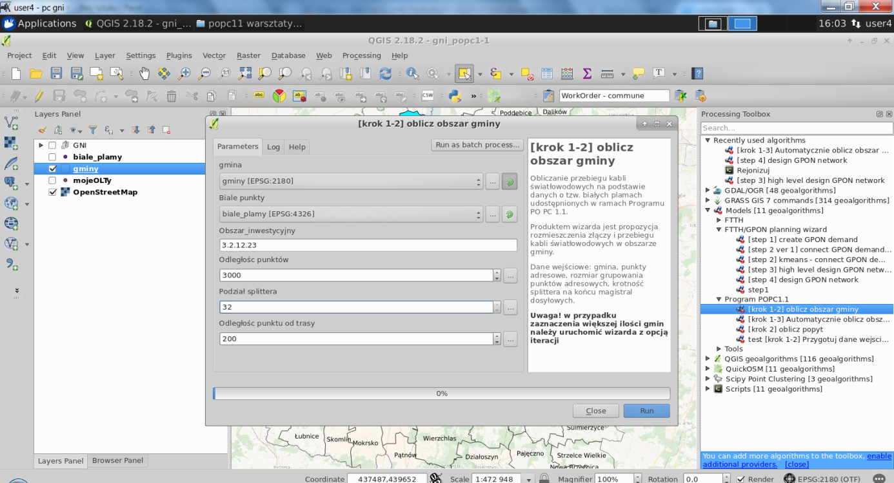
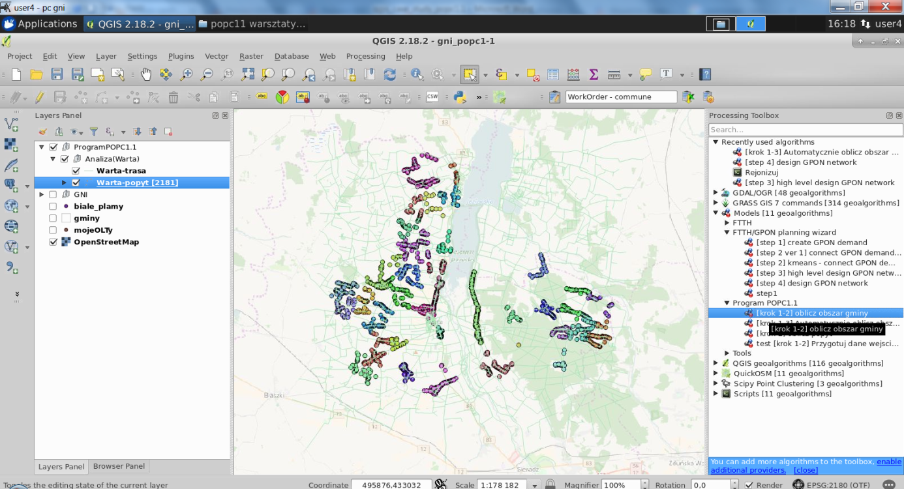

===========================================================================================
Using QGIS for FTTH/GPON network planning due to the implementation European Digital Agenda
===========================================================================================

Definition of the problem
==========================

Over the past few years many EU countries have launched operational programs to
implement European Digital Agenda (EAC) developed by the European Commission in
2010. According to its guidelines until 2020 every citizen of the European Union
should have access to 30 Mbps Internet bandwidth and at least half of them will
have access to bandwidth not slower than 100 Mbps.

Poland is one of the countries in which the Agenda is being implemented.
Thanks to European Union funds many local operators can compete with
large telecom providers as regards high-speed broadband services.
Unfortunately, applying for funding requires a great deal of work
necessary to draw up proper documentation, including, among other things,
development of planned FTTH (Fiber To The Home) network conceptual maps.

Moreover, currently there are no GIS-based IT tools available to support
the potential beneficiaries with the preparation of documentation. The
complexity of the problem is even more complicated by the fact that such
a software should enable a creation of documentation in accordance with
specific program guidelines (e.g. the obligation to connect educational
institutions).

As we have extensive experience in the telecommunications industry,
entities applying for EU funds asked us to create software supporting the
development of FTTH network concept map. Products generated by developed
software was to significantly speed up the application preparation
process.

Description of the solution
===========================

Due to the high popularity, widespread availability, openness of the software
and immense functional abilities, it felt natural to select QGIS as platform to
serve as a basis for our solution.

According to the guidelines of FTTH Council Europe, it is crucial to first
prepare a plan considering both the technical aspect (placement of cables,
splice closures, splitters) and economic aspect (demand) based on real address
points data. The building structure and the density of the building development
determine the technology of GPON (Gigabit Passive Optical Network) network
design. To have the ability to plan network topology efficiently it is required
to have among other things:

* access to GIS data,
* automation of GIS data processing,
* application of network optimization algorithms,
* application of GPON network engineering rules.

All these items were connected in QGIS platform. Below there is a brief
description of how we realized the project and what functional items were
incorporated to create one solution.

In order to achieve our goal, we needed few functional components apart from
the standard GIS platform:

* GRASS - a collection of vector and network algorithms,
* QGIS plugins - OpenLayer, QuickOSM, Scipy Point Clustering, WorkContextTracer
  (our plugin),
* QGIS modeler – tool for graphical flow modelling,
* SpatiaLite - a local database for storing input and output data.

The entire solution was based on the concept of so called wizards which realize
the process of preparing the FTTx network technical concept step by step. Using
'geoprocessing' modeller, we created models requiring only the necessary input
data from operator. Algorithmic complexity was encapsulated within models in
the form of designed flow, which use existing QGIS algorithms and calls
dedicated scripts.

.. figure:: ./images/poland_ffth/toolbox.png
   :alt: Toolbox
   :scale: 60%
   :align: left
   
To prevent the results of subsequent analyses from getting mixed up, we provided
a plugin called WorkContextTracer which groups our work in so called work contexts.

.. figure:: ./images/poland_ffth/workorder.png
   :alt: Workorder
   :align: left
   
Network algorithms based on the graph functions available in GRASS were
enriched by adding the telecommunication scripts. We introduced a concept of
demand clustering which enables to use both K-means and hierarchical methods to
aggregate demand points.

Geoprocessing scripts with usage of cable routing layer and Djikstra algorithm
develops a cable route proposal with optical fiber nodes' locations.

Operators also needed an association between created network nodes and address
points to estimate the individual cost of each network branch. To complete this
task, we created scripts that performs this operation storing results in local
SpatiaLite database. The data needed to be exportable to spreadsheet, so we
used free software library to fulfil this requirement.

How users used tool to create FTTH/GPON network plan
====================================================

The user started work by opening a new work context and specifying an input
layer of address points to be analysed. Using the standard QGIS interface, the
user could establish a set of demands on address points and finally provide the
parameters necessary for further steps of the algorithm.

.. figure:: ./images/poland_ffth/step1_inputlayer.png
   :alt: Step 1: input layer
   :scale: 60%
   :align: left

Without having information about the existing civil infrastructure, a properly
filtered OpenStreet road network were used as a routing layer. Scipy algorithms
fed with input parameters, clustered the address points into demand aggregates
marking them with separate colour indicating its assignment to particular
cluster.

 
Having all address points clustered, user initiated the steps of high level
network planning providing layers prepared in the previous steps and a layer
with GPON network starting point. 

Upon the completion of the algorithm, in QGIS there are geometry objects
representing planned cables and splice closure locations. Basing on demand data
and network topology, an additional information is stored in database such as
the length of the cable, its profile, node’s serving areas.

.. figure:: ./images/poland_ffth/step4_results.png
   :alt: step 4: results
   :scale: 60%
   :align: left

At this stage, the user already had all pieces of the information to develop
a high level FTTx network technical concept. The final part was generation of
the data report spreadsheet showing all calculated data from several different
perspectives.

.. figure:: ./images/poland_ffth/report_generated.png
   :alt: Report generated
   :scale: 60%
   :align: left

.. figure:: ./images/poland_ffth/report_generated_and_tranformed.png
   :alt: Report generated and tranformed
   :scale: 60%
   :align: left

Conclusion
==========

Thanks to the use of the QGIS platform as well as its extension capabilities,
we managed to develop a free open source solution allowing telecommunication
operators to prepare the documents necessary to submit application for
co-financing in the EU program implementing European Digital Agenda.

By combining flexible vector algorithms with the telecom engineering scripts,
we enabled the practical use of mathematical algorithms in solving real
problems concerning telecommunication network planning. The user operates on
understandable data scope (municipality, building, road) whereas transformation
of this information into a mathematical model is hidden from the user.

The user got many useful benefits:

* Automatic GPON network plan development based on publicly available data and
  GPON technology engineering rules.
* Ability to customize tool with specific EU program guidelines in a given
  country.
* The big accuracy of the results corresponding to real dimensions.
* Generation of data needed for applying for EU funds: network concept map, cable
  and splice closure report with serving areas assignment.
* Possibility to precisely determine the construction and depreciation costs of
  each part of the network with calculation of the cost of connecting each
  address point.
* Possibility to prioritize address points from the most profitable to
  unprofitable.
* Possibility to evaluate basic economic indicators like ROI, NPV.

Useful links and bibliography
==============================

* http://europa.eu/rapid/press-release_MEMO-10-200_en.htm - information on
  European Digital Agenda
* http://www.ftthcouncil.eu/  - FTTH Council Europe website
* https://www.scipy.org/ - SciPy project website
* https://ksavinetworkinventory.com/en/download-geospatial-network-inventory-free/
  - tool download webpage. 

Authors
=======

The solution is a completely free open source tool. It is part of a larger
project based on QGIS and FreeCAD platforms which has intention to be used in
telecommunications industry.

The author of this QGIS based solution is Softelnet (https://www.softelnet.com),
a company manufacturing and integrating software for the telecommunications industry
for over 15 years.

