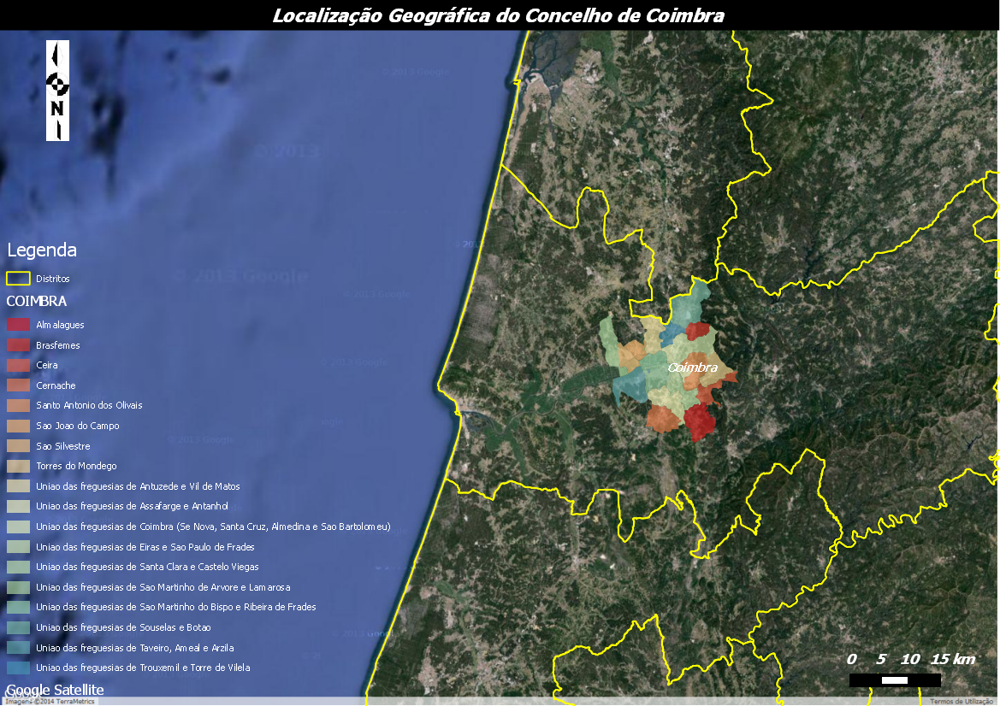
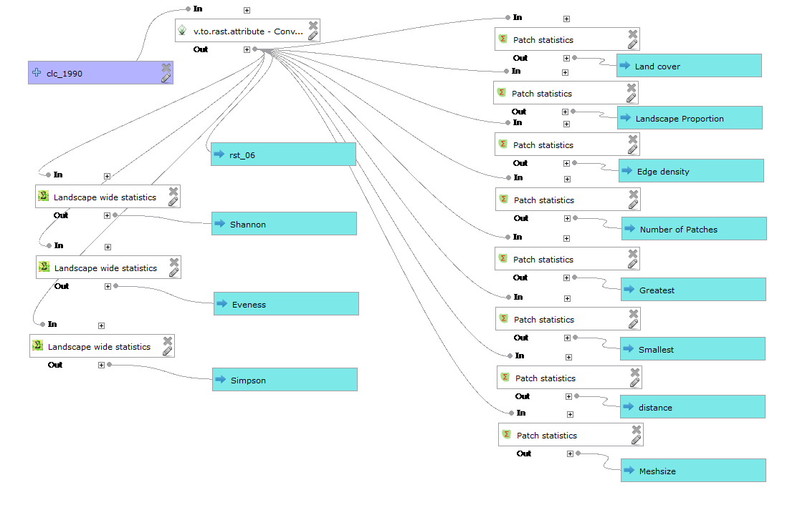
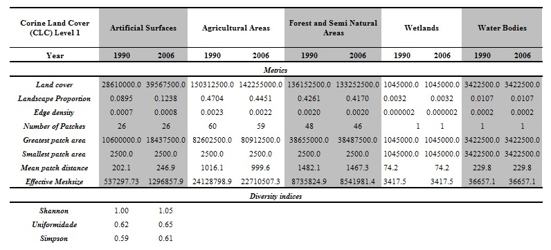

==============================================================================
Using open source tools for characterization of a landscape. The LecosS plugin
==============================================================================

This case study results from the final draft of the Graduate Geographic Information Systems taught by GeoPoint. We proposed to study a landscape using Landscape Ecology plugin (LecoS) in QGIS 2.01 Dufour. The study was conduted in a region of central Portugal, Municipality of Coimbra, with an total area of 31940ha and it has geographic coordinates 40°12'11.84" North, 8°24'37.15" West. Because the new administrative reorganization this municipality are divided into 18 parishes, which are mostly urban areas (Figure 1).

   Geographic location of the municipality of Coimbra.

The characterization of a landscape is conducted using quantitative indices designed by landscape metrics. These indices are then used to describe the structural characteristics of landscape, to document the change and their relationship with the occurrence of several species or group of species (Turner et al, 2001;. Olsen et al, 2007;. Fidalgo et al. , 2009). The number of metrics is extremely large and can be calculated at the landscape level, class and stain (Turner et al, 2001;. Fidalgo et al, 2009.). Metrics can be calculated from the Corine Land Cover, Land use (COS 90 and COS2006) or maps of Land cover produced by us. According to Martin Jung (2012), the Landscape Ecology Stistics (Lecos) is a module of QGIS used to calculate landscape metrics in raster layers. The result can be available in CSV format.

Methods
=======

Landscape metrics was calculated using the Corine Land Cover (CLC) of the years 1990 and 2006. For this purpose it was necessary to transform the coverages in raster format with cell size  50x50 meters. We use r.to.raster tool the Grass Gis module that were present in processing toolbox and the CLC classification level used it´s the first.  After transform coverages we calculate the metrics  in Landscape Ecology plugin (LecoS) using the graphical modeler (Figure 2).

   Landscape metrics calculated for diferent years (1990 and 2006).

We calculate land cover area, Landscape Proportion, edge density, Number of patches, Greatest patch area, Smallest patch area , Mean patch distance and the Effective mesh size (Table 1). Measures of diversity of the landscape were calculated the Shannon index, Uniformity and the Simpson index.

Results
=======

From analysis of the landscape metrics calculated it was found that there was an increase in the degree of human disturbance and therefore a greater fragmentation of uses between 1990 and 2006. The number of patches of “Forest Semi Natural areas” and “Agricultural areas” decreased between 1990 and 2006 (Table 1). This metric can give us some indication of ecological processes increasing or decreasing relationships between populations and habitats (Viana and Aranha, 2008). Also of note is the average distance between spots, one measure that allows us to understand the degree of landscape fragmentation, the decline of “Forest and Semi Natural areas” 1990 to 2006 at the expense of increased “Artificial areas” (Table 1).

   Model to calculate landscape metrics in 1990.

From 1990 to 2006 diversity increased, however it is known that this result is directly related to the transfer between land cover, in particular loss of “Agricultural areas” and “Forest and Semi Natural areas”. The same happened with uniformity.

Conclusion
==========

It was possible to determine the landscape metrics using the LecoS plugin noting that the study area presents problems of fragmentation due to the high degree of human disturbance. QGIS proved to be quite intuitive and very practical in the calculation of landscape metrics in the absence of any constraint. It is indeed a robust and viable compared to proprietary software solution. In the future we intend to apply this method to areas that have problems with invasive species to study their behavior in the landscape.

References
==========

* Fidalgo, B., R. Salas, et al. (2009). "Estimation of plant diversity in a forested mosaic landscape: the role of landscape, habitat and patch features." Revista Latinoamericana de Recursos Naturales 5 (2): 65-73.
* Viana, Hélder; Aranha, José (2008) - Estudo da alteração da cobertura do solo no Parque Nacional da Peneda Gerês (1995 e 2007). Análise temporal dos padrões espaciais e avaliação quantitativa da estrutura da paisagem. X Encontro de Utilizadores de Sistemas de Informação Geográfica, 14 a 16 de Maio de 2008 – Oeiras.
* Martin Jung (2012) LecoS - A QGIS plugin to conduct landscape ecology statistics, http://plugins.qgis.org/plugins/LecoS.
* Olsen, L., V. Dale, et al. (2007). "Landscape patterns as indicators of ecological change at Fort Benning, Georgia, USA." Landscape and urban planning 79: 137-149.
* Turner, M. G., R. Gardner, et al. (2001). Landscape ecology in theory and practice: pattern and process. New York.

Authors
=======

.. figure:: ./images/portugal_coimbra4.png
   :alt: André Duarte
   :scale: 10%
   :align: left

   André Duarte

This article was contributed July 2014 by André Duarte. He has an Engineering Degree in Forest Resources and Master of Forestry Resources from the Escola Superior Agrária de Coimbra. Graduate in Geographic Information Systems by Geopoint. Currently collaborates with Grupo Portucel Soporcel.
