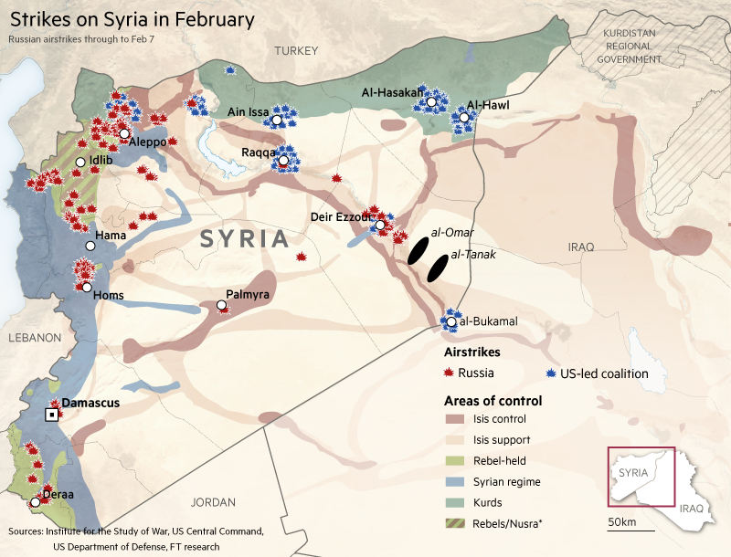
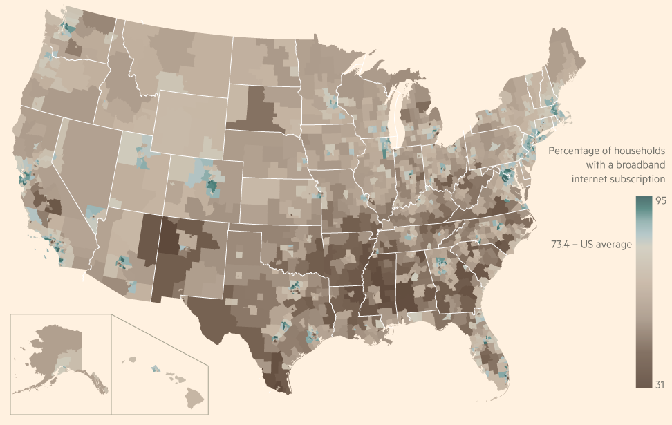

================================================
Use of QGIS at the Financial Times Graphics Team
================================================
---------------------------------------------------------
Interview with Steven Bernard (Interactive Design Editor)
---------------------------------------------------------

Steven is an Interactive Design Editor at Financial Times. You can find him on
`Twitter <https://twitter.com/sdbernard>`_. He also publishes useful `HOWTO Videos on Youtube <https://t.co/6aTE6G8h0T>`_
for certain cartographic tasks in QGIS.

**QGIS**: Steven, What is the name of the team you work at FT? Can you provide us a little bit of background
about what your team at FT is doing?

**Steve**: Our team is in a transition period at the moment, we have a new data visualisation editor,
Alan Smith OBE (formerly of the ONS) who is shaking things up and creating a single graphics team.
Traditionally we had a web graphics team and print graphics team. The print team would be responsible
for all the newspaper graphics as well as creating web-friendly versions of them. My team was responsible
for all the web-only content, as well as working closely with the interactive producers/developers in
designing interactive graphics.

The newly formed team will allow for a lot more cross-over of skills between the different media.

Alan has introduced a single digital workflow for our team, including using d3 to help create
a larger graphic vocabulary and cutting down the time it takes to create the visuals.

.. figure:: ./images/ft_europe_migration_balkan-route.png
   :alt: Migrant flows. Western Balkans route.
   :scale: 100%
   :align: left
   
*Example: Migrant flows. Western Balkans route.*

**QGIS**: How many co-workers are there in your team?

**Steven**: Including all the designers, developers, producers and statisticians we have a team of 24

**QGIS**: What's your specific role within the team?

**Steven**: We are a multi-disciplinary department so I don’t have a specific role as such. My role
includes producing responsive designs for interactive graphics as well as doing the front-end
development on the less complicated interactives (e.g. `Inside Isis Inc: The journey of a barrel of oil <http://ig.ft.com/sites/2015/isis-oil/>`_). I also produce the standard
news related charts and maps on a daily basis. Over the past two years I have been concentrating
on developing our cartographic offerings at the FT. QGIS has been instrumental in changing how we
produce maps, and in conjunction with other tools such Blender have helped me to be more creative
with how we approach maps.

.. figure:: ./images/ft_nigeria-migration_animation.gif
   :alt: Dora's journey from Nigeria to Sicily - one of thousands by trafficked women each year
   :scale: 100%
   :align: left
   
*Example: Animation of Dora's journey from Nigeria to Sicily - one of thousands by trafficked women each year.*

**QGIS**: Can you tell us a bit about yourself? What's your educational background?
What did you do before joining the data visualization team at FT?

.. figure:: ./images/ft_gotthard-tunnel.png
   :alt: Gotthard rail and road tunnel
   :scale: 60%
   :align: left
   
*Example: Gotthard rail and road tunnel in the Swiss Alps.*

**Steven**: I am traditionally trained as scientific illustrator. What’s that I hear you ask?
It involves producing illustrations for medical journals, natural history publications anything
where you are trying to convey information visually where a photograph can’t. Think of diagrams
showing the human circulatory system, or showing a procedure to fix a broken bone. Sadly there
wasn’t much call for that kind of work when I left university and I basically fell into the job
at the FT. I have always been good at maths, which I think is important when working with data
visualisations, it has certainly helped me with my coding as well.

**QGIS**: How did you discover QGIS?

**Steven**: I came across QGIS in 2013 when we were working on a `project mapping the ethnicity
of the Middle East <http://ig.ft.com/features/2013-07-19_middleeast_religion_map/dist/index.html>`_ 

We used it to georeference maps that were created by a professor at Columbia University. At first I
found it really tricky using the add feature drawing tool, probably because it was unlike anything
I’d used in Adobe Illustrator for 17 years prior! I also found it frustrating that you had to save
things twice, once when done editing the shapefile, then again to save the project. However, this was
just down to inexperience with the program and in the end it did exactly what we needed, which was to
produce shapefiles that we could add to a Mapbox base map.

**QGIS**: What's the role of QGIS within your usual workflows?

**Steven**: QGIS is now an integral part of our mapping workflow. I don’t use any other GIS tool to create our maps.
Although a few members of our team also use Map Publisher as they feel more comfortable staying within Adobe Illustrator.
I would say 80% of our maps are now produced in QGIS.

.. figure:: ./images/ft_blm-federal-land-map.png
   :alt: Public Lands in the US
   :scale: 100%
   :align: left
   
*Example: Public Lands in the US.*

**QGIS**: What other tools do you use besides QGIS and how do you combine these?

**Steven**: If it is just a straightforward locator map 95% of the work is done in QGIS, with the final polishing
done in Adobe Illustrator. 

If I am doing a relief map, then the process is a lot more complex. I will retrieve DEM files from Nasa Earth Explorer,
and bring them into QGIS to crop to size. I will then take the cropped DEM into Blender to create a 3D render.
If I am using a satellite overlay on the hillshading then I will download a BlueMarble image from Nasa and take this
into Blender as well. The exported render from Blender is then brought back into QGIS to use as a background layer.
I may tweak it in Photoshop beforehand if necessary.

For responsive maps like those in the `Isis oil story <http://ig.ft.com/sites/2015/isis-oil/>`_, I used all of the above tools but the final
step is to use an open source Adobe Illustrator script developed by the New York Times’ Archie Tse. This allows me to
create responsive versions of my maps that work on all devices.

Another tool that is useful is Google My Maps which allows reporters around the world to mark locations on a map and
then we can download them as a kmz file and import them straight into QGIS.

The final tool I use is Adobe After Effects as I have recently got into animating my maps to take the user on a
journey. As used in the Land Rush series recently:

- `Land Rush Ethiopia <https://ig.ft.com/sites/land-rush-investment/ethiopia/>`_
- `Land Rush Myanmar <https://ig.ft.com/sites/land-rush-investment/myanmar/>`_
- `Land Rush Indonesia <https://ig.ft.com/sites/land-rush-investment/indonesia/>`_

**QGIS**: Do you use other spatial tools or GIS besides QGIS, and if yes, which ones?

**Steven**: QGIS all the way for me, but as mentioned above some of my colleagues use Map Publisher as well.

*Example: Strikes on Syria in February 2016.*

**QGIS**: Can you describe the strengths and weaknesses of QGIS regarding the tasks you have to do?

**Steven**: When I first used QGIS I saw it as a specialist tool, fit for only dealing with specific tasks.
I really didn’t see it a production tool. In late 2014 two of my colleagues went on a QGIS course held by
Alasdair Rae at Sheffield University. They both enthused about how good QGIS was, so I took it upon myself
to evaluate it as a tool that could be used to produce all our maps.

Within about two weeks I was convinced that it would be viable. The main selling point was the ability to set
up style guides for everything including zoom level styling for street-level maps. 

I have a system set up where we have sets of Google sheets with columns for name, lat, long, marker-icon,
fontweight, fontsize and whether you want the marker visible or not. 

The marker icon is a dropdown connected to a vLookUp table which fills in all the details for that marker. 

So all I have to do is download the csv, import it into QGIS, apply a style and I have a map that is 95% ready to go.

To be perfectly honest I can’t think of any weaknesses, there are a couple of things that I would like to see
or be able to do but, I don’t see that as a weakness, just a missing feature.

.. figure:: ./images/ft_chinaMigration.png
   :alt: Urban Attraction and Migration within China
   :scale: 100%
   :align: left
   
*Example: Urban Attraction and Migration within China.*

**QGIS**: What are the concepts or features you like the most in QGIS?

**Steven**: There are numerous features that I would class as life savers! But primarily Quick OSM and
Georeferencer have saved me so much time, this is absolutely essential when deadlines are tight. Which,
when working for a news organisation, is usually 90% of the time.

.. figure:: ./images/ft_china_henanGuangdong.png
   :alt: Urban Attraction and Migration within China, Details
   :scale: 100%
   :align: left
   
*Example: Urban Attraction and Migration within China. Detail views.*

**QGIS**: What features or functionality in QGIS do you miss the most? Do you have a list of missing features
that would help you a lot if implemented?

**Steven**:  A couple of things I would like to see in future versions are...

Bezier curve support, this would be particularly useful in conjunction with Georeferencer. I know there is a
spline plugin but it doesn’t give you the full control a bezier curve would.

Being able to save as image at larger file sizes. Currently this is the only way I can create a georeferenced
crop of a DEM file to take into Blender. But it is limited to the size of your screen. If I had an 8,000 pixel
DEM file loaded into QGIS I would like to be able to export the crop at a larger size than my screen for use in
HD video for example.

**QGIS**: If you miss certain features in QGIS that would help you - would you consider improving QGIS yourself
(with coding in QGIS core or Python plugins), or would you consider to hire a QGIS developer to implement the
missing feature for you? Or would you instead look for other tools to fill in that gap?

**Steven**: I certainly don’t have the necessary skills to do the coding myself, I’m fairly proficient in
Javascript but would struggle with Python. I would love to hire a developer to get features implemented
but unfortunately I’m not in control of any budgets, so I use other tools to get around this.

   
*Example: Percentage of households with a broadband internet subscription in the US.*

**QGIS**: Let's talk about user experience - the QGIS team is aware that there are various places
in the UI (dialogs, panels, etc) that could be improved a lot. Can you tell us a little bit where
in the UI you see the biggest potential for a UI overhaul?

**Steven**:  I think the main tools are fine as they are, once you are familiar with them they’re pretty
obvious. However, one thing I do find a little frustrating is trying to hunt down a plugin once it’s been
installed. They either create their own menu (MMQGIS), live under one of the menus (Georeferencer) or
create their own icon (threejs). It would be handy to have a plugin window that has all installed plugins
in it. Again this isn’t a deal breaker but would make it easier than hunting in several different
locations.

**QGIS**: Thank you for your time and the work you do for promoting and documenting workflows in QGIS!

*Portrait of Steve Bernard. Interactive Design Editor at Financial Times.*

   
**Steven**: A pleasure, I’m almost evangelical about QGIS! Hence the `31 video tutorials <https://t.co/6aTE6G8h0T>`_ and always happy to spread the word.

Interview questions by A. Neumann and T. Sutton. April 2016.
