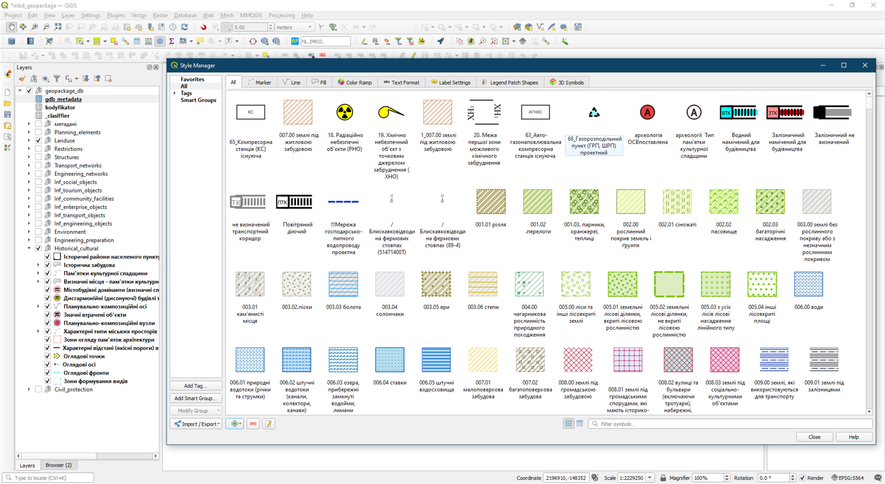
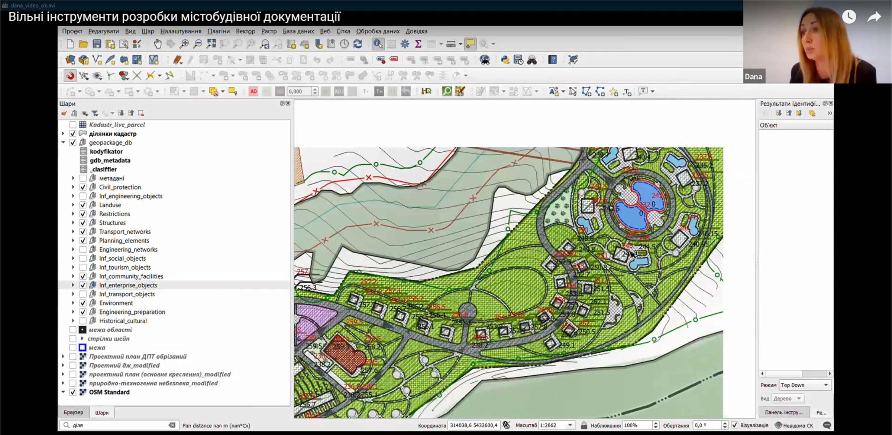

===================================================================================================
Ukrainian open initiative of creating tools for spatial planning in the QGIS environment
===================================================================================================

Introduction
==================

Formed in 2018, Julie's Data is a Ukrainian consulting agency delivering open-source solutions to broad public use. 
We focus mainly on strategic environmental assessment with GIS, urban planning, creating and teaching QGIS courses, and running the crowdsourcing project described below.

Working with local communities for the past few years, Julie's Data formed the concept of solving a particular array of public administration problems dictated by the lack of modern geodata management tools.
One such problem  - is the lack of high-quality, accessible, and legal local geospatial data from cadasters which enables communities to appear on the world investment map and allows them to form a healthy competition of proposals for sustainable development.

In February 2022, two days before the full-scale Russian aggression, the Ukrainian government adopted a decree defining the mandatory structure of spatial planning databases - the primary source of filling and running cadastral systems.

Following its open source attitude, at the beginning of June, Julie's Data (https://juliesdata.com/) launched a crowdsourcing initiative aimed to implement the above mentioned structure with open source tools and called to join everyone to the development of GIS-applied tools for spatial planning using QGIS.

Bringing spatial planning tools into life
==========

The initiative received significant feedback from the community - more than 100 applications from those who willed to join from various regions of Ukraine, including Kherson, Zaporizhzhia, Kharkiv, Chernihiv, Kyiv, Lviv, Ivano-Frankivsk, Poltava, and Vinnytsia regions.

As a result, a group of 62 participants of various specialties was formed - architects, geodesists, surveyors, cartographers, GIS specialists, ecologists, scientists, representatives of local government, and others.
The participants set a goal to create high-quality spatial planning tools (SPT for convenience) based on the approved geodatabase structure so that every interested person can use them freely and without unnecessary operational costs for solving their tasks - in professional urban planning, scientific, educational, or public activity.
Therefore, it was decided to distribute future SPT under the terms of the CC BY-SA license.

For the SPT implementation, QGIS was chosen, as it satisfies the two main requirements of the participants: firstly - to ensure each participant has the opportunity to join the work without obstacles, and the second - to give everyone the ability to use the developed SPT without unnecessary barriers and costs. Most of the participants got acquainted with QGIS for the first time during the project and began to use QGIS in their professional work.

The initiative group was coordinated by its organizers, with regular meetings where tasks, proposals, questions, and problems that arose during the work were discussed.
Most of the communication was in the messenger chat, where constructive discussions were held between the participants in search of the truth.

The working group successfully implemented the database in PostgreSQL and GeoPackage formats and created forms for the classes (layers), including the rules for data integrity approved by requirements for the geospatial database, which were set up in QGIS. The symbol library with the rule-based symbology for each class (layers) was set up in the .qgs project file. Layer style settings for each layer were tested and saved into the geospatial database of the SPT.

   *An example of the symbol library*

Current developments of the initiative group were presented on October 19, 2022, at the open webinar "Free tools for the urban planning documentation development. Presentation of the first stage", which gathered a broad audience of specialists and community representatives from all over Ukraine.

During webinar project members shared their experience not only about participating in the project but also their own experience of using QGIS and their first achievements of urban planning documentation development with the help of created tools.

   *An example of urban plan created with SPT*

We understand that for the broad implementation of GIS into governance, Ukraine needs a solid open-source community. So, among other participants, we invited Anita Grazer, who shared her thoughts on how open-source solutions are used by the Austrian local governments and how they form a sustainable, resistant to challenges society.

The opinions expressed at the webinar resonated with the listeners, as evidenced by more than 600 requests for obtaining an SPT from architects, land managers, representatives of local authorities, university teachers, and scientists.
Anyone can get the current SPT by submitting a web form here: https://juliesdata.com/form/zapit-na-otrimannya-bgd-mistobud. The video recording of the webinar is available on YouTube (https://youtu.be/ZRX1nI5Tkv0/).

Conclusions
===========

Our initiative continues its life and we invite everyone who wants to join it. The most important questions for the next stage are relationships between classes of the geospatial database, tools for  topology rules verification, which are required by law, and also to develop a minimum set of SPT functionality for effective work with spatial documentation for local communities.

In these times of drastic changes, we see the fragility of societies built upon a centralized data infrastructure when the being of communities depends on the will of infrastructure owners.

We believe that our SPT will become one of the applied tools for freedom to explore, create spatial data, and be engaged in political decision-making.

Authors
=======

Yuliia Maksymova, candidate of technical sciences, assistant at the geoinformatics and photogrammetry department of KNUBA, co-founder and GIS specialist in Julie's Data, facebook page https://www.facebook.com/profile.php?id=100006853998055. email: office@juliesdata.com

Oleksii Boiko, GIS specialist, co-founder at Julie's Data, email: contact@juliesdata.com.
