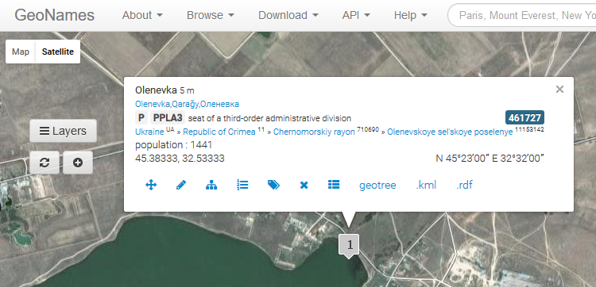

==================================
Historical Gazetteer of the Crimea
==================================

Every day, Ottomanists around the world generate valuable materials as components of their scholarly research, but these materials may not be readily available to scholars with similar interests.  The purpose of the OpenOttoman (Amy Singer, OpenOttoman: A Collaborative Platform for Digital Scholarship, https://networks.hnet.org/node/11419/discussions/166360/openottoman-collaborative-platform-digital-scholarship, 2017) is to stimulate generation of such materials and provide open and convenient access to these materials. The OpenOttoman Portal (http:// www.openottoman.org) (OOP) is one vehicle for accessing these materials.  Materials made available through the OOP include databases, with a prime example being gazetteers of Ottoman world places.  Here, we describe the Historical Gazetteer of the Crimea (HGC), a prototype OOP gazetteer that includes populated places, districts, and provinces of Crimea in existence at the end of the Crimean Khanate.

The primary source of data for the HGC databases is Jankowski’s dictionary of pre-Russian places in Crimea (Henryk Jankowski, Historical-Etymological Dictionary of Pre-Russian Habitation Names of the Crimea, Brill, Leiden, 2006). This source contains a map showing the locations of 137 populated places, 99 of which have been associated with existing places contained in the GeoNames database.  These are the populated place entries in the HGC, with latitude and longitude for these entries being taken from the GeoNames database.

Jankowski’s map also shows boundaries for six provinces and 43 districts.  HGC locations for these features are region centroids approximated using boundaries shown on Jankowski’s map.  The HGC contains entries for 14 of the 16 rivers shown on Jankowski’s map plus 61 additional rivers included to aid in locating populated places and district and province boundaries.

Terrain elevation data (Shuttle Radar Topography Mission (SRTM) data, available at https://lta.cr.usgs.gov/SRTM1Arc) was incorporated into a base map of the region covered by Jankowski’s map.  District and province boundaries were approximated using Jankowski’s map plus terrain features such as rivers, ridge lines, and valleys where boundaries on Jankowski’ map were difficult to trace.  Gazetteer locations for rivers are river mouth latitude and longitude taken from the GeoNames database.  
Per Table 1, the HGC includes three separate sets of databases which can be accessed at http://epublications.marquette.edu/ottoman_crimea/.  This website also provides access to a project named HGC-QGIS-Project.qgs.  Opening the project in QGIS yields the result shown in Figure 1.  For the KML and shape file rivers databases, rivers were traced in QGIS using the Google Maps physical map.

.. figure:: ./images/usa_polczynski_table1.png
   :alt: Gazetteer databases
   :scale: 80%
   :align: right

   Table 1: Gazetteer databases

Opening the project in QGIS yields the result shown in Figure 1.  For the KML and shape file rivers databases, rivers were traced in QGIS using the Google Maps physical map.

.. figure:: ./images/usa_polczynski_figure1.png
   :alt: HGC-QGIS-Project.qgs opened in QGIS
   :scale: 80%
   :align: right

   Figure 1: HGC-QGIS-Project.qgs opened in QGIS.

Table 2 shows the HGC database fields.  Note the manner in which a unique ID is assigned to each place in the database.  Since each Jankowski place is associated with a place in the GeoNames database, and since each place in the GeoNames database has a unique ID given as a URL, the GeoNames URL for the place serves as a unique identifier for the HGC place.  

   Table 2: HGC database fields.

Note that the ID can be opened in a web browser, thereby automatically displaying a GeoNames map with the populated place at its center, as shown in Figure 2. 

   Figure 2: Opening the URL ID for Qarağy in a web browser.

Per Table 2, the fields for the district, province, and river databases are the same as the fields for populated places except that the Page field is left blank, since districts, provinces, and rivers do not appear as entries in Jankowski’s dictionary.  Districts, provinces, and rivers are assigned URL IDs in the same way that they are assigned for populated places.  Thus, in Table 2 the Part of field for the populated place Qarağy is the GeoNames URL for Tarɣan, the district in which this place is located.
The Code and Class fields use the nomenclature employed in the GeoNames database.  Per the example, the P code applies generally to populated places, and the PPLH class (sub-code) applies to historical populated places that no longer exists.

The Confidence field reflects the confidence level of the data captured in a particular database entry.  Because all populated places in the HGC can be associated with existing places in the GeoNames database, they are assigned a confidence level of 1.  Rivers are also assigned a confidence level of 1, since they have been traced directly from Google Maps.

While providing a useful gazetteer, a primary purpose of the HGC was to serve as a test bed and use case for how other Ottoman world gazetteers could be incorporated into the OOP.  Based on experience gained through this project, a new project has been initiated to geolocate approximately 3,000 populated places, rivers, river fords, rapids, islands, forests, mountains, and valleys found on a set of 17th century maps of Ukraine produced by Guillaume Le Vasseur, sieur de Beauplan.  This project directly supports one of the principal investigator’s research on the Polish-Lithuanian Commonwealth /Ottoman Empire frontier.  More generally, this work responds to the need for gazetteers of the Ottoman world as expressed by the OpenOttoman initiative (http://openottoman.org).

Authors
=======

Figure 3: Michael and Mark Polczynski

   Michael and Mark Polczynski

Michael Polczynski (Michael.Polczynski@georgetown.edu) lectures at Georgetown University, where his work focuses on early modern Ottoman and East/Central European history, frontier history, historical geography, diplomacy, and intellectual history.  Michael also studies Late Medieval Eurasian history and 19th century European Emigres in the Ottoman Empire and works extensively with historical GIS and manage several on-line academic communities.

Mark Polczynski (mark.polczynski@marquette.edu) is retired from Marquette University’s College of Engineering, and currently provides technical assistance to the OpenOttoman (openottoman.org), a developing transnational digital collaborative for scholarship and public history focused on the Ottoman world.

