.. _changelog210:


Changelog for QGIS 2.10
=======================

Release date: 2015-06-26

This is the change log for the next release of QGIS - version 2.10.0 '
Pisa' - host city to our developer meet up in March 2010.

**Latest Release**

This is the next release in our 4-monthly release series. It gives you
early access to the new features we have been working on and represents
the 'cutting edge' of QGIS development. If you are working in a
production environment where you wish to be more conservative about
rolling out new features to your users, we also provide a Long Term
Release (LTR) version of QGIS. The current LTR is version 2.8.2 and is
available at `download.qgis.org <http://download.qgis.org>`__. LTR
releases will be supported with backported bug fixes for one year, and
will be in permanent feature freeze (i.e. no new features will be added,
only bug fixes and trivial updates). The features provided in QGIS 2.10
'Pisa' will be included in the next LTR release (slated for release in
2016), so using this release provides you with an excellent opportunity
to test new features that will make their way into the next LTR.

**New Features in QGIS 2.10 'Pisa'**

QGIS 2.10.0 includes many great new features, tweaks and enhancements to
make the most popular Free desktop GIS even more feature filled and
useful. Whenever new features are added to software they introduce the
possibility of new bugs - if you encounter any problems with this
release, please file a ticket `on the QGIS Bug
Tracker <http://hub.qgis.org>`__.

**Thanks**

We would like to thank the developers, documenters, testers and all the
many folks out there who volunteer their time and effort (or fund people
to do so).

From the QGIS community we hope you enjoy this release! If you wish to
donate time, money or otherwise get involved in making QGIS more
awesome, please wander along to `qgis.org <https://qgis.org>`__ and lend
a hand!

Finally we would like to thank our official sponsors for the invaluable
financial support they provide to this project:

-  **GOLD Sponsor:** `Asia Air Survey,
   Japan, <http://www.asiaairsurvey.com/>`__
-  SILVER Sponsor: `Sourcepole AG,
   Switzerland <http://www.sourcepole.com/>`__
-  SILVER Sponsor: `State of Vorarlberg,
   Austria <http://www.vorarlberg.at/>`__
-  SILVER Sponsor: `Office of Public Works, Ireland,
   Ireland <http://www.opw.ie/>`__
-  SILVER Sponsor: `AGH University of Science and Technology, Krakow,
   Poland <http://www.agh.edu.pl/en>`__

-  BRONZE Sponsor: `www.molitec.it, Italy <http://www.molitec.it/>`__
-  BRONZE Sponsor: `www.argusoft.de, Germany <http://www.argusoft.de>`__
-  BRONZE Sponsor: `www.openrunner.com,
   France <http://www.openrunner.com>`__
-  BRONZE Sponsor: `GKG Kassel,(Dr.-Ing. Claas Leiner),
   Germany <http://www.gkg-kassel.de/>`__
-  BRONZE Sponsor: `Customer Analytics,
   USA <http://www.customeranalytics.com/>`__
-  BRONZE Sponsor: `Urbsol, Australia <http://www.urbsol.com.au/>`__
-  BRONZE Sponsor: `MappingGIS, Spain <http://www.mappinggis.com/>`__
-  BRONZE Sponsor: `Lutra Consulting,
   UK <http://www.lutraconsulting.co.uk/>`__
-  BRONZE Sponsor: `ADLARES GmbH, Germany <http://www.adlares.com/>`__
-  BRONZE Sponsor: `Avioportolano Italia,
   Italy <http://www.avioportolano.it/>`__
-  BRONZE Sponsor: `GeoSynergy,
   Australia <http://www.geosynergy.com.au/>`__
-  BRONZE Sponsor: `Gaia3D, South Korea <http://www.gaia3d.com/>`__
-  BRONZE Sponsor: `Royal Borough of Windsor and Maidenhead,
   UK <http://www.rbwm.gov.uk/>`__
-  BRONZE Sponsor: `Chartwell Consultants Ltd,
   Canada <http://www.chartwell-consultants.com/>`__
-  BRONZE Sponsor: `Trage Wegen vzw,
   Belgium <http://www.tragewegen.be/>`__
-  BRONZE Sponsor: `GIS-Support, Poland <http://www.gis-support.com/>`__
-  BRONZE Sponsor: `GIS3W, italy <http://www.gis3w.it/>`__
-  BRONZE Sponsor: `GFI - Gesellschaft fr Informations technologie mbH,
   Germany <http://www.gfi-gis.de/>`__
-  BRONZE Sponsor: `Faculty of Geology, Geophysics and Environmental
   Protection, AGH, University of Science and Technology,
   Poland <http://www.wggios.agh.edu.pl/en>`__

A current list of donors who have made financial contributions large
and small to the project can be seen on our `donors
list <https://qgis.org/en/site/about/sponsorship.html#list-of-donors>`__.
If you would like to become and official project sponsor, please visit
`our sponsorship
page <https://qgis.org/en/site/about/sponsorship.html#sponsorship>`__ for
details. Sponsoring QGIS helps us to fund our six monthly developer
meetings, maintain project infrastructure and fund bug fixing efforts.

QGIS is Free software and you are under no obligation to pay anything to
use it - in fact we want to encourage people far and wide to use it
regardless of what your financial or social status is - we believe
empowering people with spatial decision making tools will result in a
better society for all of humanity.

.. contents::
   :local:

General
-------

Feature: Join parameters can now be edited
~~~~~~~~~~~~~~~~~~~~~~~~~~~~~~~~~~~~~~~~~~

It is now possible to edit join parameters (such as join prefix or
columns to join) after a join has been created. Prior to this change one
had to delete and recreate the whole join.

|image14|

Feature: Layers with joins can now be filtered
~~~~~~~~~~~~~~~~~~~~~~~~~~~~~~~~~~~~~~~~~~~~~~

Prior to version 2.10 a layer couldn't be filtered if it had at least
one join. Now it is still filterable, but only using columns of the
original master table.

|image15|

Feature: General improvements
~~~~~~~~~~~~~~~~~~~~~~~~~~~~~

As well as the numerous items listed below, the following improvements
have been made:

-  Support for Pointcloud layers in PostGIS
-  Improved icon bars and icons in dockable widgets to occupy less
   screen real estate and for improved OSX appearance
-  Improvements to the GRASS plugin / provider
-  Support for non-latin scripts for curved labels
-  Greatly improved and more robust raster calculator and georeferencer
   tools
-  Improved UI and workflow for the data defined label properties window

|image16|

Feature: Improved handling of potential project file overwrites
~~~~~~~~~~~~~~~~~~~~~~~~~~~~~~~~~~~~~~~~~~~~~~~~~~~~~~~~~~~~~~~

QGIS 2.10 will now warn you when attempting to save you project if last
modification date of a loaded project has changed. This is useful if
more than one user or session has the same project file open and are
both attempting to save edits to the project file.

**This feature was developed by:** `Jürgen Fischer
(norBIT) <http://www.norbit.de/>`__

|image17|

Feature: New geometry engine
~~~~~~~~~~~~~~~~~~~~~~~~~~~~

QGIS 2.10 has a new geometry engine. In general you won't see many
differences on the user interface yet, but this lays the foundation for
a much richer set of geospatial capabilities that we will be able to
support in the future. The new implementation supports curved geometry
types (so for example you can represent a traffic roundabout as a circle
rather than a segmented polygon made to look like a circle) and has
backend support for z/m values in geometries. To use curves in QGIS you
will need to use PostGIS or a similar datastore that is able to express
curvilinear geometries. If you want to have a play you can try a simple
exercise like this in your PostGIS database::

 -- Table: curves DROP TABLE curves;
 CREATE TABLE curves (
    id bigserial NOT NULL,
    geometry geometry(CURVEPOLYGON, 4326),
    name text,
    CONSTRAINT p_key PRIMARY KEY (id)
    );
    
 INSERT INTO curves VALUES ( 1, st_geomfromtext(
    'CURVEPOLYGON(CIRCULARSTRING(1 1,1 2, 2 2, 2 1, 1 1))', 4326), 'test');

Then add the layer ``curves`` to your project.

**This feature was developed by:** `Marco Hugentobler (Sourcepole AG) <http://www.sourcepole.ch/>`__

**This feature was funded by:** `KantonSolothurn, Switzerland <http://www.sogis.ch/>`__

|image18|


Analysis tools
--------------

Feature: New statistical summary dock widget
~~~~~~~~~~~~~~~~~~~~~~~~~~~~~~~~~~~~~~~~~~~~

Can display summary statistics (e.g. mean, standard deviation, ...) for
a field or expression from a vector layer or selection. This is provided
by means of a new dock panel that you can activate from the
``View -> Panels -> Statistics`` menu. Please note that you will only be
able to generate statistics on **vector layers** that have a **numeric
column**.

|image1|

Feature: Use logarithmic functions in the raster calculator
~~~~~~~~~~~~~~~~~~~~~~~~~~~~~~~~~~~~~~~~~~~~~~~~~~~~~~~~~~~

The raster calculator (``Raster -> Raster Calculator`` in the QGIS menu)
is a tool that allows you to perform matrix operations on one or more
raster layers. With QGIS 2.10 you can now use ``LN`` and ``LOG10``
functions in the raster calculator.

|image2|

Feature: New zonal statistics features
~~~~~~~~~~~~~~~~~~~~~~~~~~~~~~~~~~~~~~

Zonal statistics provide a way to extract aggregate values for the
pixels underlying a polygon. The following new features have been added
to our zonal statistics tool:

-  you can now select which statistics to calculate
-  extra statistics have been added (median, standard dev, min, max,
   range, minority, majority and variety)
-  ability to select the raster band to use for statistics extraction

Note that zonal stats is a 'core plugin' (a plugin that ships with your
QGIS installer), but is disabled by default. You need to enable it in
the plugin manager and then a menu entry for zonal statistics will
appear in the ``Raster`` menu.

|image3|

Browser
-------

Feature: New browser properties widget
~~~~~~~~~~~~~~~~~~~~~~~~~~~~~~~~~~~~~~

When using the QGIS Browser dock panels (``View -> Panels -> Browser``),
you and now enable a properties widget at the bottom of the file system
tree. Any data source that you click on will have its properties shown
in this panel. This makes it quick and convenient to see basic
information about the dataset you have selected. To toggle the
properties view, you should use the ``i`` icon at the top of the browser
panel.

|image4|

Feature: New browser icon
~~~~~~~~~~~~~~~~~~~~~~~~~

The QGIS Browser is a separate, standalone application that allows you
to browse and view the GIS datasets available to you (from your file
system, database connections, web service connections etc.) In previous
releases of QGIS we used a very similar icon to the QGIS application
itself which has been the source of confusion for many users. In order
to reduce the likeliness of opening the wrong application, we have
created a new icon for QGIS Browser.

|image5|

Data Providers
--------------

Feature: DXF Export Improvements
~~~~~~~~~~~~~~~~~~~~~~~~~~~~~~~~

The DXF export was continuously improved in the last three QGIS
versions. This version introduces an improved SVG or simple marker to
DXF block conversion, fixes a few bugs and issues that resulted in
incomplete (unreadable) DXF files. In the Screenshot you can see the
original view in QGIS on the left and the rendering of the exported DXF
file in Autodesk TrueView on the right.

See also `this article on
qgis.ch <http://www.qgis.ch/en/projects/dxf-export>`__ explaining what
is supported and what not.

**This feature was developed by:** `Jürgen Fischer
(norBIT) <http://www.norbit.de/>`__

**This feature was funded by:** Communities of Morges, Uster, Vevey
and SIGE

|image6|

Feature: PostGIS provider side expression filters
~~~~~~~~~~~~~~~~~~~~~~~~~~~~~~~~~~~~~~~~~~~~~~~~~

In QGIS 2.10 you can now filter features on the database server side.
Only supported expressions will be sent to the database. Expressions
using unsupported operators or functions will gracefully fallback to
local evaluation.

To make use of this feature you need to enable it in
``Settings -> Options -> data sources``. If your filter expression is
PostgreSQL compliant it will automatically be run on the server side.
You can also make use of this feature when using the python API for
example when using these calls.

``QgsFeatureRequest().setFilterExpression( expression )``

or

``QgsVectorLayer::getFeatures( expression )``

|image7|

Data management
---------------

Feature: Virtual fields are now updatable
~~~~~~~~~~~~~~~~~~~~~~~~~~~~~~~~~~~~~~~~~

Prior to version 2.8 you had to delete and recreate virtual fields if
you wanted to change the expression for calculating the virtual field.
In 2.10 you can now go to the ``Fields`` tab and press the small
``Expression`` button to open the expression editor and update the
expression used for the virtual field.

**This feature was developed by:** `Matthias Kuhn
(OpenGIS) <http://www.opengis.ch/>`__

**This feature was funded by:** `City of Uster,
Switzerland <http://gis.uster.ch/>`__

|image8|

Feature: Line edit with auto-completer for ValueRelation edit widget
~~~~~~~~~~~~~~~~~~~~~~~~~~~~~~~~~~~~~~~~~~~~~~~~~~~~~~~~~~~~~~~~~~~~

The value relation edit widget for vector layers
(``Layer -> Properties -> Fields -> Edit Widget -> Value Relation``) can
now be set to autocomplete as you start typing in the input box it
creates on the feature form.

|image9|

Feature: Improvements to DB Manager
~~~~~~~~~~~~~~~~~~~~~~~~~~~~~~~~~~~

There are two new features in the DB Manager :

**Query as layer does not need a unique integer column anymore**

A column with unique integer column is not needed anymore to load an
SQL query as a QGIS layer. An auto-incremented value will be used in
place.

**Integration of an SQL query builder**

A new window in DB Manager helps the creation of SQL queries by means
of widgets where table names, column names and functions can be selected
by the user. It has been ported from the QSpatialite plugin and works
for PostGIS and Spatialite providers.

**These features were funded by**: MEDDE (French Ministry of Sustainable Development)

**These features were developed by**: Hugo Mercier / Oslandia

|image10|

Feature: Filter chaining for relation reference widget
~~~~~~~~~~~~~~~~~~~~~~~~~~~~~~~~~~~~~~~~~~~~~~~~~~~~~~

To select linked entries from other tables one can use the relation
reference widgets. One can either select elements graphically by
selecting them in the map, if the linked feature has a geometry attached
or choose an element by the linked id. To facilitate the non-spatial
selection it is now possible to narrow the available options with
filters (chained or unchained). If the filters are unchained their
choices are combined with "AND" to define the available options. If
chained is checked, a drill-down mode for the filters is activated so
each filter only shows the entries which correspond to the previous
filter. This is useful for selecting from hierarchical data like City ->
Street -> Number.

**This feature was developed by:** `Matthias Kuhn (OpenGIS) <http://www.opengis.ch/>`__

**This feature was funded by:** `SIGE <http://www.sige.ch/>`__

|image11|

Diagrams
--------

Feature: Diagram improvements
~~~~~~~~~~~~~~~~~~~~~~~~~~~~~

The diagram functionality in QGIS allows you to overlay small pie charts
or histograms over features on the map. In this release we have made the
following improvements to diagramming support:

-  Diagrams can be disabled without losing settings
-  Add checkbox to always show diagrams for a layer
-  Diagrams user interface has been refreshed to simplify the dialog and
   make it more user friendly
-  Diagram classes are now shown in the layer's legend

|image12|

Digitising
----------

Feature: Improved geometry rotation tool
~~~~~~~~~~~~~~~~~~~~~~~~~~~~~~~~~~~~~~~~

The geometry rotation tool is an advanced digitising tool that allows
you to arbitrarily rotate a feature's geometry. The following
improvements have been made to the rotation tool:

-  you can now use numerical input in rotation map tool
-  you can use a combo box to set the angles
-  added support for snapping to angles (directly enabled when
   ``using``\ shift + click\`\`)
-  rotation anchor is defined on ``CTRL+click`` and not on mouse move

|image13|


Labelling
---------

Feature: "Follow point" alignment for multiline labels
~~~~~~~~~~~~~~~~~~~~~~~~~~~~~~~~~~~~~~~~~~~~~~~~~~~~~~

When set to this mode, text alignment for labels are dependent on the
final placement of the label relative to the point. Eg, if the label is
placed to the left of the point then the label will be right aligned,
and if it is placed to the right of the point then the label will be
left aligned. This greatly improves the appearance of multiline labels
for point layers.

|image19|

Map Composer
------------

Feature: Add scalebar sizing mode to fit a desired scalebar width
~~~~~~~~~~~~~~~~~~~~~~~~~~~~~~~~~~~~~~~~~~~~~~~~~~~~~~~~~~~~~~~~~

In previous QGISversions it was hard to use graphical scalebars when the
range of potential scales was big. The scalebar would either be quickly
too wide or too narrow and one had to manually adapt the segment sizes
(units per segment) after each scale change. It also meant that
graphical scalebars couldn't be really used in Atlas serial printing or
with QGISserver when the final map scale was unknown. With QGIS2.10 one
can now set min/max sizes for one segment length in mm and QGISwould
automatically adapt the units per segment while still keeping round
values.

Don't forget to also set the alignment of the scalebar, esp. if you want
it to be centered or right-aligned!

**This feature was developed by:** `Sandro Mani (Sourcepole AG) <http://www.sourcepole.ch/>`__

**This feature was funded by:** `Kanton Glarus, Switzerland <http://geo.gl.ch/>`__

|image20|

Programmability
---------------

Feature: Improvements for programmers
~~~~~~~~~~~~~~~~~~~~~~~~~~~~~~~~~~~~~

We have made a number of changes and improvements that will be of
interest to developers:

-  We have upped the minimum requirement for Qt4 to version 4.8. Qt4 is
   one of the main C++ toolkits / libraries we use to create QGIS.
-  New ``QgsStatisticalSummary`` class for calculating statistics from a
   list of numbers.
-  Allow changing vector layer data source.
-  Implicit sharing of classes : ``QgsField``, ``QgsFields``,
   ``QgsDataDefined``, ``QgsFeature``, ``QgsGeometry``.
-  Plugins can now create their own entries in the browser widget with
   two new classes : ``QgsDataItemProvider`` and
   ``QgsDataItemProviderRegistry``.

|image21|

QGIS Server
-----------

Feature: Support for tolerance parameter in WMS GetFeatureInfo requests
~~~~~~~~~~~~~~~~~~~~~~~~~~~~~~~~~~~~~~~~~~~~~~~~~~~~~~~~~~~~~~~~~~~~~~~

When using WMS layers served by QGIS Server, you can now specify the
tolerance for how far from the click origin GetFeatureInfo requests
should be considered. This is important for mobile devices where it is
harder to exactly point to features. Before this new feature, it was
practically impossible to identify point or line features on a mobile
device with QGIS server. You can add the following parameters to your
GetFeatureInfo requests:

FI\_POINT\_TOLERANCE=16&FI\_LINE\_TOLERANCE=8&FI\_POLYGON\_TOLERANCE=4

and change the tolerance values (in pixels) to suit your needs.

**This feature was developed by:** `Marco Hugentobler (Sourcepole AG) <http://www.sourcepole.ch/>`__

**This feature was funded by:** `City of Uster, Switzerland <http://gis.uster.ch/>`__

|image22|

Symbology
---------

Feature: Match categories to existing styles
~~~~~~~~~~~~~~~~~~~~~~~~~~~~~~~~~~~~~~~~~~~~

Add options under categorised renderer advanced menu to set categories
to symbols with a matching name from the style library or an XML style
file.

|image23|

Feature: Vary symbol sizes using the graduated renderer
~~~~~~~~~~~~~~~~~~~~~~~~~~~~~~~~~~~~~~~~~~~~~~~~~~~~~~~

Renderers are the subsystem of QGIS that allow you to create rich
cartographical representations of your data. A graduated renderer varies
the symbology based on a continuously changing value in a vector layer.
In previous versions of QGIS you could only vary the colour (e.g. by
using a colour along a colour ramp). In QGIS 2.10, the graduated symbol
renderer now allows you to to vary size *or* the colour. For point
layers you can vary the point size, for lines you can vary the line
width. Polygon layers retain only the ability to vary by colour, line
width is not yet supported.

**This feature was developed by:** `Vincent Mora (Oslandia) <http://www.oslandia.com/>`__

**This feature was funded by:** `Agence de l'eau Adour-Garonne <http://www.eau-adour-garonne.fr/>`__

|image24|

Feature: New option for preventing the automatic clipping of features to the map extent
~~~~~~~~~~~~~~~~~~~~~~~~~~~~~~~~~~~~~~~~~~~~~~~~~~~~~~~~~~~~~~~~~~~~~~~~~~~~~~~~~~~~~~~

This option (located under the symbol advanced menu) disables the
automatic clipping of lines/polygons to the canvas extent. In some cases
this clipping results in unfavourable symbology (eg centroid fills where
the centroid must always be the actual feature's centroid).

|image25|

Feature: Size scale and rotation have been removed from the advanced menu
~~~~~~~~~~~~~~~~~~~~~~~~~~~~~~~~~~~~~~~~~~~~~~~~~~~~~~~~~~~~~~~~~~~~~~~~~

We have removed ``SizeScale`` and ``Rotation`` from
```Layer -> Properties -> Symbology tab -> Advanced Menu``. You should
rather set rotation on a *per-symbol layer basis* using an expression or
field. The expressions used in old projects are converted to symbol
level **data defined size and angle** properties.

**This feature was developed by:** `Vincent Mora (Oslandia) <http://www.oslandia.com/>`__

**This feature was funded by:** `Agence de l'eau Adour-Garonne <http://www.eau-adour-garonne.fr/>`__

|image26|

Feature: Data defined properties for font marker
~~~~~~~~~~~~~~~~~~~~~~~~~~~~~~~~~~~~~~~~~~~~~~~~

Most properties of the font marker can now be data defined, including
marker size, rotation and character.

|image27|

Feature: Visualise and modify the graduated renderer using a histogram
~~~~~~~~~~~~~~~~~~~~~~~~~~~~~~~~~~~~~~~~~~~~~~~~~~~~~~~~~~~~~~~~~~~~~~

A new histogram tab has been added to the graduated renderer, which
shows an interactive histogram of the values from the assigned field or
expression. Class breaks can be moved or added using the histogram.

**This feature was funded by:** `ADUGA <http://www.aduga.org>`__

**This feature was developed by:** `Nyall Dawson <http://nyalldawson.net/>`__

|image28|

Feature: Size, rotation and stroke-width expressions at the symbollist level
~~~~~~~~~~~~~~~~~~~~~~~~~~~~~~~~~~~~~~~~~~~~~~~~~~~~~~~~~~~~~~~~~~~~~~~~~~~~

Size and Rotation can be defined by an expression for all symbol levels
composing a marker. Width can be defined by an expression for all
symbols composing a line.

For symbols, a legend is generated for varying sizes. This allows
multivariate analysis legend in the case of classified/graduated colors.

An assistant, with preview, is accessible through the data defined
button to help the user define the size expression. Three methods are
available: Flannery, Area and Radius.

**This feature was developed by:** `Vincent Mora (Oslandia) <http://www.oslandia.com/>`__

**This feature was funded by:** `Agence de l'eau Adour-Garonne <http://www.eau-adour-garonne.fr/>`__

|image29|

Feature: Live layer effects for layers and symbol layers
~~~~~~~~~~~~~~~~~~~~~~~~~~~~~~~~~~~~~~~~~~~~~~~~~~~~~~~~

Live layer effects add to the already extensive cartographic
capabilities of QGIS by adding the ability to add various render effects
into the render chain. With live effects you can do things like placing
drop shadows under your symbol, skewing and shearing the rendered
symbol. You can also layer these effects one on top of each other and
set whether the effect should be progressive (i.e. apply itself to the
rendered state thus far) or discrete (by re-injecting the source
geometry back into the render chain).

**Note**: This is functionality for advanced users and we should note
that overuse of this feature can significantly slow down render times,
so you may want to consider having different symbology profiles for your
layer - one for generation of production quality maps and one for draft
mode.

**This feature was developed by:** `Nyall Dawson <http://nyalldawson.net/>`__

**This feature was funded by:** `a crowd-funding initiative <https://www.kickstarter.com/projects/41633306/a-christmas-gift-for-qgis-live-layer-effects-for-q>`__

|image30|

.. |image0| image:: images/projects/qgis-icon_2.png
.. |image1| image:: images/entries/7d52fdffac5546ea3f39ee4dac5dbe19f961703a.png
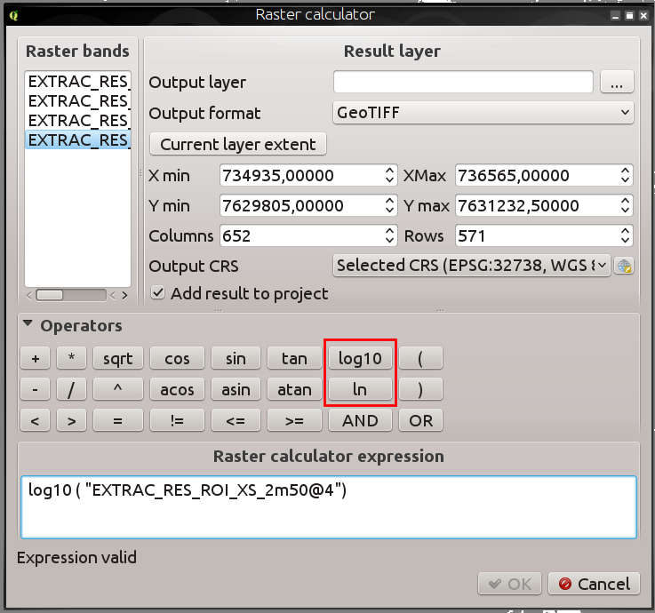
.. |image3| image:: images/entries/d86b8eb8a72d26a0fcb0bf043c9189e14a4ae125.png
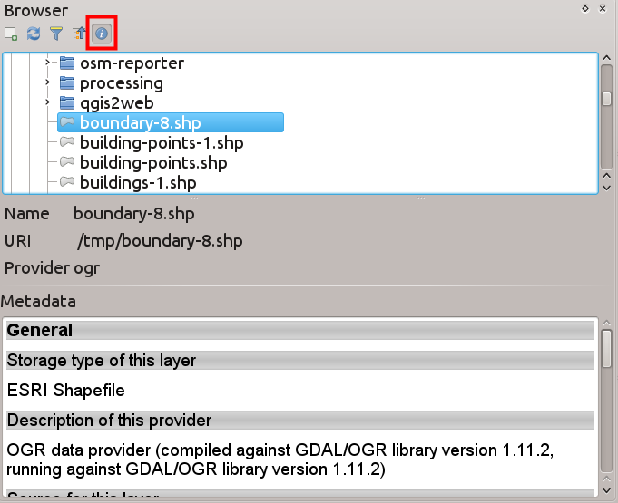
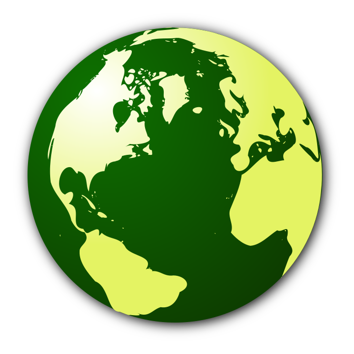
.. |image6| image:: images/entries/b5ee8bd7a3412e429782a5e56954dabee05c36ff.png
.. |image7| image:: images/entries/4d4076579ecc0b5aace30fa2743f616a9b691a02.png
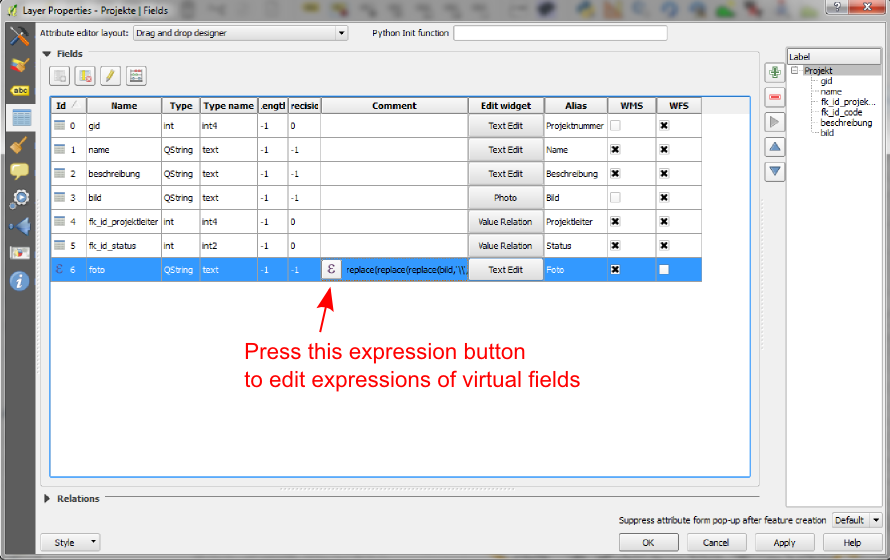
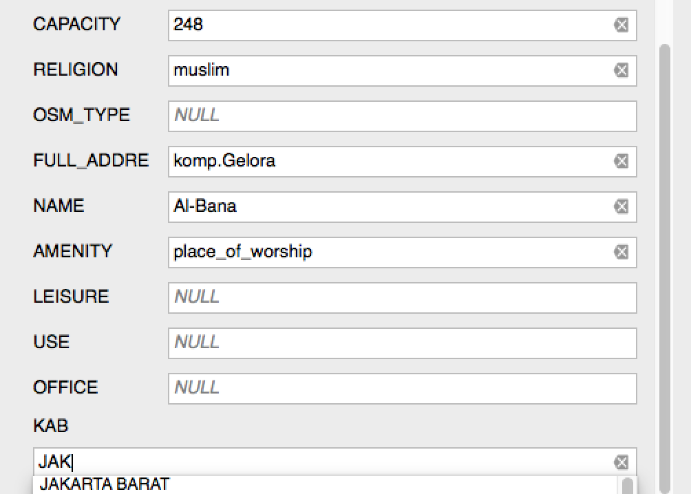
.. |image10| image:: images/entries/f5ad9f81ac37ff4dcfa754f83d23c2700ad4c9f8.png
.. |image11| image:: images/entries/fd0d2e726135033e8e5a61b8a718535074a2ac0c.png
.. |image12| image:: images/entries/cc5753de0538c89e3231f18c7ce62c7bc0afa5e8.png
.. |image13| image:: images/entries/7ff32dd8c7ead358f9ffab4576dff33503154eb2.png
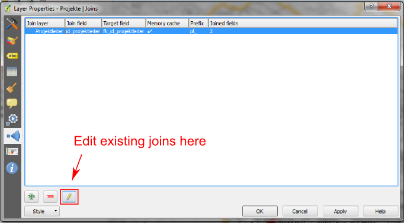
.. |image15| image:: images/entries/a2a93d4e621c1a2cfd976f3b0ec9673739aafda3.png
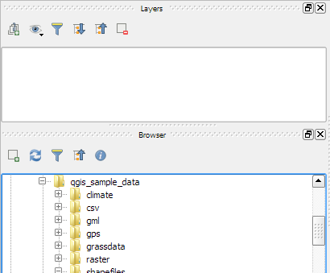
.. |image17| image:: images/entries/c30c07afc9123db564b766339daefe53af3cd348.jpg
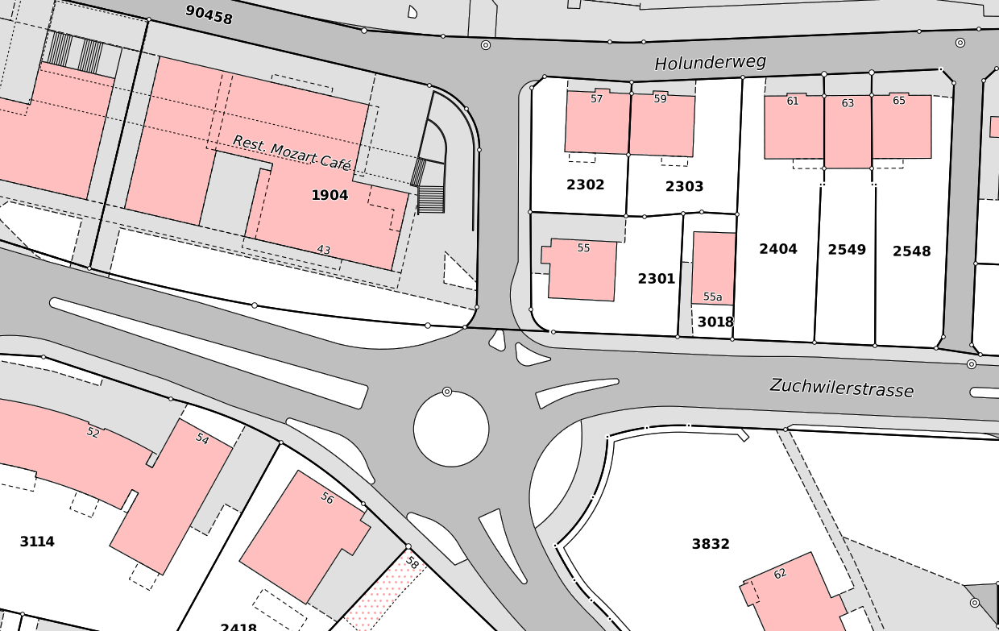
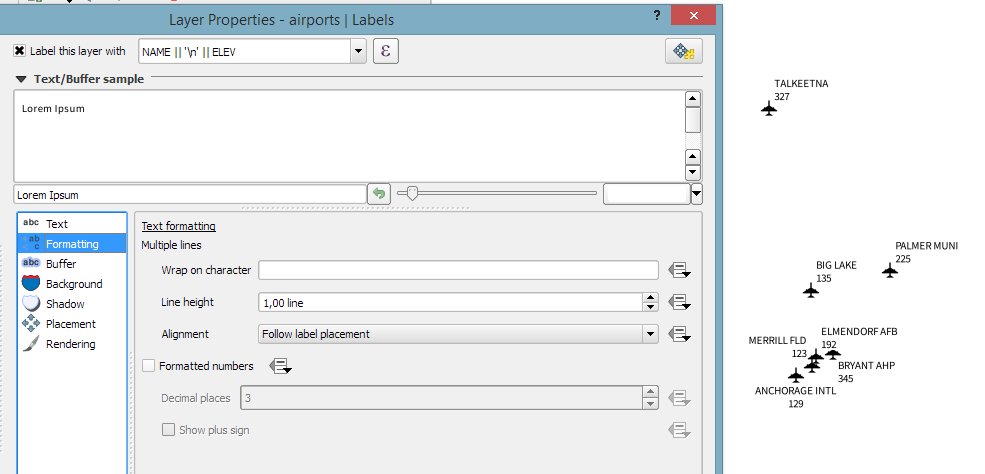
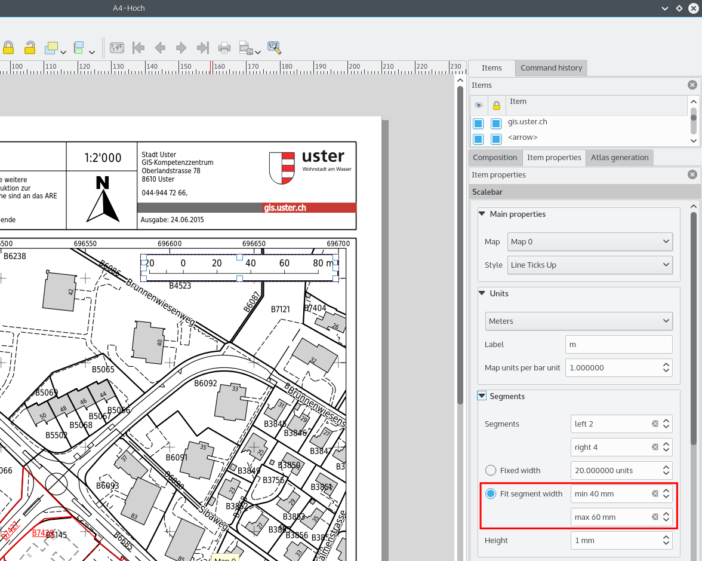
.. |image21| image:: images/entries/c702d89260cbab35323c052a15ab5c5728fc7115.png
.. |image22| image:: images/entries/29470cc51906dffe3a96d3e17a7e8c83b4504a18.png
.. |image23| image:: images/entries/c3fe0d0389c267271cbd47b8c44f52ac079961d7.jpg
.. |image24| image:: images/entries/1d170efe9ca0c76e971cfe0f1d0adb7c4e14f08f.png
.. |image25| image:: images/entries/ecd30b6893fd93d65c95df8f069cc3c3e0fff7be.jpg
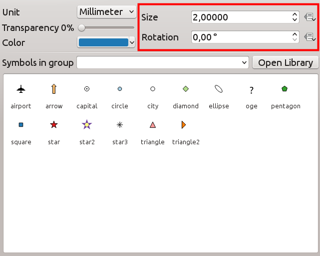
.. |image27| image:: images/entries/9ffd9d3284adcc85d6434f0b97f2db8974a7f647.jpg
.. |image28| image:: images/entries/b519e61b5b50de563203adf8ef35a7c037536332.png
.. |image29| image:: images/entries/30f4392583400a0ed2fbdae3468265b91f39e675.png
.. |image30| image:: images/entries/2ce331bd884c14764989c1bc5e3c4d1f80ec588c.png
