.. _changelog214:


Changelog for QGIS 2.14
=======================

|image1|

Release date: 2016-02-26

This is the changelog for the next release of QGIS - version 2.14 'Essen'.
Essen was the host city to our developer meet ups in October 2012 and 2014.

**Long Term Release**

This is a special release since it is designated an 'LTR' (Long Term Release).
LTR releases will be supported with backported bug fixes for **one year**, and
will be in permanent feature freeze (i.e. no new features will be added, only
bug fixes and trivial updates). Note that we are in discussion to extend the
term of our LTR releases to two years, but for technical reasons we will not do
this until QGIS 3.2.

The purpose of LTR releases is to provide a stable and less frequently changing
platform for enterprises and organizations that do not want to deal with
updating user skills, training materials etc. more than once per year. The
success of the LTR is very much down to you, our beloved users - we need your
support to help funding bug fixes and making sure in your support contracts
with support providers specify that any bug fixes done on your behalf are
applied to the LTR branch as well as our normal development branch.

If an LTR is important to you, please consider also directly supporting the
QGIS project, or encourage your commercial provider to use LTR as a basis for
your enterprise solution so that everyone may benefit from a stable platform
that is being continuously improved and refined. Note that for users and
organizations that like to live on the frontier, our regular four-monthly
releases will continue unabated.

**New Features in QGIS 2.14 'Essen'**

If you are upgrading from QGIS 2.8 (our previous LTR version) you will
find a great many new features in this release. We encourage you to
peruse the changelogs for the intermediate non LTR
`2.10 <../visualchangelog210/>`__ and
`2.12 <../visualchangelog212/>`__ releases as
this QGIS 2.14 includes all features published in those releases too.
Note that 2.14 first enters the regular package repositories and will
not immediately replace 2.8 in the LTR package repositories. That will
happen when 2.16 is released.

Whenever new features are added to software they introduce the
possibility of new bugs - if you encounter any problems with this
release, please file a ticket `on the QGIS Bug
Tracker <http://hub.qgis.org>`__.

**Thanks**

We would like to thank the developers, documenters, testers and all the
many folks out there who volunteer their time and effort (or fund people
to do so). From the QGIS community we hope you enjoy this release! If
you wish to donate time, money or otherwise get involved in making QGIS
more awesome, please wander along to `qgis.org <https://qgis.org>`__ and
lend a hand!

QGIS is supported by donors and sponsors. A current list of donors who
have made financial contributions large and small to the project can be
seen on our `donors
list <https://qgis.org/en/site/about/sponsorship.html#list-of-donors>`__.
If you would like to become an official project sponsor, please visit
`our sponsorship
page <https://qgis.org/en/site/about/sponsorship.html#sponsorship>`__ for
details. Sponsoring QGIS helps us to fund our six-monthly developer
meetings, maintain project infrastructure and fund bug fixing efforts. A
complete list of current sponsors is provided below - our very great
thank you to all of our sponsors!

QGIS is Free software and you are under no obligation to pay anything to
use it - in fact we want to encourage people far and wide to use it
regardless of what your financial or social status is - we believe
empowering people with spatial decision making tools will result in a
better society for all of humanity. If you are able to support QGIS, you
can |donate here|

.. |bronze| image:: /static/site/about/images/bronze.png
          :width: 60 px

.. |silver| image:: /static/site/about/images/silver.png
          :width: 75 px

.. |gold| image:: /static/site/about/images/gold.png
          :width: 100 px


.. contents::
   :local:


Current QGIS Sponsors
---------------------

.. list-table:: Silver sponsors

   * - |silver| |opw|
       `Office of Public Works, Ireland <http://www.opw.ie/>`_, Ireland (12.2014-12.2016)

   * - |silver| |gaia|
       `GAIA mbH <http://www.gaia-mbh.de>`_, Germany (11.2015-11.2016)

   * - |silver| |sourcepole|
       `Sourcepole AG <http://www.sourcepole.com/>`_, Switzerland (10.2014-10.2016)

   * - |silver| |agh|
       `AGH University of Science and Technology <http://www.agh.edu.pl/en>`_, Poland (06.2015-06.2016)

   * - |silver| |vorarlberg|
       `State of Vorarlberg <http://www.vorarlberg.at/>`_, Austria (03.2013-05.2016)


.. |gaia| image:: /static/site/about/images/gaia.png
   :width: 150 px

.. |sourcepole| image:: /static/site/about/images/sourcepole.png
   :width: 150 px

.. |agh| image:: /static/site/about/images/agh.png
   :width: 90 px

.. |vorarlberg| image:: /static/site/about/images/land_f.jpg
   :width: 150 px

.. |opw| image:: /static/site/about/images/opw.jpg
   :width: 150 px


.. Bronze sponsors: NOTE !!! keep these sorted please (latest expiry first) so it is easy to check validity

.. list-table:: Bronze sponsors

   * - |bronze| |geoinnova|

       `Asociación Geoinnova <http://geoinnova.org/>`_, Spain (03.2016-03-2017)
     - |bronze| |gis3w|

       `Gis3W <http://www.gis3w.it/>`_, Italy (01.2014-01.2017)
   * - |bronze| |claasleinert|

       `GKG Kassel,(Dr.-Ing. Claas Leiner) <http://www.gkg-kassel.de/>`_, Germany (03.2014-03.2017)
     - |bronze| |cawdor_forestry|

       `CawdorForestry Resource Management <http://www.cawdorforestry.com/>`_, Scotland (02.2016-02.2017)
   * - |bronze| |chameleon_john|

       `ChameleonJohn <http://www.chameleonjohn.com/>`_, USA (02.2016-02.2017)
     - |bronze| |2d3dgis|

       `2D3D.GIS <http://www.2d3d-gis.com/>`_, France (12.2015-12.2016)
   * - |bronze| |kela|

       `Dr. Kerth + Lampe Geo-Infometric GmbH <http://www.dr-kerth-lampe.de/>`_, Germany (12.2015-12.2016)
     - |bronze| |mappinggis|

       `MappingGIS <http://www.mappinggis.com/>`_, Spain (11.2015-11.2016)
   * - |bronze| |hfacts|

       `HostingFacts.com <https://hostingfacts.com/>`_, Estonia (12.2015-12.2016)
     - |bronze| |urbsol|

       `Urbsol <http://www.urbsol.com.au/>`_, Australia (11.2014-11.2016)
   * - |bronze| |lutra|

       `Lutra Consulting <http://www.lutraconsulting.co.uk/>`_, UK (10.2015-10.2016)
     - |bronze| |whg|

       `WhereGroup GmbH & Co. KG <http://wheregroup.com/>`_, Germany (08.2015-08.2016)
   * - |bronze| |npa|

       `Nicholas Pearson Associates <http://www.npaconsult.co.uk/>`_, UK (07.2015-07.2016)
     - |bronze| |qpolska|

       `QGIS Polska <http://qgis-polska.org/>`_, Poland (07.2015-07.2016)
   * - |bronze| |terrelogiche|

       `www.terrelogiche.com <http://www.terrelogiche.com/>`_, Italy (06.2015-06.2016)
     - |bronze| |geosynergy|

       `www.geosynergy.com.au <http://www.geosynergy.com.au/>`_, Australia (05.2012-05.2013+06.2015-06-2016)
   * - |bronze| |gaia3d|

       `Gaia3D, Inc. <http://www.gaia3d.com/>`_, South Korea (05.2015-05.2016)
     - |bronze| |windsor|

       `Royal Borough of Windsor and Maidenhead <http://www.rbwm.gov.uk/>`_, UK (04.2015-04.2016)
   * - |bronze| |chartwell|

       `Chartwell Consultants Ltd. <http://www.chartwell-consultants.com/>`_, Canada (03.2015-03.2016)
     - |bronze| |tragewegen|

       `Trage Wegen vzw <http://www.tragewegen.be/>`_, Belgium (03.2015-03.2016)
   * - |bronze| |gfi|

       `GFI - Gesellschaft für Informationstechnologie mbH <http://www.gfi-gis.de/>`_, Germany (03.2015-03.2016)
     - |bronze| |gis_supp|

       `GIS-Support <http://www.gis-support.com/>`_, Poland (02.2015-02.2016)
   * - |bronze| |adlares|

       `ADLARES GmbH <http://www.adlares.com/>`_, Germany (01.2015-01.2016)
     - |bronze| |molitec|

       `www.molitec.it <http://www.molitec.it/>`_, Italy (01.2014-01.2016)
   * - |bronze| |argus|

       `www.argusoft.de <http://www.argusoft.de/>`_, Germany (06.2012-06.2013 + 12.2013-12.2015)
     - |bronze| |canal|

       `Customer Analytics <http://www.customeranalytics.com/>`_, USA (12.2014-12.2015)

.. |geoinnova| image:: /static/site/about/images/geoinnova.jpg
   :width: 90 px

.. |cawdor_forestry| image:: /static/site/about/images/cawdor_forestry_logo.png
   :width: 90 px

.. |chameleon_john| image:: /static/site/about/images/chameleon-john-logo.png
   :width: 90 px

.. |kela| image:: /static/site/about/images/kela.png
   :width: 64 px

.. |hfacts| image:: /static/site/about/images/hfacts.png
   :width: 90 px

.. |whg| image:: /static/site/about/images/whg.jpg
   :width: 90 px

.. |npa| image:: /static/site/about/images/npa.jpg
   :width: 64 px

.. |qpolska| image:: /static/site/about/images/qpolska.png
   :width: 64 px

.. |terrelogiche| image:: /static/site/about/images/terrelogiche.jpg
   :width: 64 px

.. |geosynergy| image:: /static/site/about/images/geosynergy.jpg
   :width: 90 px

.. |gaia3d| image:: /static/site/about/images/gaia3d.png
   :width: 64 px

.. |windsor| image:: /static/site/about/images/windsor.png
   :width: 90 px

.. |chartwell| image:: /static/site/about/images/chartwell.png
   :width: 64 px

.. |tragewegen| image:: /static/site/about/images/tragewegen.png
   :width: 64 px

.. |gfi| image:: /static/site/about/images/gfi.png
   :width: 64 px

.. |claasleinert| image:: /static/site/about/images/claasleiner.png
   :width: 64 px

.. |gis_supp| image:: /static/site/about/images/gis_supp.png
   :width: 64 px

.. |adlares| image:: /static/site/about/images/adlares.png
   :width: 64 px

.. |molitec| image:: /static/site/about/images/molitec.png
   :width: 64 px

.. |argus| image:: /static/site/about/images/argus.jpg
   :width: 64 px

.. |canal| image:: /static/site/about/images/canal.png
   :width: 64 px

.. |avioportolano| image:: /static/site/about/images/avioportolano.png
   :width: 64 px

.. |wggios| image:: /static/site/about/images/wggios.png
   :width: 64 px

.. |urbsol| image:: /static/site/about/images/urbsol.png
   :width: 64 px

.. |mappinggis| image:: /static/site/about/images/mappinggis.png
   :width: 64 px

.. |2d3dgis| image:: /static/site/about/images/2d3dgis.png
   :width: 64 px

.. |gis3w| image:: /static/site/about/images/gis3w.png
   :width: 64 px

.. |lutra| image:: /static/site/about/images/lutra_consulting.png
   :width: 64 px


General
-------

Feature: Changed behaviour of strpos function
~~~~~~~~~~~~~~~~~~~~~~~~~~~~~~~~~~~~~~~~~~~~~


The strpos function behaviour has been altered, so that no match now
results in a "0" value and a non-zero value means a match at the
specified character position. In older QGIS versions, a "-1" value would
mean no-match and other return values represented the character position
- 1.

Project files from earlier QGIS versions will need to be updated to
reflect this change.

|image47|

This feature was developed by Jürgen Fischer

Feature: Zoom to feature with right-click in attribute table
~~~~~~~~~~~~~~~~~~~~~~~~~~~~~~~~~~~~~~~~~~~~~~~~~~~~~~~~~~~~


You can now zoom to any feature from within the attribute table (without
having to select it first) by right-clicking and selecting zoom to
feature.

|image48|

Feature: Speed and memory improvements
~~~~~~~~~~~~~~~~~~~~~~~~~~~~~~~~~~~~~~


-  **Saving a set of selected features** from a large layer is now much
   faster
-  Updating only selected features using the **field calculator** is
   faster
-  **Faster zoom** to selected on large layers
-  Much faster ``get_feature`` expression function (especially when
   an indexed column in the referenced layer is used)
-  ``SelectByAttribute`` and ``ExtractByAttribute`` processing
   algorithms are orders of magnitude faster, and can take advantage of
   database indices created on an attribute
-  ``PointsInPolygon`` processing algorithm is many magnitudes faster
-  **Filtering the categories in a categorised renderer** (eg, only
   showing some categories and unchecking others) is much faster, as now
   only the matching features are fetched from the data provider
-  Significant **reduction in the memory** required for opening large
   vector layers

Feature: More expression variables
~~~~~~~~~~~~~~~~~~~~~~~~~~~~~~~~~~


During rendering, new variables will be available:

-  ``@geometry_part_count``: The part count of the currently rendered
   geometry (interesting for multi-part features)
-  ``@geometry_part_num``: 1-based index of the currently rendered
   geometry part

These are useful to apply different styles to different parts of
multipart features:

-  ``@map_extent_width``: The width of the currently rendered map in map
   units
-  ``@map_extent_height``: The height of the currently rendered map in
   map units
-  ``@map_extent_center``: The center point of the currently rendered
   map in map units

Variables relating to the operating system environment have also been
added:

-  ``@qgis_os_name``: eg 'Linux','Windows' or 'OSX'
-  ``@qgis_platform``: eg 'Desktop' or 'Server'
-  ``@user_account_name``: current user's operating system account name
-  ``@user_full_name``: current user's name from operating system
   account (if available)

|image49|

This feature was funded by Andreas Neumann (the OS and user related
variables)

This feature was developed by Nyall Dawson, Matthias Kuhn

Feature: Better control over placement of map elements
~~~~~~~~~~~~~~~~~~~~~~~~~~~~~~~~~~~~~~~~~~~~~~~~~~~~~~


QGIS 2.14 has gained finer control over the placement of north arrows,
scale bars and copyright notices on the main map canvas. You can now
precisely set the position of these elements using a variety of units
(including millimeters, pixels and percent).

|image50|

Feature: Paid bugfixing programme
~~~~~~~~~~~~~~~~~~~~~~~~~~~~~~~~~


Prior to each release, we hold a paid bugfixing programme where we fund
developers to clean up as many bugs as possible. We have decided to
start including a report back on the paid bugfixing programme as part of our
changelog report. Note that this list is **not exhaustive**.

-  Sandro Santilli: `Postgis Connection freeze if you press "Set filter"
   during loading of data <http://hub.qgis.org/issues/13141>`__
-  Sandro Santilli: `db\_manager is unable to load rasters from
   connections with no dbname
   specified <http://hub.qgis.org/issues/10600>`__
-  Sandro Santilli: `Plugin layers do not work correctly with
   rotation <http://hub.qgis.org/issues/11900>`__
-  Sandro Santilli: Crash in QgsGeomColumnTypeThread stopping connection
   scan `#14140 <http://hub.qgis.org/issues/14140>`__
   `#13806 <http://hub.qgis.org/issues/13806>`__
-  Sandro Santilli: `Crash after bulk change of attribute value in
   shapefile <http://hub.qgis.org/issues/11422>`__
-  Sandro Santilli: `KMZ causes QGIS application crash
   (Mac) <http://hub.qgis.org/issues/13865>`__
-  Sandro Santilli: `QGIS 2.8.1 crash opening FileGDB
   (openGDB-Driver) <http://hub.qgis.org/issues/12416>`__
-  Sandro Santilli: `QGIS crashes when removing vertex of a multipart
   geometry <http://hub.qgis.org/issues/14188>`__
-  Sandro Santilli: `test -V -R qgis\_analyzertest
   segfaults <http://hub.qgis.org/issues/14176>`__
-  Sandro Santilli: `output/bin/qgis\_diagramtest
   segfaults <http://hub.qgis.org/issues/14212>`__
-  Sandro Santilli: Overflow on primary key with negative values;
   crashes QGIS when editing
   `#13958 <http://hub.qgis.org/issues/13958>`__
   `#14262 <http://hub.qgis.org/issues/14262>`__
-  Sandro Santilli: `PyQgsPostgresProvider test hangs in absence of test
   database <http://hub.qgis.org/issues/14269>`__
-  Sandro Santilli: `TestVectorLayerJoinBuffer hangs if database is not
   available <http://hub.qgis.org/issues/14308>`__
-  Nyall Dawson: `BLOCKER: Crash when opening layer properties dialog
   for geometryless vector layer <http://hub.qgis.org/issues/14116>`__
-  Nyall Dawson: Broken server side filtering for OGR, Oracle and
   Spatialite layers
-  Nyall Dawson: `BLOCKER: Bad polygon digitizing in
   master <http://hub.qgis.org/issues/14117>`__
-  Nyall Dawson: `BLOCKER: Heatmap with expression triggers
   segfault <http://hub.qgis.org/issues/14127>`__
-  Nyall Dawson: `BLOCKER: unchecking one sub-layer of a categorized
   symbology leads to no features being
   drawn <http://hub.qgis.org/issues/14118>`__
-  Nyall Dawson: `HIGH: A Multiband image(e.g. landsat5,7,8) cannot be
   displayed in windows8 <http://hub.qgis.org/issues/13155>`__
-  Nyall Dawson: `BLOCKER: CurvePolygons not
   drawn <http://hub.qgis.org/issues/14028>`__
-  Nyall Dawson: `BLOCKER: "Merge Attributes" tool doesn't change values
   when they are typed <http://hub.qgis.org/issues/14146>`__
-  Nyall Dawson: `HIGH: Filter legend by content is broken when renderer
   contains duplicate symbols <http://hub.qgis.org/issues/14131>`__
-  Nyall Dawson: Fix issues with conversion of renderers to rule based
   renderer resulting in broken renderer
-  Nyall Dawson: Fix categorised renderer does not store changes to the
   source symbol
-  Nyall Dawson: `HIGH: Avoid crash with raster calculator and huge
   raster inputs <http://hub.qgis.org/issues/13336>`__
-  Nyall Dawson: `HIGH: @value variable of simple symbol fill color
   wrongly gets modified in data-defined
   expression <http://hub.qgis.org/issues/14148>`__
-  Nyall Dawson: `HIGH: Editing Composer legend while filtered does not
   work <http://hub.qgis.org/issues/11459>`__
-  Nyall Dawson: `NORMAL: Deleting nodes - inconsistent
   behaviour <http://hub.qgis.org/issues/14168>`__
-  Nyall Dawson: Fix handling of time value in attributes
-  Nyall Dawson: Dialog tab order fixes
-  Nyall Dawson: `BLOCKER: crash when adding multiple files from browser
   panel <http://hub.qgis.org/issues/14223>`__
-  Nyall Dawson: `HIGH: Merge selected features tool corrupts data when
   columns are defined as "hidden" <http://hub.qgis.org/issues/14235>`__
-  Nyall Dawson: Correctly handle LongLong fields in merge attribute
   dialog
-  Nyall Dawson: Fix misleading display of calculation details in
   measure tool dialog (was misleading and inaccurate for many CRS/unit
   combinations)
-  Nyall Dawson: `NORMAL: max value for option "increase size of small
   diagrams" not sufficient <http://hub.qgis.org/issues/14282>`__
-  Nyall Dawson: `BLOCKER: Area not calculated correctly with OTF
   on <http://hub.qgis.org/issues/13209>`__
-  Nyall Dawson: `NORMAL: Incoherent lat/lon coordinates in a projected
   coordinate system project <http://hub.qgis.org/issues/9730>`__
-  Nyall Dawson: NORMAL: make the field calculator compute areas and
   lengths in units other than map units
   `#12939 <http://hub.qgis.org/issues/12939>`__
   `#2402 <http://hub.qgis.org/issues/2402>`__
   `#4857 <http://hub.qgis.org/issues/4857>`__
-  Nyall Dawson: `NORMAL: different built-in tools calculate
   inconsistent polygon areas <http://hub.qgis.org/issues/4252>`__
-  Nyall Dawson: `NORMAL: In virtual fields $area function computes
   always values using "None/planimetric"
   ellipsoid <http://hub.qgis.org/issues/12622>`__
-  Martin Dobias: raster layer drawn as garbage
-  Martin Dobias: HIGH: Multi-threaded rendering and OTF reprojection
   issues `#11441 <http://hub.qgis.org/issues/11441>`__
   `#11746 <http://hub.qgis.org/issues/11746>`__
-  Martin Dobias: `BLOCKER: Regression in "save as" dialog for
   shapefiles <http://hub.qgis.org/issues/14158>`__
-  Martin Dobias: Slow loading of attribute table in debug mode
-  Martin Dobias: `BLOCKER: Crash when changing renderer
   type <http://hub.qgis.org/issues/14164>`__
-  Martin Dobias: `HIGH: Custom python renderer issues
   #1 <http://hub.qgis.org/issues/14025>`__
-  Martin Dobias: `HIGH: Custom python renderer issues
   #2 <http://hub.qgis.org/issues/13973>`__
-  Martin Dobias: 2.5d renderer fixes
-  Martin Dobias: `HIGH: Long freeze when initializing
   snapping <http://hub.qgis.org/issues/12578>`__
-  Martin Dobias: `NORMAL: Loading of data-defined from
   xml <http://hub.qgis.org/issues/14177>`__
-  Martin Dobias: Fix DB manager to work with SpatiaLite < 4.2
-  Martin Dobias: `NORMAL: Crash while rendering in debug
   mode <http://hub.qgis.org/issues/14369>`__
-  Martin Dobias: BLOCKER: Fix selection / identification in spatialite
   views `#14232 <http://hub.qgis.org/issues/14232>`__
   `#14233 <http://hub.qgis.org/issues/14233>`__
-  Martin Dobias: `BLOCKER: Fix drag&drop of spatialite
   tables <http://hub.qgis.org/issues/14237>`__
-  Jürgen Fischer:\ `Zoom to layer works incorrectly while layer
   editing <http://hub.qgis.org/issues/3155>`__
-  Jürgen Fischer:\ `Help viewer process running in the background with
   no help viewer (or even QGIS)
   open <http://hub.qgis.org/issues/8305>`__
-  Jürgen Fischer:\ `Spatialindex include path missing in some
   components <http://hub.qgis.org/issues/13197>`__
-  Jürgen Fischer:\ `compile fails attempting to generate
   qgsversion.h <http://hub.qgis.org/issues/13680>`__
-  Jürgen Fischer:\ `Edit widget configuration is stored
   twice <http://hub.qgis.org/issues/13960>`__
-  Jürgen Fischer:\ `Extra space in "IS NOT" operator makes the
   expression return wrong
   selection <http://hub.qgis.org/issues/13938>`__
-  Jürgen Fischer:\ `QGIS greadily allocates memory and crashes when
   editing moderately large shapefiles with the node
   tool <http://hub.qgis.org/issues/13963>`__
-  Jürgen Fischer:\ `French reprojection use ntf\_r93.gsb (IGNF:LAMBE
   etc ..) <http://hub.qgis.org/issues/14101>`__
-  Jürgen Fischer:\ `Digitizing: "Reuse last entered attribute values"
   should not overwrite primary key
   column <http://hub.qgis.org/issues/14154>`__
-  Jürgen Fischer:\ `Issues in Case expression
   description <http://hub.qgis.org/issues/14189>`__
-  Jürgen Fischer:\ `shapefile vector writer: datetime field saved as
   date resulting in data loss of
   time <http://hub.qgis.org/issues/14190>`__
-  Jürgen Fischer:\ `Add help for some variable
   functions <http://hub.qgis.org/issues/14259>`__
-  Jürgen Fischer:\ `Virtual layers not working in
   Processing <http://hub.qgis.org/issues/14313>`__
-  Jürgen Fischer:\ `layer definition file load
   error <http://hub.qgis.org/issues/14340>`__
-  Jürgen Fischer:\ `QgsGeometry::fromWkb fails if WKB is different
   endian representation <http://hub.qgis.org/issues/14204>`__
-  Jürgen Fischer:\ `Debian build
   failure. <http://hub.qgis.org/issues/14248>`__
-  Jürgen Fischer:\ `PyQgsPostgresProvider test hangs in absence of test
   database <http://hub.qgis.org/issues/14269>`__
-  Jürgen Fischer:\ `wkb access out of
   bounds <http://hub.qgis.org/issues/14315>`__
-  Jürgen Fischer:\ `QGIS under Windows netCDF import reverses Y axis,
   Linux doesn't <http://hub.qgis.org/issues/14316>`__ `OSGeo4W
   #483 <https://trac.osgeo.org/osgeo4w/ticket/483>`__
-  Jürgen Fischer:\ `OSGEO4W: Running offline install crashes
   installer <https://trac.osgeo.org/osgeo4w/ticket/105>`__
-  Jürgen Fischer:\ `OSGEO4W: Dependencies are not tracking on Windows
   Server 2003 x64 <https://trac.osgeo.org/osgeo4w/ticket/117>`__
-  Jürgen Fischer:\ `OSGEO4W: installation from local package don't
   check the dependencies <https://trac.osgeo.org/osgeo4w/ticket/151>`__
-  Jürgen Fischer:\ `OSGEO4W: Setup starts downloading and installing
   packages before showing you a list to choose
   from <https://trac.osgeo.org/osgeo4w/ticket/262>`__
-  Jürgen Fischer:\ `OSGEO4W: Using -a for Advanced selects two options
   (command line install) <https://trac.osgeo.org/osgeo4w/ticket/351>`__
-  Jürgen Fischer:\ `OSGEO4W: Infinite license download during quite
   installation of szip <https://trac.osgeo.org/osgeo4w/ticket/486>`__
-  Jürgen Fischer:Oracle provider deadlock
-  Jürgen Fischer:fix saga path setting

Feature: Field calculator can be used to update feature's geometry
~~~~~~~~~~~~~~~~~~~~~~~~~~~~~~~~~~~~~~~~~~~~~~~~~~~~~~~~~~~~~~~~~~


The field calculator can now be used to update feature geometries
using the result of a geometric expression. This is a handy shortcut to
do operations such as apply a buffer to a group of selected features,
and together with all the newly added geometry functions in 2.14 makes
for a very handy way to manipulate your geometries!

|image51|

This feature was developed by `Nyall Dawson <http://nyalldawson.net>`__

Feature: New expression functions in 2.14
~~~~~~~~~~~~~~~~~~~~~~~~~~~~~~~~~~~~~~~~~


Lots of new expression functions have been added for version 2.14:

-  ``relate``: performs a DE-9IM geometry relation by either returning
   the DE-9IM representation of the relationship between two geometries,
   or by testing whether the DE-9IM relationship matches a specified
   pattern.
-  the ``make_point`` function now accepts optional z and m values, and
   a new ``make_point_m`` function has been added for creation of PointM
   geometries.
-  ``m`` and ``z`` functions for retrieving the m and z values from a
   point geometry
-  new ``make_line`` and ``make_polygon`` functions, for creation of
   line and polygon geometries from a set of points
-  ``reverse``, for reversing linestrings
-  ``eval`` function, which can evaluate a string as though it is an
   expression of its own
-  ``translate`` function, for translating geometries by an x/y offset
-  ``darker`` and ``lighter`` functions, which take a color argument and
   make it darker or lighter by a specified amount
-  ``radians`` and ``degrees``: for converting angles between radians
   and degrees
-  ``point_on_surface``: returns a point on the surface of a geometry
-  ``exterior_ring``: returns the exterior ring for a polygon geometry
-  ``is_closed``: returns true if a linestring is closed
-  new geometry accessor functions: ``geometry_n`` (returns a specific
   geometry from within a collection), ``interior_ring_n`` (returns an
   interior ring from within a polygon)
-  ``num_geometries``: returns number of geometries inside a collection
-  ``num_rings``: returns number of rings in a polygon geometry object
-  ``num_interior_rings``: returns number of interior rings in a polygon
-  ``nodes_to_points``, for converting every node in a geometry to a
   multipoint geometry
-  ``segments_to_lines``, for converting every segment in a geometry to
   a multiline geometry
-  ``closest_point``: returns closest point in a geometry to a second
   geometry
-  ``shortest_line``: returns the shortest possible line joining two
   geometries

``nodes_to_points`` and ``segments_to_lines`` are intended for use with
geometry generator symbology, eg to allow use of m and z values for
nodes/lines with data defined symbology.

Other improvements:

-  geometries and features can now be used in conditional functions. For
   instance, this allows expressions like
   ``case when $geometry then ... else ...`` and
   ``case when get_feature(...) then ... else ...``

|image52|


Analysis tools
--------------

Feature: More statistics available in merge attributes tool
~~~~~~~~~~~~~~~~~~~~~~~~~~~~~~~~~~~~~~~~~~~~~~~~~~~~~~~~~~~


When using either the merge attribute values or merge features tool,
there are additional summary statistics available which can be used to
set the resultant attribute values. These include Q1, Q3, inter-quartile
ranges, majority and minority values, and number of unique values,
amongst others.

|image27|

This feature was developed by `Nyall Dawson <http://nyalldawson.net>`__

Feature: z/m values are shown when using the identify tool
~~~~~~~~~~~~~~~~~~~~~~~~~~~~~~~~~~~~~~~~~~~~~~~~~~~~~~~~~~


The identify tool is now able to show any z or m value present in the
identified features. If the feature is a line or polygon, the tool will
show the vertex number and x/y/z/m for the nearest vertex to the
identified point. The identify tool now also shows the number of parts
and part number for collections.

|image28|

This feature was developed by `Nyall Dawson <http://nyalldawson.net>`__

Feature: Unified handling of distance and area units and coordinate formats
~~~~~~~~~~~~~~~~~~~~~~~~~~~~~~~~~~~~~~~~~~~~~~~~~~~~~~~~~~~~~~~~~~~~~~~~~~~


In QGIS 2.14 the handling of various options regarding distance units,
area units and coordinate display have been unified, simplified, and
moved to Project Properties. This change brings numerous benefits,
including:

-  The coordinate format specified in Project Properties is consistently
   used whenever a coordinate is displayed to the user, including the
   identify tool results and the status bar display.
-  The setting for distance and area units in Project Properties is
   respected for all distance and area calculations, including the
   measure tool, identify results, and use of the ``$area``, ``$length``
   and ``$perimeter`` functions.
-  Additional area units have been added, including square yards,
   acres, hectares and more.
-  Additional angular units have been added to the angle measurement
   tool, including rotations, minutes of arc and seconds of arc.
-  It's now possible to show the coordinates in latitude and longitude
   in the status bar even when using a projected CRS.

|image29|

This feature was funded by QGIS sponsored bug fixing program

This feature was developed by `Nyall Dawson <http://nyalldawson.net>`__

Browser
-------

Feature: Browser Improvements
~~~~~~~~~~~~~~~~~~~~~~~~~~~~~


The QGIS Browser is a filesystem, OGC Web Services and Database
Connection panel that lets you easily drag and drop any layer from the
aforementioned sources into your map canvas (or into the DB Manager
window). Two useful new improvements were added for this release:

-  **Paths can be selectively hidden from the browser panel** - this is
   useful to declutter your sources list and focus only on relevant
   directories.
-  **Load projects directly from the browser** - now you can drag and
   drop a whole project into the QGIS map canvas and it will be loaded.

|image30|

This feature was developed by Nathan Woodrow

Data Providers
--------------

Feature: Cache WMS capabililies
~~~~~~~~~~~~~~~~~~~~~~~~~~~~~~~


QGIS will now cache WMS ``GetCapabilities`` requests so that on
subsequent use response times will be quicker when using that service.
By default the cache period is 24 hours, but you can adjust this in the
``Network`` tab of the QGIS Settings dialog.

|image31|

This feature was developed by Jürgen Fischer

Feature: Curved geometry support expanded
~~~~~~~~~~~~~~~~~~~~~~~~~~~~~~~~~~~~~~~~~


The delimited text provider now supports curved WKT strings, and the
memory provider (eg "temporary scratch" layers) has gained full support
for curved geometries. Additionally, if QGIS has been built using GDAL
versions 2.0 and up then QGIS will fully support curved geometries in
supported file types (eg GML files).

|image32|

This feature was developed by `Nyall Dawson <http://nyalldawson.net>`__

Feature: Better handling of time and datetime fields
~~~~~~~~~~~~~~~~~~~~~~~~~~~~~~~~~~~~~~~~~~~~~~~~~~~~


QGIS 2.14 has improved handling of time and datetime field types,
including:

-  PostgreSQL timestamp fields are correctly handled
-  The expression engine now has full support for time fields
-  The expression builder now shows preview calculation results for
   date, time, date time and interval calculations
-  Time fields are fully supported by vector file layers (depending on
   file format), PostgreSQL, MS SQL Server and temporary scratch layers
-  Saving layers to vector files will preserve time fields if supported
   by vector layer format (eg MapInfo .tab files)

|image33|

This feature was developed by Jürgen Fischer, Nyall Dawson

Feature: Z/M support in delimited text provider
~~~~~~~~~~~~~~~~~~~~~~~~~~~~~~~~~~~~~~~~~~~~~~~


The delimited text provider has gained support for WKT strings
containing Z and M coordinates. For example you can express a point with
z and measure elements like this : ``POINT ZM (1 1 5 60)``.

|image34|

This feature was developed by `Nyall Dawson <http://nyalldawson.net>`__

Feature: Transaction groups for postgres editing
~~~~~~~~~~~~~~~~~~~~~~~~~~~~~~~~~~~~~~~~~~~~~~~~


A new option has been introduced to enable transactional editing.

When this option is enabled

-  All layers from the same database are put into a transaction group
-  When the first layer of a group is put into edit mode, all others are
   also put into edit mode automatically
-  When a layer is edited, the changes are sent to the database
   immediately, allowing triggers and constraints to be applied
   immediately
-  When one layer in a transaction group is committed, all layers are
   committed (database transaction)
-  When one layer in a transaction group is rolled back, all layers are rolled
   back (database transaction)

This feature is currently **Experimental**. If you find any problems,
please `report
them <https://www.qgis.org/en/site/getinvolved/development/bugreporting.html>`__.

This is only implemented for postgres databases at the moment.

|image35|

This feature was funded by `SIGE <http://www.sige.ch/>`__

This feature was developed by `Matthias Kuhn, OPENGIS.ch, based on work
by Sourcepole <https://opengis.ch>`__

Feature: Postgres provider PKI authentication
~~~~~~~~~~~~~~~~~~~~~~~~~~~~~~~~~~~~~~~~~~~~~


The ability to use the QGIS Authentication Manager introduced in 2.12
has been extended to the PostGIS provider. This allows connecting to
Postgres using basic or PKI authentication, with the credentials stored
in the QGIS configuration. The new Postgres provider authentication can
also be used in the DB manager.

|image36|

This feature was funded by `Boundless Spatial <boundlessgeo.com>`__

This feature was developed by Luigi Pirelli

Feature: Virtual layers
~~~~~~~~~~~~~~~~~~~~~~~


Dynamic SQL queries can now be used on any kind of vector layers that
QGIS is able to load, even if it the layer format itself has no support
for SQL queries!

A new kind of vector layer called "virtual layer" is now available for
that purpose. These allow you to create a virtual layer by defining a
query (including support for aggregates and joins) from other layers in
your project. The resultant layer will be a live, dynamic view of the
query result, so any changes to the source layers will be automatically
and immediately reflected in the virtual layer!

The supported SQL dialect is SQLite with Spatialite functions. QGIS
expression functions can also be used in queries. Any kind of vector
layers can be accessed in the query, including multiple layers from
different data providers to make joins.

Support for virtual layers has also been added to DB Manager as well as
to the Processing toolbox where a new 'Execute SQL' tool is available.

|image37|

This feature was funded by `MEDDE (French Ministry of Sustainable
Development) <http://www.developpement-durable.gouv.fr>`__

This feature was developed by `Hugo Mercier /
Oslandia <http://oslandia.com>`__

Feature: More file extensions for GDAL and OGR providers file selectors
~~~~~~~~~~~~~~~~~~~~~~~~~~~~~~~~~~~~~~~~~~~~~~~~~~~~~~~~~~~~~~~~~~~~~~~


For vector and raster files, QGIS relies on the GDAL/OGR library. It means
that nearly any file format that can be opened by GDAL or OGR can be
directly opened in QGIS.
Until now, some file extensions were not added in the GDAL or OGR
file selector, resulting in users believing that QGIS could not open or
handle those file formats. To minimise this problem, some new extensions
have been added to GDAL and OGR file selector filters:

**For vector files:**

-  .thf for EDIGEO French cadastre format
-  .ods for OpenDocument Spreadsheet LibreOffice format
-  .xls for Microsoft Excel format
-  .xlsx for Microsoft Excel OpenXML format
-  .xml for NAS - ALKIS format
-  .map for WAsP format
-  .pix for PCIDSK format
-  .gtm and.gtz for GPSTrackMaker format
-  .vfk for VFK format
-  .osm and .pbf for OpenStreetMap format
-  .sua for SUA format
-  .txt for OpenAir format
-  .xml for Planetary Data Systems TABLE format
-  .htf for Hydrographic Transfer Format
-  .svg for SVG format
-  .gen for ARCGEN
-  .sxf for Storage and eXchange Format
-  .pdf for Geospatial PDF vector format
-  .sgy and .segy for SEG-Y format
-  .seg, .seg1, .sp1, .uko, .ukooa for SEGUKOOA format
-  .ovf for VRT vector file format
-  .kmz for compressed KML (KMZ) format
-  .db3, .s3db, .sqlite3, .db3, .s3db, .sqlite3 for SQLite/Spatialite
   format
-  .sl3 for SQLite Spatial (FDO) format
-  CouchDB Spatial (via URL)

**For raster files:**

-  .ovr for vrt raster file format

|image38|

This feature was developed by `Médéric Ribreux <https://medspx.fr>`__

Feature: Use ST\_RemoveRepeatedPoints for server-side simplification with PostGIS 2.2 (or newer) layers
~~~~~~~~~~~~~~~~~~~~~~~~~~~~~~~~~~~~~~~~~~~~~~~~~~~~~~~~~~~~~~~~~~~~~~~~~~~~~~~~~~~~~~~~~~~~~~~~~~~~~~~


When using a PostGIS 2.2 instance, QGIS now uses the
ST\_RemoveRepeatedPoints function instead of the ST\_SnapToGrid function
to process server-side simplification, as described by `Paul
Ramsey <http://blog.cartodb.com/smaller-faster/>`__.

This method will decrease the number of vertices of the geometries that
QGIS needs to download from the server, which will increase rendering
speed and save bandwith between QGIS and the PostgreSQL server.

|image39|

This feature was developed by `Michaël Douchin
@kimaidou <http://3liz.com>`__

Data management
---------------

Feature: Removal of SPIT plugin
~~~~~~~~~~~~~~~~~~~~~~~~~~~~~~~


The "SPIT" plugin is no longer bundled with QGIS, as the plugin was
unmaintained and has been surpassed by DB Manager and the processing
database import algorithms.

|image40|

This feature was developed by Nathan Woodrow

Feature: DXF export: option to use title instead of name as DXF layer name in application and server
~~~~~~~~~~~~~~~~~~~~~~~~~~~~~~~~~~~~~~~~~~~~~~~~~~~~~~~~~~~~~~~~~~~~~~~~~~~~~~~~~~~~~~~~~~~~~~~~~~~~


|image41|

This feature was funded by `City of Uster <http://gis.uster.ch/>`__

This feature was developed by Jürgen Fischer

Feature: Geometry type can be overridden in the vector save as dialog
~~~~~~~~~~~~~~~~~~~~~~~~~~~~~~~~~~~~~~~~~~~~~~~~~~~~~~~~~~~~~~~~~~~~~


This makes it possible to do things like save a geometryless table WITH
a geometry type, so that geometries can then be manually added to rows.
Previously this was only possible to do in QGIS by resorting to dummy
joins or other workarounds.

Additionally, options have been added for forcing the output file to be
multi type, or include a z-dimension.

|image42|

This feature was developed by `Nyall Dawson <http://nyalldawson.net>`__

Feature: Vector joins are now saved within QLR layer-definition-files
~~~~~~~~~~~~~~~~~~~~~~~~~~~~~~~~~~~~~~~~~~~~~~~~~~~~~~~~~~~~~~~~~~~~~


Feature: External Resource widget
~~~~~~~~~~~~~~~~~~~~~~~~~~~~~~~~~


A new form widget is now available. It is named "External resource" and
it allows a more complete handling of attributes assigned to file paths
storing. Here is a complete summary of the widget features:

-  You can set an **extension filter** to force the storing of fixed
   file formats. If a filter is set, the file selector will only show
   file names that are relevant to the filter (it is still possible to
   select any file by using '\*' character in the search field). Filter
   syntax is the same than `Qt widget
   QFileDialog::getOpenFileName <https://doc.qt.io/qt-4.8/qfiledialog.html#getOpenFileName>`__.
-  You can set a **default path**. Each time a user triggers the widget,
   a file selector will open at the default path (if set). If no default
   path has been set, the file selector will use the last path selected
   from an "External resource" widget. If the widget has never been
   used, the file selector defaults to opening on the project path.
-  You can define and set **relative path storing**. Relative path
   storing will allow you to save only the part of the path which is
   after the default path (if default path is set) or the current
   project path. This is particularly useful when you want to save long
   paths into limited size attributes (like text attributes for
   Shapefiles which are limited to 254 characters), or for creating
   self-contained project and data file archives for distribution.
-  Another new feature to make the widget easier to use is that **file
   paths can now be displayed as hyperlinks**. Clicking the hyperlink
   will directly open the linked file from QGIS. You can configure this
   option to display the full path of the file or only its file name.
   The file will be opened using the default handler for that file
   format from your operating system.
-  You can also **use a URL instead of a file path**. The widget will
   interpret it as a URL and you will be able to open the linked web
   page directly in your default web browser.
-  You can choose to **store directory paths instead of file paths**.
-  There is an **integrated document viewer** in this widget. You can
   use it to display pictures or webpages directly into QGIS. The file
   chooser for the integrated viewer will benefit from all the above
   mentioned options.

For more information on configuration options, you can use the tool tips
of the configuration dialog box.

The main aim of this new widget is to fix and improve the two existing
'File name' and 'Photo' widgets, and replace them with a single unified
widget. For the moment, you can still use the old widgets but they will
be deprecated and removed for QGIS 3.0. We recommend to switch your
projects to use the new 'External Resource' widget now.

**This feature was developed by**:

-  `Denis Rouzaud <https://github.com/3nids>`__
-  Matthias Kuhn at `OPENGIS.ch <https://opengis.ch>`__
-  `Médéric Ribreux <https://medspx.fr>`__

|image43|

Feature: N:M relation editing
~~~~~~~~~~~~~~~~~~~~~~~~~~~~~


This adds the possibility to manage data on a normalised relational
database in N:M (many to many) relations. On the relation editor in a
form, the tools to add, delete, link and unlink also work on the linking
table if a relation is visualized as a N:M relation.

Configuration is done through the fields tab where on the relation a
second relation can be chosen (if there is a suitable relation in terms
of a second relation on the linking table).

**Limitations:**

QGIS is not a database management system.

It is based on assumptions about the underlying database system. In
particular:

-  it expects an ``ON DELETE CASCADE`` or similar measure on the second
   relation
-  it does not take care of setting the primary key when adding features.
   Either users need to be instructed to set them manually or - if it's a
   database derived value - the layers need to be in transaction mode

|image44|

This feature was funded by République et canton de Neuchâtel, Ville de
Pully, Ville de Vevey

This feature was developed by `Matthias Kuhn <http://opengis.ch>`__

Digitising
----------

Feature: Configurable rubber band color
~~~~~~~~~~~~~~~~~~~~~~~~~~~~~~~~~~~~~~~


You can now set the rubber band width and color used for digitising.

|image45|

Feature: Trace digitising tool
~~~~~~~~~~~~~~~~~~~~~~~~~~~~~~


The new trace digitising tool is an advanced digitising tool that allows
you to digitise features in one layer by tracing features in another
layer.

The trace tool:

-  uses Dijkstra’s shortest path algorithm to find traceable routes
-  can trace routes over multiple distinct features
-  can be used with Advanced Digitising tools (e.g. reshaping)
-  can be enabled and disabled by pressing **T** on your keyboard while
   digitising
-  is fast and easy to use

You can read more about this feature
`here <http://www.lutraconsulting.co.uk/blog/2016/02/16/qgis-trace-digitising/>`__
and with `this
tutorial <http://www.lutraconsulting.co.uk/products/autotrace/TraceDigitising>`__.

This feature was funded by: The Royal Borough of Windsor and Maidenhead,
Neath Port Talbot County Borough Council, Ujaval Gandhi, Surrey Heath
Borough Council, Matias Arnold, Northumberland National Park Authority,
Buccleuch Estates Limited, Countryscape

|image46|

This feature was developed by `Lutra
Consulting <http://www.lutraconsulting.co.uk>`__


Labelling
---------

Feature: "Cartographic" placement mode for point labels
~~~~~~~~~~~~~~~~~~~~~~~~~~~~~~~~~~~~~~~~~~~~~~~~~~~~~~~


In this placement mode, point label candidates are generated following
ideal cartographic placement rules, eg label placements are prioritised
in the order:

-  top right
-  top left
-  bottom right
-  bottom left
-  middle right
-  middle left
-  top, slightly right
-  bottom, slightly left

(respecting the guidelines from Krygier and Wood (2011) and other
cartographic master works)

Placement priority can also be set for an individual feature using a
data defined list of prioritised positions. This also allows for only
certain placements to be used, so eg for coastal features you could
prevent labels being placed over the land.

|image53|

This feature was funded by Andreas Neumann

This feature was developed by `Nyall Dawson <http://nyalldawson.net>`__

Feature: Applying label distance from symbol bounds
~~~~~~~~~~~~~~~~~~~~~~~~~~~~~~~~~~~~~~~~~~~~~~~~~~~


When this setting is active, the label distance applies from the bounds
of the rendered symbol for a point instead of the point itself. It is
especially useful when the symbol size is not fixed, eg if it is set by
a data defined size or when using different symbols in a categorised
renderer.

Note that this setting is only available with the new Cartographic point
label placement mode.

|image54|

This feature was funded by Andreas Neumann

This feature was developed by `Nyall Dawson <http://nyalldawson.net>`__

Feature: Control over label rendering order
~~~~~~~~~~~~~~~~~~~~~~~~~~~~~~~~~~~~~~~~~~~


A new control for setting a label's "z-index" has been added to the
labeling properties dialog. This control (which also accepts
data-defined overrides for individual features) determines the order in
which labels are rendered. Label layers with a higher z-index are
rendered on top of labels from a layer with a lower z-index.

Additionally, the logic has been tweaked so that if 2 labels have
matching z-indexes, then:

-  if they are from the same layer, a smaller label will always be drawn
   above a larger label
-  if they are from different layers, the labels will be drawn in the
   same order as the layers themselves (ie respecting the order set in
   the legend)

Diagrams can also have their z-index set (but not data defined) so that
the order of labels and diagrams can be controlled.

Note that this does *NOT* allow labels to be drawn below the features
from other layers, it just controls the order in which labels are drawn
on top of your map.

|image55|

This feature was developed by `Nyall Dawson <http://nyalldawson.net>`__

Feature: Actual rendered symbol is now considered as an obstacle for point feature labels
~~~~~~~~~~~~~~~~~~~~~~~~~~~~~~~~~~~~~~~~~~~~~~~~~~~~~~~~~~~~~~~~~~~~~~~~~~~~~~~~~~~~~~~~~


Previously, only the point feature itself was treated as an obstacle for
label candidates. If a large or offset symbol was used for the point,
then labels were allowed to overlap this symbol without incurring the
obstacle cost.

Now, the actual size and offset of the rendered symbol are considered
when detecting whether a label collides with a point feature. The result
is that QGIS now avoids drawing labels over point symbols in more
circumstances.

|image56|

This feature was funded by City of Uster

This feature was developed by `Nyall Dawson <http://nyalldawson.net>`__

Layer Legend
------------

Feature: Paste a style to multiple selected layers or to all layers in a legend group
~~~~~~~~~~~~~~~~~~~~~~~~~~~~~~~~~~~~~~~~~~~~~~~~~~~~~~~~~~~~~~~~~~~~~~~~~~~~~~~~~~~~~


This feature adds the possibility to paste the style of one layer to a
layer group or selected layers.

|image57|

This feature was developed by Salvatore Larosa

Feature: Filter legend by expression
~~~~~~~~~~~~~~~~~~~~~~~~~~~~~~~~~~~~


It is now possible to filter elements of the legend by an expression. It
has been designed with the filtering of rule-based or categorized
symbology in mind.

The legend filtering is available in the legend of the main application
as well as for legend components of the QGIS composer.

|image59|

This feature was funded by `Agence de l'Eau Adour-Garonne (Adour-Garonne
Water Agency) <http://www.eau-adour-garonne.fr>`__

This feature was developed by `Hugo Mercier /
Oslandia <http://oslandia.com>`__

Map Composer
------------

Feature: New options for filtering legend elements
~~~~~~~~~~~~~~~~~~~~~~~~~~~~~~~~~~~~~~~~~~~~~~~~~~


This introduces two new options to filter legend elements.

The first, filter by expression, allows users to set an expression for
filtering which features should be shown in the legend. Only symbols
with a matching feature will be shown in the legend.

The second filter option allows a composer legend to be filtered to
include only items which are contained within the current atlas polygon.

|image58|

This feature was developed by `Hugo Mercier
(Oslandia) <http://oslandia.com/>`__

Feature: Additional paths for composer templates
~~~~~~~~~~~~~~~~~~~~~~~~~~~~~~~~~~~~~~~~~~~~~~~~


You can now define custom paths that should be used for QGIS to find
composer templates. This means that you can for example put a bunch of
templates in a network share and give your users access to that folder
in addition to the local ones that exist on their own system. To manage
the composer template search paths, look in
``Settings -> Options -> Composer``

|image60|

This feature was developed by Nathan Woodrow

Feature: Multiple selection of compositions in manager
~~~~~~~~~~~~~~~~~~~~~~~~~~~~~~~~~~~~~~~~~~~~~~~~~~~~~~


The Composer Manager has gained support for managing multiple
compositions at the same time. You can now open or delete multiple
compositions at once by using the Ctrl key and selecting multiple
compositions from the list.

|image61|

This feature was developed by `Médéric Ribreux <https://medspx.fr>`__

Plugins
-------

Feature: Authentication system support for plugin manager
~~~~~~~~~~~~~~~~~~~~~~~~~~~~~~~~~~~~~~~~~~~~~~~~~~~~~~~~~


Support for the new authentication system has been added to the plugin
manager. This allows users to apply authentication configurations for
connections to plugin repositories, and system administrators to create
authenticated access to plugin repositories and/or the download packages
of plugins.

|image62|

This feature was funded by `Boundless
Spatial <http://boundlessgeo.com>`__

This feature was developed by Larry Shaffer

Processing
----------

Feature: New algorithms in 2.14
~~~~~~~~~~~~~~~~~~~~~~~~~~~~~~~


QGIS geoalgorithms:
^^^^^^^^^^^^^^^^^^^

-  Smooth: for smoothing line or polygon layers.
-  Reverse line direction.

GDAL/OGR geoalgorithms:
^^^^^^^^^^^^^^^^^^^^^^^

-  gdal2tiles: builds a directory with TMS tiles, KMLs and simple web
   viewers.
-  gdal\_retile: retiles a set of tiles and/or build tiled pyramid
   levels.

Feature: Unit Tests Q/A
~~~~~~~~~~~~~~~~~~~~~~~


To guarantee the long-term stability of the processing module, a new
testing framework has been introduced.

Processing geo-algorithms are executed after every change which hits the
QGIS source code and the result is compared to a control dataset to
guarantee correct behavior. This gives an immediate feedback about
possible regressions.

It is possible - and desired - that more tests are added. You can read
more about `how to
participate <www.opengis.ch/2016/02/04/increasing-the-stability-of-processing-algorithms/>`__.

|image63|

This feature was funded by `The QGIS Project <https://www.qgis.org>`__

This feature was developed by `Matthias Kuhn,
OPENGIS.ch <https://opengis.ch>`__

Feature: Improved toolbox
~~~~~~~~~~~~~~~~~~~~~~~~~


The simplified interface has been removed, and a new and more
user-friendly system of managing providers has been added. The algorithm
search functionality now also searches in providers that are not active,
and suggests activating them.

|image64|

This feature was funded by `Boundless
Spatial <http://boundlessgeo.com/>`__

This feature was developed by Víctor Olaya

Feature: Batch processes can be saved and later recovered from the batch processing interface
~~~~~~~~~~~~~~~~~~~~~~~~~~~~~~~~~~~~~~~~~~~~~~~~~~~~~~~~~~~~~~~~~~~~~~~~~~~~~~~~~~~~~~~~~~~~~


|image65|

Feature: More informative algorithm dialog
~~~~~~~~~~~~~~~~~~~~~~~~~~~~~~~~~~~~~~~~~~


A short description is now shown along with the algorithm parameters,
making it easy to understand the purpose of the algorithm.

Also, batch processes can be now started from the algorithm dialog,
using the “Run as batch process…” button

|image66|

Feature: GRASS7 v.net modules
~~~~~~~~~~~~~~~~~~~~~~~~~~~~~


QGIS 2.14 Processing now incorporates v.net GRASS modules (only for
GRASS7). Those modules are a set of algorithms that perform on graph
line vector layers (networks). `A
graph <https://en.wikipedia.org/wiki/Graph_theory#Graph>`__ is a set of
vertices (or nodes or points) linked together with a set of edges (or
arcs or lines). The set of edges is often called a network.

Thanks to v.net modules, you can easily calculate the shortest path
between a set of nodes on the network or even compute the `isochrone
map <https://en.wikipedia.org/wiki/Isochrone_map>`__ from a set of
central points. you can also easily solve `the complex travelling
salesman
problem <https://en.wikipedia.org/wiki/Travelling_salesman_problem>`__
from a network and a set of travel nodes.

v.net algorithms often use a line vector layer (for the network) and a
point layer which represents the nodes you want to use for the
computation. Be sure to use a true graph line vector layer for the
network layer (edges need to be connected on vertex without intersection
between edges) to avoid problems. You can also use any network layer
attribute for cost calculation (the content of the attribute is used to
calculate the travel cost of the edge).

Here is a quick summary of the different algorithms that have been
included into Processing:

-  v.net.alloc: Allocates subnets from nearest centres.
-  v.net.allpairs: Computes the shortest path between all pairs of nodes
   in the network.
-  v.net.arcs: Creates arcs from a file of points.
-  v.net.articulation: Computes the `articulation
   points <https://en.wikipedia.org/wiki/Biconnected_component>`__ in
   the network.
-  v.net.bridge: Computes
   `bridges <https://en.wikipedia.org/wiki/Bridge_%28graph_theory%29>`__
   of the network.
-  v.net.centrality: Computes degree, centrality, betweenness, closeness
   and eigenvector centrality of each node of the network.
-  v.net.components: Computes strongly and weakly connected components
   in the network.
-  v.net.connect: Connects points (nodes) to nearest arcs in the network
   (and adds edges if necessary).
-  v.net.connectivity: Computes vertex connectivity between two sets of
   nodes in the network.
-  v.net.distance: Computes the shortest path via the network between
   two sets of nodes.
-  v.net.flow: Computes the maximum flow between two sets of nodes in
   the network.
-  v.net.iso: Computes the isochrone map of the network from a set of
   nodes.
-  v.net.nodes: Extracts nodes of a network/graph layer.
-  v.net.nreports: Reports information about the nodes.
-  v.net.path: Finds the shortest path on the network between two nodes.
-  v.net.report: Reports information about the edges of the network.
-  v.net.salesman: Computes the `travelling salesman
   path <https://en.wikipedia.org/wiki/Travelling_salesman_problem>`__
   from a set of nodes on the network.
-  v.net.spanningtree: Computes the `Spanning
   tree <https://en.wikipedia.org/wiki/Spanning_tree>`__ of the network.
-  v.net.steiner: Creates `a Steiner
   tree <https://en.wikipedia.org/wiki/Steiner_tree_problem>`__ for the
   network and given nodes.
-  v.net.visibility: Performs visibility graph construction.

Use the "Help" tab on each of the v.net Processing algorithm to
read `the official GRASS7
documentation <https://grass.osgeo.org/grass70/manuals/topic_network.html>`__
directly for more information.

|image67|

This feature was developed by `Médéric Ribreux <https://medspx.fr>`__

Programmability
---------------

Feature: Redesign expression function editor
~~~~~~~~~~~~~~~~~~~~~~~~~~~~~~~~~~~~~~~~~~~~


With auto save

|image68|

Feature: Store python init code into the project
~~~~~~~~~~~~~~~~~~~~~~~~~~~~~~~~~~~~~~~~~~~~~~~~


Adds an option and code editor to store python form init code into the
project (and the DB, since it's in the style section)

|image69|

Feature: New filtering and sorting options for QgsFeatureRequest
~~~~~~~~~~~~~~~~~~~~~~~~~~~~~~~~~~~~~~~~~~~~~~~~~~~~~~~~~~~~~~~~


QgsFeatureRequest now supports setting a maximum limit for the number
of features returned. In many cases this limit is passed to the
provider, resulting in significant performance gains when only a set
number of features are required.

Additionally, QgsFeatureRequest now supports setting ordering for
returned features. Again, in many cases this ordering is delegated to
the provider so that it is performed "server side" for optimal
performance.

|image70|

Feature: Custom feature form Python code options
~~~~~~~~~~~~~~~~~~~~~~~~~~~~~~~~~~~~~~~~~~~~~~~~


This feature adds more options to the custom feature form Python code:

-  load from file (with file picker widget)
-  load from the environment (i.e. a plugin or a Python init function)
-  directly enter the code in an input widget (new option)

The configuration options, including the custom Python code entered in
the dialog are stored in the project as well as in the style QML
settings and can be exported/restored from a DB.

|image71|

This feature was funded by `ARPA
Piemonte <http://www.arpa.piemonte.gov.it/>`__

This feature was developed by `Alessandro Pasotti
(ItOpen) <http://www.itopen.it>`__

Feature: New PyQGIS classes in 2.14
~~~~~~~~~~~~~~~~~~~~~~~~~~~~~~~~~~~


New core classes
~~~~~~~~~~~~~~~~

-  `QgsAttributeEditorElement <https://qgis.org/api/classQgsAttributeEditorElement.html>`__
   - abstract base class for any elements of a drag and drop form
-  `QgsAttributeEditorContainer <https://qgis.org/api/classQgsAttributeEditorContainer.html>`__
   - container for attribute editors, used to group them visually in an
   attribute form
-  `QgsAttributeEditorField <https://qgis.org/api/classQgsAttributeEditorField.html>`__
   - element for loading a field's widget onto a form
-  `QgsAttributeEditorRelation <https://qgis.org/api/classQgsAttributeEditorRelation.html>`__
   - element for loading a relation editor widget onto a form
-  `QgsEditFormConfig <https://qgis.org/api/classQgsEditFormConfig.html>`__
   - stores and sets configuration parameters for attribute editor forms
-  `QgsFeatureFilterProvider <https://qgis.org/api/classQgsFeatureFilterProvider.html>`__
   - provides an interface for modifying a QgsFeatureRequest in place to
   apply additional filters to the request
-  `QgsTracer <https://qgis.org/api/classQgsTracer.html>`__ - provides
   graph creation and shortest path search for vector layers
-  `QgsTransactionGroup <https://qgis.org/api/classQgsTransactionGroup.html>`__
   - interface for grouping layers into single edit transactions
-  `QgsUnitTypes <https://qgis.org/api/classQgsUnitTypes.html>`__ -
   helper functions for various unit types and conversions between units
   (eg distance and area units)
-  `QgsVirtualLayerDefinition <https://qgis.org/api/classQgsVirtualLayerDefinition.html>`__
   - class for manipulating the definitions of virtual layers
-  `QgsVirtualLayerDefinitionUtils <https://qgis.org/api/classQgsVirtualLayerDefinitionUtils.html>`__
   - helper utilities for working with QgsVirtualLayerDefinition objects
-  `Qgs25DRenderer <https://qgis.org/api/classQgs25DRenderer.html>`__ -
   2.5D symbol renderer
-  `QgsGeometryGeneratorSymbolLayerV2 <https://qgis.org/api/classQgsGeometryGeneratorSymbolLayerV2.html>`__
   - geometry generator symbol layer
-  `QgsFeatureRequest.OrderByClause <https://qgis.org/api/classQgsFeatureRequest_1_1OrderByClause.html>`__
   - class for specifying a field sort order for feature requests
-  `QgsFeatureRequest.OrderBy <https://qgis.org/api/classQgsFeatureRequest_1_1OrderBy.html>`__
   - a prioritized list of order by clauses for sorting

New GUI classes
~~~~~~~~~~~~~~~

Reusable widgets:
^^^^^^^^^^^^^^^^^

-  `QgsExternalResourceWidget <https://qgis.org/api/classQgsExternalResourceWidget.html>`__
   - widget for displaying a file path with a push button for an "open
   file" dialog, and optional display of pictures or HTML files
-  `QgsFileWidget <https://qgis.org/api/classQgsFileWidget.html>`__ -
   widget for selecting a file or a folder
-  `QgsLegendFilterButton <https://qgis.org/api/classQgsLegendFilterButton.html>`__
   - tool button widget that allows enabling or disabling legend filter
   by contents of the map
-  `QgsMapCanvasTracer <https://qgis.org/api/classQgsMapCanvasTracer.html>`__
   - an extension of QgsTracer that provides extra functionality for
   interacting with map canvases
-  `Qgs25DRendererWidget <https://qgis.org/api/classQgs25DRendererWidget.html>`__
   - widget for setting properties for a 2.5D renderer
-  `QgsColorWidgetAction <https://qgis.org/api/classQgsColorWidgetAction.html>`__
   - widget action for embedding a color picker inside a menu

Reusable dialogs:
^^^^^^^^^^^^^^^^^

-  `QgsStyleV2GroupSelectionDialog <https://qgis.org/api/classQgsStyleV2GroupSelectionDialog.html>`__
   - dialog for grouping selections in a style
-  `QgsGroupWMSDataDialog <https://qgis.org/api/classQgsGroupWMSDataDialog.html>`__
   - dialog for setting properties for a WMS group
-  `QgsOrderByDialog <https://qgis.org/api/classQgsOrderByDialog.html>`__
   - dialog for specifying sort ordering of fields

QGIS Server
-----------

Feature: STARTINDEX param in WFS GetFeature Request
~~~~~~~~~~~~~~~~~~~~~~~~~~~~~~~~~~~~~~~~~~~~~~~~~~~


```STARTINDEX`` is standard in WFS 2.0, but it's an extension for WFS
1.0 implemented in QGIS Server.

``STARTINDEX`` can be used to skip some features in the result set and
in combination with ``MAXFEATURES`` provides for the ability to use WFS
GetFeature to page through results. Note that ``STARTINDEX=0`` means
start with the first feature, skipping none.

This feature was developed by `3Liz <http://3liz.com>`__

Feature: showFeatureCount in GetLegendGraphic
~~~~~~~~~~~~~~~~~~~~~~~~~~~~~~~~~~~~~~~~~~~~~


Add non-standard parameter **showFeatureCount** to add feature count in
the legend. To activate it,\ **showFeatureCount** can be set to *TRUE*
or *1*.

This feature needs a fake X server.

|image72|

This feature was developed by `3Liz <http://3liz.com>`__

Feature: Option to avoid rendering artefacts at edges of tiles
~~~~~~~~~~~~~~~~~~~~~~~~~~~~~~~~~~~~~~~~~~~~~~~~~~~~~~~~~~~~~~


|image73|

Feature: Configuration checker in project properties
~~~~~~~~~~~~~~~~~~~~~~~~~~~~~~~~~~~~~~~~~~~~~~~~~~~~


To assist with configuring a project for QGIS Server, a new
configuration checker has been added to project properties.

The checker tests for errors like:

-  duplicate names or short names used as OWS names
-  invalid OWS names
-  missing vector layer encodings

|image74|

This feature was funded by
`Ifremer <http://wwz.ifremer.fr/institut_eng/>`__

This feature was developed by `3Liz <http://3liz.com>`__

Feature: WMS INSPIRE Capabilities
~~~~~~~~~~~~~~~~~~~~~~~~~~~~~~~~~


In the project properties the user can:

-  activate INSPIRE capabilities
-  select the language for the service, from 24 EU official languages +
   5 regional languages
-  choose the scenario for service metadata and specify their parameters

The WMS 1.3.0 capabilities reflects the INSPIRE configuration.

|image75|

This feature was developed by `3Liz <http://3liz.com>`__

Feature: Add short name to layers, groups and project
~~~~~~~~~~~~~~~~~~~~~~~~~~~~~~~~~~~~~~~~~~~~~~~~~~~~~


A number of elements have both a **Name** and a **Title**. The Name is a text
string used for machine-to-machine communication while the Title is for the
benefit of humans. For example, a dataset might have the descriptive Title
*Maximum Atmospheric Temperature* and be requested using the abbreviated Name
*ATMAX*.

Users can already set a title for layers and project. OpenGeospatial Web
Services, OWS (WMS, WFS, WCS), name is based on the name used in the layer
tree. This name is more a label for humans than a name for
machine-to-machine communication.

To add the capability for users to define Name as a text string for
machine-to-machine communication, this feature adds:

-  short name line edits to layer properties
-  WMS data dialog to layer tree group (short name, title, abstract)
-  short name line edits to project properties
-  add a regexp validator "^[A-Za-z][A-Za-z0-9.\_-]\*" to short name
   line edit accessible through a static method
-  add a TreeName element in the fullProjectSettings

If a short name has been set for layers, groups and project it is used
by QGIS Sever as the layer name.

|image76|

This feature was developed by `3Liz <http://3liz.com>`__

Symbology
---------

Feature: Size assistant for varying line width
~~~~~~~~~~~~~~~~~~~~~~~~~~~~~~~~~~~~~~~~~~~~~~


|image77|

Feature: Support for transparency in SVG color parameters
~~~~~~~~~~~~~~~~~~~~~~~~~~~~~~~~~~~~~~~~~~~~~~~~~~~~~~~~~


Non-bundled SVGs must add:

``fill-opacity="param(fill-opacity)"``

and

``stroke-opacity="param(outline-opacity)"``

to enable transparency support.

This feature was developed by `Nyall Dawson <http://nyalldawson.net>`__

Feature: Easy duplication of symbol layers
~~~~~~~~~~~~~~~~~~~~~~~~~~~~~~~~~~~~~~~~~~


A new "duplicate" button has been added to the symbol properties dialog,
which allows symbol layers to be easily duplicated.

|image78|

This feature was developed by `Nyall Dawson <http://nyalldawson.net>`__

Feature: 2.5D Renderer
~~~~~~~~~~~~~~~~~~~~~~


This adds a configuration interface and renderer that makes it easy to
put all the pieces together which are required to get a 2.5D effect.

It allows for configuring some of the styling and is meant to create an
easy-to-use setup.

Since every part of the system is built around QGIS' internal rendering
and symbology engine, there is much to fine tune. To get all the
possibilities, just change the renderer to a graduated, categorized or
single symbol renderer upon creation and you will find full access to
improve the style to your needs.

**This feature was developed by**:

-  Matthias Kuhn at `OPENGIS.ch <https://opengis.ch>`__

**This feature was funded by**:

-  Regional Council of Picardy
-  ADUGA
-  Ville de Nyon
-  Wetu GIT cc

|image79|

Feature: Allow definition of rendering order for features
~~~~~~~~~~~~~~~~~~~~~~~~~~~~~~~~~~~~~~~~~~~~~~~~~~~~~~~~~


When features are required to be rendered in a particular order, this
can be specified by using an arbitrary expression.

This can be configured in the layer's symbology configuration dialog and
can be a simple field or a complex expression.

It also provides control over ascending or descending order as well as
whether NULLs are first or last.

If possible, the request will be sent to the database (this depends on
the complexity of the expression as well as the provider for the layer).
If it is not possible to send the request to the database, the ordering
will be performed on the local machine.

This is used by the 2.5D renderer to render features based on their
distance from the "camera".

This is also available for plugins:

::

    layer.getFeatures( QgsFeatureRequest().setOrderBy( 'name' ) ) -- alphabetical by name

**This feature was developed by**: Matthias Kuhn at `OPENGIS.ch <https://opengis.ch>`__
**This feature was funded by**: Regional Council of Picardy, ADUGA,
Ville de Nyon, Wetu GIT cc

|image80|

This feature was developed by `Matthias Kuhn,
OPENGIS.ch <https://opengis.ch>`__

Feature: Geometry generator symbols
~~~~~~~~~~~~~~~~~~~~~~~~~~~~~~~~~~~


Geometry generator symbols allow using the expression engine to modify
the geometry before rendering or even creating new geometries while
rendering based on feature attributes.

This can use all kinds of spatial operators like buffer,
translate, intersect or extrude with parameters based on attributes only
for the rendering without actually modifying the data in the source.

Examples
~~~~~~~~

Translate a geometry
^^^^^^^^^^^^^^^^^^^^

Used for the roof of the 2.5D renderer

::

    translate( $geometry, 10, 10 )

Fill style for polygon border
^^^^^^^^^^^^^^^^^^^^^^^^^^^^^

This generates a polygon which represents the outline of the original
polygon (Example image)

::

    difference( buffer( $geometry , 250 ), buffer( $geometry, -250 ) )

Different symbol layers can contain different geometry generators, this
allows displaying different versions of a geometry at the same time. The
2.5D renderer serves as an example.

|image81|

This feature was funded by Regional Council of Picardy, ADUGA, Ville de
Nyon, Wetu GIT cc

This feature was developed by `Matthias Kuhn,
OPENGIS.ch <https://opengis.ch>`__

User Interface
--------------

Feature: Attribute table can be refreshed
~~~~~~~~~~~~~~~~~~~~~~~~~~~~~~~~~~~~~~~~~


An option to reload attributes within the attribute table is now
available.

|image82|

Feature: Directly set renderer and class symbol colors from context menu in legend
~~~~~~~~~~~~~~~~~~~~~~~~~~~~~~~~~~~~~~~~~~~~~~~~~~~~~~~~~~~~~~~~~~~~~~~~~~~~~~~~~~


Shows a color wheel widget in the menu, which allows you to
edit the color for a symbol interactively without even having to even open a
single dialog!

|image83|

This feature was developed by `Nyall Dawson <http://nyalldawson.net>`__

Feature: Edit legend symbols directly from layer tree
~~~~~~~~~~~~~~~~~~~~~~~~~~~~~~~~~~~~~~~~~~~~~~~~~~~~~


This adds a new "edit symbol" item to the right-click menu for a
renderer child legend item (eg categories for the categorised renderer).
Selecting it opens a symbol editor dialog which allows for directly
editing the class's symbol. It's much faster than opening the layer
properties and going through the style tab. You can also double-click on
a child item to open the symbol editor immediately.

|image84|

This feature was developed by `Nyall Dawson <http://nyalldawson.net>`__

Feature: Show/hide all legend items via the context menu
~~~~~~~~~~~~~~~~~~~~~~~~~~~~~~~~~~~~~~~~~~~~~~~~~~~~~~~~


Allows toggling on/off all the symbol items for
categorized/graduated/rule-based layers via the right click menu on an
item. Previously you'd have to toggle each item manually one-by-one.

|image85|

This feature was developed by `Nyall Dawson <http://nyalldawson.net>`__

.. |image1| image:: images/projects/596e7e353771d2802f065352548e512b8d902d83.png
.. |donate here| image:: https://www.paypalobjects.com/en_US/i/btn/btn_donate_LG.gif
   :target: https://qgis.org/en/site/getinvolved/donations.html
.. |image27| image:: images/entries/thumbnails/3820507f3bffdaab2bafe7285a8c51791f0b1fdb.png.400x300_q85_crop.png
.. |image28| image:: images/entries/thumbnails/c9813d351340f46e28e6a0cb576a4b2ca72466a9.png.400x300_q85_crop.jpg
.. |image29| image:: images/entries/thumbnails/b086f236720ecb5cac0aa8bb7383275799affff4.png.400x300_q85_crop.jpg
.. |image30| image:: images/entries/thumbnails/8479ec7c4077c9602d6eacdb11d518bd55922074.png.400x300_q85_crop.png
.. |image31| image:: images/entries/thumbnails/743840449ddf09f45251e9710e9666cf4da86081.png.400x300_q85_crop.png
.. |image32| image:: images/entries/thumbnails/79f4b8256ab3507b192277c4f14d3bb04423dc52.png.400x300_q85_crop.jpg
.. |image33| image:: images/entries/thumbnails/2511118cd31ca53892ef5764cf8e80d9491d131a.png.400x300_q85_crop.png
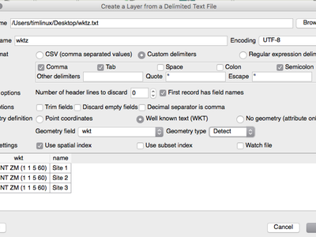
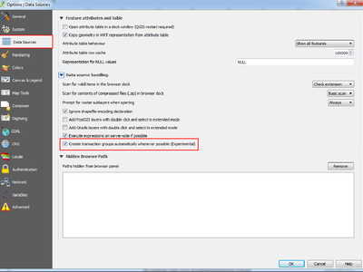
.. |image36| image:: images/entries/thumbnails/6e8f65042bd5981e585812ce2d957d0c6055ba3f.jpg.400x300_q85_crop.jpg
.. |image37| image:: images/entries/thumbnails/58bc1a2fea31fe8d6ab70ff33c763c9ddac40ade.png.400x300_q85_crop.png
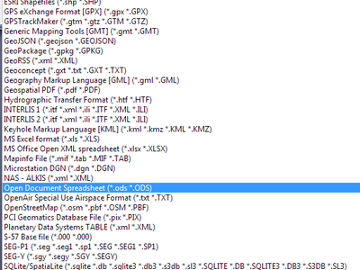
.. |image39| image:: images/entries/thumbnails/bea701efeedd257314f507dfb2689fbf95403095.png.400x300_q85_crop.jpg
.. |image40| image:: images/entries/thumbnails/b496fc25b098575ece2a38ea5a601caf75bb51dc.png.400x300_q85_crop.jpg
.. |image41| image:: images/entries/thumbnails/e09652676e15a883821ca9b269c03ab0239aacb3.png.400x300_q85_crop.jpg
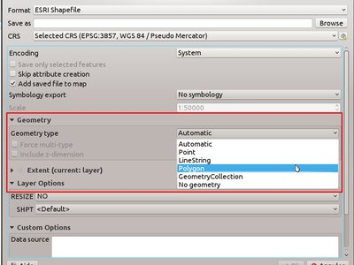
.. |image43| image:: images/entries/thumbnails/d20edab2103d774f548a55552ca2dbe20ac39e67.png.400x300_q85_crop.png
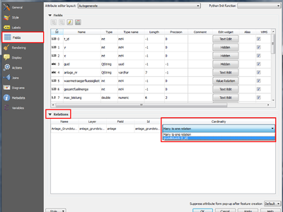
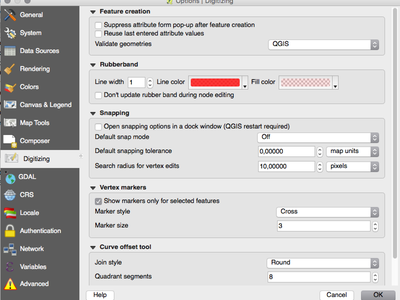
.. |image46| image:: images/entries/thumbnails/357ff84cf7685a2686a019ebe42f0012b495f79a.png.400x300_q85_crop.png
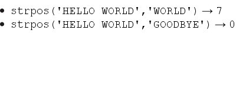
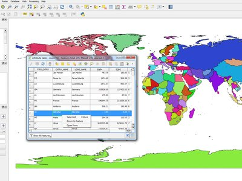
.. |image49| image:: images/entries/thumbnails/b2e29d9df21795416961b8b548f98078386eeecf.png.400x300_q85_crop.jpg
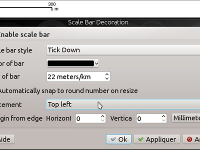
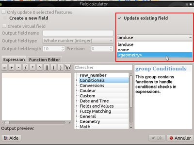
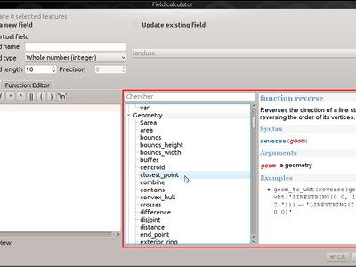
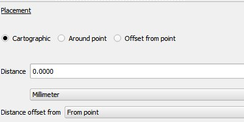
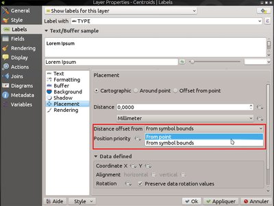
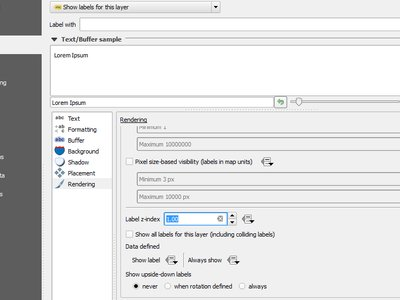
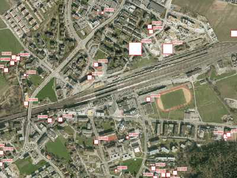
.. |image57| image:: images/entries/thumbnails/63fd1bfff18a108796c400edf127367f30f93c4b.png.400x300_q85_crop.jpg
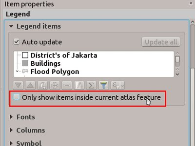
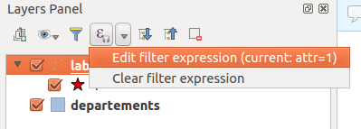
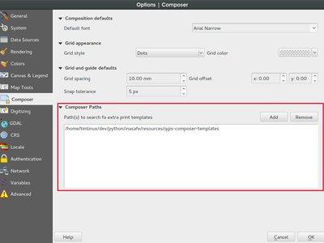
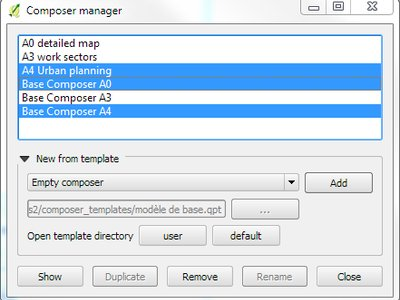
.. |image62| image:: images/entries/thumbnails/7b66e68eb37b27b0ecabcab7d0656985e222e8c0.png.400x300_q85_crop.jpg
.. |image63| image:: images/entries/thumbnails/4121e58bd51cfe5c8b2c0cd14d1420eaeb1f4473.png.400x300_q85_crop.png
.. |image64| image:: images/entries/thumbnails/2a135d5384f592e77938c59c0563cc2d0f6c3ebf.jpg.400x300_q85_crop.jpg
.. |image65| image:: images/entries/thumbnails/f8dec7fbc9e74dc3f4078f9710984d44b26c4fa3.jpg.400x300_q85_crop.jpg
.. |image66| image:: images/entries/thumbnails/c4039a87ddc906921e5e3ce47f8c7aadc7ab2263.jpg.400x300_q85_crop.jpg
.. |image67| image:: images/entries/thumbnails/655bbfccc4997a5a3e3d1f5c709da5277eef6000.png.400x300_q85_crop.png
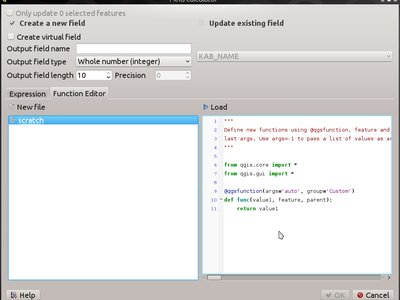
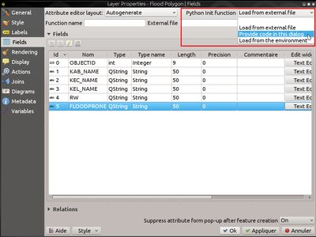
.. |image70| image:: images/entries/thumbnails/6e136c8a4bdf4361b9307f88175369b62d4648d6.png.400x300_q85_crop.jpg
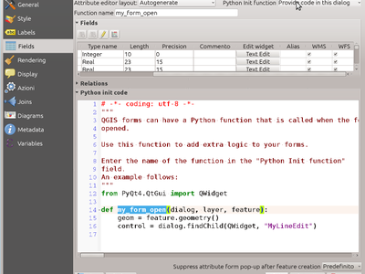
.. |image72| image:: images/entries/thumbnails/95f13aa3a1f4cb4ca8cbf7ce30e6bb278e6b9cd8.png.400x300_q85_crop.png
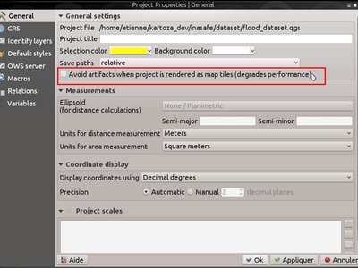
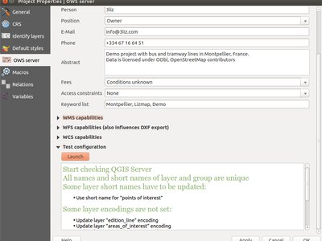
.. |image75| image:: images/entries/thumbnails/4ee445bcb5e9eab3fb9bf2eda8f9b1b81bbe21c0.png.400x300_q85_crop.jpg
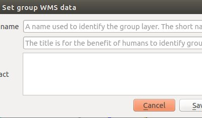
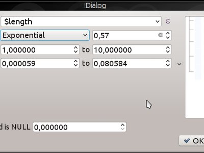
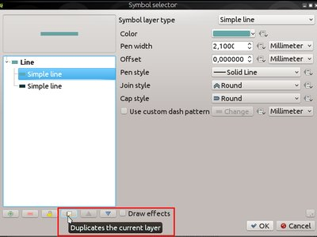
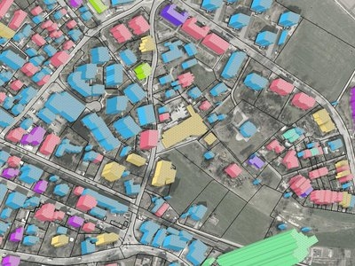
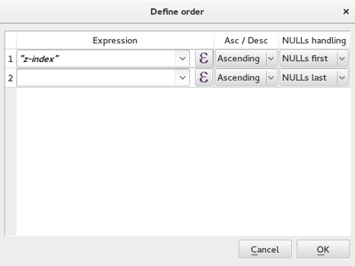
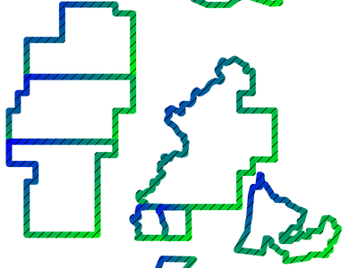
.. |image82| image:: images/entries/thumbnails/4623399cb1f63e2c6fa80c72a6aea17b6c63bb3e.png.400x300_q85_crop.jpg
.. |image83| image:: images/entries/thumbnails/3159457a414ea61f8f40659af5c9561882a44fe1.png.400x300_q85_crop.jpg
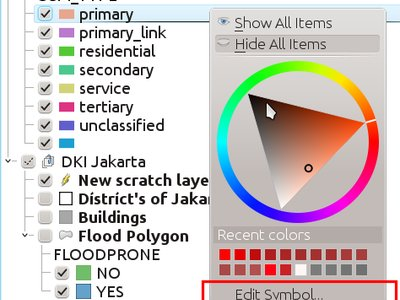
.. |image85| image:: images/entries/thumbnails/c526cf9c28c92dde193490a2707c1fe2e0a58ea6.png.400x300_q85_crop.jpg
