.. _changelog218:

Changelog for QGIS 2.18
=======================

|image1|

Release date: 2016-10-21

This is the last release in the 2.x series. The current Long Term Release (LTR) remains version 2.14.x. 
This release provides incremental improvements over our previous release. 
The majority of activity is currently focussed towards the development of QGIS 3.0 
which is our next generation release planned for the end of the first quarter of 2017.

**Thanks**

We would like to thank the developers, documenters, testers and all the many folks out there who volunteer their time and effort (or fund people to do so). From the QGIS community we hope you enjoy this release! If you wish to donate time, money or otherwise get involved in making QGIS more awesome, please wander along to `qgis.org <https://qgis.org>`__ and lend a hand!

QGIS is supported by donors and sponsors. A current list of donors who have made financial contributions large and small to the project can be seen on our `donors list <https://qgis.org/en/site/about/sponsorship.html#list-of-donors>`__. If you would like to become and official project sponsor, please visit `our sponsorship page <https://qgis.org/en/site/about/sponsorship.html#sponsorship>`__ for details. Sponsoring QGIS helps us to fund our six monthly developer meetings, maintain project infrastructure and fund bug fixing efforts. A complete list of current sponsors is provided below - our very great thank you to all of our sponsors!

QGIS is Free software and you are under no obligation to pay anything to use it - in fact we want to encourage people far and wide to use it regardless of what your financial or social status is - we believe empowering people with spatial decision making tools will result in a better society for all of humanity.

.. contents::
   :local:

Sponsors for QGIS version 2.18.0
--------------------------------

Annually we also receive support from various organisations who appreciate the
work we do and would like to facilitate the sustained development effort that
goes into the project. These sponsors are listed below with our thanks!

.. Gold sponsors: NOTE !!! keep these sorted please (latest expiry first) so it is easy to check validity

.. |bronze| image:: /static/site/about/images/bronze.png
   :width: 60 px

.. |silver| image:: /static/site/about/images/silver.png
   :width: 75 px

.. |gold| image:: /static/site/about/images/gold.png
   :width: 100 px

.. list-table:: Gold sponsors ( 9000 EUR )

   * - |gold| |qgis-ch|
       `QGIS Usergroup Switzerland <https://www.qgis.ch/>`_, Switzerland

.. |qgis-ch| image:: /static/site/about/images/qgis-ch.png
   :width: 200 px

.. Silver sponsors: NOTE !!! keep these sorted please (latest expiry first) so it is easy to check validity

.. list-table:: Silver sponsors ( 3000 EUR )

   * - |silver| |Land Vorarlberg|
       `State of Vorarlberg <http://www.vorarlberg.at/>`_, Austria

   * - |silver| |Office of Public Works, Flood Risk Management and Data Management Section|
       `Office of Public Works, Ireland <http://www.opw.ie/>`_, Ireland

   * - |silver| |GAIA mbH|
       `GAIA mbh <http://www.gaia-mbh.de>`_, Germany

   * - |silver| |sourcepole|
       `Sourcepole AG <http://www.sourcepole.com/>`_, Switzerland

   * - |silver| |QGISusergroupGermany|
       `QGIS user group Germany <http://www.qgis.de/>`_, Germany

.. Bronze sponsors: NOTE !!! keep these sorted please (latest expiry first) so it is easy to check validity

.. list-table:: Bronze sponsors ( 500 EUR )

    * - |bronze| |2D3D.GIS|

        `2D3D.GIS <http://www.2d3d-gis.com/>`_
      - |bronze| |Lutra Consulting|

        `Lutra Consulting <http://www.lutraconsulting.co.uk/>`_

    * - |bronze| |Ager Technology|

        `Ager Technology <http://www.agertechnology.com/>`_
      - |bronze| |MappingGIS|

        `MappingGIS <http://www.mappinggis.com/>`_

    * - |bronze| |Asociación Geoinnova|

        `Asociación Geoinnova <http://geoinnova.org/>`_
      - |bronze| |Molitec|

        `Molitec <http://www.molitec.it/>`_

    * - |bronze| |BGEO Open GIS, SL|

        `BGEO Open GIS, SL <http://www.bgeo.es>`_
      - |bronze| |NCC Roads AB|

        `NCC Roads AB <http://www.ncc.se/en/>`_

    * - |bronze| |Cawdor Forestry|

        `Cawdor Forestry <http://www.cawdorforestry.com/>`_
      - |bronze| |National Parks UK|

        `National Parks UK <http://www.nationalparks.gov.uk/>`_

    * - |bronze| |Urbsol|

        `Urbsol <http://www.urbsol.com.au/>`_
      - |bronze| |QGIS user group Denmark|

        `QGIS user group Denmark <http://www.qgis.dk/>`_

    * - |bronze| |Dr. Kerth + Lampe Geo-Infometric GmbH|

        `Dr. Kerth + Lampe Geo-Infometric GmbH <http://www.dr-kerth-lampe.de/>`_
      - |bronze| |QGIS user group Portugal|

        `QGIS user group Portugal <http://www.qgis.pt/>`_

    * - |bronze| |FORNAT AG|

        `FORNAT AG <http://www.fornat.ch/>`_
      - |bronze| |Royal Borough of Windsor and Maidenhead|

        `Royal Borough of Windsor and Maidenhead <http://www.rbwm.gov.uk/>`_

    * - |bronze| |GEPOL Ltd.|

        `GEPOL Ltd. <http://www.gepol.com.pl/>`_
      - |bronze| |SOLTIG (Soluciones en Tecnologías de Información Geográfica)|

        `SOLTIG (Soluciones en Tecnologías de Información Geográfica) <http://www.soltig.net/>`_

    * - |bronze| |GFI - Gesellschaft für Informationstechnologie mbH|

        `GFI - Gesellschaft für Informationstechnologie mbH <http://www.gfi-gis.de/>`_
      - |bronze| |Septima|

        `Septima <http://www.septima.dk/>`_

    * - |bronze| |GIS Support Sp. z o.o.|

        `GIS Support Sp. z o.o. <http://www.gis-support.com/>`_
      - |bronze| |TYC GIS|

        `TYC GIS <http://tycgis.com/>`_

    * - |bronze| |GKG Kassel, (Dr.-Ing. Claas Leiner)|

        `GKG Kassel, (Dr.-Ing. Claas Leiner) <http://www.gkg-kassel.de/>`_
      - |bronze| |Teaching Jobs with Footprints|

        `Teaching Jobs with Footprints <http://www.footprintsrecruiting.com/teaching-jobs-abroad>`_

    * - |bronze| |Gaia3D, Inc.|

        `Gaia3D, Inc. <http://www.gaia3d.com/>`_
      - |bronze| |TerreLogiche|

        `TerreLogiche <http://www.terrelogiche.com/>`_

    * - |bronze| |Gis3W|

        `Gis3W <http://www.gis3w.it/>`_
      - |bronze| |Trage Wegen vzw|

        `Trage Wegen vzw <http://www.tragewegen.be/>`_

    * - |bronze| |KBB Underground Technologies GmbH|

        `KBB Underground Technologies GmbH <http://www.kbbnet.de/>`_
      - |bronze| |WhereGroup GmbH & Co. KG|

        `WhereGroup GmbH & Co. KG <http://wheregroup.com/>`_

General
-------

Feature: Automatic links in identify results
~~~~~~~~~~~~~~~~~~~~~~~~~~~~~~~~~~~~~~~~~~~~

Any ``http`` or ``mailto`` links within attribute values will now automatically be converted to clickable links within the identify results panel.

|image58|

This feature was developed by `Sandro Mani (Sourcepole) <https://sourcepole.ch/>`__

Feature: Mouse wheel over color dialog sliders
~~~~~~~~~~~~~~~~~~~~~~~~~~~~~~~~~~~~~~~~~~~~~~

In QGIS 2.18 you can now scroll the mouse wheel over any of the sliders within the color picker dialog to increment the value by small amounts. 
This is a handy shortcut for small tweaks to color components.

|image59|

This feature was funded by `Nyall Dawson (North Road) <http://north-road.com>`__

This feature was developed by `Nyall Dawson (North Road) <http://north-road.com>`__

Feature: Add custom color schemes to color button drop down menu
~~~~~~~~~~~~~~~~~~~~~~~~~~~~~~~~~~~~~~~~~~~~~~~~~~~~~~~~~~~~~~~~

QGIS 2.18 adds the ability for users to set whether a user created color scheme should show up in the color button drop-down menus. This setting is controlled through the color picker dialog, on the lists tab. Just add a new color scheme, then from the scheme menu tick the new "show in buttons" option. It's a handy shortcut if you have sets of common palettes and want them to be instantly available through the color menu.

|image60|

This feature was funded by `North Road <http://north-road.com>`__

This feature was developed by `Nyall Dawson (North Road) <http://north-road.com>`__

Symbology
---------

Feature: Color picker is now embedded in layer style panel
~~~~~~~~~~~~~~~~~~~~~~~~~~~~~~~~~~~~~~~~~~~~~~~~~~~~~~~~~~

In QGIS 2.18 clicking a color button inside the layer style panel causes the color picker dialog to be opened inside the style panel itself rather than as a separate dialog. This allows for interactive modification of colors with immediate preview of the result.

|image42|

This feature was funded by `North Road <http://north-road.com>`__

This feature was developed by `Nyall Dawson (North Road) <http://north-road.com>`__

Labelling
---------

Feature: Substitution list support for labeling
~~~~~~~~~~~~~~~~~~~~~~~~~~~~~~~~~~~~~~~~~~~~~~~

Adds the ability to specify a list of text substitutes to make which apply to label text. Eg abbrevating street types.

Users can export and import lists of substitutes to make reuse and sharing easier.

|image43|

This feature was funded by `North Road <http://north-road.com>`__

This feature was developed by `Nyall Dawson (North Road) <http://north-road.com>`__

Feature: Improved line label placement algorithm
~~~~~~~~~~~~~~~~~~~~~~~~~~~~~~~~~~~~~~~~~~~~~~~~

The parallel labeling mode for line layers has been greatly improved, with a new algorithm which avoids placing labels over jagged parts of the feature geometries.

|image44|

This feature was funded by Andreas Neumann

This feature was developed by `Nyall Dawson (North Road) <http://north-road.com>`__

Feature: Label polygons using curved labels along perimeter
~~~~~~~~~~~~~~~~~~~~~~~~~~~~~~~~~~~~~~~~~~~~~~~~~~~~~~~~~~~

This adds a new mode for labeling polygons where the perimeter of the polygon is labeled using curved labeling.

|image45|

This feature was funded by `North Road <http://north-road.com>`__

This feature was developed by `Nyall Dawson (North Road) <http://north-road.com>`__

Rendering
---------

Feature: Preview of raster tiles (WMTS and XYZ layers)
~~~~~~~~~~~~~~~~~~~~~~~~~~~~~~~~~~~~~~~~~~~~~~~~~~~~~~

In previous versions of QGIS, users had to wait until download of all tiles of a layer has finished in order to view the resulting map. This has now been fixed and the tiles show up in map canvas immediately as they get downloaded, improving the user experience by greatly lowering the time until something is shown. Moreover, previously downloaded tiles from lower or higher resolutions may be used for the preview functionality in the areas where the tiles with correct resolution have not been downloaded yet.

|image46|

This feature was funded by `Land Information New Zealand <http://www.linz.govt.nz/>`__

This feature was developed by `Martin Dobias (Lutra Consulting) <http://www.lutraconsulting.co.uk/>`__

Feature: Cancellable rendering of rasters (WMS, WMTS, WCS and XYZ layers)
~~~~~~~~~~~~~~~~~~~~~~~~~~~~~~~~~~~~~~~~~~~~~~~~~~~~~~~~~~~~~~~~~~~~~~~~~

This enhancement improves user experience when working with raster layers coming from remote servers. Previously one would need to wait until downloads are fully complete in order to be able to zoom or pan the map again, because the user interface would stay frozen in the meanwhile. This is now fixed by the fact that the rendering of raster layers can be cancelled any time.

This feature was funded by `Land Information New Zealand <http://www.linz.govt.nz/>`__

This feature was developed by `Martin Dobias (Lutra Consulting) <http://www.lutraconsulting.co.uk/>`__

Data Management
---------------

Feature: Add flag to only copy selected features
~~~~~~~~~~~~~~~~~~~~~~~~~~~~~~~~~~~~~~~~~~~~~~~~

The offline editing plugins is a default plugin that ships with QGIS and allows you to offline a remote dataset (e.g. from a database), edit it in the field, and then resynchonise it when you get back to your office. This extends the offline editing possibilities to only work on subset of large layers.

|image47|

This feature was funded by DB Fahrwegdienste GmbH

This feature was developed by `Matthias Kuhn (OPENGIS.ch) <http://www.opengis.ch/>`__

Forms and Widgets
-----------------

Feature: Allow controlling labels for individual edit widgets
~~~~~~~~~~~~~~~~~~~~~~~~~~~~~~~~~~~~~~~~~~~~~~~~~~~~~~~~~~~~~

Allow controlling labels for individual edit widgets in a form. In the drag and drop designer, a double click on an item will allow controlling if the label should be shown for each item individually.

In addition it is possible to configure if the link/unlink buttons are shown in relation reference widget, which is useful to hide in 1:n relations where a child can't exist without its parents.

|image48|

This feature was funded by `Kanton Zug, GIS-Fachstelle <http://geo.zg.ch/>`__

This feature was developed by `Matthias Kuhn (OPENGIS.ch) <http://www.opengis.ch/>`__

Feature: Conditional visibility for tabs and group boxes
~~~~~~~~~~~~~~~~~~~~~~~~~~~~~~~~~~~~~~~~~~~~~~~~~~~~~~~~

This adds a new configuration option to conditionally show or hide tabs and groupboxes in drag and drop designer forms.

Configuration is done via a double click in the designer tree in the fields configuration interface.

An expression can be entered to control the visibility. The expression will be re-evaluated everytime values in the form change and the tab or groupbox shown/hidden accordingly.

|image49|

This feature was developed by `Matthias Kuhn (OPENGIS.ch) <http://www.opengis.ch/>`__

Feature: Client side default field values
~~~~~~~~~~~~~~~~~~~~~~~~~~~~~~~~~~~~~~~~~

Allows an expression to be set for a vector layer field which is used to evaluate a default value for this field. Default value expressions can utilise properties of the feature which exist at the time of calling, such as digitized geometries. Expression variables can also be used in default value expressions, making it easy to eg insert a user's name, the current datetime, project path, etc.

|image50|

This feature was funded by DB Fahrwegdienste GmbH

This feature was developed by `Nyall Dawson (North Road) <http://north-road.com>`__

Map Composer
------------

Feature: True North Arrows
~~~~~~~~~~~~~~~~~~~~~~~~~~

QGIS 2.18 adds support for orienting north arrows in the composer to True North. Previously all arrows were aligned to grid north, which is unsuitable for polar regions or non-north up projections (such as some South African projection systems). Now, you can choose to orient arrows to either grid north or true north. There's also an optional offset angle, which can be used to specify a grid convergence to make your arrows orient to magnetic north!

|image51|

This feature was funded by `Norwegian Polar Institute's Quantarctica project <http://quantarctica.npolar.no>`__

This feature was developed by `Nyall Dawson (North Road) <http://north-road.com>`__

Processing
----------

Feature: Point on surface algorithm
~~~~~~~~~~~~~~~~~~~~~~~~~~~~~~~~~~~

This new algorithm is similar to the centroids algorithm, but where a centroid may fall outside its corresponding feature the 'Point on surface' algorithm is guaranteed to create a point which is inside the corresponding polygon feature (or touching the corresponding line feature for line layers).

|image52|

This feature was funded by `North Road <http://north-road.com>`__

This feature was developed by `Nyall Dawson (North Road) <http://north-road.com>`__

Feature: Processing dissolve algorithm accepts multiple fields
~~~~~~~~~~~~~~~~~~~~~~~~~~~~~~~~~~~~~~~~~~~~~~~~~~~~~~~~~~~~~~

The dissolve algorithm now allows you to dissolve based on more than one field value. In previous QGIS versions a dissolve could only group features by a single field value.

|image53|

This feature was funded by `North Road <http://north-road.com>`__

This feature was developed by `Nyall Dawson (North Road) <http://north-road.com>`__

Feature: Optimised processing clip algorithm
~~~~~~~~~~~~~~~~~~~~~~~~~~~~~~~~~~~~~~~~~~~~

The processing clip algorithm has been optimised for common use scenarios, resulting in dramatic speedups for clipping operations. For example:

**Clipping a roads layer with 1 million lines against 2 polygons**

| **Earlier versions:** 5 mins 30 seconds
| **QGIS 2.18:** 10 seconds

**Clipping a 5 million point address layer against 2 polygons**

| **Earlier versions:** 50 minutes
| **QGIS 2.18:** 30 seconds

|image54|

This feature was funded by `North Road <http://north-road.com>`__

This feature was developed by `Nyall Dawson (North Road) <http://north-road.com>`__

Feature: Bounding boxes algorithm
~~~~~~~~~~~~~~~~~~~~~~~~~~~~~~~~~

This new algorithm calculates the bounding box (envelope) of each feature in the input layer.

|image55|

This feature was funded by `North Road <http://north-road.com>`__

This feature was developed by `Nyall Dawson (North Road) <http://north-road.com>`__

Feature: Merge connected lines algorithm
~~~~~~~~~~~~~~~~~~~~~~~~~~~~~~~~~~~~~~~~

This algorithm joins all the connected parts of MultiLineString geometries into single LineString geometries. If any parts of the input MultiLineString geometries are not connected, the resultant geometry will be a MultiLineString containing any lines which could be merged and any non-connected line parts.

|image56|

This feature was funded by `North Road <http://north-road.com>`__

This feature was developed by `Nyall Dawson (North Road) <http://north-road.com>`__

Feature: Geometry boundary algorithm
~~~~~~~~~~~~~~~~~~~~~~~~~~~~~~~~~~~~

This new algorithm returns the closure of the combinatorial boundary of the input geometries (ie the topological boundary of the geometry). For instance, a polygon geometry will have a boundary consisting of the linestrings for each ring in the polygon, and a line geometry will have a boundary consisting of the start and end points of the line. This algorithm is only valid for polygon or line layers.

|image57|

This feature was funded by `North Road <http://north-road.com>`__

This feature was developed by `Nyall Dawson (North Road) <http://north-road.com>`__

Data Providers
--------------

Feature: Native support of XYZ tile layers
~~~~~~~~~~~~~~~~~~~~~~~~~~~~~~~~~~~~~~~~~~

Raster tiles in XYZ format are now natively supported within WMS data providers, allowing users to display basemaps from other sources without requiring third-party plugins like QuickMapServices or OpenLayers anymore.

To add connections to XYZ layers, just open browser dock widget, look for item called "Tile Server (XYZ)" and right click it to get a popup menu with "New connection" action. You will be asked for URL, in which ``{x}``, ``{y}``, ``{z}`` will be replaced by the actual tile numbers according to the current map view. For example, to add OpenStreetMap base map, one may use this URL:
``http://c.tile.openstreetmap.org/{z}/{x}/{y}.png``

The data provider also supports encoding of XYZ tile numbers into "quadkeys" used by Bing. Simply use ``{q}`` instead of ``{x}``, ``{y}`` and ``{z}`` in the URL.

|image61|

This feature was funded by `Lutra Consulting <http://www.lutraconsulting.co.uk/>`__

This feature was developed by `Martin Dobias (Lutra Consulting) <http://www.lutraconsulting.co.uk/>`__

QGIS Server
-----------

Feature: Possibility to segmentize feature info geometry in server
~~~~~~~~~~~~~~~~~~~~~~~~~~~~~~~~~~~~~~~~~~~~~~~~~~~~~~~~~~~~~~~~~~

Necessary for geometries that contain curves (CircularArc, CompoundCurve, CurvePolygon), but the web client (e.g. QGIS Web Client) can't handle the display of these geometry types.

This feature can be enabled in the "OWS server" tab in the "Project Properties" dialogue.

|image62|

This feature was funded by Andreas Neumann

This feature was developed by `Marco Hugentobler (Sourcepole) <http://www.sourcepole.ch/>`__

Plugins
-------

Feature: DB Manager: Add the ability to update SQL Layer
~~~~~~~~~~~~~~~~~~~~~~~~~~~~~~~~~~~~~~~~~~~~~~~~~~~~~~~~

With this feature the user can update the layer datasource if it's based on an SQL request.

This feature was funded by `Ifremer <http://wwz.ifremer.fr>`__

This feature was developed by `3Liz <http://3liz.com>`__

Programmability
---------------

Feature: Expose GEOS linear referencing function to QgsGeometry
~~~~~~~~~~~~~~~~~~~~~~~~~~~~~~~~~~~~~~~~~~~~~~~~~~~~~~~~~~~~~~~

A new function ``QgsGeometry::lineLocatePoint()`` has been added for retrieving the distance along a linestring to the nearest position on the linestring to a given point.

This feature was funded by `North Road <http://north-road.com>`__

This feature was developed by `Nyall Dawson (North Road) <http://north-road.com>`__

Feature: New PyQGIS classes in 2.18
-----------------------------------

New core classes
~~~~~~~~~~~~~~~~

-  `QgsAnnotation <https://qgis.org/api/classQgsAnnotation.html>`__ - an interface for annotation items which are drawn over a map
-  `QgsFeedback <https://qgis.org/api/classQgsFeedback.html>`__ - a base class for feedback objects to be used for cancellation of something running in a worker thread
-  `QgsOptionalExpression <https://qgis.org/api/classQgsOptionalExpression.html>`__ - an expression with an additional enabled flag

New GUI classes, Reusable widgets
~~~~~~~~~~~~~~~~~~~~~~~~~~~~~~~~~

-  `QgsExpressionLineEdit <https://qgis.org/api/classQgsExpressionLineEdit.html>`__ - includes a line edit for entering expressions together with a button to open the expression creation dialog. This widget is designed for use in contexts where no layer fields are available for use in an expression and space is constrained.
-  `QgsTabWidget <https://qgis.org/api/classQgsTabWidget.html>`__ - similar to QTabWidget but with additional methods to temporarily hide/show tabs

Feature: New expression functions
---------------------------------

QGIS 2.18 adds several new expression functions, including functions for angle/distance interpolation.

-  ``line_merge``: merges a MultiLineString geometry into connected LineStrings
-  ``boundary``: returns a geometry's topological boundary, ie for polygons this is a MultiLineString representing the polygon's rings
-  ``angle_at_vertex``: returns the average (bisector) angle to a geometry at a specified vertex index
-  ``distance_to_vertex``: returns distance along geometry to a specified vertex index
-  ``line_interpolate_angle``: calculates the angle parallel to a geometry at the specified distance along the geometry
-  ``line_interpolate_point``: returns a point on line at distance
-  ``line_locate_point``: returns distance along line to nearest line location closest to specified point

This feature was funded by Andreas Neumann

This feature was developed by `Nyall Dawson (North Road) <http://north-road.com>`__

.. |image1| image:: images/projects/ac3b0a08203e87505a823b0d8a0895d44489f916.png
.. |image2| image:: images/projects/thumbnails/d5fd4af2929840586da0bd45110758c5b0a786ff.png.50x50_q85.png
.. |QGIS user group Switzerland| image:: images/projects/thumbnails/945e5e1463ca738057fd9bae0a427519ccbfef0d.png.150x50_q85.png
.. |image4| image:: images/projects/thumbnails/0d8ae6aad78ca052492dff96434ddb54d5401262.png.50x50_q85.png
.. |GAIA mbH| image:: images/projects/thumbnails/f6379f3083e612fd47917e1f948d795b6951dde9.png.150x50_q85.png
   :width: 150 px
.. |Office of Public Works, Flood Risk Management and Data Management Section| image:: images/projects/thumbnails/35602d87c0858381e9a95a481808b27249f0f592.jpg.150x50_q85.jpg
.. |Land Vorarlberg| image:: images/projects/thumbnails/5f50b148aecade6339b100f1ad30897b81ca9a09.jpg.150x50_q85.jpg
   :width: 175 px
.. |QGISusergroupGermany| image:: images/projects/thumbnails/be6891585ad856e8c2bbbba4b78e37d303f10d72.png.150x50_q85.png
.. |image9| image:: images/projects/thumbnails/0e2f6fb1efc89d41120cddf90509374642d400b4.png.50x50_q85.png
.. |2D3D.GIS| image:: images/projects/thumbnails/b3196a2b5781e788e6adac40ecf6964eddc4d38e.png.150x50_q85.png
.. |Lutra Consulting| image:: images/projects/thumbnails/0d5fea827c8bfc486877065e21d3e28f89788e78.png.150x50_q85.png
.. |Ager Technology| image:: images/projects/thumbnails/7ab30679cc486ecb9981c8c02a6d6ba1fb6ca2c7.png.150x50_q85.jpg
.. |MappingGIS| image:: images/projects/thumbnails/775de328b2774c112cc73fb5aaaee9696220649b.png.150x50_q85.png
.. |Asociación Geoinnova| image:: images/projects/thumbnails/bba9a55eb7e288e622e7bf40ee85326c28cf09f3.jpg.150x50_q85.jpg
.. |Molitec| image:: images/projects/thumbnails/5a65a575314f063d065ef84840e734e411c770f2.png.150x50_q85.png
.. |BGEO Open GIS, SL| image:: images/projects/thumbnails/c8dbccba699fc2f34ef61b034f7b86adfd96f4c4.png.150x50_q85.jpg

.. |Cawdor Forestry| image:: images/projects/thumbnails/1789f70f1058ee18570638070439a8082b91dca8.png.150x50_q85.jpg
.. |National Parks UK| image:: images/projects/thumbnails/6e9c4de359ddbda8ed0b144478e7fa001e22ba63.jpg.150x50_q85.jpg

.. |QGIS user group Denmark| image:: images/projects/thumbnails/95cd3d2f589a180ebea3b5f31e5fd17a753f6774.png.150x50_q85.png
.. |Dr. Kerth + Lampe Geo-Infometric GmbH| image:: images/projects/thumbnails/8d0653a46046e8d43a28d4ea3466633f15d17636.png.150x50_q85.jpg
.. |QGIS user group Portugal| image:: images/projects/thumbnails/207dd8769c4926452e07e39d88716ec518ff5f3a.png.150x50_q85.png
.. |FORNAT AG| image:: images/projects/thumbnails/e24951be1e5ff2d6fd591f9760871e38a684bed0.png.150x50_q85.png

.. |GEPOL Ltd.| image:: images/projects/thumbnails/95966a3500fe4f686b531f05fcf85f59ed0dcb93.png.150x50_q85.png
.. |SOLTIG (Soluciones en Tecnologías de Información Geográfica)| image:: images/projects/thumbnails/0baa83c55c7c6194627e87ca81c9dffd4eee9ad1.png.150x50_q85.png
.. |GFI - Gesellschaft für Informationstechnologie mbH| image:: images/projects/thumbnails/44113fc21a8e2cd84d93459d0f00b3a64850095c.png.150x50_q85.jpg

.. |GIS Support Sp. z o.o.| image:: images/projects/thumbnails/879213e1d9dd7d4e4adb87abf81c96c26c25cd36.png.150x50_q85.jpg

.. |GKG Kassel, (Dr.-Ing. Claas Leiner)| image:: images/projects/thumbnails/035ade9287e0bae1ddf62a00a52519f028a18e7f.png.150x50_q85.jpg

.. |Gaia3D, Inc.| image:: images/projects/thumbnails/9d30ee055aaea7ef42b807b1b4fcd22566eef69d.png.150x50_q85.png
.. |TerreLogiche| image:: images/projects/thumbnails/9e23fb4e1f0416131843750f07e75a9f9d1e724d.jpg.150x50_q85.jpg
.. |Gis3W| image:: images/projects/thumbnails/69f8dd7f727158ebeb6bcbdce6fef4cb313ad9f9.png.150x50_q85.png
.. |Trage Wegen vzw| image:: images/projects/thumbnails/1607f4bc4a24d0e6aabe5e8e424b93b40b83be3a.png.150x50_q85.png
.. |Urbsol| image:: images/projects/thumbnails/af9b8c3a4363482f12c7b2dff14659fd9ff6240c.png.150x50_q85.jpg
.. |KBB Underground Technologies GmbH| image:: images/projects/thumbnails/69255208cf440914eb947bf6dce5cee1c78455ba.jpg.150x50_q85.jpg
.. |WhereGroup GmbH & Co. KG| image:: images/projects/thumbnails/0eb2c265017956fb6b15cb9a098f8d27928152e8.jpg.150x50_q85.jpg
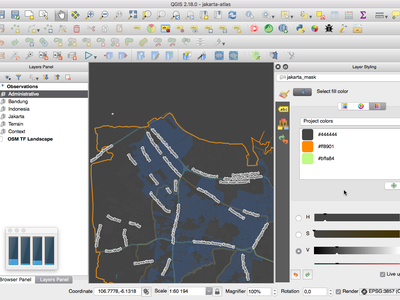
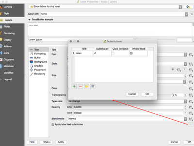
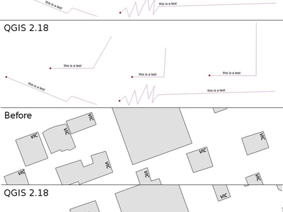
.. |image45| image:: images/entries/thumbnails/c7a28cf09a0f1646210faaae85a56c2209ee15e9.PNG.400x300_q85_crop.png
.. |image46| image:: images/entries/007bf6d09a1f67e0c0c4ee71d48081185c0c5c84.gif
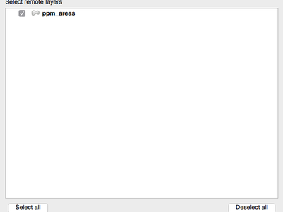
.. |image48| image:: images/entries/thumbnails/6d827c6b286f137ec9de1d97a15c745764494d0a.png.400x300_q85_crop.png
.. |image49| image:: images/entries/thumbnails/8adda1d639ba9b46b15f8a70b38c6cfd407d2515.png.400x300_q85_crop.png
.. |image50| image:: images/entries/thumbnails/49a9d8a5c38f04d96cf37ad190a97dd4dc4b5025.png.400x300_q85_crop.png
.. |image51| image:: images/entries/thumbnails/b36b83066c2361e4a9647ee830b55b01a04ce4c5.png.400x300_q85_crop.png
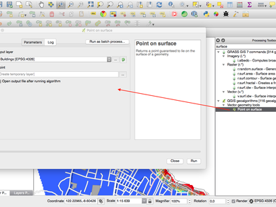
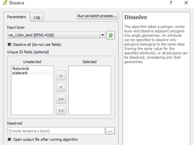
.. |image54| image:: images/entries/thumbnails/f975cb641b319e952264dc1e706deafdfd2b7496.png.400x300_q85_crop.png
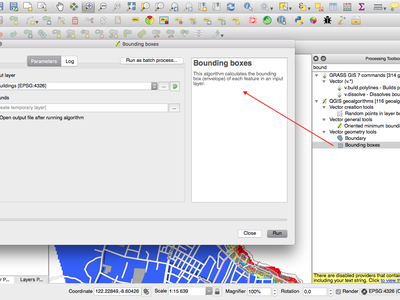
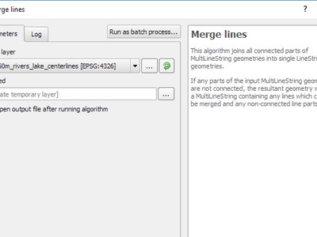
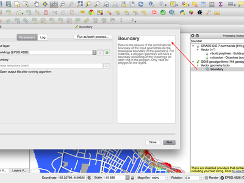
.. |image58| image:: images/entries/thumbnails/eab95eb0acb92a68edeee71a13ea23d77b88d307.png.400x300_q85_crop.png
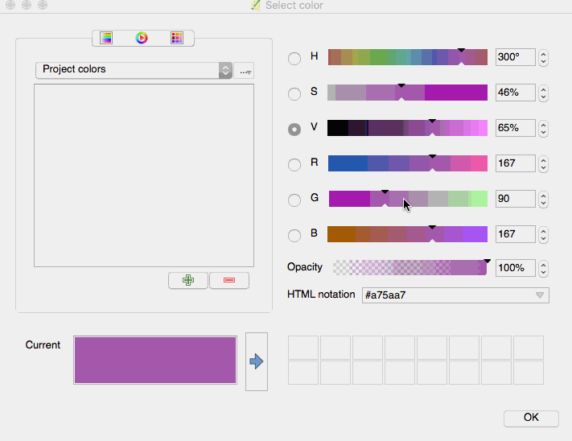
.. |image60| image:: images/entries/thumbnails/9453954d199c4950d7aecf153b6d5e53f820ff19.PNG.400x300_q85_crop.png
.. |image61| image:: images/entries/f69a3601e9201e38f9a561d40807512035da2298.gif
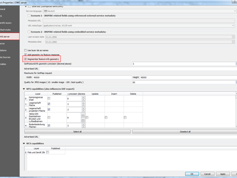
.. |sourcepole| image:: /static/site/about/images/sourcepole.png
   :width: 150 px
