.. _changelog26:

Changelog for QGIS 2.6
======================

Release date: 2014-11-01

Change log for the next release of QGIS 2.6.0. We have added many new
features, tweaks and enhancements to make the most popular Free desktop
GIS even more feature filled and useful.

Whenever new features are added to software they introduce the
possibility of new bugs - if you encounter any problems with this
release, please file a ticket `on the QGIS Bug Tracker <http://hub.qgis.org>`_.

We would like to thank the developers, documenters, testers and all the
many folks out there who volunteer their time and effort (or fund people
to do so).

From the QGIS community we hope you enjoy this release! If you wish to
donate time, money or otherwise get involved in making QGIS more
awesome, please wander along to `qgis.org <https://qgis.org>`_ and lend a
hand!

Finally we would like to thank our official sponsors for the invaluable
financial support they provide to this project:

-  **GOLD Sponsor: Asia Air Survey, Japan** http://www.asiaairsurvey.com/
-  SILVER Sponsor: `Sourcepole AG, Switzerland <http://www.sourcepole.com/>`_
-  SILVER Sponsor: `State of Vorarlberg, Austria <http://www.vorarlberg.at/>`_
-  BRONZE Sponsor: `Lutra Consulting, UK <http://www.lutraconsulting.co.uk/>`_
-  BRONZE Sponsor: `www.molitec.it, Italy <http://www.molitec.it/>`_
-  BRONZE Sponsor: `www.argusoft.de, Germany <http://www.argusoft.de>`_
-  BRONZE Sponsor: `www.openrunner.com, France <http://www.openrunner.com>`_
-  BRONZE Sponsor: `GKG Kassel,(Dr.-Ing. Claas Leiner), Germany <http://www.eschenlaub.de/>`_

A current list of donors who have made financial contributions large and
small to the project can be seen on our `donors
list <https://qgis.org/en/site/about/sponsorship.html#list-of-donors>`_.
If you would like to become an official project sponsor, please visit
`our sponsorship
page <https://qgis.org/en/site/about/sponsorship.html#sponsorship>`_ for
details. Sponsoring QGIS helps us to fund our six monthly developer
meetings, maintain project infrastructure and fund bug fixing efforts.

If you enjoy using QGIS, please consider making a donation to support
the project - either
`financial <https://qgis.org/en/site/getinvolved/donations.html>`_ or of
`your time and skills <https://qgis.org/en/site/getinvolved/index.html>`_! Lastly we
would like to also take a moment to encourage you to fund a `special
campaign <http://blog.vitu.ch/10102014-1046/crowdfunding-initiative-automated-testing>`_
by one of our QGIS developers to get a working test suite for QGIS so
that we can improve out quality assurance process and deliver you the
best possible releases.

QGIS is Free software and you are under no obligation to pay anything to
use it - in fact we want to encourage people far and wide to use it
regardless of what your financial or social status is - we believe
empowering people with spatial decision making tools will result in a
better society for all of humanity.

.. contents::
   :local:

General
-------

Feature: Project filename in properties
~~~~~~~~~~~~~~~~~~~~~~~~~~~~~~~~~~~~~~~

You can now see the full path for the QGIS project file in the project
properties dialog.

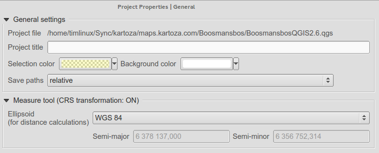

Feature: Allow removing last point while measuring via del/backspace keys
~~~~~~~~~~~~~~~~~~~~~~~~~~~~~~~~~~~~~~~~~~~~~~~~~~~~~~~~~~~~~~~~~~~~~~~~~

Now when you are measuring areas and distances, you can remove unwanted
vertices from your measurement line using the delete or backspace keys.

.. figure:: images/entries/ed471908937cb068e2f004e7b3311f2bdf307042.png
   :align: center
   :alt:

Feature: select related feature on the canvas from the relation reference widget
~~~~~~~~~~~~~~~~~~~~~~~~~~~~~~~~~~~~~~~~~~~~~~~~~~~~~~~~~~~~~~~~~~~~~~~~~~~~~~~~

Feature: Editor widgets
~~~~~~~~~~~~~~~~~~~~~~~

We have made a number of improvements to the editor widgets:

-  new edit widget for date/time capable of setting null dates
-  filter line edit
-  Proper handling of NULL values for edit widgets
-  Photo widget preserves NULL value
-  Web widget preserves NULL value
-  Attribute table can distinguish between 0 and NULL
-  Add suffix support for range widget

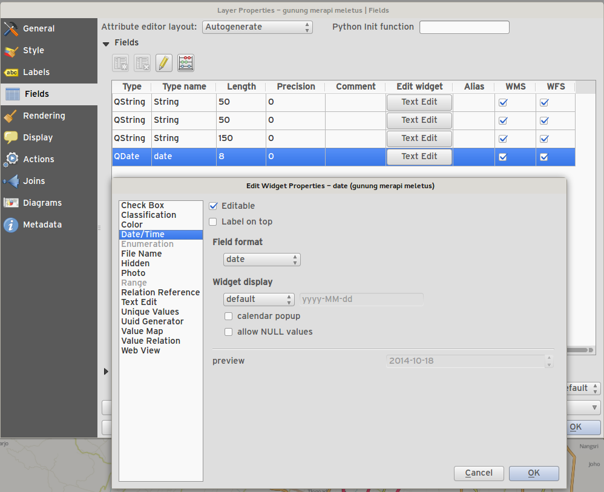

Feature: Optionally use just a subset of fields from the joined layer
~~~~~~~~~~~~~~~~~~~~~~~~~~~~~~~~~~~~~~~~~~~~~~~~~~~~~~~~~~~~~~~~~~~~~

You can now use just a subset of related fields when creating a vector
join.

.. figure:: images/entries/14023cf2ee768960d9c4a43da6e2a1624d10b3c3.png
   :align: center
   :alt:

Feature: Expression field (virtual fields)
~~~~~~~~~~~~~~~~~~~~~~~~~~~~~~~~~~~~~~~~~~

Sometimes you want to have an attribute that is calculated and that is
always 'fresh' - reflecting the current state of the feature properties.
Now you can add virtual fields to your table which are based on an
expression.

.. figure:: images/entries/5fe53ad54b8d0cf8b7a22b90e733a421bb929506.png
   :align: center
   :alt:

Feature: Actions can now have an associated icon
~~~~~~~~~~~~~~~~~~~~~~~~~~~~~~~~~~~~~~~~~~~~~~~~

When creating a custom action for a vector layer, you can now define an
icon to be used for the action too.

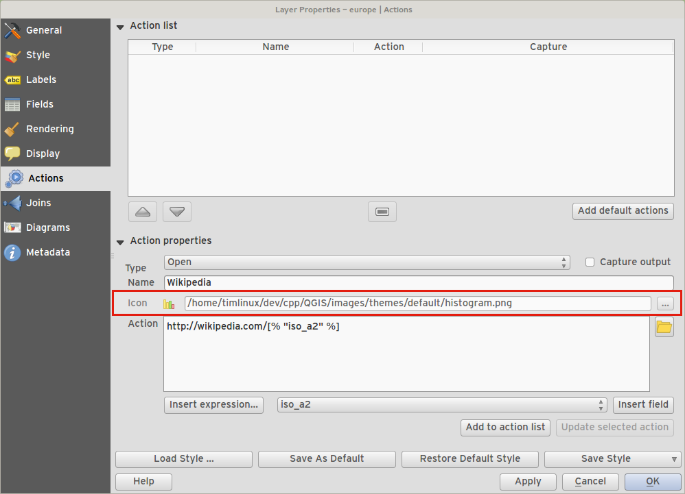

Feature: Additional expressions types and options
~~~~~~~~~~~~~~~~~~~~~~~~~~~~~~~~~~~~~~~~~~~~~~~~~

-  Allow using ``+`` for string concatenation.
-  New keyword: ``attribute( feature, attribute_name )`` - gets the
   specified attribute from a feature.
-  New keyword: ``$currentfeature`` - returns the current feature.
-  New keyword: ``$atlasfeature`` - returns the atlas feature.
-  New keyword: ``getFeature`` - gets a matching feature from a layer.

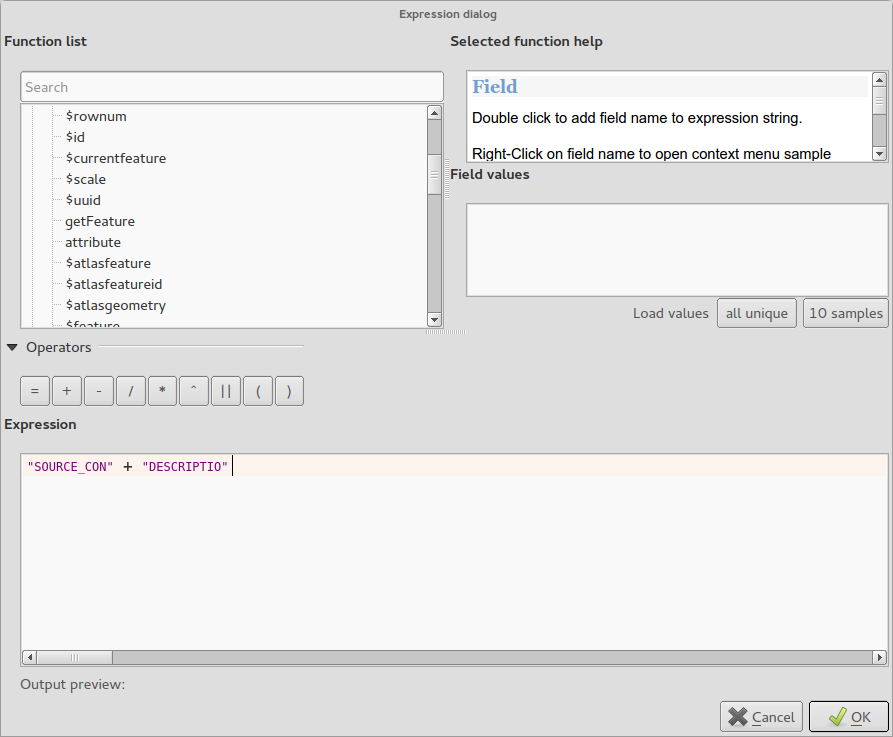

Feature: Classes within graduated and categorised renderers can be toggled
~~~~~~~~~~~~~~~~~~~~~~~~~~~~~~~~~~~~~~~~~~~~~~~~~~~~~~~~~~~~~~~~~~~~~~~~~~

You can now choose to disable certain classes in graduated and
categorised renderers without actually removing them.

.. figure:: images/entries/84d11c6d978775d92f6a1902092795735d1f32b3.png
   :align: center
   :alt:

Feature: Legend improvements
~~~~~~~~~~~~~~~~~~~~~~~~~~~~

The second phase of the legend / table of contents overhaul has been
completed. This includes:

-  API cleanup (for developers)
-  Visibility groups of map layers in layer tree. This new toolbar
   button allows quick changes between the groups of layers that should
   be visible.
-  Ability to manage layer groups from the legend toolbar
-  The new legend filter option on the legend toolbar will remove legend
   items for any classes which are not currently in the view extent.
   This is an awesome improvement as it ensures that your map legend
   does not contain entries for items not currently in the map view. It
   is available in the main map legend and in map composer and for WMS
   layers.
-  Rule-based renderer legends can now be displayed in a pseudo-tree

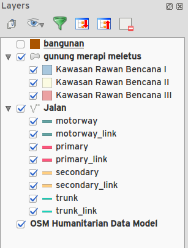

Data Providers
--------------

Feature: DXF export improvements
~~~~~~~~~~~~~~~~~~~~~~~~~~~~~~~~

-  tree view and attribute selection for layer assigment in dialog
-  support fill polygons/HATCH
-  represent texts as MTEXT instead of TEXT (including font, slant and
   weight)
-  support for RGB colors when there's no exact color match
-  use AutoCAD 2000 DXF (R15) instead of R12
-  remove R18 test methods

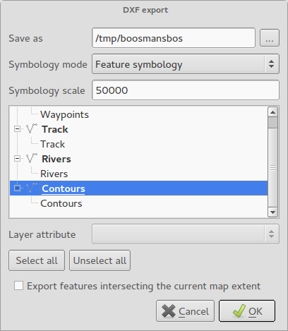

Map Composer
------------

Feature: Control over hiding print composer items from prints/exports
~~~~~~~~~~~~~~~~~~~~~~~~~~~~~~~~~~~~~~~~~~~~~~~~~~~~~~~~~~~~~~~~~~~~~

We have added a checkbox and data defined button for controlling whether
an item is excluded from composer exports/printouts. If the item is
unchecked it will be visible at composition design time only.

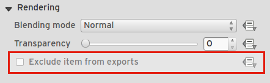

Feature: Control over page printing for empty composer frames
~~~~~~~~~~~~~~~~~~~~~~~~~~~~~~~~~~~~~~~~~~~~~~~~~~~~~~~~~~~~~

For table or HTML frames, a checkbox now controls whether the containing
page should be exported when the frame is empty.

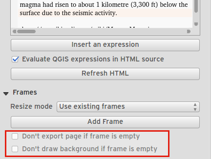

Feature: Item tree panel
~~~~~~~~~~~~~~~~~~~~~~~~

The item tree panel in the map composer allows for selection of items,
hiding/showing items, toggling lock status of items and double-clicking
to edit item id. You can also use drag and drop to reorder items.

.. figure:: images/entries/52b70bdf87d21a13c00798458bab6347dddd7910.png
   :align: center
   :alt:

Feature: More control over appearance of composer arrow/line items
~~~~~~~~~~~~~~~~~~~~~~~~~~~~~~~~~~~~~~~~~~~~~~~~~~~~~~~~~~~~~~~~~~

-  Lines can be styled using line symbol style dialog
-  Arrow head fill and outline colors can be user defined
-  Arrow head outline width can be user defined

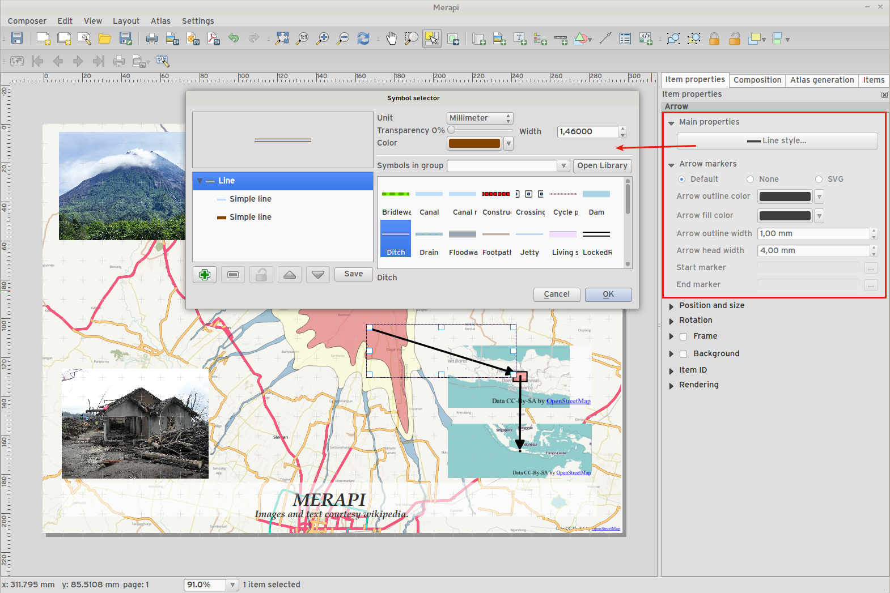

Feature: Data defined control of composer items
~~~~~~~~~~~~~~~~~~~~~~~~~~~~~~~~~~~~~~~~~~~~~~~

Many properties of composer items can now be controlled using data
binding. These include:

-  Transparency and blend mode.
-  Item rotation.
-  Map scale, extents and rotation.
-  Atlas feature margin.
-  Item size and position.
-  Page size, orientation and number of pages.

.. figure:: images/entries/9f321489cd9c90eb4d66e577680fc5467756e58e.png
   :align: center
   :alt:

Feature: Composer images can be specifed as remote URLS
~~~~~~~~~~~~~~~~~~~~~~~~~~~~~~~~~~~~~~~~~~~~~~~~~~~~~~~

Picture items in the map composer now support remote urls as a picture
source. This source can also be data defined.

.. figure:: images/entries/05cd7008c231df3b3af874753b840669a605cb0f.png
   :align: center
   :alt:

Feature: Composer Table improvements
~~~~~~~~~~~~~~~~~~~~~~~~~~~~~~~~~~~~

-  You can now set table header and content font colors.
-  Tables can now be split across multiple frames, allowing their
   content to be distributed over columns or over different pages.
-  Added option show headers on first frame, all frames, or no frames.
-  Allow manual control of column widths.
-  New options for table source, including current atlas feature and
   child features from a relation.
-  Choice of behaviour for empty tables, include hiding the entire
   table, showing empty cells, or displaying a set message in the table
   body.
-  Added a checkbox to filter table features to those which intersect
   the current atlas feature.
-  Added checkbox to remove duplicate rows from table.

Note that tables in existing projects are not automatically updated to
the new table format which supports these features, and tables must be
readded to a composition for the new settings to appear.

.. figure:: images/entries/9ccb75b2110daf0c95a3fba31ac18144c1345f0e.png
   :align: center
   :alt:

Feature: Composer improvements
~~~~~~~~~~~~~~~~~~~~~~~~~~~~~~

The map composer (used to prepare printable map compositions) has
received a number of improvements in QGIS 2.6.

-  You can now change the secondary fill color for scalebars
-  Holding shift while drawing line/arrow items constrains drawing to
   horizontal, vertical or 45 degree angles
-  Holding shift while drawing other new items constrains them to
   squares, holding alt causes item to be drawn from the center
-  Right click no longer locks/unlocks items, this is now handled by the
   new items panel. Locked items can no longer be selected from the
   composer canvas, allowing for interaction with items below them.
-  Holding alt while pressing cursor keys results in a 1px movement for
   items
-  Removed the destructive 'Load from template' menu item, replace with
   a new non-destructive 'Add items from template' action

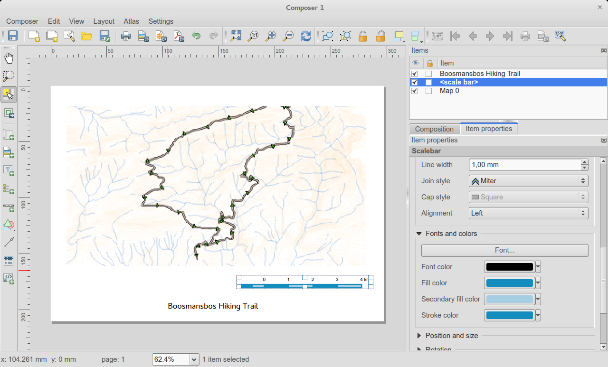

Feature: Improved item snapping
~~~~~~~~~~~~~~~~~~~~~~~~~~~~~~~

Snapping thresholds are now set in pixels, allowing for finer movement
and resizing of items when zoomed in to a composition.
Items within a group are no longer used for auto snap lines.

.. figure:: images/entries/8e43479380c28942345f3d9500dd956bd13f43e8.png
   :align: center
   :alt:

Feature: Multiple overviews for a map item
~~~~~~~~~~~~~~~~~~~~~~~~~~~~~~~~~~~~~~~~~~

Sometimes it is useful to be able to show more than one overview frame
for a map frame. For example if you want to show where your map is in
local, regional and global context, using multiple overview maps can
help you to achieve this. As of QGIS 2.6 you can now achieve this by
assigning as many maps as you like to the 'overview' role in your
composition.

.. figure:: images/entries/88b55cc5f5e7cfb62486fe3b4867b7133ae66953.png
   :align: center
   :alt:

Feature: HTML item improvements
~~~~~~~~~~~~~~~~~~~~~~~~~~~~~~~

There are a number of useful new options for the HTML composer item:

-  Option for manual entry of HTML source
-  QGIS expressions within HTML source can be evaluated prior to
   rendering HTML content
-  Data defined URL for HTML source
-  Allow for creating a user stylesheet to override HTML styles

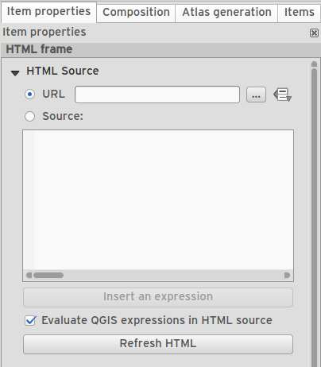

Feature: Composer map grid improvements
~~~~~~~~~~~~~~~~~~~~~~~~~~~~~~~~~~~~~~~

-  You can now have multiple grids with different properties.
-  You can mix reprojected grids and Lat/Long grids.
-  You can use standard QGIS symbology grid lines etc.
-  There is a new frame/annotations only grid style. Selecting this
   style causes only the frame and annotations to be drawn, with no grid
   lines or other markings over the map.
-  There are now options for controlling which side of a map item the
   frame is drawn on.
-  There are new tick styles for frames, with inner ticks, outer ticks
   and both inner and outer tick options.
-  We have made improvements to grid annotations, including many new
   formats for annotations.
-  Grid annotations now use the typographically correct prime and double
   prime symbols for grid annotations.

.. figure:: images/entries/eeb61d7da3d3f95283b1bb47545cbdff9cc334ae.png
   :align: center
   :alt:

Processing
----------

Feature: On-line collection of models and scripts
~~~~~~~~~~~~~~~~~~~~~~~~~~~~~~~~~~~~~~~~~~~~~~~~~

Models and scripts can be downloaded from the online collection and
installed directly from the Processing interface. The collection will be
expanded with new scripts and models provided by Processing users.

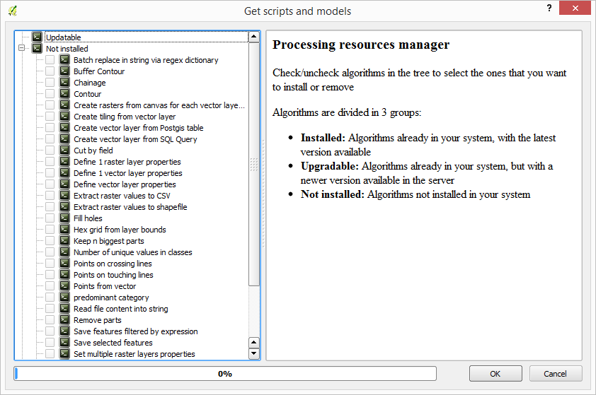

Feature: New modeler implementation
~~~~~~~~~~~~~~~~~~~~~~~~~~~~~~~~~~~

The modeler has been rewritten, and now provides extra functionality
such as allowing nested models with no depth limit. Models are now
stored as JSON files. Backwards compatibility is kept, so all models can
still be used. You can also now drag and drop items from the inputs and
algorithms onto the modeler graph.

.. figure:: images/entries/72bb8beaf97133424d1e68da67ae6fe79ea6faf6.png
   :align: center
   :alt:

Programmability
---------------

Feature: API changes for QGIS widgets
~~~~~~~~~~~~~~~~~~~~~~~~~~~~~~~~~~~~~

In order to normalise the naming of QGIS widgets, some minor API changes
have been made. Almost all edit widgets were renamed by adding "Wrapper"
at the end of their names. In particular this concerns:

-  QgsCheckboxWidget -> QgsCheckboxWidgetWrapper
-  QgsClassificationWidget -> QgsClassificationWidgetWrapper
-  QgsColorWidget -> QgsColorWidgetWrapper
-  QgsEnumerationWidget -> QgsEnumerationWidgetWrapper
-  QgsFilenameWidget -> QgsFilenameWidgetWrapper
-  QgsHiddenWidget -> QgsHiddenWidgetWrapper
-  QgsPhotoWidget -> QgsPhotoWidgetWrapper
-  QgsRangeWidget -> QgsRangeWidgetWrapper
-  QgsTexteditWidget -> QgsTexteditWrapper
-  QgsUniquevalueWidget -> QgsUniquevalueWidgetWrapper
-  QgsUuidWidget -> QgsUuidWidgetWrapper
-  QgsValuemapWidget -> QgsValuemapWidgetWrapper
-  QgsValuerelationWidget -> QgsValuerelationWidgetWrapper
-  QgsWebviewWidget -> QgsWebviewWidgetWrapper

QGIS Server
-----------

Feature: Enhancements of searching with GetFeatureInfo request
~~~~~~~~~~~~~~~~~~~~~~~~~~~~~~~~~~~~~~~~~~~~~~~~~~~~~~~~~~~~~~

https://github.com/qgis/QGIS/commit/8888c5f0c0e0ffdf23453a20addf6abaf125845d

Feature: Add a precision setting for GetFeatureInfo geometry attributes
~~~~~~~~~~~~~~~~~~~~~~~~~~~~~~~~~~~~~~~~~~~~~~~~~~~~~~~~~~~~~~~~~~~~~~~

Symbology
---------

Feature: Better random colour choice
~~~~~~~~~~~~~~~~~~~~~~~~~~~~~~~~~~~~

We have improved the random colour algorithm for classified renderer so
that the colours generated are more visually distinct from each other.

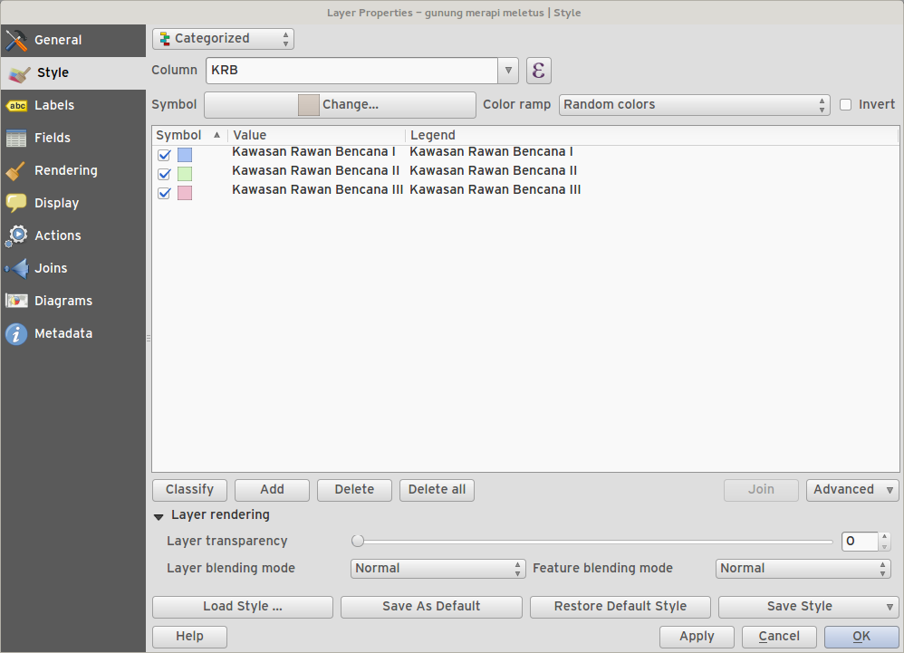

Feature: Symbology user interface improvements
~~~~~~~~~~~~~~~~~~~~~~~~~~~~~~~~~~~~~~~~~~~~~~

-  Where possible, properties of symbol layer are maintained when
   changing symbol layer type.
-  Added an edit button for shapeburst and gradient color ramps.
-  Automatic update of label and neighboring ranges boundaries.
-  Classes are automatically converted from categorised and graduated
   classes when switching to rule based renderer.
-  Added units and number of decimal places to graduated renderer
   labels.
-  Improved responsiveness to changes in color ramp, inverted colour
   ramp, and other options in GUI.
-  Retain symbol when switching between simple, graduated, categorized,
   and other renderers.
-  Improved labelling of StdDev calculation mode.

.. figure:: images/entries/08305d5131c28c45b400662267ff0d174ef9c8ce.png
   :align: center
   :alt:

User Interface
--------------

Feature: Syntax highlighting code editor
~~~~~~~~~~~~~~~~~~~~~~~~~~~~~~~~~~~~~~~~

For python script editors, expression builder, filter window, composer
HTML and CSS editors

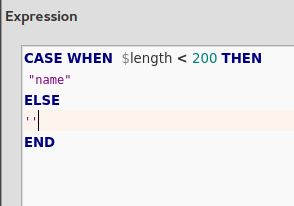

Feature: Color palettes
~~~~~~~~~~~~~~~~~~~~~~~

You can now define your own custom color palettes for use in QGIS.

-  Custom user global color palette (in options dialog).
-  Per project color palette (in project properties dialog).
-  Colors are shown in color button menus and new color picker dialog.
-  You can import/export colors to a GPL palette file.

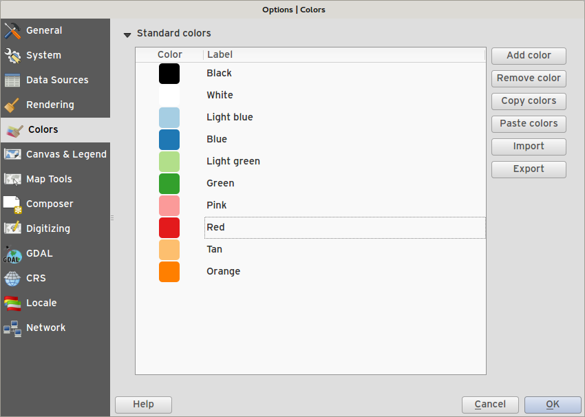

Feature: New color picker dialog
~~~~~~~~~~~~~~~~~~~~~~~~~~~~~~~~

There is a new custom QGIS color picker dialog. Features include:
 - Sliders for hue, saturation, value, red, green, blue color
   components.
 - Alpha slider.
 - Option to copy/paste html color codes (in a variety of formats).
 - Before/after color preview, with alpha preview.
 - Interactive 2D color ramp widget.
 - Hue wheel/triangle widget.
 - Editable color palettes, including the ability to create new palettes
   and import/export colors to a GPL palette file.
 - Live color sampler with option to sample over a set radius (OS
   support dependant).
 - Supports interaction with other apps via drag and drop of colors (OS
   support dependant).
 - Option to disable the dialog and use the native picker dialog
   instead.

.. figure:: images/entries/7189c0fe2d1ff3fdc63c531a02f74b5d32b70bfd.png
   :align: center
   :alt:

Feature: Single select feature tool merged into select by rectangle
~~~~~~~~~~~~~~~~~~~~~~~~~~~~~~~~~~~~~~~~~~~~~~~~~~~~~~~~~~~~~~~~~~~

We have merged the single selection tool into the rectangle tool. If you
want to select a single feature, simply enable the rectangle tool and
then single click (rather than dragging a rectangle) a feature.

.. figure:: images/entries/f8a68fcdfcaa59e6162185acb5c92edb9145c881.png
   :align: center
   :alt:

Feature: Add layer to map canvas behaviour
~~~~~~~~~~~~~~~~~~~~~~~~~~~~~~~~~~~~~~~~~~

In many of QGIS' dialogs that generate a new layer, the 'Add layer to
map canvas' checkbox is now checked by default so that the new layer
automatically gets added to the map.

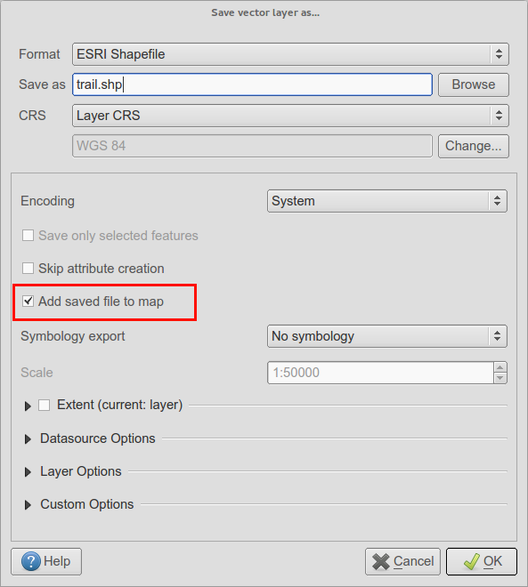

Feature: Add icon size 48 and 64
~~~~~~~~~~~~~~~~~~~~~~~~~~~~~~~~

For those using QGIS on touch devices (or if you just like big, chunky
icons), you can now set the icons up to 64 x 64 pixels in size.

.. figure:: images/entries/3be3f51da2f54a8395f054f757f9fae1948a6103.png
   :align: center
   :alt:

Feature: New colour buttons
~~~~~~~~~~~~~~~~~~~~~~~~~~~

This is probably one of the most useful new features in QGIS 2.6 -
especially if you are involved a lot in cartography work. The colour
button used everywhere in QGIS has been enhanced, with drop down menus,
colour swatches, default colours, etc. Click on the drop down item to
the right of the colour button to see the quick options. Click on the
button to the left of the colour widget to see a standard colour chooser
dialog.

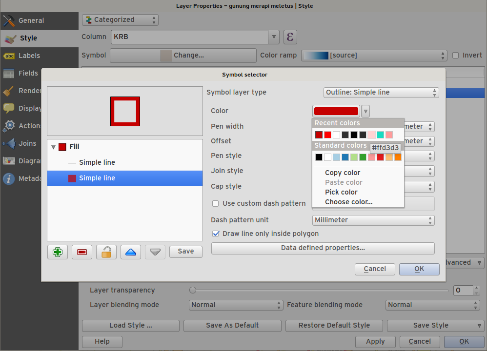

Feature: Context menu for identify tool
~~~~~~~~~~~~~~~~~~~~~~~~~~~~~~~~~~~~~~~

When using the identify tool, you can now right click on the canvas to
use the identify tool in context mode. In the menu that appears you can
define which feature types you wish to identify (all all if you like).

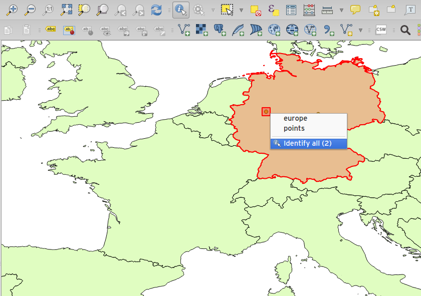
