.. _changelog28:

Changelog for QGIS 2.8
=======================

Release date: 2015-03-02

This is the change log for the next release of QGIS - version 2.8 ' Wien'. Wien is German for 'Vienna' - host city to our developer meet up in November 2009 and again in March 2014.

**Long Term Release**

This is a special release since it is designated an 'LTR' (Long Term Release). LTR releases will be supported with backported bug fixes for one year, and will be in permanent feature freeze (i.e. no new features will be added, only bug fixes and trivial updates).

The purpose of LTR releases is to provide a stable and less frequently changing platform for enterprises and organisations that do not want to deal with updating user skills, training materials etc. more than once per year. The success of the LTR is very much down to you, our beloved users - we need your support to help funding bug fixes and making sure in your support contracts with support providers specify that any bug fixes done on your behalf are applied to the LTR branch as well as our normal development branch.

If an LTR is important to you, please consider also directly supporting the QGIS project, or encourage your commercial provider to use LTR as a basis for your enterprise solution so that everyone may benefit from a stable platform that is being continuously improved and refined. Note that for users and organisations that like to live on the frontier, our regular four monthly releases will continue unabated.

**New Features**

QGIS 2.8 is also a special release because it includes so many great new features, tweaks and enhancements to make the most popular Free desktop GIS even more feature filled and useful.

Whenever new features are added to software they introduce the possibility of new bugs - if you encounter any problems with this release, please file a ticket `on the QGIS Bug Tracker <http://hub.qgis.org>`_.

**Thanks**

We would like to thank the developers, documenters, testers and all the
many folks out there who volunteer their time and effort (or fund people
to do so).

From the QGIS community we hope you enjoy this release! If you wish to
donate time, money or otherwise get involved in making QGIS more
awesome, please wander along to `qgis.org <https://qgis.org>`_ and lend a
hand!

Finally we would like to thank our official sponsors for the invaluable
financial support they provide to this project:

-  **GOLD Sponsor: Asia Air Survey, Japan** http://www.asiaairsurvey.com/

-  SILVER Sponsor: `Sourcepole AG, Switzerland <http://www.sourcepole.com/>`_
-  SILVER Sponsor: `State of Vorarlberg, Austria <http://www.vorarlberg.at/>`_
-  SILVER Sponsor: `Office of Public Works, Ireland, Ireland <http://www.opw.ie/>`_

-  BRONZE Sponsor: `GIS3W, Italy <http://www.gis3w.it/>`_ 
-  BRONZE Sponsor: `www.molitec.it, Italy <http://www.molitec.it/>`_
-  BRONZE Sponsor: `www.argusoft.de, Germany <http://www.argusoft.de>`_
-  BRONZE Sponsor: `www.openrunner.com, France <http://www.openrunner.com>`_
-  BRONZE Sponsor: `GKG Kassel,(Dr.-Ing. Claas Leiner), Germany <http://www.gkg-kassel.de/>`_
-  BRONZE Sponsor: `Customer Analytics, USA <http://www.customeranalytics.com/>`_
-  BRONZE Sponsor: `Urbsol, Australia <http://www.urbsol.com.au/>`_
-  BRONZE Sponsor: `MappingGIS, Spain <http://www.mappinggis.com/>`_
-  BRONZE Sponsor: `Lutra Consulting, UK <http://www.lutraconsulting.co.uk/>`_
-  BRONZE Sponsor: `ADLARES GmbH, Germany <http://www.adlares.com/>`_
-  BRONZE Sponsor: `Avioportolano Italia, Italy <http://www.avioportolano.it/>`_
-  BRONZE Sponsor: `Faculty of Geology, Geophysics and Environmental Protection, AGH, ​University of Science and Technology, Poland <http://www.wggios.agh.edu.pl/en>`_

A current list of donors who have made financial contributions large and
small to the project can be seen on our `donors
list <https://qgis.org/en/site/about/sponsorship.html#list-of-donors>`_.
If you would like to become an official project sponsor, please visit
`our sponsorship
page <https://qgis.org/en/site/about/sponsorship.html#sponsorship>`_ for
details. Sponsoring QGIS helps us to fund our six monthly developer
meetings, maintain project infrastructure and fund bug fixing efforts.

If you enjoy using QGIS, please consider making a donation to support
the project - either
`financial <https://qgis.org/en/site/getinvolved/donations.html>`_ or of
`your time and skills <https://qgis.org/en/site/getinvolved/index.html>`_! Lastly we
would like to also take a moment to encourage you to fund a `special
campaign <http://blog.vitu.ch/10102014-1046/crowdfunding-initiative-automated-testing>`_
by one of our QGIS developers to get a working test suite for QGIS so
that we can improve out quality assurance process and deliver you the
best possible releases.

QGIS is Free software and you are under no obligation to pay anything to
use it - in fact we want to encourage people far and wide to use it
regardless of what your financial or social status is - we believe
empowering people with spatial decision making tools will result in a
better society for all of humanity.

.. contents::
   :local:

General 
-------

Feature: Enter expressions into spin boxes
~~~~~~~~~~~~~~~~~~~~~~~~~~~~~~~~~~~~~~~~~~

When editing attributes in the **attribute table or forms**, you can now enter expressions directly into spin boxes, e.g. ``5 * 2.5`` and they will be automatically evaluated.

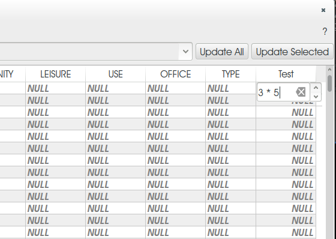

Feature: Bookmarks can be imported/exported 
~~~~~~~~~~~~~~~~~~~~~~~~~~~~~~~~~~~~~~~~~~~

It is now possible to save / load your bookmarks to a file. This makes it easy to share bookmarked locations, or transfer them between computers.

**This feature was developed by:** Salvatore Larosa

.. figure:: images/entries/e3d35c32da659821bc0c657b8e7ba40587a1bfb2.jpg
   :align: center
   :alt:

Feature: Improvements to expressions 
~~~~~~~~~~~~~~~~~~~~~~~~~~~~~~~~~~~~

- **Integer division produces a double when required**: Previously dividing two integers in an expression would always result in an integer value, i.e. ``5 / 2 = 2``. Now the result will always be double when required, so ``5 / 2 = 2.5``, which is much more expected for users. A new integer divide operator - ``//`` has been added to mimic the old behaviour, i.e. ``5 // 2 = 2``.
- **New 'if()' function**: There is now a new ``if(cond, true, false)`` expression
- **Lazy evaluation for expressions**
- **Added get and transform geometry**: These new keywords can be used with ``getFeature`` for some geometry tests like intersects, crosses, contains, etc.
- ``geometry`` - returns the feature's geometry
- ``transform`` - returns the transformed geometry

.. figure:: images/entries/ec56f9b8331e619ad1a44970fde655b68125f9d8.png
   :align: center
   :alt:

Feature: Continuous testing framework and QA improvements  
~~~~~~~~~~~~~~~~~~~~~~~~~~~~~~~~~~~~~~~~~~~~~~~~~~~~~~~~~

In our ongoing quest to improve the stability and quality of QGIS, every commit is now tested against a growing test suite to identify regressions automatically. In the image on the right you can see the list of incoming pull requests on our GitHub page are now automatically annotated with a check or cross based on whether our test suite successfully ran on `Travis.ci <https://travis-ci.org/qgis/QGIS>`_ when the pull request is made or updated.

We are also now regularly performing Coverity scans of QGIS codebase. As a result of this, we have identified and fixed over 1000 flagged issues, including memory leaks and potential crashes. QGIS has a defect density of 0.01 wheras the average for programs of similar size is about 1.0.

.. figure:: images/entries/4ec86080ff150743f1bdc88d3ac7881a6cd405de.png
   :align: center
   :alt:

Analysis tools
--------------

Feature: Measure dialog improvements 
~~~~~~~~~~~~~~~~~~~~~~~~~~~~~~~~~~~~

The measure tool has been improved so that you can now select which units should be used in the measure dialog. There is also a new info section in the dialog that shows which settings are being used during measurement calculations.

.. figure:: images/entries/67a001d3d800feec8805de698ed364e91d00daab.png
   :align: center
   :alt:

Browser
-------

More responsive browser 
~~~~~~~~~~~~~~~~~~~~~~~

In the QGIS Browser items are now expanded in their own threads, speeding up the load time of the browser and making the browser more responsive. Navigating PostGIS sources is now much faster in the browser. The animated snapshot to the right (click image to see the animation) shows the loading of two slow WMS servers in parallel .
The browser's state (tree expansion) is restored on startup.

**This feature was developed by:** Radim Blazek

.. figure:: images/entries/c8df646572084b8f12027fd54c1210f14c80c8e1.gif
   :align: center
   :alt:

Data Providers
--------------

Feature: Support for contextual WMS legend graphics 
~~~~~~~~~~~~~~~~~~~~~~~~~~~~~~~~~~~~~~~~~~~~~~~~~~~

If your WMS server supports contextual legends, you can make use of them in QGIS now too. Contextual legends are getLegendGraphic requests which return only the relevant legend for your current view extent, and thus do not include legend items for things you can't see in the current map.

**This feature was funded by:** `Regione Toscana <http://www.regione.toscana.it/>`_

**This feature was developed by:** `Faunalia <http://www.faunalia.eu/>`_

.. figure:: images/entries/e516a25492b547113c487d00475cfe07bc7b131e.png
   :align: center
   :alt:

Data management
---------------

Feature: Custom prefix for joins
~~~~~~~~~~~~~~~~~~~~~~~~~~~~~~~~

You can now define a custom prefix in the joins manager in the layer properties dialog. When using a prefix, the attribute table in will show joined attribute names with your preferred prefix.

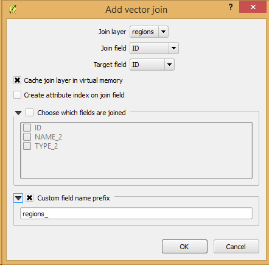

Feature: Support for creation of temporary memory layers
~~~~~~~~~~~~~~~~~~~~~~~~~~~~~~~~~~~~~~~~~~~~~~~~~~~~~~~~

This release add support for creating new temporary scratch layers within QGIS core. Scratch layers can be created in the ``Layer --> Create layer --> New Temporary Scratch Layer`` menu option.

.. figure:: images/entries/bddbbd6cb55e9a19441ea564275dd480661e61de.png
   :align: center
   :alt:

Feature: Support for calculations on selected rows 
~~~~~~~~~~~~~~~~~~~~~~~~~~~~~~~~~~~~~~~~~~~~~~~~~~

In the attribute table you can now do calculations on selected rows only thanks to the new button added to the field calculator bar.

.. figure:: images/entries/1b7ead001901ed4242d26556abac055834e367b2.png
   :align: center
   :alt:

Digitising 
----------

Feature: Advanced digitizing tools 
~~~~~~~~~~~~~~~~~~~~~~~~~~~~~~~~~~

If you ever wished you could digitise lines exactly parallel or at right angles, lock lines to specific angles and so on in QGIS, now you can! The advanced digitizing tools is a port of the CADinput plugin and adds a new panel to QGIS. The panel becomes active when capturing new geometries or geometry parts

.. figure:: images/entries/50f726e5899eb72dcec76e4bed1936bcf957e75f.jpg
   :align: center
   :alt:

Feature: Improved simplify tool 
~~~~~~~~~~~~~~~~~~~~~~~~~~~~~~~

The simplify tool has been overhauled, adding:  

-    OTF reprojection support
-    user can specify exact tolerance (not just non-sense relative value)
-    tolerance can be specified either in map units or layer units or pixels
-    tolerance settings are stored in settings
-    simplify multiple features at once (drag a rectangle instead of just clicking)
-    support for multi-part features
-    statistics about reduction of the number of vertices

**This feature was funded by:** `Tracks for Africa <http://tracks4africa.com/>`_

**This feature was developed by:** `Lutra Consulting <http://www.lutraconsulting.co.uk/>`_ in cooperation with  `Kartoza <http://kartoza.com/>`_

.. figure:: images/entries/20b7f96ffc7d37b8c2ae09189d7957a929a716e5.png
   :align: center
   :alt:

Feature: Snapping improvements 
~~~~~~~~~~~~~~~~~~~~~~~~~~~~~~

There is a new snapping mode : **snap to all layers** which makes it quick to enable snapping between all layers. Also the underlying snapping architecture of QGIS has been overhauled making snapping much faster on large projects and improving the precision with which snapping takes place. ​There’s also less confusion with snapping tolerances being to map units or layer units, so those anticipated 1 metre tolerances don’t become 1 degree tolerances without you knowing.

**This feature was funded by:** ` Ville de Vevey, SITNyon <http://www.vevey.ch/>`_ and `QGIS Usergroup Switzerland <http://www.qgis.ch/>`_

**This feature was developed by:** `Lutra Consulting <http://www.lutraconsulting.co.uk/>`_

.. figure:: images/entries/8454af2743154585eb82325ab2694e50e7d9efcd.jpg
   :align: center
   :alt:

Layer Legend
------------

Feature: Show rule-based renderer's legend as a tree 
~~~~~~~~~~~~~~~~~~~~~~~~~~~~~~~~~~~~~~~~~~~~~~~~~~~~

Advanced users who leverage QGIS's rule based renderer system will be pleased to see that the rules are now presented as a tree in the legend. Better still, each node in the **tree** can be **toggled on/off** individually providing for great flexibility in which sublayers get rendered in your map.

**This feature was funded by:** `SIGE <http://www.sige.ch/>`_

**This feature was developed by:** `Lutra Consulting <http://www.lutraconsulting.co.uk/>`_ in cooperation with  `Kartoza <http://kartoza.com/>`_

.. figure:: images/entries/0d39448aa0893d7a71c5241aa2181750535e62c3.png
   :align: center
   :alt:

Map Composer
------------

Feature: Composer GUI Improvements 
~~~~~~~~~~~~~~~~~~~~~~~~~~~~~~~~~~

- View menu option to **hide bounding boxes**. This allows users to hide the bounding boxes for selected items within a composition. It's a handy feature for allowing interaction with items while previewing exactly how they will look when the composition is exported, without large boxes blocking the view.
- **Full screen mode for composer**
- Option to **toggle display of panels** in composer, available by both the ``view menu``, using the shortcut ``F10`` and by pressing ``Tab`` when the composer canvas is selected. It's useful for maximising the space when planning a map layout.

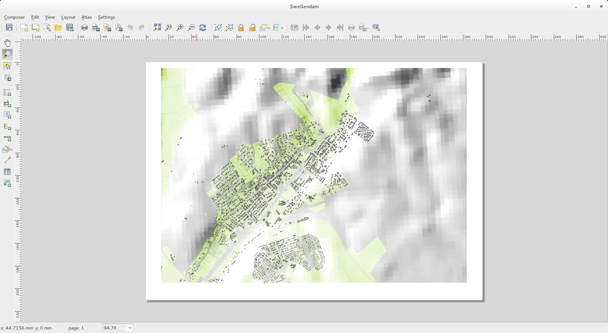

Feature: Grid improvements  
~~~~~~~~~~~~~~~~~~~~~~~~~~

In the composer you now have finer control of frame and annotation display. Previously, for rotated maps or reprojected grids, the composer would
draw all coordinates for every map side. This resulted in a mix of latitude/y and longitude/x coordinates showing on a side. Now you can control whether you want all coordinates, latitude only or longitude only for each map frame side. Similar options have also been added for controlling how a map grid frame is divided.

New vertical descending direction for annotations. This change adds a new descending vertical direction mode for map grid annotations. Previously only ascending text was
supported for vertical annotations.

.. figure:: images/entries/288d533cbed1f6beeef17004897060c8639bbbb4.png
   :align: center
   :alt:

Feature: Label item margins
~~~~~~~~~~~~~~~~~~~~~~~~~~~

- You can now control both horizontal and vertical **margins for label** items. Previously only a single margin setting would apply to both horizontal and vertical margins. This change allows users to specify different horizontal and vertical margins.
- You can now specify negative margins for label items, **allowing text to be drawn slightly outside of a label item's bounds**. This is desirable for aligning label items with other items while allowing for optical margin alignment for the label type.

.. figure:: images/entries/7f4905d74ca140ed369bea8866357b9d952ee212.png
   :align: center
   :alt:

Plugins
-------

Feature: Python console improvements 
~~~~~~~~~~~~~~~~~~~~~~~~~~~~~~~~~~~~

You can now drag and drop python scripts into QGIS window and they will be executed automatically. We also added a toolbar icon to the plugins toolbar and a shortcut ( ``Ctrl-Alt-P`` ) for quick access to the python console.

.. figure:: images/entries/03be8f30ce341816bd3bcd1a58f3b913ddcea07c.png
   :align: center
   :alt:

Processing
----------

Feature: New geometric predicate parameter type 
~~~~~~~~~~~~~~~~~~~~~~~~~~~~~~~~~~~~~~~~~~~~~~~

With this new parameter type, used in **Select by location, Extract by location** and **Join attributes by location** algorithms, the user can select precisely the spatial operator to use.

**This feature was funded by:** `French Ministry of Ecology, Sustainable Development and Energy <http://www.developpement-durable.gouv.fr/>`_

**This feature was developed by:** `Camptocamp <http//www.camptocamp.com>`_

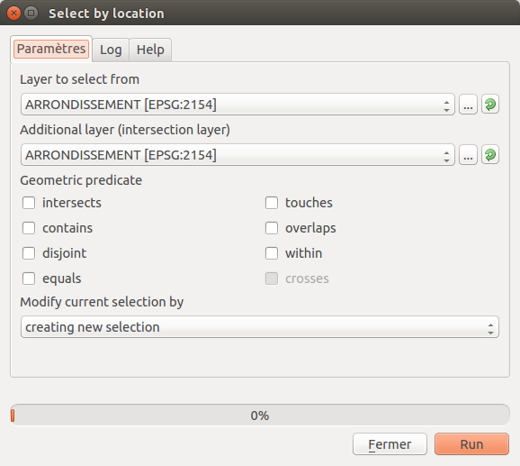

Feature: New algorithms
~~~~~~~~~~~~~~~~~~~~~~~

A number of new algorithms have been added to the processing framework:

- **Regular points** algorithm (addresses #5953)
- **Symetrical difference** algorithm (addresses #5953)
- **Vector split** algorithm (addresses #5953)
- **Vector grid** algorithm (addresses #5953)
- **Hypsometric curves** calculation algorithm
- **Split lines with lines**
- **Refactor fields** attributes manipulation algorithm

.. figure:: images/entries/b2403fae20cd24cfb1883d24e97de6fc51e40c88.png
   :align: center
   :alt:

Programmability 
---------------

Feature: Add comment functionality to expressions 
~~~~~~~~~~~~~~~~~~~~~~~~~~~~~~~~~~~~~~~~~~~~~~~~~

Comments can now be added to expressions using an SQL style ``--`` prefix.

.. figure:: images/entries/e1579eec6d8ab74330fb2f784c68ed16c83bb79d.jpg
   :align: center
   :alt:

Feature: Custom expression function editor  
~~~~~~~~~~~~~~~~~~~~~~~~~~~~~~~~~~~~~~~~~~

You can now define custom expression functions in the expression widget. See `this blog post <http://nathanw.net/2015/01/19/function-editor-for-qgis-expressions/>`_ for more details.

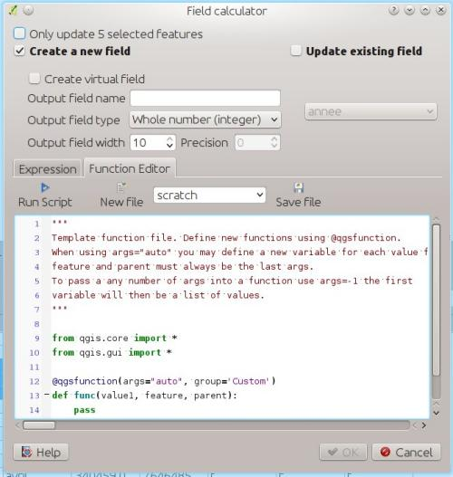

Feature: Qt5 support  
~~~~~~~~~~~~~~~~~~~~

QGIS can now be built using Qt5 libraries. Note that currently most binaries will still with Qt4 by default.

.. figure:: images/entries/c702d89260cbab35323c052a15ab5c5728fc7115.png
   :align: center
   :alt:

Feature: Bulk loading spatial index   
~~~~~~~~~~~~~~~~~~~~~~~~~~~~~~~~~~~

In the API we have added support for bulk loading of spatial index. This is much faster way of initializing a spatial index. From python it is as simple as:

``index = QgsSpatialIndex( layer.getFeatures() )``

From a simple test with 50K points in a memory layer:

**bulk loading ~ 100 ms**

inserting features ~ 600 ms

The index tree should be also in theory be better constructed and may result in faster lookups.

.. figure:: images/entries/80cea18c68b7885cb71c1682ca3777caa048ff9e.png
   :align: center
   :alt:

Feature: Run only the selected part of a SQL query   
~~~~~~~~~~~~~~~~~~~~~~~~~~~~~~~~~~~~~~~~~~~~~~~~~~

In the DB Manager SQL editor, it is now possible to highlight a portion of the SQL and only that portion will be executed when you press ``F5`` or click the ``run`` button

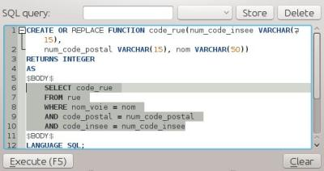

QGIS Server
-----------

Feature: Server python plugins
~~~~~~~~~~~~~~~~~~~~~~~~~~~~~~

Python plugins support for QGIS server brings the power of python to server side, allowing for fast and efficient development and deployment of new features.

**This feature was developed by:** `Alessandro Pasotti (ItOpen) <http://www.itopen.it/>`_ 

Feature: Support for layer styles 
~~~~~~~~~~~~~~~~~~~~~~~~~~~~~~~~~

- QGIS Server now supports predefined layer styles in GetMap requests
- QGIS Server now supports multiple styles in GetStyles request (see symbology section below)

Feature: Add DescribeLayer Method to WMS
~~~~~~~~~~~~~~~~~~~~~~~~~~~~~~~~~~~~~~~~

**Styled Layer Descriptor profile of the Web Map Service : DescribeLayer**

http://www.opengeospatial.org/standards/sld

Defining a user-defined style requires information about the features being symbolized, or at least their feature/coverage type. Since user-defined styles can be applied to a named layer, there needs to be a mechanism by which a client can obtain feature/coverage-type information for a named layer. This is another example of bridging the gap between the WMS concepts of layers and styles and WFS/WCS concepts such as feature-type and coverage layer. To allow this, a WMS may optionally support the **DescribeLayer** request.

DescribeLayer method has been thought to be a better approach than overloading the WMS capabilities document even more.

For each named layer, the description should indicate if it is indeed based on feature data and if so it should indicate the WFS/WCS (by a URL prefix) and the feature/coverage types. Note that it is perfectly valid for a named layer not to be describable in this way.

Symbology
---------

Feature: Raster image fill type
~~~~~~~~~~~~~~~~~~~~~~~~~~~~~~~

This new symbol layer type allows for filling polygons with a (tiled) raster image.

Options include (data defined) file name, opacity, image size (in pixels, mm or map units), coordinate mode (feature or view), and rotation.

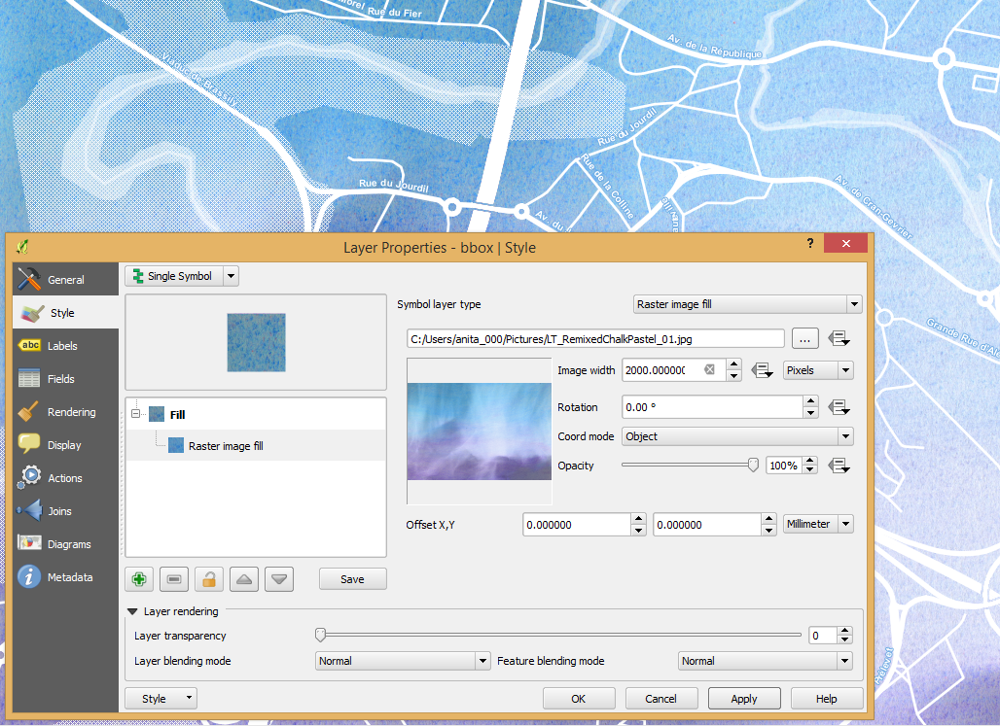

Feature: Live heatmap renderer
~~~~~~~~~~~~~~~~~~~~~~~~~~~~~~

The new heatmap vector layer renderer allows for live, dynamic heatmaps for point layers.

Options include specifying heatmap radius in pixels, mm or map units, choice of color ramp,weighting points by field, and a slider for selecting a tradeoff between render speed and quality.

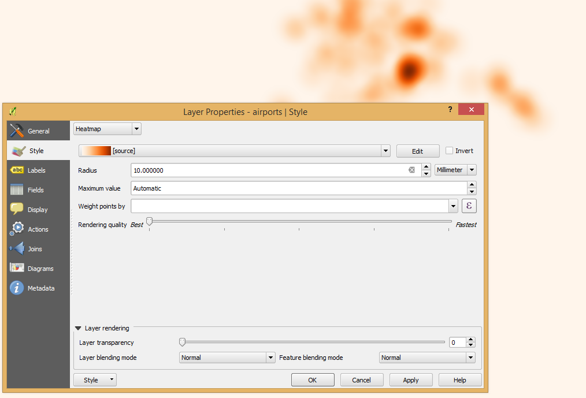

Feature: Multiple styles per layer 
~~~~~~~~~~~~~~~~~~~~~~~~~~~~~~~~~~

It is now possible to set multiple styles for a layer and then easily toggle between them. This functionality is available in the ``legend context menu --> styles sub-menu`` where it is possible to add/remove styles and quickly switch between them. Layer sets remember styles, and different styles can also be applied to individual composer map items. The multiple styles defined are also available when the project is served via QGIS Server as a WMS layer. For more information on this see also this `blog post <http://www.lutraconsulting.co.uk/blog/2015/02/19/towering-qgis-release/>`_.

**This feature was funded by:** `Regione Toscana <http://www.regione.toscana.it/>`_

**This feature was developed by:** `Gis3W <http://www.gis3w.it/>`_, `Lutra Consulting <http://www.lutraconsulting.co.uk/>`_

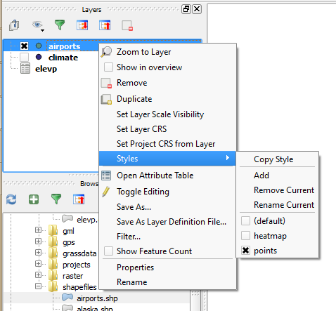

Feature: More data-defined symbology settings 
~~~~~~~~~~~~~~~~~~~~~~~~~~~~~~~~~~~~~~~~~~~~~

The user interface for data defined symbology settings has been improved - moving the data defined option next to each data definable property (in keeping with other parts of QGIS such as the labeling properties). Also many new properties have been made data definable for symbology. This user interface improvement also provides a way to immediately see if a data defined override is defined as well as easier access to the data-defined settings.

.. figure:: images/entries/1af9b133ea80a4469e9be81107449b0e22df442b.png
   :align: center
   :alt:

Feature: DXF export: improve marker symbol export
~~~~~~~~~~~~~~~~~~~~~~~~~~~~~~~~~~~~~~~~~~~~~~~~~

The exporter functionality for DXF files has been improved, with better fidelity of exported marker symbols to the original QGIS symbology.

Feature: Map rotation in canvas, improved rotation in composer 
~~~~~~~~~~~~~~~~~~~~~~~~~~~~~~~~~~~~~~~~~~~~~~~~~~~~~~~~~~~~~~

This release includes preliminary support for rotation in the map canvas. You can rotate the canvas using the new rotation widget in the status bar. Rotation support has been extended into the map composer too so that it correctly handles labelling and symbology, etc.

**This feature was funded by:** `Japan Space Imaging Corporation (JSI) <http://www.spaceimaging.co.jp/>`_

**This feature was developed by:** `Faunalia <http://www.faunalia.eu/>`_

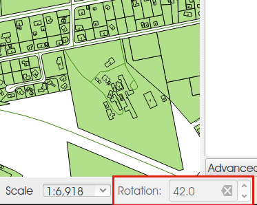

User Interface
--------------

Feature: Improved/consistent projection selection  
~~~~~~~~~~~~~~~~~~~~~~~~~~~~~~~~~~~~~~~~~~~~~~~~~

All dialogs now use a consistent projection selection widget, which allows for quickly selecting from recently used and standard project/QGIS projections.

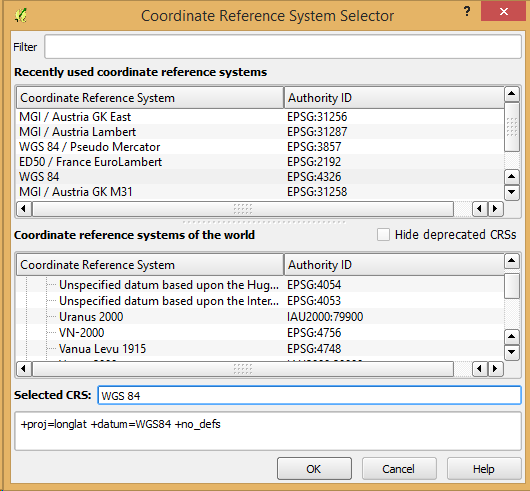

.

