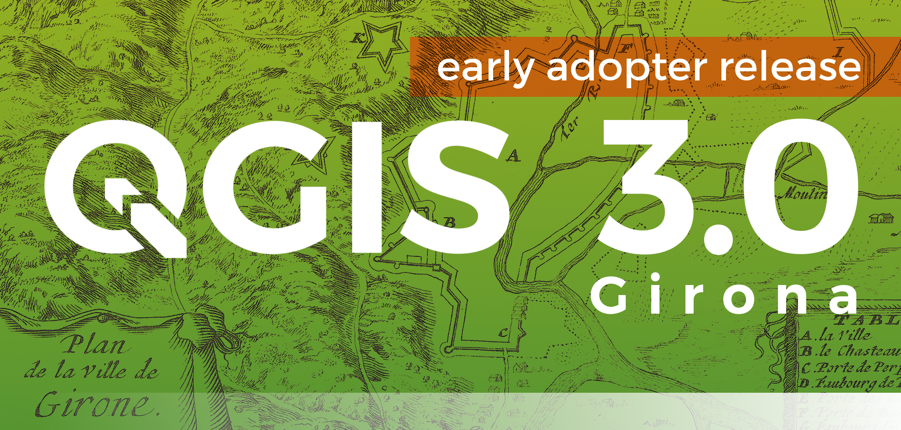

.. _changelog30:

Changelog for QGIS 3.0
======================

This is the first release in the 3.x series. It comes with tons of new features and under-the-hood updates. As such, we do not expect it to be as reliable as the 2.18 LTR just yet.

From now on, 2.18 is the only Long Term Release (LTR) and 2.14 is retired.

**New Features**

We are preparing a list of features and screenshots that will appear here later.

If you want a sneak preview see: http://changelog.qgis.org/en/qgis/version/3.0.0/ (but use the https://qgis.org/en/site/forusers/visualchangelog30 link for all communication).

