.. _changelog312:

Changelog for QGIS 3.12
=======================

|image1|

Release date: 2020-02-21

If you are after new features and a ton of bug fixes, this release will have you smiling from ear to ear! QGIS 3.12 adds rich new capabilities to almost every part of QGIS. From label masks to a native PG Raster provider to incredible new mesh layer capabilities, and much, much more, this release has something for everyone. As always, we would like to remind you that QGIS is an open-source project and if you are able to, consider supporting our work through donations, sponsorship or contributions to the code documentation, web site and so on.

**Thanks**

We would like to thank the developers, documenters, testers and all the many folks out there who volunteer their time and effort (or fund people to do so). From the QGIS community, we hope you enjoy this release! If you wish to donate time, money or otherwise get involved in making QGIS more awesome, please wander along to qgis.org and lend a hand!

QGIS is supported by donors and sponsors. A current list of donors who have made financial contributions large and small to the project can be seen on our donors list. If you would like to become an official project sponsor, please visit our sponsorship page for details. Sponsoring QGIS helps us to fund our six monthly developer meetings, maintain project infrastructure and fund bug fixing efforts. A complete list of current sponsors is provided below - our very great thank you to all of our sponsors!

:raw-html:`
 <!-- to be filled via javascript loading of atom feed --> 
`

QGIS is Free software and you are under no obligation to pay anything to use it - in fact, we want to encourage people far and wide to use it regardless of what your financial or social status is - we believe empowering people with spatial decision-making tools will result in a better society for all of humanity.

.. contents::
   :local:

Map Tools
---------

Feature: QgsMapLayerAction: add legend context menu entry for action on selection
~~~~~~~~~~~~~~~~~~~~~~~~~~~~~~~~~~~~~~~~~~~~~~~~~~~~~~~~~~~~~~~~~~~~~~~~~~~~~~~~~

A new menu entry (Actions on selection) is added to the layer tree context menu. It is shown only when required (layer has selection and actions can be run on the given layer).

|imageQ1|

This feature was developed by `Denis Rouzaud <https://api.github.com/users/3nids>`__

Feature: Show distance from GPS lock position to current cursor
~~~~~~~~~~~~~~~~~~~~~~~~~~~~~~~~~~~~~~~~~~~~~~~~~~~~~~~~~~~~~~~

When a GPS device is connected, whenever the user moves the cursor over the canvas a live status bar message displays the distance and bearing from the cursor to the GPS fix position.

Project distance and bearing settings are respected in this display.

|Peek 2020-01-14 16-06|

This feature was developed by `Nyall Dawson <https://api.github.com/users/nyalldawson>`__

Feature: Add setting for format to show angular bearings to projects
~~~~~~~~~~~~~~~~~~~~~~~~~~~~~~~~~~~~~~~~~~~~~~~~~~~~~~~~~~~~~~~~~~~~

The Settings - Options - Map Tools tab contains a new setting for controlling the default format to use for displaying angular bearings for newly created projects. Whenever a new project is created, it will inherit this default setting.

The Project Properties dialog also has a new setting for the project-specific bearing format.

The intention is that whenever angular bearings are shown in QGIS, they will be formatted using the current project's bearing format settings. 

Also includes lots of nice API additions providing a stable, easy to discover place for setting and retrieving settings like the bearing format.

|Peek 2020-01-09 11-08|

This feature was developed by `Nyall Dawson <https://api.github.com/users/nyalldawson>`__

User Interface
--------------

Feature: Deselecting tables when adding PostgreSQL data after add button is clicked.
~~~~~~~~~~~~~~~~~~~~~~~~~~~~~~~~~~~~~~~~~~~~~~~~~~~~~~~~~~~~~~~~~~~~~~~~~~~~~~~~~~~~

When adding PostgreSQL data in Data Source Manager after pressing the add button QGIS should deselect previously selected tables.

This feature was funded by `Kartoza <http://kartoza.com/>`__

This feature was developed by `Samweli Mwakisambwe <http://samweli.github.io/>`__

Feature: Show the total pan distance and bearing in the status bar
~~~~~~~~~~~~~~~~~~~~~~~~~~~~~~~~~~~~~~~~~~~~~~~~~~~~~~~~~~~~~~~~~~

We added the total pan distance and bearing in the status bar during canvas pan operations. Allows users to know exactly how far (and in what direction) they've dragged the map.

|image5|

This feature was developed by `Nyall Dawson (North Road) <https://north-road.com/>`__

Feature: New option to set the default project file format (qgs/qgz)
~~~~~~~~~~~~~~~~~~~~~~~~~~~~~~~~~~~~~~~~~~~~~~~~~~~~~~~~~~~~~~~~~~~~

This adds a new global option to define the preferred project file format

|imageQ2|

This feature was funded by GEM foundation

This feature was developed by `Denis Rouzaud <https://api.github.com/users/3nids>`__

Feature: Fix invalid attributes dialog on copy to another layer
~~~~~~~~~~~~~~~~~~~~~~~~~~~~~~~~~~~~~~~~~~~~~~~~~~~~~~~~~~~~~~~

It's possible to copy features from one layer to another. If there are the same fields in the destination layer, then the attributes for them are taken from the original feature. If not, the default value is taken. Otherwise, the new attribute is null.

If the destination layer has constraints on the fields, these should be fulfilled now or disregarded on purpose. But not just copied invalid like it used to do.

That's why now the attributes are checked against the constraints. And for all the invalid features a dialog pops up.

|copydialog2|

And on pasting only one feature, the options are reduced:

|copypastesingle|

This feature was developed by `signedav <https://api.github.com/users/signedav>`__

Feature: Allow dropping a map layer from the layer tree onto a projection selection widget
~~~~~~~~~~~~~~~~~~~~~~~~~~~~~~~~~~~~~~~~~~~~~~~~~~~~~~~~~~~~~~~~~~~~~~~~~~~~~~~~~~~~~~~~~~

...to set the projection to match that layer. Just a little timesaving shortcut!

|Peek 2019-12-20 11-27|

This feature was developed by `Nyall Dawson <https://api.github.com/users/nyalldawson>`__

Feature: Processing raster calc: add missing btns and validate
~~~~~~~~~~~~~~~~~~~~~~~~~~~~~~~~~~~~~~~~~~~~~~~~~~~~~~~~~~~~~~

Add missing buttons for ABS/MIN/MAX and validate expression.

|image10|

This feature was developed by Alessandro Pasotti

Symbology
---------

Feature: Vector Trace Animation and Streamlines for Mesh Layer
~~~~~~~~~~~~~~~~~~~~~~~~~~~~~~~~~~~~~~~~~~~~~~~~~~~~~~~~~~~~~~

Mesh vector renderer now can visualize streamlines and particles on top of existing "arrow" mode.

|image11|

This feature was funded by `TUFLOW <http://www.tuflow.com>`__

This feature was developed by `Vincent Cloarec (Lutra Consulting) <http://www.lutraconsulting.co.uk>`__

Feature: Selective masking
~~~~~~~~~~~~~~~~~~~~~~~~~~

A new advanced rendering feature has been added: selective masking. It allows the definition of 'masks' areas around labels or point markers. These masks will "un-draw" only some symbol layers of other layers underneath, chosen by the user.

|image12|

This feature was funded by `QGIS.CH and others through a cofunding campaign <https://oslandia.com/en/offre-qgis/selective-masking/>`__

This feature was developed by `Hugo Mercier (Oslandia) <https://www.oslandia.com>`__

Feature: When decimal degrees rotation fails to evaluate, fallback to static value
~~~~~~~~~~~~~~~~~~~~~~~~~~~~~~~~~~~~~~~~~~~~~~~~~~~~~~~~~~~~~~~~~~~~~~~~~~~~~~~~~~

The legend finally also works nicely with data defined rotation. QGIS could already apply data defined rotation to symbols and individual symbol layers, but this resulted in a broken legend. The rotation of symbols (and symbol parts defined on symbol layers) on the legend can now be controlled by changing the default values next to the data defined properties.

The old behavior was to always fall back to 0 in case of a failing expression. Which made it hard to create a proper legend in some cases.

e.g. if you had two symbol layers with the following expressions for their rotation

::

    "orientation"

And

::

    90 + "orientation"

which would be two orthogonal symbol layers (e.g. denote a right angle), rotated by an orientation field.

Now in the legend (and symbol preview), both layers would be shown with a rotation of 0, because there is no associated feature with a field orientation.

The new behavior is to fall back to the static, configured values which makes it very intuitive to configure the legend for these cases.

**Before**

|Peek 2019-12-08 09-18|

**After**

|Peek 2019-12-08 09-16|

This feature was developed by `Matthias Kuhn <https://api.github.com/users/m-kuhn>`__

Feature: Add density-based point count for the random marker fill
~~~~~~~~~~~~~~~~~~~~~~~~~~~~~~~~~~~~~~~~~~~~~~~~~~~~~~~~~~~~~~~~~

This feature adds a density-based point count method to the new random marker fill.

|image15|

This feature was developed by Mathieu Pellerin

Feature: Random marker fill symbol layer type
~~~~~~~~~~~~~~~~~~~~~~~~~~~~~~~~~~~~~~~~~~~~~

This feature adds a new fill symbol layer type "Random marker fill". It
allows polygon features to be rendered using a marker symbol placed
at random locations within the polygon boundary.

Options include:

-  number of marker symbols to render for the polygon
-  whether markers rendered near the edges of polygons should be clipped
   to the polygon boundary or not
-  an optional random number seed, to give consistent placement
   of markers whenever maps are refreshed (also allows random placement
   to play nice with QGIS server and tile-based rendering)

|image16|

This feature was funded by `SLYR <https://north-road.com/slyr/>`__

This feature was developed by `Nyall Dawson (North Road) <https://north-road.com/>`__

Feature: Add option to set color for rendering nodata pixels in raster layers
~~~~~~~~~~~~~~~~~~~~~~~~~~~~~~~~~~~~~~~~~~~~~~~~~~~~~~~~~~~~~~~~~~~~~~~~~~~~~

Allows raster nodata pixels to be colored in a specific (non-transparent) color.
Designed to match the "Display background value" option from ArcMap.

|image17|

This feature was funded by `SLYR <https://north-road.com/slyr/>`__

This feature was developed by `Nyall Dawson (North Road) <https://north-road.com/>`__

Labelling
---------

Feature: Allow to delete custom label position
~~~~~~~~~~~~~~~~~~~~~~~~~~~~~~~~~~~~~~~~~~~~~~

We added a new possibility option to delete custom label position by pressing DEL key when moving the label.

|image18|

This feature was developed by `Denis Rouzaud <https://www.opengis.ch>`__

Diagrams
--------

Feature: Paint effect support for diagram renderer
~~~~~~~~~~~~~~~~~~~~~~~~~~~~~~~~~~~~~~~~~~~~~~~~~~

this new feature allows for diagrams to use paint effects, including drop shadows, outer glows, etc...

|image19|

This feature was funded by `SLYR <https://north-road.com/slyr/>`__

This feature was developed by `Nyall Dawson (North Road) <https://north-road.com/>`__

Feature: New diagram type "stacked bars"
~~~~~~~~~~~~~~~~~~~~~~~~~~~~~~~~~~~~~~~~

With this new feature users will have possibility to create stacks bars of varying colors for each attribute on top of each other vertically or horizontally. Designed to match the "Stacked" chart renderer option available in ArcGIS.

|image20|

This feature was funded by `SLYR <https://north-road.com/slyr/>`__

This feature was developed by `Nyall Dawson (North Road) <https://north-road.com/>`__

Feature: Spacing option for vector layer bar chart diagrams
~~~~~~~~~~~~~~~~~~~~~~~~~~~~~~~~~~~~~~~~~~~~~~~~~~~~~~~~~~~

Allows for user-controlled spacing between each bar in the chart.

|image21|

This feature was funded by `SLYR <https://north-road.com/slyr/>`__

This feature was developed by `Nyall Dawson (North Road) <https://north-road.com/>`__

Feature: New option to control pie diagram angular direction
~~~~~~~~~~~~~~~~~~~~~~~~~~~~~~~~~~~~~~~~~~~~~~~~~~~~~~~~~~~~

This feature allows to control whether the sections are rendered in a clockwise or counter-clockwise direction.

|image22|

This feature was funded by `SLYR <https://north-road.com/slyr/>`__

This feature was developed by `Nyall Dawson (North Road) <https://north-road.com/>`__

Rendering
---------

Feature: Play/Stop Buttons for Mesh Layer Playback
~~~~~~~~~~~~~~~~~~~~~~~~~~~~~~~~~~~~~~~~~~~~~~~~~~

It is possible to switch the timeframes of mesh layer's datasets by play/stop button. The playback setting could be adjusted in the time setting dialog.

|image23|

This feature was funded by `Lutra Consulting <http://www.lutraconsulting.co.uk>`__

This feature was developed by `Lutra Consulting <http://www.lutraconsulting.co.uk>`__

Feature: On the Fly Resampling of Data Defined on Faces to Vertices (Mesh Layer)
~~~~~~~~~~~~~~~~~~~~~~~~~~~~~~~~~~~~~~~~~~~~~~~~~~~~~~~~~~~~~~~~~~~~~~~~~~~~~~~~

For datasets defined on faces, one can choose to interpolate data to vertices with neighbour average method. When no data interpolation method is chosen, each pixel on a single face has a single value/color. With data on vertices, the rendering for each pixel is interpolated from the values on the vertices, making smoother figures.

Use mesh contours styling panel to switch between the data interpolation methods.

|image24|

This feature was funded by `Austrian Ministry of Agriculture, Forestry, Environment and Water Management <https://www.bmlfuw.gv.at>`__

This feature was developed by `Peter Petrik (Lutra Consulting) <http://www.lutraconsulting.co.uk>`__

Feature: Support for Mesh Reference Time
~~~~~~~~~~~~~~~~~~~~~~~~~~~~~~~~~~~~~~~~

For various dataset types, for example GRIB and NetCDF, the reference time in QGIS time settings dialog is prepopulated from the raw data and does not need to be set manually. Also we fixed various bugs related to time parsing, so in QGIS 3.12 it should be possible to format and show your time in plots/animations in the proper way:

* If there is a valid time reference provided with dataset groups, this time reference is used to displaying time (using absolute time).
* If there is no reference time provided, the time is displayed using relative time, and a time reference can be set by the user to display the absolute time.
* When no time reference is provided, the default one is the current date + time set with 00:00:00.

A push-button is added to reload the reference time provided with dataset groups if needed.

It also adds a new feature to let the user set the time unit of the provider with a combo box if this time unit is different than hours.

|imageQ3|

This feature was funded by `TUFLOW <http://www.tuflow.com>`__

This feature was developed by `Vincent Cloarec (Lutra Consulting) <http://www.lutraconsulting.co.uk>`__

3D Features
-----------

Feature: 3D Mesh Layer Terrain Renderer
~~~~~~~~~~~~~~~~~~~~~~~~~~~~~~~~~~~~~~~

It is possible to render the mesh layer in the 3D view as terrain.

The user can choose those enable/disable smooth triangles and wireframe. It is possible to choose the line width and the line color of the wireframe, change the vertical scale and choose the style of the rendering (unique color or color ramp shading).

There are two entries to render the mesh layer in the 3D view :

- choose the mesh as the terrain in the config widget
- activate the 3D view in the layer properties.

The user can choose those settings:

- enable/disable smooth triangles
- enable/disable wireframe
- choose the line width and the line color of the wireframe
- change the verticale scale
- choose the style of the rendering : unique color or color ramp shading
- settings the color ramp shading as for raster layer

For now, the mesh can be rendered as a TIN but rendering dataset is not supported. However, the infrastructure is adapted for a future round of work.

|mesh3dsettings|

|image27|

This feature was funded by `TUFLOW <http://www.tuflow.com>`__

This feature was developed by `Vincent Cloarec (Lutra Consulting) <http://www.lutraconsulting.co.uk>`__

Feature: Load 3D vector layer data in background + tiling
~~~~~~~~~~~~~~~~~~~~~~~~~~~~~~~~~~~~~~~~~~~~~~~~~~~~~~~~~

This adds support for background loading of data from vector layers into 3D map views. Until now, loading (and tessellation) would freeze the GUI completely - this could take many seconds depending on the complexity of input data.

The basic vector layer renderer and rule-based renderer were converted to use QgsChunkedEntity which is already used for terrain rendering. There are two more improvements in addition to unlocking of GUI:

- loading process is multi-threaded instead of using just a single core
- loading is done in tiles - so it is possible to see the tiles with 3D data appearing while other data are still being loaded

There is a new configuration option in the 3D tab of vector layers - it determines how deep the quadtree will be. For example, one zoom level means there will be a single tile for the whole layer. Three zoom levels means there will be 16 tiles at the leaf level (every extra zoom level multiplies that by 4, so I have limited GUI to max. 8 levels which gives ~16K tiles which is already a lot).

How a vector layer's tiling quadtree gets populated: all internal tree nodes are empty and thus the 3D map scene tries to immediately replace them with their children - this goes until leaf nodes are reached. Only nodes at the leaf level currently hold any data. This may change in the future when we introduce more elaborate strategies - for example, internal nodes may contain a small percentage of features of the child nodes (this would allow us to show something while zoomed out a lot, not requiring to load all data).

For debugging purposes, there is also a new configuration option "show bounding boxes". This allows you to see the bounding box of each tile (especially useful if there are some issues with tiles not showing up when they should).

This feature was funded by QGIS.org grant.

This feature was developed by `Martin Dobias <https://api.github.com/users/wonder-sk>`__

Print Layouts
-------------

Feature: Allow drag and drop of pictures onto map layouts
~~~~~~~~~~~~~~~~~~~~~~~~~~~~~~~~~~~~~~~~~~~~~~~~~~~~~~~~~

This new feature allows user e.g. drag an svg from a file explorer onto the layout to create a new picture item containing that svg image.

|image28|

This feature was developed by `Nyall Dawson (North Road) <https://north-road.com/>`__

Feature: New layout item type: manually created fixed tables
~~~~~~~~~~~~~~~~~~~~~~~~~~~~~~~~~~~~~~~~~~~~~~~~~~~~~~~~~~~~

This new item type allows for the creation of tables with contents manually entered by users (i.e. spreadsheet-style) so that users can create completely custom tables.
Supports control custom cell contents, foreground and background colors (and soon, preset row and column heights). A brand new table designer dialog has been added which allows for customization of these tables.

|image29|

This feature was funded by City of Canning

This feature was developed by `Nyall Dawson <https://api.github.com/users/nyalldawson>`__

Feature: Add user control over scalebar numeric formats
~~~~~~~~~~~~~~~~~~~~~~~~~~~~~~~~~~~~~~~~~~~~~~~~~~~~~~~

You now have the option for controlling the numeric format used by a layout scalebar.

You can manage all the formatting properties for the numbers in scale bars, including whether they want a thousand separator, decimal places, scientific notation, etc. Very useful in the case of making maps for audiences outside of the current QGIS locale, or when you'd just prefer to vary the style from the locale defaults (e.g. adding thousands separators when the locale default is to hide them).

|image30|

This feature was developed by `Nyall Dawson <https://api.github.com/users/nyalldawson>`__

Feature: Allow layout attribute tables to be styled using the foreground and background colors of matching conditional styles
~~~~~~~~~~~~~~~~~~~~~~~~~~~~~~~~~~~~~~~~~~~~~~~~~~~~~~~~~~~~~~~~~~~~~~~~~~~~~~~~~~~~~~~~~~~~~~~~~~~~~~~~~~~~~~~~~~~~~~~~~~~~~

When the new "Apply layer conditional styling colors" option is enabled in the layout attribute table settings, any conditional styling rules present in the layer will be applied inside the layout attribute table (foreground and background colors only, for now!).

|image31|

This feature was funded by City of Canning

This feature was developed by `Nyall Dawson <https://api.github.com/users/nyalldawson>`__

Feature: Add search box to layout manager
~~~~~~~~~~~~~~~~~~~~~~~~~~~~~~~~~~~~~~~~~

Allows filtering the list of layouts in a project by name, handy when a project has many layouts..!

|image32|

This feature was developed by Nyall Dawson

Expressions
-----------

Feature: Search Tags for Functions
~~~~~~~~~~~~~~~~~~~~~~~~~~~~~~~~~~

Tags on static expression functions to make them more retrievable. Functions like array\_to\_string are listed when the user enters "split" or "convert" or - like before - a part of the function name.

|image33|

This feature was funded by `SwissTierras-Colombia <https://www.proadmintierra.info>`__

This feature was developed by `David Signer (OPENGIS.ch) <http://www.opengis.ch>`__

Feature: List Referenced Layer Values
~~~~~~~~~~~~~~~~~~~~~~~~~~~~~~~~~~~~~

When a field is a RelationReference, ValueRelation and ValueMap, there is the possibility not only to show the values of the current layer but also the possible values in the referenced layer / configured possibilities.

|image34|

This feature was funded by `SwissTierras-Colombia <https://www.proadmintierra.info>`__

This feature was developed by `David Signer (OPENGIS.ch) <http://www.opengis.ch>`__

Feature: New expressions
~~~~~~~~~~~~~~~~~~~~~~~~

-  ``is_empty(geom)``, check if a geometry is empty (geometry that contain no coordinates)
-  ``is_empty_or_null(geom)``, check if a geometry is empty or NULL (does not have geometry)
-  ``hash``, cryptographic hashes functions using `QCryptographicHash <https://doc.qt.io/qt-5/qcryptographichash.html>`__. Use case is the same as PgCrypto but in client side for all supported format.

This feature was developed by `Loïc Bartoletti (Oslandia) <https://www.oslandia.com>`__

Feature: New algorithm "Rename table field"
~~~~~~~~~~~~~~~~~~~~~~~~~~~~~~~~~~~~~~~~~~~

Takes an input layer, existing field and a new name for the field, and outputs a new layer with the selected field renamed.

While this result could also be achieved with the Refactor Fields algorithm, Refactor Fields isn't particularly model friendly. It relies on a constant, fixed table structure, and can't adapt to input tables with different field structures.

In contrast, this simple Rename Field algorithm adapts nicely for model use, because it operates on a single field only and leaves all the other fields untouched.

|image35|

This feature was developed by `Nyall Dawson <https://api.github.com/users/nyalldawson>`__

Feature: Stored expressions
~~~~~~~~~~~~~~~~~~~~~~~~~~~

-  Store user expressions
-  Clear editor icon/action

|expression-storage-opt|

See also QEP https://github.com/qgis/QGIS-Enhancement-Proposals/issues/135

This feature was funded by `Salvatore Fiandaca <https://pigrecoinfinito.com/2019/12/14/field-calc-di-qgis-save-expressions-crowdfunding/>`__

This feature was developed by `Alessandro Pasotti <https://api.github.com/users/elpaso>`__

Feature: List referenced layer values in Expression Builder
~~~~~~~~~~~~~~~~~~~~~~~~~~~~~~~~~~~~~~~~~~~~~~~~~~~~~~~~~~~

When a field is a RelationReference, ValueRelation and ValueMap, there is the possibility not only to show the values of the current layer but also the possible values in the referenced layer / configured possibilities.

*age* is a ValueMap, *species* is a ValueRelation and *island\_id* is a RelationReference

|uniquevalues|

In the example we have the persons:

* *George (in Cuba, in his twenties, human)
  Paul (in Vietnam, in his thirties, human)
  Ringo (in Venezuela, in his forties, cat)
  John (in Vietnam as well, in his forties, table)*
* And the entries in the country layer are *USSR, Cuba, Vietnam, Burma, Venezuela, North Korea*

This feature was developed by `signedav <https://api.github.com/users/signedav>`__

Feature: Add expression functions for converting to/from wkb
~~~~~~~~~~~~~~~~~~~~~~~~~~~~~~~~~~~~~~~~~~~~~~~~~~~~~~~~~~~~

-  ``geom_from_wkb( geom_to_wkb( make_point(4,5) ) ) → a point geometry object``
   Returns a geometry created from a Well-Known Binary (WKB) representation.

-  ``geom_to_wkb( $geometry ) → binary blob containing a geometry object``
   Returns the Well-Known Binary (WKB) representation of a geometry as a binary blob.

Adds geom\_from\_wkb and geom\_to\_wkb, which mirror the existing
geom\_from\_wkt/geom\_to\_wkt functions but for WKB representations
of geometries.

Since QGIS 3.6 we've had good support for binary blob values in
expressions and field values, so adding these functions allows
users to work with binary blob fields containing WKB representations
of geometries (e.g. with a geometry generator showing the encoded
geometries)

This feature was funded by `SLYR <https://north-road.com/slyr/>`__

This feature was developed by `Nyall Dawson (North Road) <https://north-road.com/>`__

Feature: is\_valid expression
~~~~~~~~~~~~~~~~~~~~~~~~~~~~~

``is_valid(geom_from_wkt('LINESTRING(0 0, 1 1, 2 2, 0 0)')) → true``
Returns true if a geometry is valid; if it is well-formed in 2D according to the OGC rules

Add an is\_valid function to the expressions, which reuses GEOS is valid and returns true if a geometry is valid; if it is well-formed in 2D according to the OGC rules.

This feature was developed by Pete King

Feature: Add datetime\_from\_epoch (MSec from epoch) expression function
~~~~~~~~~~~~~~~~~~~~~~~~~~~~~~~~~~~~~~~~~~~~~~~~~~~~~~~~~~~~~~~~~~~~~~~~

``datetime_from_epoch(1483225200000) → 2017-01-01T00:00:00``
Returns a datetime whose date and time are the number of milliseconds, msecs, that have passed since 1970-01-01T00:00:00.000, Coordinated Universal Time (Qt.UTC), and converted to Qt.LocalTime.

This feature was developed by Richard Duivenvoorde

Feature: rotate() expression function
~~~~~~~~~~~~~~~~~~~~~~~~~~~~~~~~~~~~~

``rotate($geometry, 45, make_point(4, 5)) → geometry rotated 45 degrees clockwise around the (4, 5) point``
Returns a rotated version of a geometry. Calculations are in the Spatial Reference System of this geometry.

This feature was developed by Raymond Nijssen, Nyall Dawson

Feature: allow to seed random functions
~~~~~~~~~~~~~~~~~~~~~~~~~~~~~~~~~~~~~~~

-  ``rand(10, 80, 1) → 30``
   Returns a random integer within the range specified by the minimum and maximum argument (inclusive). If a seed is provided, the returned will always be the same, depending on the seed.
-  ``randf(10, 80, 1) →  19.37136508087729``
   Returns a random float within the range specified by the minimum and maximum argument (inclusive). If a seed is provided, the returned will always be the same, depending on the seed.

This feature adds an optional seed parameter to rand() and randf() functions
This is very useful if you want the result to be deterministic, for instance to assign random but fixed colors to features. Using color\_hsb(rand(0,360,$id),50,50) for instance yields always the same color for the same feature.
We also improves the rand() function, which didn't work for high values (over 32000) by using Qt's QRandomGenerator instead of qrand (which it seems was deprecated in Qt 5.11).

This feature was developed by olivierdalang

Feature: Language support for format\_date() and to\_{date,datetime,time}()
~~~~~~~~~~~~~~~~~~~~~~~~~~~~~~~~~~~~~~~~~~~~~~~~~~~~~~~~~~~~~~~~~~~~~~~~~~~

-  ``format_date('2012-05-15','d MMMM yyyy','fr') → '15 mai 2012'``
-  ``format_date('2012-05-15','d MMMM yyyy','it') → '15 maggio 2012'``
-  ``format_date('2012-05-15','d MMMM yyyy','en')  → '15 May 2012'``
   Formats a date type or string into a custom string format. Uses Qt date/time format strings. See QDateTime::toString.

By default, those expression use the application's locale. The addition of an optional language parameter allows handling of dates that wouldn't match that default locale (say for e.g. an English system running QGIS trying to transform a French-formatted string into a date object).

This feature was developed by Mathieu Pellerin

Digitising
----------

Feature: Edit Invalid Attributes on Copy/Paste to Another Layer
~~~~~~~~~~~~~~~~~~~~~~~~~~~~~~~~~~~~~~~~~~~~~~~~~~~~~~~~~~~~~~~

On copy-paste features from one layer to another, in case there are constraints (e.g. not null) on the destination layer, that cannot bee fulfilled automatically by default values, a dialog pops up to fix the invalid attributes or disregard the constraints on purpose.

|image38|

This feature was funded by `Amt für Wald und Wild Zug <https://www.zg.ch/behoerden/direktion-des-innern/wald-und-wild>`__

This feature was developed by `David Signer (OPENGIS.ch) <http://www.opengis.ch>`__

Feature: Snapping cache parallelization
~~~~~~~~~~~~~~~~~~~~~~~~~~~~~~~~~~~~~~~

In previous version of QGIS, the snapping index cache was built sequentially and you had to wait for all your layers to be indexed before starting edition. Thanks to the QGIS.org grant program, QGIS now builds the snapping index cache in parallel for each layer, so it speeds up the whole process.
Snapping has also been relaxed, meaning that you don't have to wait for the cache to be complete, you can start editing and snapping information will appear as soon as they are ready.

|image39|

This feature was funded by `QGIS.org <https://qgis.org>`__

This feature was developed by `Julien Cabieces (Oslandia) <https://oslandia.com/en/>`__

Data Management
---------------

Feature: DXF Export Improvements
~~~~~~~~~~~~~~~~~~~~~~~~~~~~~~~~

We did a revamp of the DXF export process. This solidifies the export process and offers new features.

-  Styles of geometries are exported and blocks are used
-  The Z coordinate of 3D geometries are preserved
-  Labels are exported with their anchor points and horizontal and vertical alignment or quadrant settings respected

The whole DXF export process has also been made ready for running in a thread.
With this in place, it's now only one step away from being sent to the background, allow cancellation of an ongoing export process or being exposed as a processing algorithm.

This feature was funded by `Kanton Schaffhausen <https://sh.ch/CMS/Webseite/Kanton-Schaffhausen/Beh-rde/Verwaltung/Volkswirtschaftsdepartement/Amt-f-r-Geoinformation-1262910-DE.html>`__

This feature was developed by `Matthias Kuhn (OPENGIS.ch) <https://www.opengis.ch>`__

Forms and Widgets
-----------------

Feature: Create geometric feature from the relation editor
~~~~~~~~~~~~~~~~~~~~~~~~~~~~~~~~~~~~~~~~~~~~~~~~~~~~~~~~~~

We added the ability to add a new feature and digitize its geometry directly from within the relation editor widget. It's now easier to add a geometric feature related to your currently displayed parent feature.

|image40|

This feature was funded by `QWAT user group <http://qwat.org/about/>`__

This feature was developed by `Julien Cabieces (Oslandia) <https://oslandia.com/en/>`__

Feature: Improve feature selection dialog
~~~~~~~~~~~~~~~~~~~~~~~~~~~~~~~~~~~~~~~~~

From the relation editor widget, you can link your currently displayed feature with existing features. The feature selection dialog allows you to choose these features. Thanks to the QWAT user group, feature selection is now shared with the canvas' one so it is easy to find out and pick the feature you want to link.
We have also added the ability to filter displayed features (selected ones, visible on map, matching an expression...) reusing the same widgets already existing in attribute form.

|image41|

This feature was funded by `QWAT user group <http://qwat.org/about/>`__

This feature was developed by `Julien Cabieces (Oslandia) <https://oslandia.com/en/>`__

Feature: UX improvements in drag'n'drop form designer
~~~~~~~~~~~~~~~~~~~~~~~~~~~~~~~~~~~~~~~~~~~~~~~~~~~~~

The drag'n'drop form designer has received some nice UX improvements

-  The two lists (available fields and layout tree) are now synchronized: whenever you select an entry in a list, the matching item is selected in the other one.
-  Hidden config dialogs (under double-click) have been brought to the right panel

|image42|

.. raw:: html

   

.. raw:: html

   

This feature was funded by QGIS.org bugfixing

This feature was developed by `Denis Rouzaud, OPENGIS.ch <https://opengis.ch>`__

Layer Legend
------------

Feature: Support for displaying WMTS legend graphics in layer tree
~~~~~~~~~~~~~~~~~~~~~~~~~~~~~~~~~~~~~~~~~~~~~~~~~~~~~~~~~~~~~~~~~~

We added support for displaying WMTS legend graphics directly in the layer tree, as is already the case with WMS legend graphics.

Example:

|imageQ4|

Sample use case: https://wmts10.geo.admin.ch/EPSG/2056/1.0.0/WMTSCapabilities.xml

This feature was developed by `Sandro Mani <https://api.github.com/users/manisandro>`__

Analysis Tools
--------------

Feature: Smooth Export of the Contours from Mesh Layer
~~~~~~~~~~~~~~~~~~~~~~~~~~~~~~~~~~~~~~~~~~~~~~~~~~~~~~

A new algorithm in QGIS’s analysis library API to export directly contour lines and polygons is added. The method is not based on GDAL algorithms, but directly uses mesh layer triangular mesh interpolation methods. It is both fast and with smooth shapes, matching rendered images from QGIS. You can try the new processing algorithm in Crayfish processing toolbox.

|image44|

This feature was funded by `Austrian Ministry of Agriculture, Forestry, Environment and Water Management <https://www.bmlfuw.gv.at>`__

This feature was developed by `Peter Petrik (Lutra Consulting) <http://www.lutraconsulting.co.uk>`__

Feature: Support of Datasets Defined on Faces in QGIS Mesh Calculator
~~~~~~~~~~~~~~~~~~~~~~~~~~~~~~~~~~~~~~~~~~~~~~~~~~~~~~~~~~~~~~~~~~~~~

You can use mesh calculator for all dataset types, both defined on faces and vertices. Additionally, it allows users to store the result of mesh calculator under different name or format. This allows for example to work with FLO-2D or HEC-RAS data in the QGIS mesh calculator

|image45|

This feature was funded by `Austrian Ministry of Agriculture, Forestry, Environment and Water Management <https://www.bmlfuw.gv.at>`__

This feature was developed by `Peter Petrik (Lutra Consulting) <http://www.lutraconsulting.co.uk>`__

Processing
----------

Feature: Package new layers to existing GeoPackage
~~~~~~~~~~~~~~~~~~~~~~~~~~~~~~~~~~~~~~~~~~~~~~~~~~

We improved the existing *package layers* processing algorithm to be able to add new layers to existing GeoPackages.
All you need to do to make use of this is disable the OVERWRITE parameter and specify an existing GeoPackage.

|image46|

This feature was funded by `BikePlan <https://www.bikeplan.ch/>`__

This feature was developed by `Matthias Kuhn (OPENGIS.ch) <https://www.opengis.ch>`__

Feature: Fuzzy Logic - Fuzzfiy Raster (linear membership)
~~~~~~~~~~~~~~~~~~~~~~~~~~~~~~~~~~~~~~~~~~~~~~~~~~~~~~~~~

The Fuzzify raster (linear membership) algorithm is a native implementation of a fuzzy logic algorithm. It transforms an input raster to a fuzzified raster and thereby assigns values between 0 and 1 following a linear fuzzy membership function. The value of 0 implies no membership with the defined fuzzy set, a value of 1 depicts full membership. In between, the degree of membership of raster values follows a linear membership function.

|image47|

This feature was developed by `Clemens Raffler <https://github.com/root676>`__

Feature: Fuzzy Logic - Fuzzfiy Raster (power membership)
~~~~~~~~~~~~~~~~~~~~~~~~~~~~~~~~~~~~~~~~~~~~~~~~~~~~~~~~

The Fuzzify raster (power membership) algorithm is a native implementation of a fuzzy logic algorithm. It transforms an input raster to a fuzzified raster and thereby assigns values between 0 and 1 following a power fuzzy membership function. The value of 0 implies no membership with the defined fuzzy set, a value of 1 depicts full membership. In between, the degree of membership of raster values follows a power membership function.

|image48|

This feature was developed by `Clemens Raffler <https://github.com/root676>`__

Feature: Fuzzy Logic - Fuzzfiy Raster (small membership)
~~~~~~~~~~~~~~~~~~~~~~~~~~~~~~~~~~~~~~~~~~~~~~~~~~~~~~~~

The Fuzzify raster (small membership) algorithm is a native implementation of a fuzzy logic algorithm. It transforms an input raster to a fuzzified raster and thereby assigns values between 0 and 1 following the 'small' fuzzy membership function. The value of 0 implies no membership with the defined fuzzy set, a value of 1 depicts full membership. In between, the degree of membership of raster values follows the 'small' membership function. The 'small' function is constructed using two user-defined input raster values which set the point of half membership (midpoint, results to 0.5) and a predefined function spread which controls the function uptake.

|image49|

This feature was developed by `Clemens Raffler <https://github.com/root676>`__

Feature: Fuzzy Logic - Fuzzfiy Raster (large membership)
~~~~~~~~~~~~~~~~~~~~~~~~~~~~~~~~~~~~~~~~~~~~~~~~~~~~~~~~

The Fuzzify raster (large membership) algorithm is a native implementation of a fuzzy logic algorithm. It transforms an input raster to a fuzzified raster and thereby assigns values between 0 and 1 following the 'large' fuzzy membership function. The value of 0 implies no membership with the defined fuzzy set, a value of 1 depicts full membership. In between, the degree of membership of raster values follows the 'large' membership function.The 'large' function is constructed using two user-defined input raster values which set the point of half membership (midpoint, results to 0.5) and a predefined function spread which controls the function uptake.

|image50|

This feature was developed by `Clemens Raffler <https://github.com/root676>`__

Feature: Fuzzy Logic - Fuzzfiy Raster (gaussian membership)
~~~~~~~~~~~~~~~~~~~~~~~~~~~~~~~~~~~~~~~~~~~~~~~~~~~~~~~~~~~

The Fuzzify raster (gaussian membership) algorithm is a native implementation of a fuzzy logic algorithm. It transforms an input raster to a fuzzified raster and thereby assigns values between 0 and 1 following the 'gaussian' fuzzy membership function. The value of 0 implies no membership with the defined fuzzy set, a value of 1 depicts full membership. In between, the degree of membership of raster values follows the 'gaussian' membership function. The gaussian function is constructed using two user-defined input values which set the midpoint of the gaussian function (midpoint, results to 1) and a predefined function spread which controls the function spread.

|image51|

This feature was developed by `Clemens Raffler <https://github.com/root676>`__

Feature: Fuzzy Logic - Fuzzfiy Raster (near membership)
~~~~~~~~~~~~~~~~~~~~~~~~~~~~~~~~~~~~~~~~~~~~~~~~~~~~~~~

The Fuzzify raster (near membership) algorithm is a native implementation of a fuzzy logic algorithm. It transforms an input raster to a fuzzified raster and thereby assigns values between 0 and 1 following the 'near' fuzzy membership function. The value of 0 implies no membership with the defined fuzzy set, a value of 1 depicts full membership. In between, the degree of membership of raster values follows the 'near' membership function. The near function is constructed using two user-defined input values which set the midpoint of the near function (midpoint, results to 1) and a predefined function spread which controls the function spread.

|image52|

This feature was developed by `Clemens Raffler <https://github.com/root676>`__

Feature: Port Densify by count Algorithm to C++
~~~~~~~~~~~~~~~~~~~~~~~~~~~~~~~~~~~~~~~~~~~~~~~

We ported the Densify by count algorithm to C++ in order to enhance it's speed when compared to the previous Python implementation. The new algorithm also exposes the count parameter as dynamic parameter so that it can be controlled by expressions or field values.

|image53|

This feature was developed by `Clemens Raffler <https://github.com/root676>`__

Feature: Port Random points in extent algorithm to C++
~~~~~~~~~~~~~~~~~~~~~~~~~~~~~~~~~~~~~~~~~~~~~~~~~~~~~~

We ported the Random points in extent algorithm to C++. This boosts it's speed when comparing it to the previous Python implementation. The new algorithm also exposes an advanced parameter of maximum numbers of retrys for the algorithm when searching for randomly placed points that respect a certain distance between all points.

|image54|

This feature was developed by `Clemens Raffler <https://github.com/root676>`__

Feature: Line density algorithm
~~~~~~~~~~~~~~~~~~~~~~~~~~~~~~~

In this version we added a native algorithm to calculate the raster based density of lines. This algorithm calculates the line density based on a search radius and weights of the lines inside the search radius. The algorithm was ported to provide more functionality form the ArcGIS Spatial Analyst extension in QGIS.

|image55|

This feature was developed by `Clemens Raffler <https://github.com/root676>`__

Feature: New algorithm "Repair Shapefile"
~~~~~~~~~~~~~~~~~~~~~~~~~~~~~~~~~~~~~~~~~

We added a new algorithm which uses GDAL to repair shapefiles which have a broken or missing .SHX file.

|image56|

This feature was developed by `Nyall Dawson (North Road) <https://north-road.com/>`__

Feature: Add new algorithm "Detect Dataset Changes"
~~~~~~~~~~~~~~~~~~~~~~~~~~~~~~~~~~~~~~~~~~~~~~~~~~~

This algorithm compares two vector layers, and determines which features are unchanged, added or deleted between the two. It is designed for comparing two different versions of the same dataset.

When comparing features, the original and revised feature geometries will be compared against each other. Depending on the Geometry Comparison Behavior setting,
the comparison will either be made using an exact comparison (where geometries must be an exact match for each other, including the order and count of vertices) or a
topological comparison only (where are geometries area considered equal if all of the their component edges overlap. E.g. lines with the same vertex locations but
opposite direction will be considered equal by this method). If the topological comparison is selected then any z or m values present in the geometries will not
be compared.

By default, the algorithm compares all attributes from the original and revised features. If the Attributes to Consider for Match parameter is changed, then only
the selected attributes will be compared (e.g. allowing users to ignore a timestamp or ID field which is expected to change between the revisions).

If any features in the original or revised layers do not have an associated geometry, then care must be taken to ensure that these features have a unique set of
attributes selected for comparison. If this condition is not met, warnings will be raised and the resultant outputs may be misleading.

The algorithm outputs three layers, one containing all features which are considered to be unchanged between the revisions, one containing features deleted from the original layer which are not present in the revised layer, and one containing features add to the revised layer which are not present in the original layer.

|image57|

This feature was developed by `Nyall Dawson <https://api.github.com/users/nyalldawson>`__

Feature: New mode to "Join Attributes by Location" to take attributes from matching feature with largest area of overlap only
~~~~~~~~~~~~~~~~~~~~~~~~~~~~~~~~~~~~~~~~~~~~~~~~~~~~~~~~~~~~~~~~~~~~~~~~~~~~~~~~~~~~~~~~~~~~~~~~~~~~~~~~~~~~~~~~~~~~~~~~~~~~~

This allows for easy polygon->polygon joins, where you expect there to be only a single matching feature and don't want to include features which are just touching or have just tiny sliver polygon overlaps.

|image58|

This feature was funded by SMEC/SJ

This feature was developed by `Nyall Dawson <https://api.github.com/users/nyalldawson>`__

Feature: Add native affine transform algorithm for vectors
~~~~~~~~~~~~~~~~~~~~~~~~~~~~~~~~~~~~~~~~~~~~~~~~~~~~~~~~~~

Offers the following benefits over the GRASS/SAGA versions:

- Full support for z/m values and handling curved geometries without loss of curves
- Works with all native data types, no need for format transformation
- Supports dynamic (data defined, per feature) translate/scale/rotate parameters
- Allows transformation and scaling of both Z and M values (if present)
- Supports in-place edit mode

|image59|

This feature was developed by `Nyall Dawson <https://api.github.com/users/nyalldawson>`__

Feature: add gdal\_viewshed algorithm
~~~~~~~~~~~~~~~~~~~~~~~~~~~~~~~~~~~~~

Expose new gdal\_viewshed tool via Processing toolbox. Note: this requires GDAL >= 3.1.

This feature was developed by Alexander Bruy

Browser
-------

Feature: Customization of the items shown in browser
~~~~~~~~~~~~~~~~~~~~~~~~~~~~~~~~~~~~~~~~~~~~~~~~~~~~

Add customization of the items shown in browser to the Interface Customization dialog. User can hide some of the root items in the browser panel (e.g. Favourites, PostGIS provider, MSSQL, Oracle, Volumes, ...)

|image60|

This feature was funded by `Limerick City and County Council <https://www.limerick.ie/council>`__

This feature was developed by `Peter Petrik (Lutra Consulting) <http://www.lutraconsulting.co.uk>`__

Feature: Show html files in browser panel
~~~~~~~~~~~~~~~~~~~~~~~~~~~~~~~~~~~~~~~~~

This feature allows .htm(l) files to be shown and opened from the browser panel. These are often used to document data files or mapping projects.

|image61|

This feature was developed by `Nyall Dawson (North Road) <https://north-road.com/>`__

Feature: Show "Open Document..." action in browser
~~~~~~~~~~~~~~~~~~~~~~~~~~~~~~~~~~~~~~~~~~~~~~~~~~

When right clicking certain files in the browser, allowing them to be opened with the default external application for that file type

E.g. PDFs will open with the default external PDF viewer.

Works with PDF, ODS, XLS(X), CSV, TXT, PNG, JPEG, TIFF, SVG (other types will likely need more work, since they aren't currently shown in the browser).

|image62|

This feature was developed by `Nyall Dawson (North Road) <https://north-road.com/>`__

Feature: Allow customization of the items shown in browser
~~~~~~~~~~~~~~~~~~~~~~~~~~~~~~~~~~~~~~~~~~~~~~~~~~~~~~~~~~

You can now customize items shown in the browser. User can decide (in the Interface Customization dialog) to hide some of the root items in the browser panel (e.g. Favourites, or POSTGIS provider, ...)

|Screenshot 2020-01-09 at 09 17 05|

This feature was funded by Limerick City and County Council

This feature was developed by `Peter Petrik <https://api.github.com/users/PeterPetrik>`__

Feature: Add Refresh action to OGC services
~~~~~~~~~~~~~~~~~~~~~~~~~~~~~~~~~~~~~~~~~~~

You can now refresh OGC services in the browser. Below is a screenshot showing an example of how this function works in WMS/WMTS connections:

|OGCrefreshonaction|

This feature was developed by `Samweli Mwakisambwe <https://api.github.com/users/Samweli>`__

Data Providers
--------------

Feature: Changed WMTS layer collection icon
~~~~~~~~~~~~~~~~~~~~~~~~~~~~~~~~~~~~~~~~~~~

This was a change of the icon used for WMTS layer collection item, a database schema was used instead of a WMTS related icon. A general WMS icon is now used.

This feature was funded by `Kartoza <http://kartoza.com/>`__

This feature was developed by `Samweli Mwakisambwe <http://samweli.github.io/>`__

Feature: Added Metadata URL property in the layer metadata tab for WMS / WMTS and WCS services
~~~~~~~~~~~~~~~~~~~~~~~~~~~~~~~~~~~~~~~~~~~~~~~~~~~~~~~~~~~~~~~~~~~~~~~~~~~~~~~~~~~~~~~~~~~~~~

This feature was funded by `Kartoza <http://kartoza.com/>`__

This feature was developed by `Samweli Mwakisambwe <http://samweli.github.io/>`__

Feature: Fetch and show dimensions metadata for a WMS layer metadata
~~~~~~~~~~~~~~~~~~~~~~~~~~~~~~~~~~~~~~~~~~~~~~~~~~~~~~~~~~~~~~~~~~~~

|image65|

This feature was funded by `Kartoza <http://kartoza.com/>`__

This feature was developed by `Samweli Mwakisambwe <http://samweli.github.io/>`__

Feature: Added refresh action to OGC services entries
~~~~~~~~~~~~~~~~~~~~~~~~~~~~~~~~~~~~~~~~~~~~~~~~~~~~~

|image66|

This feature was funded by `Kartoza <http://kartoza.com/>`__

This feature was developed by `Samweli Mwakisambwe <http://samweli.github.io/>`__

Feature: 3d Stacked Meshes
~~~~~~~~~~~~~~~~~~~~~~~~~~

MDAL and QGIS now supports 3D Stacked Meshes, particularly for TUFLOW-FV format. For this release, you need to choose appropriate averaging method in the QGIS interface and you are able to browse the data similarly to any other 2D dataset.

|image67|

This feature was funded by `TUFLOW <http://www.tuflow.com>`__

This feature was developed by `Peter Petrik (Lutra Consulting) <http://www.lutraconsulting.co.uk>`__

Feature: Fix numerous shapefile encoding issues
~~~~~~~~~~~~~~~~~~~~~~~~~~~~~~~~~~~~~~~~~~~~~~~

This fixes the (broken by design?) handling of Shapefile encoding, which has been an ongoing issue for years in QGIS.

See discussion at

-  `#21264 <https://github.com/qgis/QGIS/issues/21264>`__
-  http://osgeo-org.1560.x6.nabble.com/Shapefile-with-file-cpg-codepage-td5275106.html
-  http://osgeo-org.1560.x6.nabble.com/QGIS-ignore-the-cpg-files-when-loading-shapefiles-td5348021.html

(+ others!)

The situation was that we had two different code paths for handling GDAL side attribute decoding OR QGIS side decoding. Unfortunately, they are both incompatible with each other, and due to GDAL API for this, we can't unify the two approaches. (More technical detail in the commit log message!)

So, now we:

- always do the decoding on QGIS' side. This allows users to manually override a shapefile's declared encoding because they are often incorrect!
- use a port of GDAL's shapefile detection logic (it's not exposed in GDAL API, so I had to re-implement it here) so that we default to reading shapefiles by respecting the embedded encoding information (via CPG files or DBF LDID information)
- Completely remove the confusing/broken "Ignore shapefile encoding declaration" option, as it's no longer required -- users are ALWAYS able to manually change the encoding of shapefiles layers if needed
- Always show users the detected embedded encoding in the layer properties, instead of always showing "UTF-8" when the embedded encoding information is used

This should give the best of both worlds -- a nice default behavior resulting in shapefiles being read with the correct encoding, whilst still allowing users to override this on a layer-by-layer basis as needed.

This feature was developed by `Nyall Dawson <https://api.github.com/users/nyalldawson>`__

Feature: Oracle curve type edition support
~~~~~~~~~~~~~~~~~~~~~~~~~~~~~~~~~~~~~~~~~~

In earlier versions of QGIS, it was not possible to edit some geometry types coming from an Oracle database. We have then added edition support for the following geometry types:

- CircularString(Z)
- CompoundCurve(Z)
- MultiCurve(Z)
- CurvePolygon(Z)
- MultiSurface(Z)

This feature was funded by Lille Metropole

This feature was developed by `Julien Cabieces (Oslandia) <https://oslandia.com/en/>`__

Feature: MBTiles raster support in WMS provider
~~~~~~~~~~~~~~~~~~~~~~~~~~~~~~~~~~~~~~~~~~~~~~~

This feature adds MBTiles tiled raster map support to WMS provider so that it uses the same code paths like WMTS or XYZ tiles.
Here are the advantages of the approach through WMS provider:

- correctly scaling tiles on high dpi display
- better look when not zoomed to the native resolution of the tiles. WMS provider uses smooth scaling while GDAL uses nearest neighbor by default.
- map tile showing up while rendering (with GDAL it's blank map until everything is loaded)
- possible to use tile scale slider dock widget
- faster - mainly a side effect of loading fewer tiles on high dpi display

This feature was developed by `Martin Dobias <https://api.github.com/users/wonder-sk>`__

Feature: Native PostGIS raster data provider
~~~~~~~~~~~~~~~~~~~~~~~~~~~~~~~~~~~~~~~~~~~~

This is an implementation of a PostGIS raster data provider in QGIS core. Tiles are cached in RAM memory.

This feature was funded by Christmas Holidays Inc.

This feature was developed by `Alessandro Pasotti <https://api.github.com/users/elpaso>`__

Feature: Show dimensions metadata on WMS layer metadata
~~~~~~~~~~~~~~~~~~~~~~~~~~~~~~~~~~~~~~~~~~~~~~~~~~~~~~~

|wms-ttimelayermetadataqgis|

This feature was developed by `Samweli Mwakisambwe <https://api.github.com/users/Samweli>`__

Feature: Other average methods 3d mesh
~~~~~~~~~~~~~~~~~~~~~~~~~~~~~~~~~~~~~~

QGIS now includes numerous methods for averaging mesh layers (see `related QEP <https://github.com/qgis/QGIS-Enhancement-Proposals/issues/158>`__, and for a description of the methods see `TUFLOW documentation <https://fvwiki.tuflow.com/index.php?title=Depth_Averaging_Results>`__.

-  SingleLevelAverageMethod (top)
-  SingleLevelAverageMethod (bottom)
-  MultiLevelsFromTopAveragingMethod
-  MultiLevelsFromBottomAveragingMethod
-  SigmaAveragingMethod
-  DepthAveragingMethod
-  HeightAveragingMethod
-  ElevationAveragingMethod

|Screenshot 2019-12-19 at 13 59 47|

This feature was developed by `Peter Petrik <https://api.github.com/users/PeterPetrik>`__

Feature: OGC API - Features provider
~~~~~~~~~~~~~~~~~~~~~~~~~~~~~~~~~~~~

This new provider is a client-side implementation of the recently adopted `OGC API - Features - Part 1: Core <http://docs.opengeospatial.org/is/17-069r3/17-069r3.html>`__ specification, previously known as WFS3. It is integrated within the graphical user interface of the WFS provider, and leverages its core mechanisms to offer background downloading of features, using paging, and a local cache of already downloaded features for a smoother interactive use of datasets.

|image70|

This feature was funded by `Planet <https://planet.com>`__

This feature was developed by `Even Rouault (Spatialys) <https://www.spatialys.com>`__

QGIS Server
-----------

Feature: QGIS Development Server Application
~~~~~~~~~~~~~~~~~~~~~~~~~~~~~~~~~~~~~~~~~~~~

**QGIS Development HTTP Server**

This is a small independent command-line application that implements a minimal HTTP development server for QGIS Server.

It can be useful when developing and testing QGIS Server projects, modules, and plugins without requiring a full webserver/FCGI stack.

|qgismapserver|

.. code-block:: bash

 Usage: qgis\_mapserver [options] [address:port]
 QGIS Development Server

 Options:
 -h, --help Displays this help.
 -v, --version Displays version information.
 -l Sets log level (default: 0)
 0: INFO
 1: WARNING
 2: CRITICAL
 -p Path to a QGIS project file (*.qgs or* .qgz),
 if specified it will override the query string MAP argument
 and the QGIS\_PROJECT\_FILE environment variable

 Arguments:
 addressAndPort Listen to address and port (default: "localhost:8000")
 address and port can also be specified with the environment
 variables QGIS\_SERVER\_ADDRESS and QGIS\_SERVER\_PORT

Sample output:

``bash QGIS Development Server listening on http://localhost:8000 CTRL+C to exit 127.0.0.1 [lun gen 20 15:16:41 2020] 5140 103ms "GET /wfs3/?MAP=/home/ale/dev/QGIS/tests/testdata/qgis_server/test_project.qgs HTTP/1.1" 200 127.0.0.1 [lun gen 20 15:16:41 2020] 3298 2ms "GET /wfs3/static/jsonFormatter.min.js HTTP/1.1" 200 127.0.0.1 [lun gen 20 15:16:41 2020] 1678 3ms "GET /wfs3/static/jsonFormatter.min.css HTTP/1.1" 200 127.0.0.1 [lun gen 20 15:16:41 2020] 1310 5ms "GET /wfs3/static/style.css HTTP/1.1" 200 127.0.0.1 [lun gen 20 15:16:43 2020] 4285 13ms "GET /wfs3/collections?MAP=/home/ale/dev/QGIS/tests/testdata/qgis_server/test_project.qgs HTTP/1.1" 200``

This feature was developed by `Alessandro Pasotti <https://api.github.com/users/elpaso>`__

Feature: Add DXF server export params NO\_MTEXT and FORCE\_2D
~~~~~~~~~~~~~~~~~~~~~~~~~~~~~~~~~~~~~~~~~~~~~~~~~~~~~~~~~~~~~

QGIS server now supports the new parameters ``NO_MTEXT`` and ``FORCE_2D`` to control text and line symbology for generated DXF files. Adds missing parameters to GetDxf request

This feature was developed by `Matthias Kuhn <https://api.github.com/users/m-kuhn>`__

Feature: Add json support to WMS GetLegendGraphic
~~~~~~~~~~~~~~~~~~~~~~~~~~~~~~~~~~~~~~~~~~~~~~~~~

This feature adds support for GetLegendGraphic responses encoded as JSON. It builds on previous work by @pblottiere, who added QgsLegendRenderer::exportLegendToJson for that exact purpose.

For example a GetLegendGraphic request with FORMAT=image/png producing the image

|image72|

will produce the following with FORMAT=application/json

The icon image is encoded in base64, and directly displayable in a web page.

This feature was developed by Éric Lemoine

Programmability
---------------

Feature: Exposes shape digitizing methods to QgisInterface
~~~~~~~~~~~~~~~~~~~~~~~~~~~~~~~~~~~~~~~~~~~~~~~~~~~~~~~~~~

The actions to trigger the drawing tools were not exposed in the API, if you wanted to do an action for one of these tools, you had to recreate classes. So a call of the type
``qgis.utils.iface.actionCircleCenterPoint().trigger()`` simplifies programmability.

This feature was funded by QWAT/QGEP group

This feature was developed by `Loïc Bartoletti (Oslandia) <https://www.oslandia.com>`__

Notable Fixes
-------------

Feature: Bug fixes by Stephen Knox
~~~~~~~~~~~~~~~~~~~~~~~~~~~~~~~~~~

+---------------------------------------------------------------+----------------------------------------------------------+--------------------------------------------------------+
| Bug Title                                                     | URL issues (if reported)                                 | URL PR or commit                                       |
+===============================================================+==========================================================+========================================================+
| Allow editing of postgres JSON fields from Text Edit Widget   | `#29361 <https://github.com/qgis/QGIS/issues/29361>`__   | `#30758 <https://github.com/qgis/QGIS/pull/30758>`__   |
+---------------------------------------------------------------+----------------------------------------------------------+--------------------------------------------------------+

This feature was developed by Stephen Knox

Feature: Bug fixes by Alessandro Pasotti
~~~~~~~~~~~~~~~~~~~~~~~~~~~~~~~~~~~~~~~~

+----------------------------------------------------------------------------------------------------------------+----------------------------------------------------------+------------------------------------------------------------------------+-----------------------------------------------------------+
| Bug Title                                                                                                      | URL issues.qgis.org (if reported)                        | URL Commit (Github)                                                    | 3.10 backport commit (GitHub)                             |
+================================================================================================================+==========================================================+========================================================================+===========================================================+
| "Recent" Group do not appear when opening the "Select by expression" dialog                                    | `#33791 <https://github.com/qgis/QGIS/issues/33791>`__   | `PR #33922 <https://github.com/qgis/QGIS/pull/33922>`__                | `PR #33922 <https://github.com/qgis/QGIS/pull/33922>`__   |
+----------------------------------------------------------------------------------------------------------------+----------------------------------------------------------+------------------------------------------------------------------------+-----------------------------------------------------------+
| QGISserver cannot find shp; tries to open absolute instead of relative path                                    | `#33200 <https://github.com/qgis/QGIS/issues/33200>`__   | `PR #33925 <https://github.com/qgis/QGIS/pull/33925>`__                | risky                                                     |
+----------------------------------------------------------------------------------------------------------------+----------------------------------------------------------+------------------------------------------------------------------------+-----------------------------------------------------------+
| unreported: wrong link in server WFS3 items page (too many slashes)                                            | unreported                                               | `PR #33926 <https://github.com/qgis/QGIS/pull/33926>`__                | risky                                                     |
+----------------------------------------------------------------------------------------------------------------+----------------------------------------------------------+------------------------------------------------------------------------+-----------------------------------------------------------+
| Qgis scans raster tables on connection to postgis                                                              | `#33885 <https://github.com/qgis/QGIS/issues/33885>`__   | `PR #33922 <https://github.com/qgis/QGIS/pull/33922>`__                | `PR #34288 <https://github.com/qgis/QGIS/pull/34288>`__   |
+----------------------------------------------------------------------------------------------------------------+----------------------------------------------------------+------------------------------------------------------------------------+-----------------------------------------------------------+
| Layer Properties Information tab - formatting problems                                                         | `#33862 <https://github.com/qgis/QGIS/issues/33862>`__   | `PR #33955 <https://github.com/qgis/QGIS/pull/33955>`__                | `PR #34289 <https://github.com/qgis/QGIS/pull/34289>`__   |
+----------------------------------------------------------------------------------------------------------------+----------------------------------------------------------+------------------------------------------------------------------------+-----------------------------------------------------------+
| Can't set min/max values to decimal in raster symbology with QGis Linux versions                               | `#33859 <https://github.com/qgis/QGIS/issues/33859>`__   | works for me in current master                                         |                                                           |
+----------------------------------------------------------------------------------------------------------------+----------------------------------------------------------+------------------------------------------------------------------------+-----------------------------------------------------------+
| QgsVectorLayer readStyle does not read scale based visibility                                                  | `#33840 <https://github.com/qgis/QGIS/issues/33840>`__   | `PR #33987 <https://github.com/qgis/QGIS/pull/33987>`__                | `PR #34289 <https://github.com/qgis/QGIS/pull/34289>`__   |
+----------------------------------------------------------------------------------------------------------------+----------------------------------------------------------+------------------------------------------------------------------------+-----------------------------------------------------------+
| Categorized symbolization does not work on bigint columns in QGIS                                              | `#33585 <https://github.com/qgis/QGIS/issues/33585>`__   | `PR #33992 <https://github.com/qgis/QGIS/pull/33992>`__                | `PR #34290 <https://github.com/qgis/QGIS/pull/34290>`__   |
+----------------------------------------------------------------------------------------------------------------+----------------------------------------------------------+------------------------------------------------------------------------+-----------------------------------------------------------+
| QGIS fails to apply style file to rasters                                                                      | `#29427 <https://github.com/qgis/QGIS/issues/29427>`__   | no change required, but still investigating                            |                                                           |
+----------------------------------------------------------------------------------------------------------------+----------------------------------------------------------+------------------------------------------------------------------------+-----------------------------------------------------------+
| copy / paste feature does not work correctly for MultilinestringZ                                              | `#33977 <https://github.com/qgis/QGIS/issues/33977>`__   | works for me in current master                                         |                                                           |
+----------------------------------------------------------------------------------------------------------------+----------------------------------------------------------+------------------------------------------------------------------------+-----------------------------------------------------------+
| Edit Form shows and saves raw default-values from geopackage, spatialite or sqlite                             | `#33383 <https://github.com/qgis/QGIS/issues/33383>`__   | `PR #34012 <https://github.com/qgis/QGIS/pull/34012>`__                | `PR #34298 <https://github.com/qgis/QGIS/pull/34298>`__   |
+----------------------------------------------------------------------------------------------------------------+----------------------------------------------------------+------------------------------------------------------------------------+-----------------------------------------------------------+
| Not possible to uncheck layers in Order Panel                                                                  | `#33854 <https://github.com/qgis/QGIS/issues/33854>`__   | `PR #34015 <https://github.com/qgis/QGIS/pull/34015>`__                | `PR #34288 <https://github.com/qgis/QGIS/pull/34288>`__   |
+----------------------------------------------------------------------------------------------------------------+----------------------------------------------------------+------------------------------------------------------------------------+-----------------------------------------------------------+
| PostgreSQL identity column not recognized properly                                                             | `#29560 <https://github.com/qgis/QGIS/issues/29560>`__   | `PR #34017 <https://github.com/qgis/QGIS/pull/34017>`__                | `PR #34291 <https://github.com/qgis/QGIS/pull/34291>`__   |
+----------------------------------------------------------------------------------------------------------------+----------------------------------------------------------+------------------------------------------------------------------------+-----------------------------------------------------------+
| Spatialite provider does not recognize autoincrement PKs when table definition uses backticks                  | `#34085 <https://github.com/qgis/QGIS/issues/34085>`__   | `PR #34012 <https://github.com/qgis/QGIS/pull/34012>`__                | `PR #34298 <https://github.com/qgis/QGIS/pull/34298>`__   |
+----------------------------------------------------------------------------------------------------------------+----------------------------------------------------------+------------------------------------------------------------------------+-----------------------------------------------------------+
| QGIS crash when I click on the button "Manage Map Themes"                                                      | `#33295 <https://github.com/qgis/QGIS/issues/33295>`__   | `PR #34090 <https://github.com/qgis/QGIS/pull/34090>`__                | `PR #34098 <https://github.com/qgis/QGIS/pull/34098>`__   |
+----------------------------------------------------------------------------------------------------------------+----------------------------------------------------------+------------------------------------------------------------------------+-----------------------------------------------------------+
| QGIS Server - WMS Request GetPrint fails with ATLAS\_PK                                                        | `#30817 <https://github.com/qgis/QGIS/issues/30817>`__   | works for me in current master                                         |                                                           |
+----------------------------------------------------------------------------------------------------------------+----------------------------------------------------------+------------------------------------------------------------------------+-----------------------------------------------------------+
| QGIS 3.10.2 replace 0 to NULL                                                                                  | `#34118 <https://github.com/qgis/QGIS/issues/34118>`__   | `PR #34152 <https://github.com/qgis/QGIS/pull/34152>`__                | `PR #34292 <https://github.com/qgis/QGIS/pull/34292>`__   |
+----------------------------------------------------------------------------------------------------------------+----------------------------------------------------------+------------------------------------------------------------------------+-----------------------------------------------------------+
| Representation for NULL values inconsistent use/display                                                        | `#28643 <https://github.com/qgis/QGIS/issues/28643>`__   | `PR #34157 <https://github.com/qgis/QGIS/pull/34157>`__                | `PR #34293 <https://github.com/qgis/QGIS/pull/34293>`__   |
+----------------------------------------------------------------------------------------------------------------+----------------------------------------------------------+------------------------------------------------------------------------+-----------------------------------------------------------+
| DB Manager in 3.11 Master can't connect to PostGIS Enabled database                                            | `#34132 <https://github.com/qgis/QGIS/issues/34132>`__   | `PR #34171 <https://github.com/qgis/QGIS/pull/34171>`__                | N/A                                                       |
+----------------------------------------------------------------------------------------------------------------+----------------------------------------------------------+------------------------------------------------------------------------+-----------------------------------------------------------+
| QGIS doesn't respect OGC guidelines for KVP parameters                                                         | `#34148 <https://github.com/qgis/QGIS/issues/34148>`__   | `PR #34175 <https://github.com/qgis/QGIS/pull/34175>`__                | `PR #34294 <https://github.com/qgis/QGIS/pull/34294>`__   |
+----------------------------------------------------------------------------------------------------------------+----------------------------------------------------------+------------------------------------------------------------------------+-----------------------------------------------------------+
| QGIS 3.10 can't find pkey of postgres views                                                                    | `#34167 <https://github.com/qgis/QGIS/issues/34167>`__   | `PR #34179 <https://github.com/qgis/QGIS/pull/34179>`__                | `PR #34295 <https://github.com/qgis/QGIS/pull/34295>`__   |
+----------------------------------------------------------------------------------------------------------------+----------------------------------------------------------+------------------------------------------------------------------------+-----------------------------------------------------------+
| Duplicating a scratch layer ignores added fields                                                               | `#34134 <https://github.com/qgis/QGIS/issues/34134>`__   | `PR #34199 <https://github.com/qgis/QGIS/pull/34199>`__                | `PR #34203 <https://github.com/qgis/QGIS/pull/34203>`__   |
+----------------------------------------------------------------------------------------------------------------+----------------------------------------------------------+------------------------------------------------------------------------+-----------------------------------------------------------+
| QGIS master project XML is invalid                                                                             | `#34218 <https://github.com/qgis/QGIS/issues/34218>`__   | `PR #34219 <https://github.com/qgis/QGIS/pull/34219>`__                | `PR #34297 <https://github.com/qgis/QGIS/pull/34297>`__   |
+----------------------------------------------------------------------------------------------------------------+----------------------------------------------------------+------------------------------------------------------------------------+-----------------------------------------------------------+
| Full row conditional formatting formats wrong full rows                                                        | `#34122 <https://github.com/qgis/QGIS/issues/34122>`__   | `PR #34305 <https://github.com/qgis/QGIS/pull/34305>`__                | `PR #34315 <https://github.com/qgis/QGIS/pull/34315>`__   |
+----------------------------------------------------------------------------------------------------------------+----------------------------------------------------------+------------------------------------------------------------------------+-----------------------------------------------------------+
| filter expression error returns true                                                                           | `#34259 <https://github.com/qgis/QGIS/issues/34259>`__   | `PR #34309 <https://github.com/qgis/QGIS/pull/34309>`__                | `PR #34512 <https://github.com/qgis/QGIS/pull/34512>`__   |
+----------------------------------------------------------------------------------------------------------------+----------------------------------------------------------+------------------------------------------------------------------------+-----------------------------------------------------------+
| Fields are shifted when importing a layer with an FID attribute into GeoPackage                                | `#32927 <https://github.com/qgis/QGIS/issues/32927>`__   | `PR #32934 <https://github.com/qgis/QGIS/pull/32934>`__                | N/A                                                       |
+----------------------------------------------------------------------------------------------------------------+----------------------------------------------------------+------------------------------------------------------------------------+-----------------------------------------------------------+
| "split features" of PostGIS layers become slow since 3.6                                                       | `#34326 <https://github.com/qgis/QGIS/issues/34326>`__   | closed: cannot reproduce with any of the (several) provided datasets   |                                                           |
+----------------------------------------------------------------------------------------------------------------+----------------------------------------------------------+------------------------------------------------------------------------+-----------------------------------------------------------+
| Cannot add/save more than 1 record/feature in a Spatialite layer/table                                         | `#34379 <https://github.com/qgis/QGIS/issues/34379>`__   | `PR #34423 <https://github.com/qgis/QGIS/pull/34423>`__                | `PR #34513 <https://github.com/qgis/QGIS/pull/34513>`__   |
+----------------------------------------------------------------------------------------------------------------+----------------------------------------------------------+------------------------------------------------------------------------+-----------------------------------------------------------+
| QGIS crashes when changing "default value" in layer property on a point scratch layer, after editing feature   | `#34404 <https://github.com/qgis/QGIS/issues/34404>`__   | `PR #34428 <https://github.com/qgis/QGIS/pull/34428>`__                | `PR #34514 <https://github.com/qgis/QGIS/pull/34514>`__   |
+----------------------------------------------------------------------------------------------------------------+----------------------------------------------------------+------------------------------------------------------------------------+-----------------------------------------------------------+
| Raster calculator turns one row of pixels into nodata                                                          | `#34435 <https://github.com/qgis/QGIS/issues/34435>`__   | `PR #34460 <https://github.com/qgis/QGIS/pull/34460>`__                | `PR #34511 <https://github.com/qgis/QGIS/pull/34511>`__   |
+----------------------------------------------------------------------------------------------------------------+----------------------------------------------------------+------------------------------------------------------------------------+-----------------------------------------------------------+

This feature was funded by `QGIS.ORG (through donations and sustaining memberships) <https://www.qgis.org/>`__

This feature was developed by `Alessandro Pasotti <https://www.itopen.it/>`__

Feature: Bug fixes by Sandro Santilli
~~~~~~~~~~~~~~~~~~~~~~~~~~~~~~~~~~~~~

+----------------------------------------------------------------------+-----------------------------------------------------------+-----------------------------------------------------------------------------------------------------+-----------------------------------------------------------------------------------------------------+
| Bug Title                                                            | URL issues.qgis.org (if reported)                         | URL Commit (Github)                                                                                 | 3.10 backport commit (GitHub)                                                                       |
+======================================================================+===========================================================+=====================================================================================================+=====================================================================================================+
| repository files modified by 'make check'                            | `#25830 <https://github.com/qgis/QGIS/issues/25830>`__    |                                                                                                     |                                                                                                     |
+----------------------------------------------------------------------+-----------------------------------------------------------+-----------------------------------------------------------------------------------------------------+-----------------------------------------------------------------------------------------------------+
| Runs of testsuite leaves hundreds of directories in ~/.local/share   | `#34185 <https://github.com/qgis/QGIS/issues/34185>`__    | `Commit 96a7fb8 <https://github.com/qgis/QGIS/commit/96a7fb8f5acf3a278919f88c7c5abc4d20b8b6c2>`__   | N/A                                                                                                 |
+----------------------------------------------------------------------+-----------------------------------------------------------+-----------------------------------------------------------------------------------------------------+-----------------------------------------------------------------------------------------------------+
| Drop use of deprecated QgsCoordinateReferenceSystem constructor      | `PR #34186 <https://github.com/qgis/QGIS/pull/34186>`__   | `Commit b4fa419 <https://github.com/qgis/QGIS/commit/b4fa419f7654ea7d1bce666b99f0534c415d8634>`__   | N/A                                                                                                 |
+----------------------------------------------------------------------+-----------------------------------------------------------+-----------------------------------------------------------------------------------------------------+-----------------------------------------------------------------------------------------------------+
| Only look for pointcloud in its installed extension schema           | `#33509 <https://github.com/qgis/QGIS/issues/33509>`__    | `Commit 1f44b29 <https://github.com/qgis/QGIS/commit/1f44b29933bff3b8806bba75b761dd47b6c349c8>`__   | N/A                                                                                                 |
+----------------------------------------------------------------------+-----------------------------------------------------------+-----------------------------------------------------------------------------------------------------+-----------------------------------------------------------------------------------------------------+
| QGIS 3.10 unable to load PostGIS-table on MacOS Catalina             | `#32558 <https://github.com/qgis/QGIS/issues/32558>`__    | `Commit d15ce6b <https://github.com/qgis/QGIS/commit/d15ce6b4c30f9faed8b818c575d6b729192fa064>`__   | `Commit a06b164 <https://github.com/qgis/QGIS/commit/a06b164b5465ee7a0f8509e737d7c71ea7c166db>`__   |
+----------------------------------------------------------------------+-----------------------------------------------------------+-----------------------------------------------------------------------------------------------------+-----------------------------------------------------------------------------------------------------+

This feature was funded by `QGIS.ORG (through donations and sustaining memberships) <https://www.qgis.org/>`__

This feature was developed by Sandro Santilli

Feature: Bug fixes by Even Rouault
~~~~~~~~~~~~~~~~~~~~~~~~~~~~~~~~~~

+------------------------------------------------------------------------------------------------+----------------------------------------------------------+---------------------------------------------------------------------------------------------------+-----------------------------------------------------------+
| Bug Title                                                                                      | URL issues.qgis.org (if reported)                        | URL Commit (Github)                                                                               | 3.10 backport commit (GitHub)                             |
+================================================================================================+==========================================================+===================================================================================================+===========================================================+
| Crash when applying wrong filter to OAFeat layer                                               | `#33878 <https://github.com/qgis/QGIS/issues/33878>`__   | `PR #33927 <https://github.com/qgis/QGIS/pull/33927>`__                                           | `PR #33958 <https://github.com/qgis/QGIS/pull/33958>`__   |
+------------------------------------------------------------------------------------------------+----------------------------------------------------------+---------------------------------------------------------------------------------------------------+-----------------------------------------------------------+
| Oracle provider: fix compiler warnings                                                         | -                                                        | `PR #33930 <https://github.com/qgis/QGIS/pull/33930>`__                                           | -                                                         |
+------------------------------------------------------------------------------------------------+----------------------------------------------------------+---------------------------------------------------------------------------------------------------+-----------------------------------------------------------+
| Cannot import 3D vector into Spatialite datasource (works for GPKG)                            | `#33883 <https://github.com/qgis/QGIS/issues/33883>`__   | `PR #33938 <https://github.com/qgis/QGIS/pull/33938>`__                                           | `PR #33945 <https://github.com/qgis/QGIS/pull/33945>`__   |
+------------------------------------------------------------------------------------------------+----------------------------------------------------------+---------------------------------------------------------------------------------------------------+-----------------------------------------------------------+
| [Oracle] Fix MultiSurface with straight polygon                                                | -                                                        | `PR #33959 <https://github.com/qgis/QGIS/pull/33959>`__                                           | not doable                                                |
+------------------------------------------------------------------------------------------------+----------------------------------------------------------+---------------------------------------------------------------------------------------------------+-----------------------------------------------------------+
| Geometries stored in Oracle table fail sdo\_geom.validate\_geometry\_with\_context(..) check   | `#29085 <https://github.com/qgis/QGIS/issues/29085>`__   | `PR #33959 <https://github.com/qgis/QGIS/pull/33959>`__                                           | not doable                                                |
+------------------------------------------------------------------------------------------------+----------------------------------------------------------+---------------------------------------------------------------------------------------------------+-----------------------------------------------------------+
| QGIS WFS / OGC API – Features not showing list typed attributes correctly                      | `#33758 <https://github.com/qgis/QGIS/issues/33758>`__   | `PR #33983 <https://github.com/qgis/QGIS/pull/33983>`__                                           | N/A                                                       |
+------------------------------------------------------------------------------------------------+----------------------------------------------------------+---------------------------------------------------------------------------------------------------+-----------------------------------------------------------+
| Legend causing a crash                                                                         | `#32913 <https://github.com/qgis/QGIS/issues/32913>`__   | `PR #34004 <https://github.com/qgis/QGIS/pull/34004>`__                                           | `PR #34063 <https://github.com/qgis/QGIS/pull/34063>`__   |
+------------------------------------------------------------------------------------------------+----------------------------------------------------------+---------------------------------------------------------------------------------------------------+-----------------------------------------------------------+
| Draw effects units setting doesn't persist                                                     | `#34089 <https://github.com/qgis/QGIS/issues/34089>`__   | `PR #34135 <https://github.com/qgis/QGIS/pull/34135>`__                                           | `PR #34151 <https://github.com/qgis/QGIS/pull/34151>`__   |
+------------------------------------------------------------------------------------------------+----------------------------------------------------------+---------------------------------------------------------------------------------------------------+-----------------------------------------------------------+
| Bad georeferencing of OZI .map                                                                 | `#34299 <https://github.com/qgis/QGIS/issues/34299>`__   | `GDAL commit <https://github.com/OSGeo/gdal/commit/7bedf61bbb8d8c331642b44f30c083abb43f4085>`__   | -                                                         |
+------------------------------------------------------------------------------------------------+----------------------------------------------------------+---------------------------------------------------------------------------------------------------+-----------------------------------------------------------+

This feature was funded by `QGIS.ORG (through donations and sustaining memberships) <https://www.qgis.org/>`__

This feature was developed by `Even Rouault <http://www.spatialys.com/>`__

Feature: Bug fixes by Alexander Bruy
~~~~~~~~~~~~~~~~~~~~~~~~~~~~~~~~~~~~

+-----------------------------------------------------------------------------------------------+----------------------------------------------------------+-----------------------------------------------------------+-----------------------------------------------------------+
| Bug Title                                                                                     | URL issues.qgis.org (if reported)                        | URL Commit (Github)                                       | 3.10 backport commit (GitHub)                             |
+===============================================================================================+==========================================================+===========================================================+===========================================================+
| Remove verbose wording on layout toolbar buttons                                              | `#30161 <https://github.com/qgis/QGIS/issues/30161>`__   | `PR #33912 <https://github.com/qgis/QGIS/pull/33912>`__   |                                                           |
+-----------------------------------------------------------------------------------------------+----------------------------------------------------------+-----------------------------------------------------------+-----------------------------------------------------------+
| Unable to paste a layer in an empty project                                                   | `#26710 <https://github.com/qgis/QGIS/issues/26710>`__   | `PR #33961 <https://github.com/qgis/QGIS/pull/33961>`__   | `PR #33965 <https://github.com/qgis/QGIS/pull/33965>`__   |
+-----------------------------------------------------------------------------------------------+----------------------------------------------------------+-----------------------------------------------------------+-----------------------------------------------------------+
| DB Manager: Create Layer dialog should be closed or cleared once the new layer is generated   | `#25535 <https://github.com/qgis/QGIS/issues/25535>`__   | `PR #33910 <https://github.com/qgis/QGIS/pull/33910>`__   |                                                           |
+-----------------------------------------------------------------------------------------------+----------------------------------------------------------+-----------------------------------------------------------+-----------------------------------------------------------+
| Two different default shortcuts for the Layer styling panel (F7 vs Ctrl+3)                    | `#26696 <https://github.com/qgis/QGIS/issues/26696>`__   | `PR #33984 <https://github.com/qgis/QGIS/pull/33984>`__   |                                                           |
+-----------------------------------------------------------------------------------------------+----------------------------------------------------------+-----------------------------------------------------------+-----------------------------------------------------------+

This feature was funded by `QGIS.ORG (through donations and sustaining memberships) <https://www.qgis.org/>`__

This feature was developed by Alexander Bruy

Feature: Bug fixes by Paul Blottiere
~~~~~~~~~~~~~~~~~~~~~~~~~~~~~~~~~~~~

+-----------------------------------------------------------------------------------+-------------------------------------------------------------------------------------------------------------------------+-----------------------------------------------------------+-----------------------------------------------------------+
| Bug Title                                                                         | URL issues.qgis.org (if reported)                                                                                       | URL Commit (Github)                                       | 3.10 backport commit (GitHub)                             |
+===================================================================================+=========================================================================================================================+===========================================================+===========================================================+
| Fixes compilation on Arch Linux                                                   | Unreported                                                                                                              | `PR #34110 <https://github.com/qgis/QGIS/pull/34110>`__   | `PR #34146 <https://github.com/qgis/QGIS/pull/34146>`__   |
+-----------------------------------------------------------------------------------+-------------------------------------------------------------------------------------------------------------------------+-----------------------------------------------------------+-----------------------------------------------------------+
| Move labels doesn't work with GPKG QGIS 3.4                                       | `#30408 <https://github.com/qgis/QGIS/issues/30408>`__                                                                  | Closed (works on master and 3.10)                         | -                                                         |
+-----------------------------------------------------------------------------------+-------------------------------------------------------------------------------------------------------------------------+-----------------------------------------------------------+-----------------------------------------------------------+
| Auxiliary storage not usable in non editable layer                                | `#30376 <https://github.com/qgis/QGIS/issues/30376>`__                                                                  | Feedback (works on master and 3.10)                       | -                                                         |
+-----------------------------------------------------------------------------------+-------------------------------------------------------------------------------------------------------------------------+-----------------------------------------------------------+-----------------------------------------------------------+
| Labels Buffer DD options do not have fields set and do not render in map canvas   | `#28544 <https://github.com/qgis/QGIS/issues/28544>`__                                                                  | `PR #34153 <https://github.com/qgis/QGIS/pull/34153>`__   | risky                                                     |
+-----------------------------------------------------------------------------------+-------------------------------------------------------------------------------------------------------------------------+-----------------------------------------------------------+-----------------------------------------------------------+
| QGIS does not load embedded layers when opening projects                          | `#34060 <https://github.com/qgis/QGIS/issues/34060>`__                                                                  | `PR #34311 <https://github.com/qgis/QGIS/pull/34311>`__   | `PR #34706 <https://github.com/qgis/QGIS/pull/34706>`__   |
+-----------------------------------------------------------------------------------+-------------------------------------------------------------------------------------------------------------------------+-----------------------------------------------------------+-----------------------------------------------------------+
| Embedded layers are duplicated after opening                                      | Unreported                                                                                                              | `PR #34311 <https://github.com/qgis/QGIS/pull/34311>`__   | `PR #34706 <https://github.com/qgis/QGIS/pull/34706>`__   |
+-----------------------------------------------------------------------------------+-------------------------------------------------------------------------------------------------------------------------+-----------------------------------------------------------+-----------------------------------------------------------+
| Raise log level of server exception                                               | `Discussed on qgis-developers list <%5Dhttps://lists.osgeo.org/pipermail/qgis-developer/2020-February/060108.html>`__   | `PR #34256 <https://github.com/qgis/QGIS/pull/34256>`__   | `PR #34539 <https://github.com/qgis/QGIS/pull/34539>`__   |
+-----------------------------------------------------------------------------------+-------------------------------------------------------------------------------------------------------------------------+-----------------------------------------------------------+-----------------------------------------------------------+

This feature was funded by `QGIS.ORG (through donations and sustaining memberships) <https://www.qgis.org/>`__

This feature was developed by `Paul Blottiere <https://hytech-imaging.fr/>`__

Feature: Bug fixes by Denis Rouzaud
~~~~~~~~~~~~~~~~~~~~~~~~~~~~~~~~~~~

+-----------------------------------------------------------------------------------------+-----------------------------------------------------------+-----------------------------------------------------------+---------------------------------+
| Bug Title                                                                               | URL issues.qgis.org (if reported)                         | URL Commit (Github)                                       | 3.10 backport commit (GitHub)   |
+=========================================================================================+===========================================================+===========================================================+=================================+
| Crash with relations                                                                    | `#33120 <https://github.com/qgis/QGIS/issues/33120>`__    | `PR #34255 <https://github.com/qgis/QGIS/pull/34255>`__   | -                               |
+-----------------------------------------------------------------------------------------+-----------------------------------------------------------+-----------------------------------------------------------+---------------------------------+
| Crash with relations V2                                                                 | `#33120 <https://github.com/qgis/QGIS/issues/33120>`__    | `PR #34403 <https://github.com/qgis/QGIS/pull/34403>`__   | done                            |
+-----------------------------------------------------------------------------------------+-----------------------------------------------------------+-----------------------------------------------------------+---------------------------------+
| Fix map layer actions rendering in attribute table                                      |Unreported                                                 | `PR #34266 <https://github.com/qgis/QGIS/pull/34266>`__   | done                            |
+-----------------------------------------------------------------------------------------+-----------------------------------------------------------+-----------------------------------------------------------+---------------------------------+
| DnD improvements (sync selections)                                                      | `#28570 <https://github.com/qgis/QGIS/issues/28570>`__    | `PR #34411 <https://github.com/qgis/QGIS/pull/34411>`__   | TODO?                           |
+-----------------------------------------------------------------------------------------+-----------------------------------------------------------+-----------------------------------------------------------+---------------------------------+
| DnD improvements (container config)                                                     | `#29063 <https://github.com/qgis/QGIS/issues/29063>`__    | `PR #34433 <https://github.com/qgis/QGIS/pull/34433>`__   |                                 |
+-----------------------------------------------------------------------------------------+-----------------------------------------------------------+-----------------------------------------------------------+---------------------------------+
| DnD improvements (do not hide behind double click)                                      | `#29063 <https://github.com/qgis/QGIS/issues/29063>`__    | `PR #34479 <https://github.com/qgis/QGIS/pull/34479>`__   |                                 |
+-----------------------------------------------------------------------------------------+-----------------------------------------------------------+-----------------------------------------------------------+---------------------------------+
| disable browsing auto pan/scale in attribute table when showing visible features only   | `#34486 <https://github.com/qgis/QGIS/issues/34486>`__    | `PR #34493 <https://github.com/qgis/QGIS/pull/34493>`__   |                                 |
+-----------------------------------------------------------------------------------------+-----------------------------------------------------------+-----------------------------------------------------------+---------------------------------+

This feature was funded by `QGIS.ORG (through donations and sustaining memberships) <https://www.qgis.org/>`__

This feature was developed by `Denis Rouzaud <https://www.opengis.ch/>`__

Feature: Bug fixes by Julien Cabieces
~~~~~~~~~~~~~~~~~~~~~~~~~~~~~~~~~~~~~

+----------------------------------------------------------------------------------------------------+----------------------------------------------------------+-----------------------------------------------------------+---------------------------------+
| Bug Title                                                                                          | URL issues.qgis.org (if reported)                        | URL Commit (Github)                                       | 3.10 backport commit (GitHub)   |
+====================================================================================================+==========================================================+===========================================================+=================================+
| Snapping and vertex tool not working with some layers if snapping was enabled when loaded          | `#33449 <https://github.com/qgis/QGIS/issues/33449>`__   | `PR #33757 <https://github.com/qgis/QGIS/pull/33757>`__   | N/A                             |
+----------------------------------------------------------------------------------------------------+----------------------------------------------------------+-----------------------------------------------------------+---------------------------------+
| Snapping not possible in new project with new layer                                                | `#32969 <https://github.com/qgis/QGIS/issues/32969>`__   | Duplicate                                                 | -                               |
+----------------------------------------------------------------------------------------------------+----------------------------------------------------------+-----------------------------------------------------------+---------------------------------+
| Vertex Tool cache not refreshing after changes to line features                                    | `#33947 <https://github.com/qgis/QGIS/issues/33947>`__   | Won't fix                                                 | -                               |
+----------------------------------------------------------------------------------------------------+----------------------------------------------------------+-----------------------------------------------------------+---------------------------------+
| "fill ring" do not trigger the correct computation of the area in the "default value" expression   | `#32377 <https://github.com/qgis/QGIS/issues/32377>`__   | Closed (fixed in 3.10 and master)                         | -                               |
+----------------------------------------------------------------------------------------------------+----------------------------------------------------------+-----------------------------------------------------------+---------------------------------+
| "view feature form" opens the wrong feature/record                                                 | `#33880 <https://github.com/qgis/QGIS/issues/33880>`__   | `PR #34009 <https://github.com/qgis/QGIS/pull/34009>`__   | TODO                            |
+----------------------------------------------------------------------------------------------------+----------------------------------------------------------+-----------------------------------------------------------+---------------------------------+
| setFilterExpression and QGIS Filter output different results                                       | `#33454 <https://github.com/qgis/QGIS/issues/33454>`__   | Closed (not a QGIS issue)                                 | -                               |
+----------------------------------------------------------------------------------------------------+----------------------------------------------------------+-----------------------------------------------------------+---------------------------------+
| Crash while using Oracle views with primary key defined as number without precision                | `#31626 <https://github.com/qgis/QGIS/issues/31626>`__   | `PR #34312 <https://github.com/qgis/QGIS/pull/34312>`__   | TODO                            |
+----------------------------------------------------------------------------------------------------+----------------------------------------------------------+-----------------------------------------------------------+---------------------------------+
| WCS client stopped working on a specific service from 2.18 to 3.x                                  | `#33339 <https://github.com/qgis/QGIS/issues/33339>`__   | `PR #34300 <https://github.com/qgis/QGIS/pull/34300>`__   | TODO                            |
+----------------------------------------------------------------------------------------------------+----------------------------------------------------------+-----------------------------------------------------------+---------------------------------+
| Crash in relation reference test                                                                   | `#34779 <https://github.com/qgis/QGIS/issues/34779>`__   | `PR #34822 <https://github.com/qgis/QGIS/pull/34822>`__   | TODO                            |
+----------------------------------------------------------------------------------------------------+----------------------------------------------------------+-----------------------------------------------------------+---------------------------------+

This feature was funded by `QGIS.ORG (through donations and sustaining memberships) <https://www.qgis.org/>`__

This feature was developed by `Julien Cabieces <https://www.oslandia.com/>`__

Feature: Bug fixes by Bertrand Rix
~~~~~~~~~~~~~~~~~~~~~~~~~~~~~~~~~~

+----------------------------------------------------------------------------------------------------+----------------------------------------------------------+-----------------------------------------------------------+---------------------------------+
| Bug Title                                                                                          | URL issues.qgis.org (if reported)                        | URL Commit (Github)                                       | 3.10 backport commit (GitHub)   |
+====================================================================================================+==========================================================+===========================================================+=================================+
| Snapping and vertex tool not working with some layers if snapping was enabled when loaded          | `#33449 <https://github.com/qgis/QGIS/issues/33449>`__   | `PR #33757 <https://github.com/qgis/QGIS/pull/33757>`__   | N/A                             |
+----------------------------------------------------------------------------------------------------+----------------------------------------------------------+-----------------------------------------------------------+---------------------------------+
| Snapping not possible in new project with new layer                                                | `#32969 <https://github.com/qgis/QGIS/issues/32969>`__   | Duplicate                                                 | -                               |
+----------------------------------------------------------------------------------------------------+----------------------------------------------------------+-----------------------------------------------------------+---------------------------------+
| Vertex Tool cache not refreshing after changes to line features                                    | `#33947 <https://github.com/qgis/QGIS/issues/33947>`__   | Won't fix                                                 | -                               |
+----------------------------------------------------------------------------------------------------+----------------------------------------------------------+-----------------------------------------------------------+---------------------------------+
| "fill ring" do not trigger the correct computation of the area in the "default value" expression   | `#32377 <https://github.com/qgis/QGIS/issues/32377>`__   | Closed (fixed in 3.10 and master)                         | -                               |
+----------------------------------------------------------------------------------------------------+----------------------------------------------------------+-----------------------------------------------------------+---------------------------------+
| "view feature form" opens the wrong feature/record                                                 | `#33880 <https://github.com/qgis/QGIS/issues/33880>`__   | `PR #34009 <https://github.com/qgis/QGIS/pull/34009>`__   | TODO                            |
+----------------------------------------------------------------------------------------------------+----------------------------------------------------------+-----------------------------------------------------------+---------------------------------+
| setFilterExpression and QGIS Filter output different results                                       | `#33454 <https://github.com/qgis/QGIS/issues/33454>`__   | Closed (not a QGIS issue)                                 | -                               |
+----------------------------------------------------------------------------------------------------+----------------------------------------------------------+-----------------------------------------------------------+---------------------------------+
| Crash while using Oracle views with primary key defined as number without precision                | `#31626 <https://github.com/qgis/QGIS/issues/31626>`__   | `PR #34312 <https://github.com/qgis/QGIS/pull/34312>`__   | TODO                            |
+----------------------------------------------------------------------------------------------------+----------------------------------------------------------+-----------------------------------------------------------+---------------------------------+
| WCS client stopped working on a specific service from 2.18 to 3.x                                  | `#33339 <https://github.com/qgis/QGIS/issues/33339>`__   | `PR #34300 <https://github.com/qgis/QGIS/pull/34300>`__   | TODO                            |
+----------------------------------------------------------------------------------------------------+----------------------------------------------------------+-----------------------------------------------------------+---------------------------------+
| Crash in relation reference test                                                                   | `#34779 <https://github.com/qgis/QGIS/issues/34779>`__   | `PR #34822 <https://github.com/qgis/QGIS/pull/34822>`__   | TODO                            |
+----------------------------------------------------------------------------------------------------+----------------------------------------------------------+-----------------------------------------------------------+---------------------------------+

This feature was funded by `QGIS.ORG (through donations and sustaining memberships) <https://www.qgis.org/>`__

This feature was developed by `Bertrand Rix <https://www.oslandia.com/>`__

Feature: Bug fixes by Loïc Bartoletti
~~~~~~~~~~~~~~~~~~~~~~~~~~~~~~~~~~~~~

+---------------------------------------------------------------------------------------------------------------------------------+----------------------------------------------------------+-----------------------------------------------------------+-----------------------------------------------------------+
| Bug Title                                                                                                                       | URL issues.qgis.org (if reported)                        | URL Commit (Github)                                       | 3.10 backport commit (GitHub)                             |
+=================================================================================================================================+==========================================================+===========================================================+===========================================================+
| Close vertex for line when editing                                                                                              | `#32359 <https://github.com/qgis/QGIS/issues/32359>`__   | `PR #34217 <https://github.com/qgis/QGIS/pull/34217>`__   | `PR #34285 <https://github.com/qgis/QGIS/pull/34285>`__   |
+---------------------------------------------------------------------------------------------------------------------------------+----------------------------------------------------------+-----------------------------------------------------------+-----------------------------------------------------------+
| Fix Grass linking on FreeBSD                                                                                                    | reported on FreeBSD ML                                   | `PR #34088 <https://github.com/qgis/QGIS/pull/34088>`__   | `PR #34238 <https://github.com/qgis/QGIS/pull/34238>`__   |
+---------------------------------------------------------------------------------------------------------------------------------+----------------------------------------------------------+-----------------------------------------------------------+-----------------------------------------------------------+
| [Regular Shape] Allow undo click when digitizing new features                                                                   | `#25597 <https://github.com/qgis/QGIS/issues/25597>`__   | `PR #34080 <https://github.com/qgis/QGIS/pull/34080>`__   | `PR #34302 <https://github.com/qgis/QGIS/pull/34302>`__   |
+---------------------------------------------------------------------------------------------------------------------------------+----------------------------------------------------------+-----------------------------------------------------------+-----------------------------------------------------------+
| Remove Added Vertex with Add Circular String                                                                                    | `#29688 <https://github.com/qgis/QGIS/issues/29688>`__   | `PR #34058 <https://github.com/qgis/QGIS/pull/34058>`__   | `PR #34301 <https://github.com/qgis/QGIS/pull/34301>`__   |
+---------------------------------------------------------------------------------------------------------------------------------+----------------------------------------------------------+-----------------------------------------------------------+-----------------------------------------------------------+
| Rubberband not working correctly with "Shapes" digtizing in rotated map window                                                  | `#33287 <https://github.com/qgis/QGIS/issues/33287>`__   | Duplicate                                                 |                                                           |
+---------------------------------------------------------------------------------------------------------------------------------+----------------------------------------------------------+-----------------------------------------------------------+-----------------------------------------------------------+
| Digitizing: LineStringZ does not inherit Z-coordinates from points if line starts by snapping to a point with no Z coordinate   | `#33201 <https://github.com/qgis/QGIS/issues/33201>`__   | `PR #33642 <https://github.com/qgis/QGIS/pull/33642>`__   | `PR #33951 <https://github.com/qgis/QGIS/pull/33951>`__   |
+---------------------------------------------------------------------------------------------------------------------------------+----------------------------------------------------------+-----------------------------------------------------------+-----------------------------------------------------------+
| Split feature makes QGIS 3.4.6 crash                                                                                            | `#33408 <https://github.com/qgis/QGIS/issues/33408>`__   | Already fixed                                             |                                                           |
+---------------------------------------------------------------------------------------------------------------------------------+----------------------------------------------------------+-----------------------------------------------------------+-----------------------------------------------------------+
| Fix oriented minimum bounding box algorithm                                                                                     | `#33532 <https://github.com/qgis/QGIS/issues/33532>`__   | `PR #34334 <https://github.com/qgis/QGIS/pull/34334>`__   | `PR #34338 <https://github.com/qgis/QGIS/pull/34338>`__   |
+---------------------------------------------------------------------------------------------------------------------------------+----------------------------------------------------------+-----------------------------------------------------------+-----------------------------------------------------------+
| error with returned angle by orientedMinimumBoundingBox()                                                                       | `#31371 <https://github.com/qgis/QGIS/issues/31371>`__   | Closed. Lacks of feedback                                 |                                                           |
+---------------------------------------------------------------------------------------------------------------------------------+----------------------------------------------------------+-----------------------------------------------------------+-----------------------------------------------------------+
| Fix build with txt2tags >= 3.5                                                                                                  | directly reported by FreeBSD qgis maintainer             | `PR #34377 <https://github.com/qgis/QGIS/pull/34377>`__   | `PR #34389 <https://github.com/qgis/QGIS/pull/34389>`__   |
+---------------------------------------------------------------------------------------------------------------------------------+----------------------------------------------------------+-----------------------------------------------------------+-----------------------------------------------------------+
| Fix identify menu when an expression is used as display name                                                                    | unreported                                               | `PR #34361 <https://github.com/qgis/QGIS/pull/34361>`__   | `PR #34402 <https://github.com/qgis/QGIS/pull/34402>`__   |
+---------------------------------------------------------------------------------------------------------------------------------+----------------------------------------------------------+-----------------------------------------------------------+-----------------------------------------------------------+

This feature was funded by `QGIS.ORG (through donations and sustaining memberships) <https://www.qgis.org/>`__

This feature was developed by `Loïc Bartoletti <https://www.oslandia.com/>`__

Feature: Bug fixes by Sebastien Peillet
~~~~~~~~~~~~~~~~~~~~~~~~~~~~~~~~~~~~~~~

+---------------------------------------------------------------------------------------------------------------------+----------------------------------------------------------+----------------------------------------------------------------------------+---------------------------------+
| Bug Title                                                                                                           | URL issues.qgis.org (if reported)                        | URL Commit (Github)                                                        | 3.10 backport commit (GitHub)   |
+=====================================================================================================================+==========================================================+============================================================================+=================================+
| Extend line does not work in compoundCurvedZ layer                                                                  | `#32080 <https://github.com/qgis/QGIS/issues/32080>`__   | `PR #34055 <https://github.com/qgis/QGIS/pull/34055>`__                    |                                 |
+---------------------------------------------------------------------------------------------------------------------+----------------------------------------------------------+----------------------------------------------------------------------------+---------------------------------+
| Feature attribute selection design bug                                                                              | `#29542 <https://github.com/qgis/QGIS/issues/29542>`__   | `PR #34359 <https://github.com/qgis/QGIS/pull/34359>`__                    |                                 |
+---------------------------------------------------------------------------------------------------------------------+----------------------------------------------------------+----------------------------------------------------------------------------+---------------------------------+
| Unable to add a new feature when joining two PostGIS tables                                                         | `#33148 <https://github.com/qgis/QGIS/issues/33148>`__   | `PR #34216 <https://github.com/qgis/QGIS/pull/34216>`__                    |                                 |
+---------------------------------------------------------------------------------------------------------------------+----------------------------------------------------------+----------------------------------------------------------------------------+---------------------------------+
| Copy/Paste fails from one layer to another when layer has NOT NULL constraints and transaction groups are enabled   | `#29603 <https://github.com/qgis/QGIS/issues/29603>`__   | Already fixed by `PR #33688 <https://github.com/qgis/QGIS/pull/33688>`__   |                                 |
+---------------------------------------------------------------------------------------------------------------------+----------------------------------------------------------+----------------------------------------------------------------------------+---------------------------------+
| QGIS freezes when creating new shapefiles                                                                           | `#32069 <https://github.com/qgis/QGIS/issues/32069>`__   | Already fixed                                                              |                                 |
+---------------------------------------------------------------------------------------------------------------------+----------------------------------------------------------+----------------------------------------------------------------------------+---------------------------------+
| Oracle : tables are listed once for Polygons and once for MultiPolygons but both show all geometries                | `#32521 <https://github.com/qgis/QGIS/issues/32521>`__   | `PR #34358 <https://github.com/qgis/QGIS/pull/34358>`__                    |                                 |
+---------------------------------------------------------------------------------------------------------------------+----------------------------------------------------------+----------------------------------------------------------------------------+---------------------------------+
| BUG: fix invalid layer result when Oracle version is under 12                                                       | unreported                                               | `PR #34546 <https://github.com/qgis/QGIS/pull/34546>`__                    |                                 |
+---------------------------------------------------------------------------------------------------------------------+----------------------------------------------------------+----------------------------------------------------------------------------+---------------------------------+

This feature was funded by `QGIS.ORG (through donations and sustaining memberships) <https://www.qgis.org/>`__

This feature was developed by `Sebastien Peillet <https://www.oslandia.com/>`__

Feature: Bug fixes by Nyall Dawson
~~~~~~~~~~~~~~~~~~~~~~~~~~~~~~~~~~

+---------------------------------------------------------------------------------------------------------------------+----------------------------------------------------------+------------------------------------------------------------------------------------------------------+-----------------------------------------------------------------------------------------------------+
| Bug Title                                                                                                           | URL issues.qgis.org (if reported)                        | URL Commit (Github)                                                                                  | 3.10 backport commit (GitHub)                                                                       |
+=====================================================================================================================+==========================================================+======================================================================================================+=====================================================================================================+
| Fix IN/NOT IN evaluation with very long number like strings                                                         | `#34314 <https://github.com/qgis/QGIS/issues/34314>`__   | `Commit 167e0de <https://github.com/qgis/QGIS/commit/167e0de65b0106a3c19181a2c415c2b0ba0da117>`__    | `Commit aca059a <https://github.com/qgis/QGIS/commit/aca059a82021cb05b58664d3b0f2db751b8f37df>`__   |
+---------------------------------------------------------------------------------------------------------------------+----------------------------------------------------------+------------------------------------------------------------------------------------------------------+-----------------------------------------------------------------------------------------------------+
| [processing] Define Layer Projection tool should write .prj files using ESRI WKT1 format                            | `#34007 <https://github.com/qgis/QGIS/issues/34007>`__   | `Commit f41dd11e <https://github.com/qgis/QGIS/commit/f41dd11e9214b4d6ca5dcc31c6612a65d134ce83>`__   | Submitted                                                                                           |
+---------------------------------------------------------------------------------------------------------------------+----------------------------------------------------------+------------------------------------------------------------------------------------------------------+-----------------------------------------------------------------------------------------------------+
| Show 'unknown CRS' in status bar instead of blank text when project is set to an unknown CRS                        | `#33458 <https://github.com/qgis/QGIS/issues/33458>`__   | `Commit c6319b2 <https://github.com/qgis/QGIS/commit/c6319b263992c9d52646096d851cab6c674125ff>`__    | Submitted                                                                                           |
+---------------------------------------------------------------------------------------------------------------------+----------------------------------------------------------+------------------------------------------------------------------------------------------------------+-----------------------------------------------------------------------------------------------------+
| Don't force users to make a choice in the datum transform dialog                                                    | `#34234 <https://github.com/qgis/QGIS/issues/34234>`__   | `Commit 644a552 <https://github.com/qgis/QGIS/commit/644a5525ec08a77b4c703a7066c94802bbfa1036>`__    | Submitted                                                                                           |
+---------------------------------------------------------------------------------------------------------------------+----------------------------------------------------------+------------------------------------------------------------------------------------------------------+-----------------------------------------------------------------------------------------------------+
| Fix crash when changing raster data source                                                                          | `#34231 <https://github.com/qgis/QGIS/issues/34231>`__   | `Commit caf334e6 <https://github.com/qgis/QGIS/commit/caf334e65b11f9ee1590f74fe395e97d92bbe699>`__   | `Commit b4142c3 <https://github.com/qgis/QGIS/commit/b4142c3832b9f14de97df08caf20a06dee12c02f>`__   |
+---------------------------------------------------------------------------------------------------------------------+----------------------------------------------------------+------------------------------------------------------------------------------------------------------+-----------------------------------------------------------------------------------------------------+
| Handle unit type "m" in custom WKT strings on proj 6 builds                                                         | `#34196 <https://github.com/qgis/QGIS/issues/34196>`__   | `Commit bb20cee <https://github.com/qgis/QGIS/commit/bb20cee00a931da46b830f0d1e9565d9863f9ba3>`__    | `Commit 97c50f9 <https://github.com/qgis/QGIS/commit/97c50f929fbbdd9b3eaef8f8bdf423f9daa3a163>`__   |
+---------------------------------------------------------------------------------------------------------------------+----------------------------------------------------------+------------------------------------------------------------------------------------------------------+-----------------------------------------------------------------------------------------------------+
| Show full CRS WKT for custom CRS in layer properties                                                                | `#33862 <https://github.com/qgis/QGIS/issues/33862>`__   | `Commit 19d58bda <https://github.com/qgis/QGIS/commit/19d58bda08c202b29020a3e9c485fac80350fc79>`__   | `Commit 2908227 <https://github.com/qgis/QGIS/commit/2908227f91ccfde245a0a608b50b7758b3eba8dd>`__   |
+---------------------------------------------------------------------------------------------------------------------+----------------------------------------------------------+------------------------------------------------------------------------------------------------------+-----------------------------------------------------------------------------------------------------+
| [processing] Fix modeler draws lines to wrong output when connecting green output boxes                             | Unreported                                               | `Commit 5ae9807 <https://github.com/qgis/QGIS/commit/5ae9807303e909a504288d97a2efc4cc04a62670>`__    | `Commit 528a45d <https://github.com/qgis/QGIS/commit/528a45d7453b7cbeb44450d5c81de80c8dd66611>`__   |
+---------------------------------------------------------------------------------------------------------------------+----------------------------------------------------------+------------------------------------------------------------------------------------------------------+-----------------------------------------------------------------------------------------------------+
| [processing] Fix Points Along Geometry handling of multipart geometries                                             | `#34022 <https://github.com/qgis/QGIS/issues/34022>`__   | `Commit 3fb18a2 <https://github.com/qgis/QGIS/commit/3fb18a2260cbc432e892a4dacbae0092a775ec9d>`__    | `Commit ac3b446 <https://github.com/qgis/QGIS/commit/ac3b446aead90d5ea5cab101807859e5ce6f1b44>`__   |
+---------------------------------------------------------------------------------------------------------------------+----------------------------------------------------------+------------------------------------------------------------------------------------------------------+-----------------------------------------------------------------------------------------------------+
| [processing] Fix QStringList values are not accepted as valid values for multi-field parameters                     | Unreported                                               | `Commit abcb8d2 <https://github.com/qgis/QGIS/commit/abcb8d20c66b3c235802b10e68d6abc34736e2c5>`__    | `Commit d421313 <https://github.com/qgis/QGIS/commit/d421313f05fd0e5a6974568eccd36c4213f41f8f>`__   |
+---------------------------------------------------------------------------------------------------------------------+----------------------------------------------------------+------------------------------------------------------------------------------------------------------+-----------------------------------------------------------------------------------------------------+
| [processing] Fix some field names are rejected in modeler for non-multi field parameters                            | Unreported                                               | `Commit 9bcd980 <https://github.com/qgis/QGIS/commit/9bcd98094c015265e7e94c55f248248e56c24e51>`__    | N/A - 3.12 only                                                                                     |
+---------------------------------------------------------------------------------------------------------------------+----------------------------------------------------------+------------------------------------------------------------------------------------------------------+-----------------------------------------------------------------------------------------------------+
| Fix crash in server feature info                                                                                    | Unreported                                               | `Commit b3f37fde <https://github.com/qgis/QGIS/commit/b3f37fde9bc4785aebca29e6553d6c1de715f523>`__   | Submitted                                                                                           |
+---------------------------------------------------------------------------------------------------------------------+----------------------------------------------------------+------------------------------------------------------------------------------------------------------+-----------------------------------------------------------------------------------------------------+
| Fix overflow by assigning double max to float, invalid min                                                          | Unreported                                               | `Commit 2b15e255 <https://github.com/qgis/QGIS/commit/2b15e255eaf63f1d45b8e963fca7f9f9e4bf8d40>`__   | N/A - 3.12 only                                                                                     |
+---------------------------------------------------------------------------------------------------------------------+----------------------------------------------------------+------------------------------------------------------------------------------------------------------+-----------------------------------------------------------------------------------------------------+
| Fix crash in QgsGeometryDuplicateCheck due to heap use after free                                                   | Unreported                                               | `Commit 195576e <https://github.com/qgis/QGIS/commit/195576e57f0aff064e962ce16b37533ab4924dce>`__    | `Commit dc647bc <https://github.com/qgis/QGIS/commit/dc647bc56fb37207a75d55638926e7a2db75a8be>`__   |
+---------------------------------------------------------------------------------------------------------------------+----------------------------------------------------------+------------------------------------------------------------------------------------------------------+-----------------------------------------------------------------------------------------------------+
| Fix crash on destruction of QgsPointLocator, if object is destroyed while indexing is happening in the background   | Unreported                                               | `Commit 08adb23 <https://github.com/qgis/QGIS/commit/08adb23a7ec284a2f84ecf7ac469fbe9004ab57e>`__    | N/A - 3.12 only                                                                                     |
+---------------------------------------------------------------------------------------------------------------------+----------------------------------------------------------+------------------------------------------------------------------------------------------------------+-----------------------------------------------------------------------------------------------------+
| Fix crashes when reading certain resampled raster files                                                             | `#33711 <https://github.com/qgis/QGIS/issues/33711>`__   | `Commit b2c5a45 <https://github.com/qgis/QGIS/commit/b2c5a456fa4e9613ac33b8aaaed774ad3b7293a1>`__    | `Commit 388277e <https://github.com/qgis/QGIS/commit/388277e642d99b93bd7f25197d6418b5dfb888bd>`__   |
+---------------------------------------------------------------------------------------------------------------------+----------------------------------------------------------+------------------------------------------------------------------------------------------------------+-----------------------------------------------------------------------------------------------------+
| Fix use after free in 3d point symbol                                                                               | Unreported                                               | `Commit df7979c <https://github.com/qgis/QGIS/commit/df7979cf94c43352cd10db97c16075b8816ec6c4>`__    | `Commit 7204de2 <https://github.com/qgis/QGIS/commit/7204de27f3305146fbd6f8e32355c365030afc31>`__   |
+---------------------------------------------------------------------------------------------------------------------+----------------------------------------------------------+------------------------------------------------------------------------------------------------------+-----------------------------------------------------------------------------------------------------+
| Fix leaks in geometry generator symbol layer                                                                        | Unreported                                               | `Commit 1610fb8 <https://github.com/qgis/QGIS/commit/1610fb8766a13351bb303ee3bfd6301dbdc6648b>`__    | `Commit 3944db4 <https://github.com/qgis/QGIS/commit/3944db47dda6b08ea4b22f61c5e72d97597362b1>`__   |
+---------------------------------------------------------------------------------------------------------------------+----------------------------------------------------------+------------------------------------------------------------------------------------------------------+-----------------------------------------------------------------------------------------------------+
| Fix crash in rendering on proj 6 builds                                                                             | `#33902 <https://github.com/qgis/QGIS/issues/33902>`__   | `Commit 8a71091 <https://github.com/qgis/QGIS/commit/8a7109163a9362af2a5e0187cf2b57fc0219fe59>`__    | `Commit f41076d <https://github.com/qgis/QGIS/commit/f41076d45f5f259c50e3ead2cac4d664be11bbfb>`__   |
+---------------------------------------------------------------------------------------------------------------------+----------------------------------------------------------+------------------------------------------------------------------------------------------------------+-----------------------------------------------------------------------------------------------------+
| Don't try to label empty geometries                                                                                 | `#33931 <https://github.com/qgis/QGIS/issues/33931>`__   | `Commit 1144974 <https://github.com/qgis/QGIS/commit/11449743788f3fd346c01c46cff01bcf3f84edf0>`__    | N/A - 3.12 only                                                                                     |
+---------------------------------------------------------------------------------------------------------------------+----------------------------------------------------------+------------------------------------------------------------------------------------------------------+-----------------------------------------------------------------------------------------------------+
| Fix crashes when attempting to export reprojected raster layers                                                     | `#33801 <https://github.com/qgis/QGIS/issues/33801>`__   | `Commit bbd055c <https://github.com/qgis/QGIS/commit/bbd055ca13a3d6ee150251222d73e3b9e76d94c5>`__    | `Commit 2fff8e1 <https://github.com/qgis/QGIS/commit/2fff8e1205daffafa257b9312cc2c005b5e3017e>`__   |
+---------------------------------------------------------------------------------------------------------------------+----------------------------------------------------------+------------------------------------------------------------------------------------------------------+-----------------------------------------------------------------------------------------------------+
| Fix shapefile encoding issues                                                                                       | `#21264 <https://github.com/qgis/QGIS/issues/21264>`__   | Submitted                                                                                            | Held off to 3.10.4                                                                                  |
+---------------------------------------------------------------------------------------------------------------------+----------------------------------------------------------+------------------------------------------------------------------------------------------------------+-----------------------------------------------------------------------------------------------------+

This feature was funded by `QGIS.ORG (through donations and sustaining memberships) <https://www.qgis.org/>`__

This feature was developed by `Nyall Dawson <https://north-road.com/>`__

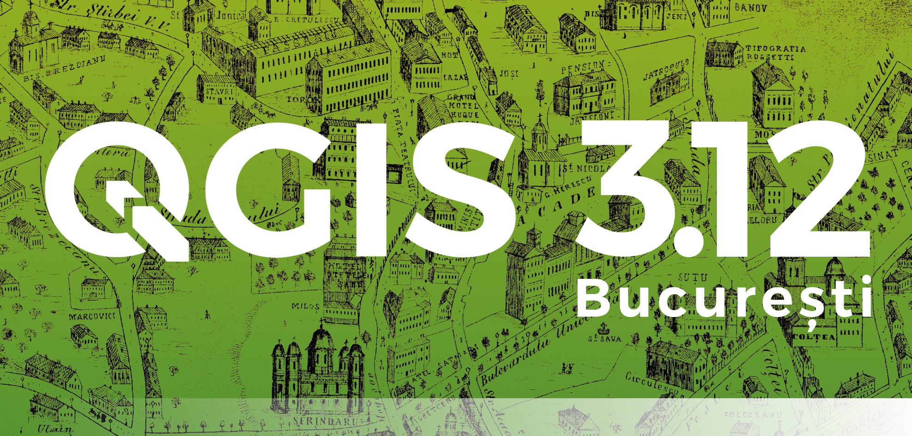
.. |imageQ1| image:: https://user-images.githubusercontent.com/127259/74035907-7f334580-49bb-11ea-8d2d-b99eaa10aa89.png
.. |Peek 2020-01-14 16-06| image:: https://user-images.githubusercontent.com/1829991/72318360-cd6c6600-36e7-11ea-9f2d-9a47d8772623.gif
.. |Peek 2020-01-09 11-08| image:: https://user-images.githubusercontent.com/1829991/72029046-5fcbce80-32d0-11ea-8571-0ae8fa8e3bb0.gif
.. |image5| image:: images/entries/48c75d20d3805af3dad8c7faae3c3786a8f6fed0.gif
   :class: img-responsive img-rounded
.. |imageQ2| image:: https://user-images.githubusercontent.com/127259/72597971-2bc75d80-390f-11ea-84af-7f2c25d5568a.png
.. |copydialog2| image:: https://user-images.githubusercontent.com/28384354/72243171-7e410b00-35eb-11ea-8903-11bd56cd9da6.gif
.. |copypastesingle| image:: https://user-images.githubusercontent.com/28384354/72243125-5ce01f00-35eb-11ea-897e-0bccdcf083d7.png
.. |Peek 2019-12-20 11-27| image:: https://user-images.githubusercontent.com/1829991/71222288-b7070080-231b-11ea-89f4-af856dece4c3.gif
.. |image10| image:: https://user-images.githubusercontent.com/142164/68952420-1bd0b780-07c0-11ea-88d1-2ad0a8b5591e.gif
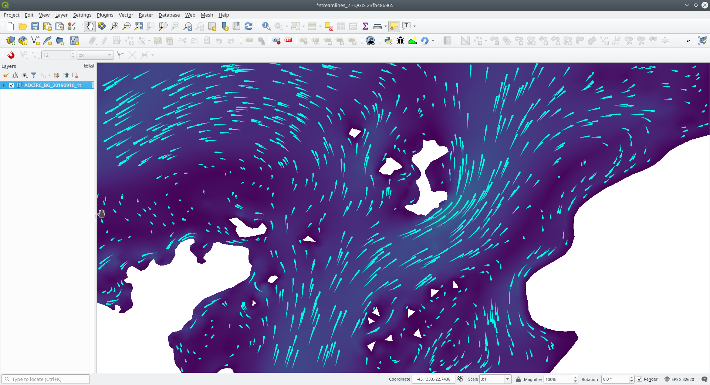
.. |image12| image:: https://user-images.githubusercontent.com/1618556/62111873-d68c8680-b2b1-11e9-8cd4-19077f99a8ff.gif
.. |Peek 2019-12-08 09-18| image:: https://user-images.githubusercontent.com/588407/70386652-acec1600-199b-11ea-8457-f9dd54c84272.gif
.. |Peek 2019-12-08 09-16| image:: https://user-images.githubusercontent.com/588407/70386651-acec1600-199b-11ea-8ce2-27798aec38a7.gif
.. |image15| image:: https://user-images.githubusercontent.com/1728657/67672096-c2881c00-f9a9-11e9-8394-d73505d05309.gif
.. |image16| image:: https://user-images.githubusercontent.com/1829991/66734145-51267480-eea5-11e9-9e0a-3bfeee15f976.png
.. |image17| image:: https://user-images.githubusercontent.com/1728657/64846100-f4c9fe00-d635-11e9-8acb-367ad2dd2915.png
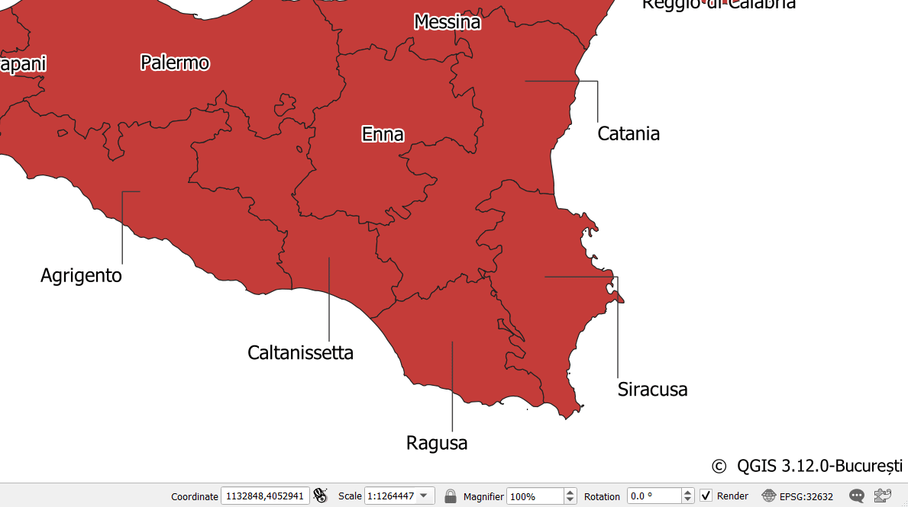
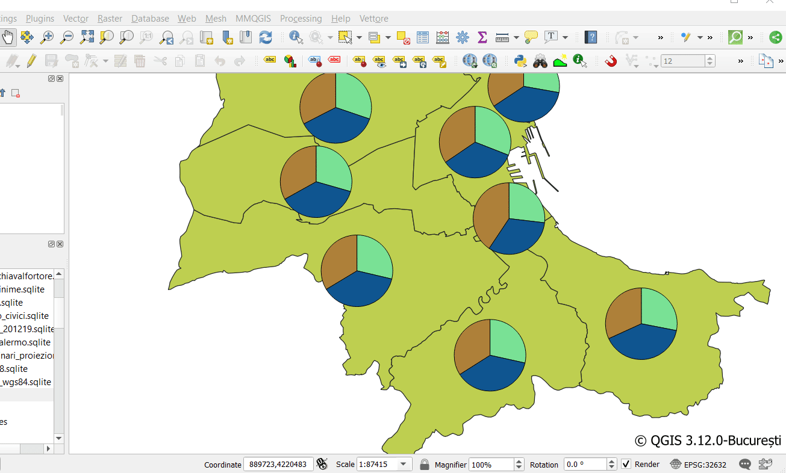
.. |image20| image:: images/entries/933c25cf0cd8997e177eee809b4fa26462b6d8c2.png
   :class: img-responsive img-rounded
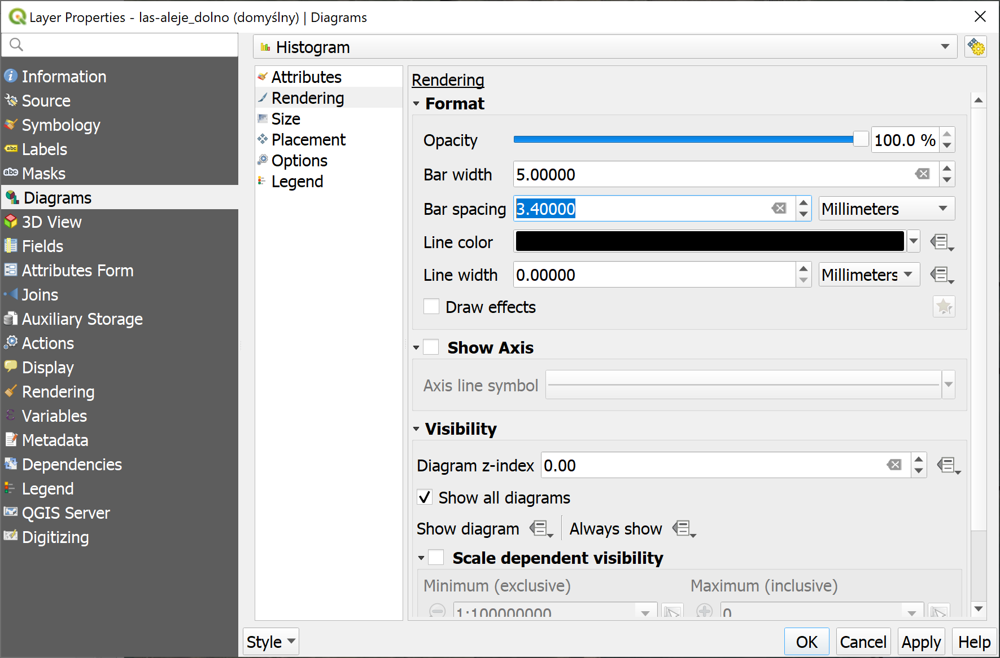
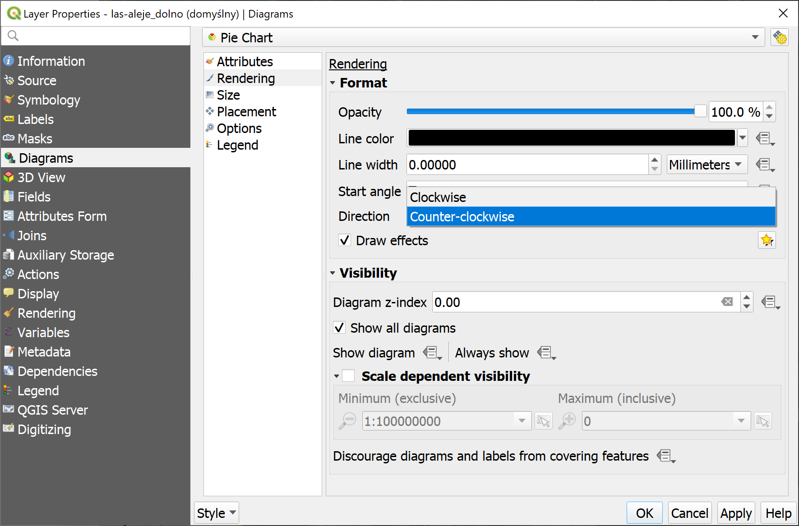
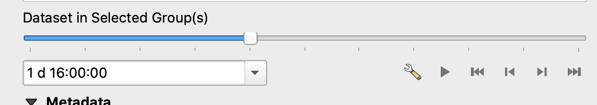
.. |image24| image:: images/entries/c9c38ee8c59693b2971ab6269db22681a61002a1.png
   :class: img-responsive img-rounded
.. |imageQ3| image:: https://user-images.githubusercontent.com/7416892/70955568-bb939680-2047-11ea-9857-8aba122e43dd.png
.. |mesh3dsettings| image:: https://user-images.githubusercontent.com/7416892/72482783-41d10300-37d5-11ea-9a21-8f906abcb14a.gif
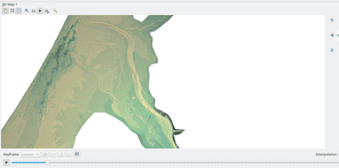
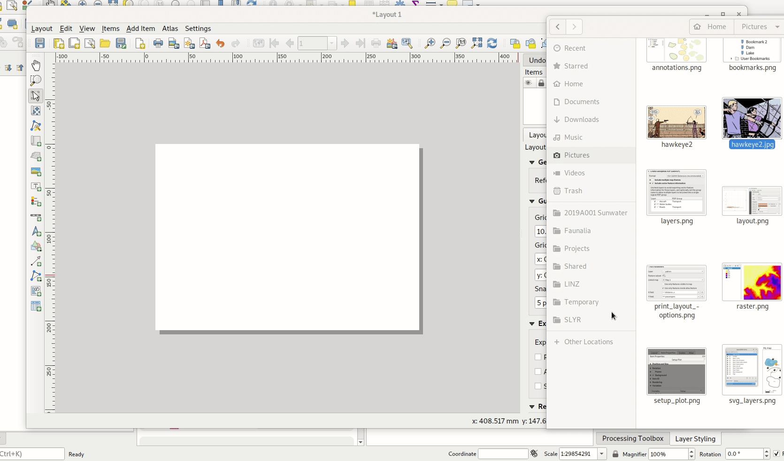
.. |image29| image:: images/entries/95cfa9a8c44fb0141474d80e4b3a5e7f98352e70.png
   :class: img-responsive img-rounded
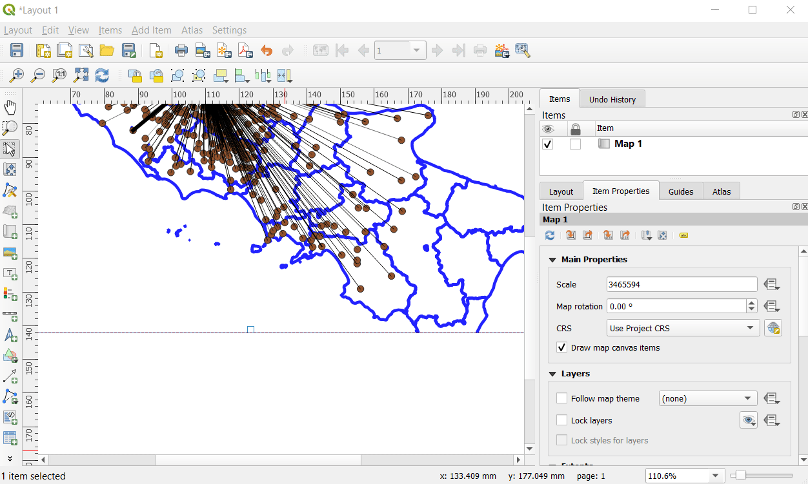
.. |image31| image:: images/entries/baded0d05539439d58e6df5a8f24157293cf8022.gif
   :class: img-responsive img-rounded
.. |image32| image:: images/entries/fb510c6c079d55dab2dd22f02c7c5355b317ac47.png
   :class: img-responsive img-rounded
.. |image33| image:: images/entries/689a669fe84721d7574aba7e595e019a9936f0b9.gif
   :class: img-responsive img-rounded
.. |image34| image:: images/entries/394c762c41e71764d9be397b718252eddb2dbd3e.gif
   :class: img-responsive img-rounded
.. |image35| image:: images/entries/c01edc8ee51dff2b4df8f825e0dcaf27940e4aba.png
   :class: img-responsive img-rounded
.. |expression-storage-opt| image:: https://user-images.githubusercontent.com/142164/70983414-faae0000-20b8-11ea-9f25-14b338d4c680.gif
.. |uniquevalues| image:: https://user-images.githubusercontent.com/28384354/70978774-ab63d180-20b0-11ea-901b-d51d44fa8fa4.gif
.. |image38| image:: images/entries/5bd43dd39955e37ace130038b968550c6fa260c5.gif
   :class: img-responsive img-rounded
.. |image39| image:: images/entries/d77958db7175267448d9b94950532dee8b90145c.png
   :class: img-responsive img-rounded
.. |image40| image:: images/entries/fe03aefab87464e54b70569e6d05ad09a1b8fae5.gif
   :class: img-responsive img-rounded
.. |image41| image:: images/entries/a65364e6a48857a8720643c41a3cb17461d9e16a.gif
   :class: img-responsive img-rounded
.. |image42| image:: images/entries/5f47cb6311a9bffef94128a703719d709deb995a.gif
   :class: img-responsive img-rounded
.. |imageQ4| image:: https://user-images.githubusercontent.com/1298852/72462785-33351c80-37d2-11ea-98f2-ce0d5221e1f5.png
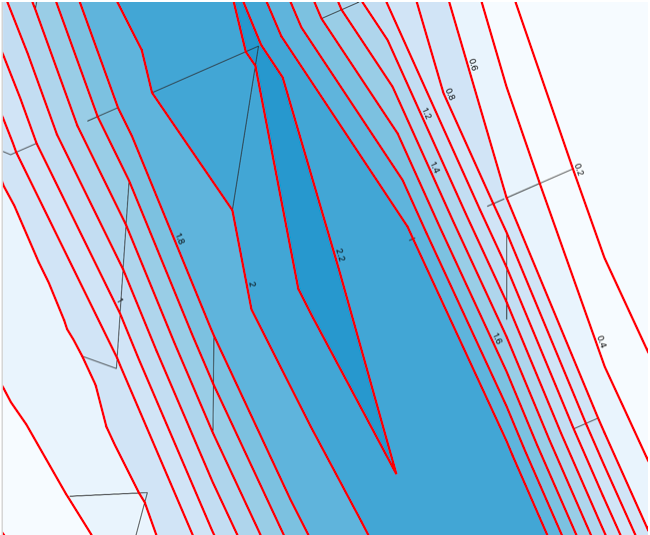
.. |image45| image:: images/entries/044d52fe937887854583ecfdc551e73eafb94a41.png
   :class: img-responsive img-rounded
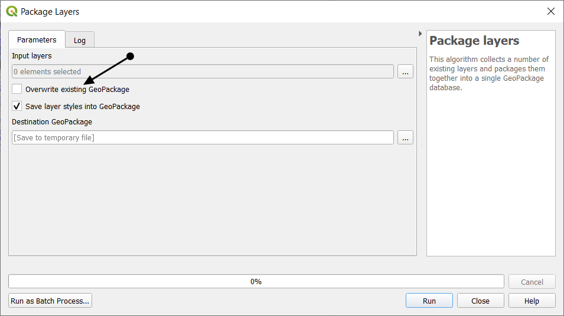
.. |image47| image:: images/entries/bfb37d710293c252dae11b67b25bdc1431f13815.png
   :class: img-responsive img-rounded
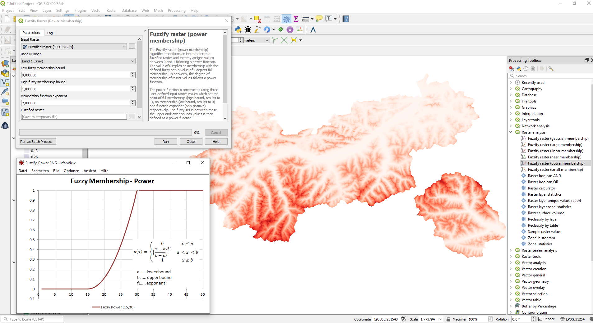
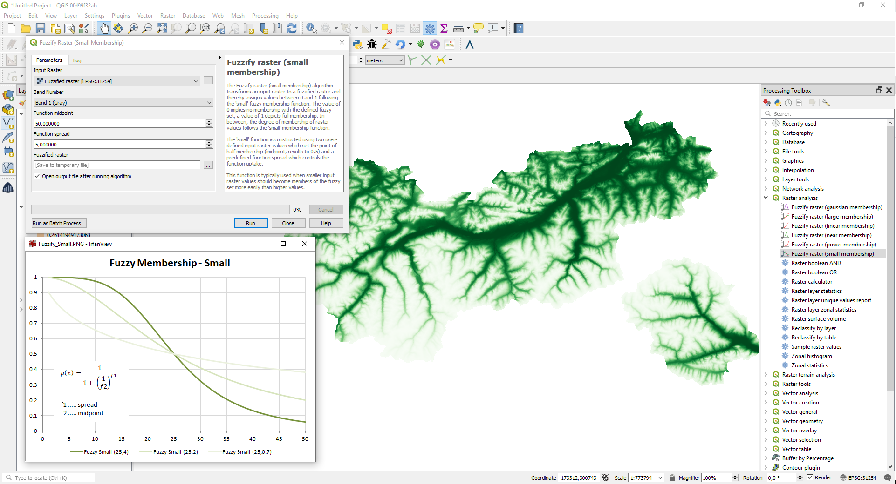
.. |image50| image:: images/entries/10963d11812664a76d4fc3fac72777c34a08c767.png
   :class: img-responsive img-rounded
.. |image51| image:: images/entries/58068dc6518a0df20a39df69ea4175f7b196b049.png
   :class: img-responsive img-rounded
.. |image52| image:: images/entries/a4873da4c5e782a14caaa02f279ef92ba5bf5a38.png
   :class: img-responsive img-rounded
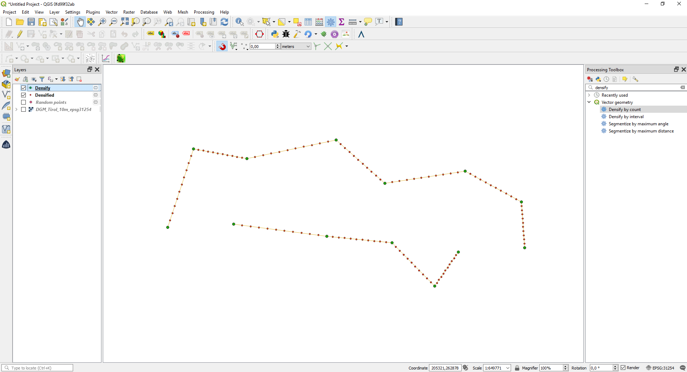
.. |image54| image:: images/entries/c452431d9a2cd9f9f76869cf98e09e18bf2a81a4.png
   :class: img-responsive img-rounded
.. |image55| image:: images/entries/b28bbe3d5129ccc5dd61585dc1a9e31383a59c6f.png
   :class: img-responsive img-rounded
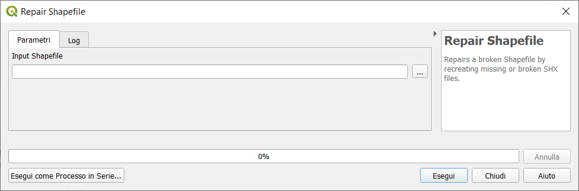
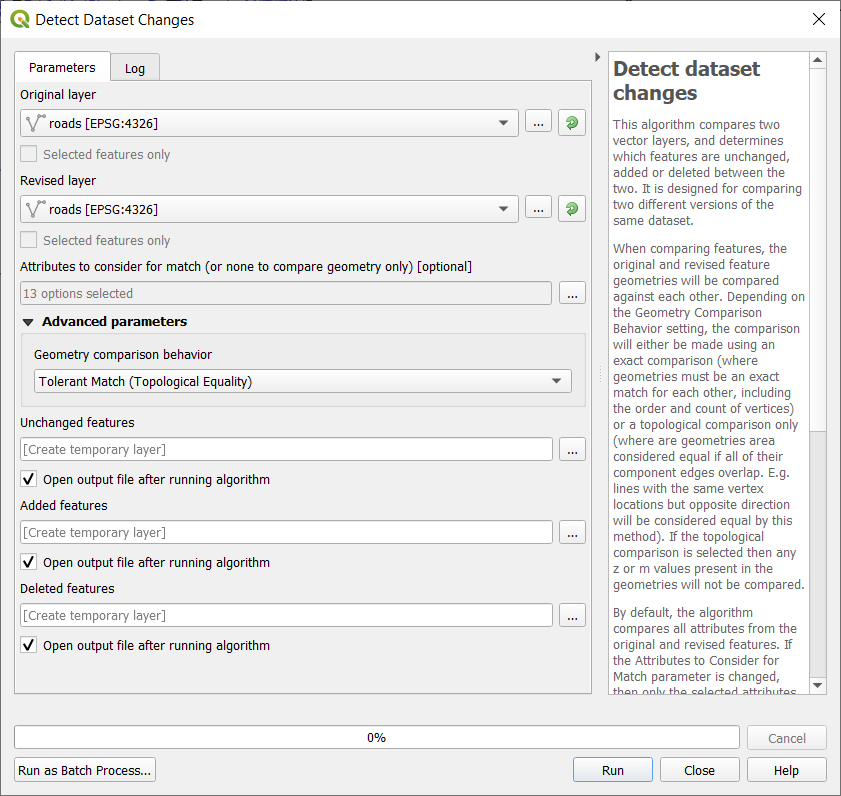
.. |image58| image:: images/entries/27b8e5e11deca93ffade31b86edc712ce918d179.png
   :class: img-responsive img-rounded
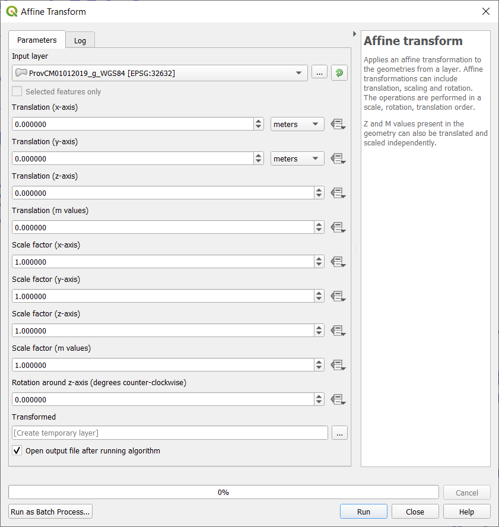
.. |image60| image:: images/entries/5e8e9037420b83cd44d4e1994d4119e4ae92c8aa.png
   :class: img-responsive img-rounded
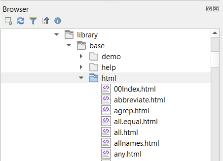
.. |image62| image:: images/entries/447f201d2342a64912bbef1e1d0aa3ebb8963ae4.gif
   :class: img-responsive img-rounded
.. |Screenshot 2020-01-09 at 09 17 05| image:: https://user-images.githubusercontent.com/804608/72050388-466f5600-32c1-11ea-94f5-092cc8471243.png
.. |OGCrefreshonaction| image:: https://user-images.githubusercontent.com/2663775/71974919-cfd04b00-3223-11ea-834d-ff016c70a8c6.gif
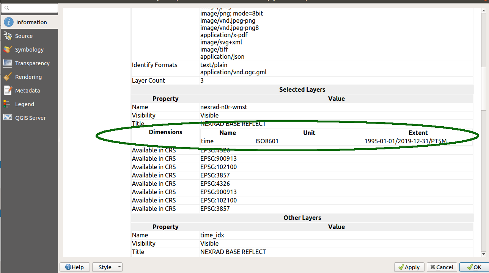
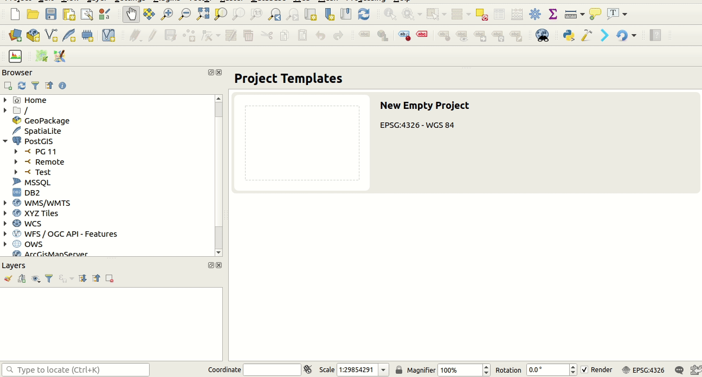
.. |image67| image:: images/entries/dc3d85153d9bcecdf7ebbc6433c7cb40319e00dd.png
   :class: img-responsive img-rounded
.. |wms-ttimelayermetadataqgis| image:: https://user-images.githubusercontent.com/2663775/71542497-37f77500-2978-11ea-854b-d9a9ca2d6c77.png
.. |Screenshot 2019-12-19 at 13 59 47| image:: https://user-images.githubusercontent.com/804608/71175509-068bf480-2268-11ea-9d60-adad896912e2.png
.. |image70| image:: images/entries/d74a13f520336e0c2e44469ee4e527188e2466de.png
   :class: img-responsive img-rounded
.. |qgismapserver| image:: https://user-images.githubusercontent.com/142164/73081781-84c36280-3ec8-11ea-9285-ab4c41e3082c.gif
.. |image72| image:: https://user-images.githubusercontent.com/76594/64876231-fbb13a80-d64e-11e9-83e5-120fb1bc0ea8.png
