.. _changelog318:

Changelog for QGIS 3.18
=======================

|image1|

Following on from the feature-filled releases of `QGIS 3.14 <https://qgis.org/en/site/forusers/visualchangelog314/>`__ and `QGIS 3.16 <https://qgis.org/en/site/forusers/visualchangelog316/>`__, QGIS 3.18 introduces a host of enhancements and new features, along with a long-awaited feature - Native Point Cloud support in QGIS! Thanks to the efforts of `Lutra <https://www.lutraconsulting.co.uk/>`__, `North Road <https://north-road.com/>`__, and `Hobu <https://hobu.co/>`__, QGIS is now able to import and render point cloud data in various formats by leveraging the Open Source PDAL library. This functionality has been introduced due to the success of a `crowd-funding campaign <https://www.lutraconsulting.co.uk/crowdfunding/pointcloud-qgis/>`__ and would not have been possible without the support of the QGIS community and contributors. Thank you to all those involved in realizing this incredible milestone!

As QGIS Desktop 3.18 bids farewell to the DB2 database provider, it introduces support for users of the SAP HANA database system.

The QGIS ecosystem has also seen some exciting changes in the form of the `QGIS HUB <https://plugins.qgis.org/>`__ which is an extension of the plugin site which now supports the distribution of community developed `styles <https://plugins.qgis.org/styles/>`__, `projects <https://plugins.qgis.org/geopackages/>`__, and even `processing models <https://plugins.qgis.org/models/>`__.

:raw-html:`
<iframe style="position:absolute;top:0;left:0;width:100%;height:100%" src="https://www.youtube.com/embed/Yeo6sXVpXvA" frameborder="0" allow="accelerometer; autoplay; clipboard-write; encrypted-media; gyroscope;" allowfullscreen></iframe>
`

We would also like to extend a big thank you to the developers, documenters, testers, and all the many folks out there who volunteer their time and effort (or fund people to do so) to make these releases possible. From the QGIS community, we hope you enjoy this release! If you wish to donate time, money, or otherwise get involved in making QGIS more awesome, please wander along to `QGIS.ORG <qgis.org>`__ and lend a hand!

QGIS is supported by donors and sustaining members. A current list of donors who have made financial contributions large and small to the project can be seen on our `donors list <https://www.qgis.org/en/site/about/sustaining_members.html#list-of-donors>`__. If you would like to become an official project sustaining member, please visit our `sustaining member page <https://www.qgis.org/en/site/getinvolved/governance/sustaining_members/sustaining_members.html#qgis-sustaining-memberships>`__ for details. Sponsoring QGIS helps us to fund our regular developer meetings, maintain project infrastructure, and fund bug fixing efforts. A complete list of current sponsors is provided below - our very great thank you to all of our sponsors!

:raw-html:`
 <!-- to be filled via javascript loading of atom feed --> 
`

QGIS is Free software and you are under no obligation to pay anything to use it - in fact, we want to encourage people far and wide to use it regardless of what your financial or social status is - we believe empowering people with spatial decision-making tools will result in a better society for all of humanity.

.. contents::
   :local:

User Interface
--------------

Feature: Hide derived attributes from the Identify results
~~~~~~~~~~~~~~~~~~~~~~~~~~~~~~~~~~~~~~~~~~~~~~~~~~~~~~~~~~

Previously, the QGIS Desktop *Identify* utility would expose a large number of derived attributes, such as geometry information. Although incredibly valuable, for many use cases this information is verbose. Users will now have the option to toggle the display of derived attributes to create a more concise view of the Identify results.

|image2|

|image3|

This feature was developed by `Richard Duivenvoorde <https://api.github.com/users/rduivenvoorde>`__

Feature: Close all tabs at once from message logs interface
~~~~~~~~~~~~~~~~~~~~~~~~~~~~~~~~~~~~~~~~~~~~~~~~~~~~~~~~~~~

The QgsMessageLogViewer now includes an **"Empty tab and close others"** to the log viewer panel context menu, supporting a quicker action to a clean interface when debugging.

|image4|

This feature was developed by `Olivier Dalang <https://api.github.com/users/olivierdalang>`__

Feature: API for layer source widgets
~~~~~~~~~~~~~~~~~~~~~~~~~~~~~~~~~~~~~

An API has been added in the provider GUI to allow a provider to create a custom widget, which exposes options to customize and change the layer's source. For example, a file-based layer provider could expose a widget for selecting a new file path, or an online provider could expose widgets for changing the host or authentication information.

Two implementations have been added for this:

#. A file picker widget for GDAL file-based layers.

#. A widget for customizing XYZ layer properties.

|image5|

|image6|

This feature was developed by `Nyall Dawson <https://api.github.com/users/nyalldawson>`__

Feature: GUI for dynamic SVGs
~~~~~~~~~~~~~~~~~~~~~~~~~~~~~

QGIS now supports dynamic standard vector graphic elements, as outlined in `QEP #199 <https://github.com/qgis/QGIS-Enhancement-Proposals/issues/199>`__. This allows QGIS to dynamically replace attributes or node values in the XML of the SVG and apply data-driven values to SVG elements. QGIS Desktop has additionally added a GUI editor to ensure that users are able to properly leverage this new functionality.

|image7|

This feature was developed by `Denis Rouzaud <https://api.github.com/users/3nids>`__

Feature: Zoom to multiple layers
~~~~~~~~~~~~~~~~~~~~~~~~~~~~~~~~~~~~~~~~~~~~~~

The "Zoom to Layer" function available from the context menu, the View menu and the Map Navigation toolbar can now zoom to the extent of all the selected layers in the layer tree.

|image8|

This feature was developed by `Patrice Pineault <https://api.github.com/users/TurboGraphxBeige>`__

Feature: Zoom and pan to selection for multiple layers
~~~~~~~~~~~~~~~~~~~~~~~~~~~~~~~~~~~~~~~~~~~~~~~~~~~~~~

The "Zoom to Selection" and "Pan Map to Selection" functions available from the context menu, the View menu or the Map Navigation toolbox now offer the ability to navigate to the extent of the selection from the selected layers in the layer tree.

|image9|

This feature was developed by `Patrice Pineault <https://api.github.com/users/TurboGraphxBeige>`__

Feature: Zoom in/out by scrolling mouse wheel over map overview panel
~~~~~~~~~~~~~~~~~~~~~~~~~~~~~~~~~~~~~~~~~~~~~~~~~~~~~~~~~~~~~~~~~~~~~

Users can now zoom in and out from the Map Overview panel using the mouse scroll.

|image10|

This feature was developed by `Mathieu Pellerin <https://api.github.com/users/nirvn>`__

Accessibility
-------------

Feature: Improved color vision deficiency simulation
~~~~~~~~~~~~~~~~~~~~~~~~~~~~~~~~~~~~~~~~~~~~~~~~~~~~

This modifies the previous support for grayscale and LMS-based simulation for protanopia and deuteranopia, bringing it in line with the methodology currently used in Chromium and Firefox. QGIS now uses updated grayscale luminance calculations (renamed to achromatopsia), a precomputed protanopia matrix (renamed from protanope), a precomputed deuteranopia matrix (renamed from deuteranope), and an additional mode for tritanopia using a similarly precomputed matrix.

This feature was developed by `Will Cohen <https://api.github.com/users/willcohen>`__

Feature: Rotation widget for the Georeferencer
~~~~~~~~~~~~~~~~~~~~~~~~~~~~~~~~~~~~~~~~~~~~~~

The georeferencer canvas can now be rotated in order to facilitate the placement of reference points. This is especially useful for scanned images which may not have uniform orientations.

|image11|

This feature was developed by `uclaros <https://api.github.com/users/uclaros>`__

Symbology
---------

Feature: Data defined overall symbol opacity
~~~~~~~~~~~~~~~~~~~~~~~~~~~~~~~~~~~~~~~~~~~~

While it was previously possible to set the opacity for individual symbol layer colors via data defined expressions, it is now possible to set a data defined expression to control the overall symbol opacity.

This feature was developed by `Nyall Dawson <https://api.github.com/users/nyalldawson>`__

Feature: Open the style gallery from the style manager
~~~~~~~~~~~~~~~~~~~~~~~~~~~~~~~~~~~~~~~~~~~~~~~~~~~~~~

The Style Manager interface now includes a button to open the `styles gallery <https://plugins.qgis.org/styles/>`__ from the QGIS HUB.

|image12|

This feature was developed by `Nyall Dawson <https://api.github.com/users/nyalldawson>`__

Mesh
----

Feature: New mesh export algorithms
~~~~~~~~~~~~~~~~~~~~~~~~~~~~~~~~~~~

New export options have been added for mesh layers. These allow the following options when exporting a mesh to a vector layer:

-  Export faces
-  Export edges (1D mesh)
-  Export as grid

|image13|

This feature was funded by `Lutra Consulting <https://www.lutraconsulting.co.uk>`__

This feature was developed by `Lutra Consulting (Vincent Cloarec) <https://www.lutraconsulting.co.uk/projects/mdal/>`__

Feature: Native export for mesh layers
~~~~~~~~~~~~~~~~~~~~~~~~~~~~~~~~~~~~~~

Previous versions of QGIS required the utilization of the crayfish plugin, however, this functionality has now been incorporated into QGIS core and allows users to export mesh layers to vectors and add the dataset value as an attribute.

|image14|

This feature was funded by `Lutra Consulting <https://www.lutraconsulting.co.uk>`__

This feature was developed by `Lutra Consulting (Vincent Cloarec) <https://www.lutraconsulting.co.uk/projects/mdal/>`__

Feature: Mesh simplification for 3D
~~~~~~~~~~~~~~~~~~~~~~~~~~~~~~~~~~~

Mesh data can now be simplified by defining a level of detail for 3D rendering. This helps performance for complex datasets and ensures a smoother experience when 3D navigation is required.

|image15|

This feature was developed by `Vincent Cloarec <https://api.github.com/users/vcloarec>`__

Feature: Multiple native mesh processing algorithms
~~~~~~~~~~~~~~~~~~~~~~~~~~~~~~~~~~~~~~~~~~~~~~~~~~~

A number of new processing algorithms have been ported from the crayfish plugin, including:

-  Rasterize mesh layer
-  Export contour to vector layers
-  Export cross section to text file (csv)
-  Export time series to text file (csv)

|image16|

This feature was funded by `Lutra Consulting <https://www.lutraconsulting.co.uk>`__

This feature was developed by `Lutra Consulting (Vincent Cloarec) <https://www.lutraconsulting.co.uk/projects/mdal/>`__

Rendering
---------

Feature: "Merged feature" renderer for polygon and line layers
~~~~~~~~~~~~~~~~~~~~~~~~~~~~~~~~~~~~~~~~~~~~~~~~~~~~~~~~~~~~~~

A new rendering option allows area and line features to be "dissolved" into a single object prior to rendering to ensure that complex symbols or overlapping features are represented by a uniform and contiguous cartographic symbol.

|image17|

This feature was developed by `Nyall Dawson <https://api.github.com/users/nyalldawson>`__

Feature: Smarter Map Redraws
~~~~~~~~~~~~~~~~~~~~~~~~~~~~

Previously, map redraws would attempt to redraw all elements in the frame. The map rendering has been significantly improved and now the existing map frame elements are used during the redraw process. This work was completed as a part of `QEP #181 <https://github.com/qgis/QGIS-Enhancement-Proposals/issues/181>`__ and was funded by the QGIS Grant program for 2020.

The following display outlines the redraw behavior before enhancement:

|image18|

This feature was funded by `QGIS grant 2020 <https://qgis.org/>`__

This feature was developed by `Lutra Consulting (Peter Petrik) <https://www.lutraconsulting.co.uk/>`__

3D Features
-----------

Feature: Eye dome lighting
~~~~~~~~~~~~~~~~~~~~~~~~~~

Eyedome lighting (EDL) is a post-processing effect which compares the depth of each pixel (distance from the camera) with the neighboring pixel depths and highlights edges according to the calculated differences.

An EDL configuration element has been added to the advanced settings tab of the 3D view configuration dialog. EDL strength has the effect of increasing the contrast, allowing for better depth perception (which may need to be adjusted when zooming in). EDL distance is the distance of the used pixels from the center pixel and it has the effect of making edges thicker.

The eye dome lighting is, by principle, an image-based rendering solution similar to SSAO (screen space ambient occlusion), and therefore works on the whole scene and doesn't differ between point clouds or regular 3D objects.

|image19|

This feature was funded by `Lutra Consulting <https://www.lutraconsulting.co.uk>`__

This feature was developed by `Lutra Consulting (Nedjima Belgacem) <https://www.lutraconsulting.co.uk>`__

Feature: Data defined 3D material colors
~~~~~~~~~~~~~~~~~~~~~~~~~~~~~~~~~~~~~~~~

3D material colors may now be data defined, allowing feature colors to be determined using the value of an attribute or expression.

Rendering of polygons may be currently done with multiple material types, each having distinct appearance and configuration of colors:

-  Realistic (Phong) material - calculated using 3 colors (diffuse, ambient, specular), which utilizes the 3D view lighting configuration
-  CAD (Gooch) material - calculated using 4 colors (diffuse, warm, cool, specular), which ignores the 3D view lighting configuration

Textured materials are unsupported at this time.

|image20|

|image21|

This feature was funded by `Kristianstad <https://www.kristianstad.se>`__

This feature was developed by `Lutra Consulting (Vincent Cloarec) <https://www.lutraconsulting.co.uk>`__

Feature: 3D Orthographic projection support
~~~~~~~~~~~~~~~~~~~~~~~~~~~~~~~~~~~~~~~~~~~

QGIS now offers orthographic projection support for 3D scenes, a feature often desired in the context of architecture, archeology, and more.

|image22|

This feature was developed by `Mathieu Pellerin <https://api.github.com/users/nirvn>`__

Point Clouds
------------

Feature: Point Cloud Support
~~~~~~~~~~~~~~~~~~~~~~~~~~~~

Following the successful `crowdfunding campaign <https://www.lutraconsulting.co.uk/crowdfunding/pointcloud-qgis/>`__ for point cloud support in QGIS, the engineers at Lutra, North Road, and Hobu have been able to introduce the ability for QGIS to import and render point cloud data.

This includes the ability to add point cloud layers to QGIS projects, with support for the EPT format, and render them in 2D and 3D contexts.

|image23|

This feature was funded by `Point Cloud data support in QGIS <https://www.lutraconsulting.co.uk/blog/2021/02/18/qgis-3-18-point-cloud/>`__

This feature was developed by `Lutra Consulting (Peter Petrik) <https://www.lutraconsulting.co.uk>`__

Feature: Add point clouds to browser
~~~~~~~~~~~~~~~~~~~~~~~~~~~~~~~~~~~~

The QGIS Browser and data source management interface now support the basic structure of PDAL supported point cloud layers.

|image24|

This feature was funded by `Point Cloud data support in QGIS crowd funding campaign <https://www.lutraconsulting.co.uk/blog/2021/02/18/qgis-3-18-point-cloud/>`__

This feature was developed by `Lutra Consulting (Peter Petrik) <https://www.lutraconsulting.co.uk/>`__

Feature: Untwine PDAL Provider Integration
~~~~~~~~~~~~~~~~~~~~~~~~~~~~~~~~~~~~~~~~~~

Ability to generate EPT index for (smaller) laz files directly in QGIS via the `untwine <https://github.com/hobu/untwine>`__ library

This feature was funded by `Point Cloud data support in QGIS crowd funding campaign <https://www.lutraconsulting.co.uk>`__

This feature was developed by `Lutra Consulting (Peter Petrik) <https://www.lutraconsulting.co.uk>`__

Print Layouts
-------------

Feature: Gradient ramp based legends
~~~~~~~~~~~~~~~~~~~~~~~~~~~~~~~~~~~~

A new QgsColorRampLegendNode class was added which allows for the creation of color ramp-based legend nodes. It's now used for raster layers when using a pseudocolor renderer with the linear interpolation type or for the single-band gray renderer, as well as for point clouds using a ramp based renderer.

In a layout legend, the ramp item inherits the default legend symbol width and height, but it is possible to optionally override this behavior.

There are labels included for the minimum and maximum ramp value, which are rendered using the same font settings as other legend item text:

|image25|

Label alignment will follow the legend settings:

|image26|

And naturally, the items will work nicely with multi-column legends:

|image27|

|image28|

This feature was funded by `Hans van der Kwast <https://www.youtube.com/c/HansvanderKwast>`__

This feature was developed by `Nyall Dawson <https://api.github.com/users/nyalldawson>`__

Feature: Color ramp legend improvements
~~~~~~~~~~~~~~~~~~~~~~~~~~~~~~~~~~~~~~~

Color ramp legend items now support the following configurable options:

-  A prefix and suffix for the ramp text
-  Numerical formatting
-  Ramp direction
-  Customization of text formatting
-  The ability to create horizontal bars.

Users can also choose to refine these settings for a particular layout legend item. This functionality is available for all ramp items, including raster, point cloud, or mesh layers.

|image29|

|image30|

This feature was funded by `Hans van der Kwast <https://www.youtube.com/c/HansvanderKwast>`__

This feature was developed by `Nyall Dawson <https://api.github.com/users/nyalldawson>`__

Feature: Dynamic text presets
~~~~~~~~~~~~~~~~~~~~~~~~~~~~~

The new *Add Item -> Dynamic Text* menu contains preset dynamic text expressions that users can use to insert a label automatically containing the corresponding expression.

For example, using the dynamic text element **Layout Name** will insert a label containing the expression [% @layout\_name %]. This improves the feature awareness, discoverability, and provides an easy method for users to access dynamic attributes.

|image31|

This feature was developed by `Nyall Dawson <https://api.github.com/users/nyalldawson>`__

Expressions
-----------

Feature: Optional formatting of UUID results
~~~~~~~~~~~~~~~~~~~~~~~~~~~~~~~~~~~~~~~~~~~~

There is now a string format parameter available for the ``uuid()`` function in QGIS expressions. Users now have various options that they can use to stipulate the format of the returned UUID value, including the following options:

-  ``uuid()``: **{0bd2f60f-f157-4a6d-96af-d4ba4cb366a1}**
-  ``uuid('WithoutBraces')``: **0bd2f60f-f157-4a6d-96af-d4ba4cb366a1**
-  ``uuid('Id128')``: **0bd2f60ff1574a6d96afd4ba4cb366a1**

|image32|

This feature was developed by `signedav <https://api.github.com/users/signedav>`__

Feature: Layer CRS variable for expressions
~~~~~~~~~~~~~~~~~~~~~~~~~~~~~~~~~~~~~~~~~~~

QGIS expressions now support a *layer\_crs* variable which will return the AuthID for a particular layer's coordinate reference system. This allows expressions to identify the layer CRS dynamically and perform transformations without needing to manually specify the CRS.

This feature was developed by `Alex <https://api.github.com/users/roya0045>`__

Feature: Support for min, max, majority, sum, mean, and median functions on numerical arrays
~~~~~~~~~~~~~~~~~~~~~~~~~~~~~~~~~~~~~~~~~~~~~~~~~~~~~~~~~~~~~~~~~~~~~~~~~~~~~~~~~~~~~~~~~~~~

QGIS expressions now include aggregate functions for arrays, which allow the easy retrieval of specific values from an array that may be used in QGIS elements such as symbologies. The following functions have been introduced:

-  array\_min
-  array\_max
-  array\_majority
-  array\_sum
-  array\_mean
-  array\_median

This feature was developed by `uclaros <https://api.github.com/users/uclaros>`__

Feature: Negative index for array\_get function
~~~~~~~~~~~~~~~~~~~~~~~~~~~~~~~~~~~~~~~~~~~~~~~

The function array\_get now supports the use of negative index positions.

This feature was developed by `Alex <https://api.github.com/users/roya0045>`__

Feature: Add map\_credits function
~~~~~~~~~~~~~~~~~~~~~~~~~~~~~~~~~~

A *map\_credits* function was added that collates a list of all the layer metadata attribution strings for the layers shown inside a specified map item.

For example:

::

    array_to_string( map_credits( 'Main Map' ) )

Returns a comma-separated list of layer credits for layers shown in the 'Main Map' layout item, e.g 'CC-BY-NC, CC-BY-SA'

There's an optional *include\_layer\_names* argument you can use to include layer names before their attribution:

::

    array_to_string( map_credits( 'Main Map',
       include_layer_names := true,
       layer_name_separator := ': ' ) )

This would return a comma-separated list of layer names and their credits for layers shown in the 'Main Map' layout item, e.g. 'Railway lines: CC-BY-NC, Basemap: CC-BY-SA'

This feature was funded by `SLYR <https://north-road.com/slyr/>`__

This feature was developed by `Nyall Dawson <https://api.github.com/users/nyalldawson>`__

Digitising
----------

Feature: Select features context menu
~~~~~~~~~~~~~~~~~~~~~~~~~~~~~~~~~~~~~

It is now possible to select features using a context menu on the map canvas. Right-clicking on the map will intelligently identify the features below the mouse cursor and allow the available features to be added or removed from the current selection. Where multiple features are available, a short delay may persist whilst the system attempts to search for available features that will become available in a nested menu item for selection, or users may simply use the *select all* function to select all available features at the given position.

|image33|

This feature was funded by `Kristianstad <https://www.kristianstad.se>`__

This feature was developed by `Lutra Consulting (Vincent Cloarec) <https://www.lutraconsulting.co.uk>`__

Feature: Curve tracing settings added to UI
~~~~~~~~~~~~~~~~~~~~~~~~~~~~~~~~~~~~~~~~~~~

Existing curve tracing settings `were introduced previously <https://github.com/qgis/QGIS/pull/37826>`__ and have now been exposed in the user interface to enable users to incrementally modify settings to optimize their results when capturing curve data.

|image34|

This feature was developed by `Olivier Dalang <https://api.github.com/users/olivierdalang>`__

Feature: Feature scaling tool
~~~~~~~~~~~~~~~~~~~~~~~~~~~~~

A new digitizing tool allows for selected features to be scaled when in editing mode. This implementation was based on the work of `@roya0045 <https://github.com/roya0045>`__ with `#40650 <https://github.com/qgis/QGIS/pull/40650>`__.

|image35|

This feature was developed by `Nyall Dawson <https://api.github.com/users/nyalldawson>`__

Data Management
---------------

Feature: New export to spreadsheet algorithm
~~~~~~~~~~~~~~~~~~~~~~~~~~~~~~~~~~~~~~~~~~~~

Users may export a selection of vector layers as sheets in a new spreadsheet or append them as additional sheets to an existing spreadsheet

This feature was developed by `Nyall Dawson <https://api.github.com/users/nyalldawson>`__

Feature: Reproject coordinates in the Georeferencer
~~~~~~~~~~~~~~~~~~~~~~~~~~~~~~~~~~~~~~~~~~~~~~~~~~~

The georeferencer now reprojects data points in a desired output projection, rather than using the map canvas CRS for determining data point positions. This allows users more flexibility and control when capturing control points.

|image36|

This feature was developed by `Alex <https://api.github.com/users/roya0045>`__

Feature: Polymorphic relations/ Document management system
~~~~~~~~~~~~~~~~~~~~~~~~~~~~~~~~~~~~~~~~~~~~~~~~~~~~~~~~~~

A new GUI is available to manage polymorphic relations, implemented as a part of the dynamic relations described in `QEP #79 <https://github.com/qgis/QGIS-Enhancement-Proposals/issues/79>`__.

The "Add relation" button in the relation manager screen now has additional options for adding and editing polymorphic relations:

The "Add polymorphic relation" and "Edit polymorphic relation" open the same dialog, although in the latter case it will automatically be populated with existing values.

Once saved, the list of relations appear as a tree widget, where the generated relation objects for a polymorphic relation appear as children. The names of the generated relations cannot be changed.

Polymorphic relations are stored within a project and currently cannot be exported.

|image37|

This feature was developed by `Ivan Ivanov <https://api.github.com/users/suricactus>`__

Forms and Widgets
-----------------

Feature: Soft and hard constraints in forms
~~~~~~~~~~~~~~~~~~~~~~~~~~~~~~~~~~~~~~~~~~~

Historically, required fields would prevent a form from being saved entirely. Using soft constraints allow forms to notify users that expected information has been omitted, without preventing the form submission. Hard constraints, by contrast, function identically to the previous "required fields" functionality and will prevent form submissions unless data is correctly captured for the field.

This feature was funded by `Lutra Consulting <https://www.lutraconsulting.co.uk>`__

This feature was developed by `Lutra Consulting (Viktor Sklencar) <https://www.lutraconsulting.co.uk>`__

Analysis Tools
--------------

Feature: Nominatim geocoder API
~~~~~~~~~~~~~~~~~~~~~~~~~~~~~~~

Although not exposed through the locator or as an algorithm, QGIS now includes a Nominatim API geocoder class. The geocoder class' implementation insures that it respects the OpenStreetMap Foundation Terms of Use by caching results and throttling requests by default.

This feature was developed by `Mathieu Pellerin <https://api.github.com/users/nirvn>`__

Processing
----------

Feature: Allow expression for order fields in PointsToPath algorithm
~~~~~~~~~~~~~~~~~~~~~~~~~~~~~~~~~~~~~~~~~~~~~~~~~~~~~~~~~~~~~~~~~~~~

``$id`` may be used as an expression for a csv with ordered values, and the ``ORDER_EXPRESSION`` parameter has been added to the PointsToPath algorithm.

This feature was developed by `Matthias Kuhn <https://api.github.com/users/m-kuhn>`__

Feature: Override CRS for Clip Raster by extent output
~~~~~~~~~~~~~~~~~~~~~~~~~~~~~~~~~~~~~~~~~~~~~~~~~~~~~~

In some instances, the **Clip raster by extent** algorithm may output features without a CRS specified, which can now be modified by explicitly enforcing the output to inherit it's CRS from the input layer.

This feature was developed by `rldhont <https://api.github.com/users/rldhont>`__

Feature: Add "retain fields" algorithm
~~~~~~~~~~~~~~~~~~~~~~~~~~~~~~~~~~~~~~

Allows users to select a list of fields to keep, and all other fields will be dropped from the layer. Helps with making flexible models where input datasets may have a range of different fields and only a certain subset of them need to be retained. This work was inspired by `#39114 <https://github.com/qgis/QGIS/pull/39114>`__

|image38|

This feature was developed by `Nyall Dawson <https://api.github.com/users/nyalldawson>`__

Feature: Reference common field parameter for multiple layers
~~~~~~~~~~~~~~~~~~~~~~~~~~~~~~~~~~~~~~~~~~~~~~~~~~~~~~~~~~~~~

Processing tools field parameters may support processing a common field for multiple vector layers, in an implementation inspired by the behavior of some processing algorithms in Orfeo ToolBox.

This feature was developed by `Julien Cabieces <https://api.github.com/users/troopa81>`__

Feature: Extend import geotagged photos to include exif\_orientation
~~~~~~~~~~~~~~~~~~~~~~~~~~~~~~~~~~~~~~~~~~~~~~~~~~~~~~~~~~~~~~~~~~~~

The "Import geotagged photos" tool has been updated so that the exif\_orientation parameter value is extracted to the output table. This ensures that maptips and other HTML widgets can be configured to correctly transform the photos to be correctly displayed based on the orientation value.

This feature was developed by `Pelle Rosenbeck Gøeg <https://api.github.com/users/pellegoeg>`__

Feature: Export layer information algorithm
~~~~~~~~~~~~~~~~~~~~~~~~~~~~~~~~~~~~~~~~~~~

A new algorithm in the processing toolbox called export layers information has been added to support the creation of a polygon layer corresponding to extent of user-defined layer(s) with additional layer details which are attached as attributes to each polygon feature. The information collected currently supports the following elements:

-  CRS
-  Provider name
-  File path
-  Layer name
-  Subset filter
-  Abstract
-  Attribution

This feature was developed by `Mathieu Pellerin <https://api.github.com/users/nirvn>`__

Feature: Cell stack percentile and percentrank algorithms
~~~~~~~~~~~~~~~~~~~~~~~~~~~~~~~~~~~~~~~~~~~~~~~~~~~~~~~~~

The characteristics of the **Cell Statistics** processing tool have been replicated and modified to allow for three new processing algorithms, which allow QGIS to calculate cell statistics in a similar manner to common percentage functions used in spreadsheet programs. The new processing algorithms are:

-  **Cell stack percentile**
-  **Cell stack percentrank from value**
-  **Cell stack percentrank from raster layer**

While the percentile algorithm only offers the possibility of calculating percentiles based on an input fraction value (ranging between 0 and 1), a percentrank raster can also be calculated based on an input value raster. This gives the user the opportunity to calculate per-cell percentranks based on dataset driven value input (eg. sample layers).

All algorithms provide different methods for calculating percentiles and percentranks:

**Percentile:** - Nearest Rank - Inclusive linear interpolation (see LibreOffice's and Microsoft Excel's *PERCENTILE.INC* function) - Exclusive linear interpolation (see LibreOffice's and Microsoft Excel's *PERCENTILE.EXC* function)

**Percentrank:** - Inclusive linear interpolation (see LibreOffice's and Microsoft Excel's *PERCENTRANK.INC* function) - Exclusive linear interpolation (see LibreOffice's and Microsoft Excel's *PERCENTRANK.EXC* function)

|image39|

This feature was developed by `Clemens Raffler <https://api.github.com/users/root676>`__

Feature: Points to lines processing algorithm
~~~~~~~~~~~~~~~~~~~~~~~~~~~~~~~~~~~~~~~~~~~~~

A native processing algorithm has been added in c++ that creates line layers from point layers, similar to the existing python *Points to path* but with extended functionality:

-  Added support for *natural sorting* ( '10' > '9' )
-  Avoid creating invalid lines with a single vertex
-  Avoid creating closed lines with two vertices

This feature was developed by `uclaros <https://api.github.com/users/uclaros>`__

Application and Project Options
-------------------------------

Feature: Hidden layers
~~~~~~~~~~~~~~~~~~~~~~

QGIS Projects now support the inclusion of hidden layers, which are capable of being included in a project but are not visible in the table of contents.

The layer property is configurable from the **Data Sources** tab of the project properties and includes API support for text filtering.

|image40|

This feature was funded by **ARPA Piemonte**

This feature was developed by `Alessandro Pasotti <https://api.github.com/users/elpaso>`__

Feature: Custom "Full Extent" definition
~~~~~~~~~~~~~~~~~~~~~~~~~~~~~~~~~~~~~~~~

A new "View Settings" tab has been added to the project properties, with the option to manually defined the full extent of a project. The extent defined here will be the extent used when zooming to the full map extent, instead of the calculated or maximum extent of all layers. This is useful for defining a particular area of interest for a project and does not limit user's ability to "zoom out" further than the defined extent.

|image41|

This feature was developed by `Nyall Dawson <https://api.github.com/users/nyalldawson>`__

Feature: Toggle network caching to QgsNetworkAccessManager
~~~~~~~~~~~~~~~~~~~~~~~~~~~~~~~~~~~~~~~~~~~~~~~~~~~~~~~~~~

A checkbox in the network logger panel now allows users to temporarily disable the network cache, which is useful when debugging QGIS network activity, or when using QGIS to test server-side changes.

This is a transient setting by design and is forgotten as soon as QGIS is closed.

|image42|

This feature was developed by `Nyall Dawson <https://api.github.com/users/nyalldawson>`__

Browser
-------

Feature: Unify ArcGis Feature Service and ArcGIS Map Service connections in browser
~~~~~~~~~~~~~~~~~~~~~~~~~~~~~~~~~~~~~~~~~~~~~~~~~~~~~~~~~~~~~~~~~~~~~~~~~~~~~~~~~~~

The separate "ArcGis Feature Service" and "ArcGIS Map Service" browser connections have been replaced with a single, unified, **"ArcGIS Rest Servers"** connection and browser node, which shows a definitive view of the server and exposes both service types.

This feature was developed by `Nyall Dawson <https://api.github.com/users/nyalldawson>`__

Feature: Allow browsing ArcGIS REST by content groups
~~~~~~~~~~~~~~~~~~~~~~~~~~~~~~~~~~~~~~~~~~~~~~~~~~~~~

ArcGIS Feature Service connections which have their corresponding Portal endpoint URLS set can be explored by content groups in the browser panel.

If a connection has the Portal endpoints set, then expanding out the connection in the browser will show a "Groups" and "Services" folder, instead of the full list of services usually shown. Expanding out the groups folder will show a list of all content groups that the user is a member of, each of which can be expanded to show the service items belonging to that group.

This feature was funded by `SRK Consulting <https://www.srk.com>`__

This feature was developed by `Nyall Dawson <https://api.github.com/users/nyalldawson>`__

Data Providers
--------------

Feature: Native DXF export algorithm
~~~~~~~~~~~~~~~~~~~~~~~~~~~~~~~~~~~~

Allows exporting individual or multiple layers into a single DXF file. For each input layer, users can select which attribute to use for splitting a single layer into multiple output layers.

Implements a native DXF export algorithm using ``QgsDxfExport`` functionality, which is also used by ``Project -> Import/Export -> Export Project to DXF``.

|image43|

This feature was developed by `Alexander Bruy <https://api.github.com/users/alexbruy>`__

Feature: Additional geometry types for PostGIS Export
~~~~~~~~~~~~~~~~~~~~~~~~~~~~~~~~~~~~~~~~~~~~~~~~~~~~~

Some available geometry types from the GDAL ogr2ogr operation used for exporting data to PostGIS databases have been added to the tool interface. This functionality also includes the option to specify vector dimensions for exported data and resolves issue `39003 <https://github.com/qgis/QGIS/issues/39003>`__.

|image44|

This feature was developed by `mazano <https://api.github.com/users/NyakudyaA>`__

Feature: Improved network requests with GDAL
~~~~~~~~~~~~~~~~~~~~~~~~~~~~~~~~~~~~~~~~~~~~

A QgsCPLHTTPFetchOverrider utility class was added and used in the OGR provider which redirects GDAL's CPL HTTP calls through QgsBlockingNetworkRequest. This ensures that GDAL can use the QGIS network provider rather than redirecting requests through cURL. Additional head(), put() and deleteResource() methods were added to QgsBlockingNetworkRequest.

This feature was developed by `Even Rouault <https://api.github.com/users/rouault>`__

Feature: Read only generated fields
~~~~~~~~~~~~~~~~~~~~~~~~~~~~~~~~~~~

An API method has been added to ensure that readonly generated columns are not exposed in editors.

This feature was developed by `Julien Cabieces <https://api.github.com/users/troopa81>`__

Feature: Improve MSSQL loading with predefined parameters
~~~~~~~~~~~~~~~~~~~~~~~~~~~~~~~~~~~~~~~~~~~~~~~~~~~~~~~~~

To reduce layer loading times, the map layer extent can be precomputed, and primary keys can be specified, removing the need for QGIS to calculate these characteristics and improving performance.

This is done by extending dbo.geometry\_columns tables and adding the following extra columns, which may be populated accordingly by database administrators:

-  Extent : qgis\_xmin, qgis\_xmax, qgis\_ymin, qgis\_ymax
-  Primary key : qgis\_pkey

In the database connection configuration widget, there are now two extra checkboxes which make use of these parameters:

-  Use layer extent from the extra columns
-  Use the primary key from the extra column

|image45|

This feature was funded by `ms.GIS <http://msgis.com/>`__

This feature was developed by `Lutra Consulting (Vincent Cloarec) <https://www.lutraconsulting.co.uk/>`__

Feature: Filter schemas for MS SQL
~~~~~~~~~~~~~~~~~~~~~~~~~~~~~~~~~~

Users may now filter the available schemas for MS SQL connections. The database connection widget now contains options for filtering available schemas, so that only the expected schemas are available from the QGIS browser.

|image46|

This feature was funded by `ms.GIS <http://msgis.com/>`__

This feature was developed by `Lutra Consulting (Vincent Cloarec) <https://www.lutraconsulting.co.uk/>`__

Feature: SAP HANA database support
~~~~~~~~~~~~~~~~~~~~~~~~~~~~~~~~~~

QGIS now supports SAP HANA databases. SAP HANA is an in-memory database with an OGC-compliant spatial engine with a free express edition available from www.sap.com

This feature was developed by `Maxim Rylov <https://api.github.com/users/mrylov>`__

Feature: Deprecate support for DB2
~~~~~~~~~~~~~~~~~~~~~~~~~~~~~~~~~~

**The DB2 data provider has been marked as deprecated**, and is hidden from the QGIS UI by default.

QGIS has adopted a gentle approach to removing unmaintained core providers, and users of deprecated providers may enable support for them by setting the hidden "providers/showDeprecated" settings key to *true*.

This feature was developed by `Nyall Dawson <https://api.github.com/users/nyalldawson>`__

Feature: Oracle connection API
~~~~~~~~~~~~~~~~~~~~~~~~~~~~~~

The QGIS API now includes *QgsAbstractDatabaseProviderConnection* for the Oracle provider.

This feature was funded by Metropole de Lille

This feature was developed by `Julien Cabieces <https://api.github.com/users/troopa81>`__

Feature: Add advanced options for raster data imports
~~~~~~~~~~~~~~~~~~~~~~~~~~~~~~~~~~~~~~~~~~~~~~~~~~~~~

New functionality has been introduced which allows advanced parameters to be specified when importing layers using the GDAL data provider, opening a vast range of new possibilities, especially when working around expected dataset issues and shortcomings.

|image47|

This feature was developed by Mathieu Pellerin

QGIS Server
-----------

Feature: GetLegendGraphics Symbol Scale
~~~~~~~~~~~~~~~~~~~~~~~~~~~~~~~~~~~~~~~

The QGIS Server WMS GetLegendGraphics request now supports the inclusion of min/max scale denominators to json symbol exports

This feature was developed by `Alessandro Pasotti <https://api.github.com/users/elpaso>`__

Feature: Drag and drop for WMS GetFeatureInfo response
~~~~~~~~~~~~~~~~~~~~~~~~~~~~~~~~~~~~~~~~~~~~~~~~~~~~~~

With the drag and drop editor form, it is possible to reorder the attributes and add groups or subgroups from within the edit form. This functionality has been extended so that the WMS GetFeatureInfo response may be modified to include groups and subgroups, as well as allow the response content to be modified and reordered using the editor form, with support for drag and drop functionality.

This feature was developed by `mhugent <https://api.github.com/users/mhugent>`__

Programmability
---------------

Feature: Run multiple items from command history dialog
~~~~~~~~~~~~~~~~~~~~~~~~~~~~~~~~~~~~~~~~~~~~~~~~~~~~~~~

The QGIS Python Console now supports the execution of multiple selected commands from the history dialog by adding a new **Paste** button.

|image48|

This feature was developed by `Salvatore Larosa <https://api.github.com/users/slarosa>`__

Feature: Enable or disable plugins from the command line
~~~~~~~~~~~~~~~~~~~~~~~~~~~~~~~~~~~~~~~~~~~~~~~~~~~~~~~~

The qgis\_process command line tool has had new commands added which allow users to enable or disable plugins using the commands as outlined below:

-  ``qgis_process plugins enable plugin_name``: enables the named plugin
-  ``qgis_process plugins disable plugin_name``: disables the named plugin

This improves the automation capabilities of QGIS and allows the use of plugins on headless environments with the qgis\_process tool.

This feature was developed by `Nyall Dawson <https://api.github.com/users/nyalldawson>`__

Notable Fixes
-------------

Feature: Bug fixes by Alessandro Pasotti
~~~~~~~~~~~~~~~~~~~~~~~~~~~~~~~~~~~~~~~~

+------------------------------------------------------------------------------------------------------------------------------+----------------------------------------------------------+----------------------------------------------------------------------------------------------------------------------------------------------------------------------------------------------+-----------------------------------------------------------+
| Bug Title                                                                                                                    | URL issues.qgis.org (if reported)                        | URL Commit (Github)                                                                                                                                                                          | 3.16 backport commit (GitHub)                             |
+==============================================================================================================================+==========================================================+==============================================================================================================================================================================================+===========================================================+
| Crash with VRT layers using Python pixel functions                                                                           | `#41048 <https://github.com/qgis/QGIS/issues/41048>`__   | Works for me                                                                                                                                                                                 |                                                           |
+------------------------------------------------------------------------------------------------------------------------------+----------------------------------------------------------+----------------------------------------------------------------------------------------------------------------------------------------------------------------------------------------------+-----------------------------------------------------------+
| Cannot enter attributes and save edits on PostGIS table when user has only the INSERT privilige                              | `#40922 <https://github.com/qgis/QGIS/issues/40922>`__   | `PR #41059 <https://github.com/qgis/QGIS/pull/41059>`__                                                                                                                                      | no                                                        |
+------------------------------------------------------------------------------------------------------------------------------+----------------------------------------------------------+----------------------------------------------------------------------------------------------------------------------------------------------------------------------------------------------+-----------------------------------------------------------+
| GeoPackage layer name truncated when filename contains more that one dot                                                     | `#40864 <https://github.com/qgis/QGIS/issues/40864>`__   | `PR #41061 <https://github.com/qgis/QGIS/pull/41061>`__                                                                                                                                      | no                                                        |
+------------------------------------------------------------------------------------------------------------------------------+----------------------------------------------------------+----------------------------------------------------------------------------------------------------------------------------------------------------------------------------------------------+-----------------------------------------------------------+
| Unable to right click GeoPackage table from browser                                                                          | `#40856 <https://github.com/qgis/QGIS/issues/40856>`__   | Works for me                                                                                                                                                                                 |                                                           |
+------------------------------------------------------------------------------------------------------------------------------+----------------------------------------------------------+----------------------------------------------------------------------------------------------------------------------------------------------------------------------------------------------+-----------------------------------------------------------+
| Empty Temporary scratch layer made permanent is not editable                                                                 | `#38834 <https://github.com/qgis/QGIS/issues/38834>`__   | `PR #41075 <https://github.com/qgis/QGIS/pull/41075>`__                                                                                                                                      | no                                                        |
+------------------------------------------------------------------------------------------------------------------------------+----------------------------------------------------------+----------------------------------------------------------------------------------------------------------------------------------------------------------------------------------------------+-----------------------------------------------------------+
| Update MXE build, several issues                                                                                             | multiple issues                                          | `Commit afff8ba7be2794fe521a462feaf83b1a5d7cce63 <https://github.com/qgis/QGIS/commit/afff8ba7be2794fe521a462feaf83b1a5d7cce63>`__ `PR #40923 <https://github.com/qgis/QGIS/pull/40923>`__   | yes (CI)                                                  |
+------------------------------------------------------------------------------------------------------------------------------+----------------------------------------------------------+----------------------------------------------------------------------------------------------------------------------------------------------------------------------------------------------+-----------------------------------------------------------+
| can't change value in vertex editor if "locale" settings use commas as decimal separator                                     | `#29682 <https://github.com/qgis/QGIS/issues/29682>`__   | `PR #41082 <https://github.com/qgis/QGIS/pull/41082>`__                                                                                                                                      | `PR #41607 <https://github.com/qgis/QGIS/pull/41607>`__   |
+------------------------------------------------------------------------------------------------------------------------------+----------------------------------------------------------+----------------------------------------------------------------------------------------------------------------------------------------------------------------------------------------------+-----------------------------------------------------------+
| Empty String '' is shown as NULL with a spatialite layer using OGR provider                                                  | `#41076 <https://github.com/qgis/QGIS/issues/41076>`__   | `PR #41109 <https://github.com/qgis/QGIS/pull/41109>`__                                                                                                                                      | `PR #41123 <https://github.com/qgis/QGIS/pull/41123>`__   |
+------------------------------------------------------------------------------------------------------------------------------+----------------------------------------------------------+----------------------------------------------------------------------------------------------------------------------------------------------------------------------------------------------+-----------------------------------------------------------+
| Wrong WFS 2.0.0 request returns duplicate features                                                                           | `#41087 <https://github.com/qgis/QGIS/issues/41087>`__   | `PR #41169 <https://github.com/qgis/QGIS/pull/41169>`__                                                                                                                                      | no                                                        |
+------------------------------------------------------------------------------------------------------------------------------+----------------------------------------------------------+----------------------------------------------------------------------------------------------------------------------------------------------------------------------------------------------+-----------------------------------------------------------+
| Server WMS GetFeatureInfo feature ID inconsitencies                                                                          | `#41124 <https://github.com/qgis/QGIS/issues/41124>`__   | `PR #41137 <https://github.com/qgis/QGIS/pull/41137>`__                                                                                                                                      | `PR #41148 <https://github.com/qgis/QGIS/pull/41148>`__   |
+------------------------------------------------------------------------------------------------------------------------------+----------------------------------------------------------+----------------------------------------------------------------------------------------------------------------------------------------------------------------------------------------------+-----------------------------------------------------------+
| WMS throws LayerNotDefined when layer name contains plus sign (+)                                                            | `#41116 <https://github.com/qgis/QGIS/issues/41116>`__   | `PR #41211 <https://github.com/qgis/QGIS/pull/41211>`__                                                                                                                                      | `PR #41331 <https://github.com/qgis/QGIS/pull/41331>`__   |
+------------------------------------------------------------------------------------------------------------------------------+----------------------------------------------------------+----------------------------------------------------------------------------------------------------------------------------------------------------------------------------------------------+-----------------------------------------------------------+
| QGIS Server WFS 1.1: issue with axis order                                                                                   | `#36584 <https://github.com/qgis/QGIS/issues/36584>`__   | `PR #41242 <https://github.com/qgis/QGIS/pull/41242>`__                                                                                                                                      | `PR #41608 <https://github.com/qgis/QGIS/pull/41608>`__   |
+------------------------------------------------------------------------------------------------------------------------------+----------------------------------------------------------+----------------------------------------------------------------------------------------------------------------------------------------------------------------------------------------------+-----------------------------------------------------------+
| raster export (save as...) not working if QGIS locale uses commas as decimal separator                                       | `#41284 <https://github.com/qgis/QGIS/issues/41284>`__   | `PR #41316 <https://github.com/qgis/QGIS/pull/41316>`__                                                                                                                                      | `PR #41330 <https://github.com/qgis/QGIS/pull/41330>`__   |
+------------------------------------------------------------------------------------------------------------------------------+----------------------------------------------------------+----------------------------------------------------------------------------------------------------------------------------------------------------------------------------------------------+-----------------------------------------------------------+
| QGISserver WFS returns invalid GML in case of cascading WFS                                                                  | `#41292 <https://github.com/qgis/QGIS/issues/41292>`__   | `PR #41335 <https://github.com/qgis/QGIS/pull/41335>`__                                                                                                                                      | `PR #41387 <https://github.com/qgis/QGIS/pull/41387>`__   |
+------------------------------------------------------------------------------------------------------------------------------+----------------------------------------------------------+----------------------------------------------------------------------------------------------------------------------------------------------------------------------------------------------+-----------------------------------------------------------+
| Better handling of duplicated FIDs in GPKGs                                                                                  | `#41156 <https://github.com/qgis/QGIS/issues/41156>`__   | Works for me                                                                                                                                                                                 |                                                           |
+------------------------------------------------------------------------------------------------------------------------------+----------------------------------------------------------+----------------------------------------------------------------------------------------------------------------------------------------------------------------------------------------------+-----------------------------------------------------------+
| Cannot Create New Tables in a Geopackage (browser)                                                                           | `#41342 <https://github.com/qgis/QGIS/issues/41342>`__   | `PR #41355 <https://github.com/qgis/QGIS/pull/41355>`__                                                                                                                                      | `PR #41403 <https://github.com/qgis/QGIS/pull/41403>`__   |
+------------------------------------------------------------------------------------------------------------------------------+----------------------------------------------------------+----------------------------------------------------------------------------------------------------------------------------------------------------------------------------------------------+-----------------------------------------------------------+
| QGIS crashes when cancelling add child form                                                                                  | `#41295 <https://github.com/qgis/QGIS/issues/41295>`__   | `PR #41375 <https://github.com/qgis/QGIS/pull/41375>`__                                                                                                                                      | N/A                                                       |
+------------------------------------------------------------------------------------------------------------------------------+----------------------------------------------------------+----------------------------------------------------------------------------------------------------------------------------------------------------------------------------------------------+-----------------------------------------------------------+
| Group has no name when importing sublayers from browser panel                                                                | `#41343 <https://github.com/qgis/QGIS/issues/41343>`__   | `PR #41379 <https://github.com/qgis/QGIS/pull/41379>`__                                                                                                                                      | `PR #41402 <https://github.com/qgis/QGIS/pull/41402>`__   |
+------------------------------------------------------------------------------------------------------------------------------+----------------------------------------------------------+----------------------------------------------------------------------------------------------------------------------------------------------------------------------------------------------+-----------------------------------------------------------+
| Identifty tool does not work anymore on arcgis map services layers                                                           | `#41311 <https://github.com/qgis/QGIS/issues/41311>`__   | `PR #41427 <https://github.com/qgis/QGIS/pull/41427>`__                                                                                                                                      | `PR #41430 <https://github.com/qgis/QGIS/pull/41430>`__   |
+------------------------------------------------------------------------------------------------------------------------------+----------------------------------------------------------+----------------------------------------------------------------------------------------------------------------------------------------------------------------------------------------------+-----------------------------------------------------------+
| Signal committedAttributeValuesChanges not emitted when project in auto transaction mode                                     | `#41477 <https://github.com/qgis/QGIS/issues/41477>`__   | `PR #41539 <https://github.com/qgis/QGIS/pull/41539>`__                                                                                                                                      | risky                                                     |
+------------------------------------------------------------------------------------------------------------------------------+----------------------------------------------------------+----------------------------------------------------------------------------------------------------------------------------------------------------------------------------------------------+-----------------------------------------------------------+
| The project file does not store variables with formatted text                                                                | `#41541 <https://github.com/qgis/QGIS/issues/41541>`__   | Upstream bug in QT                                                                                                                                                                           |                                                           |
+------------------------------------------------------------------------------------------------------------------------------+----------------------------------------------------------+----------------------------------------------------------------------------------------------------------------------------------------------------------------------------------------------+-----------------------------------------------------------+
| New spatial table in a geopackage with index always throw a warning                                                          | `#41436 <https://github.com/qgis/QGIS/issues/41436>`__   | `PR #41556 <https://github.com/qgis/QGIS/pull/41556>`__                                                                                                                                      | `PR #41609 <https://github.com/qgis/QGIS/pull/41609>`__   |
+------------------------------------------------------------------------------------------------------------------------------+----------------------------------------------------------+----------------------------------------------------------------------------------------------------------------------------------------------------------------------------------------------+-----------------------------------------------------------+
| Empty "Exclude layers" selection list in Server settings dialog when using projects saved in GPKG files or PGSQL databases   | `#40552 <https://github.com/qgis/QGIS/issues/40552>`__   | `PR #41605 <https://github.com/qgis/QGIS/pull/41605>`__                                                                                                                                      |                                                           |
+------------------------------------------------------------------------------------------------------------------------------+----------------------------------------------------------+----------------------------------------------------------------------------------------------------------------------------------------------------------------------------------------------+-----------------------------------------------------------+

This feature was funded by `QGIS.ORG (through donations and sustaining memberships) <https://www.qgis.org/>`__

This feature was developed by `Alessandro Pasotti <https://www.qcooperative.net/>`__

Feature: Bug fixes by Peter Petrik
~~~~~~~~~~~~~~~~~~~~~~~~~~~~~~~~~~

+------------------------------------------------------------------------------------------------+-------------------------------------------------------------------------------------------+------------------------------------------------------------------------------------------------------------------------------------+------------------------------------------------------------------------------------------------------------------------------------+
| Bug Title                                                                                      | URL issues.qgis.org (if reported)                                                         | URL Commit (Github)                                                                                                                | 3.16 backport commit (GitHub)                                                                                                      |
+================================================================================================+===========================================================================================+====================================================================================================================================+====================================================================================================================================+
| Skipping unknown layer type circle in vector tiles                                             | `#41529 <https://github.com/qgis/QGIS/issues/41529>`__                                    | `PR #41584 <https://github.com/qgis/QGIS/pull/41584>`__                                                                            | todo                                                                                                                               |
+------------------------------------------------------------------------------------------------+-------------------------------------------------------------------------------------------+------------------------------------------------------------------------------------------------------------------------------------+------------------------------------------------------------------------------------------------------------------------------------+
| Passwords cannot be saved into keychain on macOS with QGIS 3.16                                | `#40541 <https://github.com/qgis/QGIS/issues/40541>`__                                    | `QGIS-Mac-Packager PR #112 <https://github.com/qgis/QGIS-Mac-Packager/pull/112>`__                                                 | automatic                                                                                                                          |
+------------------------------------------------------------------------------------------------+-------------------------------------------------------------------------------------------+------------------------------------------------------------------------------------------------------------------------------------+------------------------------------------------------------------------------------------------------------------------------------+
| Symbol not found: \_curl\_mime\_addpart with GDAL merge                                        | `QGIS-Mac-Packager Issue #111 <https://github.com/qgis/QGIS-Mac-Packager/issues/111>`__   | `QGIS-Mac-Packager PR #112 <https://github.com/qgis/QGIS-Mac-Packager/pull/112>`__                                                 | automatic                                                                                                                          |
+------------------------------------------------------------------------------------------------+-------------------------------------------------------------------------------------------+------------------------------------------------------------------------------------------------------------------------------------+------------------------------------------------------------------------------------------------------------------------------------+
| initGUI() results in Segmentation fault on macOS in standalone PyQgis                          | `#40378 <https://github.com/qgis/QGIS/issues/40378>`__                                    | answered with the fix to the script                                                                                                |                                                                                                                                    |
+------------------------------------------------------------------------------------------------+-------------------------------------------------------------------------------------------+------------------------------------------------------------------------------------------------------------------------------------+------------------------------------------------------------------------------------------------------------------------------------+
| QgsCompoundColorWidget instance crash when QgsApplication::colorSchemeRegistry() is empty \\   | `#28208 <https://github.com/qgis/QGIS/issues/28208>`__                                    | invalid                                                                                                                            |                                                                                                                                    |
+------------------------------------------------------------------------------------------------+-------------------------------------------------------------------------------------------+------------------------------------------------------------------------------------------------------------------------------------+------------------------------------------------------------------------------------------------------------------------------------+
| Include missing fonts in build                                                                 | `QGIS-Mac-Packager Issue #105 <https://github.com/qgis/QGIS-Mac-Packager/issues/105>`__   | `PR #41412 <https://github.com/qgis/QGIS/pull/41412>`__                                                                            | not needed?                                                                                                                        |
+------------------------------------------------------------------------------------------------+-------------------------------------------------------------------------------------------+------------------------------------------------------------------------------------------------------------------------------------+------------------------------------------------------------------------------------------------------------------------------------+
| Mishandling Grib Data Values                                                                   | `#37504 <https://github.com/qgis/QGIS/issues/37504>`__                                    | unable to replicate in qgis 3.16 macos                                                                                             |                                                                                                                                    |
+------------------------------------------------------------------------------------------------+-------------------------------------------------------------------------------------------+------------------------------------------------------------------------------------------------------------------------------------+------------------------------------------------------------------------------------------------------------------------------------+
| Error opening .2dm and .xmdf mesh data                                                         | `#40385 <https://github.com/qgis/QGIS/issues/40385>`__                                    | `PR libspatialindex #221 <https://github.com/libspatialindex/libspatialindex/pull/221>`__                                          | automatic                                                                                                                          |
+------------------------------------------------------------------------------------------------+-------------------------------------------------------------------------------------------+------------------------------------------------------------------------------------------------------------------------------------+------------------------------------------------------------------------------------------------------------------------------------+
| r.watershed error on macOS                                                                     | `#40996 <https://github.com/qgis/QGIS/issues/40996>`__                                    | `QGIS-Mac-Packager Commit 7238782 <https://github.com/qgis/QGIS-Mac-Packager/commit/7238782f4b3408f1d69b2adbafe52d9698c4f20c>`__   | `QGIS-Mac-Packager Commit 7238782 <https://github.com/qgis/QGIS-Mac-Packager/commit/7238782f4b3408f1d69b2adbafe52d9698c4f20c>`__   |
+------------------------------------------------------------------------------------------------+-------------------------------------------------------------------------------------------+------------------------------------------------------------------------------------------------------------------------------------+------------------------------------------------------------------------------------------------------------------------------------+
| OpenCL Acceleration not found on macOS                                                         | `#41182 <https://github.com/qgis/QGIS/issues/41182>`__                                    | `PR #41374 <https://github.com/qgis/QGIS/pull/41374>`__                                                                            | `Github commit <https://github.com/nyalldawson/QGIS/commit/997d3c1ab8386a5035b70a65e9843ec64feaa377>`__                            |
+------------------------------------------------------------------------------------------------+-------------------------------------------------------------------------------------------+------------------------------------------------------------------------------------------------------------------------------------+------------------------------------------------------------------------------------------------------------------------------------+
| Proj.db not found for SAGA tools on QGIS 3.17 Mac nightly                                      | `#41606 <https://github.com/qgis/QGIS/issues/41606>`__                                    | `QGIS-Mac-Packager Commit 7a71390 <https://github.com/qgis/QGIS-Mac-Packager/commit/7a713903cf001a9e156eac60e25e84789e1e534a>`__   | automatic                                                                                                                          |
+------------------------------------------------------------------------------------------------+-------------------------------------------------------------------------------------------+------------------------------------------------------------------------------------------------------------------------------------+------------------------------------------------------------------------------------------------------------------------------------+
| [mesh][ui] Changing settings for 2D Contour color ramp shader shows confusing widgets          | "`#39571 <https://github.com/qgis/QGIS/issues/39571>`__                                   | `PR #41442 <https://github.com/qgis/QGIS/pull/41442>`__                                                                            | not needed?                                                                                                                        |
+------------------------------------------------------------------------------------------------+-------------------------------------------------------------------------------------------+------------------------------------------------------------------------------------------------------------------------------------+------------------------------------------------------------------------------------------------------------------------------------+
| QGIS crashes when "open directory" is selected from the recent projects contextual menu        | `PR #41591 <https://github.com/qgis/QGIS/pull/41591>`__                                   | `PR #41591 <https://github.com/qgis/QGIS/pull/41591>`__                                                                            | todo                                                                                                                               |
+------------------------------------------------------------------------------------------------+-------------------------------------------------------------------------------------------+------------------------------------------------------------------------------------------------------------------------------------+------------------------------------------------------------------------------------------------------------------------------------+
| Data-defined setting in html frame does not work                                               | `#41590 <https://github.com/qgis/QGIS/issues/41590>`__                                    | investigation done                                                                                                                 |                                                                                                                                    |
+------------------------------------------------------------------------------------------------+-------------------------------------------------------------------------------------------+------------------------------------------------------------------------------------------------------------------------------------+------------------------------------------------------------------------------------------------------------------------------------+

This feature was funded by `QGIS.ORG (through donations and sustaining memberships) <https://www.qgis.org/>`__

This feature was developed by `Peter Petrik <https://www.lutraconsulting.co.uk/>`__

Feature: Bug fixes by Even Rouault
~~~~~~~~~~~~~~~~~~~~~~~~~~~~~~~~~~

+-------------------------------------------------------------------------------------------------------------+----------------------------------------------------------+--------------------------------------------------------------+-----------------------------------------------------------------------------------------------------------+
| Bug Title                                                                                                   | URL issues.qgis.org (if reported)                        | URL Commit (Github)                                          | 3.16 backport commit (GitHub)                                                                             |
+=============================================================================================================+==========================================================+==============================================================+===========================================================================================================+
| PostgreSQL provider doesn't support special characters for authentication on Windows                        | `#41132 <https://github.com/qgis/QGIS/issues/41132>`__   | `PR #41144 <https://github.com/qgis/QGIS/pull/41144>`__      | `PR #41179 <https://github.com/qgis/QGIS/pull/41179>`__                                                   |
+-------------------------------------------------------------------------------------------------------------+----------------------------------------------------------+--------------------------------------------------------------+-----------------------------------------------------------------------------------------------------------+
| WMS/WFS connections XML import fails silently if there are two connections with the same name               | `#39758 <https://github.com/qgis/QGIS/issues/39758>`__   | `PR #41145 <https://github.com/qgis/QGIS/pull/41145>`__      | `PR #41195 <https://github.com/qgis/QGIS/pull/41195>`__                                                   |
+-------------------------------------------------------------------------------------------------------------+----------------------------------------------------------+--------------------------------------------------------------+-----------------------------------------------------------------------------------------------------------+
| QgsAttributeWidgetRelationEditWidget::setRelationEditorConfiguration(): avoid crash on corrupted relation   | `#40495 <https://github.com/qgis/QGIS/issues/40495>`__   | `PR #41147 <https://github.com/qgis/QGIS/pull/41147>`__      | `PR #41175 <https://github.com/qgis/QGIS/pull/41175>`__                                                   |
+-------------------------------------------------------------------------------------------------------------+----------------------------------------------------------+--------------------------------------------------------------+-----------------------------------------------------------------------------------------------------------+
| [Processing] Rescale Raster gives bad results                                                               | `#41084 <https://github.com/qgis/QGIS/issues/41084>`__   | `PR #41155 <https://github.com/qgis/QGIS/pull/41155>`__      | `PR #41194 <https://github.com/qgis/QGIS/pull/41194>`__                                                   |
+-------------------------------------------------------------------------------------------------------------+----------------------------------------------------------+--------------------------------------------------------------+-----------------------------------------------------------------------------------------------------------+
| QGIS not using PostGIS spatial index on geography column                                                    | `#39453 <https://github.com/qgis/QGIS/issues/39453>`__   | `PR #41296 <https://github.com/qgis/QGIS/pull/41296>`__      | `PR #41301 <https://github.com/qgis/QGIS/pull/41301>`__                                                   |
+-------------------------------------------------------------------------------------------------------------+----------------------------------------------------------+--------------------------------------------------------------+-----------------------------------------------------------------------------------------------------------+
| Geopackage with DateTime field (temporal selection) behave different for painting and attributetable        | `#41074 <https://github.com/qgis/QGIS/issues/41074>`__   | Analysis of the issue                                        |                                                                                                           |
+-------------------------------------------------------------------------------------------------------------+----------------------------------------------------------+--------------------------------------------------------------+-----------------------------------------------------------------------------------------------------------+
| Crash with VRT layers using Python pixel functions                                                          | `#41048 <https://github.com/qgis/QGIS/issues/41048>`__   | `GDAL PR 3424 <https://github.com/OSGeo/gdal/pull/3424>`__   | `GDAL Commit a2ed089 <https://github.com/OSGeo/gdal/commit/a2ed0894b83e023e21a6dfa19fa399d0784b339a>`__   |
+-------------------------------------------------------------------------------------------------------------+----------------------------------------------------------+--------------------------------------------------------------+-----------------------------------------------------------------------------------------------------------+
| Empty layer names adding Raster layer from GDAL / OGCAPI driver                                             | `#41428 <https://github.com/qgis/QGIS/issues/41428>`__   | `PR #41452 <https://github.com/qgis/QGIS/pull/41452>`__      | not appropriate                                                                                           |
+-------------------------------------------------------------------------------------------------------------+----------------------------------------------------------+--------------------------------------------------------------+-----------------------------------------------------------------------------------------------------------+
| Imported GeoTIFF not using data extent to select CRS - NAD83 vs NAD83(CSRS)                                 | `#41456 <https://github.com/qgis/QGIS/issues/41456>`__   | invalid                                                      |                                                                                                           |
+-------------------------------------------------------------------------------------------------------------+----------------------------------------------------------+--------------------------------------------------------------+-----------------------------------------------------------------------------------------------------------+
| Georeferencer: fix crash on .points files generated by older QGIS versions                                  | not reported                                             | `PR #41480 <https://github.com/qgis/QGIS/pull/41480>`__      | N/A                                                                                                       |
+-------------------------------------------------------------------------------------------------------------+----------------------------------------------------------+--------------------------------------------------------------+-----------------------------------------------------------------------------------------------------------+
| Crash trying to load ArcGis community map vector tiles                                                      | `#41401 <https://github.com/qgis/QGIS/issues/41401>`__   | `PR #41481 <https://github.com/qgis/QGIS/pull/41481>`__      | `PR #41516 <https://github.com/qgis/QGIS/pull/41516>`__                                                   |
+-------------------------------------------------------------------------------------------------------------+----------------------------------------------------------+--------------------------------------------------------------+-----------------------------------------------------------------------------------------------------------+

This feature was funded by `QGIS.ORG (through donations and sustaining memberships) <https://www.qgis.org/>`__

This feature was developed by `Even Rouault <http://www.spatialys.com/>`__

Feature: Bug fixes by Julien Cabieces
~~~~~~~~~~~~~~~~~~~~~~~~~~~~~~~~~~~~~

+--------------------------------------------------------------------------------------------------+----------------------------------------------------------+-----------------------------------------------------------+------------------------------------------------------------+
| Bug Title                                                                                        | URL issues.qgis.org (if reported)                        | URL Commit (Github)                                       | 3.16 backport commit (GitHub)                              |
+==================================================================================================+==========================================================+===========================================================+============================================================+
| Record count regression on views                                                                 | `#41188 <https://github.com/qgis/QGIS/issues/41188>`__   | Won’t fix                                                 |                                                            |
+--------------------------------------------------------------------------------------------------+----------------------------------------------------------+-----------------------------------------------------------+------------------------------------------------------------+
| Integer overflow errors creating and saving virtual layers                                       | `#40503 <https://github.com/qgis/QGIS/issues/40503>`__   | `PR #41332 <https://github.com/qgis/QGIS/pull/41332>`__   | `PR #41054 <https://github.com/qgis/QGIS/pull/41054>`__    |
+--------------------------------------------------------------------------------------------------+----------------------------------------------------------+-----------------------------------------------------------+------------------------------------------------------------+
| Vertex Tool uses old cached data resulting in corrupted data in db                               | `#40720 <https://github.com/qgis/QGIS/issues/40720>`__   | `PR #41357 <https://github.com/qgis/QGIS/pull/41357>`__   | `PR #41509 <https://github.com/qgis/QGIS/pull/41509>`__    |
+--------------------------------------------------------------------------------------------------+----------------------------------------------------------+-----------------------------------------------------------+------------------------------------------------------------+
| WMS layer metadata - count for available CRS is not correct                                      | `#40318 <https://github.com/qgis/QGIS/issues/40318>`__   | `PR #41363 <https://github.com/qgis/QGIS/pull/41363>`__   |                                                            |
+--------------------------------------------------------------------------------------------------+----------------------------------------------------------+-----------------------------------------------------------+------------------------------------------------------------+
| Layer variables missing from Field Calculator algorithm on QGIS 3.16.1                           | `#40255 <https://github.com/qgis/QGIS/issues/40255>`__   | `PR #41417 <https://github.com/qgis/QGIS/pull/41417>`__   | `PR #41510 <https://github.com/qgis/QGIS/pull/41510>`__/   |
+--------------------------------------------------------------------------------------------------+----------------------------------------------------------+-----------------------------------------------------------+------------------------------------------------------------+
| Filter is not applied in duplicated layers                                                       | `#40349 <https://github.com/qgis/QGIS/issues/40349>`__   | Feedback                                                  |                                                            |
+--------------------------------------------------------------------------------------------------+----------------------------------------------------------+-----------------------------------------------------------+------------------------------------------------------------+
| Unable to save results to PostgreSQL database when iterating features in processing algorithms   | `#39620 <https://github.com/qgis/QGIS/issues/39620>`__   | `PR #41446 <https://github.com/qgis/QGIS/pull/41446>`__   |                                                            |
+--------------------------------------------------------------------------------------------------+----------------------------------------------------------+-----------------------------------------------------------+------------------------------------------------------------+
| Closed Python call to --processing.run('qgis:fieldcalculator'-- fails to catch divide by zero    | `#37737 <https://github.com/qgis/QGIS/issues/37737>`__   | Already Fixed                                             |                                                            |
+--------------------------------------------------------------------------------------------------+----------------------------------------------------------+-----------------------------------------------------------+------------------------------------------------------------+
| Expression widget does not list fields when Selected features only is checked                    | `#40055 <https://github.com/qgis/QGIS/issues/40055>`__   | `PR #41457 <https://github.com/qgis/QGIS/pull/41457>`__   | `PR #41511 <https://github.com/qgis/QGIS/pull/41511>`__    |
+--------------------------------------------------------------------------------------------------+----------------------------------------------------------+-----------------------------------------------------------+------------------------------------------------------------+

This feature was funded by `QGIS.ORG (through donations and sustaining memberships) <https://www.qgis.org/>`__

This feature was developed by `Julien Cabieces <https://oslandia.com/en/>`__

Feature: Bug fixes by Nyall Dawson
~~~~~~~~~~~~~~~~~~~~~~~~~~~~~~~~~~

+------------------------------------------------------------------------------------------------------------------------------------------+----------------------------------------------------------+------------------------------------------------------------------------------------------------------+-------------------------------------------------------------------------------------------------------+
| Bug Title                                                                                                                                | URL issues.qgis.org (if reported)                        | URL Commit (Github)                                                                                  | 3.16 backport commit (GitHub)                                                                         |
+==========================================================================================================================================+==========================================================+======================================================================================================+=======================================================================================================+
| Fix text edit widget wrapper incorrectly shows "NULL" string for indeterminate state                                                     | not reported                                             | `Commit fa91357 <https://github.com/qgis/QGIS/commit/fa9135792574ff5dbbd1ab53d15faec3d190e3db>`__    | `PR #41054 <https://github.com/qgis/QGIS/pull/41054>`__                                               |
+------------------------------------------------------------------------------------------------------------------------------------------+----------------------------------------------------------+------------------------------------------------------------------------------------------------------+-------------------------------------------------------------------------------------------------------+
| [layouts] Expose the correct expression context for attribute and manual table text format widgets                                       | not reported                                             | `Commit f337271 <https://github.com/qgis/QGIS/commit/f3372716060f2c1eecff46c99c999b66505504fc>`__    | `PR #41054 <https://github.com/qgis/QGIS/pull/41054>`__                                               |
+------------------------------------------------------------------------------------------------------------------------------------------+----------------------------------------------------------+------------------------------------------------------------------------------------------------------+-------------------------------------------------------------------------------------------------------+
| Fix incorrect error when saving attribute modifications to layers with joins                                                             | not reported                                             | `Commit 01889d9 <https://github.com/qgis/QGIS/commit/01889d96b22757028e62c156a945ae8b86e69a68>`__    | `PR #41054 <https://github.com/qgis/QGIS/pull/41054>`__                                               |
+------------------------------------------------------------------------------------------------------------------------------------------+----------------------------------------------------------+------------------------------------------------------------------------------------------------------+-------------------------------------------------------------------------------------------------------+
| Fix misleading JSON error message when an attribute form fails to save changes                                                           | not reported                                             | `Commit fd657be <https://github.com/qgis/QGIS/commit/fd657bee96c2b58c035a69a71fd58d1cb409770e>`__    | `PR #41054 <https://github.com/qgis/QGIS/pull/41054>`__                                               |
+------------------------------------------------------------------------------------------------------------------------------------------+----------------------------------------------------------+------------------------------------------------------------------------------------------------------+-------------------------------------------------------------------------------------------------------+
| Fix project "avoid tile artifacts" setting has no effect on server                                                                       | `#37679 <https://github.com/qgis/QGIS/issues/37679>`__   | `Commit 04d6ea9 <https://github.com/qgis/QGIS/commit/04d6ea99b43fb8e426dc1cb31b2b7e913aca203c>`__    | Not appropriate                                                                                       |
+------------------------------------------------------------------------------------------------------------------------------------------+----------------------------------------------------------+------------------------------------------------------------------------------------------------------+-------------------------------------------------------------------------------------------------------+
| Don't crash when a relation is created where the field names defined in the relation differ in case from the layer's field names         | not reported                                             | `Commit 0f49cb9 <https://github.com/qgis/QGIS/commit/0f49cb909732882e4c0b3ba26a6987fff95e29ea>`__    | `Commit c708ca58 <https://github.com/qgis/QGIS/commit/c708ca58e81734abed0193d596a451609edd295a>`__    |
+------------------------------------------------------------------------------------------------------------------------------------------+----------------------------------------------------------+------------------------------------------------------------------------------------------------------+-------------------------------------------------------------------------------------------------------+
| Fix add/remove buttons have no icons in create relationship dialogs                                                                      | not reported                                             | `Commit 2e81dbc <https://github.com/qgis/QGIS/commit/2e81dbcc50e510afc9033be9a99bfcb2512f6fd9>`__    | N/A                                                                                                   |
+------------------------------------------------------------------------------------------------------------------------------------------+----------------------------------------------------------+------------------------------------------------------------------------------------------------------+-------------------------------------------------------------------------------------------------------+
| Fix restoring previous GDAL alg raster creation options when running an algorithm from processing history                                | not reported                                             | `Commit 645397e <https://github.com/qgis/QGIS/commit/645397e83d88c124e8ca8faa46b304c2e74ec3e9>`__    | `Commit c708ca5 <https://github.com/qgis/QGIS/commit/c708ca58e81734abed0193d596a451609edd295a>`__     |
+------------------------------------------------------------------------------------------------------------------------------------------+----------------------------------------------------------+------------------------------------------------------------------------------------------------------+-------------------------------------------------------------------------------------------------------+
| Fix setting the current GDAL profile options temporarily overwrites the definition of one of the stored GDAL profiles                    | `#41378 <https://github.com/qgis/QGIS/issues/41378>`__   | `Commit 7ff0187 <https://github.com/qgis/QGIS/commit/7ff01871d0c72b92070aed3b66f95f7f268ce6e0>`__    | `Commit c708ca58e <https://github.com/qgis/QGIS/commit/c708ca58e81734abed0193d596a451609edd295a>`__   |
+------------------------------------------------------------------------------------------------------------------------------------------+----------------------------------------------------------+------------------------------------------------------------------------------------------------------+-------------------------------------------------------------------------------------------------------+
| Fix crash when running model from file through qgis\_process with the --json switch                                                      | not reported                                             | `Commit ccd4fb6 <https://github.com/qgis/QGIS/commit/ccd4fb67eb309a077e959df60c0d3556321453da>`__    | `Commit 8bda37c <https://github.com/qgis/QGIS/commit/8bda37ca0f2b914fa5fe9916398a2d08c1ef774d>`__     |
+------------------------------------------------------------------------------------------------------------------------------------------+----------------------------------------------------------+------------------------------------------------------------------------------------------------------+-------------------------------------------------------------------------------------------------------+
| When labelling job takes a long time to render, don't clear the map canvas between the finished layer render state and final state       | not reported                                             | `Commit 1beb1bd <https://github.com/qgis/QGIS/commit/1beb1bdc788ba64f826c54d3ab587fcc5289afb4>`__    | N/A                                                                                                   |
+------------------------------------------------------------------------------------------------------------------------------------------+----------------------------------------------------------+------------------------------------------------------------------------------------------------------+-------------------------------------------------------------------------------------------------------+
| Don't loop through all selected features multiple times (once per field) when the attribute form is opened                               | `#41366 <https://github.com/qgis/QGIS/issues/41366>`__   | `Commit c661359 <https://github.com/qgis/QGIS/commit/c6613593c72ac0411417d5a9aacf0335d52c4e66>`__    | `PR #41054 <https://github.com/qgis/QGIS/pull/41054>`__                                               |
+------------------------------------------------------------------------------------------------------------------------------------------+----------------------------------------------------------+------------------------------------------------------------------------------------------------------+-------------------------------------------------------------------------------------------------------+
| Fix incorrect feature request filter expression generated when rule based renderer uses a NOT IN rule                                    | not reported                                             | `Commit a895598 <https://github.com/qgis/QGIS/commit/a89559879743242d2b7138c2d3d73179c380af97>`__    | `Commit 5eec9e4 <https://github.com/qgis/QGIS/commit/5eec9e42f3e4ddeb17f63a194df7a1f9ccb2e5e5>`__     |
+------------------------------------------------------------------------------------------------------------------------------------------+----------------------------------------------------------+------------------------------------------------------------------------------------------------------+-------------------------------------------------------------------------------------------------------+
| Ask users for existing destination fields for Sum Line Length and Count Points In Polygons result fields when running in in-place mode   | `#39807 <https://github.com/qgis/QGIS/issues/39807>`__   | `Commit 12e8130 <https://github.com/qgis/QGIS/commit/12e8130beb0836fe18bf741f5ad26bf599feb84f>`__    | Not appropriate                                                                                       |
+------------------------------------------------------------------------------------------------------------------------------------------+----------------------------------------------------------+------------------------------------------------------------------------------------------------------+-------------------------------------------------------------------------------------------------------+
| Fix crash when no layers exist in project                                                                                                | not reported                                             | `Commit 039bc20 <https://github.com/qgis/QGIS/commit/039bc202733d57e5daaa13d417eb78b2c072851d>`__    | N/A                                                                                                   |
+------------------------------------------------------------------------------------------------------------------------------------------+----------------------------------------------------------+------------------------------------------------------------------------------------------------------+-------------------------------------------------------------------------------------------------------+
| [processing] Fix exception in algorithm locator filter if an algorithm has no group set                                                  | not reported                                             | `Commit 46dbd8b <https://github.com/qgis/QGIS/commit/46dbd8b2d6275256779c14938de7424ab1053d7a>`__    | `Commit 7ef7b17 <https://github.com/qgis/QGIS/commit/7ef7b17f2601bd8ee8f31dc5be7a69b90c89550f>`__     |
+------------------------------------------------------------------------------------------------------------------------------------------+----------------------------------------------------------+------------------------------------------------------------------------------------------------------+-------------------------------------------------------------------------------------------------------+
| Expose additional GDAL supported resampling methods as options for "early" raster resampling                                             | `#40746 <https://github.com/qgis/QGIS/issues/40746>`__   | `Commit 13fbcd1c <https://github.com/qgis/QGIS/commit/13fbcd1cff3dfa31a7c592566de9d2f5be1cf965>`__   | Not appropriate                                                                                       |
+------------------------------------------------------------------------------------------------------------------------------------------+----------------------------------------------------------+------------------------------------------------------------------------------------------------------+-------------------------------------------------------------------------------------------------------+
| [processing] Add commands to qgis\_process tool to enable or disable plugins from the command line                                       | `#41218 <https://github.com/qgis/QGIS/issues/41218>`__   | `Commit d140970 <https://github.com/qgis/QGIS/commit/d1409703fbc1eff1c80cc0895e53e2764f332e92>`__    | `PR #41054 <https://github.com/qgis/QGIS/pull/41054>`__                                               |
+------------------------------------------------------------------------------------------------------------------------------------------+----------------------------------------------------------+------------------------------------------------------------------------------------------------------+-------------------------------------------------------------------------------------------------------+
| Fix transparency for ImageServer layers added via browser                                                                                | `#41126 <https://github.com/qgis/QGIS/issues/41126>`__   | `Commit 9fb554f <https://github.com/qgis/QGIS/commit/9fb554fde0348c3a78aad6070c6c83986e5470ab>`__    | Not appropriate                                                                                       |
+------------------------------------------------------------------------------------------------------------------------------------------+----------------------------------------------------------+------------------------------------------------------------------------------------------------------+-------------------------------------------------------------------------------------------------------+
| [server] Just skip any broken projects on the landing page, instead of blocking the whole landing pag                                    | not reported                                             | `Commit e4a4b83 <https://github.com/qgis/QGIS/commit/e4a4b832dff47e552271c8b024eb8105b88483cb>`__    | Not appropriate                                                                                       |
+------------------------------------------------------------------------------------------------------------------------------------------+----------------------------------------------------------+------------------------------------------------------------------------------------------------------+-------------------------------------------------------------------------------------------------------+
| Automatically update map canvas and layouts if set to a user crs and the user changes that crs definition                                | not reported                                             | `Commit ea57cfe <https://github.com/qgis/QGIS/commit/ea57cfea1ff4320b2bd6b7e6be5aea699bdeabe3>`__    | Not appropriate                                                                                       |
+------------------------------------------------------------------------------------------------------------------------------------------+----------------------------------------------------------+------------------------------------------------------------------------------------------------------+-------------------------------------------------------------------------------------------------------+
| Don't show duplicate "source"/"path" rows for local files                                                                                | not reported                                             | `Commit 8aa9c6a <https://github.com/qgis/QGIS/commit/8aa9c6a142523aed85ce74d70b93c04553e13dc0>`__    | N/A                                                                                                   |
+------------------------------------------------------------------------------------------------------------------------------------------+----------------------------------------------------------+------------------------------------------------------------------------------------------------------+-------------------------------------------------------------------------------------------------------+
| Fix retrieval of sql results from geopackages                                                                                            | `#40856 <https://github.com/qgis/QGIS/issues/40856>`__   | `Commit f65fe3d <https://github.com/qgis/QGIS/commit/f65fe3dbc95a7f38b24271e9fb979eed68823cff>`__    |                                                                                                       |
+------------------------------------------------------------------------------------------------------------------------------------------+----------------------------------------------------------+------------------------------------------------------------------------------------------------------+-------------------------------------------------------------------------------------------------------+
| Don't default to input field for optional expression parameters                                                                          | `#41063 <https://github.com/qgis/QGIS/issues/41063>`__   | `Commit 1fed902 <https://github.com/qgis/QGIS/commit/1fed9020a21a3f3deb9cece03ebb533aeae8c6a2>`__    | `PR #41054 <https://github.com/qgis/QGIS/pull/41054>`__                                               |
+------------------------------------------------------------------------------------------------------------------------------------------+----------------------------------------------------------+------------------------------------------------------------------------------------------------------+-------------------------------------------------------------------------------------------------------+
| [layouts] Always update label after text changes                                                                                         | `#40203 <https://github.com/qgis/QGIS/issues/40203>`__   | `Commit 5d14c61 <https://github.com/qgis/QGIS/commit/5d14c61f224e0f3621f701f96aa499ab355e1888>`__    | `PR #41054 <https://github.com/qgis/QGIS/pull/41054>`__                                               |
+------------------------------------------------------------------------------------------------------------------------------------------+----------------------------------------------------------+------------------------------------------------------------------------------------------------------+-------------------------------------------------------------------------------------------------------+
| Fix fill symbol only related properties (like ring filters) show for line symbols in some contexts.                                      | `#33398 <https://github.com/qgis/QGIS/issues/33398>`__   | `Commit 9cba248 <https://github.com/qgis/QGIS/commit/9cba2489bcde55ee6e072dc7690ff2401928c507>`__    | Not appropriate                                                                                       |
+------------------------------------------------------------------------------------------------------------------------------------------+----------------------------------------------------------+------------------------------------------------------------------------------------------------------+-------------------------------------------------------------------------------------------------------+
| Ensure layer style dock is updated when toggling legend items through layer tree menu                                                    | `#40630 <https://github.com/qgis/QGIS/issues/40630>`__   | `Commit 457d661 <https://github.com/qgis/QGIS/commit/457d6618ad6e9843b785854cf85ab5a0b815cd8c>`__    | `PR #41054 <https://github.com/qgis/QGIS/pull/41054>`__                                               |
+------------------------------------------------------------------------------------------------------------------------------------------+----------------------------------------------------------+------------------------------------------------------------------------------------------------------+-------------------------------------------------------------------------------------------------------+
| Fix rendering of Vector Field marker symbol layer when map is rotated                                                                    | `#40916 <https://github.com/qgis/QGIS/issues/40916>`__   | `Commit 157bdca <https://github.com/qgis/QGIS/commit/157bdcab884dde6523e78897ec1a8618a26b6d06>`__    | `PR #41054 <https://github.com/qgis/QGIS/pull/41054>`__                                               |
+------------------------------------------------------------------------------------------------------------------------------------------+----------------------------------------------------------+------------------------------------------------------------------------------------------------------+-------------------------------------------------------------------------------------------------------+
| Fix marker line symbol layer renders vertices for segmentized versions of curved geometries instead of the actual vertices               | `#39750 <https://github.com/qgis/QGIS/issues/39750>`__   | `Commit 71090b0 <https://github.com/qgis/QGIS/commit/71090b077f6968eef2c428d2de74c63c78f3f3a1>`__    | `PR #41054 <https://github.com/qgis/QGIS/pull/41054>`__                                               |
+------------------------------------------------------------------------------------------------------------------------------------------+----------------------------------------------------------+------------------------------------------------------------------------------------------------------+-------------------------------------------------------------------------------------------------------+
| Fix scalebar decoration uses incorrect map extent when restoring a project                                                               | `#40748 <https://github.com/qgis/QGIS/issues/40748>`__   | `Commit f1ea5a9 <https://github.com/qgis/QGIS/commit/f1ea5a9c560eaba6f3947cc8447d6f25226c2b5d>`__    | `Commit 6b1e67d <https://github.com/qgis/QGIS/commit/6b1e67dd947e41359a7ad3d1a8f44ef1ec20b442>`__     |
+------------------------------------------------------------------------------------------------------------------------------------------+----------------------------------------------------------+------------------------------------------------------------------------------------------------------+-------------------------------------------------------------------------------------------------------+
| Fix missing identify results right click menu items for non vector layer types                                                           | not reported                                             | `Commit 176e972 <https://github.com/qgis/QGIS/commit/176e9728c5ebb24f309369878664c2c49dc6eb16>`__    | Not appropriate                                                                                       |
+------------------------------------------------------------------------------------------------------------------------------------------+----------------------------------------------------------+------------------------------------------------------------------------------------------------------+-------------------------------------------------------------------------------------------------------+

This feature was funded by `QGIS.ORG (through donations and sustaining memberships) <https://www.qgis.org/>`__

This feature was developed by `Nyall Dawson <https://north-road.com/>`__

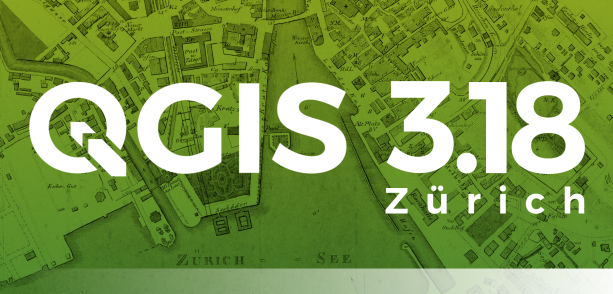
.. |image2| image:: images/entries/96178054-1aa78d80-0f2f-11eb-8d75-299bfd6aa73e.png
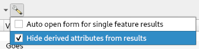
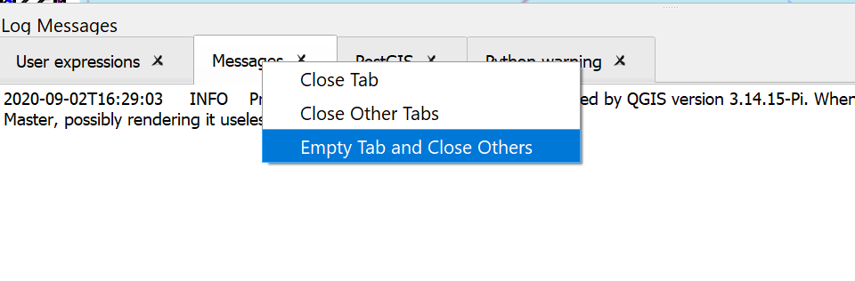
.. |image5| image:: images/entries/24c8af6d1314e7a22f8f70a7628f3aeae9b3ce1a-1.png
.. |image6| image:: images/entries/14df1b85a3e3ada3024a39499a245bbdd7e2ca64-1.png
   :class: img-responsive img-rounded
.. |image7| image:: images/entries/c6d55ffc6be5f0e4962d9b971cac6e54ab316717.png
   :class: img-responsive img-rounded
.. |image8| image:: images/entries/101234295-f1cc8a80-368b-11eb-9b52-8f42a4f994a2.gif
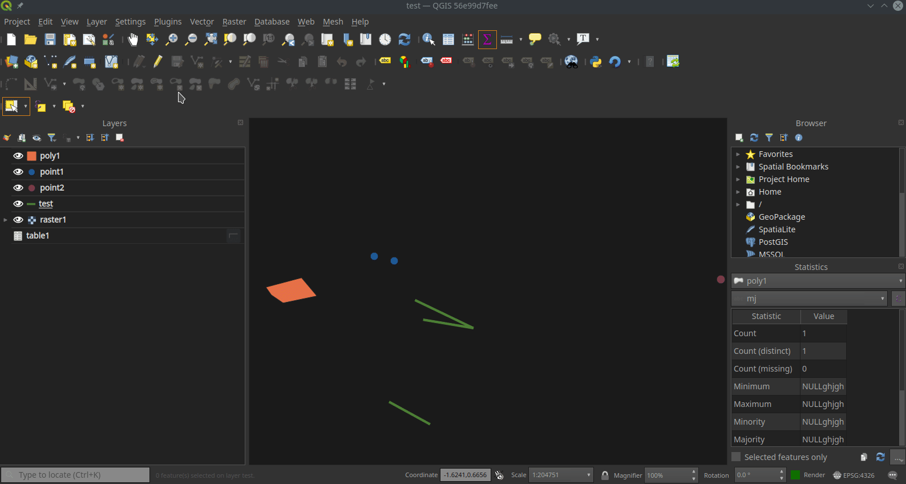
.. |image10| image:: images/entries/77b55b4c85c9c4f5076b1a735f7971819cc2a2ee.gif
   :class: img-responsive img-rounded
.. |image11| image:: images/entries/aba35ba4bb5ff0f2a8c1afcb55673e496efea18a.gif
   :class: img-responsive img-rounded
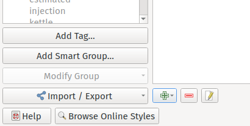
.. |image13| image:: images/entries/4738ffe8180f8fc320cf464121ec10fc27bd4c33.png
   :class: img-responsive img-rounded
.. |image14| image:: images/entries/41bdfc3d3c6afabc0e3e23986e42dbc22eb794df.gif
   :class: img-responsive img-rounded
.. |image15| image:: images/entries/6461d329ef7d4936ddbc932b0bf96edcb071b398.gif
   :class: img-responsive img-rounded
.. |image16| image:: images/entries/3acf2cfe05dc7550f16e183026350914d028a6da.png
   :class: img-responsive img-rounded
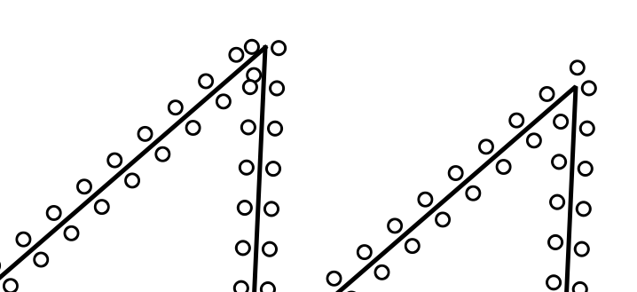
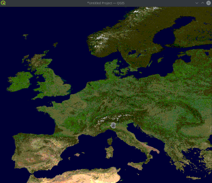
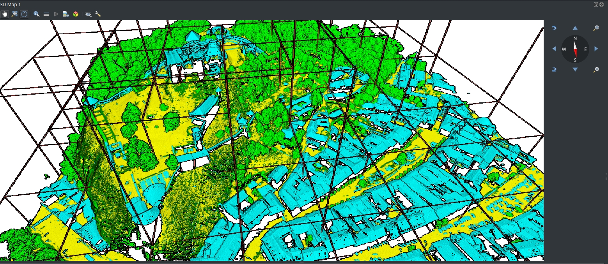
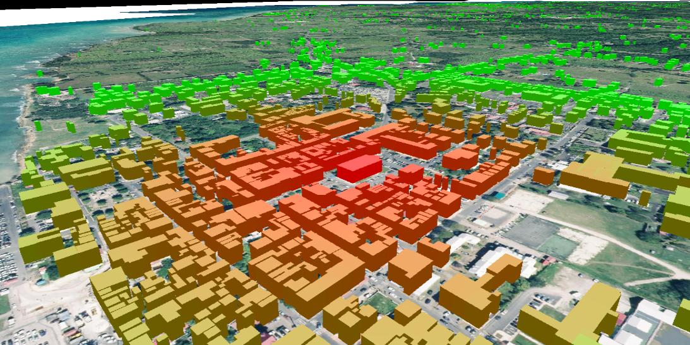
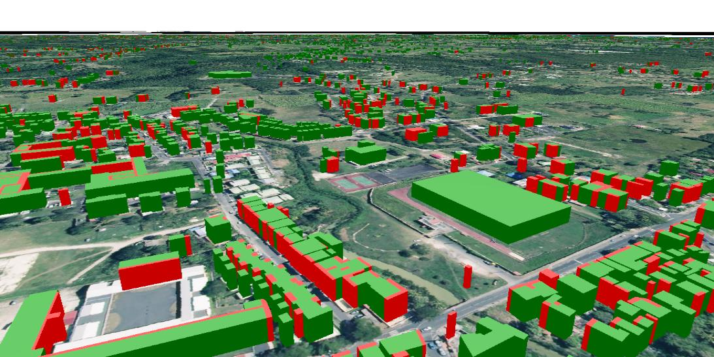
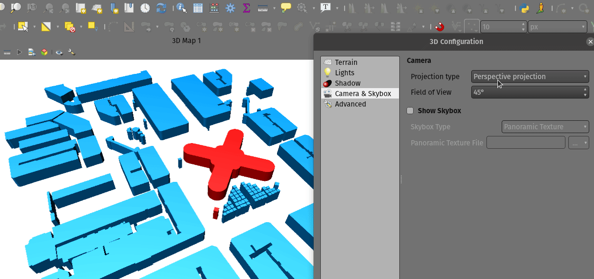
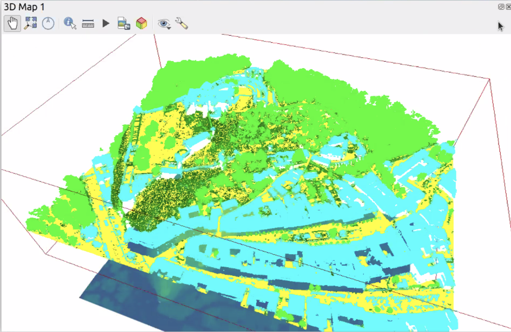
.. |image24| image:: images/entries/96aca5c2d2f428f0aa7fee0d11b5c8600c5c523c.png
   :class: img-responsive img-rounded
.. |image25| image:: images/entries/86e6d57200857c701d9438eabe246289e74f5194-1.gif
.. |image26| image:: images/entries/7c80cc107b0e3fb1098d416834463478367b555e-1.gif
.. |image27| image:: images/entries/145e2d7f00d3a2b33f383e3cbd808a6b21a792c4-1.gif
.. |image28| image:: images/entries/0dad8d8307a3c3fe1f5b28aa56790b307c090f33-1.gif
   :class: img-responsive img-rounded
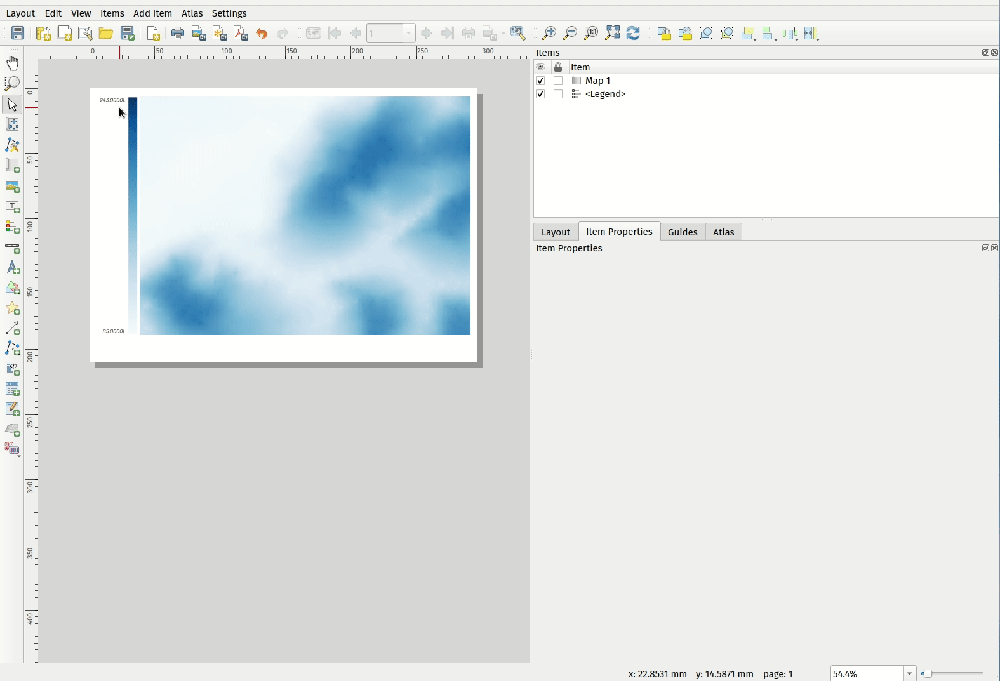
.. |image30| image:: images/entries/fb52826e81fd08763c269aaab50ea0c25b7af9b8-1.gif
   :class: img-responsive img-rounded
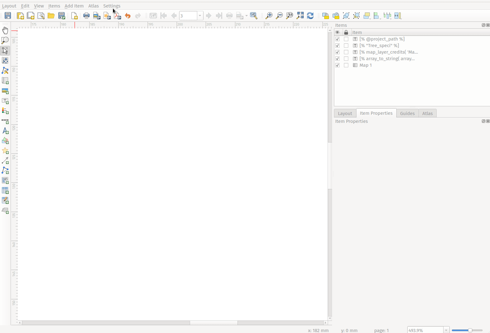
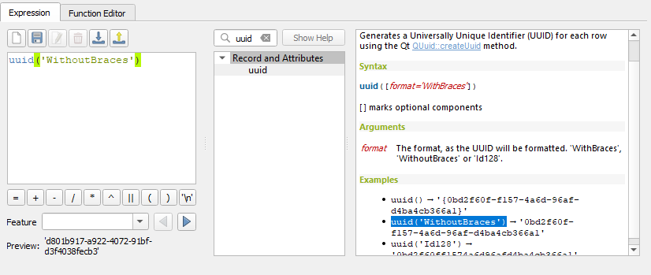
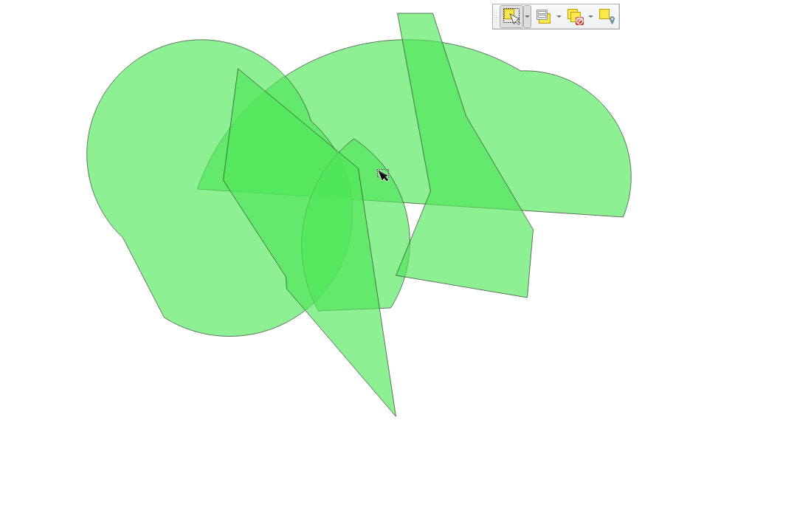
.. |image34| image:: images/entries/29b75d5574181d5b7570090b9801ede92bec2fcd.png
   :class: img-responsive img-rounded
.. |image35| image:: images/entries/16ac8bca1e78da740dc8ea8b6b46a916f8f0b83d.gif
   :class: img-responsive img-rounded
.. |image36| image:: images/entries/50d4d1d6353ebfa251c53ea29c28821bf4c5ac18.gif
   :class: img-responsive img-rounded
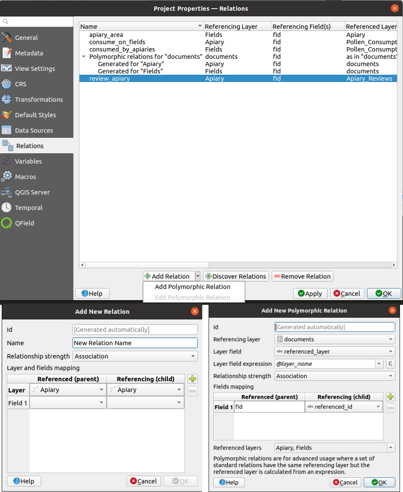
.. |image38| image:: images/entries/c02ae93517a537925c870d3a9d477cc26af5f9e7.png
   :class: img-responsive img-rounded
.. |image39| image:: images/entries/febde74bab33bb165971509e90fb112c4b643001.png
   :class: img-responsive img-rounded
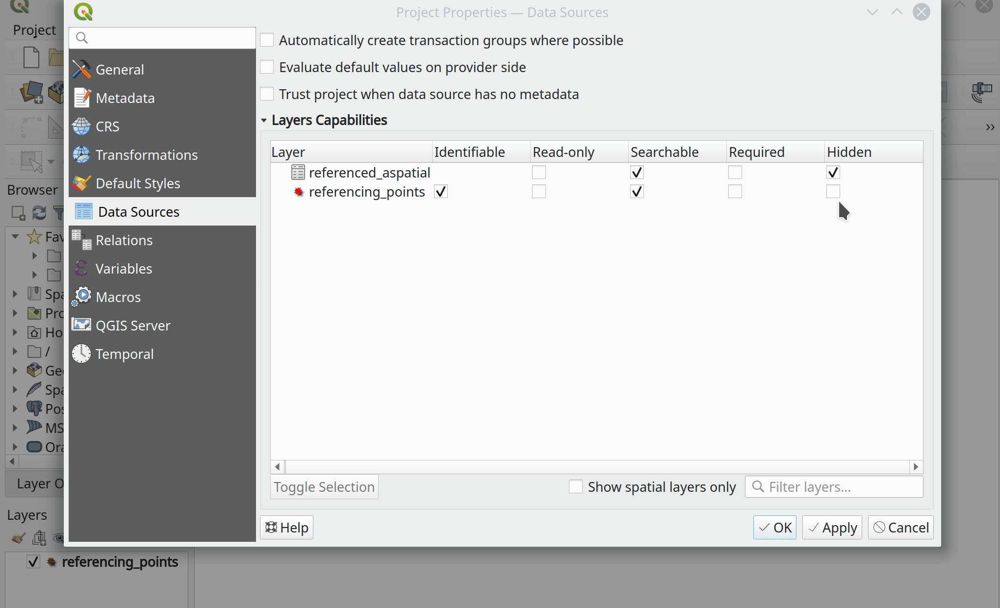
.. |image41| image:: images/entries/d0109e9db23e15765f201c3b292f23fa4230b608.png
   :class: img-responsive img-rounded
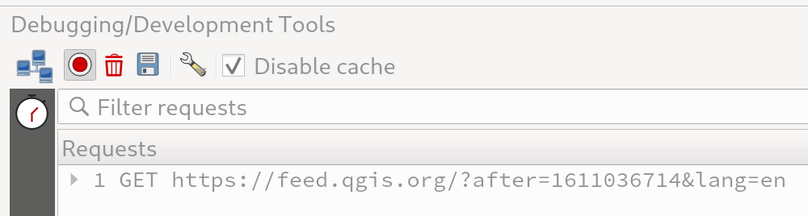
.. |image43| image:: images/entries/7800af6d2597ad04650532f201c8d4ee005c8e53.gif
   :class: img-responsive img-rounded
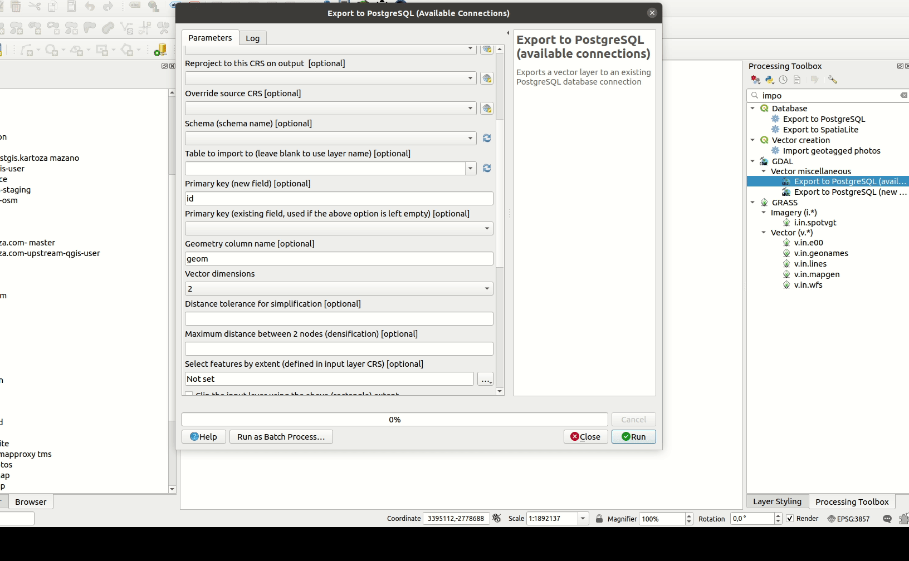
.. |image45| image:: images/entries/3d77459436d542190afa88f6d927be7f8245dbf0.gif
   :class: img-responsive img-rounded
.. |image46| image:: images/entries/1e2fe1a94747c9aa2fbbaab3053bfc6631cfbb22.gif
   :class: img-responsive img-rounded
.. |image47| image:: images/entries/5d7ccf71a162d927706fd6e6517a67452ec653e1.jpg
   :class: img-responsive img-rounded
.. |image48| image:: images/entries/1de42c7dc35c2b73dce1605a3c36b97166d81850.png
   :class: img-responsive img-rounded

