.. _changelog32:

Changelog for QGIS 3.2
======================

|image1|

Release date: 2018-06-22

The greatest QGIS release ever! QGIS 3.2 brings a massive list of new changes - the highlights of which we will try to cover here. As always can we remind you that QGIS is an open source project and if you are able to, consider supporting our work through `donations <https://donate.qgis.org>`__, :ref:`sustaining memberships <QGIS_sustaining_memberships>` or contributions to the code documentation, web site and so on.

**Thanks**

We would like to thank the developers, documenters, testers and all the many folks out there who volunteer their time and effort (or fund people to do so). From the QGIS community we hope you enjoy this release! If you wish to donate time, money or otherwise get involved in making QGIS more awesome, please wander along to `qgis.org <https://qgis.org>`__ and lend a hand!

QGIS is supported by donors and sustaining members. A current list of donors who have made financial contributions large and small to the project can be seen on our :ref:`donors list <list_of_donors>`. If you would like to become an official sustaining member, please visit :ref:`our sustaining membership page <QGIS-sustaining_members>` for details. Supporting QGIS helps us to fund our six monthly developer meetings, maintain project infrastructure and fund bug fixing efforts. A complete list of current sustaining members is provided below - our very great thank you to all of our supporters!

QGIS is Free software and you are under no obligation to pay anything to use it - in fact we want to encourage people far and wide to use it regardless of what your financial or social status is - we believe empowering people with spatial decision making tools will result in a better society for all of humanity.

.. contents::
   :local:

Sponsors for QGIS version 3.2
-----------------------------

A special thanks to all our :ref:`sustaining members, sponsors and donors <QGIS-sustaining_members>` for helping us to make this release possible!

General
-------

Feature: New zipped project file format .qgz is now the default format
~~~~~~~~~~~~~~~~~~~~~~~~~~~~~~~~~~~~~~~~~~~~~~~~~~~~~~~~~~~~~~~~~~~~~~

QGZ was added as an optional format in 3.0.
Having this format as the default format will ease a lot the path to go to a container able to embed resources like SVG, offline data in GPKG, color ramps, plugins or scripts.

|image29|

This feature was developed by `OSLANDIA - Paul Blottiere <https://github.com/pblottiere>`__

Feature: Filtering for field values in Query Builder
~~~~~~~~~~~~~~~~~~~~~~~~~~~~~~~~~~~~~~~~~~~~~~~~~~~~

When creating a new expression filter in query builder, you can now filter the field values preview panel.

|image30|

This feature was developed by `Salvatore Larosa <https://github.com/slarosa>`__

Feature: FULL screen Map via Ctrl-Shift-Tab
~~~~~~~~~~~~~~~~~~~~~~~~~~~~~~~~~~~~~~~~~~~

Besides Ctrl-Tab you can now do Ctrl-Shift-Tab, which will show you the Map and ONLY the Map, no more toolbars or buttons (or even without Window Title, in combination with F11).
Great for Full Screen Map projection via Beamer or on Big Screens.
You can still zoom and pan!
(Based on work of Mathieu Pellerin)

|image31|

This feature was developed by Richard Duivenvoorde

Map Tools
---------

Feature: Simplify map tool can now also smooth features
~~~~~~~~~~~~~~~~~~~~~~~~~~~~~~~~~~~~~~~~~~~~~~~~~~~~~~~

The Simplify Features map tool has been renamed to "Simplify/Smooth Features", and now supports interactive smoothing of features.

|image2|

This feature was funded by `North Road <https://north-road.com>`__

This feature was developed by `Nyall Dawson (North Road) <https://north-road.com>`__

Feature: Identify Tool with extra options
~~~~~~~~~~~~~~~~~~~~~~~~~~~~~~~~~~~~~~~~~

With the new improvements, user can now use similar tools to the Selection to identify multiple features.

.. raw:: html

   

.. raw:: html

   

This feature was funded by Leicestershire County Council and East Hampshire District Council

This feature was developed by `Martin Dobias and Viktor Sklencar <https://www.lutraconsulting.co.uk>`__

Feature: Store also expanded/collapsed state of nodes in map Themes
~~~~~~~~~~~~~~~~~~~~~~~~~~~~~~~~~~~~~~~~~~~~~~~~~~~~~~~~~~~~~~~~~~~

Each map theme will also record which layers, groups and legend items are expanded, so when a map theme is selected, the expanded/collapsed states get applied in the layer tree.

|image3|

This feature was funded by `Arpa Piemonte (Dipartimento Tematico Geologia e Dissesto) within ERIKUS project <https://www.arpa.piemonte.it/>`__

This feature was developed by `Martin Dobias (Lutra Consulting) <https://www.lutraconsulting.co.uk>`__ and `Faunalia <https://www.faunalia.eu>`__

Feature: Auto "Zoom to Selection" mode for new map views
~~~~~~~~~~~~~~~~~~~~~~~~~~~~~~~~~~~~~~~~~~~~~~~~~~~~~~~~

A new map view can be configured to automatically zoom to the current selection. Could be combined with different map themes as in this example.

|image4|

This feature was funded by `Technology One <https://www.technologyonecorp.com/>`__

This feature was developed by `Nathan Woodrow <https://nathanw.net/>`__

Feature: Choice of simplification method for simplify map tool
~~~~~~~~~~~~~~~~~~~~~~~~~~~~~~~~~~~~~~~~~~~~~~~~~~~~~~~~~~~~~~

This allows different techniques to be used for simplification in the interactive simplify map tool, including the more cartographically pleasing "Visvalingam" simplification algorithm.

|image5|

This feature was funded by `North Road <https://north-road.com>`__

This feature was developed by `Nyall Dawson (North Road) <https://north-road.com>`__

Feature: add zoom to related feature in forms
~~~~~~~~~~~~~~~~~~~~~~~~~~~~~~~~~~~~~~~~~~~~~

A new button appears in the feature attribute sub form when one or more records are selected in a related table. The button zooms the map to these features if they have geometries.

|image6|

This feature was developed by Jürgen Fischer

Feature: Cartesian areas/lengths/perimeters in identify results
~~~~~~~~~~~~~~~~~~~~~~~~~~~~~~~~~~~~~~~~~~~~~~~~~~~~~~~~~~~~~~~

In QGIS 3.2 we now show both ellipsoidal and cartesian areas, lengths and perimeters separately within the identify results panel. Seeing the two distinct measurements gives users a better understanding of potential issues in area or distance calculations caused by incorrect projection or ellipsoid choices.

|image7|

This feature was funded by `North Road <https://north-road.com>`__

This feature was developed by `Nyall Dawson (North Road) <https://north-road.com>`__

Expressions
-----------

Feature: New expression functions
~~~~~~~~~~~~~~~~~~~~~~~~~~~~~~~~~

-  color\_grayscale\_average()
-  color\_mix\_rgb()
-  flip\_coordinates()
-  wedge\_buffer()
-  tapered\_buffer()
-  buffer\_by\_m()

New variables:

-  @project\_home
-  @project\_author
-  @project\_abstract
-  @project\_creation\_date
-  @project\_identifier
-  @project\_keywords

This feature was developed by Mathieu Pellerin, Nyall Dawson

Feature: More helpful expression builder
~~~~~~~~~~~~~~~~~~~~~~~~~~~~~~~~~~~~~~~~

The expression builder now makes it easier to build expressions within QGIS!

-  The builder now shows the description for data defined values, including the range of expected values from the expression
-  Ctrl+clicking a function name in the current expression will automatically open the help for that function
-  It now shows indicators for parts of expressions with errors
-  It shows a complete list of error messages obtained from parsing the expression

|image8|

This feature was funded by `Technology One <https://www.technologyonecorp.com/>`__

This feature was developed by `Nathan Woodrow <https://nathanw.net/>`__

User Interface
--------------

Feature: Layers panel: indicators for filtered map layers
~~~~~~~~~~~~~~~~~~~~~~~~~~~~~~~~~~~~~~~~~~~~~~~~~~~~~~~~~

The main window's layer tree view (ToC) gets support for indicators that are shown when a vector layer has a filter applied. This makes it easier for users to understand that they are looking at a subset of all data. Clicking the indicator's icon brings up query builder.

This adds a mini-framework for display of extra icons in layer tree views next to layer and group names. Tool tip text can be associated with indicators to give extra context for indicators. In addition, a signal gets emitted when user clicks indicators and custom actions can be defined. The idea is that indicators can be used in the future for a subtle reporting of various bits of information, for example:

-  map layer with invalid geometries
-  map layer with on-the-fly reprojection exceptions
-  map layer has missing data source
-  map layer with invalid CRS

|image9|

This feature was funded by `Arpa Piemonte (Dipartimento Tematico Geologia e Dissesto) within ERIKUS project <https://www.arpa.piemonte.it/>`__

This feature was developed by `Martin Dobias (Lutra Consulting) <https://www.lutraconsulting.co.uk>`__ and `Faunalia <https://www.faunalia.eu>`__

Feature: Allow customizing prefix of locator filters
~~~~~~~~~~~~~~~~~~~~~~~~~~~~~~~~~~~~~~~~~~~~~~~~~~~~

Prefixes of locator filters can now be customized under the application settings in the "Locator" tab

|image10|

This feature was funded by `QGIS User Group Switzerland <https://qgis.ch>`__

This feature was developed by `Denis Rouzaud, OPENGIS.ch <https://opengis.ch>`__

Feature: Opening of vector and raster stored on HTTP(S), FTP, or cloud services
~~~~~~~~~~~~~~~~~~~~~~~~~~~~~~~~~~~~~~~~~~~~~~~~~~~~~~~~~~~~~~~~~~~~~~~~~~~~~~~

In 3.2, the data source manager's vector and raster panels have been updated to simplify opening of vector and raster datasets stored on HTTP(S), FTP, or cloud services. Basic HTTP(S) authentication support included.

|image11|

This feature was developed by `Mathieu Pellerin <http://www.imhere-asia.com/>`__

Feature: Quick calculator in locator search bar
~~~~~~~~~~~~~~~~~~~~~~~~~~~~~~~~~~~~~~~~~~~~~~~

QGIS 3.2 allows evaluation of simple expressions (well, actually ANY QGIS expression... so you could use aggregates and the like if you really wanted!) by entering "= " followed by an expression into the locator bar. If a valid expression is entered, users are given an option to copy the result to the clipboard.

E.g. entering "= 10/3" shows a locator entry "Copy '3.3333333' to clipboard".

|image12|

This feature was funded by `North Road <https://north-road.com>`__

This feature was developed by `Nyall Dawson (North Road) <https://north-road.com>`__

Feature: Shortcuts for toggling panels
~~~~~~~~~~~~~~~~~~~~~~~~~~~~~~~~~~~~~~

Ctrl+{no} shortcut

This feature was funded by `Technology One <https://www.technologyonecorp.com/>`__

This feature was developed by `Nathan Woodrow <https://nathanw.net/>`__

Feature: Bookmark searching in locator
~~~~~~~~~~~~~~~~~~~~~~~~~~~~~~~~~~~~~~

Allows search for spatial bookmarks. Double clicking a search result will zoom to the bookmark.

Short video: https://www.youtube.com/watch?v=ymW4TU8QWy4

The new filter presents itself with a prefix of "b" and with tr( "Spatial bookmarks" ) as displayname.

This feature was developed by Klavs Pihlkjær

Feature: Close and Revert Project actions
~~~~~~~~~~~~~~~~~~~~~~~~~~~~~~~~~~~~~~~~~

Two new actions have been added to the "Project" menu

-  "Close": Closes the active project, returning the QGIS window to the "Recent Projects" list
-  "Revert": Restores the active project to the last saved state, discarding all unsaved changes

|image13|

This feature was developed by Nathan Woodrow, Nyall Dawson

Feature: Unsaved changes indicator in title bar
~~~~~~~~~~~~~~~~~~~~~~~~~~~~~~~~~~~~~~~~~~~~~~~

QGIS 3.2 now follows the standard UI approach of indicating that the current project has unsaved changes by adding a "\*" prefix to the project name in the application title bar. This makes it easy to see if you have unsaved changes at a single glance!

This feature was funded by `North Road <https://north-road.com>`__

This feature was developed by `Nyall Dawson (North Road) <https://north-road.com>`__

Feature: Configurable map tips delay
~~~~~~~~~~~~~~~~~~~~~~~~~~~~~~~~~~~~

This feature was developed by jdugge

Feature: Move layer or group to top of layer panel
~~~~~~~~~~~~~~~~~~~~~~~~~~~~~~~~~~~~~~~~~~~~~~~~~~

Moves the selected layer(s) or group(s) to the top of the layer panel.

This feature was developed by Mie Winstrup

Feature: Copy statistics panel content to clipboard button
~~~~~~~~~~~~~~~~~~~~~~~~~~~~~~~~~~~~~~~~~~~~~~~~~~~~~~~~~~

It is now possible to copy the statistics panel's output table into the clipboard.

|image14|

This feature was developed by `Mathieu Pellerin <http://www.imhere-asia.com/>`__

Feature: Search Settings, Options, and Project Properties pages from locator
~~~~~~~~~~~~~~~~~~~~~~~~~~~~~~~~~~~~~~~~~~~~~~~~~~~~~~~~~~~~~~~~~~~~~~~~~~~~

Short video: https://www.youtube.com/watch?v=duB2YekUmV0

The new filter presents itself with a prefix of "s" and with tr( "Settings" ) as displayname.

This feature was developed by Klavs Pihlkjær

Feature: Indicators for embedded layers and groups
~~~~~~~~~~~~~~~~~~~~~~~~~~~~~~~~~~~~~~~~~~~~~~~~~~

Embedded project layers and groups are now flagged by a handy "embedded" indicator, making it immediately clear to users which layers and groups have been embedded inside a project.

This feature was funded by `North Road <https://north-road.com>`__

This feature was developed by `Nyall Dawson (North Road) <https://north-road.com>`__

Symbology
---------

Feature: Nicer colors for new layers
~~~~~~~~~~~~~~~~~~~~~~~~~~~~~~~~~~~~

The "random" colors assigned to new map layers are no longer "random" but instead randomly selected from a preset palette of "visually pleasing" colors. Say goodbye to ugly baby puke green layers!

This feature was funded by `North Road <https://north-road.com>`__

This feature was developed by `Nyall Dawson (North Road) <https://north-road.com>`__

Rendering
---------

Feature: Improved map Copyright decoration
~~~~~~~~~~~~~~~~~~~~~~~~~~~~~~~~~~~~~~~~~~

-  Expression support for the copyright text.
-  Improved text formatting options, including shadows, outlines, backgrounds, etc.

This feature was developed by `Mathieu Pellerin <http://www.imhere-asia.com/>`__

Feature: Main window scale bar font size and family can be customized
~~~~~~~~~~~~~~~~~~~~~~~~~~~~~~~~~~~~~~~~~~~~~~~~~~~~~~~~~~~~~~~~~~~~~

This feature was developed by `Mathieu Pellerin <http://www.imhere-asia.com/>`__

Feature: Custom SVG path and size for the north arrow decoration
~~~~~~~~~~~~~~~~~~~~~~~~~~~~~~~~~~~~~~~~~~~~~~~~~~~~~~~~~~~~~~~~

This feature was developed by `Mathieu Pellerin <http://www.imhere-asia.com/>`__

Data Management
---------------

Feature: Refresh a materialized view
~~~~~~~~~~~~~~~~~~~~~~~~~~~~~~~~~~~~

From the browser, with a right click on a materialized view, you can now refresh it.

|image15|

This feature was developed by `Etienne Trimaille <https://github.com/Gustry>`__

Feature: Z and M support for offline editing
~~~~~~~~~~~~~~~~~~~~~~~~~~~~~~~~~~~~~~~~~~~~

Offline editing now also supports layers with Z and M coordinates.

This feature was funded by `Oester Messtechnik <https://messtechnik.ch/>`__

This feature was developed by `Matthias Kuhn, OPENGIS.ch <https://opengis.ch>`__

Feature: Metadata for QGIS projects
~~~~~~~~~~~~~~~~~~~~~~~~~~~~~~~~~~~

Continuing the metadata work begun in QGIS 3.0, 3.2 now supports metadata for QGIS projects. This allows for detailed metadata to be set in project properties, including abstracts, keywords, contact details, links, etc.

|image16|

This feature was funded by Arpa Piemonte (Dipartimento Tematico Geologia e Dissesto) within ERIKUS project

This feature was developed by `Nyall Dawson (North Road) <https://north-road.com>`__ and `Faunalia <https://www.faunalia.eu>`__

Forms and Widgets
-----------------

Feature: Multi-column layout for multiselect value relation widget
~~~~~~~~~~~~~~~~~~~~~~~~~~~~~~~~~~~~~~~~~~~~~~~~~~~~~~~~~~~~~~~~~~

The value relation widget with multi selection enabled now supports multiple columns. This allows better usage of horizontal screen space.

|image17|

This feature was funded by `Grundbuch- und Vermessungsamt des Kanton Zug <https://www.zg.ch/behoerden/direktion-des-innern/grundbuch-und-vermessungsamt/gis-fachstelle>`__

This feature was developed by `David Signer, OPENGIS.ch <https://opengis.ch>`__

Feature: Allow using a URL for custom attribute forms (UI file)
~~~~~~~~~~~~~~~~~~~~~~~~~~~~~~~~~~~~~~~~~~~~~~~~~~~~~~~~~~~~~~~

The UI file will be downloaded on every session on the first usage.
This makes it possible to easily distribute updated UI files to clients.

This feature was funded by `SIRS <http://www.sirs-fr.com>`__

This feature was developed by `Denis Rouzaud, OPENGIS.ch <https://opengis.ch>`__

Feature: Drill-down (cascading) forms
~~~~~~~~~~~~~~~~~~~~~~~~~~~~~~~~~~~~~

QGIS 3.2 introduces drill-down (cascading) form support, where the values available in one field depend on the values of other fields. This feature allows users to create “value-relation” expressions based on the current value of another field in the same form. When the user modifies a field’s value, the choices available in all related fields are filtered to match the new value – allowing a hierarchical filtering strategy (drill-down, or cascading) inside a form.

|image18|

.. raw:: html

   

.. raw:: html

   

This feature was funded by Grant Boxer, NaturalGIS, Tudor Bărăscu, NotioGIS, République et canton de Neuchâtel, Arpa Piemonte, Nelson Silva, QGIS Danish User Group, Bo Victor Thomsen and Lene Fischer, North River Geographic

This feature was developed by `Alessandro Pasotti (North Road) <https://north-road.com>`__

Layer Legend
------------

Feature: Optional text on top of symbols for vector layers
~~~~~~~~~~~~~~~~~~~~~~~~~~~~~~~~~~~~~~~~~~~~~~~~~~~~~~~~~~

This feature allows users to add extra information to the symbols in the legend.

|image19|

This feature was funded by `Arpa Piemonte (Dipartimento Tematico Geologia e Dissesto) within ERIKUS project <https://www.arpa.piemonte.it/>`__

This feature was developed by `Martin Dobias (Lutra Consulting) <https://www.lutraconsulting.co.uk>`__  and `Faunalia <https://www.faunalia.eu>`__

Feature: Copy&Paste Group/Layers from a QGIS project to another.
~~~~~~~~~~~~~~~~~~~~~~~~~~~~~~~~~~~~~~~~~~~~~~~~~~~~~~~~~~~~~~~~

Allowing to copy and paste groups or layers between projects and profiles.

.. raw:: html

   

.. raw:: html

   

This feature was developed by `Salvatore Larosa <https://github.com/slarosa>`__

Map Composer
------------

Feature: Data defined table source for attribute table items
~~~~~~~~~~~~~~~~~~~~~~~~~~~~~~~~~~~~~~~~~~~~~~~~~~~~~~~~~~~~

When an attribute table is set to a "Layer features" source, this new feature allows the underlying vector layer from which to source features to be data defined.

(All existing table attributes (column settings) are left intact, so setting a data defined table to a layer with different fields will result in empty columns in the table.)

This feature was funded by `Kartoza/InaSAFE <http://kartoza.com/en/>`__

This feature was developed by `Nyall Dawson (North Road) <https://north-road.com>`__

Feature: Project metadata embedded in layout exports
~~~~~~~~~~~~~~~~~~~~~~~~~~~~~~~~~~~~~~~~~~~~~~~~~~~~

Saving a print layout to SVG, PDF or images will now embed any project metadata in the created file. Support for different metadata elements depends on the individual export format.

This feature was funded by Arpa Piemonte (Dipartimento Tematico Geologia e Dissesto) within ERIKUS project

This feature was developed by `Nyall Dawson (North Road) <https://north-road.com>`__

Feature: Better formatting for scalebar text
~~~~~~~~~~~~~~~~~~~~~~~~~~~~~~~~~~~~~~~~~~~~

QGIS 3.2 allows the full range of text formatting options to be used within scalebar text, e.g. buffers, shadows, and background shapes.

Unreadable scale bar text is a thing of the past!

This feature was funded by `North Road <https://north-road.com>`__

This feature was developed by `Nyall Dawson (North Road) <https://north-road.com>`__

Processing
----------

Feature: Improved 'Join by attribute table' algorithm
~~~~~~~~~~~~~~~~~~~~~~~~~~~~~~~~~~~~~~~~~~~~~~~~~~~~~

The 'Join by attribute table' algorithm has been upgraded to support one-to-many joins (i.e. create separate features for each matching feature) as well as an option to discard records which could not be joined. Additionally, an optional prefix for joined fields can now be specified.

|image20|

This feature was developed by `Mathieu Pellerin, Nyall Dawson <http://www.imhere-asia.com/>`__

Feature: Load script from template
~~~~~~~~~~~~~~~~~~~~~~~~~~~~~~~~~~

New option to load Processing scripts from a custom template

|image21|

This feature was developed by `Matteo Ghetta (Faunalia) <http://www.faunalia.eu/>`__

Feature: Feature filter algorithm for processing models
~~~~~~~~~~~~~~~~~~~~~~~~~~~~~~~~~~~~~~~~~~~~~~~~~~~~~~~

Add a new feature filter algorithm for the processing modeler.
Allows filtering features of a source based on expressions and send matching features to different outputs as final products or different algorithm pipeline for further processing.

Read this `blog post for more information <http://www.opengis.ch/2018/05/28/how-to-filter-features-in-qgis-using-the-graphical-processing-modeler/>`__.

|image22|

This feature was funded by `QGIS User Group Switzerland <https://qgis.ch>`__

This feature was developed by `Matthias Kuhn, OPENGIS.ch <https://opengis.ch>`__

Feature: Zonal histogram
~~~~~~~~~~~~~~~~~~~~~~~~

This new algorithm appends fields representing counts of each unique value from a raster layer contained within zones defined as polygons.

|image23|

This feature was developed by `Mathieu Pellerin <http://www.imhere-asia.com/>`__

Feature: Port Union, Difference and Intersection algorithms to C++
~~~~~~~~~~~~~~~~~~~~~~~~~~~~~~~~~~~~~~~~~~~~~~~~~~~~~~~~~~~~~~~~~~

QGIS native geoprocessing algorithms have been ported from Python to C++. In addition to performance boost, several bugs have been resolved with this update.

This feature was funded by `InaSAFE DFAT <https://www.dfat.gov.au/>`__

This feature was developed by `Martin Dobias (Lutra Consulting) <https://www.lutraconsulting.co.uk>`__

Feature: 'Project points (cartesian)' algorithm
~~~~~~~~~~~~~~~~~~~~~~~~~~~~~~~~~~~~~~~~~~~~~~~

This new Processing algorithm projects points from an input point layer by a specified distance and bearing (azimuth). It supports dynamic parameters for the distance and bearing so that the distance and bearing can be taken from field values or expressions.

This feature was funded by `Nyall Dawson (North Road) <https://north-road.com>`__

This feature was developed by `Nyall Dawson (North Road) <https://north-road.com>`__

Feature: Dynamic parameter values for more algorithms
~~~~~~~~~~~~~~~~~~~~~~~~~~~~~~~~~~~~~~~~~~~~~~~~~~~~~

QGIS 3.2 extends the work begun in 3.0 to allow "dynamic" parameters for selected Processing algorithms. Dynamic parameters allow users to use expressions or field values to specify the value of a parameter while the algorithm executes, so e.g. the buffer size can be dynamically calculated for each individual feature buffered.

In 3.2 the following algorithms now support dynamic parameters:

-  Delete holes
-  Remove Duplicate Vertices
-  Simplify
-  Smooth
-  Snap to Grid
-  Subdivide
-  Transect
-  Translate

This feature was funded by `North Road <https://north-road.com>`__

This feature was developed by `Nyall Dawson (North Road) <https://north-road.com>`__

Feature: Multi-ring buffer (constant distance) algorithm
~~~~~~~~~~~~~~~~~~~~~~~~~~~~~~~~~~~~~~~~~~~~~~~~~~~~~~~~

This new algorithm computes multi-ring ('donuts') buffer for all the features in an input layer, using a fixed or dynamic distance and rings number.

This feature was developed by Alex Bruy

Feature: New "segmentize" algorithms
~~~~~~~~~~~~~~~~~~~~~~~~~~~~~~~~~~~~

In QGIS 3.2 two new algorithms for segmentizing curved geometries have been added to Processing.

"Segmentize by maximum distance": The segmentization is performed by specifying the maximum allowed offset distance between the original curve and the segmentized representation.

"Segmentize by maximum angle": The segmentization is performed by specifying the maximum allowed radius angle between vertices on the straightened geometry (e.g the angle of the arc created from the original arc center to consective output vertices on the linearized geometry).

This feature was funded by `North Road <https://north-road.com>`__

This feature was developed by `Nyall Dawson (North Road) <https://north-road.com>`__

Feature: Option to create points on all polygon parts
~~~~~~~~~~~~~~~~~~~~~~~~~~~~~~~~~~~~~~~~~~~~~~~~~~~~~

The "Centroid" and "Point on surface" algorithms have a new option to create points for every individual part of input geometries.

This feature was developed by `Mathieu Pellerin <http://www.imhere-asia.com/>`__

Feature: Rotate Features algorithm
~~~~~~~~~~~~~~~~~~~~~~~~~~~~~~~~~~

This new algorithm allows rotation of features by a set angle. The rotation can occur around a preset point or each individual feature's centroid.

This feature was funded by `North Road <https://north-road.com>`__

This feature was developed by `Nyall Dawson (North Road) <https://north-road.com>`__

Feature: Line sinuosity in "Add Geometry Attributes"
~~~~~~~~~~~~~~~~~~~~~~~~~~~~~~~~~~~~~~~~~~~~~~~~~~~~

The "Add Geometry Attributes" algorithm now calculates line sinuosity and straight distance for line layers.

This feature was funded by `North Road <https://north-road.com>`__

This feature was developed by `Nyall Dawson (North Road) <https://north-road.com>`__

Feature: Import geotagged photos
~~~~~~~~~~~~~~~~~~~~~~~~~~~~~~~~

In QGIS 3.2 a new "Import geotagged photos" algorithm has been added to Processing. It allows selection of a folder which it will scan for jpg files which have been geotagged and
creates a PointZ layer with the result, with attributes for photo path, altitude, direction and timestamp.

Optionally the scan can be recursive and you can create an optional table of photos which could not be read or which were missing geotags.

The algorithm automatically sets the output table to use an external resource widget to display the linked photos in the attribute form.

|image24|

This feature was funded by `North Road <https://north-road.com>`__

This feature was developed by `Nyall Dawson (North Road) <https://north-road.com>`__

Feature: Swap x/y coordinate values algorithm
~~~~~~~~~~~~~~~~~~~~~~~~~~~~~~~~~~~~~~~~~~~~~

This algorithm swaps the X and Y coordinate values in input geometries. It can be used to repair geometries which have accidentally had their latitude and longitude values reversed.

This feature was funded by `North Road <https://north-road.com>`__

This feature was developed by `Nyall Dawson (North Road) <https://north-road.com>`__

Feature: Sort order option for "Add Incremental Field"
~~~~~~~~~~~~~~~~~~~~~~~~~~~~~~~~~~~~~~~~~~~~~~~~~~~~~~

This change allows users to optionally set a sort order to use when assigning values in the Add Incremental Field algorithm. Previously values were always added using the original feature order. With this change users can control the order in which features are assigned values.

This feature was funded by `North Road <https://north-road.com>`__

This feature was developed by `Nyall Dawson (North Road) <https://north-road.com>`__

Feature: Indicator for distance parameter units
~~~~~~~~~~~~~~~~~~~~~~~~~~~~~~~~~~~~~~~~~~~~~~~

When an algorithm uses a "distance" type parameter, the units will now be shown next to the parameter. This avoids the confusion when running algorithms which use distances where the unit depends on a layer or CRS parameter - e.g. the distance parameter in the buffer algorithm gives the distance in layer units... so now in QGIS 3.2 we show those units
directly within the dialog. Hopefully this leads to less user confusion and accidental "1000 degree buffers"!

Additionally - if the unit is in degrees, a small warning icon is shown next to the parameter. The tooltip for this icon advises users to reproject data into a suitable projected local coordinate system.

This feature was funded by `North Road <https://north-road.com>`__

This feature was developed by `Nyall Dawson (North Road) <https://north-road.com>`__

Feature: Algorithm log can be saved/cleared/copied
~~~~~~~~~~~~~~~~~~~~~~~~~~~~~~~~~~~~~~~~~~~~~~~~~~

In the algorithm execution dialog, new buttons have been added to allow users to save the current log (to text or HTML files), copy the log contents to the clipboard, and clear the log.

This feature was funded by SMEC/SJ

This feature was developed by `Nyall Dawson (North Road) <https://north-road.com>`__

Feature: Wedge buffer algorithm
~~~~~~~~~~~~~~~~~~~~~~~~~~~~~~~

This new algorithm creates wedge shaped buffers from input points.

The azimuth parameter gives the angle (in degrees) for the middle of the wedge to point. The buffer width (in degrees) is specified by the width parameter. Note that the wedge will extend to half of the angular width either side of the azimuth direction. The outer radius of the buffer is specified via outer radius, and optionally an inner radius can also be specified.

The algorithm supports dynamic parameters for azimuth, width, and radius.

The native output from this algorithm is CurvePolygon geometries, but these may be automatically segmentized to Polygons depending on the output format.

This feature was funded by `North Road <https://north-road.com>`__

This feature was developed by `Nyall Dawson (North Road) <https://north-road.com>`__

Feature: Variable width buffers
~~~~~~~~~~~~~~~~~~~~~~~~~~~~~~~

New Processing algorithms have been added to create variable width buffers, including tapered buffers (with a specified start and end diameter) and variable width buffers from line string m values.

This feature was funded by `North Road <https://north-road.com>`__

This feature was developed by `Nyall Dawson (North Road) <https://north-road.com>`__

Feature: Reclassify raster algorithms
~~~~~~~~~~~~~~~~~~~~~~~~~~~~~~~~~~~~~

Two new native QGIS raster reclassification algorithms have been added to Processing. These are simple to use, yet fast and stable, and work for ANY raster layer type supported by QGIS!

-  Reclassify by layer: reclassifies a raster using the ranges specified via min/max/value fields from a vector table

-  Reclassify by table: reclassifies a raster using a fixed table entered by users in the algorithm dialog

This feature was funded by SMEC/SJ

This feature was developed by `Nyall Dawson (North Road) <https://north-road.com>`__

Feature: Union algorithm with a single layer
~~~~~~~~~~~~~~~~~~~~~~~~~~~~~~~~~~~~~~~~~~~~

The union algorithm can be now run with just a single input layer in order to resolve any overlaps among the layer's features. For example, if an area is covered by three features, that area will be cut out from those features and three new features will be added, copying attributes of the original features.

|image25|

This feature was funded by `InaSAFE DFAT <https://www.dfat.gov.au/>`__

This feature was developed by `Martin Dobias (Lutra Consulting) <https://www.lutraconsulting.co.uk/>`__

Application and Project Options
-------------------------------

Feature: Mandatory layers in project
~~~~~~~~~~~~~~~~~~~~~~~~~~~~~~~~~~~~

Required layers are not allowed to be removed from the project. This adds extra safety to protect project users from removing layers they may think are not needed (e.g. used in joins, relations, expressions).

|image26|

This feature was funded by `Arpa Piemonte (Dipartimento Tematico Geologia e Dissesto) within ERIKUS project <https://www.arpa.piemonte.it/>`__

This feature was developed by `Martin Dobias (Lutra Consulting) <https://www.lutraconsulting.co.uk>`__ and `Faunalia <https://www.faunalia.eu>`__

Feature: Saving and loading projects in PostgreSQL database
~~~~~~~~~~~~~~~~~~~~~~~~~~~~~~~~~~~~~~~~~~~~~~~~~~~~~~~~~~~

Users can now save their projects within a PostgreSQL database. Project can be saved in menu **Projects > Save To > PostgreSQL** and loaded using menu **Projects > Load From > PostgreSQL**. Projects saved in database can be loaded also through the browser dock (projects show up under the schema where they were saved, together with other layers).

Saving/loading QGIS projects must be explicitly enabled in PostgreSQL connection settings: there is a new option "Allow saving/loading QGIS projects in the database" which is disabled by default.

New API has been introduced that allows creation of custom project storage implementations (may be used by plugins). Related QEP: https://github.com/qgis/QGIS-Enhancement-Proposals/issues/118

.. raw:: html

   

.. raw:: html

   

This feature was funded by `Arpa Piemonte (Dipartimento Tematico Geologia e Dissesto) within ERIKUS project <https://www.arpa.piemonte.it/>`__

This feature was developed by `Martin Dobias, Peter Petrik (Lutra Consulting) <https://www.lutraconsulting.co.uk>`__ and `Faunalia <https://www.faunalia.eu>`__

Browser
-------

Feature: Save/Load connections for XYZ Tiles
~~~~~~~~~~~~~~~~~~~~~~~~~~~~~~~~~~~~~~~~~~~~

From the Browser panel, XYZ Tiles entries can be exported/imported to/from an XML file.

|image27|

This feature was developed by `Salvatore Larosa <https://github.com/slarosa>`__

Feature: Project home path can be manually set
~~~~~~~~~~~~~~~~~~~~~~~~~~~~~~~~~~~~~~~~~~~~~~

This new feature in QGIS 3.2 allows the project home path (which is used by the browser to create the 'Project Home' item) to be set by users for a project, instead of always matching the location where the project is saved.

This allows users to set the project home to a folder which contains data and other content, and is especially useful for organisations where QGIS projects are not stored in the root folder of a organisational 'project'.

Project home paths can also be set to relative paths, in which case they will be relative to the project saved location.

The path can be set through the Project Properties dialog, or by right-clicking on the Project Home browser item and selecting 'Set Project Home'.

|image28|

This feature was funded by SMEC/SJ

This feature was developed by `Nyall Dawson (North Road) <https://north-road.com>`__

Data Providers
--------------

Feature: Support for mesh layers
~~~~~~~~~~~~~~~~~~~~~~~~~~~~~~~~

Initial work has been done to introduce mesh layers supporting display of data on structured or unstructured meshes (grids) in addition to raster and vector layers. This is still a work in progress, expected to be fully ready in QGIS 3.4. The work so far lead to creation of a new library MDAL for handling of different formats of mesh-based data and there are new APIs introduced under the hood, however the user interface is not implemented yet.

For more information see:

https://github.com/qgis/QGIS-Enhancement-Proposals/issues/119

and

https://github.com/lutraconsulting/MDAL

|image32|

This feature was developed by `Peter Petrik and Martin Dobias (Lutra Consulting) <https://www.lutraconsulting.co.uk>`__

Feature: Automatically set default style for layers for ArcGIS Feature Server layers
~~~~~~~~~~~~~~~~~~~~~~~~~~~~~~~~~~~~~~~~~~~~~~~~~~~~~~~~~~~~~~~~~~~~~~~~~~~~~~~~~~~~

When layers from a Feature Server are loaded into QGIS 3.2, they will automatically have the same style applied as has been specified for that layer on the server, matching the appearance of the layer when it is loaded into ArcGIS.

This feature was funded by SMEC/SJ

This feature was developed by `Nyall Dawson (North Road) <https://north-road.com>`__

Feature: Faster Oracle queries
~~~~~~~~~~~~~~~~~~~~~~~~~~~~~~

Certain operations are greatly sped up for Oracle layers, e.g. case-insensitive value matches for features.

This feature was funded by `North Road <https://north-road.com>`__

This feature was developed by `Nyall Dawson (North Road) <https://north-road.com>`__

Feature: Restrict table list for a Oracle database connection to a preset schema
~~~~~~~~~~~~~~~~~~~~~~~~~~~~~~~~~~~~~~~~~~~~~~~~~~~~~~~~~~~~~~~~~~~~~~~~~~~~~~~~

This change allows a schema to be set in the connection properties for an Oracle database connection. If set, only tables within that schema will be scanned and listed for the connection.

Previously the option existed to restrict the scan to tables which belong to the user, but this option does not support the use case where a connection must access tables from a different
user, and the default "scan everything" setting is too expensive (since it often takes multiple minutes to perform, especially when geometryless tables are shown).

This feature was funded by `Open Spatial <http://www.openspatial.com>`__

This feature was developed by `Nyall Dawson (North Road) <https://north-road.com>`__

Feature: Read only support for curved Oracle geometries
~~~~~~~~~~~~~~~~~~~~~~~~~~~~~~~~~~~~~~~~~~~~~~~~~~~~~~~

Previously these geometries were silently discarded.

This feature was funded by `Open Spatial <http://www.openspatial.com>`__

This feature was developed by `Nyall Dawson (North Road) <https://north-road.com>`__

Plugins
-------

Feature: Adding query history in DB Manager
~~~~~~~~~~~~~~~~~~~~~~~~~~~~~~~~~~~~~~~~~~~

In 3.2 it is possible to store SQL queries. The query history is available into the SQL Window tab of the DB Manager plugin.

|image33|

This feature was developed by `Salvatore Larosa <https://github.com/slarosa>`__

Feature: DB Manager SQL execution in background
~~~~~~~~~~~~~~~~~~~~~~~~~~~~~~~~~~~~~~~~~~~~~~~

This feature was developed by Paul Blottiere

3D Features
-----------

Feature: 3D Polygons: Optionally generate back faces
~~~~~~~~~~~~~~~~~~~~~~~~~~~~~~~~~~~~~~~~~~~~~~~~~~~~

Sometimes datasets with 3D polygons do not have consistent ordering of vertices (clockwise vs. counter-clockwise) and that caused sub-optimal results in the 3D view: either some polygons (walls) seem to be missing if back-face culling is enabled - or some polygons are shaded incorrectly if back-face culling is disabled. With the new option **Add back faces** enabled, the tessellator will generate triangles in both directions (front and back) which greatly improves the rendering quality for such datasets.

The only downside when using this option is that more graphical memory is used (double amount of vertex data). Make sure to set culling mode to "Back" when using this option, otherwise there would be no visible difference as the scene would still render polygons with incorrect shading.

The image contains freely available Prague 3D buildings dataset.

|image34|

This feature was developed by `Martin Dobias (Lutra Consulting) <https://www.lutraconsulting.co.uk/>`__

.. |image1| image:: images/projects/8f04d904f903b8bff930e6c968fe46928e6cc012.png
.. |image2| image:: images/entries/thumbnails/eca7851f8710661b929a99722afd28707f5926b3.png.400x300_q85_crop.png
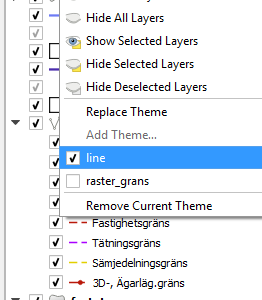
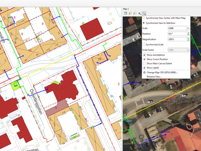
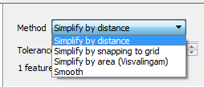
.. |image6| image:: images/entries/thumbnails/697d671bf6227445e10f9c899c0740b4225c1e7f.PNG.400x300_q85_crop.png
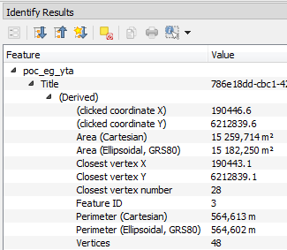
.. |image8| image:: images/entries/thumbnails/a296b411a0950f6bbd9af3c3cffec90b509b6e78.png.400x300_q85_crop.png
.. |image9| image:: images/entries/thumbnails/ff2206aa7147ca68357ea4e3a1354bc231fb49cc.png.400x300_q85_crop.jpg
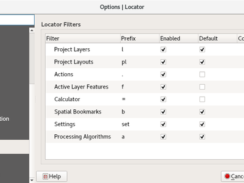
.. |image11| image:: images/entries/thumbnails/06e06201fb4db385ae14d6932353ce0b0b035e83.jpg.400x300_q85_crop.jpg
.. |image12| image:: images/entries/thumbnails/873ea8846c5f2f2cea56e8d4602bb41ac0567d7d.png.400x300_q85_crop.jpg
.. |image13| image:: images/entries/thumbnails/3801ee06f51aa6517fd1c4a5de5eafffd4114f71.png.400x300_q85_crop.png
.. |image14| image:: images/entries/thumbnails/0d1f4be90052251c05a1fc351dd099aaa92c65f7.png.400x300_q85_crop.png
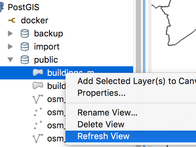
.. |image16| image:: images/entries/thumbnails/eb1394b46bf05e8a9b6be480cac4382c2f22a865.png.400x300_q85_crop.jpg
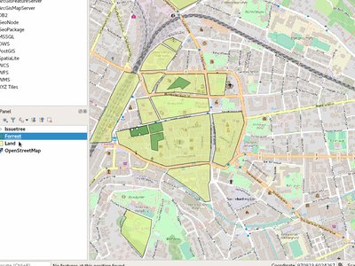
.. |image18| image:: images/entries/thumbnails/5990ff168d5b6b41176de4fa487964b97c32fafc.gif.400x300_q85_crop.png
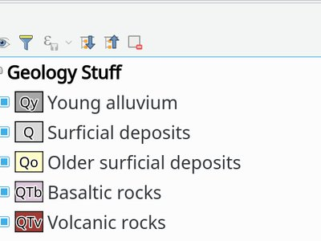
.. |image20| image:: images/entries/thumbnails/93dd2a52ae3ed2b7a3842f6379d033fabc7932fe.png.400x300_q85_crop.png
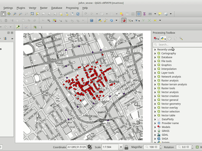
.. |image22| image:: images/entries/thumbnails/3b1e5e0d5b1874d2e3f0cbb8070eb82dedd89a4e.png.400x300_q85_crop.png
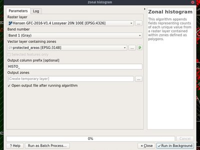
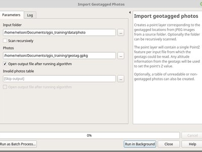
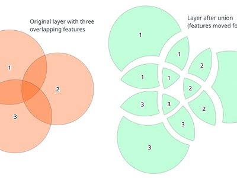
.. |image26| image:: images/entries/thumbnails/b65c47d1a41ab4a7ad545696b4985ebd7edb9f75.png.400x300_q85_crop.jpg
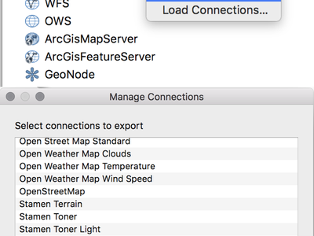
.. |image28| image:: images/entries/thumbnails/db297eb148a7d62dd58aab40dca32ee91d148831.png.400x300_q85_crop.jpg
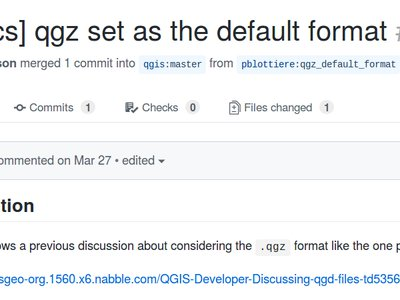
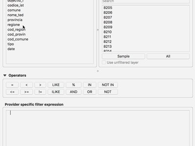
.. |image31| image:: images/entries/thumbnails/e05bfa8d423465a0ec6697fac1d21dfeee177aea.png.400x300_q85_crop.jpg
.. |image32| image:: images/entries/thumbnails/91c7bf725bc4afecc9efbeaedc8e98ad153b73b4.png.400x300_q85_crop.png
.. |image33| image:: images/entries/thumbnails/9c6074aaf1e989c460833535788d0b396a677e34.png.400x300_q85_crop.png
.. |image34| image:: images/entries/thumbnails/875e423e7a857a509812da6f46d468486fb7fd99.png.400x300_q85_crop.png
