.. _changelog320:

Changelog for QGIS 3.20
=======================

|image1|

Release date: 2021-06-18

QGIS 3.20 Odense features a splash screen which displays a section of `the earliest map <http://www5.kb.dk/maps/kortsa/2012/jul/kortatlas/object80440/en/>`__ of Denmark’s third largest city, `Odense <https://en.wikipedia.org/wiki/Odense>`__ from 1593. The map was published by `Georg Braun <https://en.wikipedia.org/wiki/Georg_Braun>`__ (1541-1622) in the work *Civitates orbis terrarum* (Cities of the World). Georg Braun’s maps are all beautiful and were, for the period, produced at a high cartographic level. *Civitates orbis terrarum* was long the main source of maps of the world’s cities, such as `Paris <http://www5.kb.dk/maps/kortsa/2012/jul/kortatlas/object62269/en/>`__, `London <http://www5.kb.dk/maps/kortsa/2012/jul/kortatlas/object62684/en/>`__, `Mexico City <http://www5.kb.dk/maps/kortsa/2012/jul/kortatlas/object62261/en/>`__ and `Aden <http://www5.kb.dk/maps/kortsa/2012/jul/kortatlas/object62257/en/>`__.

The name Odense literally means “Odin’s temple”, and the place may have originally been a shrine to the pagan god Odin. At the bottom left of the map you see the ruins of one of the large Viking-Age ring-shaped fortress, which were constructed in Denmark by the Danish Viking king `Harald Bluetooth <https://en.wikipedia.org/wiki/Harald_Bluetooth>`__ (died c. 985/86). The ring fortress in Odense is called `Nonnebakken <https://odensebysmuseer.dk/nonnebakken-the-viking-ring-fortress-in-time-and-space/?lang=en>`__.

This release introduces a host of subtle changes and stability updates, reinforcing the vast catalog of cutting-edge features introduced in recent QGIS releases. Included in this release are numerous data management improvements, with some advanced changes to the management and display of CRS systems and projection information. Amongst these improvements to CRS management are the basic support for coordinate epoch of dynamic CRS systems and advanced accuracy integrity warnings, placing QGIS 3.20 firmly at the leading edge of GIS and data management practices for high accuracy systems.

Additionally, users can expect improved metadata management and handling for certain data and metadata types. Another key highlight is the native integration of the `nominatim <https://nominatim.org/>`__ geocoding service, which will allow users to search locations and addresses using data from the OpenStreetMap project directly from the QGIS locator bar.

The QGIS Community has also seen an uptick in activity in the `QGIS HUB <https://plugins.qgis.org/>`__, as well as the Virtual QGIS Open Days, with the `Cutting Edge Open Day <https://github.com/qgis/qgis/wiki/QHF-May-2021>`__ showcasing a number of demonstrations which leverage rich QGIS functionality that was introduced in more recent releases.

We would also like to extend a big thank you to the developers, documenters, testers, and all the many folks out there who volunteer their time and effort (or fund people to do so) to make these releases possible. From the QGIS community, we hope you enjoy this release! If you wish to donate time, money, or otherwise get involved in making QGIS more awesome, please wander along to `QGIS.ORG <qgis.org>`__ and lend a hand!

QGIS is supported by donors and sustaining members. A current list of donors who have made financial contributions large and small to the project can be seen on our `donors list <https://www.qgis.org/en/site/about/sustaining_members.html#list-of-donors>`__. If you would like to become an official project sustaining member, please visit our `sustaining member page <https://www.qgis.org/en/site/getinvolved/governance/sustaining_members/sustaining_members.html#qgis-sustaining-memberships>`__ for details. Sponsoring QGIS helps us to fund our regular developer meetings, maintain project infrastructure, and fund bug fixing efforts. A complete list of current sponsors is provided below - our very great thank you to all of our sponsors!

:raw-html:`
 <!-- to be filled via javascript loading of atom feed --> 
`

QGIS is Free software and you are under no obligation to pay anything to use it - in fact, we want to encourage people far and wide to use it regardless of what your financial or social status is - we believe empowering people with spatial decision-making tools will result in a better society for all of humanity.

.. contents::
   :local:

General
-------

Feature: Additional options for opening attribute tables
~~~~~~~~~~~~~~~~~~~~~~~~~~~~~~~~~~~~~~~~~~~~~~~~~~~~~~~~

The previously available shortcuts for opening attribute tables, using filters to display only the selected items or the items visible within the canvas, have been integrated into the Menu Toolbar to facilitate their ease of use and improve the user experience, especially when working with large datasets.

|image2|

This feature was developed by `Raymond Nijssen <https://github.com/raymondnijssen>`__

Feature: Set size for all columns in attribute table
~~~~~~~~~~~~~~~~~~~~~~~~~~~~~~~~~~~~~~~~~~~~~~~~~~~~

The existing ability to "Set Width" and "Autosize" for columns has been extended to apply the resizing of a field to all columns.

This includes the ability to set a fixed width or to "Autosize" all columns. These actions are available from the attribute table header context menu which is accessible by right-clicking a field header.

|image3|

This feature was developed by `Ben Wirf <https://github.com/benwirf>`__

Feature: Export/import of authentication configurations made easy
~~~~~~~~~~~~~~~~~~~~~~~~~~~~~~~~~~~~~~~~~~~~~~~~~~~~~~~~~~~~~~~~~

Starting with QGIS 3.20, users can now easily export and import authentication configurations via a pair of actions in QGIS settings' authentication panel. Exported configurations can be password-protected to avoid sensitive information leakage.

This greatly eases sharing of various authentication configurations across multiple QGIS users, especially when it comes to more complex configuration methods such as oauth2.

This feature was funded by Ville d'Yverdon-les-Bains

This feature was developed by `Mathieu Pellerin <https://www.opengis.ch/>`__

Temporal
--------

Feature: Temporal navigation steps
~~~~~~~~~~~~~~~~~~~~~~~~~~~~~~~~~~

A temporal navigation step option for "source timestamps" has been added to the temporal controller. When selected, this causes the temporal navigation to step between all available time ranges from layers in the project. It's useful when a project contains layers with non-contiguous available times, such as a WMS-T service which provides images that are available at irregular dates. This option will allow users to only step between time ranges where the next available image is shown.

|image4|

This feature was funded by Natural resources Canada Contract: 3000720707

This feature was developed by `Nyall Dawson <https://github.com/nyalldawson>`__

Feature: Improved WMS-T settings
~~~~~~~~~~~~~~~~~~~~~~~~~~~~~~~~

WMS-T settings were simplified and controls were introduced to make it easier to select the desired time for some providers.

Changes were made in order to achieve the following outcomes:

-  Make it clearer exactly what each of the settings controls
-  Make the interplay and relationships between the various settings clearer
-  Make it obvious which settings apply, regardless of whether the layer is controlled by the temporal controller or whether the settings relate only to static WMS-T layers
-  For servers that expose a non-contiguous set of date-time instances, instead of a range of dates, a combo box is provided removing the need to manually enter valid dates

Example of settings with a server exposing a range of available dates:

|available|

Example of settings with a server exposing a list of available datetime instances only:

|datetime|

|image7|

This feature was funded by Natural resources Canada Contract: 3000720707

This feature was developed by `Nyall Dawson <https://github.com/nyalldawson>`__

Feature: Horizontal mouse wheel temporal navigation
~~~~~~~~~~~~~~~~~~~~~~~~~~~~~~~~~~~~~~~~~~~~~~~~~~~

Horizontal scrolling using the mouse wheel (where supported) with the cursor on the map canvas will allow users to navigate, or "scrub", the temporal navigation slider backwards and forwards

This feature was developed by `Nyall Dawson <https://github.com/nyalldawson>`__

Map Tools
---------

Feature: Nominatim Geocoder Integration
~~~~~~~~~~~~~~~~~~~~~~~~~~~~~~~~~~~~~~~

The Nominatim Geocoder is now natively integrated into QGIS out of the box! QGIS provides a Nominatim locator filter, as well as the "Batch Nominatim Geocoder" processing tool for batch geocoding locations.

*Nominatim locator filter*

The QGIS locator bar widget (by default, a search bar in the bottom left corner CTRL+K) now supports Nominatim geocode searches by using the prefix '>'.

Users may now search for locations using the format ``> search string`` in the locator and will be provided with a selection of results. Selecting a search result will reposition the canvas extent on that location.

*Batch Nominatim Geocoder*

In addition, a new "Batch Nominatim Geocoder" algorithm has been added to the QGIS processing toolbox under Vector tools, allowing users to geocode multiple locations at once.

Nominatim is a geocoding service that utilizes data from the OpenStreetMap project. Usage limitations and rate limits - 1 query per second - do apply in line with the OpenStreetMap Foundation (OSMF) usage policies, and the data is provided under the terms of the ODbl license. Additionally, queries to the Nominatim service may include telemetry information.

Shipping this great geocoder service by default would not have been possible without the generosity and participation of the OSMF.

|image8|

This feature was developed by `Mathieu Pellerin <https://github.com/nirvn>`__

User Interface
--------------

Feature: Processing history dialog improvements
~~~~~~~~~~~~~~~~~~~~~~~~~~~~~~~~~~~~~~~~~~~~~~~

The processing's history dialog has had a series of user interface improvements, including regrouping of algorithms in meaningful folder structures and making use of individual algorithm icons. Searching for that algorithm you ran last week has never been as easy!

|image9|

This feature was developed by `Mathieu Pellerin <https://www.opengis.ch/>`__

Feature: Map layer icons in the expression builder dialog
~~~~~~~~~~~~~~~~~~~~~~~~~~~~~~~~~~~~~~~~~~~~~~~~~~~~~~~~~

The expression builder dialog now displays map layer icons next to the list of layers under the 'Map Layers' parent group. This speeds up skipping through the list and provides additional context.

|image10|

This feature was developed by `Mathieu Pellerin <https://www.opengis.ch/>`__

Feature: SVG browser filtering
~~~~~~~~~~~~~~~~~~~~~~~~~~~~~~

The SVG browser interface now supports simple text-based filtering, allowing users to filter the available SVG images based on a given search string.

|image11|

This feature was developed by `Denis Rouzaud <https://github.com/3nids>`__

Symbology
---------

Feature: Interpolated line symbol layer type for vector layers
~~~~~~~~~~~~~~~~~~~~~~~~~~~~~~~~~~~~~~~~~~~~~~~~~~~~~~~~~~~~~~

QGIS provides a new "Interpolated Line" symbol layer type, which results in the rendering of a color and/ or width varying line.

This symbol is highly configurable and allows users to associate attributes or expressions to each line extremity or curve, amongst other configuration options. Values are interpolated along the line string between extremities. Color is configured with a color ramp shader widget.

|image12|

This feature was funded by `Lutra Consulting <https://www.lutraconsulting.co.uk/>`__

This feature was developed by `Vincent Cloarec <https://github.com/vcloarec>`__

Feature: Trim the simple line symbol
~~~~~~~~~~~~~~~~~~~~~~~~~~~~~~~~~~~~

An option to trim the start and end of simple line symbols was added, allowing for the line rendering to trim off the first and last sections of a line at a user configured distance. It is useful for creating complex symbols where a line layer should not overlap marker symbol layers placed at the start or end positions of a line feature, such as with transport routes. The trim distance supports a range of units, including a percentage of the overall line length, and can also be configured as a data-defined property.

A sample gallery of this functionality in use:

|image13|

|image14|

This feature was developed by `Nyall Dawson <https://github.com/nyalldawson>`__

Feature: New "Embedded styling" renderer with OGR feature styles support
~~~~~~~~~~~~~~~~~~~~~~~~~~~~~~~~~~~~~~~~~~~~~~~~~~~~~~~~~~~~~~~~~~~~~~~~

A new "Embedded styling" renderer has been added which exposes OGR feature styles, allowing QGIS to automatically symbolize data from certain datatypes which have integrated style information, such as KML or TAB files.

This feature implements `QEP-209 <https://github.com/qgis/QGIS-Enhancement-Proposals/issues/209>`__

Support should extend automatically to all GDAL drivers which implement the OGR feature style API.

Currently only supports line symbol conversion, but point and polygon symbol support is under development.

|image15|

This functionality also supports the direct conversion of embedded symbol renderers into categorized or rule-based renderers. This enables QGIS to automatically create categories or rules which define symbology based on the relevant feature IDs:

|image16|

|image17|

This feature was funded by QGIS Denmark user-group

This feature was developed by `Nyall Dawson <https://github.com/nyalldawson>`__

Feature: New shapes and cap styles for ellipse markers
~~~~~~~~~~~~~~~~~~~~~~~~~~~~~~~~~~~~~~~~~~~~~~~~~~~~~~

Several new shapes - semi arc and arrow signs - were added to the ellipse marker symbol layer, as well as a setting to modify the cap style for stroke-only ellipse shapes.

|image18|

This feature was developed by `Mathieu Pellerin <https://www.opengis.ch/>`__

Feature: Set cap styles for simple markers
~~~~~~~~~~~~~~~~~~~~~~~~~~~~~~~~~~~~~~~~~~

QGIS now allows for the pen cap (or line ending) style to be set for simple marker symbol layers, which is useful for the stroke-only symbols like cross and arrowhead markers, where it's beneficial to allow the use of round caps instead of square caps.

This feature was developed by `Nyall Dawson <https://github.com/nyalldawson>`__

Feature: Allow pen cap style to be set for ellipse marker symbol layers
~~~~~~~~~~~~~~~~~~~~~~~~~~~~~~~~~~~~~~~~~~~~~~~~~~~~~~~~~~~~~~~~~~~~~~~

Ellipse markers now also include support for modifying the pen cap (line ending) styles

|image19|

This feature was developed by `Mathieu Pellerin <https://github.com/nirvn>`__

Feature: Polygon rings @geometry\_ring\_num variable
~~~~~~~~~~~~~~~~~~~~~~~~~~~~~~~~~~~~~~~~~~~~~~~~~~~~

A new variable, ``@geometry_ring_num``, has been added for data-defined styling when rendering polygon rings. The variable is available whenever a polygon outline is being rendered, such as a simple line or marker line. This data-defined property will be set to 0 for the exterior ring, and increment accordingly (1, 2, 3... etc) for successive interior rings.

This feature was developed by `Nyall Dawson <https://github.com/nyalldawson>`__

Labelling
---------

Feature: Fill symbols for label background shields
~~~~~~~~~~~~~~~~~~~~~~~~~~~~~~~~~~~~~~~~~~~~~~~~~~

Label shields can now use fill symbols for the rectangle, square, circle, and ellipse shapes.

This extends beyond the previously available ability for these shields to utilize simple fill and stroke and grants the ability to leverage the complete symbology capabilities of QGIS for shield rendering, including the utilization of "saved styles".

|image20|

This feature was developed by `Mathieu Pellerin <https://github.com/nirvn>`__

Feature: Blending mode settings for label callouts
~~~~~~~~~~~~~~~~~~~~~~~~~~~~~~~~~~~~~~~~~~~~~~~~~~

Label callouts can now leverage the advanced blending modes from QGIS

|image21|

This feature was developed by `Mathieu Pellerin <https://github.com/nirvn>`__

Feature: Anchor line labels by entire line
~~~~~~~~~~~~~~~~~~~~~~~~~~~~~~~~~~~~~~~~~~

In previous versions, when an anchor position for a line label was calculated, QGIS would only consider the visible extent of the feature. This affected the expected label position in some cases, and a new "Use Entire Line" setting allows users to configure the behavior according to their needs, so that the entire feature may be considered before label placement rather than just the portion of a feature that is currently visible.

|image22|

This feature was funded by Stadt Zürich

This feature was developed by `Nyall Dawson <https://github.com/nyalldawson>`__

Feature: Balloon callout corner radius
~~~~~~~~~~~~~~~~~~~~~~~~~~~~~~~~~~~~~~

Balloon callout styles now support rounded corners by introducing a "corner radius" option, resulting in the ability to easily produce visually pleasing designs.

|image23|

This feature was developed by `Nyall Dawson <https://github.com/nyalldawson>`__

Feature: Balloon (speech bubble) callouts
~~~~~~~~~~~~~~~~~~~~~~~~~~~~~~~~~~~~~~~~~

A new "balloon", or speech bubble, callout style is provided for labels.

|image24|

This feature was funded by SLYR

This feature was developed by `Nyall Dawson <https://github.com/nyalldawson>`__

Feature: Curved line callout style
~~~~~~~~~~~~~~~~~~~~~~~~~~~~~~~~~~

A new "Curved Line" callout style has been provided for creating cartographically pleasing curved line callouts between the labels and features

Options include:

-  Selecting a specific curve orientation (clockwise or counterclockwise)
-  Automatic orientation option which determines optimal orientation for each individual label
-  Control over the amount of curvature applied to the callout lines.

|curved-callout|

|image26|

This feature was developed by `Nyall Dawson <https://github.com/nyalldawson>`__

Feature: Highlight pinned callout start or end points
~~~~~~~~~~~~~~~~~~~~~~~~~~~~~~~~~~~~~~~~~~~~~~~~~~~~~

When the "show pinned labels" option is enabled, QGIS will now also highlight any pinned callout start or end points. This allows users to immediately see which callouts points have been manually placed in relation to those that are automatically placed.

|image27|

This feature was developed by `Nyall Dawson <https://github.com/nyalldawson>`__

Feature: Auto-creation of callout auxiliary fields
~~~~~~~~~~~~~~~~~~~~~~~~~~~~~~~~~~~~~~~~~~~~~~~~~~

QGIS now automatically manages the creation of callout auxiliary fields when attempting to move a callout start or end point interactively, making the user experience for moving a callout follow the exact same behavior as that of moving a label, preventing the system from forcing users to create auxillary fields in advance.

This feature was developed by `Nyall Dawson <https://github.com/nyalldawson>`__

Feature: Callout snapping
~~~~~~~~~~~~~~~~~~~~~~~~~

When interactively moving a callout line, holding the shift button will now cause the callout to snap angles at increments of 15 degrees

This feature was developed by `Nyall Dawson <https://github.com/nyalldawson>`__

Feature: Toggle label layers shortcut
~~~~~~~~~~~~~~~~~~~~~~~~~~~~~~~~~~~~~

A shortcut action to toggle labeling has been added to the context menu of vector layers in the layer panel. This allows for labels to be quickly switched on or off, without losing the label configuration. If a layer has never had labeling configured and the action is checked, then QGIS will attempt to apply a simple labeling configuration to the layer using default parameters.

|image28|

This feature was funded by Natural resources Canada Contract: 3000720707

This feature was developed by `Nyall Dawson <https://github.com/nyalldawson>`__

Feature: Data defined callout start and end points
~~~~~~~~~~~~~~~~~~~~~~~~~~~~~~~~~~~~~~~~~~~~~~~~~~

Label callout lines can now have data-defined starting and ending points, useful for manual control of the exact placement for individual callout lines.

This feature was developed by `Nyall Dawson <https://github.com/nyalldawson>`__

Feature: Allow callouts to be interactively moved using the Move Label tool
~~~~~~~~~~~~~~~~~~~~~~~~~~~~~~~~~~~~~~~~~~~~~~~~~~~~~~~~~~~~~~~~~~~~~~~~~~~

This change allows the interactive "Move labels" tool to also move callout endpoints, whenever the callout has data-defined origin or destination fields set.

|image29|

This feature was developed by `Nyall Dawson <https://github.com/nyalldawson>`__

Point Clouds
------------

Feature: Support for remote datasets (EPT)
~~~~~~~~~~~~~~~~~~~~~~~~~~~~~~~~~~~~~~~~~~

Point cloud datasets that have been processed to `EPT format <https://entwine.io/entwine-point-tile.html>`__ can be loaded from remote HTTP(S) servers, similar to how raster/vector tiles work. This way, it is possible to access large point cloud datasets without first having to download them as LAS/LAZ files. The EPT format is optimized for tiling and streaming, so QGIS only downloads small amounts of data necessary for display of the current view and resolution. This works in both 2D and 3D view.

If you have point cloud datasets in LAS/LAZ format, these can be converted to EPT using `Entwine <https://github.com/connormanning/entwine>`__ or `Untwine <https://github.com/hobu/untwine>`__ (shipped also with QGIS).

How to use: in Data Source Manager > Point Cloud tab > select "Protocol" as the source type and enter URL of the dataset (normally ending with "ept.json").

You can test with `USGS LiDAR data <https://usgs.entwine.io/>`__ - just use the link from "EPT" column from one of the datasets. Some example endpoints include:

-  `Chicago <https://s3-us-west-2.amazonaws.com/usgs-lidar-public/USGS_LPC_IL_4County_Cook_2017_LAS_2019/ept.json>`__
-  `Mount Baker <https://s3-us-west-2.amazonaws.com/usgs-lidar-public/USGS_LPC_WA_MtBaker_2015_LAS_2017/ept.json>`__
-  `Denmark <https://na-c.entwine.io/dk/ept.json>`__
-  `Netherlands AHN2 <https://na-c.entwine.io/ahn/ept.json>`__

By the way, every point cloud dataset that QGIS loads is first processed to EPT (look for "ept\_XXX" sub-folder where your original data is located), so it is possible to just copy that "ept\_XXX" folder to a HTTP(S) server and you are ready to use this feature.

|image30|

This feature was funded by `Hobu <https://hobu.co/>`__

This feature was developed by `Belgacem Nedjima (Lutra Consulting) <https://www.lutraconsulting.co.uk/>`__

Print Layouts
-------------

Feature: "Convert to Static Text" option
~~~~~~~~~~~~~~~~~~~~~~~~~~~~~~~~~~~~~~~~

When using dynamic, or expression-based labels, users may now select the "Convert to Static Text" option which has been added to the dropdown menu next to "Insert/Edit Expression…", in the layout label properties widget.

This option will evaluate and replace any dynamic parts of a label's contents with their current values.

This provides an easy way to convert dynamic labels to static ones, so that users can manually tweak the results when needed.

This feature was developed by `Nyall Dawson <https://github.com/nyalldawson>`__

Feature: Improvement to XYZ layers previewed in map items
~~~~~~~~~~~~~~~~~~~~~~~~~~~~~~~~~~~~~~~~~~~~~~~~~~~~~~~~~

Handling of XYZ layers previewed in layout map items has been improved to ensure that their tile zoom levels match those of the exported layout while zooming in and out in the layout designer dialog. Users can now more easily refine the placement of their items (labels, legend, images, etc.) against a map preview that better matches the targeted output.

This feature was funded by Kanton Zug - Amt für Raum und Verkehr (ARV)

This feature was developed by `Mathieu Pellerin <https://www.opengis.ch/>`__

Expressions
-----------

Feature: length3D Function
~~~~~~~~~~~~~~~~~~~~~~~~~~

A "length3D" function has been added for returning the 3D length of a LineGeometry type geometry. This calculates the cartesian 3D length of a geometry line object. If the geometry is not a 3D line object, it returns its 2D length.

This feature was developed by `Nyall Dawson <https://github.com/nyalldawson>`__

Feature: Extended array expression functions
~~~~~~~~~~~~~~~~~~~~~~~~~~~~~~~~~~~~~~~~~~~~

The following array expressions were added:

-  array\_count
-  array\_prioritize
-  array\_replace

This feature was funded by Canton of Luzern

This feature was developed by `Damiano Lombardi <https://github.com/domi4484>`__

Feature: MIME Type expression function
~~~~~~~~~~~~~~~~~~~~~~~~~~~~~~~~~~~~~~

The new ``mime_type( bytes )`` expression function returns the MIME Type, or `Media type <https://en.wikipedia.org/wiki/Media_type>`__, of an input bytes object

|image31|

This feature was developed by `Alessandro Pasotti <https://github.com/elpaso>`__

Digitising
----------

Feature: Select attributes from the largest geometry when merging
~~~~~~~~~~~~~~~~~~~~~~~~~~~~~~~~~~~~~~~~~~~~~~~~~~~~~~~~~~~~~~~~~

A button to select attributes from the largest geometry has been added to the confirmation dialogue when using the merge features editing tools for polygon and line layers.

|image32|

This feature was developed by `Stefanos Natsis <https://github.com/uclaros>`__

Feature: Streaming digitizing mode
~~~~~~~~~~~~~~~~~~~~~~~~~~~~~~~~~~

When streaming digitizing mode is active, points are automatically added following the mouse cursor movement, providing a "freehand drawing" type experience.

Using the "R" key during digitizing operations will toggle streaming digitizing and normal (or circular string) digitizing.

Works with multiple map tools, including creating new line or polygon features, add ring, add part, reshape, split features, split parts, and more.

|image33|

This feature was funded by Natural resources Canada Contract: 3000720707

This feature was developed by `Nyall Dawson <https://github.com/nyalldawson>`__

Feature: New "Line Endpoints" snapping option
~~~~~~~~~~~~~~~~~~~~~~~~~~~~~~~~~~~~~~~~~~~~~

When enabled, this snapping mode snaps to the beginning or end vertex of lines only. When snapping to a polygon layer, only the first vertex in rings will be snapped to.

This feature was funded by Natural resources Canada Contract: 3000720707

This feature was developed by `Nyall Dawson <https://github.com/nyalldawson>`__

Feature: Select vertices by polygon
~~~~~~~~~~~~~~~~~~~~~~~~~~~~~~~~~~~

Users can now use the ALT button to select vertices by polygon whilst digitizing.

This should improve the user experience for selecting specific vertices using the vertex tool, reducing the need for multiple passes using The SHIFT or CTRL functions to add and remove vertices from the current selection.

This also reduces the need to creatively rotate the map canvas in order to align vertices for selection, and provides an enhanced editing process such as for selecting the vertices of a curved road along a single side only.

This function supports the following usage operations:

-  Alt+click using the vertex tool to start digitizing a polygon.
-  Each subsequent click adds a new vertex to the rubberband polygon.
-  Backspace/ delete removes last added rubberband vertex.
-  Esc cancels the polygon selection mode, as does backspace/ deleting all of the rubberband's vertices.
-  Right-click finalizes the polygon digitizing and selects all vertices within the rubberband polygon.

|image34|

This feature was developed by `Stefanos Natsis <https://github.com/uclaros>`__

Data Management
---------------

Feature: Layer tree warning icon for layers with CRS inaccuracies
~~~~~~~~~~~~~~~~~~~~~~~~~~~~~~~~~~~~~~~~~~~~~~~~~~~~~~~~~~~~~~~~~

A new "Show CRS accuracy warnings for layers in project legend" is provided which, when checked, will display a new warning icon identifying any layers with a CRS which is identified as having accuracy issues.

Examples of low-accuracy layers might include those with a dynamic CRS with no coordinate epoch available, or a CRS based on a datum ensemble with accuracy that is found to exceed the user-set limit.

This option is disabled by default, and designed for use in engineering, BIM, and other industries where inaccuracies of meter/submeter level are very dangerous.

This feature was developed by `Nyall Dawson <https://github.com/nyalldawson>`__

Feature: Basic support for dynamic CRS coordinate epoch
~~~~~~~~~~~~~~~~~~~~~~~~~~~~~~~~~~~~~~~~~~~~~~~~~~~~~~~

Basic support for the coordinate epoch of dynamic (not plate fixed) CRS has been added in line with relevant updates to `GDAL <https://github.com/OSGeo/gdal/pull/3810>`__.

QGIS has added support for respecting the source or destination coordinate epoch when transforming to or from a dynamic CRS.

If a dynamic CRS to dynamic CRS transformation at different epochs is attempted, which is not currently supported by PROJ, a user-facing warning message will be shown advising them that the results may be misleading and should not be used for high accuracy work.

This feature was developed by `Nyall Dawson <https://github.com/nyalldawson>`__

Feature: Projection information improvements
~~~~~~~~~~~~~~~~~~~~~~~~~~~~~~~~~~~~~~~~~~~~

Various improvements have been made to the handling and representation of projection information in QGIS, including:

-  The addition of an API to retrieve PROJ operation details for CRSes
-  The ability to show extended information about a layer's CRS in the layer properties info tab, including accuracy warnings
-  The addition of a ``@map_crs_projection`` variable, for retrieving a friendly name of a map's projection (e.g. "Albers Equal Area")

This feature was developed by `Nyall Dawson <https://github.com/nyalldawson>`__

Feature: Datum ensemble CRS warnings
~~~~~~~~~~~~~~~~~~~~~~~~~~~~~~~~~~~~

QGIS now shows a warning in the projection selection widget when a CRS based on a datum ensemble is selected, warning the user that there's an inherent lack of accuracy in the selected CRS.

|image35|

.. raw:: html

   

.. raw:: html

   

This feature was developed by `Nyall Dawson <https://github.com/nyalldawson>`__

Feature: Persist layer metadata in vector file exports
~~~~~~~~~~~~~~~~~~~~~~~~~~~~~~~~~~~~~~~~~~~~~~~~~~~~~~

A "persist layer metadata" checkbox has been added to the export vector file dialog. When checked, any layer metadata present in the source layer will be copied and stored in the destination file.

This functionality is enabled by default and ensures that metadata is properly transferred over to newly created items, which is especially effective when utilizing the GPKG format.

This feature was developed by `Nyall Dawson <https://github.com/nyalldawson>`__

Feature: Layer notes
~~~~~~~~~~~~~~~~~~~~

QGIS now supports "layer notes", which can be created via the "Add Layer Notes" action in the layer context menu.

These notes are saved per layer, per project. They can be used as a place to store important messages for project users, such as to-do lists, processing or management instructions, or any other arbitrary text-based metadata.

A notepad indicator icon in the layers panel identifies layers that have notes attached. Clicking the notes indicator icon will open the note for editing.

This feature was discussed in `QEP-206 <https://github.com/qgis/QGIS-Enhancement-Proposals/issues/206>`__

These notes may be copied and pasted using the traditional copy/ paste methodology for transferring styles between layers in QGIS.

Layer notes are also supported by and stored within QML (QGIS Style) and QLR (QGIS Layer Definition) files.

|image36|

.. raw:: html

   

.. raw:: html

   

This feature was funded by Alta Ehf

This feature was developed by `Nyall Dawson <https://github.com/nyalldawson>`__

Feature: Automatically load .shp.xml metadata
~~~~~~~~~~~~~~~~~~~~~~~~~~~~~~~~~~~~~~~~~~~~~

QGIS will now automatically load and convert ESRI metadata stored using a .shp.xml sidecar file. Where shapefile data is loaded and these metadata files are present they will be loaded automatically, with available layer metadata populated accordingly.

This feature was developed by `Nyall Dawson <https://github.com/nyalldawson>`__

Feature: Automatically translate layer data from ESRI Filegeodatabases to QGIS layer metadata
~~~~~~~~~~~~~~~~~~~~~~~~~~~~~~~~~~~~~~~~~~~~~~~~~~~~~~~~~~~~~~~~~~~~~~~~~~~~~~~~~~~~~~~~~~~~~

When loading data from a .gdb file, QGIS will automatically attempt to translate as much as possible of the original ESRI metadata across to the QGIS metadata, so that it's immediately available for use.

This feature was funded by North Road / SLYR

This feature was developed by `Nyall Dawson <https://github.com/nyalldawson>`__

Feature: Read field domains from datasets
~~~~~~~~~~~~~~~~~~~~~~~~~~~~~~~~~~~~~~~~~

For formats that support the embedded definition of field domains (currently GPKG and GDB), QGIS automatically converts the embedded field domain over to the equivalent QGIS editor configuration for the field.

This means that GPKG/GDB with coded field domains will automatically load into QGIS with their correct Value Map widget configuration intact, so that users see descriptions for field values instead of raw codes. Fields with a range (min/max) type domain will be translated to the range widget for the field as well.

This feature was funded by North Road

This feature was developed by `Nyall Dawson <https://github.com/nyalldawson>`__

Feature: Allow loading GPKG layers with GEOMETRY type
~~~~~~~~~~~~~~~~~~~~~~~~~~~~~~~~~~~~~~~~~~~~~~~~~~~~~

GeoPackage supports layers with a generic "geometry" type, with the QGIS release 3.20 it is now possible to load them and specify the requested geometry type on load, just like with PostGIS.

|image37|

This feature was developed by `Marco Bernasocchi (OPENGIS.ch) <https://www.opengis.ch>`__

Feature: Offline editing support for string list and number list field types
~~~~~~~~~~~~~~~~~~~~~~~~~~~~~~~~~~~~~~~~~~~~~~~~~~~~~~~~~~~~~~~~~~~~~~~~~~~~

PostGIS users rejoice: offline editing got a bit smarter and can now handle string list and number list field types.

This feature was developed by `Mathieu Pellerin <https://www.opengis.ch/>`__

Forms and Widgets
-----------------

Feature: Per-field usage of last values for newly created features
~~~~~~~~~~~~~~~~~~~~~~~~~~~~~~~~~~~~~~~~~~~~~~~~~~~~~~~~~~~~~~~~~~

Extended control has been provided for whether the last entered field values should be reused when creating new features, as this functionality may now be controlled independently for each individual attribute field for each layer.

Historically this functionality was configured using a global option that causes ALL field values for ALL layers to be remembered and reused during a QGIS session when creating new features.

This allows for finer control over form behavior, where some values may be desirable to reuse but others should be cleared or set to a default value based on an expression.

|image38|

This feature was developed by `Nyall Dawson <https://github.com/nyalldawson>`__

Feature: JSON View widget
~~~~~~~~~~~~~~~~~~~~~~~~~

New view widget to display JSON data in a user friendly way. Data can be displayed as syntax highlighted text or as a tree.

|image39|

This feature was funded by `Canton of Solothurn <https://so.ch/verwaltung/bau-und-justizdepartement/amt-fuer-geoinformation/geoportal/>`__

This feature was developed by `Damiano Lombardi <http://damiano@opengis.ch>`__

Layer Legend
------------

Feature: Vector "label" legend entries
~~~~~~~~~~~~~~~~~~~~~~~~~~~~~~~~~~~~~~

QGIS now supports adding legend entries for layer labels, which will display the font style and labeling classes for vector features.

This provides a legend entry that allows users to explicitly identify features by label style, even when no feature symbology is used.

Control of this behavior is made accessible by adding a "show label legend" option to the legend tab of the vector layer properties.

|image40|

This feature was funded by Canton of Glarus

This feature was developed by `mhugent <https://github.com/mhugent>`__

Processing
----------

Feature: Add option to save layer metadata to Package Layers algorithm
~~~~~~~~~~~~~~~~~~~~~~~~~~~~~~~~~~~~~~~~~~~~~~~~~~~~~~~~~~~~~~~~~~~~~~

This additional option enriches the Package Layers algorithm and will copy the source layer metadata into the geopackage, so that it will be used as the default metadata for the layer.

This feature was developed by `Nyall Dawson <https://github.com/nyalldawson>`__

Feature: Raster Layer Properties Algorithm
~~~~~~~~~~~~~~~~~~~~~~~~~~~~~~~~~~~~~~~~~~

This algorithm retrieves basic raster layer properties such as the size in pixels, pixel dimensions (map units per pixel), number of bands, and no data value.

It is intended for use as a means of extracting these useful properties to use as the input values to other algorithms in a model, such as passing an existing raster's pixel sizes over to a GDAL raster algorithm.

This feature was developed by `Nyall Dawson <https://github.com/nyalldawson>`__

Feature: Improved rasterize operation with 3D support
~~~~~~~~~~~~~~~~~~~~~~~~~~~~~~~~~~~~~~~~~~~~~~~~~~~~~

The rasterize (vector to raster) GDAL process now supports 3D data, in that it now includes the possibility to use the Z value (elevation) of a feature to extract burn values.

The use of this option indicates that a burn value should be extracted from the “Z” values of the feature. Works with points and lines (linear interpolation along each segment). For polygons, it only works properly if the features are flat (i.e. contain the same Z value for all vertices)

This feature was developed by `talledodiego <https://github.com/talledodiego>`__

Feature: Save selected option for Package Layers Algorithm
~~~~~~~~~~~~~~~~~~~~~~~~~~~~~~~~~~~~~~~~~~~~~~~~~~~~~~~~~~

The Package Layers Algorithm was modified to support saving only selected features

This feature was developed by `Stefan Conrads <https://github.com/stefancon>`__

Feature: Log levels for processing context
~~~~~~~~~~~~~~~~~~~~~~~~~~~~~~~~~~~~~~~~~~

A new log level property has been added to QgsProcessingContext

This allows algorithms to tune their output based on the logging level.

The qgis\_process command line operation has been granted a --verbose switch to enable verbose log output.

This feature was funded by Natural resources Canada Contract: 3000720411

This feature was developed by `Nyall Dawson <https://github.com/nyalldawson>`__

Feature: Geometry snapper rework offers major speed boost
~~~~~~~~~~~~~~~~~~~~~~~~~~~~~~~~~~~~~~~~~~~~~~~~~~~~~~~~~

This development cycle saw a rework of the inner workings of QGIS' geometry snapper algorithm, which has led to a significant speed boost. Datasets which could take over 10 minutes to process now take less than 10 seconds.

This feature was funded by `SwissTierras Colombia <https://www.swisstierrascolombia.com>`__

This feature was developed by `Mathieu Pellerin <https://www.opengis.ch/>`__

Feature: Add a last\_value function to the aggregate algorithm
~~~~~~~~~~~~~~~~~~~~~~~~~~~~~~~~~~~~~~~~~~~~~~~~~~~~~~~~~~~~~~

The aggregate processing tool now includes a ``last_value`` aggregation function, which is especially useful when working with input data that has meaningful ordering.

|image41|

This feature was developed by `Mathieu Pellerin <https://www.opengis.ch/>`__

Application and Project Options
-------------------------------

Feature: Add global option to disable monitoring of directories
~~~~~~~~~~~~~~~~~~~~~~~~~~~~~~~~~~~~~~~~~~~~~~~~~~~~~~~~~~~~~~~

Allows users to manually opt-out of monitoring directories in the browser by default, and also provides a mechanism for enterprise installs to disable this potentially unwanted behavior.

This feature was developed by `Nyall Dawson <https://github.com/nyalldawson>`__

Feature: APIs for export and import of XML authentication configurations
~~~~~~~~~~~~~~~~~~~~~~~~~~~~~~~~~~~~~~~~~~~~~~~~~~~~~~~~~~~~~~~~~~~~~~~~

QGIS now provides export and import functions to the QGIS authentication manager. This functionality has not yet been exposed through the User Interface. Complex authentication configurations with numerous, such as OAuth2, can optionally be encrypted or stored in plain text to enhance authentication management workflows.

This feature was developed by `Mathieu Pellerin <https://github.com/nirvn>`__

Browser
-------

Feature: Custom icon colors for folders in browser
~~~~~~~~~~~~~~~~~~~~~~~~~~~~~~~~~~~~~~~~~~~~~~~~~~

QGIS now allows users to set a custom icon color for different folders in the browser. This effectively allows users to "tag" folders, which aids in the rapid navigation of complex folder structures in the browser.

|image42|

.. raw:: html

   

.. raw:: html

   

This feature was developed by `Nyall Dawson <https://github.com/nyalldawson>`__

Feature: OWS Group removed from the QGIS Browser
~~~~~~~~~~~~~~~~~~~~~~~~~~~~~~~~~~~~~~~~~~~~~~~~

The non-functional and redundant "OWS" Group has been removed from the QGIS Browser panel.

This feature was developed by `Loïc Bartoletti <https://github.com/lbartoletti>`__

Data Providers
--------------

Feature: Add support for integer, real and integer64 list data types in OGR
~~~~~~~~~~~~~~~~~~~~~~~~~~~~~~~~~~~~~~~~~~~~~~~~~~~~~~~~~~~~~~~~~~~~~~~~~~~

Additional list field types have been added to the OGR driver for supported data types, such as Geojson.

This feature was developed by `Nyall Dawson <https://github.com/nyalldawson>`__

Feature: Extend vector layer read capabilities to other layer types
~~~~~~~~~~~~~~~~~~~~~~~~~~~~~~~~~~~~~~~~~~~~~~~~~~~~~~~~~~~~~~~~~~~

Whilst the ability for QGIS to access a layer's metadata information, such as reading the extent of a layer from the metadata, was previously restricted to vector layers, this functionality has now been extended to include various other layer types including raster, point cloud, and others.

This feature was funded by Ifremer

This feature was developed by `rldhont <https://github.com/rldhont>`__

QGIS Server
-----------

Feature: External layer opacity
~~~~~~~~~~~~~~~~~~~~~~~~~~~~~~~

Opacity control support for external/ remote layers served by QGIS Server

This feature was developed by `mhugent <https://github.com/mhugent>`__

Feature: Configurable Service URL
~~~~~~~~~~~~~~~~~~~~~~~~~~~~~~~~~

Additional options have been added to QGIS Server to improve the results of the GetCapabilities response, especially without the need to complete various fields within the QGIS Project configuration. These updates also enable many options to be set by an environment variable, or by providing headers from a proxy.

The following options have been added and will be resolved by the server in the following order:

-  Value defined in the project per service.
-  The ``<service>_SERVICE_URL`` environment variable.
-  The ``SERVICE_URL`` environment variable.
-  The custom ``X-Qgis-<service>-Service-Url`` header.
-  The custom ``X-Qgis-Service-Url`` header.
-  Build from the standard ``Forwarded`` header.
-  Build from the pseudo standard ``X-Forwarded-Host`` and ``X-Forwarded-Proto`` headers.
-  Build from the standard ``Host`` header and the server protocol.
-  Build from the server name and the server protocol.

This feature was developed by `Stéphane Brunner <https://github.com/sbrunner>`__

Notable Fixes
-------------

Feature: Bug fixes by Even Rouault
~~~~~~~~~~~~~~~~~~~~~~~~~~~~~~~~~~

+----------------------------------------------------------------------------------------------------------------------------+----------------------------------------------------------+--------------------------------------------------------------+--------------------------------------------------------------+
| Bug Title                                                                                                                  | URL (if reported, Github)                                | URL Commit (Github)                                          | 3.16 backport commit (GitHub)                                |
+============================================================================================================================+==========================================================+==============================================================+==============================================================+
| compiler warning in QgsMeshDatasetGroupStore::readXml()                                                                    | unreported                                               | `PR #43304 <https://github.com/qgis/QGIS/pull/43304>`__      | N/A                                                          |
+----------------------------------------------------------------------------------------------------------------------------+----------------------------------------------------------+--------------------------------------------------------------+--------------------------------------------------------------+
| QGIS Crashes with GDAL 3.3                                                                                                 | `#43224 <https://github.com/qgis/QGIS/issues/43224>`__   | `PR #43306 <https://github.com/qgis/QGIS/pull/43306>`__      | `PR #43323 <https://github.com/qgis/QGIS/pull/43323>`__      |
+----------------------------------------------------------------------------------------------------------------------------+----------------------------------------------------------+--------------------------------------------------------------+--------------------------------------------------------------+
| Data corrupted when deleting field in a (specific) geopackage layer                                                        | `#42768 <https://github.com/qgis/QGIS/issues/42768>`__   | `PR #43309 <https://github.com/qgis/QGIS/pull/43309>`__      | `PR #43322 <https://github.com/qgis/QGIS/pull/43322>`__      |
+----------------------------------------------------------------------------------------------------------------------------+----------------------------------------------------------+--------------------------------------------------------------+--------------------------------------------------------------+
| PyQGIS: WMS-T layer uri without timeDimensionExtent in it crashes QGIS                                                     | `#43158 <https://github.com/qgis/QGIS/issues/43158>`__   | `PR #43310 <https://github.com/qgis/QGIS/pull/43310>`__      | `PR #43324 <https://github.com/qgis/QGIS/pull/43324>`__      |
+----------------------------------------------------------------------------------------------------------------------------+----------------------------------------------------------+--------------------------------------------------------------+--------------------------------------------------------------+
| Data Corruption: Failed GPKG OID/FID Over-write causes value to spill into next attribute column                           | `#42274 <https://github.com/qgis/QGIS/issues/42274>`__   | `PR #43311 <https://github.com/qgis/QGIS/pull/43311>`__      | `PR #43360 <https://github.com/qgis/QGIS/pull/43360>`__      |
+----------------------------------------------------------------------------------------------------------------------------+----------------------------------------------------------+--------------------------------------------------------------+--------------------------------------------------------------+
| "Split features" causes data loss                                                                                          | `#41283 <https://github.com/qgis/QGIS/issues/41283>`__   | `PR #43328 <https://github.com/qgis/QGIS/pull/43328>`__      | `PR #43340 <https://github.com/qgis/QGIS/pull/43340>`__      |
+----------------------------------------------------------------------------------------------------------------------------+----------------------------------------------------------+--------------------------------------------------------------+--------------------------------------------------------------+
| Foreign key constraints checks are ignored on GPKG                                                                         | `#34728 <https://github.com/qgis/QGIS/issues/34728>`__   | `PR #43330 <https://github.com/qgis/QGIS/pull/43330>`__      | Not appropriate                                              |
+----------------------------------------------------------------------------------------------------------------------------+----------------------------------------------------------+--------------------------------------------------------------+--------------------------------------------------------------+
| Strange error message from SQL Query Composer in WFS client                                                                | `#42985 <https://github.com/qgis/QGIS/issues/42985>`__   | `PR #43334 <https://github.com/qgis/QGIS/pull/43334>`__      | `PR #43341 <https://github.com/qgis/QGIS/pull/43341>`__      |
+----------------------------------------------------------------------------------------------------------------------------+----------------------------------------------------------+--------------------------------------------------------------+--------------------------------------------------------------+
| WFS 1.1.0 ExceptionReport response handling : QGIS looks for 'exceptionCode' but in specifications it's 'code' attribute   | `#42196 <https://github.com/qgis/QGIS/issues/42196>`__   | `PR #43335 <https://github.com/qgis/QGIS/pull/43335>`__      | `PR #43342 <https://github.com/qgis/QGIS/pull/43342>`__      |
+----------------------------------------------------------------------------------------------------------------------------+----------------------------------------------------------+--------------------------------------------------------------+--------------------------------------------------------------+
| Export selection from a large WFS layer fails                                                                              | `#42049 <https://github.com/qgis/QGIS/issues/42049>`__   | `PR #43336 <https://github.com/qgis/QGIS/pull/43336>`__      | `PR #43343 <https://github.com/qgis/QGIS/pull/43343>`__      |
+----------------------------------------------------------------------------------------------------------------------------+----------------------------------------------------------+--------------------------------------------------------------+--------------------------------------------------------------+
| Long (?) WKT makes delimited text layer fail on 3.16 and 3.18                                                              | `#43256 <https://github.com/qgis/QGIS/issues/43256>`__   | `PR #43337 <https://github.com/qgis/QGIS/pull/43337>`__      | `PR #43339 <https://github.com/qgis/QGIS/pull/43339>`__      |
+----------------------------------------------------------------------------------------------------------------------------+----------------------------------------------------------+--------------------------------------------------------------+--------------------------------------------------------------+
| Wrong SRS when reading a Postgis layer                                                                                     | unreported                                               | `PR #43338 <https://github.com/qgis/QGIS/pull/43338>`__      | Not appropriate                                              |
+----------------------------------------------------------------------------------------------------------------------------+----------------------------------------------------------+--------------------------------------------------------------+--------------------------------------------------------------+
| Mesh data in GRIB format from ERA5                                                                                         | `#41809 <https://github.com/qgis/QGIS/issues/41809>`__   | `GDAL PR 3875 <https://github.com/OSGeo/gdal/pull/3875>`__   | `GDAL PR 3877 <https://github.com/OSGeo/gdal/pull/3877>`__   |
+----------------------------------------------------------------------------------------------------------------------------+----------------------------------------------------------+--------------------------------------------------------------+--------------------------------------------------------------+
| Two OGR provider filtered layers with same source dataset don't restore proper feature count / extent on project reload    | `#43361 <https://github.com/qgis/QGIS/issues/43361>`__   | `PR #43372 <https://github.com/qgis/QGIS/pull/43372>`__      | `PR #43394 <https://github.com/qgis/QGIS/pull/43394>`__      |
+----------------------------------------------------------------------------------------------------------------------------+----------------------------------------------------------+--------------------------------------------------------------+--------------------------------------------------------------+

This feature was funded by `QGIS.ORG (through donations and sustaining memberships) <https://www.qgis.org/>`__

This feature was developed by `Even Rouault <https://www.spatialys.com/en/home/>`__

Feature: Bug fixes by Alessandro Pasotti
~~~~~~~~~~~~~~~~~~~~~~~~~~~~~~~~~~~~~~~~

+-------------------------------------------------------------------------------------------------------------------------------------------------------------------------------------+---------------------------------------------------------------------+--------------------------------------------------------------+-----------------------------------------------------------+
| Bug Title                                                                                                                                                                           | URL (if reported, Github)                                           | URL Commit (Github)                                          | 3.16 backport commit (GitHub)                             |
+=====================================================================================================================================================================================+=====================================================================+==============================================================+===========================================================+
| Data Source Manager fails to derive exact 3D geometry type for GeometryZ PostGIS tables                                                                                             | `#43268 <https://github.com/qgis/QGIS/issues/43268>`__              | `PR #43326 <https://github.com/qgis/QGIS/pull/43326>`__      |                                                           |
+-------------------------------------------------------------------------------------------------------------------------------------------------------------------------------------+---------------------------------------------------------------------+--------------------------------------------------------------+-----------------------------------------------------------+
| Attribute table conditional formatting doesn't work when using $geometry is NULL                                                                                                    | `#43252 <https://github.com/qgis/QGIS/issues/43252>`__              | Works for me                                                 |                                                           |
+-------------------------------------------------------------------------------------------------------------------------------------------------------------------------------------+---------------------------------------------------------------------+--------------------------------------------------------------+-----------------------------------------------------------+
| QgsZonalStatistics.calculateStatistics() incomplete outputs                                                                                                                         | `#43245 <https://github.com/qgis/QGIS/issues/43245>`__              | `PR #43332 <https://github.com/qgis/QGIS/pull/43332>`__      | `PR #43378 <https://github.com/qgis/QGIS/pull/43378>`__   |
+-------------------------------------------------------------------------------------------------------------------------------------------------------------------------------------+---------------------------------------------------------------------+--------------------------------------------------------------+-----------------------------------------------------------+
| Bad Request on feed.qgis.org                                                                                                                                                        | `#43232 <https://github.com/qgis/QGIS/issues/43232>`__              | `PR #43333 <https://github.com/qgis/QGIS/pull/43333>`__      | Not relevant                                              |
+-------------------------------------------------------------------------------------------------------------------------------------------------------------------------------------+---------------------------------------------------------------------+--------------------------------------------------------------+-----------------------------------------------------------+
| Server: WFS3/API Features - overlapping columns/content on data items as HTML pages                                                                                                 | `#42269 <https://github.com/qgis/QGIS/issues/42269>`__              | `PR #43363 <https://github.com/qgis/QGIS/pull/43363>`__      | `PR #43380 <https://github.com/qgis/QGIS/pull/43380>`__   |
+-------------------------------------------------------------------------------------------------------------------------------------------------------------------------------------+---------------------------------------------------------------------+--------------------------------------------------------------+-----------------------------------------------------------+
| Datum transformation using custom gsb grid for WMS Layer in QGIS Server does not work                                                                                               | `#43072 <https://github.com/qgis/QGIS/issues/43072>`__              | `PR #43365 <https://github.com/qgis/QGIS/pull/43365>`__      | Not relevant                                              |
+-------------------------------------------------------------------------------------------------------------------------------------------------------------------------------------+---------------------------------------------------------------------+--------------------------------------------------------------+-----------------------------------------------------------+
| Server: fix unreported QGIS\_OPTIONS\_PATH not really working for proj                                                                                                              | unreported                                                          | `PR #43366 <https://github.com/qgis/QGIS/pull/43366>`__      | Not appropriate                                           |
+-------------------------------------------------------------------------------------------------------------------------------------------------------------------------------------+---------------------------------------------------------------------+--------------------------------------------------------------+-----------------------------------------------------------+
| WFS cascade getfeatureinfo fails                                                                                                                                                    | `#42062 <https://github.com/qgis/QGIS/issues/42062>`__              | Works for me                                                 |                                                           |
+-------------------------------------------------------------------------------------------------------------------------------------------------------------------------------------+---------------------------------------------------------------------+--------------------------------------------------------------+-----------------------------------------------------------+
| Server standalone: fix unreported project storage not supported with -p                                                                                                             | unreported                                                          | `PR #43381 <https://github.com/qgis/QGIS/pull/43381>`__      | `PR #43464 <https://github.com/qgis/QGIS/pull/43464>`__   |
+-------------------------------------------------------------------------------------------------------------------------------------------------------------------------------------+---------------------------------------------------------------------+--------------------------------------------------------------+-----------------------------------------------------------+
| QGIS Server GetPrint: HIGHLIGHT\_GEOM is not printed if map layers are configured to follow a map theme                                                                             | `#34178 <https://github.com/qgis/QGIS/issues/34178>`__              | `PR #43391 <https://github.com/qgis/QGIS/pull/43391>`__      | Risky                                                     |
+-------------------------------------------------------------------------------------------------------------------------------------------------------------------------------------+---------------------------------------------------------------------+--------------------------------------------------------------+-----------------------------------------------------------+
| Feature count is wrong when adding features from a table with features of mixed geometries                                                                                          | `#43199 <https://github.com/qgis/QGIS/issues/43199>`__              | Works for me                                                 |                                                           |
+-------------------------------------------------------------------------------------------------------------------------------------------------------------------------------------+---------------------------------------------------------------------+--------------------------------------------------------------+-----------------------------------------------------------+
| Not all geometry types are found in PostGIS table with Spatial Type of Geometry                                                                                                     | `#43186 <https://github.com/qgis/QGIS/issues/43186>`__              | `PR #43419 <https://github.com/qgis/QGIS/pull/43419>`__      | Risky                                                     |
+-------------------------------------------------------------------------------------------------------------------------------------------------------------------------------------+---------------------------------------------------------------------+--------------------------------------------------------------+-----------------------------------------------------------+
| Icon not updated when saving a scratch layer                                                                                                                                        | unreported                                                          | `PR #43431 <https://github.com/qgis/QGIS/pull/43431>`__      | `PR #43463 <https://github.com/qgis/QGIS/pull/43463>`__   |
+-------------------------------------------------------------------------------------------------------------------------------------------------------------------------------------+---------------------------------------------------------------------+--------------------------------------------------------------+-----------------------------------------------------------+
| Fix list of protocols in ssh custom configuration                                                                                                                                   | unreported                                                          | `PR #43432 <https://github.com/qgis/QGIS/pull/43432>`__      | Not appropriate                                           |
+-------------------------------------------------------------------------------------------------------------------------------------------------------------------------------------+---------------------------------------------------------------------+--------------------------------------------------------------+-----------------------------------------------------------+
| Crash with table set to Show Visible, joins, and left open as QGIS is quit                                                                                                          | `#43287 <https://github.com/qgis/QGIS/issues/43287>`__              | `PR #43434 <https://github.com/qgis/QGIS/pull/43434>`__      | Not appropriate                                           |
+-------------------------------------------------------------------------------------------------------------------------------------------------------------------------------------+---------------------------------------------------------------------+--------------------------------------------------------------+-----------------------------------------------------------+
| "show label" is disabled in widget designer but label keeps displaying in attribute form if you use tabs in the Drag and-Drop Designer and the field widget was placed in any tab   | `#43103 <https://github.com/qgis/QGIS/issues/43103>`__              | `PR #43435 <https://github.com/qgis/QGIS/pull/43435>`__      | TODO                                                      |
+-------------------------------------------------------------------------------------------------------------------------------------------------------------------------------------+---------------------------------------------------------------------+--------------------------------------------------------------+-----------------------------------------------------------+
| Browser adds layers to projects with a leading space                                                                                                                                | `#43129 <https://github.com/qgis/QGIS/issues/43129>`__              | `PR #43436 <https://github.com/qgis/QGIS/pull/43436>`__      | Not appropriate                                           |
+-------------------------------------------------------------------------------------------------------------------------------------------------------------------------------------+---------------------------------------------------------------------+--------------------------------------------------------------+-----------------------------------------------------------+
| saveStyleToDatabase() bug when saving more than one layer to a GPKG                                                                                                                 | `#42988 <https://github.com/qgis/QGIS/issues/42988>`__              | Works for me                                                 |                                                           |
+-------------------------------------------------------------------------------------------------------------------------------------------------------------------------------------+---------------------------------------------------------------------+--------------------------------------------------------------+-----------------------------------------------------------+
| Widget parameters not persistent for relations in D&D designer                                                                                                                      | `#43123 <https://github.com/qgis/QGIS/issues/43123>`__              | `PR #43468 <https://github.com/qgis/QGIS/pull/43468>`__      | Not appropriate                                           |
+-------------------------------------------------------------------------------------------------------------------------------------------------------------------------------------+---------------------------------------------------------------------+--------------------------------------------------------------+-----------------------------------------------------------+
| Rule-based rendering sometimes doesn't show all results                                                                                                                             | `#43181 <https://github.com/qgis/QGIS/issues/43181>`__              | `PR #43502 <https://github.com/qgis/QGIS/pull/43502>`__      | Risky                                                     |
+-------------------------------------------------------------------------------------------------------------------------------------------------------------------------------------+---------------------------------------------------------------------+--------------------------------------------------------------+-----------------------------------------------------------+
| Fix unreported missing raster band stats in info panel                                                                                                                              | unreported                                                          | `PR #43507 <https://github.com/qgis/QGIS/pull/43507>`__      |                                                           |
+-------------------------------------------------------------------------------------------------------------------------------------------------------------------------------------+---------------------------------------------------------------------+--------------------------------------------------------------+-----------------------------------------------------------+
| Raster calculator does not create/store statistics for output rasters                                                                                                               | `#42835 <https://github.com/qgis/QGIS/issues/42835>`__              | `PR #43512 <https://github.com/qgis/QGIS/pull/43512>`__      | Not a priority                                            |
+-------------------------------------------------------------------------------------------------------------------------------------------------------------------------------------+---------------------------------------------------------------------+--------------------------------------------------------------+-----------------------------------------------------------+
| Attribute Form Value Relation Doesn't Respect Column Default                                                                                                                        | `#41951 <https://github.com/qgis/QGIS/issues/41951>`__              | Works for me                                                 |                                                           |
+-------------------------------------------------------------------------------------------------------------------------------------------------------------------------------------+---------------------------------------------------------------------+--------------------------------------------------------------+-----------------------------------------------------------+
| Attribute table in form view can display "ghost" attributes                                                                                                                         | `#43477 <https://github.com/qgis/QGIS/issues/43477>`__              | `PR #43533 <https://github.com/qgis/QGIS/pull/43533>`__      | Not a priority                                            |
+-------------------------------------------------------------------------------------------------------------------------------------------------------------------------------------+---------------------------------------------------------------------+--------------------------------------------------------------+-----------------------------------------------------------+
| PG identity default clause issue                                                                                                                                                    | https://lists.osgeo.org/pipermail/qgis-user/2021-June/048983.html   | `PR #43529 <https://github.com/qgis/QGIS/pull/43529>`__      | Not appropriate                                           |
+-------------------------------------------------------------------------------------------------------------------------------------------------------------------------------------+---------------------------------------------------------------------+--------------------------------------------------------------+-----------------------------------------------------------+
| Pyqgis 3.18.3 error when adding wms layer                                                                                                                                           | `#43580 <https://github.com/qgis/QGIS/issues/43580>`__              | `PR #43581 <https://github.com/qgis/QGIS/pull/43581>`__      | TODO                                                      |
+-------------------------------------------------------------------------------------------------------------------------------------------------------------------------------------+---------------------------------------------------------------------+--------------------------------------------------------------+-----------------------------------------------------------+
| "Reuse last entered attribute values" slows creation of new features on large vector                                                                                                | `#42909 <https://github.com/qgis/QGIS/issues/42909>`__              | `PR #43584 <https://github.com/qgis/QGIS/pull/43584>`__      | TODO                                                      |
+-------------------------------------------------------------------------------------------------------------------------------------------------------------------------------------+---------------------------------------------------------------------+--------------------------------------------------------------+-----------------------------------------------------------+
| Deleting "all other values" breaks date based categorise symbology                                                                                                                  | `#43651 <https://github.com/qgis/QGIS/issues/43651>`__              | `GDAL PR 3978 <https://github.com/OSGeo/gdal/pull/3978>`__   |                                                           |
+-------------------------------------------------------------------------------------------------------------------------------------------------------------------------------------+---------------------------------------------------------------------+--------------------------------------------------------------+-----------------------------------------------------------+
| Fix documentation doctest builds                                                                                                                                                    | https://github.com/qgis/QGIS-Documentation/pull/6747                | https://github.com/qgis/QGIS-Documentation/pull/6747         | Not relevant                                              |
+-------------------------------------------------------------------------------------------------------------------------------------------------------------------------------------+---------------------------------------------------------------------+--------------------------------------------------------------+-----------------------------------------------------------+

This feature was funded by `QGIS.ORG (through donations and sustaining memberships) <https://www.qgis.org/>`__

This feature was developed by `Alessandro Pasotti <https://www.qcooperative.net/>`__

Feature: Bug fixes by Paul Blottiere
~~~~~~~~~~~~~~~~~~~~~~~~~~~~~~~~~~~~

+------------------------------------------------------------------------------------------+----------------------------------------------------------+-----------------------------------------------------------+-----------------------------------------------------------+
| Bug Title                                                                                | URL (if reported, Github)                                | URL Commit (Github)                                       | 3.16 backport commit (GitHub)                             |
+==========================================================================================+==========================================================+===========================================================+===========================================================+
| VERSION is now mandatory in WMS 1.3.0 for getmap requests                                | unreported                                               | `PR #43459 <https://github.com/qgis/QGIS/pull/43459>`__   | `PR #43467 <https://github.com/qgis/QGIS/pull/43467>`__   |
+------------------------------------------------------------------------------------------+----------------------------------------------------------+-----------------------------------------------------------+-----------------------------------------------------------+
| WMTS GetCapabilities and axis order                                                      | `#34826 <https://github.com/qgis/QGIS/issues/34826>`__   | `PR #43280 <https://github.com/qgis/QGIS/pull/43280>`__   | `PR #43772 <https://github.com/qgis/QGIS/pull/43772>`__   |
+------------------------------------------------------------------------------------------+----------------------------------------------------------+-----------------------------------------------------------+-----------------------------------------------------------+
| Use the lowest version in wms negotiation                                                | `#41051 <https://github.com/qgis/QGIS/issues/41051>`__   | `PR #41376 <https://github.com/qgis/QGIS/pull/41376>`__   | Risky                                                     |
+------------------------------------------------------------------------------------------+----------------------------------------------------------+-----------------------------------------------------------+-----------------------------------------------------------+
| QGIS crashes adding a record to a memory ("scratch") layer table in some circumstances   | `#42578 <https://github.com/qgis/QGIS/issues/42578>`__   | Works for me                                              |                                                           |
+------------------------------------------------------------------------------------------+----------------------------------------------------------+-----------------------------------------------------------+-----------------------------------------------------------+
| QGIS fails silently when an auxiliary layer cannot be created                            | unreported                                               | `PR #43543 <https://github.com/qgis/QGIS/pull/43543>`__   | `PR #43773 <https://github.com/qgis/QGIS/pull/43773>`__   |
+------------------------------------------------------------------------------------------+----------------------------------------------------------+-----------------------------------------------------------+-----------------------------------------------------------+
| Unable to save auxiliary storage                                                         | `#26365 <https://github.com/qgis/QGIS/issues/26365>`__   | `PR #43560 <https://github.com/qgis/QGIS/pull/43560>`__   | Risky                                                     |
+------------------------------------------------------------------------------------------+----------------------------------------------------------+-----------------------------------------------------------+-----------------------------------------------------------+
| WMS GetFeatureInfo on time enabled layer does not pass TIME parameter                    | `#42141 <https://github.com/qgis/QGIS/issues/42141>`__   | `PR #43599 <https://github.com/qgis/QGIS/pull/43599>`__   | `PR #43774 <https://github.com/qgis/QGIS/pull/43774>`__   |
+------------------------------------------------------------------------------------------+----------------------------------------------------------+-----------------------------------------------------------+-----------------------------------------------------------+

This feature was funded by `QGIS.ORG (through donations and sustaining memberships) <https://www.qgis.org/>`__

This feature was developed by `Paul Blottiere <https://www.qcooperative.net/>`__

Feature: Bug fixes by Denis Rouzaud
~~~~~~~~~~~~~~~~~~~~~~~~~~~~~~~~~~~

+-------------------------------------------------------------------------------------------------------------------------------+----------------------------------------------------------+-----------------------------------------------------------+---------------------------------+
| Bug Title                                                                                                                     | URL (if reported, Github)                                | URL Commit (Github)                                       | 3.16 backport commit (GitHub)   |
+===============================================================================================================================+==========================================================+===========================================================+=================================+
| Widget parameters not persistent for relations in D&D designer                                                                | `#43123 <https://github.com/qgis/QGIS/issues/43123>`__   | `PR #43479 <https://github.com/qgis/QGIS/pull/43479>`__   | not relevant                    |
+-------------------------------------------------------------------------------------------------------------------------------+----------------------------------------------------------+-----------------------------------------------------------+---------------------------------+
| Use a read-only line edit instead of combobox in relation reference doesn't allow to add a child from the parent              | `#42813 <https://github.com/qgis/QGIS/issues/42813>`__   | `PR #43509 <https://github.com/qgis/QGIS/pull/43509>`__   | too risky / not worth it        |
+-------------------------------------------------------------------------------------------------------------------------------+----------------------------------------------------------+-----------------------------------------------------------+---------------------------------+
| no open-form in all layers feature locator filter (active filter has) + show form instead of error for geometry-less layers   | unreported                                               | `PR #43462 <https://github.com/qgis/QGIS/pull/43462>`__   | ?                               |
+-------------------------------------------------------------------------------------------------------------------------------+----------------------------------------------------------+-----------------------------------------------------------+---------------------------------+
| Cannot add a polymorphic relations                                                                                            | `#41959 <https://github.com/qgis/QGIS/issues/41959>`__   | `PR #43488 <https://github.com/qgis/QGIS/pull/43488>`__   | not relevant                    |
+-------------------------------------------------------------------------------------------------------------------------------+----------------------------------------------------------+-----------------------------------------------------------+---------------------------------+
| Filter expression from relation reference widget on attributes form, not working properly                                     | `#42803 <https://github.com/qgis/QGIS/issues/42803>`__   | `PR #43523 <https://github.com/qgis/QGIS/pull/43523>`__   | yes                             |
+-------------------------------------------------------------------------------------------------------------------------------+----------------------------------------------------------+-----------------------------------------------------------+---------------------------------+
| fix Picture layout element does not handle properly a non-existing filepath when provided with an expression                  | `#42280 <https://github.com/qgis/QGIS/issues/42280>`__   | `PR #43119 <https://github.com/qgis/QGIS/pull/43119>`__   |                                 |
+-------------------------------------------------------------------------------------------------------------------------------+----------------------------------------------------------+-----------------------------------------------------------+---------------------------------+
| relations bug: zoom to child button disappears                                                                                | `#34477 <https://github.com/qgis/QGIS/issues/34477>`__   | Works for me                                              |                                 |
+-------------------------------------------------------------------------------------------------------------------------------+----------------------------------------------------------+-----------------------------------------------------------+---------------------------------+
| Value Relation and Relation reference widget: Entries are sorted although the option "Order by value" is NOT checked          | `#26468 <https://github.com/qgis/QGIS/issues/26468>`__   | not sure how to fix this for now                          |                                 |
+-------------------------------------------------------------------------------------------------------------------------------+----------------------------------------------------------+-----------------------------------------------------------+---------------------------------+
| Errors while adding a feature with a polymorphic relation                                                                     | `#41962 <https://github.com/qgis/QGIS/issues/41962>`__   | fixed                                                     |                                 |
+-------------------------------------------------------------------------------------------------------------------------------+----------------------------------------------------------+-----------------------------------------------------------+---------------------------------+

This feature was funded by `QGIS.ORG (through donations and sustaining memberships) <https://www.qgis.org/>`__

This feature was developed by `Denis Rouzaud <https://www.opengis.ch/>`__

Feature: Bug fixes by Loïc Bartoletti
~~~~~~~~~~~~~~~~~~~~~~~~~~~~~~~~~~~~~

+-----------------------------------------------------------------------------------------------+----------------------------------------------------------+-----------------------------------------------------------+-----------------------------------------------------------+
| Bug Title                                                                                     | URL (if reported, Github)                                | URL Commit (Github)                                       | 3.16 backport commit (GitHub)                             |
+===============================================================================================+==========================================================+===========================================================+===========================================================+
| QgsProjectionSelectionWidget::selectCrs() cannot be overwritten in Python                     | `#43019 <https://github.com/qgis/QGIS/issues/43019>`__   | Works for me.                                             |                                                           |
+-----------------------------------------------------------------------------------------------+----------------------------------------------------------+-----------------------------------------------------------+-----------------------------------------------------------+
| A bug? in FindPyQt5.py                                                                        | `#41913 <https://github.com/qgis/QGIS/issues/41913>`__   | `#41913 <https://github.com/qgis/QGIS/issues/41913>`__    | not relevant                                              |
+-----------------------------------------------------------------------------------------------+----------------------------------------------------------+-----------------------------------------------------------+-----------------------------------------------------------+
| Missing incon of Geometry Checker core plugin                                                 | `#42708 <https://github.com/qgis/QGIS/issues/42708>`__   | `PR #43536 <https://github.com/qgis/QGIS/pull/43536>`__   | `PR #43549 <https://github.com/qgis/QGIS/pull/43549>`__   |
+-----------------------------------------------------------------------------------------------+----------------------------------------------------------+-----------------------------------------------------------+-----------------------------------------------------------+
| Please reomve the not functional OWS group from the QGIS browser                              | `#24841 <https://github.com/qgis/QGIS/issues/24841>`__   | `PR #43559 <https://github.com/qgis/QGIS/pull/43559>`__   | Not appropriate                                           |
+-----------------------------------------------------------------------------------------------+----------------------------------------------------------+-----------------------------------------------------------+-----------------------------------------------------------+
| Build fails with external qwtpolar                                                            | `#41910 <https://github.com/qgis/QGIS/issues/41910>`__   | `PR #43551 <https://github.com/qgis/QGIS/pull/43551>`__   | `PR #43583 <https://github.com/qgis/QGIS/pull/43583>`__   |
+-----------------------------------------------------------------------------------------------+----------------------------------------------------------+-----------------------------------------------------------+-----------------------------------------------------------+
| Check geometries tool does not save default action changes                                    | `#42489 <https://github.com/qgis/QGIS/issues/42489>`__   | `PR #43550 <https://github.com/qgis/QGIS/pull/43550>`__   | `PR #43568 <https://github.com/qgis/QGIS/pull/43568>`__   |
+-----------------------------------------------------------------------------------------------+----------------------------------------------------------+-----------------------------------------------------------+-----------------------------------------------------------+
| Wrong error output location when using Check validity on data with certain type of 3D error   | `#43582 <https://github.com/qgis/QGIS/issues/43582>`__   | `PR #43588 <https://github.com/qgis/QGIS/pull/43588>`__   |                                                           |
+-----------------------------------------------------------------------------------------------+----------------------------------------------------------+-----------------------------------------------------------+-----------------------------------------------------------+

This feature was funded by `QGIS.ORG (through donations and sustaining memberships) <https://www.qgis.org/>`__

This feature was developed by `Loïc Bartoletti <https://www.oslandia.com/>`__

Feature: Bug fixes by Julien Cabieces
~~~~~~~~~~~~~~~~~~~~~~~~~~~~~~~~~~~~~

+-------------------------------------------------------------------------------------------+----------------------------------------------------------+-----------------------------------------------------------+-----------------------------------------------------------+
| Bug Title                                                                                 | URL (if reported, Github)                                | URL Commit (Github)                                       | 3.16 backport commit (GitHub)                             |
+===========================================================================================+==========================================================+===========================================================+===========================================================+
| Postgresql tables with intarray fields as primary key causes problems in python scripts   | `#42778 <https://github.com/qgis/QGIS/issues/42778>`__   | `PR #43493 <https://github.com/qgis/QGIS/pull/43493>`__   | `PR #43510 <https://github.com/qgis/QGIS/pull/43510>`__   |
+-------------------------------------------------------------------------------------------+----------------------------------------------------------+-----------------------------------------------------------+-----------------------------------------------------------+
| Cannot instantiate QgsFeatureFilterModel using PyQGIS                                     | `#42488 <https://github.com/qgis/QGIS/issues/42488>`__   | `PR #43494 <https://github.com/qgis/QGIS/pull/43494>`__   | `PR #43516 <https://github.com/qgis/QGIS/pull/43516>`__   |
+-------------------------------------------------------------------------------------------+----------------------------------------------------------+-----------------------------------------------------------+-----------------------------------------------------------+
| QGIS crashes by loading ui file                                                           | `#42379 <https://github.com/qgis/QGIS/issues/42379>`__   | Working                                                   |                                                           |
+-------------------------------------------------------------------------------------------+----------------------------------------------------------+-----------------------------------------------------------+-----------------------------------------------------------+
| QvariantList Field , nothing in attribute table when a single value is in the list        | `#33108 <https://github.com/qgis/QGIS/issues/33108>`__   | `PR #43508 <https://github.com/qgis/QGIS/pull/43508>`__   | `PR #43530 <https://github.com/qgis/QGIS/pull/43530>`__   |
+-------------------------------------------------------------------------------------------+----------------------------------------------------------+-----------------------------------------------------------+-----------------------------------------------------------+
| Copy CRS to clipboard when copying selected features                                      | `#40117 <https://github.com/qgis/QGIS/issues/40117>`__   | `PR #43527 <https://github.com/qgis/QGIS/pull/43527>`__   | `PR #43532 <https://github.com/qgis/QGIS/pull/43532>`__   |
+-------------------------------------------------------------------------------------------+----------------------------------------------------------+-----------------------------------------------------------+-----------------------------------------------------------+
| Open Running (connection) Task makes it impossible to Quit QGIS                           | `#40001 <https://github.com/qgis/QGIS/issues/40001>`__   | `PR #43587 <https://github.com/qgis/QGIS/pull/43587>`__   |                                                           |
+-------------------------------------------------------------------------------------------+----------------------------------------------------------+-----------------------------------------------------------+-----------------------------------------------------------+
| Plugin manager doesn't work with proxy                                                    | `#43284 <https://github.com/qgis/QGIS/issues/43284>`__   | Feedback                                                  |                                                           |
+-------------------------------------------------------------------------------------------+----------------------------------------------------------+-----------------------------------------------------------+-----------------------------------------------------------+
| Form fails to initialize $geometry                                                        | `#34791 <https://github.com/qgis/QGIS/issues/34791>`__   | `PR #43617 <https://github.com/qgis/QGIS/pull/43617>`__   |                                                           |
+-------------------------------------------------------------------------------------------+----------------------------------------------------------+-----------------------------------------------------------+-----------------------------------------------------------+

This feature was funded by `QGIS.ORG (through donations and sustaining memberships) <https://www.qgis.org/>`__

This feature was developed by `Julien Cabieces <https://www.oslandia.com/>`__

Feature: Bug fixes by Peter Petrik
~~~~~~~~~~~~~~~~~~~~~~~~~~~~~~~~~~

+-----------------------------------------------------------------------------+----------------------------------------------------------+-----------------------------------------------------------+---------------------------------+
| Bug Title                                                                   | URL (if reported, Github)                                | URL Commit (Github)                                       | 3.16 backport commit (GitHub)   |
+=============================================================================+==========================================================+===========================================================+=================================+
| Passwords cannot be saved into keychain on macOS with QGIS 3.16             | `#40541 <https://github.com/qgis/QGIS/issues/40541>`__   | feedback                                                  |                                 |
+-----------------------------------------------------------------------------+----------------------------------------------------------+-----------------------------------------------------------+---------------------------------+
| buggy profile results in two instances starting                             | `#29379 <https://github.com/qgis/QGIS/issues/29379>`__   | not an issue anymore                                      |                                 |
+-----------------------------------------------------------------------------+----------------------------------------------------------+-----------------------------------------------------------+---------------------------------+
| GRASS plugin init error on macOS                                            | `#41782 <https://github.com/qgis/QGIS/issues/41782>`__   | Works for me.                                             |                                 |
+-----------------------------------------------------------------------------+----------------------------------------------------------+-----------------------------------------------------------+---------------------------------+
| Data Source Manager incorrectly identifies PostGIS raster extent on macOS   | `#43042 <https://github.com/qgis/QGIS/issues/43042>`__   | investigation                                             |                                 |
+-----------------------------------------------------------------------------+----------------------------------------------------------+-----------------------------------------------------------+---------------------------------+
| Crash with point clouds when zooming into 3D viewer [Mac]                   | `#41903 <https://github.com/qgis/QGIS/issues/41903>`__   | `PR #43743 <https://github.com/qgis/QGIS/pull/43743>`__   | not relevant                    |
+-----------------------------------------------------------------------------+----------------------------------------------------------+-----------------------------------------------------------+---------------------------------+
| Crash when chcking the "Show bounding boxes" option in 3D view settings     | `#40766 <https://github.com/qgis/QGIS/issues/40766>`__   | `PR #43755 <https://github.com/qgis/QGIS/pull/43755>`__   | backport\_bot                   |
+-----------------------------------------------------------------------------+----------------------------------------------------------+-----------------------------------------------------------+---------------------------------+

This feature was funded by `QGIS.ORG (through donations and sustaining memberships) <https://www.qgis.org/>`__

This feature was developed by `Peter Petrik <https://www.lutraconsulting.co.uk/>`__

Feature: Bug fixes by Nyall Dawson
~~~~~~~~~~~~~~~~~~~~~~~~~~~~~~~~~~

+--------------------------------------------------------------------------------------------------------------------------+----------------------------------------------------------+------------------------------------------------------------------------------------------------------+-----------------------------------------------------------------------------------------------------+
| Bug Title                                                                                                                | URL (if reported, Github)                                | URL Commit (Github)                                                                                  | 3.16 backport commit (GitHub)                                                                       |
+==========================================================================================================================+==========================================================+======================================================================================================+=====================================================================================================+
| Fix browser panel scanning on remote locations can hang QGIS                                                             | many PRs                                                 |                                                                                                      |                                                                                                     |
+--------------------------------------------------------------------------------------------------------------------------+----------------------------------------------------------+------------------------------------------------------------------------------------------------------+-----------------------------------------------------------------------------------------------------+
| [3d] Fix rendering of curved lines using simple line renderer                                                            | unreported                                               | `Commit 700390a <https://github.com/qgis/QGIS/commit/700390abff6928636de010c49746a10129c215eb>`__    |                                                                                                     |
+--------------------------------------------------------------------------------------------------------------------------+----------------------------------------------------------+------------------------------------------------------------------------------------------------------+-----------------------------------------------------------------------------------------------------+
| Fix layer preview through browser panel                                                                                  | `#43303 <https://github.com/qgis/QGIS/issues/43303>`__   | `Commit 7bf85a0 <https://github.com/qgis/QGIS/commit/7bf85a0cccc105208a0a9563396ad8ca10a38810>`__    |                                                                                                     |
+--------------------------------------------------------------------------------------------------------------------------+----------------------------------------------------------+------------------------------------------------------------------------------------------------------+-----------------------------------------------------------------------------------------------------+
| [expressions] Fix evaluation of round(...) where input value is a string containing a decimal number                     | `#36467 <https://github.com/qgis/QGIS/issues/36467>`__   | `Commit 42c2061 <https://github.com/qgis/QGIS/commit/42c2061c5418bbcfa2fde8aac35486ac7fcb26b1>`__    |                                                                                                     |
+--------------------------------------------------------------------------------------------------------------------------+----------------------------------------------------------+------------------------------------------------------------------------------------------------------+-----------------------------------------------------------------------------------------------------+
| Fix label masking settings get dropped for layers with "," or ";" characters in the text                                 | `#37473 <https://github.com/qgis/QGIS/issues/37473>`__   | `Commit 3d4e2f4 <https://github.com/qgis/QGIS/commit/3d4e2f460f5ca04a469a2549c69b96dea889b174>`__    |                                                                                                     |
+--------------------------------------------------------------------------------------------------------------------------+----------------------------------------------------------+------------------------------------------------------------------------------------------------------+-----------------------------------------------------------------------------------------------------+
| Fix orphaned symbol masking can force maps to be rasterized                                                              | unreported                                               | `Commit ffc500d <https://github.com/qgis/QGIS/commit/ffc500d79de02d9f83d36a8fa40b4436079be04d>`__    |                                                                                                     |
+--------------------------------------------------------------------------------------------------------------------------+----------------------------------------------------------+------------------------------------------------------------------------------------------------------+-----------------------------------------------------------------------------------------------------+
| Fix selection of features which use variables in filter rules                                                            | `#42006 <https://github.com/qgis/QGIS/issues/42006>`__   | `Commit d41c234 <https://github.com/qgis/QGIS/commit/d41c2342676098e9c9991305711b9eea748bb858>`__    | `PR #43235 <https://github.com/qgis/QGIS/pull/43235>`__                                             |
+--------------------------------------------------------------------------------------------------------------------------+----------------------------------------------------------+------------------------------------------------------------------------------------------------------+-----------------------------------------------------------------------------------------------------+
| [labeling] Default to "from symbol bounds" for cartographic point label placement                                        | `#25866 <https://github.com/qgis/QGIS/issues/25866>`__   | `Commit 4ad5d36 <https://github.com/qgis/QGIS/commit/4ad5d36d93df8eaf0105aed2c9918197f5bf67ef>`__    |                                                                                                     |
+--------------------------------------------------------------------------------------------------------------------------+----------------------------------------------------------+------------------------------------------------------------------------------------------------------+-----------------------------------------------------------------------------------------------------+
| Fix PyQGIS QgsLineString constructor only accepts lists of QgsPoint, not QgsPointXY as indicated by the documentation    | `#43200 <https://github.com/qgis/QGIS/issues/43200>`__   | `Commit 2b6c3c1 <https://github.com/qgis/QGIS/commit/2b6c3c1db2cc3c8214a6c019c2c044b8bae712f2>`__    |                                                                                                     |
+--------------------------------------------------------------------------------------------------------------------------+----------------------------------------------------------+------------------------------------------------------------------------------------------------------+-----------------------------------------------------------------------------------------------------+
| Fix crash when changing symbol levels through style dock                                                                 | `#42671 <https://github.com/qgis/QGIS/issues/42671>`__   | `Commit f3f4c17 <https://github.com/qgis/QGIS/commit/f3f4c17c5fa1d71670d505a2938da2345c683909>`__    | `PR #43235 <https://github.com/qgis/QGIS/pull/43235>`__                                             |
+--------------------------------------------------------------------------------------------------------------------------+----------------------------------------------------------+------------------------------------------------------------------------------------------------------+-----------------------------------------------------------------------------------------------------+
| Allow clearing data defined buttons which are set to non-existing fields                                                 | unreported                                               | `Commit ee03ad5 <https://github.com/qgis/QGIS/commit/ee03ad5991094ec975118c986075d0e830dec469>`__    |                                                                                                     |
+--------------------------------------------------------------------------------------------------------------------------+----------------------------------------------------------+------------------------------------------------------------------------------------------------------+-----------------------------------------------------------------------------------------------------+
| [processing] Python entry in history dialog should be processing.run line, not processing.execAlgorithmDialog            | unreported                                               | `Commit 61ac64c <https://github.com/qgis/QGIS/commit/61ac64c5a146adc72d38eaf5ab3fe35a6f51be20>`__    |                                                                                                     |
+--------------------------------------------------------------------------------------------------------------------------+----------------------------------------------------------+------------------------------------------------------------------------------------------------------+-----------------------------------------------------------------------------------------------------+
| Don't try to render font marker symbols in massive font sizes, avoid crash                                               | `#42270 <https://github.com/qgis/QGIS/issues/42270>`__   | `Commit 12d1078 <https://github.com/qgis/QGIS/commit/12d1078a8bc11caef7002629e6315cf50522e732>`__    | `PR #43235 <https://github.com/qgis/QGIS/pull/43235>`__                                             |
+--------------------------------------------------------------------------------------------------------------------------+----------------------------------------------------------+------------------------------------------------------------------------------------------------------+-----------------------------------------------------------------------------------------------------+
| Fix Qgis::MessageLevel::None is not available in PyQGIS                                                                  | `#42996 <https://github.com/qgis/QGIS/issues/42996>`__   | `Commit 02266ef <https://github.com/qgis/QGIS/commit/02266ef8e66ef6613d27e7818e0e7adf0d5a3271>`__    |                                                                                                     |
+--------------------------------------------------------------------------------------------------------------------------+----------------------------------------------------------+------------------------------------------------------------------------------------------------------+-----------------------------------------------------------------------------------------------------+
| Fix marker symbol bounds incorrectly include bounds of disabled symbol layers                                            | unreported                                               | `Commit ca54e8f <https://github.com/qgis/QGIS/commit/ca54e8f8520453954e06e4d91adbd375287ddadd>`__    | `PR #43235 <https://github.com/qgis/QGIS/pull/43235>`__                                             |
+--------------------------------------------------------------------------------------------------------------------------+----------------------------------------------------------+------------------------------------------------------------------------------------------------------+-----------------------------------------------------------------------------------------------------+
| Fix hang in rendering joined layers                                                                                      | `#38551 <https://github.com/qgis/QGIS/issues/38551>`__   | `Commit ca00377 <https://github.com/qgis/QGIS/commit/ca00377027dc7ae6066d8ca5fc3da35ad46dd7c2>`__    | `Commit cdbf722 <https://github.com/qgis/QGIS/commit/cdbf7224f716a7272e89239895ae254d2ee31bcd>`__   |
+--------------------------------------------------------------------------------------------------------------------------+----------------------------------------------------------+------------------------------------------------------------------------------------------------------+-----------------------------------------------------------------------------------------------------+
| [temporal] Fix broken animations when a non-integer interval value is used (e.g. 1.5 hours)                              | unreported                                               | `Commit 81ec79c <https://github.com/qgis/QGIS/commit/81ec79c0e5d31f0e56413fdb01af320fbc00c564>`__    |                                                                                                     |
+--------------------------------------------------------------------------------------------------------------------------+----------------------------------------------------------+------------------------------------------------------------------------------------------------------+-----------------------------------------------------------------------------------------------------+
| Fix allowing attribute selection for DXF layer name                                                                      | `#42575 <https://github.com/qgis/QGIS/issues/42575>`__   | `Commit 66c6ef9 <https://github.com/qgis/QGIS/commit/66c6ef96bcd4bcce4fa06cfc4ea62c87ac2898c9>`__    |                                                                                                     |
+--------------------------------------------------------------------------------------------------------------------------+----------------------------------------------------------+------------------------------------------------------------------------------------------------------+-----------------------------------------------------------------------------------------------------+
| Fix papercut in rule based labeling widget where it's possible to uncheck BOTH the filter and else radio buttons         | unreported                                               | `Commit 1fcb9752 <https://github.com/qgis/QGIS/commit/1fcb97522c34d319c18bab13e4ccc64d6161bbef>`__   | `PR #43235 <https://github.com/qgis/QGIS/pull/43235>`__                                             |
+--------------------------------------------------------------------------------------------------------------------------+----------------------------------------------------------+------------------------------------------------------------------------------------------------------+-----------------------------------------------------------------------------------------------------+
| Fix it's impossible to change a rule based labeling "else" rule back to a normal rule                                    | unreported                                               | `Commit de92ca0 <https://github.com/qgis/QGIS/commit/de92ca034714452e8de139584518277092ea6c3c>`__    | `PR #43235 <https://github.com/qgis/QGIS/pull/43235>`__                                             |
+--------------------------------------------------------------------------------------------------------------------------+----------------------------------------------------------+------------------------------------------------------------------------------------------------------+-----------------------------------------------------------------------------------------------------+
| Fix data defined properties which bind to a field can have incorrect values when the linked field has a null value       | unreported                                               | `Commit 4e25c6b <https://github.com/qgis/QGIS/commit/4e25c6bcf413c8d93a09839696dbc93ae0e55f64>`__    | `Commit 2a3bcc3 <https://github.com/qgis/QGIS/commit/2a3bcc365d901c3d69270fd9c4a9a2165c2cbd31>`__   |
+--------------------------------------------------------------------------------------------------------------------------+----------------------------------------------------------+------------------------------------------------------------------------------------------------------+-----------------------------------------------------------------------------------------------------+
| Fix broken coordinate transform when exporting features to DXF                                                           | `#43449 <https://github.com/qgis/QGIS/issues/43449>`__   | `Commit 65c02e0 <https://github.com/qgis/QGIS/commit/65c02e024a767ccc57283ec29a9c1b6d6ef8003f>`__    | `Commit 044f6a1 <https://github.com/qgis/QGIS/commit/044f6a1ec2d96314805ee9ab9be73d8d25e38597>`__   |
+--------------------------------------------------------------------------------------------------------------------------+----------------------------------------------------------+------------------------------------------------------------------------------------------------------+-----------------------------------------------------------------------------------------------------+
| [processing] Don't show model child algorithm outputs as choices for multi-layer input parameters when running a model   | `#41210 <https://github.com/qgis/QGIS/issues/41210>`__   | `Commit f4477b2 <https://github.com/qgis/QGIS/commit/f4477b2cc4f29553ceb8c3d2d82139bc955ffd0c>`__    |                                                                                                     |
+--------------------------------------------------------------------------------------------------------------------------+----------------------------------------------------------+------------------------------------------------------------------------------------------------------+-----------------------------------------------------------------------------------------------------+
| Expand on QgsPoint/QgsPointXY documentation to clarify when each class should be used                                    | `#43598 <https://github.com/qgis/QGIS/issues/43598>`__   | `Commit ae83444 <https://github.com/qgis/QGIS/commit/ae83444c9f0c5ce8056ac7b282d6fb1dedc43ad4>`__    |                                                                                                     |
+--------------------------------------------------------------------------------------------------------------------------+----------------------------------------------------------+------------------------------------------------------------------------------------------------------+-----------------------------------------------------------------------------------------------------+
| Fix crash when canceling union tool                                                                                      | `#43553 <https://github.com/qgis/QGIS/issues/43553>`__   | `Commit b1f50bb <https://github.com/qgis/QGIS/commit/b1f50bbc2cefe593918b73af7d2b92ffac9b764d>`__    | `Commit 1f25ba5 <https://github.com/qgis/QGIS/commit/1f25ba5dbc58bc2f2efd1d930a6104110abe1569>`__   |
+--------------------------------------------------------------------------------------------------------------------------+----------------------------------------------------------+------------------------------------------------------------------------------------------------------+-----------------------------------------------------------------------------------------------------+
| Fix "force layer to render as raster" setting wasn't correctly copied                                                    | `#43535 <https://github.com/qgis/QGIS/issues/43535>`__   | `Commit 1313786 <https://github.com/qgis/QGIS/commit/131378650ff47f35588eed04162a7e2f2c728abf>`__    | `Commit dcd016b <https://github.com/qgis/QGIS/commit/dcd016bace01506aa283aa7e6760ebe13bfa0d73>`__   |
+--------------------------------------------------------------------------------------------------------------------------+----------------------------------------------------------+------------------------------------------------------------------------------------------------------+-----------------------------------------------------------------------------------------------------+
| Fix massive performance regression in attribute table                                                                    | unreported                                               | `Commit 5fdb88b <https://github.com/qgis/QGIS/commit/5fdb88bae3e40316a489d71594f17548f7a55f00>`__    | `Commit 4970c3a <https://github.com/qgis/QGIS/commit/4970c3a9dbc66d1b2d155e3cdd07df200ee1c14a>`__   |
+--------------------------------------------------------------------------------------------------------------------------+----------------------------------------------------------+------------------------------------------------------------------------------------------------------+-----------------------------------------------------------------------------------------------------+
| Fix performance issue when using attribute table with "edited or new features" filter in place                           | unreported                                               | `Commit af021f1 <https://github.com/qgis/QGIS/commit/af021f10fb73d4850a0486527775e7fdc101ef47>`__    |                                                                                                     |
+--------------------------------------------------------------------------------------------------------------------------+----------------------------------------------------------+------------------------------------------------------------------------------------------------------+-----------------------------------------------------------------------------------------------------+
| Fix invalid error message when creating expression for layout text item                                                  | `#42884 <https://github.com/qgis/QGIS/issues/42884>`__   | `Commit db74013 <https://github.com/qgis/QGIS/commit/db74013c7fc5966436fc41b3d912e93367bbec23>`__    |                                                                                                     |
+--------------------------------------------------------------------------------------------------------------------------+----------------------------------------------------------+------------------------------------------------------------------------------------------------------+-----------------------------------------------------------------------------------------------------+
| Clarify labels in temporal controller                                                                                    | unreported                                               | `Commit ed346d8 <https://github.com/qgis/QGIS/commit/ed346d88fd3ebdf16839fa5b750dc92731cecfb6>`__    |                                                                                                     |
+--------------------------------------------------------------------------------------------------------------------------+----------------------------------------------------------+------------------------------------------------------------------------------------------------------+-----------------------------------------------------------------------------------------------------+
| Correctly redraw canvas when applying project properties changes                                                         | unreported                                               | `Commit 41f9842 <https://github.com/qgis/QGIS/commit/41f98420e028c251cd0619242b5c1e8d01f5d41e>`__    | `Commit 607b44b <https://github.com/qgis/QGIS/commit/607b44b1e0175a97c103eb7c04f2450c1ff924d3>`__   |
+--------------------------------------------------------------------------------------------------------------------------+----------------------------------------------------------+------------------------------------------------------------------------------------------------------+-----------------------------------------------------------------------------------------------------+
| Make interactive labeling tools correctly work with data defined properties which aren't bound to fields                 | unreported                                               | `Commit c6bd366 <https://github.com/qgis/QGIS/commit/c6bd366112f92e836dd071dd395f8b3dbf982d50>`__    |                                                                                                     |
+--------------------------------------------------------------------------------------------------------------------------+----------------------------------------------------------+------------------------------------------------------------------------------------------------------+-----------------------------------------------------------------------------------------------------+
| Fix crash in labeling if label has data defined x/y set and projection error occurs transforming these coordinates       | unreported                                               | `Commit 8943ac7 <https://github.com/qgis/QGIS/commit/8943ac76d598f96c59d59a2ed530a972f07f89a1>`__    | `Commit 2fe68cc <https://github.com/qgis/QGIS/commit/2fe68cc2f9c776f12fb94886d9c5d660a7d2a99f>`__   |
+--------------------------------------------------------------------------------------------------------------------------+----------------------------------------------------------+------------------------------------------------------------------------------------------------------+-----------------------------------------------------------------------------------------------------+
| [temporal] Fix filter generation for vector temporal layers                                                              | `#38468 <https://github.com/qgis/QGIS/issues/38468>`__   | `Commit 544708f <https://github.com/qgis/QGIS/commit/544708f4aade5c4451463e045fd23c168552ab40>`__    |                                                                                                     |
+--------------------------------------------------------------------------------------------------------------------------+----------------------------------------------------------+------------------------------------------------------------------------------------------------------+-----------------------------------------------------------------------------------------------------+
| Fix formatting of exception blocks in PyQGIS docs                                                                        | unreported                                               | `Commit 8359281 <https://github.com/qgis/QGIS/commit/835928101213484c23f46e5c91b8329102478534>`__    | `PR #43235 <https://github.com/qgis/QGIS/pull/43235>`__                                             |
+--------------------------------------------------------------------------------------------------------------------------+----------------------------------------------------------+------------------------------------------------------------------------------------------------------+-----------------------------------------------------------------------------------------------------+
| Fix zonal statistics does not correctly handle coordinate transforms                                                     | `#26858 <https://github.com/qgis/QGIS/issues/26858>`__   | `Commit e70cf8d <https://github.com/qgis/QGIS/commit/e70cf8da2747c13e02866bc940ce4dbb3af41815>`__    | `Commit c82678d <https://github.com/qgis/QGIS/commit/c82678dd6136de79cd76206c9ca25b1f9e34abd2>`__   |
+--------------------------------------------------------------------------------------------------------------------------+----------------------------------------------------------+------------------------------------------------------------------------------------------------------+-----------------------------------------------------------------------------------------------------+
| Don't assume that owslib >= 0.20 is available                                                                            | `#38074 <https://github.com/qgis/QGIS/issues/38074>`__   | `Commit 3cf9083 <https://github.com/qgis/QGIS/commit/3cf9083743de2a72893d2efeddcfb29f3ea7130f>`__    | `Commit eb1a55a <https://github.com/qgis/QGIS/commit/eb1a55a146d1dddb7ddf52da9c961e4c5a8cce96>`__   |
+--------------------------------------------------------------------------------------------------------------------------+----------------------------------------------------------+------------------------------------------------------------------------------------------------------+-----------------------------------------------------------------------------------------------------+
| Fix crash in geometry checker when empty geometries are found                                                            | `#38983 <https://github.com/qgis/QGIS/issues/38983>`__   | `Commit 73a4948 <https://github.com/qgis/QGIS/commit/73a49489c857ec492f62bb8ef0ec2494d93d368a>`__    | `Commit 6938593 <https://github.com/qgis/QGIS/commit/69385937d842cfa88ff65663591049ca210403b8>`__   |
+--------------------------------------------------------------------------------------------------------------------------+----------------------------------------------------------+------------------------------------------------------------------------------------------------------+-----------------------------------------------------------------------------------------------------+
| [temporal] Fix incorrect frame duration in last frame in animation mode                                                  | `#40777 <https://github.com/qgis/QGIS/issues/40777>`__   | `Commit f76747b <https://github.com/qgis/QGIS/commit/f76747b8b1ffd93844767ad9b66e3601b96a98a2>`__    |                                                                                                     |
+--------------------------------------------------------------------------------------------------------------------------+----------------------------------------------------------+------------------------------------------------------------------------------------------------------+-----------------------------------------------------------------------------------------------------+
| Default to a time range of the last 24 hours, in 1 hour increments, instead of a confusing "zero length" range           | `#40868 <https://github.com/qgis/QGIS/issues/40868>`__   | `Commit 5f5a3a7 <https://github.com/qgis/QGIS/commit/5f5a3a7e46fac5a4939d90f2eaf57a8b61008789>`__    |                                                                                                     |
+--------------------------------------------------------------------------------------------------------------------------+----------------------------------------------------------+------------------------------------------------------------------------------------------------------+-----------------------------------------------------------------------------------------------------+
| Fix temporal fields reset if previously set to no value                                                                  | `#43643 <https://github.com/qgis/QGIS/issues/43643>`__   | `Commit 9de5d25 <https://github.com/qgis/QGIS/commit/9de5d2500bd358c1214b17434424d1c301444b03>`__    | `PR #43235 <https://github.com/qgis/QGIS/pull/43235>`__                                             |
+--------------------------------------------------------------------------------------------------------------------------+----------------------------------------------------------+------------------------------------------------------------------------------------------------------+-----------------------------------------------------------------------------------------------------+
| [processing] Fix broken execution of models via browser/drag and drop                                                    | `#43698 <https://github.com/qgis/QGIS/issues/43698>`__   | `Commit cbe2678 <https://github.com/qgis/QGIS/commit/cbe2678e34767f01dd3d2578261c4e55e40a00ba>`__    | `Commit 9e0cdcb <https://github.com/qgis/QGIS/commit/9e0cdcba48de04a3fb3a6aa81276e68a0447a6fd>`__   |
+--------------------------------------------------------------------------------------------------------------------------+----------------------------------------------------------+------------------------------------------------------------------------------------------------------+-----------------------------------------------------------------------------------------------------+
| Fix QgsDistanceArea.bearing()                                                                                            | unreported                                               | `Commit 0b499d3 <https://github.com/qgis/QGIS/commit/0b499d3a0058dbb234ce54f6329015818a9ccde7>`__    |                                                                                                     |
+--------------------------------------------------------------------------------------------------------------------------+----------------------------------------------------------+------------------------------------------------------------------------------------------------------+-----------------------------------------------------------------------------------------------------+
| Don't restrict adding crs selections to list of recent CRSes to only a few select dialogs                                | unreported                                               | `Commit 870945c <https://github.com/qgis/QGIS/commit/870945c476c1a429eb410af2a793644a7b1db85f>`__    |                                                                                                     |
+--------------------------------------------------------------------------------------------------------------------------+----------------------------------------------------------+------------------------------------------------------------------------------------------------------+-----------------------------------------------------------------------------------------------------+
| [processing] Fix use of data defined parameter values when editing features in place                                     | `#43758 <https://github.com/qgis/QGIS/issues/43758>`__   | `Commit 3ae9625 <https://github.com/qgis/QGIS/commit/3ae96253de7efc5e8921e776ae91de4b9281d90c>`__    |                                                                                                     |
+--------------------------------------------------------------------------------------------------------------------------+----------------------------------------------------------+------------------------------------------------------------------------------------------------------+-----------------------------------------------------------------------------------------------------+
| [layouts] Fix bounding rectangle for shapes doesn't include stroke width after loading from xml                          | `#43748 <https://github.com/qgis/QGIS/issues/43748>`__   | `Commit fad1800 <https://github.com/qgis/QGIS/commit/fad18003b3560e6daa1c47080f5b2fe10ddef9e6>`__    |                                                                                                     |
+--------------------------------------------------------------------------------------------------------------------------+----------------------------------------------------------+------------------------------------------------------------------------------------------------------+-----------------------------------------------------------------------------------------------------+

This feature was funded by `QGIS.ORG (through donations and sustaining memberships) <https://www.qgis.org/>`__

This feature was developed by `Nyall Dawson <https://north-road.com/>`__

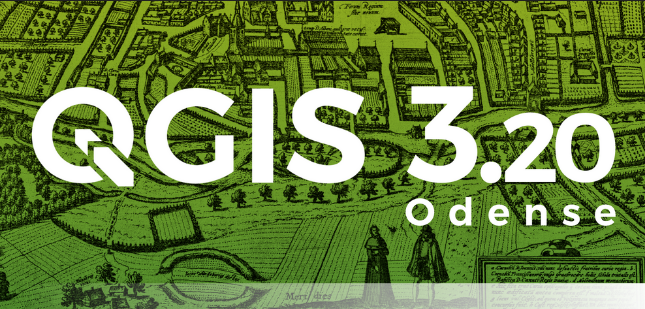
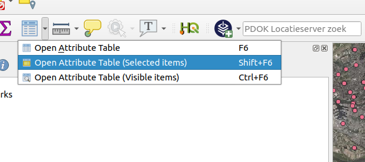
.. |image3| image:: images/entries/424dea8c61279f20c7f3ca5bf3cd13c21f999987.png
   :class: img-responsive img-rounded
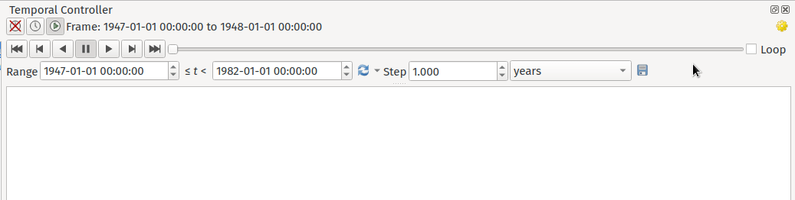
.. |available| image:: images/entries/5959d2a149797fdbd8108653dad86b4ba93d54a1.gif
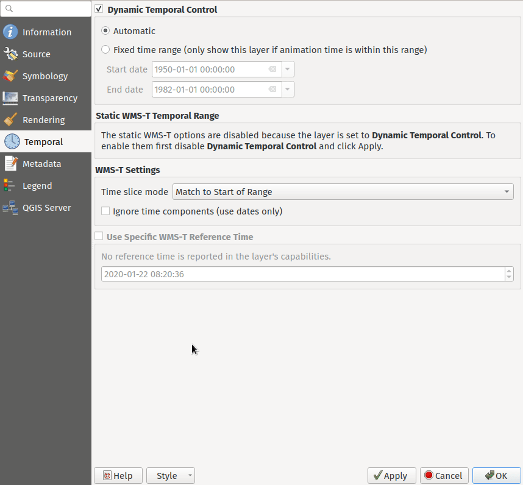
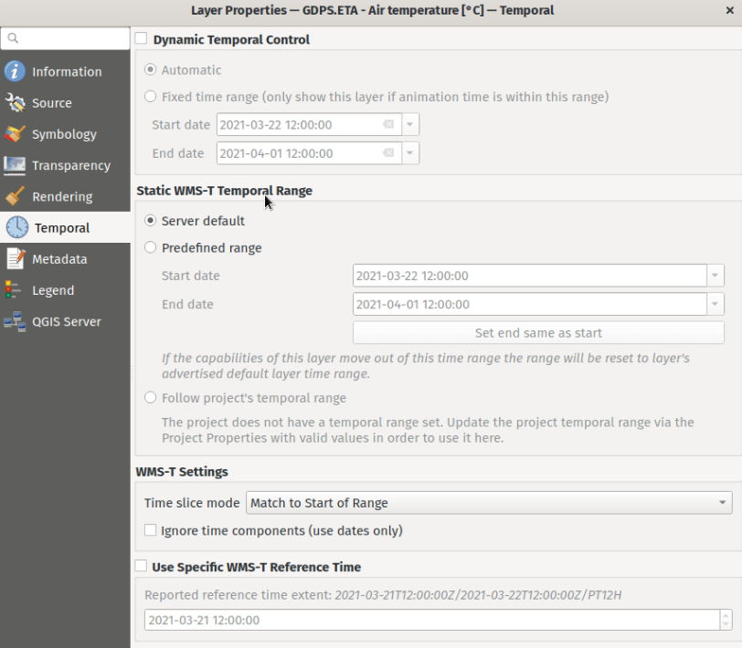
.. |image8| image:: images/entries/bd1b0900b9e2b2756dbc9c9aa90f8b8f34ef166e.gif
   :class: img-responsive img-rounded
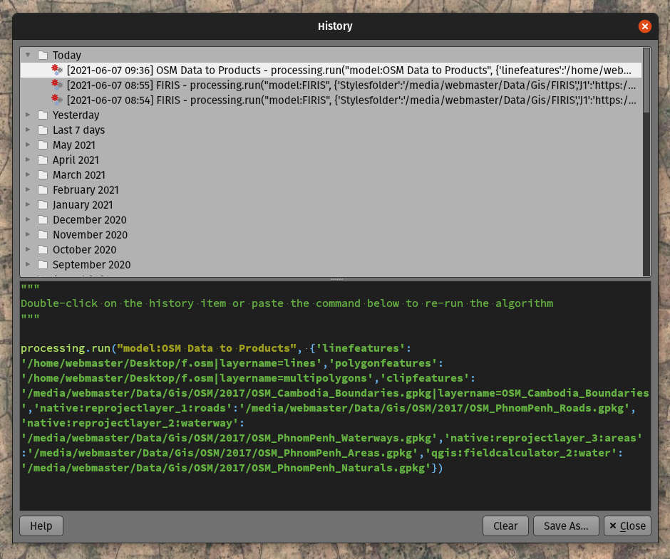
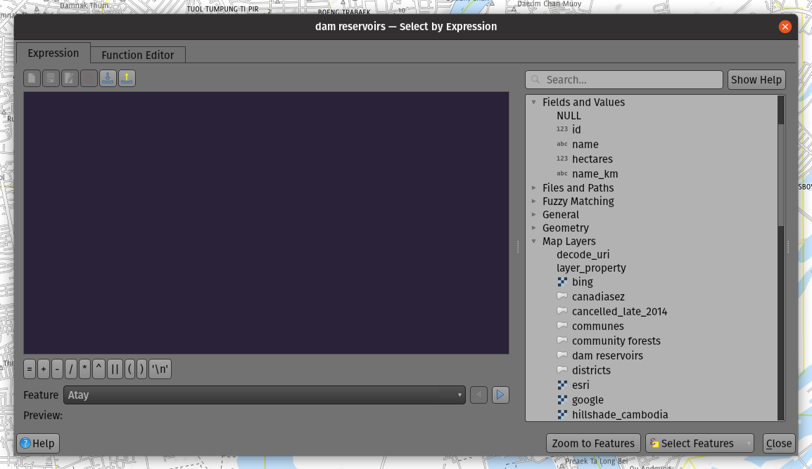
.. |image11| image:: images/entries/3e4dfa0a3e25db1821ae914eeec5c34d7c125ebf.gif
   :class: img-responsive img-rounded
.. |image12| image:: images/entries/ebfd1d989cdb0d61ab56ab5a629a82a716446666.gif
   :class: img-responsive img-rounded
.. |image13| image:: images/entries/f0cad8bbc2de6c44b22c4875c45ed6e24e9f4bf6.png
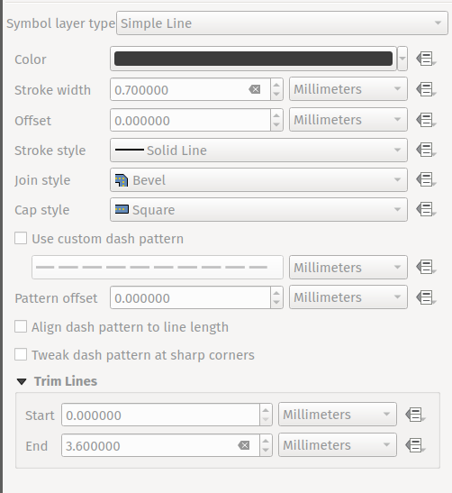
.. |image15| image:: images/entries/44767fa890705c09d9c4b21b998807c7999ddde4.gif
.. |image16| image:: images/entries/3a408fbcff1ee8d5889c3fe30c0d9d831b050698.gif
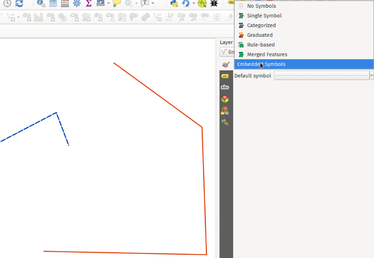
.. |image18| image:: images/entries/3b34a6b8ceb5cad5a423a10562511457c0c21396.png
   :class: img-responsive img-rounded
.. |image19| image:: images/entries/5d01d2759751cf797586797a74beea3c9561677d.png
   :class: img-responsive img-rounded
.. |image20| image:: images/entries/5698488e5fae8bdd876dfe754b56bfad0c3fd950.png
   :class: img-responsive img-rounded
.. |image21| image:: images/entries/4dd84f1e0b5ec295da997ffd84fb15b2cae25b13.png
   :class: img-responsive img-rounded
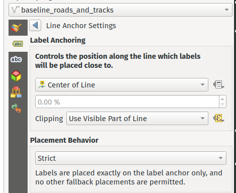
.. |image23| image:: images/entries/9c3d5b37de37e8db7168e68229a6bb3cd02138e6.png
   :class: img-responsive img-rounded
.. |image24| image:: images/entries/7dcb80eacfb6e10dc6b6b05a160421a93ee78d14.png
   :class: img-responsive img-rounded
.. |curved-callout| image:: images/entries/fd1a05c782e4e2e487a5ed876dc6c396269b0acf.gif
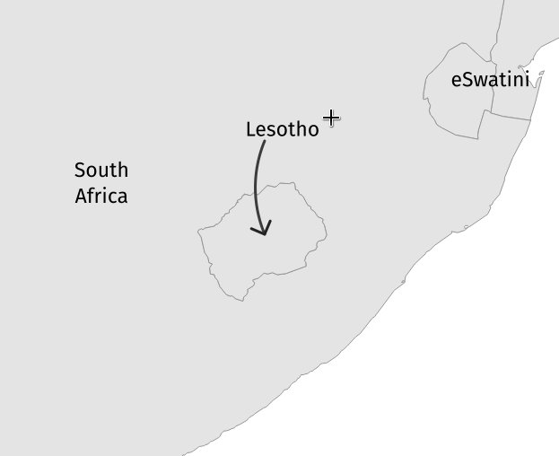
.. |image27| image:: images/entries/e1de38ee6adde2a016b8d4550111ff766211f0f7.png
   :class: img-responsive img-rounded
.. |image28| image:: images/entries/023bb952056e1d7f41e7a06590000f17b76d6d45.gif
   :class: img-responsive img-rounded
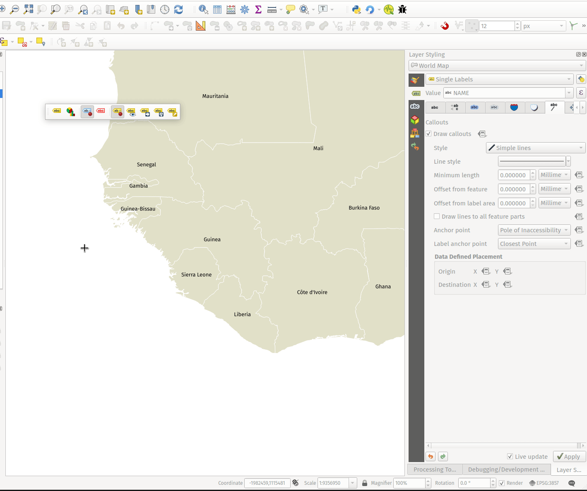
.. |image30| image:: images/entries/50ed450146655afb5c6ae68f0ead344cfc9eea73.png
   :class: img-responsive img-rounded
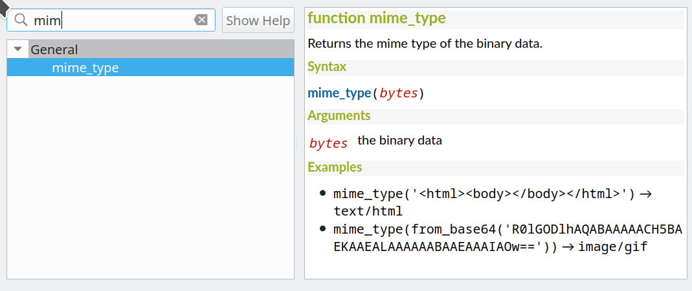
.. |image32| image:: images/entries/e27a6a42f878cdfec87021d53241457aa1d8845f.png
   :class: img-responsive img-rounded
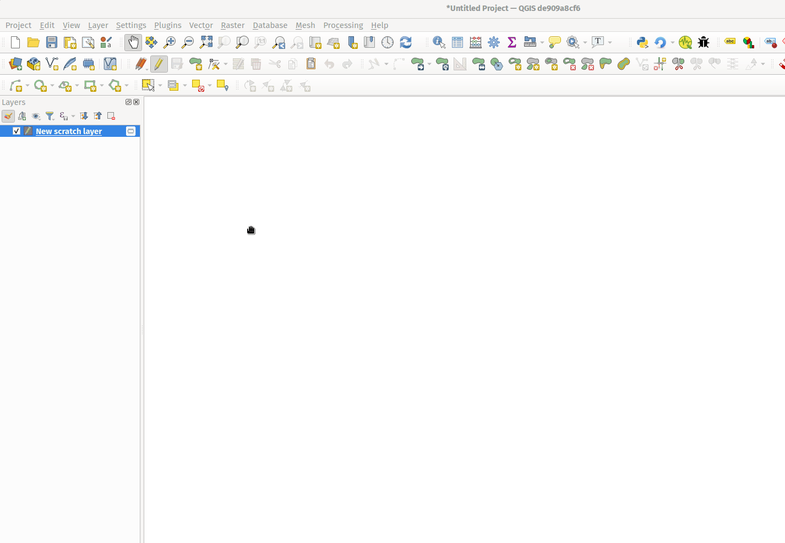
.. |image34| image:: images/entries/d4a70011e9064862c99827f5b940805dd2d45182.gif
   :class: img-responsive img-rounded
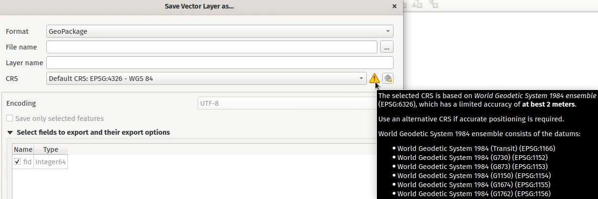
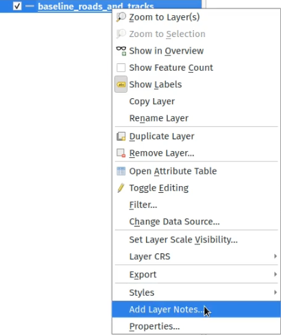
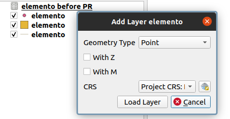
.. |image38| image:: images/entries/73f699bdf27a1b3b35de96e7a233d12a49b585d9.png
   :class: img-responsive img-rounded
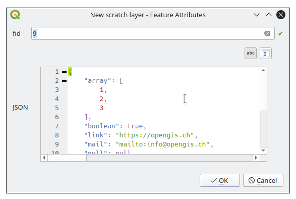
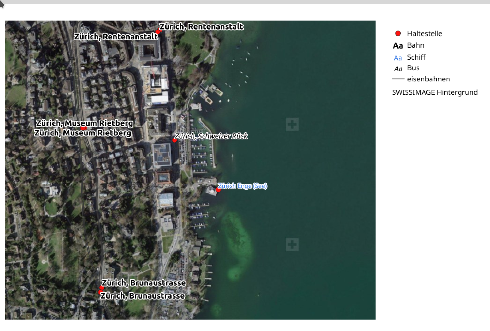
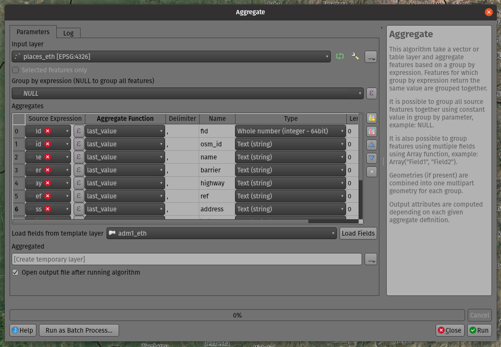
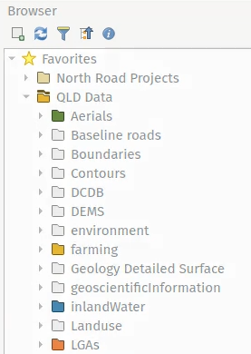

