.. _changelog34:

Changelog for QGIS 3.4 LTR
==========================

|image0|

Release date: 2018-10-28

The first long-term release (LTR) of QGIS 3. QGIS 3.4 just released. After five consolidation point releases (3.4.5) it will replace the previous LTR in the package repositories in February 2019 (see :ref:`release schedule <QGIS-release-schedule>`).
This is a giant leap forward for the project - our first Long Term Release based on the 3.x platform. For users moving over from the 2.18 LTR there is a huge list of new features and impactful changes in this new LTR version.
Please bear in mind that 3.x plugins are incompatible with 2.x plugins so review your plugin usage carefully - and if possible help to migrate old plugins to the new platform. If you have not already done so, take a look at the changelogs from :ref:`Version 3.0 <changelog30>` and :ref:`Version 3.2 <changelog32>` to understand the full scope of changes in the 3.4 release.

**Thanks**

We would like to thank the developers, documenters, testers and all the many folks out there who volunteer their time and effort (or fund people to do so). From the QGIS community we hope you enjoy this release! If you wish to donate time, money or otherwise get involved in making QGIS more awesome, please wander along to `qgis.org <https://qgis.org>`__ and lend a hand!

QGIS is supported by donors and sustaining members. A current list of donors who have made financial contributions large and small to the project can be seen on our :ref:`donors list <list_of_donors>`. If you would like to become an official sustaining member, please visit :ref:`our sustaining members page <QGIS_sustaining_memberships>` for details. Supporting QGIS helps us to fund our six monthly developer meetings, maintain project infrastructure and fund bug fixing efforts. A complete list of current supporters is provided below - our very great thank you to all of our supporters!

:raw-html:`
 <!-- to be filled via javascript loading of atom feed --> 
`

QGIS is Free software and you are under no obligation to pay anything to use it - in fact we want to encourage people far and wide to use it regardless of what your financial or social status is - we believe empowering people with spatial decision making tools will result in a better society for all of humanity.

|image1|

.. contents::
   :local:

General
-------

Feature: Flatpak
~~~~~~~~~~~~~~~~

QGIS is now available as a flatpak application on `flathub <https://flathub.org/apps/search/qgis>`__
Flatpak (formerly xdg-app) is a software utility for software deployment, package management, and application virtualization for Linux desktop computers.
It allows users to install different QGIS versions on linux without having to recompile or use Docker. It is a full package with all libraries included, and it uses its own user profile locations. So you'll need some disk space and new habits working with flatpak, but it rocks!

|image28|

This feature was funded by `Aleix Pol <https://github.com/aleixpol>`__

This feature was developed by `Aleix Pol <https://github.com/aleixpol>`__

Feature: SVG files can be embedded in projects and symbols
~~~~~~~~~~~~~~~~~~~~~~~~~~~~~~~~~~~~~~~~~~~~~~~~~~~~~~~~~~

Allows SVG images for symbology, labels, etc to be directly embedded inside a project file (or QML style, or QPT print template!) by encoding the svg as a standard base64 string.

Additionally, embeded files can be extracted from projects and symbols and saved back to disk based SVG files.

This feature was funded by `SMEC/SJ <http://smec.com>`__

This feature was developed by `Nyall Dawson <https://north-road.com>`__

Feature: OpenCL based acceleration
~~~~~~~~~~~~~~~~~~~~~~~~~~~~~~~~~~

This feature was funded by `QGIS.org <https://qgis.org>`__

This feature was developed by `Alessandro Pasotti <https://qgis.org>`__

Expressions
-----------

Feature: New expression functions and variables
~~~~~~~~~~~~~~~~~~~~~~~~~~~~~~~~~~~~~~~~~~~~~~~

Many new expression functions have been added in QGIS 3.4. These include many handy functions for working with and manipulating arrays and maps (dictionary) objects.

-  **json\_to\_map**: Converts a JSON encoded string value to a map (dictionary) type object
-  **map\_to\_json**: Converts a map (dictionary) type object to a JSON encoded string value
-  **hstore\_to\_map**: Converts a hstore value to a map (dictionary) type object
-  **map\_to\_hstore**: Converts a map (dictionary) type object to a hstore value
-  **array\_foreach** : Loops over an array and executes an expression on each item in the array, returning a new array containing each calculated value
-  **array\_filter** : Filters an array according to an expression
-  **raster\_value**: Returns a value sampled from a raster layer at a specified point
-  **to\_dms**: Converts a numeric value to a Degrees, Minutes, Seconds formatted string
-  **to\_dm**: Converts a numeric value to a Degrees, Minutes formatted string
-  **line\_substring**: Returns the portion of a line (or curve) geometry which falls between the specified start and end distances (measured from the beginning of the line). Z and M values are linearly interpolated from existing values.
-  **generate\_series(start,stop,step)**: Creates an array containing a sequence of numbers.

Additionally, some new variables have also been made available for use within QGIS expressions:

-  **@canvas\_cursor\_point**: Contains a point value representing the current position of the mouse cursor within the main map canvas
-  **@map\_layers**: Contains an array of all layers which are visible within the map
-  **@map\_layer\_ids**: Contains an array of all layer IDs for layers visible within the map

|image2|

This feature was developed by `Etienne Trimaille, Matteo Ghetta, Matthias Kuhn, Mathieu Pellerin, Nyall Dawson <https://qgis.org>`__

Feature: Code completion for expression builder
~~~~~~~~~~~~~~~~~~~~~~~~~~~~~~~~~~~~~~~~~~~~~~~

Autocompletion for code in the expression editor.

-  Variables, function names and field names are proposed and inserted automatically when writing expressions
-  Function parameters are shown while filling them

|image3|

This feature was funded by `OPENGIS.ch <https://www.opengis.ch/>`__

This feature was developed by `Matthias Kuhn (OPENGIS.ch) <https://www.opengis.ch/>`__

Map Tools
---------

Feature: Identify or select features based on existing polygon
~~~~~~~~~~~~~~~~~~~~~~~~~~~~~~~~~~~~~~~~~~~~~~~~~~~~~~~~~~~~~~

Often it is useful to select/identify features that are covered by an existing polygon. For this, users can use "Select Features by Polygon" and "Identify Features by Polygon" tools, but it was necessary to manually trace the polygon of interest. This new feature allows user to right click on the map and pick an existing polygon feature at that location from popup menu - that polygon will be used as input for selection or identification.

|image4|

This feature was funded by Leicestershire County Council

This feature was developed by `Peter Petrik (Lutra Consulting) <https://www.lutraconsulting.co.uk/>`__

User Interface
--------------

Feature: Auto selection of exported files in file manager
~~~~~~~~~~~~~~~~~~~~~~~~~~~~~~~~~~~~~~~~~~~~~~~~~~~~~~~~~

Whenever a message bar item links to a created file (e.g. after exporting a layout or map layer), the link will now directly open the folder containing this file within the operating system file browser AND pre-select the created file. It's a super-handy shortcut speeding up file operations after an export from QGIS!

|image5|

This feature was funded by `North Road <https://north-road.com>`__

This feature was developed by `Nyall Dawson (North Road) <https://north-road.com>`__

Feature: New "Open Directory" option for disabled welcome page projects
~~~~~~~~~~~~~~~~~~~~~~~~~~~~~~~~~~~~~~~~~~~~~~~~~~~~~~~~~~~~~~~~~~~~~~~

This new option in the right-click context menu for disabled entries on the welcome page allows users to open the closest existing path to the original project location in their file manager, to hopefully help them re-locate missing/moved/renamed projects.

This feature was funded by `North Road <https://north-road.com>`__

This feature was developed by `Nyall Dawson (North Road) <https://north-road.com>`__

Feature: UX Improvements for Temporary Scratch Layers
~~~~~~~~~~~~~~~~~~~~~~~~~~~~~~~~~~~~~~~~~~~~~~~~~~~~~

Temporary Scratch Layers in QGIS can be very handy when a "throw-away" layer is needed, such as when pre-processing data in multiple steps. However, they can be a trap for uniformed users who may not realise that the contents of the layer will be permanently lost when the current QGIS project is closed. Accordingly, a new indicator icon has been added which shows up next to any temporary scratch layers in the layer tree, making it immediately clear which layers are temporary only.

It's also much easier to transition these temporary layers to permanent disk-based formats. You can either click the new indicator icon or select "Make Permanent" from the layer context menu. QGIS will then prompt for a location to save the temporary layer to, then replaces it in place (keeping the same layer ID, style, form settings, etc).

|image6|

This feature was funded by `North Road <https://north-road.com>`__

This feature was developed by `Nyall Dawson (North Road) <https://north-road.com>`__

Feature: Task manager improvements
~~~~~~~~~~~~~~~~~~~~~~~~~~~~~~~~~~

The QGIS task manager widget (shown in the status bar whenever a background task is running) now shows an estimated time remaining and completion time for long-running background tasks. This Estimated Time of Arrival is calculated using a simple linear interpolation based on the task's elapsed time and current progress, and allows users to know whether they've only got time to make an instance coffee in the office kitchen or walk round the block for a proper barista made coffee before that long processing task completes...

Additionally, QGIS uses the standard operating system progress reporting mechanisms on more platforms and occasions in QGIS 3.4. Some long running tasks (which don't run in the background) such as atlas exports now show their progress via the operating system mechanism, and throw up handy completion notifications.

This feature was funded by `North Road <https://north-road.com>`__

This feature was developed by `Nyall Dawson (North Road) <https://north-road.com>`__

Feature: Hyperlinks to local vector & raster datasets in the information panel
~~~~~~~~~~~~~~~~~~~~~~~~~~~~~~~~~~~~~~~~~~~~~~~~~~~~~~~~~~~~~~~~~~~~~~~~~~~~~~

For local vector and raster datasets, the Information tab within the layer properties dialog now features source file path hyperlinks. Upon clicking on the hyperlink, the system's file navigator will open and automatically highlight the dataset.

|image7|

This feature was funded by `iMhere Asia <https://www.imhere-asia.com/>`__

This feature was developed by `Mathieu Pellerin <https://www.imhere-asia.com/>`__

Feature: Style manager improvements
~~~~~~~~~~~~~~~~~~~~~~~~~~~~~~~~~~~

The QGIS Style Manager dialog (which allows users to setup and manage their own libraries of symbols and color ramps) now opens non-modally, so it can now be used alongside the main QGIS window (just like the Layout Manager dialog and Print Layout Designer windows).

We've also improved the preview of symbols within the Layer Styling dock, adding a toggle to switch between a large icon view and a detailed list view of symbols. Hovering over symbols (and colors!) now shows a large preview of the symbol. Finally, we've made symbol lists more hi-dpi friendly.

This feature was funded by `North Road <https://north-road.com>`__

This feature was developed by `Nyall Dawson (North Road) <https://north-road.com>`__

Feature: Polished browser panel interface and experience
~~~~~~~~~~~~~~~~~~~~~~~~~~~~~~~~~~~~~~~~~~~~~~~~~~~~~~~~

Tons of work was done for this release to improve the user interface and experience of the browser panel including HiDPI fixes, compressed vector/raster dataset improvements, and a refreshed icon set.

Functionality has also been added, including the ability to create a new directory directly from the browser context menu. The browser also now shows a more complete range of options for SQL Server connections, matching those options which were already available for other database connections.

|image8|

This feature was developed by Mathieu Pellerin (iMHere Asia), Nyall Dawson (North Road)

Feature: QML chart and drawings widget
~~~~~~~~~~~~~~~~~~~~~~~~~~~~~~~~~~~~~~

A new type of vector layer form widget for showing graphically appealing and interactive items like charts or technical drawings on the attribute form has been added in QGIS 3.4.
The widget sports a flexible configuration, including example templates and expression support.

|image9|

This feature was funded by `QGIS Project <https://qgis.org/>`__

This feature was developed by `David Signer and Matthias Kuhn (OPENGIS.ch) <https://www.opengis.ch>`__

Symbology
---------

Feature: Mesh layer styling
~~~~~~~~~~~~~~~~~~~~~~~~~~~

-  Adding datasets to mesh layer from properties panel
-  Information and source panel in properties panel
-  Selection of active dataset (properties or styling panel)
-  Styling of contours/scalars (properties or styling panel)
-  Styling of mesh frame (properties or styling panel)
-  Styling of vector arrows (properties or styling panel)

This feature was funded by `Lutra Consulting <https://www.lutraconsulting.co.uk/>`__

This feature was developed by `Peter Petrik (Lutra Consulting) <https://www.lutraconsulting.co.uk/blog/2018/10/18/mdal/>`__

Feature: Classify symmetric in graduated renderer
~~~~~~~~~~~~~~~~~~~~~~~~~~~~~~~~~~~~~~~~~~~~~~~~~

This feature was funded by https://github.com/pierreloicq

This feature was developed by https://github.com/pierreloicq

Feature: Partial QML export and import
~~~~~~~~~~~~~~~~~~~~~~~~~~~~~~~~~~~~~~

When exporting and importing styles to and from ``.qml`` files it is now possible to select a subset of sections.
This allows to save and restore parts of a layer configuration while omitting others. For example, it's possible to export only the symbology of a layer and when importing this QML style file into a layer, any configuration on the forms and widgets or other properties are unaffected.
It is also possible to only handle single sections of a style when using copy/paste.

|image10|

This feature was funded by `qwat group <http://qwat.org/>`__

This feature was developed by `Denis Rouzaud (OPENGIS.ch GmbH) <https://www.opengis.ch>`__

Digitising
----------

Feature: GPS tracking improvements
~~~~~~~~~~~~~~~~~~~~~~~~~~~~~~~~~~

QGIS 3.4 extends the inbuilt GPS tracking support, adding "acquisition interval" and "distance threshold" parameters. These options can be used to keep the cursor stationary when the receiver is in static conditions.

This feature was funded by `Andrea Rossi <https://github.com/rossia>`__

This feature was developed by `Andrea Rossi <https://github.com/rossia>`__

Feature: More angle choices in advanced digitizing dock
~~~~~~~~~~~~~~~~~~~~~~~~~~~~~~~~~~~~~~~~~~~~~~~~~~~~~~~

Options were added to allowing snapping to 5/10/15/18/22.5 degrees while in construction mode.

|image11|

This feature was funded by `lbartoletti <https://github.com/lbartoletti>`__

This feature was developed by `lbartoletti <https://github.com/lbartoletti>`__

Feature: Vertex tool can work on the current layer only
~~~~~~~~~~~~~~~~~~~~~~~~~~~~~~~~~~~~~~~~~~~~~~~~~~~~~~~

The new vertex is a lot more productive now. It can move vertices of all editable layers at once, which is great to preserve cross layers topology. However in many cases, many of us don't want to modify all layers at once. We added a variation of the vertex map tool just for that.

|image12|

This feature was funded by `Oslandia <https://oslandia.com>`__

This feature was developed by `Paul Blottiere (Oslandia) <https://oslandia.com/en/home-en/>`__

Feature: Add reverse line maptools
~~~~~~~~~~~~~~~~~~~~~~~~~~~~~~~~~~

A long awaited feature ! No more external plugin or algorithm to reverse a line's direction!

|image13|

This feature was funded by `OSLANDIA <https://oslandia.com>`__

This feature was developed by `Loïc Bartoletti <https://github.com/lbartoletti>`__

Feature: Geometry Precision
~~~~~~~~~~~~~~~~~~~~~~~~~~~

Vector layers have a precision configuration option.
The precision defines how accurate the location of nodes should be saved. Each node of new or edited geometries is snapped to a grid of this resolution.
While digitizing, the grid is shown to guide the user.

|image14|

This feature was funded by `Kanton Solothurn <https://www.so.ch/verwaltung/bau-und-justizdepartement/amt-fuer-geoinformation/>`__

This feature was developed by `Matthias Kuhn (OPENGIS.ch) <https://www.opengis.ch>`__

Feature: Automatically remove duplicate nodes
~~~~~~~~~~~~~~~~~~~~~~~~~~~~~~~~~~~~~~~~~~~~~

When adding or editing geometries on a vector layer, QGIS can automatically remove duplicate nodes from geometries.
This option is configurable in the digitizing tab of vector layers.

This feature was funded by `Kanton Solothurn <https://www.so.ch/verwaltung/bau-und-justizdepartement/amt-fuer-geoinformation/>`__

This feature was developed by `Matthias Kuhn (OPENGIS.ch) <https://www.opengis.ch>`__

Feature: Check for geometry validity
~~~~~~~~~~~~~~~~~~~~~~~~~~~~~~~~~~~~

Each new or edited geometry can be checked for validity if this option is activated. This allows to communicate transparently to a user when there are erroneous geometries produced by the current edit session.

|image15|

This feature was funded by `Kanton Solothurn <https://www.so.ch/verwaltung/bau-und-justizdepartement/amt-fuer-geoinformation/>`__

This feature was developed by `Matthias Kuhn (OPENGIS.ch) <https://www.opengis.ch>`__

Feature: Topology checks while editing
~~~~~~~~~~~~~~~~~~~~~~~~~~~~~~~~~~~~~~

Topology checks can be activated on a layer.
On newly added and edited geometries, topology checks can be executed. The checks will be executed, when the layer is saved or upon a click on the topology check button on the geometry validation panel.

The following checks are available:

-  Gaps
-  Overlaps
-  Missing vertices on neighbouring polygons

This builds on top of the functionality of the geometry checker plugin which was implemented by `Sourcepole <https://sourcepole.ch>`__.

|image16|

This feature was funded by `Kanton Solothurn <https://www.so.ch/verwaltung/bau-und-justizdepartement/amt-fuer-geoinformation/>`__

This feature was developed by `Matthias Kuhn (OPENGIS.ch) <https://www.opengis.ch>`__

Data Management
---------------

Feature: Translation of QGIS projects
~~~~~~~~~~~~~~~~~~~~~~~~~~~~~~~~~~~~~

Like QGIS and the plugins, the projects are translated with the Qt translation process. Means, it makes the translation according to a Qt Compiled Translation Source File (``.qm`` file). When the user opens a project, QGIS checks for a ``.qm`` file laying in the same folder like the ``.qgs`` file, having the same name like the ``.qgs`` file and having the language-code as postfix of the users language (the language configured in the QGIS settings).
To create the translation, in the project settings, there is an option to generate the ``.ts`` file, that can edited by programs like Qt Linguist or Transifex.

More information in `this blog post <https://new.opengis.ch/2018/09/11/qgis-speaks-a-lot-of-languages/>`__

This feature was funded by `QGIS Usergroup Switzerland and QGEP Project <https://www.qgis.ch/en>`__

This feature was developed by `David Signer (OPENGIS.ch) <https://www.opengis.ch/>`__

Feature: Switch Attribute Table dock mode on demand
~~~~~~~~~~~~~~~~~~~~~~~~~~~~~~~~~~~~~~~~~~~~~~~~~~~

A button has been added to the Attribute Table toolbar for switching between docked and window mode on demand. Previously users had to change an option in the settings dialog and open a new table in order to switch between docked/undocked mode, but that's painful if you decide *after* a table is already open that you'd like to dock/undock it...!

|image17|

This feature was funded by `North Road <https://north-road.com>`__

This feature was developed by `Nyall Dawson (North Road) <https://north-road.com>`__

Feature: New locator filter to search across all layers
~~~~~~~~~~~~~~~~~~~~~~~~~~~~~~~~~~~~~~~~~~~~~~~~~~~~~~~

A new locator filter has been added which allows users to search across *all* layers in their project, by the layer's display expression.

The filter can be activated by using the prefix 'af', or by making it a default search via QGIS options -> Locator -> Features In All Layer. Display expressions are defined in the vector layer properties under the display tab. Individual layers can be marked as not searchable in the Project Properties dialog, under the Data Sources tab.

|image18|

This feature was funded by `Opengis.ch <https://www.opengis.ch/>`__

This feature was developed by `Denis Rouzaud <https://www.opengis.ch/>`__

Feature: Non-removable (required) layers highlighted in layer tree
~~~~~~~~~~~~~~~~~~~~~~~~~~~~~~~~~~~~~~~~~~~~~~~~~~~~~~~~~~~~~~~~~~

A new indicator "locked" icon is shown for any layers marked as "required" within the current project. This icon gives users instant feedback that a particular layer cannot be removed from the project.

Required layers are configured via the Project Properties dialog, Data Sources tab.

|image19|

This feature was funded by `Arpa Piemonte (Dipartimento Tematico Geologia e Dissesto) within ERIKUS project <https://www.arpa.piemonte.it/>`__

This feature was developed by `Martin Dobias (Lutra Consulting) <https://www.lutraconsulting.co.uk>`__ and `Faunalia <https://www.faunalia.eu>`__

Feature: Append raster layer to an existing Geopackage
~~~~~~~~~~~~~~~~~~~~~~~~~~~~~~~~~~~~~~~~~~~~~~~~~~~~~~

When saving a raster layer to GeoPackage database, it's now possible to append the layer to an existing file.

|image20|

This feature was funded by `Borys Jurgiel <https://github.com/borysiasty>`__

This feature was developed by `Borys Jurgiel <https://github.com/borysiasty>`__

Forms and Widgets
-----------------

Feature: Drill-down (cascading) forms in QGIS Value Relation Widgets
~~~~~~~~~~~~~~~~~~~~~~~~~~~~~~~~~~~~~~~~~~~~~~~~~~~~~~~~~~~~~~~~~~~~

New functions and logic in QGIS “Value Relation Widgets”, allowing the implementation of complex, dynamic filters within QGIS attribute forms. The functionality can be used to implement “drill-down” forms within QGIS, where the values available in one field depend on the values of other fields:

|image21|

This feature was funded by `QGIS community through crowd-funding <https://north-road.com/drill-down-cascading-forms/>`__

This feature was developed by Alessandro Pasotti (with North Road)

Map Composer
------------

Feature: 3D map items
~~~~~~~~~~~~~~~~~~~~~

This feature allows users to add their 3D map view to the print layout.

|image22|

This feature was funded by `QGIS community through crowd-funding <https://www.lutraconsulting.co.uk/crowdfunding/more-qgis-3d/>`__

This feature was developed by `Lutra Consulting <https://www.lutraconsulting.co.uk/>`__

Processing
----------

Feature: New "Edit in place" mode
~~~~~~~~~~~~~~~~~~~~~~~~~~~~~~~~~

Thanks to a large number of `generous backers <https://north-road.com/edit-features-in-place-using-qgis-spatial-operations-campaign/>`__, a crowdfunded "edit in place" mode was added to Processing for 3.4. When a vector layer is active and editable, this mode allows users to execute suitable algorithms directly on the features from the layer, modifying their attributes and geometries in-place. All edits are added to the layer’s “edit buffer”, so you can easily undo and redo the changes before saving them back to the data source.

For those power users who perform frequent data edits, this functionality is also exposed via QGIS 3.0’s “Locator bar” (that “type to locate” bar which sits in the bottom-left corner). Typing ‘ef’ (“edit features”) followed by the name of the corresponding operation allows you to perform the edits directly via the keyboard. E.g.

-  Select a bunch of line features
-  Press Ctrl + K (activates the locator bar)
-  Type “ef reverse”
-  Press enter – the selected line features will be reversed immediately!

|image23|

This feature was funded by `Crowdfunding campaign <https://north-road.com/edit-features-in-place-using-qgis-spatial-operations-campaign/>`__

This feature was developed by `North Road <https://north-road.com>`__

Feature: Store models inside project
~~~~~~~~~~~~~~~~~~~~~~~~~~~~~~~~~~~~

Some Processing models are so intrinsically linked to the logic inside a particular project that they have no meaning (or are totally broken) outside of that project (e.g. models which rely on the presence of particular map layers, relations, etc). Accordingly, from QGIS 3.4, Processing models can be stored inside QGIS project files. Any models stored within a project are made available as soon as that project is opened. This also avoids cluttering up the "global" model provider with models which make no sense, and makes it easier to distribute a single project all relevant models included.

Models are stored inside projects by clicking the new "Embed in Project" button in the Modeler dialog toolbar. Models can be removed from a project from the model's right click menu in the toolbox.

This feature was funded by `North Road <https://north-road.com>`__

This feature was developed by `Nyall Dawson (North Road) <https://north-road.com>`__

Feature: Sample Raster Values
~~~~~~~~~~~~~~~~~~~~~~~~~~~~~

A new algorithm was added for sampling raster layer values at point locations.

|image24|

This feature was funded by `Faunalia <https://www.faunalia.eu>`__

This feature was developed by `Matteo Ghetta (Faunalia) <https://www.faunalia.eu>`__

Feature: New 'Raster pixels to polygons' algorithm
~~~~~~~~~~~~~~~~~~~~~~~~~~~~~~~~~~~~~~~~~~~~~~~~~~

This algorithm converts a raster layer into a vector layer, with a polygon feature corresponding to each pixel from the raster and a single field containing the band value from the raster.

This feature was funded by `SMEC/SJ <http://smec.com>`__

This feature was developed by `Nyall Dawson <https://north-road.com>`__

Feature: K Means clustering algorithm
~~~~~~~~~~~~~~~~~~~~~~~~~~~~~~~~~~~~~

QGIS 3.4 adds a native "k-means clustering" algorithm. Based on a port of PostGIS' ST\_ClusterKMeans function, this algorithm adds a new cluster ID field to a set of input features which identifies the feature's cluster based on a k-means clustering approach. If non-point geometries are used as input, the clustering is based off the centroid of the input geometries.

This feature was funded by `North Road <https://north-road.com>`__

This feature was developed by `Nyall Dawson (North Road) <https://north-road.com>`__

Feature: dbscan spatial clustering algorithm
~~~~~~~~~~~~~~~~~~~~~~~~~~~~~~~~~~~~~~~~~~~~

This new native algorithm implements an optimised DBSCAN density based scanning cluster approach for clustering 2d point features.

This feature was funded by `North Road <https://north-road.com>`__

This feature was developed by `Nyall Dawson (North Road) <https://north-road.com>`__

Feature: Improved algorithms
~~~~~~~~~~~~~~~~~~~~~~~~~~~~

Some miscellaneous improvements to existing Processing algorithms include:

-  The *Reverse line direction* algorithm now works with MultiLineString geometry inputs
-  *Extend lines*: support for dynamic (data defined) start and end distances was added
-  *Offset lines*: support for dynamic offset distance was added
-  The *Join by Field Value* and *Join by Location* algorithms can now optionally export unmatched records
-  *Join by Field Value* also reports counts of matched/unmatched features

This feature was funded by `North Road <https://north-road.com>`__

This feature was developed by `Nyall Dawson (North Road) <https://north-road.com>`__

Feature: Filter Vertices by M and Filter Vertices by Z algorithms
~~~~~~~~~~~~~~~~~~~~~~~~~~~~~~~~~~~~~~~~~~~~~~~~~~~~~~~~~~~~~~~~~

Two new algorithms were added for filtering line/polygon vertices by their M or Z values. A minimum and maximum M/Z value can be entered, and if the vertices fall outside these ranges they will be discarded from the output geometry. Both the minimum and maximum filter values can also be data defined, so can vary per feature.

This feature was funded by `North Road <https://north-road.com>`__

This feature was developed by `Nyall Dawson (North Road) <https://north-road.com>`__

Feature: "Array of Translated Features" algorithm
~~~~~~~~~~~~~~~~~~~~~~~~~~~~~~~~~~~~~~~~~~~~~~~~~

This new algorithm creates copies of features in a layer, by creating multiple translated (offset) versions of the feature. Each copy is displaced by a preset amount in the x/y/z/m axis.

This feature was funded by `North Road <https://north-road.com>`__

This feature was developed by `Nyall Dawson (North Road) <https://north-road.com>`__

Feature: "Array of offset (parallel) lines" algorithm
~~~~~~~~~~~~~~~~~~~~~~~~~~~~~~~~~~~~~~~~~~~~~~~~~~~~~

This new algorithm creates copies of line features in a layer, by creating multiple parallel versions of each feature. Each copy is offset by a preset distance.

This feature was funded by `North Road <https://north-road.com>`__

This feature was developed by `Nyall Dawson (North Road) <https://north-road.com>`__

Feature: Choice of units for non degree/unknown distances
~~~~~~~~~~~~~~~~~~~~~~~~~~~~~~~~~~~~~~~~~~~~~~~~~~~~~~~~~

When an algorithm has a distance parameter in meters/feet/etc (i.e. non-geographic distances), a combo box has been added allowing choice of the unit type.

(QGIS doesn't (and should **never**) expose this for distances in degrees -- it's up to users in this situation to choose a suitable local projection and reproject their data to match.)

This feature was funded by `North Road <https://north-road.com>`__

This feature was developed by `Nyall Dawson <https://north-road.com>`__

Feature: "Drape features to z/m" algorithms
~~~~~~~~~~~~~~~~~~~~~~~~~~~~~~~~~~~~~~~~~~~

These two new algorithms can set geometry vertex z or m values to values sampled from a raster band. Values can optionally be scaled using a (data definable) scale value.

This feature was funded by `North Road <https://north-road.com>`__

This feature was developed by `Nyall Dawson (North Road) <https://north-road.com>`__

Feature: "Raster pixels to points" algorithm
~~~~~~~~~~~~~~~~~~~~~~~~~~~~~~~~~~~~~~~~~~~~

A new "pixels to points" algorithm was added in QGIS 3.4, which creates a point feature at the center of every pixel. nodata pixels are skipped.

This feature was funded by `North Road <https://north-road.com>`__

This feature was developed by `Nyall Dawson (North Road) <https://north-road.com>`__

Feature: Line substring algorithm
~~~~~~~~~~~~~~~~~~~~~~~~~~~~~~~~~

This new, much-requested, algorithm returns the portion of a line (or curve) which falls between the specified start and end distances (measured from the beginning of the line). Z and M values are linearly interpolated from existing values.

This feature was funded by `North Road <https://north-road.com>`__

This feature was developed by `Nyall Dawson (North Road) <https://north-road.com>`__

Feature: "Interpolate point on line" algorithm
~~~~~~~~~~~~~~~~~~~~~~~~~~~~~~~~~~~~~~~~~~~~~~

This new algorithm creates a point geometry interpolated at a set distance along line (or polygon boundary) geometries. Curved input geometries are fully supported. Z or M values are linearly interpolated based on existing values.

This feature was funded by `North Road <https://north-road.com>`__

This feature was developed by `Nyall Dawson (North Road) <https://north-road.com>`__

Feature: k-neighbour concave hull
~~~~~~~~~~~~~~~~~~~~~~~~~~~~~~~~~

This feature was funded by https://qgis.org

This feature was developed by `Detlev Neumann, Rudi von Staden <https://qgis.org>`__

Feature: Python scripts which implement algorithms now execute the algorithm on drag and drop and browser double click
~~~~~~~~~~~~~~~~~~~~~~~~~~~~~~~~~~~~~~~~~~~~~~~~~~~~~~~~~~~~~~~~~~~~~~~~~~~~~~~~~~~~~~~~~~~~~~~~~~~~~~~~~~~~~~~~~~~~~~

When appropriate, scripts will now launch a processing algorithm dialog upon:

-  Dragging and dropping a Python script onto the main window
-  Using the browser panel's right-click run script action

|image25|

This feature was funded by `iMhere Asia <https://www.imhere-asia.com/>`__

This feature was developed by `Mathieu Pellerin <https://www.imhere-asia.com/>`__

Feature: New GDAL's rearrange band algorithm
~~~~~~~~~~~~~~~~~~~~~~~~~~~~~~~~~~~~~~~~~~~~

A new GDAL provider 'Rearrange band' algorithm was added to the processing toolbox. The algorithm allows to output rasters continuing a subset of a given input raster's bands, and offers the possibility to re-order the bands.

|image26|

This feature was funded by `iMHere Asia <https://www.imhere-asia.com/>`__

This feature was developed by `Mathieu Pellerin <https://www.imhere-asia.com/>`__

Feature: "Precalculated" values for model algorithm parameters
~~~~~~~~~~~~~~~~~~~~~~~~~~~~~~~~~~~~~~~~~~~~~~~~~~~~~~~~~~~~~~

A new option is present for all parameters of using a "precalculated expression". This expression is evaluated once before the child algorithm is executed and used during the execution of that algorithm.

This feature was funded by `QGIS <https://qgis.org>`__

This feature was developed by `Nyall Dawson (North Road) <https://north-road.com>`__

Feature: "Categorize a layer using a style XML file" algorithm
~~~~~~~~~~~~~~~~~~~~~~~~~~~~~~~~~~~~~~~~~~~~~~~~~~~~~~~~~~~~~~

This new algorithm sets a vector layer's renderer to a categorized renderer using matching symbols from a style database.

A specified expression (or field name) is used to create categories for the renderer, with QGIS creating a category for each unique value within the layer. Each category is individually matched to the symbols which exist within the specified QGIS XML style database. Whenever a matching symbol name is found, the category's symbol will be set to this matched symbol.

The matching is case-insensitive by default, but can be made case-sensitive if required. Optionally, non-alphanumeric characters in both the category value and symbol name can be ignored while performing the match. This allows for greater tolerance when matching categories to symbols.

If desired, tables can also be output containing lists of the categories which could not be matched to symbols, and symbols which were not matched to categories.

|image27|

This feature was funded by `North Road <https://north-road.com>`__

This feature was developed by `Nyall Dawson (North Road) <https://north-road.com>`__

Feature: New mode for Snap geometries algorithm
~~~~~~~~~~~~~~~~~~~~~~~~~~~~~~~~~~~~~~~~~~~~~~~

The new mode "Snap to anchor nodes (single layer only)" makes sure that any two vertices of the vector layer are at least at distance given by the threshold value.

This algorithm comes handy when doing vector overlay operations such as intersection, union or difference to prevent possible topological errors caused by numerical errors if coordinates are very close to each other. After running the algorithm some previously valid geometries may become invalid and therefore it may be useful to run Fix geometries algorithm afterwards.

This feature was funded by `InaSAFE DFAT <https://www.dfat.gov.au/>`__

This feature was developed by `Martin Dobias (Lutra Consulting) <https://www.lutraconsulting.co.uk/>`__

Data Providers
--------------

Feature: OAuth2 authentication method plugin
~~~~~~~~~~~~~~~~~~~~~~~~~~~~~~~~~~~~~~~~~~~~

-  Supports authentication code, implicit and resource owner grant flows
-  Allows for preconfigured connections, read from default locations
-  Offers caching of access token beyond QGIS restarts
-  Save/load configurations

This feature was funded by `Monsanto Company <https://monsanto.com/>`__

This feature was developed by `Larry Shaffer, Alessandro Pasotti <https://qgis.org>`__

Feature: Mesh layer: New mesh layer format support
~~~~~~~~~~~~~~~~~~~~~~~~~~~~~~~~~~~~~~~~~~~~~~~~~~

Mesh layers represent data on variable size grid with extra components (e.g. time and vector). With introduction of MDAL, users can load the following formats directly in QGIS and explore all other components:

- GRIB
- XMDF
- Netcdf

|image29|

This feature was funded by `Lutra Consulting <https://www.lutraconsulting.co.uk/blog/2018/10/18/mdal/>`__

This feature was developed by `Lutra Consulting <https://www.lutraconsulting.co.uk/>`__

Feature: Mesh layer: add function to identify value on mesh layers
~~~~~~~~~~~~~~~~~~~~~~~~~~~~~~~~~~~~~~~~~~~~~~~~~~~~~~~~~~~~~~~~~~

With this API, developers can inspect mesh elements and fetch values spatially and temporally. As an example, you can create time series plot from your mesh layer.

|image30|

This feature was funded by `Lutra Consulting <https://www.lutraconsulting.co.uk/>`__

This feature was developed by `Lutra Consulting <https://www.lutraconsulting.co.uk/>`__

Feature: Mesh layer: allow to choose different vector and scalar dataset
~~~~~~~~~~~~~~~~~~~~~~~~~~~~~~~~~~~~~~~~~~~~~~~~~~~~~~~~~~~~~~~~~~~~~~~~

A mesh layer often contains several quantities. For example a netcdf/grib can contain several meteorological quantities. Each quantity can also have multiple components. For example, wind data can contain speed (scalar) and values (grid). With this option, you can overlay scalar and grids from different quantities. In the image below, you can see temperature (grid) and wind (scalar).

|image31|

This feature was funded by `Lutra Consulting <https://www.lutraconsulting.co.uk/>`__

This feature was developed by `Lutra Consulting <https://www.lutraconsulting.co.uk/>`__

Feature: Mesh layer: allow render vectors/arrows on the user-defined grid
~~~~~~~~~~~~~~~~~~~~~~~~~~~~~~~~~~~~~~~~~~~~~~~~~~~~~~~~~~~~~~~~~~~~~~~~~

Scalar data are generated usually at the centre/corner of each mesh element. When displaying the scalar data, the arrows might look sparse and often not possible to see the general trend. With this option, arrows can be displayed on a user-defined grid. Extra scalar values will be interpolated on-the-fly and placed on the user-defined grid.

|image32|

This feature was funded by `Lutra Consulting <https://www.lutraconsulting.co.uk/>`__

This feature was developed by `Lutra Consulting <https://www.lutraconsulting.co.uk/>`__

Feature: JSON/JSONB Type support
~~~~~~~~~~~~~~~~~~~~~~~~~~~~~~~~

The reading of PostgreSQL JSON types is supported. JSON Data can be displayed in the widgets as "Key/Value" (maps), as "List" (arrays) or as text.

|image33|

This feature was funded by `Kanton Solothurn <https://www.so.ch/verwaltung/bau-und-justizdepartement/amt-fuer-geoinformation/>`__

This feature was developed by `David Signer (OPENGIS.ch) <https://www.opengis.ch>`__

Feature: ESRI Token Authentication support
~~~~~~~~~~~~~~~~~~~~~~~~~~~~~~~~~~~~~~~~~~

Support has been added to QGIS' Authentication system for ESRI's temporary token based authentication. This allows for connection to ArcGIS Feature and Map Servers via an allocated temporary token.

This feature was developed by `Nyall Dawson (North Road) <https://north-road.com>`__

Feature: SQL Server - Invalid geometry handling
~~~~~~~~~~~~~~~~~~~~~~~~~~~~~~~~~~~~~~~~~~~~~~~

Recent versions of QGIS have switched to a safer approach to reading SQL Server layers, which automatically checks for geometry validity and repairs geometries when needed. This workaround is required to avoid issues with the design of SQL Server's geometry handling, where encountering any rows with invalid geometries can silently abort a request without returning all the features from a layer. Unfortunately, the workaround comes at a significant performance cost.

In QGIS 3.4 a new setting was added to allow users to manually turn off QGIS' SQL Server invalid geometry handling. Turning on the "Skip invalid geometry handling" setting under a SQL Server connection's properties causes QGIS to skip all the expensive geometry validation processing, but firmly places the responsibility for ensuring that all features on the database have valid geometries back upon the user/database administrator. **This is a "use at your own risk" setting. Improperly enabling this option can lead to missing features and data loss.**

This feature was developed by `Nyall Dawson (North Road) <https://north-road.com>`__

QGIS Server
-----------

Feature: Server Cache can be manage by plugins
~~~~~~~~~~~~~~~~~~~~~~~~~~~~~~~~~~~~~~~~~~~~~~

By default, QGIS Server only caches WMS GetCapabilities document in memory. With WMTS implementation, it is necessary to have a way to cache tiles. But the cache manager has not been developed to only cache tiles.

The cache manager plugin can be used to cache:

-  WMS, WFS, WCS, WMTS GetCapabilities documents
-  WFS DescribeFeatureType documents
-  WCS DescribeCoverage documents
-  WMTS GetTile images
-  WMS GetLegendGraphic images

Here is a python cache manager class, which do not verify if the QGIS project has changed:

::

    class PyServerCache(QgsServerCacheFilter):

        """ Used to have cache control """

        def __init__(self, server_iface):
            super(QgsServerCacheFilter, self).__init__(server_iface)

            self._cache_dir = os.path.join(tempfile.gettempdir(), "qgs_server_cache")
            if not os.path.exists(self._cache_dir):
                os.mkdir(self._cache_dir)

            self._tile_cache_dir = os.path.join(self._cache_dir, 'tiles')
            if not os.path.exists(self._tile_cache_dir):
                os.mkdir(self._tile_cache_dir)

        def getCachedDocument(self, project, request, key):
            m = hashlib.md5()
            paramMap = request.parameters()
            urlParam = "&".join(["%s=%s" % (k, paramMap[k]) for k in paramMap.keys()])
            m.update(urlParam.encode('utf8'))

            if not os.path.exists(os.path.join(self._cache_dir, m.hexdigest() + ".xml")):
                return QByteArray()

            doc = QDomDocument(m.hexdigest() + ".xml")
            with open(os.path.join(self._cache_dir, m.hexdigest() + ".xml"), "r") as f:
                statusOK, errorStr, errorLine, errorColumn = doc.setContent(f.read(), True)
                if not statusOK:
                    print("Could not read or find the contents document. Error at line %d, column %d:\n%s" % (errorLine, errorColumn, errorStr))
                    return QByteArray()

            return doc.toByteArray()

        def setCachedDocument(self, doc, project, request, key):
            if not doc:
                print("Could not cache None document")
                return False
            m = hashlib.md5()
            paramMap = request.parameters()
            urlParam = "&".join(["%s=%s" % (k, paramMap[k]) for k in paramMap.keys()])
            m.update(urlParam.encode('utf8'))
            with open(os.path.join(self._cache_dir, m.hexdigest() + ".xml"), "w") as f:
                f.write(doc.toString())
            return os.path.exists(os.path.join(self._cache_dir, m.hexdigest() + ".xml"))

        def deleteCachedDocument(self, project, request, key):
            m = hashlib.md5()
            paramMap = request.parameters()
            urlParam = "&".join(["%s=%s" % (k, paramMap[k]) for k in paramMap.keys()])
            m.update(urlParam.encode('utf8'))
            if os.path.exists(os.path.join(self._cache_dir, m.hexdigest() + ".xml")):
                os.remove(os.path.join(self._cache_dir, m.hexdigest() + ".xml"))
            return not os.path.exists(os.path.join(self._cache_dir, m.hexdigest() + ".xml"))

        def deleteCachedDocuments(self, project):
            filelist = [f for f in os.listdir(self._cache_dir) if f.endswith(".xml")]
            for f in filelist:
                os.remove(os.path.join(self._cache_dir, f))
            filelist = [f for f in os.listdir(self._cache_dir) if f.endswith(".xml")]
            return len(filelist) == 0

        def getCachedImage(self, project, request, key):
            m = hashlib.md5()
            paramMap = request.parameters()
            urlParam = "&".join(["%s=%s" % (k, paramMap[k]) for k in paramMap.keys()])
            m.update(urlParam.encode('utf8'))

            if not os.path.exists(os.path.join(self._tile_cache_dir, m.hexdigest() + ".png")):
                return QByteArray()

            img = QImage(m.hexdigest() + ".png")
            with open(os.path.join(self._tile_cache_dir, m.hexdigest() + ".png"), "rb") as f:
                statusOK = img.loadFromData(f.read())
                if not statusOK:
                    print("Could not read or find the contents document. Error at line %d, column %d:\n%s" % (errorLine, errorColumn, errorStr))
                    return QByteArray()

            ba = QByteArray()
            buff = QBuffer(ba)
            buff.open(QIODevice.WriteOnly)
            img.save(buff, 'PNG')
            return ba

        def setCachedImage(self, img, project, request, key):
            m = hashlib.md5()
            paramMap = request.parameters()
            urlParam = "&".join(["%s=%s" % (k, paramMap[k]) for k in paramMap.keys()])
            m.update(urlParam.encode('utf8'))
            with open(os.path.join(self._tile_cache_dir, m.hexdigest() + ".png"), "wb") as f:
                f.write(img)
            return os.path.exists(os.path.join(self._tile_cache_dir, m.hexdigest() + ".png"))

        def deleteCachedImage(self, project, request, key):
            m = hashlib.md5()
            paramMap = request.parameters()
            urlParam = "&".join(["%s=%s" % (k, paramMap[k]) for k in paramMap.keys()])
            m.update(urlParam.encode('utf8'))
            if os.path.exists(os.path.join(self._tile_cache_dir, m.hexdigest() + ".png")):
                os.remove(os.path.join(self._tile_cache_dir, m.hexdigest() + ".png"))
            return not os.path.exists(os.path.join(self._tile_cache_dir, m.hexdigest() + ".png"))

        def deleteCachedImages(self, project):
            filelist = [f for f in os.listdir(self._tile_cache_dir) if f.endswith(".png")]
            for f in filelist:
                os.remove(os.path.join(self._tile_cache_dir, f))
            filelist = [f for f in os.listdir(self._tile_cache_dir) if f.endswith(".png")]
            return len(filelist) == 0

And the way to add it to the QGIS Server cache manager.

``servercache = PyServerCache(server_iface) server_iface.registerServerCache(servercache, 100)``

This feature was funded by `Ifremer <https://wwz.ifremer.fr/>`__

This feature was developed by `3Liz <https://3liz.com>`__

Feature: WMTS 1.0.0 support
~~~~~~~~~~~~~~~~~~~~~~~~~~~

QGIS Server 3.4 supports WMTS 1.0.0 OGC standard.

In QGIS project properties, the user can define:

-  which part of the project (all the project, layer groups or layers) has to be published through WMTS standard
-  the min scale of the tiles

QGIS Server reuse the CRS defined in the WMS for WMTS.

To manage the tile cache, a QGIS Server plugin with a QgsServerCacheFilter class has to be installed and loaded by QGIS Server.

|image34|

This feature was funded by `Ifremer <https://wwz.ifremer.fr/>`__

This feature was developed by `3Liz <https://3liz.com>`__

Feature: Add ability to define min. scale for WMTS
~~~~~~~~~~~~~~~~~~~~~~~~~~~~~~~~~~~~~~~~~~~~~~~~~~

This feature was funded by https://github.com/rldhont

This feature was developed by https://github.com/rldhont

Feature: Support QGIS Server logs to stderr
~~~~~~~~~~~~~~~~~~~~~~~~~~~~~~~~~~~~~~~~~~~

It's now possible to configure QGIS Server to make it write its logs to stderr.
This is done by setting the QGIS\_SERVER\_LOG\_FILE env var to the special value "stderr".

This feature was funded by `OSLANDIA <https://oslandia.com>`__

This feature was developed by `Eric Lemoine <https://github.com/elemoine>`__

Plugins
-------

Feature: Support for encrypted zips in the Plugin Manager
~~~~~~~~~~~~~~~~~~~~~~~~~~~~~~~~~~~~~~~~~~~~~~~~~~~~~~~~~

Plugin Manager is now able to install plugins from local zip files even if encrypted.

|image35|

This feature was funded by `Borys Jurgiel <https://github.com/borysiasty>`__

This feature was developed by `Borys Jurgiel <https://github.com/borysiasty>`__

Feature: Offline Editing GeoPackage
~~~~~~~~~~~~~~~~~~~~~~~~~~~~~~~~~~~

With the offline editing functionality it is possible to select whether the export should create a SpatiaLite or a GeoPackage file for offline usage.

This feature was funded by `Oester Messtechnik <https://messtechnik.ch/>`__

This feature was developed by `David Signer (OPENGIS.ch) <https://www.opengis.ch>`__

Programmability
---------------

Feature: QgsSpatialIndexKDBush
~~~~~~~~~~~~~~~~~~~~~~~~~~~~~~

A very fast static spatial index for 2D points based on a flat KD-tree,
using https://github.com/mourner/kdbush.hpp

Compared to QgsSpatialIndex, this index:
- supports single point features only (no multipoints)
- is static (features cannot be added or removed from the index after construction)
- is much faster!
- supports true "distance based" searches, i.e. return all points within a radius
from a search point

This feature was funded by `North Road <https://north-road.com>`__

This feature was developed by `Nyall Dawson (North Road) <https://north-road.com>`__

Feature: QgsRasterDataProvider::sample method for efficient sampling of rasters at a given point
~~~~~~~~~~~~~~~~~~~~~~~~~~~~~~~~~~~~~~~~~~~~~~~~~~~~~~~~~~~~~~~~~~~~~~~~~~~~~~~~~~~~~~~~~~~~~~~~

This is an alternative to the ``QgsRasterDataProvider::identify`` method, which is less
efficient but more powerful

This feature was funded by `North Road <https://north-road.com>`__

This feature was developed by `Nyall Dawson (North Road) <https://north-road.com>`__

Feature: New geometry API call to return a curve substring
~~~~~~~~~~~~~~~~~~~~~~~~~~~~~~~~~~~~~~~~~~~~~~~~~~~~~~~~~~

New PyQGIS API has been added to make it easy to retrieve a substring from a LineString/Curve geometry:

``QgsCurve::curveSubstring -  Returns a new curve representing a substring of a curve, from a start distance and end distance.``

If z or m values are present, the output z and m will be interpolated using the existing vertices' z or m values. The method also handles curved geometries without loss or segmentation.

This feature was funded by `North Road <https://north-road.com>`__

This feature was developed by `Nyall Dawson (North Road) <https://north-road.com>`__

Feature: sip Module API Changes
~~~~~~~~~~~~~~~~~~~~~~~~~~~~~~~

Due to upstream changes within the PyQt/sip library, the recommended way to import this module has changed in QGIS 3.4. For maximum portability, instead of directly calling:
``import sip``
plugins should instead use:
``from qgis.PyQt import sip``
Using this newer style import will ensure that the code works correct across all platforms and remains functional in future QGIS versions.

Feature: Python vector data providers
~~~~~~~~~~~~~~~~~~~~~~~~~~~~~~~~~~~~~

Development of the API, a sample provider and tests allowing the creation of vector data provider in pure python.

|image36|

This feature was funded by Good will

This feature was developed by Alessandro Pasotti

3D Features
-----------

Feature: Improved navigation
~~~~~~~~~~~~~~~~~~~~~~~~~~~~

This will update camera's view center as the camera moves around.
Before the view center would be always at the zero elevation, which
means that with terrain further away from zero elevation tilting
and rotation of camera would feel weird due to the center point being
far away.

Allow moving camera up/down using page up/down keys

Move camera keeping the position with Ctrl + arrow keys / mouse

|image37|

This feature was funded by `QGIS community through crowd-funding <https://www.lutraconsulting.co.uk/crowdfunding/more-qgis-3d/>`__

This feature was developed by `Martin Dobias (Lutra Consulting) <https://www.lutraconsulting.co.uk/>`__

Feature: Animation
~~~~~~~~~~~~~~~~~~

You can create an animation based on a set of keyframes - camera positions at particular times. QGIS 3D then interpolates the camera positions/rotations in between the keyframes.

To create the keyframes, first set the scene for your map, by rotating, zooming or moving the camera. Then assign a time to the frame. There are several methods for interpolations between keyframes.

|image38|

This feature was funded by `QGIS community through crowd-funding <https://www.lutraconsulting.co.uk/crowdfunding/more-qgis-3d/>`__

This feature was developed by `Martian Dobias (Lutra Consulting) <https://www.lutraconsulting.co.uk/>`__

Feature: Simple rendering of 3D linestrings
~~~~~~~~~~~~~~~~~~~~~~~~~~~~~~~~~~~~~~~~~~~

This mode of 3D line rendering will use OpenGL line rendering
instead of buffering lines into polygons and rendering them as meshes.

The advantage is that the 3D lines do not loose their Z coordinate
which is the case currently with "ordinary" 3D rendering after buffering.

The disadvantage is that the lines cannot be wide (supported in Qt3D only
since 5.10, but even then their rendering won't have nice joins/caps)
and only ambient color is used from the material.

|image39|

This feature was funded by `Lutra Consulting <https://www.lutraconsulting.co.uk/>`__

This feature was developed by `Martin Dobias (Lutra Consulting) <https://www.lutraconsulting.co.uk/>`__

Feature: Identification map tool for 3D views
~~~~~~~~~~~~~~~~~~~~~~~~~~~~~~~~~~~~~~~~~~~~~

A new Identify Tool was introduced to 3D map. Using this tool, you can inspect features from the 3D scene.

|image40|

This feature was funded by `Department of Environment, Land and Infrastructure Engineering (DIATI) <https://www.faunalia.eu/en/>`__

This feature was developed by `Martin Dobias (Lutra Consulting) <https://www.lutraconsulting.co.uk>`__ and `Faunalia <https://www.faunalia.eu>`__

Feature: Experimental Python API
~~~~~~~~~~~~~~~~~~~~~~~~~~~~~~~~

Some classes from QGIS 3D have been made available for Python developers. It is now possible to query or change 3D renderers of map layers and read/write properties of contained 3D symbols such as material colors. Please note that for now the API is considered as experimental, so it may change in future 3.x releases.

This feature was funded by `Lutra Consulting <https://www.lutraconsulting.co.uk/>`__

This feature was developed by `Martin Dobias (Lutra Consulting) <https://www.lutraconsulting.co.uk/>`__

.. |image0| image:: images/entries/splash34vs.png
   :class: img-responsive img-rounded center-block
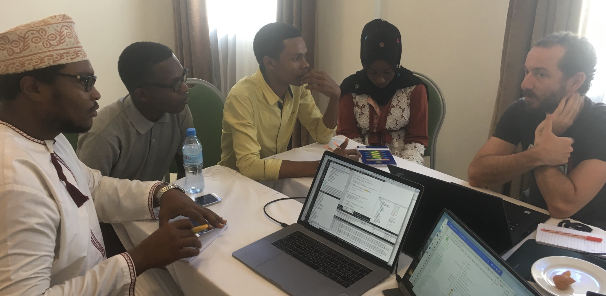
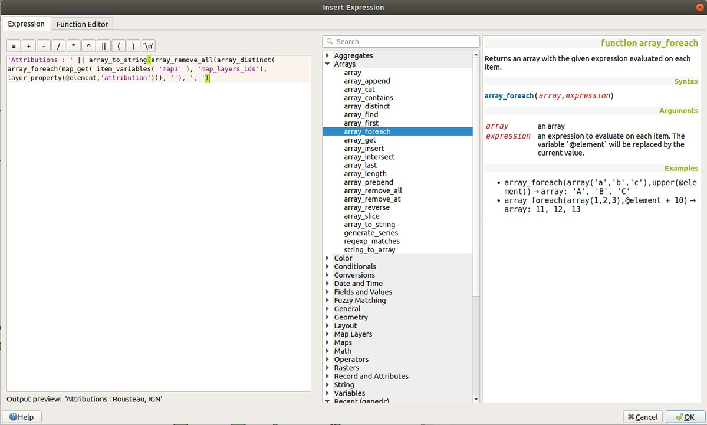
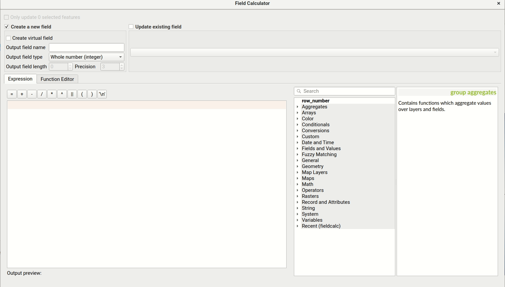
.. |image4| image:: images/entries/ee07ddaa42114f923a4fae5429bd8d2f93e66ce5.png
   :class: img-responsive img-rounded
   :target: images/entries/ee07ddaa42114f923a4fae5429bd8d2f93e66ce5.png
.. |image5| image:: images/entries/0ccd6bdae5b0df6d65c259ef08f38032fe4ee34f.gif
   :class: img-responsive img-rounded
   :target: images/entries/0ccd6bdae5b0df6d65c259ef08f38032fe4ee34f.gif
.. |image6| image:: images/entries/135600d5ba3c15dd0b4b6386cdd5cbf5a59ce3c2.png
   :class: img-responsive img-rounded
   :target: images/entries/135600d5ba3c15dd0b4b6386cdd5cbf5a59ce3c2.png
.. |image7| image:: images/entries/6891c502c6506b88398e9bfb3e266598823c5765.jpg
   :class: img-responsive img-rounded
   :target: images/entries/6891c502c6506b88398e9bfb3e266598823c5765.jpg
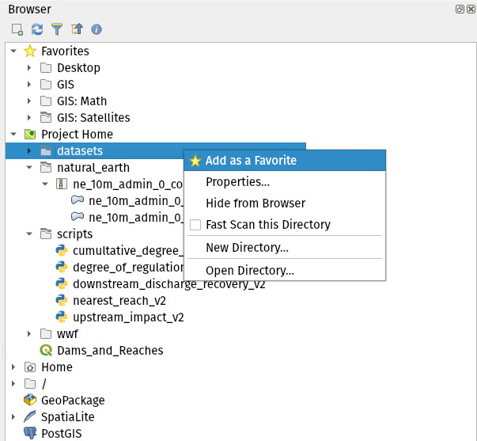
.. |image9| image:: images/entries/1bc81f284db61667934e9a7e0969303f59fe06d2.gif
   :class: img-responsive img-rounded
   :target: images/entries/1bc81f284db61667934e9a7e0969303f59fe06d2.gif
.. |image10| image:: images/entries/93836361649c4b182b46e143014d7f30be674187.png
   :class: img-responsive img-rounded
   :target: images/entries/93836361649c4b182b46e143014d7f30be674187.png
.. |image11| image:: images/entries/7c32c14544fb2f45646ea03f794e5124b4d4f9be.png
   :class: img-responsive img-rounded
   :target: images/entries/7c32c14544fb2f45646ea03f794e5124b4d4f9be.png
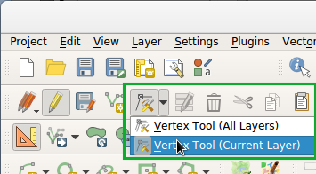
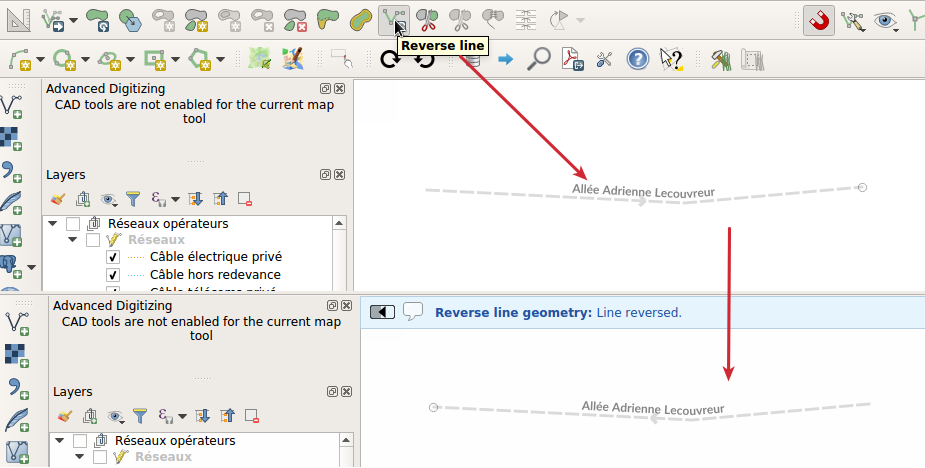
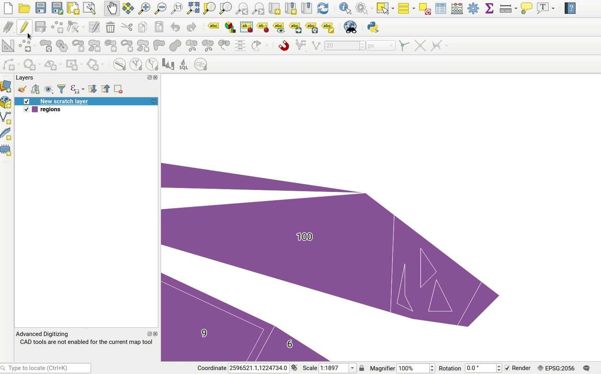
.. |image15| image:: images/entries/f5eee0b5a59923d41b427c9acc432b4c4f86da01.png
   :class: img-responsive img-rounded
   :target: images/entries/f5eee0b5a59923d41b427c9acc432b4c4f86da01.png
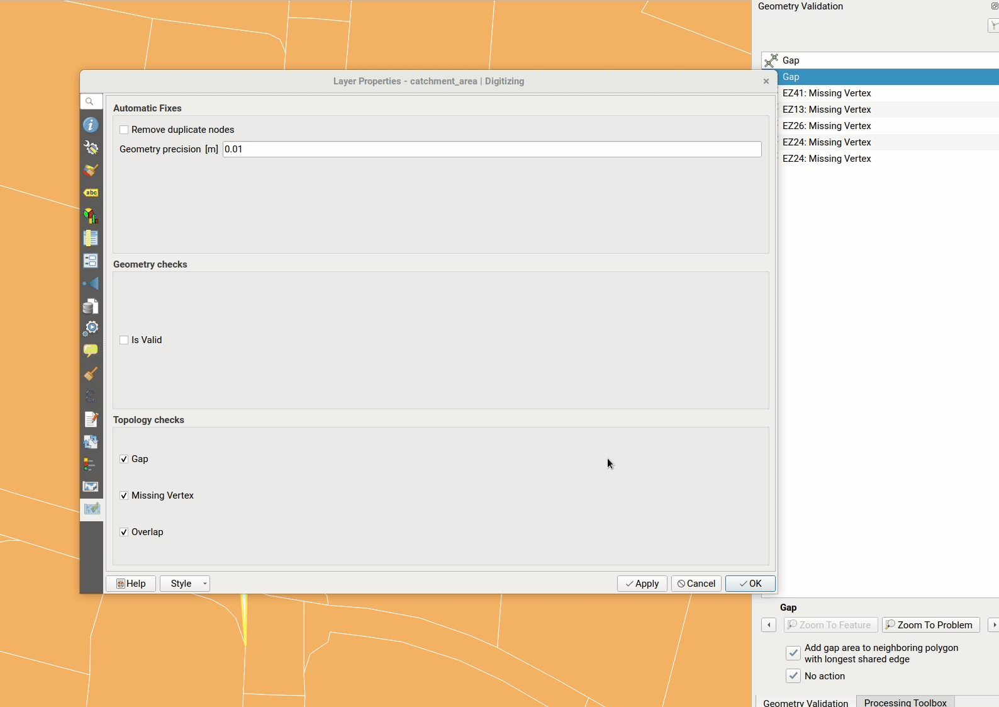
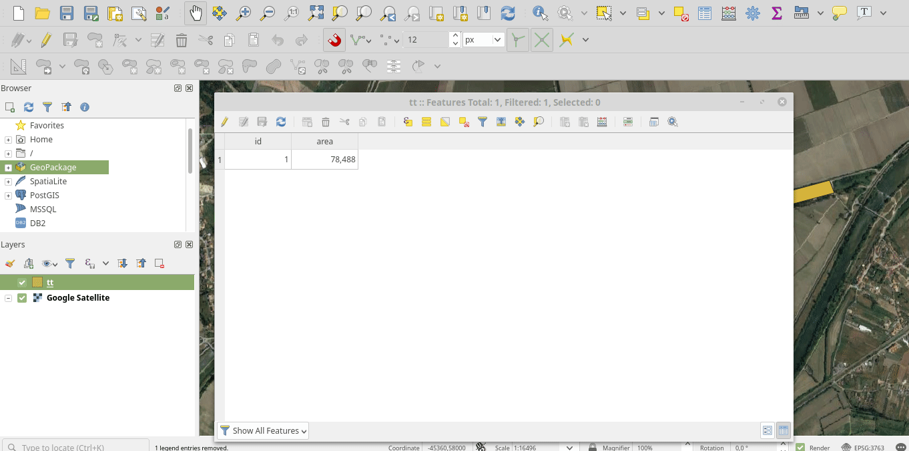
.. |image18| image:: images/entries/0e99950042f20317f1974b5f2f999cbd9233b47c.png
   :class: img-responsive img-rounded
   :target: images/entries/0e99950042f20317f1974b5f2f999cbd9233b47c.png
.. |image19| image:: images/entries/43cff3e927cdbacf08d61f979891030e48f9a451.png
   :class: img-responsive img-rounded
   :target: images/entries/43cff3e927cdbacf08d61f979891030e48f9a451.png
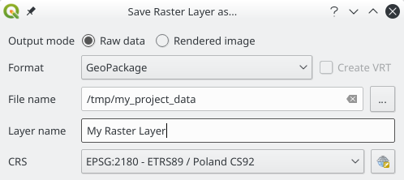
.. |image21| image:: images/entries/5990ff168d5b6b41176de4fa487964b97c32fafc.gif
   :class: img-responsive img-rounded
   :target: images/entries/5990ff168d5b6b41176de4fa487964b97c32fafc.gif
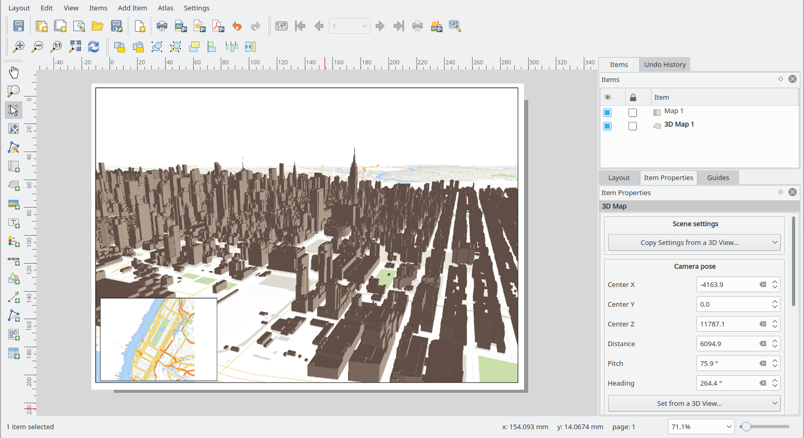
.. |image23| image:: images/entries/bdfd9b4a3d367378786fd358e13c475e7fb05816.gif
   :class: img-responsive img-rounded
   :target: images/entries/bdfd9b4a3d367378786fd358e13c475e7fb05816.gif
.. |image24| image:: images/entries/835925fb7c793d7e56a8c21a49408cd2542c973c.png
   :class: img-responsive img-rounded
   :target: images/entries/835925fb7c793d7e56a8c21a49408cd2542c973c.png
.. |image25| image:: images/entries/06f359ac4e92e415c502bc5def413563b755d8e8.jpg
   :class: img-responsive img-rounded
   :target: images/entries/06f359ac4e92e415c502bc5def413563b755d8e8.jpg
.. |image26| image:: images/entries/989a55b259fe6fd44640151cf4e2b0f0bb34573b.jpg
   :class: img-responsive img-rounded
   :target: images/entries/989a55b259fe6fd44640151cf4e2b0f0bb34573b.jpg
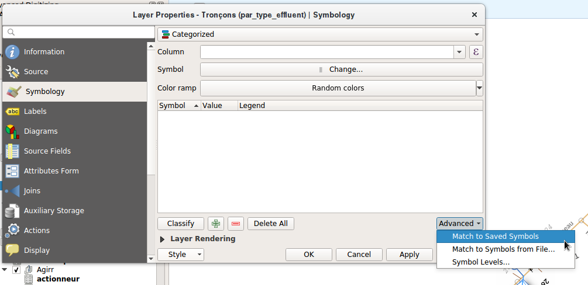
.. |image28| image:: images/entries/48295bdab734a17ef03ea6bacf182708618e0980.png
   :class: img-responsive img-rounded
   :target: images/entries/48295bdab734a17ef03ea6bacf182708618e0980.png
.. |image29| image:: images/entries/767a26455fb1a8ad8cab663a52832ef575954483.gif
   :class: img-responsive img-rounded
   :target: images/entries/767a26455fb1a8ad8cab663a52832ef575954483.gif
.. |image30| image:: images/entries/45c0ea5d14157275da7153ac31cc41987319e5eb.png
   :class: img-responsive img-rounded
   :target: images/entries/45c0ea5d14157275da7153ac31cc41987319e5eb.png
.. |image31| image:: images/entries/74ce47f09e8644a2ce6a8daeae2e37e13615b956.gif
   :class: img-responsive img-rounded
   :target: images/entries/74ce47f09e8644a2ce6a8daeae2e37e13615b956.gif
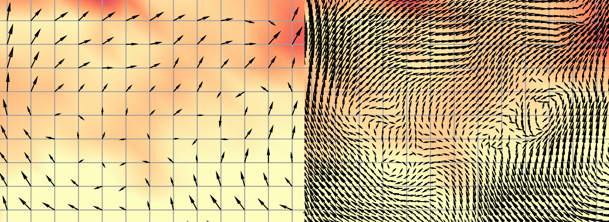
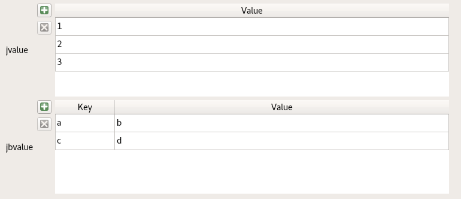
.. |image34| image:: images/entries/d0d72b47494e231b98bf3169fcbe34ca22d0624d.png
   :class: img-responsive img-rounded
   :target: images/entries/d0d72b47494e231b98bf3169fcbe34ca22d0624d.png
.. |image35| image:: images/entries/1bfc11325b9afa06d3196603749e1786f7922ffd.png
   :class: img-responsive img-rounded
   :target: images/entries/1bfc11325b9afa06d3196603749e1786f7922ffd.png
.. |image36| image:: images/entries/dbae71a0ccad069280a263fabddf3452b8165ca3.jpg
   :class: img-responsive img-rounded
   :target: images/entries/dbae71a0ccad069280a263fabddf3452b8165ca3.jpg
.. |image37| image:: images/entries/a1b22a29fc363ffc90be8f98a991913148164ef2.gif
   :class: img-responsive img-rounded
   :target: images/entries/a1b22a29fc363ffc90be8f98a991913148164ef2.gif
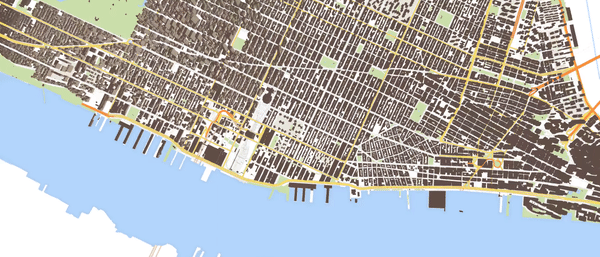
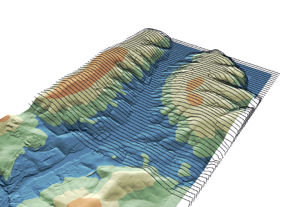
.. |image40| image:: images/entries/88fc4584f5ec10e1112813c133bf40f481af9e88.gif
   :class: img-responsive img-rounded
   :target: images/entries/88fc4584f5ec10e1112813c133bf40f481af9e88.gif
