.. _changelog36:

Changelog for QGIS 3.6
======================

|image1|

Release date: 2019-02-24

The greatest QGIS release ever! QGIS 3.6 brings a massive list of new changes - the highlights of which we will try to cover here. As always can we remind you that QGIS is an open source project and if you are able to, consider supporting our work through donations, sponsorship or contributions to the code documentation, web site and so on.

Thanks

We would like to thank the developers, documenters, testers and all the many folks out there who volunteer their time and effort (or fund people to do so). From the QGIS community we hope you enjoy this release! If you wish to donate time, money or otherwise get involved in making QGIS more awesome, please wander along to qgis.org and lend a hand!

QGIS is supported by donors and sponsors. A current list of donors who have made financial contributions large and small to the project can be seen on our donors list. If you would like to become an official project sponsor, please visit our sponsorship page for details. Sponsoring QGIS helps us to fund our six monthly developer meetings, maintain project infrastructure and fund bug fixing efforts. A complete list of current sponsors is provided below - our very great thank you to all of our sponsors!

:raw-html:`
 <!-- to be filled via javascript loading of atom feed --> 
`

QGIS is Free software and you are under no obligation to pay anything to use it - in fact we want to encourage people far and wide to use it regardless of what your financial or social status is - we believe empowering people with spatial decision making tools will result in a better society for all of humanity.

.. contents::
   :local:

Map Tools
---------

Feature: Title label decoration
~~~~~~~~~~~~~~~~~~~~~~~~~~~~~~~

A new decorator has been added to allow users to quickly add a title onto their canvases. The decorator features a background bar with customizable color and opacity.

|image2|

This feature was developed by `Mathieu Pellerin <http://imhere-asia.com/>`__

Feature: Top/bottom centering placement for decoration items
~~~~~~~~~~~~~~~~~~~~~~~~~~~~~~~~~~~~~~~~~~~~~~~~~~~~~~~~~~~~

Map canvas copyright and the newly-added title decorations can now be centered at the top or bottom of the map view.

This feature was developed by `Mathieu Pellerin <http://imhere-asia.com/>`__

Feature: Vertex tool fixes and improvements
~~~~~~~~~~~~~~~~~~~~~~~~~~~~~~~~~~~~~~~~~~~

Note: all the items mentioned below have been backported to LTR so they will also appear in QGIS 3.4.5.

Select ("lock") feature before editing
~~~~~~~~~~~~~~~~~~~~~~~~~~~~~~~~~~~~~~

In QGIS 2.18 you always had to select a feature first before editing it. In QGIS 3 there was no such thing - editing would be done on any feature any time. Now we are making the selection of feature ("lock") available again - using **right click**.

In earlier QGIS 3 versions, right click on a feature would bring up a small popup menu that offers display of vertex editor. **Now, right click on a feature will immediately show the vertex editor and disable editing of any other features.**

When a feature is "locked", it can be again unlocked by clicking on it or by clicking on an empty area - this will bring us back to the default mode when multiple features can be edited.

**When there are multiple features in one mouse location, repeated right clicks will loop over them** - with every right click you will lock to a different feature. Finally when all features have been offered, no feature will be locked and further right clicks will start the loop again.

The locking is possible when clicking a feature's vertex, edge or interior (for polygons).

Add new vertex without moving it
~~~~~~~~~~~~~~~~~~~~~~~~~~~~~~~~

It is now possible to use **Shift + double click to add a new vertex without placing it to a new location**. Sometimes this is useful when users want to add extra vertices on the existing segments.

"Current layer" mode is now the default
~~~~~~~~~~~~~~~~~~~~~~~~~~~~~~~~~~~~~~~

From the two modes of vertex tool, "all layers" used to be the default one. But from the user feedback that seemed like less common case and users prefer to have "current layer" as the default.

This feature was funded by `German QGIS user group <http://qgis.de/>`__

This feature was developed by `Martin Dobias (Lutra Consulting) <https://www.lutraconsulting.co.uk/>`__

Feature: Trim/Extend
~~~~~~~~~~~~~~~~~~~~

Unlike a number of software, the tool allows you to modify (multi)lines AND (multi)polygons. Moreover, it is not necessarily the end of the lines that is concerned; any segment of a geometry can be modified. The other side is that this can lead to invalid geometries, it is the responsibility of the user.

The tool asks you to select a limit (a segment) on which another segment will be extended or trimmed. Unlike the node tool, a check is performed to modify only the layer being edited.

When both segments are in 3D, the tool performs an interpolation on the limit segment to return the Z.

In the case of a trim, you must select the part that will be shortened by clicking on it.

.. raw:: html

   

.. raw:: html

   

This feature was funded by `Mairie de Megève <https://www.megeve.fr/>`__

This feature was developed by `Loïc Bartoletti (Oslandia) <https://www.oslandia.com>`__

Feature: Rectangle from 3 points (projected)
~~~~~~~~~~~~~~~~~~~~~~~~~~~~~~~~~~~~~~~~~~~~

There is already a method to make rectangle by 3 points where the rectangle takes a length between the first and second point and the second length is equal to the distance between the 3rd and 2nd point.

This new method allows to create a rectangle by 3 points where the second length is the distance between the point and the point projected perpendicularly on the segment (or its extension).

This feature was developed by `Loïc Bartoletti (Oslandia) <https://www.oslandia.com>`__

Feature: Identify tool for mesh layers
~~~~~~~~~~~~~~~~~~~~~~~~~~~~~~~~~~~~~~

The identify tool now works on the mesh layer. It displays the value of scalar and vector components of the mesh at the current time.

|image3|

This feature was funded by Lutra Consulting

This feature was developed by `Peter Petrik (Lutra Consulting) <https://www.lutraconsulting.co.uk>`__

Expressions
-----------

Feature: New Expression Functions
~~~~~~~~~~~~~~~~~~~~~~~~~~~~~~~~~

-  ``force_rhr``: forces polygons to follow the right hand rule, in which the area that is bounded by a polygon is to the right of the boundary. In particular, the exterior ring is oriented in a clockwise direction and the interior rings in a counter-clockwise direction.
-  ``decode_uri``: takes a layer parameter and an optional uri part parameter. It will return details about the data source of the layer. The available details depend on the data provider.
   If called with only a layer parameter, a map will be returned with all the available information. If the part is also specified, only the value for the requested part will be extracted from the map.
-  ``path`` has been added as an option for the ``layer_property`` expression function
-  ``array_sort``: sorts an array of elements
-  ``nullif``
-  sqlite\_fetch\_and\_increment
-  ``make_rectangle_3points``: Make a rectangle from 3 points. There is two options for make the rectangle by the distance or a projection. Option distance: Second distance is equal to the distance between 2nd and 3rd point. Option projected: Second distance is equal to the distance of the perpendicular projection of the 3rd point on the segment or its extension.
-  ``make_square``: Creates a square from a diagonal.
-  from\_json
-  to\_json

Feature: Square brackets to easily access map array elements
~~~~~~~~~~~~~~~~~~~~~~~~~~~~~~~~~~~~~~~~~~~~~~~~~~~~~~~~~~~~

Allows expressions like:

-  array(1,2,3)[0] -> 1
-  array(1,2,3)[2] -> 3
-  array(1,2,3)[-1] -> 3 (Python style, negative indices count from end of array)
-  array(1,2,3)[-3] -> 1
-  map('a',1,'b',2)['a'] -> 1
-  map('a',1,'b',2)['b'] -> 2

This feature was developed by Nyall Dawson, Mathieu Pellerin

Feature: New map expression variables
~~~~~~~~~~~~~~~~~~~~~~~~~~~~~~~~~~~~~

-  @map\_crs\_description: name of the coordinate reference system of the map.
-  @map\_crs\_acronym: acronym of the coordinate reference system of the map.
-  @map\_ellipsoid\_acr: acronym of the ellipsoid of the coordinate reference system of the map.
-  @map\_crs\_proj4: Proj4 definition of the coordinate reference system.
-  @map\_crs\_wkt: WKT definition of the coordinate reference system.

This feature was developed by Alexis Roy-Lizotte

Feature: New try() function to catch errors
~~~~~~~~~~~~~~~~~~~~~~~~~~~~~~~~~~~~~~~~~~~

The new try() function tries an expression and returns its value if error-free. If the expression returns an error, an alternative value will be returned when provided otherwise the function will return null.

This feature was developed by `Mathieu Pellerin <http://imhere-asia.com/>`__

User Interface
--------------

Feature: A new grayscale theme: "Blend of Gray"
~~~~~~~~~~~~~~~~~~~~~~~~~~~~~~~~~~~~~~~~~~~~~~~

A brand new UI theme has made its way into QGIS named "Blend of Gray". In addition, hundreds of fixes, tweaks, and refinements were applied to the preexisting "Night Mapping" theme.

|image4|

This feature was developed by `Mathieu Pellerin <http://imhere-asia.com/>`__

Feature: Multiline selections and editing in code/expression editors
~~~~~~~~~~~~~~~~~~~~~~~~~~~~~~~~~~~~~~~~~~~~~~~~~~~~~~~~~~~~~~~~~~~~

Holding ctrl while selecting in the QGIS expressions and Python script editors allows you to select a multi-line block of text, which can be edited all at once.

This feature was developed by `Nyall Dawson () <https://north-road.com>`__

Symbology
---------

Feature: Better handling of .XML style libraries
~~~~~~~~~~~~~~~~~~~~~~~~~~~~~~~~~~~~~~~~~~~~~~~~

The browser panel now shows QGIS style xml libraries, and these files can also be drag and dropped to a QGIS window. This opens a dialog allowing users to explore the style library, and import styles from the library to their QGIS install.

This feature was funded by `North Road <https://north-road.com>`__

This feature was developed by `Nyall Dawson (North Road) <https://north-road.com>`__

Feature: Optionally force right-hand-rule during polygon symbol rendering
~~~~~~~~~~~~~~~~~~~~~~~~~~~~~~~~~~~~~~~~~~~~~~~~~~~~~~~~~~~~~~~~~~~~~~~~~

This new option, available under the "Advanced" button for fill symbols, allows forcing rendered polygons to follow the standard "right hand rule" for ring orientation (where exterior ring is clockwise, and interior rings are all counter-clockwise).

The orientation fix is applied while rendering only, and the original feature geometry is unchanged.

This allows for creation of fill symbols with consistent appearance, regardless of the dataset being rendered and the ring orientation of individual features.

This feature was funded by QGIS User Group Germany

This feature was developed by `Nyall Dawson (North Road) <http://north-road.com>`__

Feature: Option for simple lines and marker lines to only render exterior ring or interior rings
~~~~~~~~~~~~~~~~~~~~~~~~~~~~~~~~~~~~~~~~~~~~~~~~~~~~~~~~~~~~~~~~~~~~~~~~~~~~~~~~~~~~~~~~~~~~~~~~

This new option is shown whenever a simple line symbol or marker line symbol is used as part of a fill symbol for rendering polygons. The default behavior is to render both interior and exterior rings, but this new setting allows users to set the symbol layer to render only for the exterior ring OR only for interior rings. This allows for symbolisation which wasn't directly possible before, such as a marker line with markers for interior rings angled toward the interior of the polygon.

This feature was funded by QGIS User Group Germany

This feature was developed by `Nyall Dawson (North Road) <http://north-road.com>`__

Feature: Raster image marker
~~~~~~~~~~~~~~~~~~~~~~~~~~~~

A new raster image marker symbology type was added to QGIS allowing users to use a raster, i.e. bitmap, image file to display as a marker. The raster image marker symbology permits customization of width, height, image ratio, rotation, and opacity.

Using data-defined image source, this new symbology makes for a great method to display georeferenced images on a map canvas.

|image5|

This feature was developed by `Mathieu Pellerin <http://imhere-asia.com/>`__

Feature: Raster fill can have images set to remote URLs or embedded images
~~~~~~~~~~~~~~~~~~~~~~~~~~~~~~~~~~~~~~~~~~~~~~~~~~~~~~~~~~~~~~~~~~~~~~~~~~

Just like the SVG and raster image marker, raster fill can now be set to use HTTP(s) URLs or have files directly embedded inside the symbol itself.

This feature was developed by Mathieu Pellerin

Feature: Use represention values for classified renderers
~~~~~~~~~~~~~~~~~~~~~~~~~~~~~~~~~~~~~~~~~~~~~~~~~~~~~~~~~

When a field is configured with a value relation, value map or other "representable value" and the field is used as the source for a classification renderer, the represented values will be taken to label the categories.

This feature was developed by Matthias Kuhn

Feature: Option to merge categories in categorized renderer
~~~~~~~~~~~~~~~~~~~~~~~~~~~~~~~~~~~~~~~~~~~~~~~~~~~~~~~~~~~

This change allows users to select multiple existing categories and group them into a single category, which applies to any of the values from the selection.

This allows simpler styling of layers with a large number of categories, where it may be possible to group numerous distinct categories into a smaller, more managable set of categories
which apply to multiple values.

The option is available from the right click context menu in the categories list view, whenever multiple categories are selected.

|image6|

This feature was funded by `SMEC/SJ <http://www.smec.com/en_au>`__

This feature was developed by `Nyall Dawson (North Road) <https://north-road.com>`__

Feature: Show Project Colors in color bound data defined buttons
~~~~~~~~~~~~~~~~~~~~~~~~~~~~~~~~~~~~~~~~~~~~~~~~~~~~~~~~~~~~~~~~

This adds a new "Project Colors" section in data defined buttons which are linked to a color value. The color menu contains all colors defined as part of the current project's Project Color Scheme (which is defined through project properties).

When a project color is selected from the button, the property becomes linked to that color. It will automatically follow any future changes to the color when made through project properties.

This allows users to define common colors for a project once, and then "bind" symbol, label, layout, etc colors to these preset colors. The link is live, so you change it once, and
the change is reflected EVERYWHERE. Sure beats updating a color 100 times when it's use has been scattered throughout a project's symbols, labels, etc...

This feature was funded by `North Road <https://north-road.com>`__

This feature was developed by `Nyall Dawson (North Road) <https://north-road.com>`__

Feature: Style manager dialog improvements
~~~~~~~~~~~~~~~~~~~~~~~~~~~~~~~~~~~~~~~~~~

The Style Manager dialog has seen a number of improvements:

-  A new "list view" mode has been added
-  An "all" tab has been added, which shows all matching symbols (regardless of the symbol type)

This feature was developed by `Nyall Dawson (North Road) <https://north-road.com>`__

Feature: SLD export for raster styles
~~~~~~~~~~~~~~~~~~~~~~~~~~~~~~~~~~~~~

QGIS is now able to export raster styling to sld, for example to be used in Geoserver.
See:
https://docs.geoserver.org/latest/en/user/styling/qgis/index.html#exporting-raster-symbology

|image7|

This feature was funded by OSGeo UK, GeoServer PSC, Brad Hards

This feature was developed by `Luigi Pirelli and GeoSolutions <https://www.geo-solutions.it/>`__

Digitising
----------

Feature: Georeferencer enhancements
~~~~~~~~~~~~~~~~~~~~~~~~~~~~~~~~~~~

-  add dX, dY and residual on GCP Points
-  add option to automatically save GCP Points in the raster-modified path

|image8|

This feature was developed by `Faneva Andriamiadantsoa <https://github.com/Fanevanjanahary>`__

Feature: New option to avoid minimizing georeferencer when adding points
~~~~~~~~~~~~~~~~~~~~~~~~~~~~~~~~~~~~~~~~~~~~~~~~~~~~~~~~~~~~~~~~~~~~~~~~

Users can now choose to avoid the automatic georeferencer window minimisation which occurs when adding new control points from the map canvas. This behaviour can be annoying on multi-monitor setups where it can be desirable to have both windows visible while adding points.

This feature was developed by `Nyall Dawson (North Road) <https://north-road.com>`__

Data Management
---------------

Feature: Comment option in db manager
~~~~~~~~~~~~~~~~~~~~~~~~~~~~~~~~~~~~~

This feature was developed by `Corentin Falcone (SIRS) <https://www.sirs-fr.com/sirs/fr/>`__

Forms and Widgets
-----------------

Feature: New form widget for binary (blob) fields
~~~~~~~~~~~~~~~~~~~~~~~~~~~~~~~~~~~~~~~~~~~~~~~~~

This widget is available for binary fields only (and is the default widget used for binary fields). It offers a label showing whether the blob field is empty or not, and if non-empty shows
the content size (in bytes/kb/etc).

A drop down menu button allows users to save the current binary contents of the field out to a disk based file, clear the contents of a blob field, or embed binary contents by picking a file
from their system.

This feature was funded by `SMEC/SJ <http://www.smec.com/en_au>`__

This feature was developed by `Nyall Dawson (North Road) <https://north-road.com>`__

Map Composer
------------

Feature: Grid frame improvements
~~~~~~~~~~~~~~~~~~~~~~~~~~~~~~~~

Users can now set a margin for the grid frames in layout map items. Additionally, new "Zebra (Nautical)" and "Line border (Nautical)" frame styles have been added, which show nautical-style blocks in the grid corners when a margin is set for the grid.

This feature was developed by konst

Feature: Improved handling of text and label export
~~~~~~~~~~~~~~~~~~~~~~~~~~~~~~~~~~~~~~~~~~~~~~~~~~~

When exporting a print layout to PDF or SVG formats, users are now given a choice of how text and labels within that layout should be exported. Available options are to convert all text for outlines/curves (the previous default), or to leave text and labels as text objects.

This feature was developed by `Nyall Dawson (North Road) <https://north-road.com>`__

Feature: Map labeling improvements
~~~~~~~~~~~~~~~~~~~~~~~~~~~~~~~~~~

Several improvements have been made regarding how labels are rendered within layout map items.

-  A new setting allows per-map control of how close labels are permitted to be placed to the map item's edges. Sizes can be set using mm/inches/pixels/etc, and data defined label margins are allowed.
-  A new setting allows per-map control of whether partial labels are visible in the map. This defaults to off, (unlike the canvas setting, which defaults to true for a new project) as layouts
   should always default to the settings which produce the highest quality cartographic outputs.

This feature was funded by `North Road <https://north-road.com>`__

This feature was developed by `Nyall Dawson (North Road) <https://north-road.com>`__

Feature: Rework of map item extent/scale shortcuts
~~~~~~~~~~~~~~~~~~~~~~~~~~~~~~~~~~~~~~~~~~~~~~~~~~

The buttons for setting layout map items to match the current map view (and vice versa) have been moved up to a new toolbar in map item properties windows.

New actions have also been added to set the map item's scale to match the main canvas scale, and to set the main canvas scale to match the selected layout map's scale. These mirror the existing settings for setting the extent from the canvas and pushing the extent TO the canvas.

This feature was funded by `North Road <https://north-road.com>`__

This feature was developed by `Nyall Dawson (North Road) <https://north-road.com>`__

Feature: Layout items can "block" map labels
~~~~~~~~~~~~~~~~~~~~~~~~~~~~~~~~~~~~~~~~~~~~

This feature allows other layout items (such as scalebars, north arrows, inset maps, etc) to be marked as "blockers" for the map labels in a map item. This prevents any map labels from
being placed under those items - causing the labeling engine to either try alternative placement for these labels (or discarding them altogether).

This allows for more cartographically pleasing maps -- placing labels under other items can make them hard to read, yet without this new setting it's non-trivial to get QGIS to avoid placing the labels in these obscured areas.

The blocking items are set through a map item's properties, under the label settings panel. The setting is per-map item, so you can have a scalebar block the labels for one map in your layout and not others (if you so desire!)

This feature was funded by `North Road <https://north-road.com>`__

This feature was developed by `Nyall Dawson (North Road) <https://north-road.com>`__

Feature: Warnings on exports
~~~~~~~~~~~~~~~~~~~~~~~~~~~~

When exporting print layouts, QGIS now automatically checks the layout for common mistakes and warns users when they are found:

-  Scalebars not linked to a map item
-  Picture items with broken or missing paths, or linked to unreadable image files
-  Map overviews no longer linked to a valid map item

This feature was funded by `SMEC/SJ <http://www.smec.com/en_au>`__

This feature was developed by `Nyall Dawson (North Road) <https://north-road.com>`__

Feature: Control over stacking position of map overview extents
~~~~~~~~~~~~~~~~~~~~~~~~~~~~~~~~~~~~~~~~~~~~~~~~~~~~~~~~~~~~~~~

QGIS allows overview extents to be drawn below map labels (the new default), but in 3.6 choices have been added for drawing them below all map layers, or above/below a specific map layer. This allows users to control exactly where in the map item's layer stack the overview will be placed, e.g. allowing them to draw a overview extent below some feature layers such as roads whilst drawing it above other background layers.

This feature was developed by `Nyall Dawson (North Road) <https://north-road.com>`__

Feature: New expression variables for legend items
~~~~~~~~~~~~~~~~~~~~~~~~~~~~~~~~~~~~~~~~~~~~~~~~~~

New expression variables have been added for use in data defined expressions in layout legend items, including:

-  @legend\_title
-  @legend\_column\_count
-  @legend\_split\_layers
-  @legend\_wrap\_string
-  @legend\_filter\_by\_map
-  @legend\_filter\_out\_atlas

If the legend is linked to a map, then expressions used in that legend will also have access to the linked variables, including @map\_scale, @map\_extent, etc.

Additionally, symbols rendered as part of a legend now use the full available expression context for the legend. This means the symbols will have access to variables like the current atlas feature.

This feature was developed by Alexis Roy-Lizotte

Feature: Expressions inside legend item text
~~~~~~~~~~~~~~~~~~~~~~~~~~~~~~~~~~~~~~~~~~~~

This feature allows for expressions to be embedded directly inside legend item text (e.g. group, subgroup and item text). The expressions are evaluated at render time, with full knowledge of the legend's expression context (so can utilise variables from the layout/layout item/etc)

There's no UI for this yet (that will come in 3.8), but expressions are entered using the standard [% 1 + 2 %] format.

E.g. a legend item text of

::

    My layer (rendered at 1:[% @map_scale %])

will show in the output as

::

    My layer (rendered at 1:1000)

This feature was developed by `Nyall Dawson (North Road) <https://north-road.com>`__

Analysis Tools
--------------

Feature: Hardware acceleration for raster calculator
~~~~~~~~~~~~~~~~~~~~~~~~~~~~~~~~~~~~~~~~~~~~~~~~~~~~

OpenCL acceleration is now available by default for raster calculator operations.

This feature was funded by Alessandro Pasotti - ItOpen

This feature was developed by `Alessandro Pasotti <https://www.itopen.it>`__

Feature: Mesh calculator
~~~~~~~~~~~~~~~~~~~~~~~~

Similar to raster calculator, mesh calculator works on mesh layers. In addition to the general functions, mesh calculator also provides time aggregate functions. For example, if you have a netcdf with daily temperature over a month, you can calculate the average temperature for the whole month for each cell. The output can be filtered by time span or spatial extent.

This feature was funded by Lutra Consulting

This feature was developed by `Peter Petrik (Lutra Consulting) <https://www.lutraconsulting.co.uk>`__

Processing
----------

Feature: New algorithm "Remove duplicates by attribute"
~~~~~~~~~~~~~~~~~~~~~~~~~~~~~~~~~~~~~~~~~~~~~~~~~~~~~~~

Allows for removal of duplicate features, identified using the values in one (or more) field values from the input features. Optionally any discarded (duplicate) features can be saved to a separate sink.

|image9|

This feature was funded by `SMEC/SJ <http://www.smec.com/en_au>`__

This feature was developed by `Nyall Dawson (North Road) <https://north-road.com>`__

Feature: Explode HStore algorithm
~~~~~~~~~~~~~~~~~~~~~~~~~~~~~~~~~

This algorithm creates a copy of an input layer and adds a new field for every unique key found in a HStore type field.
For instance, a HStore field is often present in an OSM dataset ("other\_tags").

|image10|

This feature was developed by `Etienne Trimaille <https://github.com/Gustry>`__

Feature: Force right-hand-rule
~~~~~~~~~~~~~~~~~~~~~~~~~~~~~~

This new algorithm forces polygon geometries to respect the Right-Hand-Rule, in which the area that is bounded by a polygon is to the right of the boundary. In particular, the exterior ring is oriented in a clockwise direction and the interior rings in a counter-clockwise direction.

|image11|

This feature was funded by QGIS User Group Germany

This feature was developed by `Nyall Dawson (North Road) <https://north-road.com>`__

Feature: Extract Binary Field algorithm
~~~~~~~~~~~~~~~~~~~~~~~~~~~~~~~~~~~~~~~

This new algorithm allows users to extract binary fields to files.

|image12|

This feature was funded by `SMEC/SJ <http://www.smec.com/en_au>`__

This feature was developed by `Nyall Dawson (North Road) <https://north-road.com>`__

Feature: Split Lines by Maximum Length algorithm
~~~~~~~~~~~~~~~~~~~~~~~~~~~~~~~~~~~~~~~~~~~~~~~~

This algorithm takes an input (multi)line (or curve) layer, and splits each feature into multiple parts such that no part is longer then the specified maximum length.

Supports data-defined maximum length property, and edit in place operation.

|image13|

This feature was developed by Nyall Dawson, Nathan Woodrow

Feature: New parameter type for authentication config
~~~~~~~~~~~~~~~~~~~~~~~~~~~~~~~~~~~~~~~~~~~~~~~~~~~~~

A new parameter type for processing algorithms, QgsProcessingParameterAuthConfig, has been added, allowing selection from available authentication configurations (and creation of new ones).

It allows creation of processing algorithm which can fully take advantage of QGIS' mature authentication handling, avoiding the need to use insecure string parameters for users to input sensitive logon credentials.

QgsProcessingParameterAuthConfig parameters are evaluated using QgsProcessingAlgorithm.parameterAsString(), which returns the selected authentication configuration ID.

This feature was funded by `SMEC/SJ <http://www.smec.com/en_au>`__

This feature was developed by `Nyall Dawson (North Road) <https://north-road.com>`__

Feature: resampling and format options in the gdaladdo algorithm
~~~~~~~~~~~~~~~~~~~~~~~~~~~~~~~~~~~~~~~~~~~~~~~~~~~~~~~~~~~~~~~~

This feature was developed by Alex Bruy

Feature: Raster zonal stats algorithm
~~~~~~~~~~~~~~~~~~~~~~~~~~~~~~~~~~~~~

This algorithm calculates statistics for a raster layer's values, categorized by zones defined in another raster layer.

|image14|

This feature was developed by `Nyall Dawson (North Road) <https://north-road.com>`__

Feature: Extract Z values and Extract M values algorithms
~~~~~~~~~~~~~~~~~~~~~~~~~~~~~~~~~~~~~~~~~~~~~~~~~~~~~~~~~

These algorithms allow users to convert z or m values present in feature geometries to attributes in the layer.

By default the z/m value from the first vertex in the feature is extracted, but optionally statistics can be calculated on ALL the z/m values from the geometry (e.g. calculating
mean/min/max/sum/etc of z values).

This feature was developed by `Nyall Dawson (North Road) <https://north-road.com>`__

Feature: Geodesic line split at antimeridian algorithm
~~~~~~~~~~~~~~~~~~~~~~~~~~~~~~~~~~~~~~~~~~~~~~~~~~~~~~

This algorithm splits a line into multiple geodesic segments, whenever the line crosses the antimeridian (±180 degrees longitude). Splitting at the antimeridian helps the visual display of the lines in some projections. The returned geometry will always be a multi-part geometry.

Whenever line segments in the input geometry cross the antimeridian, they will be split into two segments, with the latitude of the breakpoint being determined using a geodesic line connecting the points either side of this segment. The current project ellipsoid setting will be used when calculating this breakpoint.

If the input geometry contains M or Z values, these will be linearly interpolated for the new vertices created at the antimeridian.

Supports in-place edit mode also.

This feature was developed by `Nyall Dawson (North Road) <https://north-road.com>`__

Feature: Geodesic mode for "Join by Lines (Hub lines)" algorithm
~~~~~~~~~~~~~~~~~~~~~~~~~~~~~~~~~~~~~~~~~~~~~~~~~~~~~~~~~~~~~~~~

This allows optional creation of geodesic lines, which represent the shortest distance between the points based on the ellipsoid.

When geodesic mode is used, it is possible to split the created lines at the antimeridian (±180 degrees longitude), which can improve rendering of the lines. Additionally, the distance between vertices can be specified. A smaller distance results in a denser, more accurate line.

This feature was developed by `Nyall Dawson (North Road) <https://north-road.com>`__

Feature: Raster Surface Volume algorithm
~~~~~~~~~~~~~~~~~~~~~~~~~~~~~~~~~~~~~~~~

The SAGA raster surface volume has been ported to a native QGIS algorithm. The SAGA version of this algorithm is of limited use in QGIS, because the volume calculated is embedded only in the SAGA terminal output. This prevents it being saved to a file, or reused within a model as an input to a later model step. Accordingly, the algorithm has been ported across to a native QGIS c++ algorithm. The algorithm duplicates the SAGA algorithm 1:1, but outputs the volume (and area) to either a HTML report, or a vector table. Additionally, the outputs are exported as numeric outputs from the algorithm, allowing them to be re-used within models.

|image15|

This feature was developed by `Nyall Dawson (North Road) <https://north-road.com>`__

Feature: Resurrected model to Python script functionality
~~~~~~~~~~~~~~~~~~~~~~~~~~~~~~~~~~~~~~~~~~~~~~~~~~~~~~~~~

The 2.x ability to directly convert a Processing model to an equivalent Python script has been resurrected and updated for the 3.x Processing API.

|image16|

This feature was funded by `Solspec <http://solspec.io>`__

This feature was developed by `Nyall Dawson (North Road) <https://north-road.com>`__

Application and Project Options
-------------------------------

Feature: Delete settings from the Advanced tab in options
~~~~~~~~~~~~~~~~~~~~~~~~~~~~~~~~~~~~~~~~~~~~~~~~~~~~~~~~~

This change adds a new right click menu to the settings shown in the "Advanced" tab in the settings dialog, which allows users to remove that setting (or group of settings).

|image17|

This feature was funded by `North Road <https://north-road.com>`__

This feature was developed by `Nyall Dawson (North Road) <https://north-road.com>`__

Browser
-------

Feature: Add "export to file" options for raster and vector layers within the browser
~~~~~~~~~~~~~~~~~~~~~~~~~~~~~~~~~~~~~~~~~~~~~~~~~~~~~~~~~~~~~~~~~~~~~~~~~~~~~~~~~~~~~

Allows for direct export of these files (e.g. to a different format, crs, etc) without having to actually load them into a project first.

|image18|

This feature was funded by `Nyall Dawson (North Road) <https://north-road.com>`__

This feature was developed by `Nyall Dawson (North Road) <https://north-road.com>`__

Feature: Native file/folder properties
~~~~~~~~~~~~~~~~~~~~~~~~~~~~~~~~~~~~~~

You can now right click on a file or folder within the browser, and select "File Properties" or "Directory Properties" to open the native file/folder properties dialog for that entry. This allows rapid access to operating system file or folder properties, such as file permissions and sharing options.

This feature was funded by `North Road <s://north-road.com>`__

This feature was developed by `Nyall Dawson (North Road) <https://north-road.com>`__

Feature: Preview layers and attributes
~~~~~~~~~~~~~~~~~~~~~~~~~~~~~~~~~~~~~~

QGIS 3.6 brings back the functionality from the old 2.18 standalone "browser" application to preview layers and their attributes. This functionality has been moved to the inbuilt browser panel, and is available by right-clicking on a layer and selecting "properties" (or by clicking the "enable properties widget" button in the browser toolbar).

|image19|

This feature was funded by `SMEC/SJ <http://www.smec.com/en_au>`__

This feature was developed by `Nyall Dawson (North Road) <https://north-road.com>`__

Feature: Explore QGS/QGZ project files in the browser
~~~~~~~~~~~~~~~~~~~~~~~~~~~~~~~~~~~~~~~~~~~~~~~~~~~~~

Previous versions of QGIS would show QGS/QGZ project files in the browser, allowing them to be opened as the new active project. In QGIS 3.6 this functionality has been extended, and project files can now be explored directly WITHIN the browser. Projects are now expandable items, and expanding them shows the full project structure of groups and layers. Any layer can then be dragged and dropped to the current project.

This feature was funded by `North Road <https://north-road.com>`__

This feature was developed by `Nyall Dawson (North Road) <https://north-road.com>`__

Feature: Directly Create Geopackage and Shapefiles
~~~~~~~~~~~~~~~~~~~~~~~~~~~~~~~~~~~~~~~~~~~~~~~~~~

Right clicking a directory in the browser panel now shows a "New" menu, containing items for creating a new Geopackage, Shapefile, or subdirectory under the selected directory.

|image20|

This feature was funded by `North Road <https://north-road.com>`__

This feature was developed by `Nyall Dawson (North Road) <https://north-road.com>`__

Feature: Open Terminal at Path
~~~~~~~~~~~~~~~~~~~~~~~~~~~~~~

A new context menu entry has been added for browser panel directory items to open a new terminal window at that directory.

On Windows, this new terminal inherits the QGIS environment, so GDAL commands and Python scripts which use PyQGIS commands work without any further environment setup required.

Terminal hackers rejoice!

|image21|

This feature was developed by `Nyall Dawson (North Road) <https://north-road.com>`__

General
-------

Feature: Improved "missing layer" handling on project load
~~~~~~~~~~~~~~~~~~~~~~~~~~~~~~~~~~~~~~~~~~~~~~~~~~~~~~~~~~

|image22|

This feature was funded by `A.R.P.A. Piemonte <http://www.arpa.piemonte.it/>`__

This feature was developed by `Alessandro Pasotti <http://www.itopen.it>`__

Feature: Optional setting for disabling version checks
~~~~~~~~~~~~~~~~~~~~~~~~~~~~~~~~~~~~~~~~~~~~~~~~~~~~~~

A new setting, "allowVersionCheck" has been added to the QGIS configuration ini file. If set to true (the default), users may control whether the version check is enabled or disabled through the QGIS settings dialog. When this setting is set to false, no version checking will be performed AND users will NOT have an option to enable this check in the settings dialog.

This setting is intended for use in enterprise installs where QGIS version management is handled centrally.

This feature was funded by `SMEC/SJ <http://www.smec.com/en_au>`__

This feature was developed by `Nyall Dawson (North Road) <https://north-road.com>`__

Feature: Add a toggle action to vector layer legend items
~~~~~~~~~~~~~~~~~~~~~~~~~~~~~~~~~~~~~~~~~~~~~~~~~~~~~~~~~

|image23|

This feature was funded by `A.R.P.A. Piemonte <http://www.arpa.piemonte.it>`__

This feature was developed by `Alessandro Pasotti <https://www.itopen.it>`__

Data Providers
--------------

Feature: Open service info for ArcGIS Feature Server layers
~~~~~~~~~~~~~~~~~~~~~~~~~~~~~~~~~~~~~~~~~~~~~~~~~~~~~~~~~~~

ArcGIS Feature Server layers have a new right click menu option in the browser panel, allowing users to directly open the service information web page for the selected layer.

This feature was funded by `SMEC/SJ <http://www.smec.com/en_au>`__

This feature was developed by `Nyall Dawson (North Road) <https://north-road.com>`__

Feature: Binary blob support for OGR providers
~~~~~~~~~~~~~~~~~~~~~~~~~~~~~~~~~~~~~~~~~~~~~~

Instead of converting binary fields to truncated strings, these values are now retrievable as their original binary contents. This allows for plugins and scripts to utilise binary fields, such as extracting their contents.

Additionally, new binary fields can be created for compatible data sources.

This feature was funded by `SMEC/SJ <http://www.smec.com/en_au>`__

This feature was developed by `Nyall Dawson (North Road) <https://north-road.com>`__

Feature: ArcGIS Feature Server picture marker and picture fill support
~~~~~~~~~~~~~~~~~~~~~~~~~~~~~~~~~~~~~~~~~~~~~~~~~~~~~~~~~~~~~~~~~~~~~~

When loading a Feature Server layer with picture marker or picture fill symbology, QGIS will automatically convert the ESRI picture marker and fill symbols and use them as the default style for the layer.

This feature was funded by `SMEC/SJ <http://www.smec.com/en_au>`__

This feature was developed by Nyall Dawson, Mathieu Pellerin

Feature: ArcGIS Feature Server labeling support
~~~~~~~~~~~~~~~~~~~~~~~~~~~~~~~~~~~~~~~~~~~~~~~

When a Feature Server layer has labeling defined by the server, these labeling settings will be automatically used by default when loading the layer into QGIS.

This feature was developed by Mathieu Pellerin

Feature: Boolean and binary field support for memory layers
~~~~~~~~~~~~~~~~~~~~~~~~~~~~~~~~~~~~~~~~~~~~~~~~~~~~~~~~~~~

Memory ("Temporary scratch") layers can now use binary and boolean (true/false) field types.

This feature was funded by `North Road <https://north-road.com>`__

This feature was developed by `Nyall Dawson (North Road) <https://north-road.com>`__

Feature: JSON Support for GeoPackage
~~~~~~~~~~~~~~~~~~~~~~~~~~~~~~~~~~~~

Support for JSON allows to store structured data inside a single field in GeoPackage files.

Data which is saved as JSON can be represented and edited in

-  ValueRelation widgets with allow multiple selection activated
-  KeyValue widgets
-  List widgets
-  or the `QML widget which also supports visualizing JSON data <https://www.opengis.ch/2018/11/13/visualize-postgres-json-data-in-qml-widgets/>`__

This feature was funded by `Kanton Zug, Amt für Geoinformation <https://geo.zg.ch/>`__

This feature was developed by David Signer (OPENGIS.ch)

Feature: Postgres provider: save primary key selection
~~~~~~~~~~~~~~~~~~~~~~~~~~~~~~~~~~~~~~~~~~~~~~~~~~~~~~

When a view loaded from Data Source Managers's PostgreSQL tab you can select the key columns of the view (by default the first column is used, which can be wrong). This commit stores that selection in the settings, so that it doesn't have to be reselected on subsequent loads. This stored selection is also used when adding the loading from the browser.

This feature was developed by Jürgen Fischer

Feature: ArcGIS Feature Server multi-field unique value support
~~~~~~~~~~~~~~~~~~~~~~~~~~~~~~~~~~~~~~~~~~~~~~~~~~~~~~~~~~~~~~~

QGIS can now display a Feature Server layer with a multi-fiend unique value renderer setup.

This feature was developed by `Mathieu Pellerin <http://imhere-asia.com/>`__

QGIS Server
-----------

Feature: Possibility to set ATLAS\_PK in GetPrint request to print atlas sheet(s)
~~~~~~~~~~~~~~~~~~~~~~~~~~~~~~~~~~~~~~~~~~~~~~~~~~~~~~~~~~~~~~~~~~~~~~~~~~~~~~~~~

The new GetPrint parameter accepts the primary key(s) for which atlas sheets should be printed, separated by comma,

Such a request would look like:

::

    https://yourserver.name/path/to/qgisproject?SERVICE=WMS&REQUEST=GetPrint
    &TEMPLATE=A4&FORMAT=pdf&ATLAS_PK=1,3,7

One can also provide an asterisk (\*) for ATLAS\_PK to request all features of an atlas. To protect the server against requesting too many features, it is possible to restrict it to a defined maximum of features that can be requested at one time (see attached screenshot).

As clients may not know which template has an atlas and which attribute(s) are the primary key of the coverage layer, this new feature also adds this information to the GetProjectSettings response of the WMS service.

|image24|

This feature was funded by `Kanton Zug, Amt für Geoinformation <https://geo.zg.ch/>`__

This feature was developed by Marco Hugentobler

Feature: WMTS tile matrices configuration
~~~~~~~~~~~~~~~~~~~~~~~~~~~~~~~~~~~~~~~~~

In QGIS Server 3.4, the WMTS API was added in which the tile matrices are calculated except for EPSG:3857 and EPSG:4326.

This change adds the capability to select the tile matrices to use with the project and to configure the top-left corner and the last level of the tile matrix. In the case of EPSG:3857 and EPSG:4326, the user can only choose the last level of the tile matrices.

This feature was funded by Ifremer

This feature was developed by 3liz

Feature: Add JSON format for WMS GetFeatureInfo request
~~~~~~~~~~~~~~~~~~~~~~~~~~~~~~~~~~~~~~~~~~~~~~~~~~~~~~~

Thanks to this new feature, the FORMAT parameter of GetFeatureInfo for the WMS service may take 'application/json' or 'application/geo+json' values. In this case, the document returned by the server looks something like this:

::

    {"type": "FeatureCollection",
        "features":[
        {
           "type":"Feature",
           "id":"testlayer",
           "geometry":
           {"type": "Point", "coordinates": [913204.9128, 5606011.4565]},
           "properties":{
               "id":3,
               "name":"three",
               "utf8nameè":"three"
           }
        }]
    }

This feature was funded by `Veolia <https://www.veolia.com>`__

This feature was developed by `Paul Blottiere (Oslandia) <http://oslandia.com/>`__

Plugins
-------

Feature: DB Manager: Adds buttons to load and save an external SQL file
~~~~~~~~~~~~~~~~~~~~~~~~~~~~~~~~~~~~~~~~~~~~~~~~~~~~~~~~~~~~~~~~~~~~~~~

The new buttons allow the user to load and save the query in an external SQL file.

|image25|

This feature was developed by `Loïc Bartoletti (Oslandia) <https://www.oslandia.com>`__

Programmability
---------------

Feature: New class QgsExifTools
~~~~~~~~~~~~~~~~~~~~~~~~~~~~~~~

Contains utilities for retrieving the geotag from images and for setting an image's geotag.

Working with geotags (before this class!) is super-annoying and fiddly and relies on either parsing command line tools or depending on non-standard Python libraries which are
not available everywhere, and often very difficult for users on certain platforms to get installed and working correctly.

With this class we have stable methods for geotag getting/setting which are universally available and can be used safely by plugins and scripts.

This feature was developed by `Nyall Dawson (North Road) <https://north-road.com>`__

Feature: Iterate over parts of a QgsGeometry
~~~~~~~~~~~~~~~~~~~~~~~~~~~~~~~~~~~~~~~~~~~~

This new PyQGIS API allows easy iteration over all the parts of a geometry, regardless of the geometry's type. E.g.

::

    geometry = QgsGeometry.fromWkt( 'MultiPoint( 0 0, 1 1, 2 2)' )
    for part in geometry.parts():
      print(part.asWkt())

    geometry = QgsGeometry.fromWkt( 'LineString( 0 0, 10 10 )' )
    for part in geometry.parts():
      print(part.asWkt())

There are two iterators available. QgsGeometry.parts() gives a non-const iterator, allowing the parts to be modified in place:

::

    geometry = QgsGeometry.fromWkt( 'MultiPoint( 0 0, 1 1, 2 2)' )
    for part in geometry.parts():
       part.transform(ct)

For a const iteration, calling .const\_parts() gives a const iterator, which cannot edit the parts but avoids a potentially expensive QgsGeometry detach and clone

::

    geometry = QgsGeometry.fromWkt( 'MultiPoint( 0 0, 1 1, 2 2)' )
    for part in geometry.const_parts():
       print(part.x())

This feature was funded by `North Road <https://north-road.com>`__

This feature was developed by `Nyall Dawson (North Road) <https://north-road.com>`__

Feature: Improved QgsLineString PyQGIS API
~~~~~~~~~~~~~~~~~~~~~~~~~~~~~~~~~~~~~~~~~~

Some nice API additions have been made to the QgsLineString API:

-  len(QgsCurve) returns number of points in curve
-  raise IndexErrors when calling pointN, xAt, yAt, zAt, mAt, setXAt, setYAt, setMAt, setZAt with invalid vertex indices
-  Add [] getter for retrieving specific vertices, eg. ls[0] returns QgsPoint(...)
-  Add [] setter for setting specific (existing) vertices, e.g. ls[1] = QgsPoint(1,2)
-  Add del support for removing vertices, e.g. del ls[1] removes the second vertex

This feature was funded by `North Road <https://north-road.com>`__

This feature was developed by `Nyall Dawson (North Road) <https://north-road.com>`__

Feature: PyQGIS Geometry Collection API improvements
~~~~~~~~~~~~~~~~~~~~~~~~~~~~~~~~~~~~~~~~~~~~~~~~~~~~

The PyQGIS API for working with geometry collections has been improved:

-  Calling removeGeometry with an invalid index will now raise an IndexError
-  Calling collection[0] will return the first geometry in the collection, collection[1] the second, etc. And negative indices return from the end of the collection, so collection[-1] returns the last geometry in the collection.
-  Geometries can be deleted by calling ``del collection[1]`` (deletes the second geometry from the collection). Also supports negative indices to count from the end of the collection.

Additionally, you can now easily iterate over the geometries in the collection, allowing this type of code:

::

    gc = QgsGeometryCollection()
    gc.fromWkt('GeometryCollection( Point(1 2), Point(11 12), LineString(33 34, 44 45))')
    for part in gc:
      print(part.asWkt())

This feature was funded by `North Road <https://north-road.com>`__

This feature was developed by `Nyall Dawson (North Road) <https://north-road.com>`__

Feature: Easier Processing algorithm creation via @alg decorator
~~~~~~~~~~~~~~~~~~~~~~~~~~~~~~~~~~~~~~~~~~~~~~~~~~~~~~~~~~~~~~~~

Allows the following to define processing scripts without the need for implementing a custom class:

from qgis.processing import alg

| @alg(name="test2", label="test 2", group="test", groupid="test")
| @alg.input(type=alg.STRING, name="IN1", label="In string")
| @alg.input(type=str, name="IN2", label="In string 1", optional=True)
| @alg.input(type=str, name="IN3", label="In string 2")
| @alg.input(type=alg.SINK, name="SINK", label="Sink it!")
| @alg.output(type=str, name="OUT", label="WAT")
| @alg.output(type=alg.MAPLAYER, name="OUT2", label="WAT")
| @alg.output(type=alg.VECTOR\_LAYER, name="VECTOR\_LAYER", label="WAT")
| def testalg(instance, parms, context, feedback, inputs):
| """
| This is a test function that does stuff
| """
| feedback.pushInfo("We got these inputs!!")
| feedback.pushInfo(inputs['IN1'])
| feedback.pushInfo(inputs['IN2'])
| feedback.pushInfo(inputs['IN3'])
| return {
| "OUT2": "wat"
| }

This feature was developed by Nathan Woodrow

Feature: Blocking (non-async) network requests
~~~~~~~~~~~~~~~~~~~~~~~~~~~~~~~~~~~~~~~~~~~~~~

New PyQGIS API has been added for performing SAFE blocking requests. It is thread safe and has full support for QGIS proxy and authentication settings.

::

    reply = QgsNetworkAccessManager.blockingGet(...)
    reply = QgsNetworkAccessManager.blockingPut(...)

This API should be used whenever a blocking network request is required. Unlike implementations which rely on QApplication::processEvents() or creation of a QEventLoop, this class is completely thread safe and can be used on either the main thread or background threads without issue.

Redirects are automatically handled by the class.

This feature was developed by `Nyall Dawson (North Road) <http://north-road.com>`__

Feature: Custom validity checks on layout exports
~~~~~~~~~~~~~~~~~~~~~~~~~~~~~~~~~~~~~~~~~~~~~~~~~

See https://north-road.com/2019/01/14/on-custom-layout-checks-in-qgis-3-6-and-how-they-can-do-your-work-for-you/

This feature was funded by `SMEC/SJ <http://www.smec.com/en_au>`__

This feature was developed by `Nyall Dawson (North Road) <http://north-road.com>`__

Feature: API for calculating Geodesic lines
~~~~~~~~~~~~~~~~~~~~~~~~~~~~~~~~~~~~~~~~~~~

New PyQGIS API for calculation of geodesic lines (shortest distance on an ellipsoid) has been added to QgsDistanceArea, which utilises the mature geographiclib library for geodesic calculations.

-  QgsDistanceArea.geodesicLine : calculates the geodesic line between two points
-  QgsDistanceArea.latitudeGeodesicCrossesAntimeridian calculates the latitude at which the geodesic line joining two points crosses the antimeridian
-  QgsDistanceArea.splitGeometryAtAntimeridian : splits a (multi)linestring at the antimeridian, using geodesic lines to calculate the exact point at which the split occurs on the antimeridian

This feature was developed by `Nyall Dawson (North Road) <http://north-road.com>`__

Feature: New class QgsQuadrilateral
~~~~~~~~~~~~~~~~~~~~~~~~~~~~~~~~~~~

QgsRectangle does not propose the support of orientation or Z, since its role is for the extent. A new class called QgsQuadrilateral to manage 4 vertex polygons is created. For the moment, there are only rectangles, but it will be possible to add the other shapes later.

This refactoring simplifies maptools and allows you to use the QgsQuadrilateral class in other tools.

In addition, it will allow a better management of the Z for rectangles by 3 points. Today the first Z is used, now the points will have their Z and the 4th will be projected on the plane.

This feature was developed by `Loïc Bartoletti (Oslandia) <https://www.oslandia.com>`__

3D Features
-----------

Feature: Terrain shading
~~~~~~~~~~~~~~~~~~~~~~~~

This adds new options for user to choose how the terrain should be rendered:
- shading disabled - color of terrain is determined only from map texture
- shading enabled - color of terrain is determined using Phong's shading model, taking into account map texture, terrain normal vector, scene light(s) and terrain material's ambient+specular colors and shininess

Optionally, terrains can be shaded using a preset map theme.

This feature was developed by Martin Dobias (Lutra Consulting)

Feature: Configuration of lights in 3D map scenes
~~~~~~~~~~~~~~~~~~~~~~~~~~~~~~~~~~~~~~~~~~~~~~~~~

This feature adds a section to define point lights in 3D scenes. Up to 8 lights are supported (limitation by implementation of materials). For each light one can set the position, intensity, color and attenuation.

This feature was developed by Martin Dobias (Lutra Consulting)

Feature: Rule-based 3D renderer
~~~~~~~~~~~~~~~~~~~~~~~~~~~~~~~

|image26|

This feature was funded by QGIS community

This feature was developed by `Martin Dobias (Lutra Consulting) <https://www.lutraconsulting.co.uk>`__

Feature: Support for mesh layer (faces) in 3D
~~~~~~~~~~~~~~~~~~~~~~~~~~~~~~~~~~~~~~~~~~~~~

With this feature, you can use mesh layer in 3D scene,

|image27|

This feature was funded by Lutra Consulting

This feature was developed by `Peter Petrik (Lutra Consulting) <https://www.lutraconsulting.co.uk>`__

Notable Fixes
-------------

Feature: Bug fixes by Alessandro Pasotti
~~~~~~~~~~~~~~~~~~~~~~~~~~~~~~~~~~~~~~~~

+--------------------------------------------------------------------------------------------------------------------------------------------------------------------------+-----------------------------------------------------+------------------------------------------------------------------------------------------------------------------+-----------------------------------------------------------------------------------+
| Bug Title                                                                                                                                                                | URL issues.qgis.org (if reported)                   | URL Commit (Github)                                                                                              | 3.4 backport commit (GitHub)                                                      |
+==========================================================================================================================================================================+=====================================================+==================================================================================================================+===================================================================================+
| QGIS Server: WFS issue using the EXP\_FILTER parameter                                                                                                                   | `#20927 <https://issues.qgis.org/issues/20927>`__   | `PR #8924 <https://github.com/qgis/QGIS/pull/8924>`__                                                            | Done                                                                              |
+--------------------------------------------------------------------------------------------------------------------------------------------------------------------------+-----------------------------------------------------+------------------------------------------------------------------------------------------------------------------+-----------------------------------------------------------------------------------+
| GetFeatureInfo response empty for child relation table in QGIS Server 3                                                                                                  | `#20801 <https://issues.qgis.org/issues/20801>`__   | Cannot reproduce with 3.5                                                                                        |                                                                                   |
+--------------------------------------------------------------------------------------------------------------------------------------------------------------------------+-----------------------------------------------------+------------------------------------------------------------------------------------------------------------------+-----------------------------------------------------------------------------------+
| QGIS Server WFS DescribeFeatureType not following TYPENAME parameter                                                                                                     | `#20198 <https://issues.qgis.org/issues/20198>`__   | `PR #8948 <https://github.com/qgis/QGIS/pull/8948>`__                                                            | Done                                                                              |
+--------------------------------------------------------------------------------------------------------------------------------------------------------------------------+-----------------------------------------------------+------------------------------------------------------------------------------------------------------------------+-----------------------------------------------------------------------------------+
| QGIS Server 3.4 can't reset numeric field using WFS Update                                                                                                               | `#20961 <https://issues.qgis.org/issues/20961>`__   | `PR #8958 <https://github.com/qgis/QGIS/pull/8958>`__                                                            | Done                                                                              |
+--------------------------------------------------------------------------------------------------------------------------------------------------------------------------+-----------------------------------------------------+------------------------------------------------------------------------------------------------------------------+-----------------------------------------------------------------------------------+
| WFS provider shows numeric NULL fields with 0 instead of NULL                                                                                                            | `#20961 <https://issues.qgis.org/issues/20961>`__   | `PR #8958 <https://github.com/qgis/QGIS/pull/8958>`__                                                            | Done                                                                              |
+--------------------------------------------------------------------------------------------------------------------------------------------------------------------------+-----------------------------------------------------+------------------------------------------------------------------------------------------------------------------+-----------------------------------------------------------------------------------+
| OWS project title in project properties cannot be set to blank/empty                                                                                                     | unreported                                          | `PR #8958 <https://github.com/qgis/QGIS/pull/8958>`__                                                            | Done                                                                              |
+--------------------------------------------------------------------------------------------------------------------------------------------------------------------------+-----------------------------------------------------+------------------------------------------------------------------------------------------------------------------+-----------------------------------------------------------------------------------+
| Form Value relation based on WFS layer                                                                                                                                   | `#21077 <https://issues.qgis.org/issues/21077>`__   | `PR #8970 <https://github.com/qgis/QGIS/pull/8970>`__                                                            | Done                                                                              |
+--------------------------------------------------------------------------------------------------------------------------------------------------------------------------+-----------------------------------------------------+------------------------------------------------------------------------------------------------------------------+-----------------------------------------------------------------------------------+
| Button positions in Database styles manager dialog                                                                                                                       | `#21068 <https://issues.qgis.org/issues/21068>`__   | `PR #8971 <https://github.com/qgis/QGIS/pull/8971>`__                                                            | Done                                                                              |
+--------------------------------------------------------------------------------------------------------------------------------------------------------------------------+-----------------------------------------------------+------------------------------------------------------------------------------------------------------------------+-----------------------------------------------------------------------------------+
| raster calculator in processing does not work with Aspect raster                                                                                                         | `#21011 <https://issues.qgis.org/issues/21011>`__   | Cannot reproduce with 3.5                                                                                        |                                                                                   |
+--------------------------------------------------------------------------------------------------------------------------------------------------------------------------+-----------------------------------------------------+------------------------------------------------------------------------------------------------------------------+-----------------------------------------------------------------------------------+
| Error opening network KML page: Range downloading not supported by this server!                                                                                          | `#21091 <https://issues.qgis.org/issues/21091>`__   | `PR #8985 <https://github.com/qgis/QGIS/pull/8985>`__                                                            | Done                                                                              |
+--------------------------------------------------------------------------------------------------------------------------------------------------------------------------+-----------------------------------------------------+------------------------------------------------------------------------------------------------------------------+-----------------------------------------------------------------------------------+
| Can't add a virtual field or update a existing field of a WFS layer using the field calculator                                                                           | `#21086 <https://issues.qgis.org/issues/21086>`__   | `PR #8990 <https://github.com/qgis/QGIS/pull/8990>`__                                                            | Done                                                                              |
+--------------------------------------------------------------------------------------------------------------------------------------------------------------------------+-----------------------------------------------------+------------------------------------------------------------------------------------------------------------------+-----------------------------------------------------------------------------------+
| Opening shapefiles in ZIP gives Invalid Datasource                                                                                                                       | `#21097 <https://issues.qgis.org/issues/21097>`__   | Cannot reproduce with 3.5                                                                                        |                                                                                   |
+--------------------------------------------------------------------------------------------------------------------------------------------------------------------------+-----------------------------------------------------+------------------------------------------------------------------------------------------------------------------+-----------------------------------------------------------------------------------+
| spatialite, edit table in dbmanager is broken in master Fault: no such table: pg\_description                                                                            | `#21151 <https://issues.qgis.org/issues/21151>`__   | `PR #9086 <https://github.com/qgis/QGIS/pull/9086>`__                                                            | N/A                                                                               |
+--------------------------------------------------------------------------------------------------------------------------------------------------------------------------+-----------------------------------------------------+------------------------------------------------------------------------------------------------------------------+-----------------------------------------------------------------------------------+
| Delimitedtext layer saves absolute path when project in relative path mode                                                                                               | `#21150 <https://issues.qgis.org/issues/21150>`__   | `PR #9099 <https://github.com/qgis/QGIS/pull/9099>`__                                                            | Done                                                                              |
+--------------------------------------------------------------------------------------------------------------------------------------------------------------------------+-----------------------------------------------------+------------------------------------------------------------------------------------------------------------------+-----------------------------------------------------------------------------------+
| field calculator doesn't load values for gpkg containing blank spaces or n dash (hypen) in field names                                                                   | `#21100 <https://issues.qgis.org/issues/21100>`__   | `PR #9071 <https://github.com/qgis/QGIS/pull/9071>`__                                                            | Done                                                                              |
+--------------------------------------------------------------------------------------------------------------------------------------------------------------------------+-----------------------------------------------------+------------------------------------------------------------------------------------------------------------------+-----------------------------------------------------------------------------------+
| Can't open feature form when when the primary key of Spatialite layer is created in text type                                                                            | `#21176 <https://issues.qgis.org/issues/21176>`__   | `PR # <https://issues.qgis.org/projects/qgis/repository/revisions/7f61dc495491752fd26c7f3bad56adc1f8950e3f>`__   | No (deferred)                                                                     |
+--------------------------------------------------------------------------------------------------------------------------------------------------------------------------+-----------------------------------------------------+------------------------------------------------------------------------------------------------------------------+-----------------------------------------------------------------------------------+
| Geopackage layer rename in DB Manager does not update f\_table\_name values in the layer\_styles table or the Triggers                                                   | `#21227 <https://issues.qgis.org/issues/21227>`__   | `PR #9164 <https://github.com/qgis/QGIS/pull/9164>`__                                                            | Not possible because it relies on the new rename feature implemented in browser   |
+--------------------------------------------------------------------------------------------------------------------------------------------------------------------------+-----------------------------------------------------+------------------------------------------------------------------------------------------------------------------+-----------------------------------------------------------------------------------+
| Layer Properties > Load Style > From database > 'Other styles ...' > Description column contains Name text, should contain Description text (it is a geopackage layer)   | `#21254 <https://issues.qgis.org/issues/21254>`__   | `PR #9170 <https://github.com/qgis/QGIS/pull/9170>`__                                                            | Done                                                                              |
+--------------------------------------------------------------------------------------------------------------------------------------------------------------------------+-----------------------------------------------------+------------------------------------------------------------------------------------------------------------------+-----------------------------------------------------------------------------------+
| Comments in SQL query in DB Manager breaks the query                                                                                                                     | `#21271 <https://issues.qgis.org/issues/21271>`__   | `PR #9180 <https://github.com/qgis/QGIS/pull/9180>`__                                                            | N/A                                                                               |
+--------------------------------------------------------------------------------------------------------------------------------------------------------------------------+-----------------------------------------------------+------------------------------------------------------------------------------------------------------------------+-----------------------------------------------------------------------------------+
| Bug with multiple Else items in rule-based style                                                                                                                         | `#21281 <https://issues.qgis.org/issues/21281>`__   | `PR #9181 <https://github.com/qgis/QGIS/pull/9181>`__                                                            | Done                                                                              |
+--------------------------------------------------------------------------------------------------------------------------------------------------------------------------+-----------------------------------------------------+------------------------------------------------------------------------------------------------------------------+-----------------------------------------------------------------------------------+
| GetFeatureInfo not send Geometry when set into project                                                                                                                   | `#21172 <https://issues.qgis.org/issues/21172>`__   | Cannot reproduce with 3.5                                                                                        | N/A                                                                               |
+--------------------------------------------------------------------------------------------------------------------------------------------------------------------------+-----------------------------------------------------+------------------------------------------------------------------------------------------------------------------+-----------------------------------------------------------------------------------+
| Geometry Checker Crashes                                                                                                                                                 | `#21259 <https://issues.qgis.org/issues/21259>`__   | `PR #9191 <https://github.com/qgis/QGIS/pull/9191>`__                                                            | Done                                                                              |
+--------------------------------------------------------------------------------------------------------------------------------------------------------------------------+-----------------------------------------------------+------------------------------------------------------------------------------------------------------------------+-----------------------------------------------------------------------------------+
| QGIS crashes when createInstance() uses wrong constructor in a QgsProcessingAlgorithm subclass                                                                           | `#21270 <https://issues.qgis.org/issues/21270>`__   | `PR #9193 <https://github.com/qgis/QGIS/pull/9193>`__                                                            | Done                                                                              |
+--------------------------------------------------------------------------------------------------------------------------------------------------------------------------+-----------------------------------------------------+------------------------------------------------------------------------------------------------------------------+-----------------------------------------------------------------------------------+
| pasting features is very slow                                                                                                                                            | `#21305 <https://issues.qgis.org/issues/21305>`__   | `PR #9203 <https://github.com/qgis/QGIS/pull/9203>`__                                                            | No (deferred)                                                                     |
+--------------------------------------------------------------------------------------------------------------------------------------------------------------------------+-----------------------------------------------------+------------------------------------------------------------------------------------------------------------------+-----------------------------------------------------------------------------------+
| Attribute forms do not show anymore constraints messages                                                                                                                 | `#21266 <https://issues.qgis.org/issues/21266>`__   | Closed as invalid after several tests and some talks with Giovanni Manghi                                        | N/A                                                                               |
+--------------------------------------------------------------------------------------------------------------------------------------------------------------------------+-----------------------------------------------------+------------------------------------------------------------------------------------------------------------------+-----------------------------------------------------------------------------------+
| OGR provider returns an empty set for GPKG uniqueValues(0)                                                                                                               | `#21311 <https://issues.qgis.org/issues/21311>`__   | `PR #9203 <https://github.com/qgis/QGIS/pull/9203>`__                                                            | No (deferred)                                                                     |
+--------------------------------------------------------------------------------------------------------------------------------------------------------------------------+-----------------------------------------------------+------------------------------------------------------------------------------------------------------------------+-----------------------------------------------------------------------------------+
| "default value" is not applied when pasting features                                                                                                                     | `#21304 <https://issues.qgis.org/issues/21304>`__   | `PR #9203 <https://github.com/qgis/QGIS/pull/9203>`__                                                            | No (deferred)                                                                     |
+--------------------------------------------------------------------------------------------------------------------------------------------------------------------------+-----------------------------------------------------+------------------------------------------------------------------------------------------------------------------+-----------------------------------------------------------------------------------+
| Postgis very noticeable slowdown when opening the attributes table if the table has a large number of columns                                                            | `#21303 <https://issues.qgis.org/issues/21303>`__   | `PR #9219 <https://github.com/qgis/QGIS/pull/9219>`__                                                            | No (deferred)                                                                     |
+--------------------------------------------------------------------------------------------------------------------------------------------------------------------------+-----------------------------------------------------+------------------------------------------------------------------------------------------------------------------+-----------------------------------------------------------------------------------+

This feature was funded by `QGIS.ORG donors and sponsors <https://www.qgis.org/>`__

This feature was developed by `Alessandro Pasotti <https://www.itopen.it/>`__

Feature: Bug fixes by Alexander Bruy
~~~~~~~~~~~~~~~~~~~~~~~~~~~~~~~~~~~~

+-------------------------------------------------------------------------------------------------------+-----------------------------------------------------+----------------------------------------------------------------------------------------------------+----------------------------------------------------------------------------------------------------+
| Bug Title                                                                                             | URL issues.qgis.org (if reported)                   | URL Commit (Github)                                                                                | 3.4 backport commit (GitHub)                                                                       |
+=======================================================================================================+=====================================================+====================================================================================================+====================================================================================================+
| gdal buildvrt missing an important param                                                              | `#20586 <https://issues.qgis.org/issues/20586>`__   | `PR #8927 <https://github.com/qgis/QGIS/pull/8927>`__                                              | `PR #8944 <https://github.com/qgis/QGIS/pull/8944>`__                                              |
+-------------------------------------------------------------------------------------------------------+-----------------------------------------------------+----------------------------------------------------------------------------------------------------+----------------------------------------------------------------------------------------------------+
| gdal:warpreproject missing old 'extra' param                                                          | `#20721 <https://issues.qgis.org/issues/20721>`__   | `PR #8930 <https://github.com/qgis/QGIS/pull/8930>`__                                              | `PR #8944 <https://github.com/qgis/QGIS/pull/8944>`__                                              |
+-------------------------------------------------------------------------------------------------------+-----------------------------------------------------+----------------------------------------------------------------------------------------------------+----------------------------------------------------------------------------------------------------+
| Points inside polygons                                                                                | `#20798 <https://issues.qgis.org/issues/20798>`__   | Cannot reproduce with 3.5                                                                          |                                                                                                    |
+-------------------------------------------------------------------------------------------------------+-----------------------------------------------------+----------------------------------------------------------------------------------------------------+----------------------------------------------------------------------------------------------------+
| IDW interpolation on csv point layer not working                                                      | `#20490 <https://issues.qgis.org/issues/20490>`__   | `PR #8942 <https://github.com/qgis/QGIS/pull/8942>`__                                              | `PR #8947 <https://github.com/qgis/QGIS/pull/8947>`__                                              |
+-------------------------------------------------------------------------------------------------------+-----------------------------------------------------+----------------------------------------------------------------------------------------------------+----------------------------------------------------------------------------------------------------+
| [Processing] Field calculator algorithm does not use the selected layer as default layer input        | `#19686 <https://issues.qgis.org/issues/19686>`__   | `PR #8945 <https://github.com/qgis/QGIS/pull/8945>`__                                              | `PR #8949 <https://github.com/qgis/QGIS/pull/8949>`__                                              |
+-------------------------------------------------------------------------------------------------------+-----------------------------------------------------+----------------------------------------------------------------------------------------------------+----------------------------------------------------------------------------------------------------+
| v.surf.rst NOT WORKING IN QGIS 3.2.0 BONN                                                             | `#19472 <https://issues.qgis.org/issues/19472>`__   | `PR #8959 <https://github.com/qgis/QGIS/pull/8959>`__                                              | `Direct commit <https://github.com/qgis/QGIS/commit/c2465fc4a66425c296ffedb491d220a3db8ba453>`__   |
+-------------------------------------------------------------------------------------------------------+-----------------------------------------------------+----------------------------------------------------------------------------------------------------+----------------------------------------------------------------------------------------------------+
| SVM Classification, SupportVectorMachineClassification(OpenCV)-Vector Field                           | `#20796 <https://issues.qgis.org/issues/20796>`__   | `PR #8960 <https://github.com/qgis/QGIS/pull/8960>`__                                              | `Direct commit <https://github.com/qgis/QGIS/commit/e0a8de477b04a6aa355d934c25ba37257bc63584>`__   |
+-------------------------------------------------------------------------------------------------------+-----------------------------------------------------+----------------------------------------------------------------------------------------------------+----------------------------------------------------------------------------------------------------+
| GDAL/OGR Dissolve algorithm not properly working with point/multipoint layers                         | `#20025 <https://issues.qgis.org/issues/20025>`__   | `PR #8972 <https://github.com/qgis/QGIS/pull/8972>`__                                              | `PR #8981 <https://github.com/qgis/QGIS/pull/8981>`__                                              |
+-------------------------------------------------------------------------------------------------------+-----------------------------------------------------+----------------------------------------------------------------------------------------------------+----------------------------------------------------------------------------------------------------+
| Build Virtual Vector tool: file created fails to load correctly                                       | `#14374 <https://issues.qgis.org/issues/14374>`__   | Cannot reproduce with 3.5                                                                          |                                                                                                    |
+-------------------------------------------------------------------------------------------------------+-----------------------------------------------------+----------------------------------------------------------------------------------------------------+----------------------------------------------------------------------------------------------------+
| "Convert map to raster" algorithm does not export with transparent background despite the option      | `#19866 <https://issues.qgis.org/issues/19866>`__   | `PR #8965 <https://github.com/qgis/QGIS/pull/8965>`__                                              | `PR #8981 <https://github.com/qgis/QGIS/pull/8981>`__                                              |
+-------------------------------------------------------------------------------------------------------+-----------------------------------------------------+----------------------------------------------------------------------------------------------------+----------------------------------------------------------------------------------------------------+
| [GUI] Disable edit tools when no layer is selected/available nor selected layer is in edit mode       | `#18141 <https://issues.qgis.org/issues/18141>`__   | `Direct commit <https://github.com/qgis/QGIS/commit/ab3adc663c37b3da589cf6bae56d733fcbc4feb3>`__   | `Direct commit <https://github.com/qgis/QGIS/commit/38051a95afc190d3c65ca243fd505fb2a14b1622>`__   |
+-------------------------------------------------------------------------------------------------------+-----------------------------------------------------+----------------------------------------------------------------------------------------------------+----------------------------------------------------------------------------------------------------+
| "Add Rectangle From 3 Points" is enabled on a new project                                             | `#20333 <https://issues.qgis.org/issues/20333>`__   | `Direct commit <https://github.com/qgis/QGIS/commit/ab3adc663c37b3da589cf6bae56d733fcbc4feb3>`__   | `Direct commit <https://github.com/qgis/QGIS/commit/38051a95afc190d3c65ca243fd505fb2a14b1622>`__   |
+-------------------------------------------------------------------------------------------------------+-----------------------------------------------------+----------------------------------------------------------------------------------------------------+----------------------------------------------------------------------------------------------------+
| v.buffer processing algorithm fails when using option "Name of column to use for buffer distances".   | `#19377 <https://issues.qgis.org/issues/19377>`__   | `PR #8973 <https://github.com/qgis/QGIS/pull/8973>`__                                              | `PR #8981 <https://github.com/qgis/QGIS/pull/8981>`__                                              |
+-------------------------------------------------------------------------------------------------------+-----------------------------------------------------+----------------------------------------------------------------------------------------------------+----------------------------------------------------------------------------------------------------+
| Problem with URLs to exclude from network settings                                                    | `#20933 <https://issues.qgis.org/issues/20933>`__   | `PR #8995 <https://github.com/qgis/QGIS/pull/8995>`__                                              | `PR #9022 <https://github.com/qgis/QGIS/pull/9022>`__                                              |
+-------------------------------------------------------------------------------------------------------+-----------------------------------------------------+----------------------------------------------------------------------------------------------------+----------------------------------------------------------------------------------------------------+
| Truncated decimals in raster data set pixel size                                                      | `#21023 <https://issues.qgis.org/issues/21023>`__   | `PR #8996 <https://github.com/qgis/QGIS/pull/8996>`__                                              | `PR #9022 <https://github.com/qgis/QGIS/pull/9022>`__                                              |
+-------------------------------------------------------------------------------------------------------+-----------------------------------------------------+----------------------------------------------------------------------------------------------------+----------------------------------------------------------------------------------------------------+
| Embedded layer style and labels properties can be modified within the layer styling panel             | `#16339 <https://issues.qgis.org/issues/16339>`__   | `PR #9006 <https://github.com/qgis/QGIS/pull/9006>`__                                              | `PR #9022 <https://github.com/qgis/QGIS/pull/9022>`__                                              |
+-------------------------------------------------------------------------------------------------------+-----------------------------------------------------+----------------------------------------------------------------------------------------------------+----------------------------------------------------------------------------------------------------+
| processing: "default output vector layer extension" not respected by some tools                       | `#20557 <https://issues.qgis.org/issues/20557>`__   | `PR #8997 <https://github.com/qgis/QGIS/pull/8997>`__                                              | `PR #9022 <https://github.com/qgis/QGIS/pull/9022>`__                                              |
+-------------------------------------------------------------------------------------------------------+-----------------------------------------------------+----------------------------------------------------------------------------------------------------+----------------------------------------------------------------------------------------------------+
| Unable to stop executing GDAL algorithm                                                               | `#20441 <https://issues.qgis.org/issues/20441>`__   | `PR #9026 <https://github.com/qgis/QGIS/pull/9026>`__                                              | `PR #9043 <https://github.com/qgis/QGIS/pull/9043>`__                                              |
+-------------------------------------------------------------------------------------------------------+-----------------------------------------------------+----------------------------------------------------------------------------------------------------+----------------------------------------------------------------------------------------------------+
| Add option to control export features without categories in Processing GRASS algorithms               | unreported                                          | `PR #9003 <https://github.com/qgis/QGIS/pull/9003>`__                                              | `PR #9043 <https://github.com/qgis/QGIS/pull/9043>`__                                              |
+-------------------------------------------------------------------------------------------------------+-----------------------------------------------------+----------------------------------------------------------------------------------------------------+----------------------------------------------------------------------------------------------------+
| Processing: v.net tools (GRASS) return empty outputs                                                  | `#19904 <https://issues.qgis.org/issues/19904>`__   | `PR #9046 <https://github.com/qgis/QGIS/pull/9046>`__                                              | `PR #9058 <https://github.com/qgis/QGIS/pull/9058>`__                                              |
+-------------------------------------------------------------------------------------------------------+-----------------------------------------------------+----------------------------------------------------------------------------------------------------+----------------------------------------------------------------------------------------------------+
| v.net.salesman sequence HTML output                                                                   | `#21142 <https://issues.qgis.org/issues/21142>`__   | `PR #9046 <https://github.com/qgis/QGIS/pull/9046>`__                                              | `PR #9058 <https://github.com/qgis/QGIS/pull/9058>`__                                              |
+-------------------------------------------------------------------------------------------------------+-----------------------------------------------------+----------------------------------------------------------------------------------------------------+----------------------------------------------------------------------------------------------------+
| v.net.report and v.net.nreport algorithms failed                                                      | unreported                                          | `PR #9046 <https://github.com/qgis/QGIS/pull/9046>`__                                              | `PR #9058 <https://github.com/qgis/QGIS/pull/9058>`__                                              |
+-------------------------------------------------------------------------------------------------------+-----------------------------------------------------+----------------------------------------------------------------------------------------------------+----------------------------------------------------------------------------------------------------+
| Unable to add WCS - bad WCS Request                                                                   | `#21045 <https://issues.qgis.org/issues/21045>`__   | `PR #9005 <https://github.com/qgis/QGIS/pull/9005>`__                                              | `PR #9098 <https://github.com/qgis/QGIS/pull/9098>`__                                              |
+-------------------------------------------------------------------------------------------------------+-----------------------------------------------------+----------------------------------------------------------------------------------------------------+----------------------------------------------------------------------------------------------------+
| GeoNode API requests require a stronger minor version parsing                                         | `#21093 <https://issues.qgis.org/issues/21093>`__   | `PR #9117 <https://github.com/qgis/QGIS/pull/9117>`__                                              | `PR #9141 <https://github.com/qgis/QGIS/pull/9141>`__                                              |
+-------------------------------------------------------------------------------------------------------+-----------------------------------------------------+----------------------------------------------------------------------------------------------------+----------------------------------------------------------------------------------------------------+
| Check Boxes + Setting Flags in Python in Ubuntu                                                       | `#20910 <https://issues.qgis.org/issues/20910>`__   | Cannot reproduce with 3.5                                                                          |                                                                                                    |
+-------------------------------------------------------------------------------------------------------+-----------------------------------------------------+----------------------------------------------------------------------------------------------------+----------------------------------------------------------------------------------------------------+
| SAGA openCV and processing tools                                                                      | `#19540 <https://issues.qgis.org/issues/19540>`__   | Cannot reproduce with 3.5                                                                          |                                                                                                    |
+-------------------------------------------------------------------------------------------------------+-----------------------------------------------------+----------------------------------------------------------------------------------------------------+----------------------------------------------------------------------------------------------------+
| Error copying records between tables                                                                  | `#21154 <https://issues.qgis.org/issues/21154>`__   | `PR #9065 <https://github.com/qgis/QGIS/pull/9065>`__                                              | `PR #9185 <https://github.com/qgis/QGIS/pull/9185>`__                                              |
+-------------------------------------------------------------------------------------------------------+-----------------------------------------------------+----------------------------------------------------------------------------------------------------+----------------------------------------------------------------------------------------------------+

This feature was funded by `QGIS.ORG donors and sponsors <https://www.qgis.org/>`__

This feature was developed by Alexander Bruy

Feature: Bug fixes by Jürgen Fischer
~~~~~~~~~~~~~~~~~~~~~~~~~~~~~~~~~~~~

+----------------------------------------------------------------------------------------------+-----------------------------------------------------+----------------------------------------------------------------------------------------------------+----------------------------------------------------------------------------------------------------+
| Bug Title                                                                                    | URL issues.qgis.org (if reported)                   | URL Commit (Github)                                                                                | 3.4 backport commit (GitHub)                                                                       |
+==============================================================================================+=====================================================+====================================================================================================+====================================================================================================+
| Attribute table will not allow letter 'N' to be entered                                      | `#21019 <https://issues.qgis.org/issues/21019>`__   | `Direct commit <https://github.com/qgis/QGIS/commit/99904f1f5e7b86a92f3ff50132fd89750fe858e7>`__   | `Direct commit <https://github.com/qgis/QGIS/commit/3d4c6c4e3f3f270d46a419787eb20bd02f8e16d3>`__   |
+----------------------------------------------------------------------------------------------+-----------------------------------------------------+----------------------------------------------------------------------------------------------------+----------------------------------------------------------------------------------------------------+
| Editing Oracle Spatial view in QGIS                                                          | `#20109 <https://issues.qgis.org/issues/20109>`__   | `Direct commit <https://github.com/qgis/QGIS/commit/855b3b4e26377647de5c5f9d38485f9f00bc9257>`__   | `Direct commit <https://github.com/qgis/QGIS/commit/1b6329c3c03a07e46d9b1c53ccd7bc3b42b3b247>`__   |
+----------------------------------------------------------------------------------------------+-----------------------------------------------------+----------------------------------------------------------------------------------------------------+----------------------------------------------------------------------------------------------------+
| Missing CP949 (Korean) encoding at Export Project to DXF menu                                | `#20838 <https://issues.qgis.org/issues/20838>`__   | `Direct commit <https://github.com/qgis/QGIS/commit/4e74c8b5480ac28aabc3c0b3eba2609d1a762e8a>`__   | `Direct commit <https://github.com/qgis/QGIS/commit/c7a6b773f2a557b4f2082d0ef114edcd043def74>`__   |
+----------------------------------------------------------------------------------------------+-----------------------------------------------------+----------------------------------------------------------------------------------------------------+----------------------------------------------------------------------------------------------------+
| GeoPackage Raster WEBP support                                                               | `#21083 <https://issues.qgis.org/issues/21083>`__   |                                                                                                    |                                                                                                    |
+----------------------------------------------------------------------------------------------+-----------------------------------------------------+----------------------------------------------------------------------------------------------------+----------------------------------------------------------------------------------------------------+
| Grass algorithms doesn't work from Processing Toolbox level (grass-7.7.svn folder problem)   | `#21114 <https://issues.qgis.org/issues/21114>`__   | `Direct commit <https://github.com/qgis/QGIS/commit/febbc4f0b9e6f1e1c74c18bcb117148d6587ff87>`__   | `Direct commit <https://github.com/qgis/QGIS/commit/3221b1c83fc00d4f292b2b767a27e4bfcef0f88b>`__   |
+----------------------------------------------------------------------------------------------+-----------------------------------------------------+----------------------------------------------------------------------------------------------------+----------------------------------------------------------------------------------------------------+
| Fix substr help                                                                              | `#21192 <https://issues.qgis.org/issues/21192>`__   | `Direct commit <https://github.com/qgis/QGIS/commit/2bed7ab0018696dba76d2c8053d22633a271486e>`__   | `Direct commit <https://github.com/qgis/QGIS/commit/eb8e36c27dad5413936218893393031e7d0a9915>`__   |
+----------------------------------------------------------------------------------------------+-----------------------------------------------------+----------------------------------------------------------------------------------------------------+----------------------------------------------------------------------------------------------------+
| [OSGeo4W] introduce with spatialindex 1.9                                                    | fix in spatialindex                                 | `Direct commit <https://github.com/qgis/QGIS/commit/29d44964529defd0aac94c89e747eee095a89f3a>`__   | `Direct commit <https://github.com/qgis/QGIS/commit/af723c4942427fdce5b935560abd242c5c90ef0a>`__   |
+----------------------------------------------------------------------------------------------+-----------------------------------------------------+----------------------------------------------------------------------------------------------------+----------------------------------------------------------------------------------------------------+
| osgeo4w: fix b6293f23c8c                                                                     | `#21210 <https://issues.qgis.org/issues/21210>`__   | `Direct commit <https://github.com/qgis/QGIS/commit/eea4eda6a35f1a06f84f198249b51b169144c46f>`__   |                                                                                                    |
+----------------------------------------------------------------------------------------------+-----------------------------------------------------+----------------------------------------------------------------------------------------------------+----------------------------------------------------------------------------------------------------+
| Expand ZipItem in foreground                                                                 | `#21268 <https://issues.qgis.org/issues/21268>`__   | `Direct commit <https://github.com/qgis/QGIS/commit/407adc761ebe224a2d72df65551cdcf2addf1735>`__   |                                                                                                    |
+----------------------------------------------------------------------------------------------+-----------------------------------------------------+----------------------------------------------------------------------------------------------------+----------------------------------------------------------------------------------------------------+
| dwg import: catch spline misinterpretation                                                   | `#20392 <https://issues.qgis.org/issues/20392>`__   | `Direct commit <https://github.com/qgis/QGIS/commit/3aa2d9ff9bc673a6c11456524bb7bfb6532556a7>`__   | `Direct commit <https://github.com/qgis/QGIS/commit/3a0f7363087bce639f4429d9099dac48a708ac69>`__   |
+----------------------------------------------------------------------------------------------+-----------------------------------------------------+----------------------------------------------------------------------------------------------------+----------------------------------------------------------------------------------------------------+
| dwg import: support dxf encoding                                                             | `#15999 <https://issues.qgis.org/issues/15999>`__   | `Direct commit <https://github.com/qgis/QGIS/commit/e1562a7f1339952be186e924bf96241ce2d826bd>`__   | `Direct commit <https://github.com/qgis/QGIS/commit/3a0f7363087bce639f4429d9099dac48a708ac69>`__   |
+----------------------------------------------------------------------------------------------+-----------------------------------------------------+----------------------------------------------------------------------------------------------------+----------------------------------------------------------------------------------------------------+
| dwg import: force polyline and hatch/ring continuity                                         | `#21330 <https://issues.qgis.org/issues/21330>`__   | `Direct commit <https://github.com/qgis/QGIS/commit/b8c727f1d293b64d80c6d1cf29107e0477af3d42>`__   | `Direct commit <https://github.com/qgis/QGIS/commit/3a0f7363087bce639f4429d9099dac48a708ac69>`__   |
+----------------------------------------------------------------------------------------------+-----------------------------------------------------+----------------------------------------------------------------------------------------------------+----------------------------------------------------------------------------------------------------+
| dwg/dxf import: fix angle and alignment handing of (m)texts                                  | `#21330 <https://issues.qgis.org/issues/21330>`__   | `Direct commit <https://github.com/qgis/QGIS/commit/92e7faab665d1853191227c8aeb6c13a04c43537>`__   | `Direct commit <https://github.com/qgis/QGIS/commit/3a0f7363087bce639f4429d9099dac48a708ac69>`__   |
+----------------------------------------------------------------------------------------------+-----------------------------------------------------+----------------------------------------------------------------------------------------------------+----------------------------------------------------------------------------------------------------+
| dwg import: fix exception                                                                    | `#21177 <https://issues.qgis.org/issues/21177>`__   | `Direct commit <https://github.com/qgis/QGIS/commit/355deb5905861f263ae7bb03d2bc6fcea4ce5096>`__   | `Direct commit <https://github.com/qgis/QGIS/commit/3a0f7363087bce639f4429d9099dac48a708ac69>`__   |
+----------------------------------------------------------------------------------------------+-----------------------------------------------------+----------------------------------------------------------------------------------------------------+----------------------------------------------------------------------------------------------------+
| dwg import: support nested blocks                                                            | `#20392 <https://issues.qgis.org/issues/20392>`__   | `Direct commit <https://github.com/qgis/QGIS/commit/d84c34e0b0ca3586543604a600f939c9024ca99a>`__   | `Direct commit <https://github.com/qgis/QGIS/commit/3a0f7363087bce639f4429d9099dac48a708ac69>`__   |
+----------------------------------------------------------------------------------------------+-----------------------------------------------------+----------------------------------------------------------------------------------------------------+----------------------------------------------------------------------------------------------------+
| dwg import: handle wrong hatch interpretation                                                | `#20392 <https://issues.qgis.org/issues/20392>`__   | `Direct commit <https://github.com/qgis/QGIS/commit/fd15c3e5b6253c2898dd23dd561121ac1874396c>`__   | `Direct commit <https://github.com/qgis/QGIS/commit/3a0f7363087bce639f4429d9099dac48a708ac69>`__   |
+----------------------------------------------------------------------------------------------+-----------------------------------------------------+----------------------------------------------------------------------------------------------------+----------------------------------------------------------------------------------------------------+
| dxf export: fix svg scaling                                                                  | not on redmine                                      | `Direct commit <https://github.com/qgis/QGIS/commit/4b55dbef0b60349c74e40d9fd0109f33bca19510>`__   | `Direct commit <https://github.com/qgis/QGIS/commit/23c01de492546e119d5c1c98f97694f470dbd817>`__   |
+----------------------------------------------------------------------------------------------+-----------------------------------------------------+----------------------------------------------------------------------------------------------------+----------------------------------------------------------------------------------------------------+
| dxf export: fix output of closed 3d polylines                                                | `#20242 <https://issues.qgis.org/issues/20242>`__   | `Direct commit <https://github.com/qgis/QGIS/commit/56ec47328b9e24951b51c00144221c95f88c6c83>`__   | `Direct commit <https://github.com/qgis/QGIS/commit/db823175cf5c89bc066621e34a8d922c2f80eb87>`__   |
+----------------------------------------------------------------------------------------------+-----------------------------------------------------+----------------------------------------------------------------------------------------------------+----------------------------------------------------------------------------------------------------+
| dxf export: don't label invisible features                                                   | `#19604 <https://issues.qgis.org/issues/19604>`__   | `Direct commit <https://github.com/qgis/QGIS/commit/c389fad1ad0396cf9914dedc8d2e9a9c303cd8f8>`__   | `Direct commit <https://github.com/qgis/QGIS/commit/87c9e18e5677d0d6e2c43d7ecb36afab84ff31fb>`__   |
+----------------------------------------------------------------------------------------------+-----------------------------------------------------+----------------------------------------------------------------------------------------------------+----------------------------------------------------------------------------------------------------+
| support polyline width and generic line width                                                | `#21330 <https://issues.qgis.org/issues/21330>`__   | `Direct commit <https://github.com/qgis/QGIS/commit/6bf2d9d4500977c65630add31bb2246f063e20e8>`__   | `Direct commit <https://github.com/qgis/QGIS/commit/c10969e562eda37c0cb78d3ec6db4c1cd68b1106>`__   |
+----------------------------------------------------------------------------------------------+-----------------------------------------------------+----------------------------------------------------------------------------------------------------+----------------------------------------------------------------------------------------------------+

This feature was funded by `QGIS.ORG donors and sponsors <https://www.qgis.org/>`__

This feature was developed by `Jürgen Fischer <https://www.norbit.de/>`__

Feature: Bug fixes by Peter Petrik
~~~~~~~~~~~~~~~~~~~~~~~~~~~~~~~~~~

+---------------------------------------------------------------------------------------------------------+-----------------------------------------------------+---------------------------------------------------------------------------------------------+---------------------------------------------------------+
| Bug Title                                                                                               | URL issues.qgis.org (if reported)                   | URL Commit (Github)                                                                         | 3.4 backport commit (GitHub)                            |
+=========================================================================================================+=====================================================+=============================================================================================+=========================================================+
| Crash when adding existing field to vectorlayer                                                         | `#18954 <https://issues.qgis.org/issues/18954>`__   | `PR #8982 <https://github.com/qgis/QGIS/pull/8982>`__                                       | `PR #9042 <https://github.com/qgis/QGIS/pull/9042>`__   |
+---------------------------------------------------------------------------------------------------------+-----------------------------------------------------+---------------------------------------------------------------------------------------------+---------------------------------------------------------+
| Colour bars in colour chooser UI are rendered with interleaved stripes [MAC]                            | `#15984 <https://issues.qgis.org/issues/15984>`__   | `PR #9009 <https://github.com/qgis/QGIS/pull/9009>`__                                       | `PR #9020 <https://github.com/qgis/QGIS/pull/9020>`__   |
+---------------------------------------------------------------------------------------------------------+-----------------------------------------------------+---------------------------------------------------------------------------------------------+---------------------------------------------------------+
| Impossible to rename a layer style from the Styling Panel                                               | `#17652 <https://issues.qgis.org/issues/17652>`__   | `PR #9021 <https://github.com/qgis/QGIS/pull/9021>`__                                       | `PR #9041 <https://github.com/qgis/QGIS/pull/9041>`__   |
+---------------------------------------------------------------------------------------------------------+-----------------------------------------------------+---------------------------------------------------------------------------------------------+---------------------------------------------------------+
| ods tables are not loaded correctly in QGIS 3.4                                                         | `#20588 <https://issues.qgis.org/issues/20588>`__   | upstream: https://github.com/OSGeo/gdal/issues/1243                                         |                                                         |
+---------------------------------------------------------------------------------------------------------+-----------------------------------------------------+---------------------------------------------------------------------------------------------+---------------------------------------------------------+
| QGIS 3.4.2 crush at QgsApplication.initQgis() on Mac                                                    | `#20712 <https://issues.qgis.org/issues/20712>`__   | Cannot reproduce with 3.5                                                                   |                                                         |
+---------------------------------------------------------------------------------------------------------+-----------------------------------------------------+---------------------------------------------------------------------------------------------+---------------------------------------------------------+
| QGIS freezes on MacOS 10.14 when launched from Launch Services (works ok when launched from terminal)   | `#20381 <https://issues.qgis.org/issues/20381>`__   | caused by Qt 5.11 used in official MacOS package. Packages must be recreated with Qt 5.12   |                                                         |
+---------------------------------------------------------------------------------------------------------+-----------------------------------------------------+---------------------------------------------------------------------------------------------+---------------------------------------------------------+
| 32 bit floating geotiff showing as black. worked in 2.18 and 3.0 - not working 3.4                      | `#20493 <https://issues.qgis.org/issues/20493>`__   | `PR #9035 <https://github.com/qgis/QGIS/pull/9035>`__                                       | `PR #9056 <https://github.com/qgis/QGIS/pull/9056>`__   |
+---------------------------------------------------------------------------------------------------------+-----------------------------------------------------+---------------------------------------------------------------------------------------------+---------------------------------------------------------+
| python error when running GRASS 7.6 tools in processing on mac OS                                       | `#21269 <https://issues.qgis.org/issues/21269>`__   | problem in official MacOS package, workaround/fix suggested in the comment                  |                                                         |
+---------------------------------------------------------------------------------------------------------+-----------------------------------------------------+---------------------------------------------------------------------------------------------+---------------------------------------------------------+

This feature was funded by `QGIS.ORG donors and sponsors <https://www.qgis.org/>`__

This feature was developed by `Peter Petrik <https://www.lutraconsulting.co.uk/>`__

Feature: Bug fixes by Julien Cabieces
~~~~~~~~~~~~~~~~~~~~~~~~~~~~~~~~~~~~~

+----------------------------------------------------------------------------------------+-----------------------------------------------------+-------------------------------------------------------------------------------------------------------------------+--------------------------------------------------------------------------------------------------------------------------------------------------------------+
| Bug Title                                                                              | URL issues.qgis.org (if reported)                   | URL Commit (Github)                                                                                               | 3.4 backport commit (GitHub)                                                                                                                                 |
+========================================================================================+=====================================================+===================================================================================================================+==============================================================================================================================================================+
| QGis 3.4 reproducible crash while in idle state                                        | `#20581 <https://issues.qgis.org/issues/20581>`__   | `PR #8988 <https://github.com/qgis/QGIS/pull/8988>`__ and `PR #9019 <https://github.com/qgis/QGIS/pull/9019>`__   | `PR #9027 <https://github.com/qgis/QGIS/pull/9027>`__ and `direct commit <https://github.com/qgis/QGIS/commit/9ea7f1efa44c47d4070a1623b18059014e658017>`__   |
+----------------------------------------------------------------------------------------+-----------------------------------------------------+-------------------------------------------------------------------------------------------------------------------+--------------------------------------------------------------------------------------------------------------------------------------------------------------+
| crash at processing....qgis:snapgeometries                                             | `#18497 <https://issues.qgis.org/issues/18497>`__   | `PR #8966 <https://github.com/qgis/QGIS/pull/8966>`__                                                             | `PR #9010 <https://github.com/qgis/QGIS/pull/9010>`__                                                                                                        |
+----------------------------------------------------------------------------------------+-----------------------------------------------------+-------------------------------------------------------------------------------------------------------------------+--------------------------------------------------------------------------------------------------------------------------------------------------------------+
| QgsExternalResourceWidgetWrapper crashes                                               | `#20140 <https://issues.qgis.org/issues/20140>`__   | Duplicate                                                                                                         |                                                                                                                                                              |
+----------------------------------------------------------------------------------------+-----------------------------------------------------+-------------------------------------------------------------------------------------------------------------------+--------------------------------------------------------------------------------------------------------------------------------------------------------------+
| Crash on vector edit (that has the 4326 CRS) is reprojected in CRS 3857                | `#19579 <https://issues.qgis.org/issues/19579>`__   | `proposed a libspatialindex PR <https://github.com/libspatialindex/libspatialindex/pull/126>`__                   |                                                                                                                                                              |
+----------------------------------------------------------------------------------------+-----------------------------------------------------+-------------------------------------------------------------------------------------------------------------------+--------------------------------------------------------------------------------------------------------------------------------------------------------------+
| Adding new features in postgis fails with attribute window popup                       | `#20523 <https://issues.qgis.org/issues/20523>`__   | Works for me                                                                                                      |                                                                                                                                                              |
+----------------------------------------------------------------------------------------+-----------------------------------------------------+-------------------------------------------------------------------------------------------------------------------+--------------------------------------------------------------------------------------------------------------------------------------------------------------+
| Can't remove a constraint set on a field once saved                                    | `#20516 <https://issues.qgis.org/issues/20516>`__   | `PR #9032 <https://github.com/qgis/QGIS/pull/9032>`__                                                             | `PR #9229 <https://github.com/qgis/QGIS/pull/9229>`__                                                                                                        |
+----------------------------------------------------------------------------------------+-----------------------------------------------------+-------------------------------------------------------------------------------------------------------------------+--------------------------------------------------------------------------------------------------------------------------------------------------------------+
| QGIS 3.5 not loading or saving multi-dimensional arrays properly from PostGIS layers   | `#20872 <https://issues.qgis.org/issues/20872>`__   | `PR #9048 <https://github.com/qgis/QGIS/pull/9048>`__                                                             | TODO                                                                                                                                                         |
+----------------------------------------------------------------------------------------+-----------------------------------------------------+-------------------------------------------------------------------------------------------------------------------+--------------------------------------------------------------------------------------------------------------------------------------------------------------+
| Attribute Table refresh issue when deleting features from shapefile                    | `#18421 <https://issues.qgis.org/issues/18421>`__   | `PR #9152 <https://github.com/qgis/QGIS/pull/9152>`__                                                             | `PR #9214 <https://github.com/qgis/QGIS/pull/9214>`__                                                                                                        |
+----------------------------------------------------------------------------------------+-----------------------------------------------------+-------------------------------------------------------------------------------------------------------------------+--------------------------------------------------------------------------------------------------------------------------------------------------------------+
| QgsVectorLayer from spatialite featureid problem                                       | `#20633 <https://issues.qgis.org/issues/20633>`__   | Works in 3.5 and 3.4 branch (not in 3.4.4)                                                                        |                                                                                                                                                              |
+----------------------------------------------------------------------------------------+-----------------------------------------------------+-------------------------------------------------------------------------------------------------------------------+--------------------------------------------------------------------------------------------------------------------------------------------------------------+

This feature was funded by `QGIS.ORG donors and sponsors <https://www.qgis.org/>`__

This feature was developed by `Julien Cabieces <https://oslandia.com/>`__

Feature: Bug fixes by Loïc Bartoletti
~~~~~~~~~~~~~~~~~~~~~~~~~~~~~~~~~~~~~

+----------------------------------------------------------------------------+-----------------------------------------------------+-------------------------------------------------------------------------------------------------------------------+--------------------------------+
| Bug Title                                                                  | URL issues.qgis.org (if reported)                   | URL Commit (Github)                                                                                               | 3.4 backport commit (GitHub)   |
+============================================================================+=====================================================+===================================================================================================================+================================+
| Snapping tooltip doesn't works when Advanced Digitizing tool is activate   | `#18441 <https://issues.qgis.org/issues/18441>`__   | Cannot reproduce with 3.5                                                                                         |                                |
+----------------------------------------------------------------------------+-----------------------------------------------------+-------------------------------------------------------------------------------------------------------------------+--------------------------------+
| Remove old settings for vertex markers                                     | `#17366 <https://issues.qgis.org/issues/17366>`__   | Works as intended                                                                                                 |                                |
+----------------------------------------------------------------------------+-----------------------------------------------------+-------------------------------------------------------------------------------------------------------------------+--------------------------------+
| Snapping options in meters rounded to integers                             | `#20829 <https://issues.qgis.org/issues/20829>`__   | `PR #9168 <https://github.com/qgis/QGIS/pull/9168>`__                                                             |                                |
+----------------------------------------------------------------------------+-----------------------------------------------------+-------------------------------------------------------------------------------------------------------------------+--------------------------------+
| Add the possibility to return a shp if ogr is not compiled with gpkg       | unreported                                          | `PR #9037 <https://github.com/qgis/QGIS/pull/9037>`__                                                             |                                |
+----------------------------------------------------------------------------+-----------------------------------------------------+-------------------------------------------------------------------------------------------------------------------+--------------------------------+
| fix qgsRound for negative numbers                                          | `#20861 <https://issues.qgis.org/issues/20861>`__   | `PR #9030 <https://github.com/qgis/QGIS/pull/9030>`__ and `PR #9025 <https://github.com/qgis/QGIS/pull/9025>`__   |                                |
+----------------------------------------------------------------------------+-----------------------------------------------------+-------------------------------------------------------------------------------------------------------------------+--------------------------------+

This feature was funded by `QGIS.ORG donors and sponsors <https://www.qgis.org/>`__

This feature was developed by `Loïc Bartoletti <https://oslandia.com/>`__

Feature: Bug fixes by Victor Olaya
~~~~~~~~~~~~~~~~~~~~~~~~~~~~~~~~~~

+-----------------------------------------------------------------------------------------------+-----------------------------------------------------+-------------------------------------------------------------------------------------------------------------------------------------+--------------------------------+
| Bug Title                                                                                     | URL issues.qgis.org (if reported)                   | URL Commit (Github)                                                                                                                 | 3.4 backport commit (GitHub)   |
+===============================================================================================+=====================================================+=====================================================================================================================================+================================+
| algorithm create grid: reference point problem for calculating Y coordinates                  | `#20966 <https://issues.qgis.org/issues/20966>`__   | `Direct commit <https://github.com/qgis/QGIS/commit/e3516ab1b46137db36f3b7dbf4e4f2ee2df1eb70>`__                                    |                                |
+-----------------------------------------------------------------------------------------------+-----------------------------------------------------+-------------------------------------------------------------------------------------------------------------------------------------+--------------------------------+
| Error in Processing modeller                                                                  | `#20609 <https://issues.qgis.org/issues/20609>`__   | Not an issue anymore. Cannot reproduce. Ticket has been closed by original reporter                                                 |                                |
+-----------------------------------------------------------------------------------------------+-----------------------------------------------------+-------------------------------------------------------------------------------------------------------------------------------------+--------------------------------+
| Do not allow file input for tables or vctor layers if there are dependent fields              | `#21055 <https://issues.qgis.org/issues/21055>`__   | `Direct commit <https://github.com/qgis/QGIS/commit/6eaa511eed775ce36328a3e1465c32dfb82507aa>`__                                    |                                |
+-----------------------------------------------------------------------------------------------+-----------------------------------------------------+-------------------------------------------------------------------------------------------------------------------------------------+--------------------------------+
| Deactivating/uninstalling plugin causes Python error when trying to edit a Processing model   | `#19607 <https://issues.qgis.org/issues/19607>`__   | `PR #8957 <https://github.com/qgis/QGIS/pull/8957>`__                                                                               |                                |
+-----------------------------------------------------------------------------------------------+-----------------------------------------------------+-------------------------------------------------------------------------------------------------------------------------------------+--------------------------------+
| Postgis DB selector for outputs fails to list schemas in selected DB                          | `#21099 <https://issues.qgis.org/issues/21099>`__   | `PR #9004 <https://github.com/qgis/QGIS/pull/9004>`__                                                                               |                                |
+-----------------------------------------------------------------------------------------------+-----------------------------------------------------+-------------------------------------------------------------------------------------------------------------------------------------+--------------------------------+
| Regression: outputs of processing models are not assigned the specified styles                | `#20573 <https://issues.qgis.org/issues/20573>`__   | `Direct commit <https://github.com/qgis/QGIS/commit/eb47288fac06692748c7017f6f125a1fc66e9561>`__                                    |                                |
+-----------------------------------------------------------------------------------------------+-----------------------------------------------------+-------------------------------------------------------------------------------------------------------------------------------------+--------------------------------+
| QGIS3: SagaUtils.py fails when comman contains non-latin characters                           | `#18617 <https://issues.qgis.org/issues/18617>`__   | `PR #8968 <https://github.com/qgis/QGIS/pull/8968>`__                                                                               |                                |
+-----------------------------------------------------------------------------------------------+-----------------------------------------------------+-------------------------------------------------------------------------------------------------------------------------------------+--------------------------------+
| [processing] Wrong management of locale in output result path                                 | `#19351 <https://issues.qgis.org/issues/19351>`__   | `PR #8968 <https://github.com/qgis/QGIS/pull/8968>`__                                                                               |                                |
+-----------------------------------------------------------------------------------------------+-----------------------------------------------------+-------------------------------------------------------------------------------------------------------------------------------------+--------------------------------+
| [processing] SAGA algorithms cannot produce non-shp output                                    | `#21089 <https://issues.qgis.org/issues/21089>`__   | `PR #9002 <https://github.com/qgis/QGIS/pull/9002>`__                                                                               |                                |
+-----------------------------------------------------------------------------------------------+-----------------------------------------------------+-------------------------------------------------------------------------------------------------------------------------------------+--------------------------------+
| Extent selector shows layers with no spatial component (geometryless tables)                  | `#21129 <https://issues.qgis.org/issues/21129>`__   | `PR #9034 <https://github.com/qgis/QGIS/pull/9034>`__ (updated by Nyall in `PR #9038 <https://github.com/qgis/QGIS/pull/9038>`__)   |                                |
+-----------------------------------------------------------------------------------------------+-----------------------------------------------------+-------------------------------------------------------------------------------------------------------------------------------------+--------------------------------+

This feature was funded by `QGIS.ORG donors and sponsors <https://www.qgis.org/>`__

This feature was developed by Victor Olaya

Feature: Bug fixes by Even Rouault
~~~~~~~~~~~~~~~~~~~~~~~~~~~~~~~~~~

+-------------------------------------------------------------------------------------------------+-----------------------------------------------------+--------------------------------------------------------------------------------------------------------------------------------------------------------------------------------------------------------------------+----------------------------------------------------------------------------------------------------+
| Bug Title                                                                                       | URL issues.qgis.org (if reported)                   | URL Commit (Github)                                                                                                                                                                                                | 3.4 backport commit (GitHub)                                                                       |
+=================================================================================================+=====================================================+====================================================================================================================================================================================================================+====================================================================================================+
| 32 bit floating geotiff showing as black. worked in 2.18 and 3.0 - not working 3.4              | `#20493 <https://issues.qgis.org/issues/20493>`__   | `GDAL master commit <https://github.com/OSGeo/gdal/commit/e261b7ff4fa15e762f7f3a73ff3dbc965181d991>`__ and `GDAL 2.4 commit <https://github.com/OSGeo/gdal/commit/0a3d241f96e83b86073efc86b51376c7cd5f6e4f>`__     | -                                                                                                  |
+-------------------------------------------------------------------------------------------------+-----------------------------------------------------+--------------------------------------------------------------------------------------------------------------------------------------------------------------------------------------------------------------------+----------------------------------------------------------------------------------------------------+
| ods tables are not loaded correctly in QGIS 3.4                                                 | `#20588 <https://issues.qgis.org/issues/20588>`__   | `GDAL master commit <https://github.com/OSGeo/gdal/commit/ee6278f8dd1be7064db87be87fe31fa8943730ec>`__ and `GDAL 2.4 commit <https://github.com/OSGeo/gdal/commit/4e84cd44868e3b91def41057b7adf28767b4c273>`__     | -                                                                                                  |
+-------------------------------------------------------------------------------------------------+-----------------------------------------------------+--------------------------------------------------------------------------------------------------------------------------------------------------------------------------------------------------------------------+----------------------------------------------------------------------------------------------------+
| attributes in attribute table don't match attribute in identify results/labels with WFS layer   | `#20865 <https://issues.qgis.org/issues/20865>`__   | `PR #9105 <https://github.com/qgis/QGIS/pull/9105>`__                                                                                                                                                              | `PR #9113 <https://github.com/qgis/QGIS/pull/9113>`__                                              |
+-------------------------------------------------------------------------------------------------+-----------------------------------------------------+--------------------------------------------------------------------------------------------------------------------------------------------------------------------------------------------------------------------+----------------------------------------------------------------------------------------------------+
| KML loading bug                                                                                 | `#20173 <https://issues.qgis.org/issues/20173>`__   | `GDAL master commit <https://github.com/OSGeo/gdal/commit/467b088edd18f90744bccac9ff6d83a6a5d92d93>`__ and `GDAL 2.4 in <https://github.com/OSGeo/gdal/commit/ec4bd32cd591b672274383f7c06da1d58a2a3500>`__         | -                                                                                                  |
+-------------------------------------------------------------------------------------------------+-----------------------------------------------------+--------------------------------------------------------------------------------------------------------------------------------------------------------------------------------------------------------------------+----------------------------------------------------------------------------------------------------+
| Zoom to Layer does not respond to filtered WFS                                                  | `#20742 <https://issues.qgis.org/issues/20742>`__   | `PR #9118 <https://github.com/qgis/QGIS/pull/9118>`__                                                                                                                                                              | `Direct commit <https://github.com/qgis/QGIS/commit/8834ec78207c091175cb0f48b518b6d2988f337d>`__   |
+-------------------------------------------------------------------------------------------------+-----------------------------------------------------+--------------------------------------------------------------------------------------------------------------------------------------------------------------------------------------------------------------------+----------------------------------------------------------------------------------------------------+
| Processing time for GeoJSON 10 times slower in 3.4                                              | `#21085 <https://issues.qgis.org/issues/21085>`__   | `GDAL master commmit <https://github.com/OSGeo/gdal/commit/bd668db37eb6f176226ebbe7efe34cfac86a3cf6a>`__ and `GDAL 2.4 commit <https://github.com/OSGeo/gdal/commit/d6c38adfa28f75da0630f3e3ac26dbb501fc361e>`__   |                                                                                                    |
+-------------------------------------------------------------------------------------------------+-----------------------------------------------------+--------------------------------------------------------------------------------------------------------------------------------------------------------------------------------------------------------------------+----------------------------------------------------------------------------------------------------+

This feature was funded by `QGIS.ORG donors and sponsors <https://www.qgis.org/>`__

This feature was developed by `Even Rouault <http://www.spatialys.com/>`__

Feature: Bug fixes by Martin Dobias
~~~~~~~~~~~~~~~~~~~~~~~~~~~~~~~~~~~

+---------------------------------------------------------------------------------+-----------------------------------------------------+---------------------------------------------------------+----------------------------------------------------------------------------------------------------+
| Bug Title                                                                       | URL issues.qgis.org (if reported)                   | URL Commit (Github)                                     | 3.4 backport commit (GitHub)                                                                       |
+=================================================================================+=====================================================+=========================================================+====================================================================================================+
| [vertex tool] Fix issue with hidden layers being editable                       | `#18434 <https://issues.qgis.org/issues/18434>`__   | `PR #8992 <https://github.com/qgis/QGIS/pull/8992>`__   | `Direct commit <https://github.com/qgis/QGIS/commit/2ad47198c446a1f541dca195439bb432da0dce6a>`__   |
+---------------------------------------------------------------------------------+-----------------------------------------------------+---------------------------------------------------------+----------------------------------------------------------------------------------------------------+
| [vertex tool] Fix vertex addition to polygon's first segment                    | `#20774 <https://issues.qgis.org/issues/20774>`__   | `PR #9024 <https://github.com/qgis/QGIS/pull/9024>`__   | `Direct commit <https://github.com/qgis/QGIS/commit/4423caff0994de64185fcc7b3acb5058ca047c14>`__   |
+---------------------------------------------------------------------------------+-----------------------------------------------------+---------------------------------------------------------+----------------------------------------------------------------------------------------------------+
| [vertex tool] Misleading message when deleting all nodes of a ring or a part    | `#17754 <https://issues.qgis.org/issues/17754>`__   | not fixed! needs quite involved fix to make             |                                                                                                    |
+---------------------------------------------------------------------------------+-----------------------------------------------------+---------------------------------------------------------+----------------------------------------------------------------------------------------------------+
| [vertex tool] Improvements to the right-click behavior to pick locked feature   | N/A                                                 | `PR #9052 <https://github.com/qgis/QGIS/pull/9052>`__   | `PR #9161 <https://github.com/qgis/QGIS/pull/9161>`__                                              |
+---------------------------------------------------------------------------------+-----------------------------------------------------+---------------------------------------------------------+----------------------------------------------------------------------------------------------------+
| [vertex tool] right-click to loop through editable features                     | N/A                                                 | `PR #9087 <https://github.com/qgis/QGIS/pull/9087>`__   | `PR #9161 <https://github.com/qgis/QGIS/pull/9161>`__                                              |
+---------------------------------------------------------------------------------+-----------------------------------------------------+---------------------------------------------------------+----------------------------------------------------------------------------------------------------+
| [vertex tool] misc small UX improvements                                        | N/A                                                 | `PR #9116 <https://github.com/qgis/QGIS/pull/9116>`__   | `PR #9161 <https://github.com/qgis/QGIS/pull/9161>`__                                              |
+---------------------------------------------------------------------------------+-----------------------------------------------------+---------------------------------------------------------+----------------------------------------------------------------------------------------------------+
| [vertex tool] two more UX fixes                                                 | N/A                                                 | `PR #9130 <https://github.com/qgis/QGIS/pull/9130>`__   | `PR #9161 <https://github.com/qgis/QGIS/pull/9161>`__                                              |
+---------------------------------------------------------------------------------+-----------------------------------------------------+---------------------------------------------------------+----------------------------------------------------------------------------------------------------+
| [vertex tool] Few more UX improvements                                          | `#21283 <https://issues.qgis.org/issues/21283>`__   | `PR #9222 <https://github.com/qgis/QGIS/pull/9222>`__   | `PR #9227 <https://github.com/qgis/QGIS/pull/9227>`__                                              |
+---------------------------------------------------------------------------------+-----------------------------------------------------+---------------------------------------------------------+----------------------------------------------------------------------------------------------------+

This feature was funded by `QGIS user group Germany <https://www.qgis.de/>`__

This feature was developed by `Martin Dobias <https://www.lutraconsulting.co.uk/>`__

Feature: Bug fixes by Nyall Dawson
~~~~~~~~~~~~~~~~~~~~~~~~~~~~~~~~~~

+------------------------------------------------------------------------------------------------------------+-----------------------------------------------------+----------------------------------------------------------------------------------------------------+----------------------------------------------------------------------------------------------------+
| Bug Title                                                                                                  | URL issues.qgis.org (if reported)                   | URL Commit (Github)                                                                                | 3.4 backport commit (GitHub)                                                                       |
+============================================================================================================+=====================================================+====================================================================================================+====================================================================================================+
| [postgis] Fix creation of new Z/M enabled, curved geometry type layers                                     | N/A                                                 | `Direct commit <https://github.com/qgis/QGIS/commit/07746dbc0e5b34e31e85e944fc6f53113721a696>`__   | `Direct commit <https://github.com/qgis/QGIS/commit/a61abe5bb3b4c1b633f2f76b69a7f274abeb33d3>`__   |
+------------------------------------------------------------------------------------------------------------+-----------------------------------------------------+----------------------------------------------------------------------------------------------------+----------------------------------------------------------------------------------------------------+
| [categorized] Fix blank layers when using categorized renderer                                             | `#21188 <https://issues.qgis.org/issues/21188>`__   | `Direct commit <https://github.com/qgis/QGIS/commit/7714bfbfbe6acec1c193365a173c822cb72c4361>`__   | N/A                                                                                                |
+------------------------------------------------------------------------------------------------------------+-----------------------------------------------------+----------------------------------------------------------------------------------------------------+----------------------------------------------------------------------------------------------------+
| Fix invalid data source message is always shown after dragging and dropping vector layers to QGIS window   | N/A                                                 | `Direct commit <https://github.com/qgis/QGIS/commit/a1d8d9ae5d8ff5130e3ccd179617b1e9c0bf4062>`__   | N/A                                                                                                |
+------------------------------------------------------------------------------------------------------------+-----------------------------------------------------+----------------------------------------------------------------------------------------------------+----------------------------------------------------------------------------------------------------+
| [processing] Buffer algorithm should always export multipolygon layers                                     | `#21191 <https://issues.qgis.org/issues/21191>`__   | `Direct commit <https://github.com/qgis/QGIS/commit/f22f182bcfd7b7f5b5d8f782f3df08ee9d705115>`__   | `Direct commit <https://github.com/qgis/QGIS/commit/f4866402f7ecf759598e652d5d640dd1fdc48c50>`__   |
+------------------------------------------------------------------------------------------------------------+-----------------------------------------------------+----------------------------------------------------------------------------------------------------+----------------------------------------------------------------------------------------------------+
| [processing][gdal] Fix polygonize field name is ignored                                                    | N/A                                                 | `Direct commit <https://github.com/qgis/QGIS/commit/06d5b996bfc37f2877ecbf708af608952420ed45>`__   | `Direct commit <https://github.com/qgis/QGIS/commit/ae21d07d4b082ede7b56941aaa1ce57fad8cdb9a>`__   |
+------------------------------------------------------------------------------------------------------------+-----------------------------------------------------+----------------------------------------------------------------------------------------------------+----------------------------------------------------------------------------------------------------+
| [processing] Allow matrix parameters to be correctly set for model child algorithms                        | `#20914 <https://issues.qgis.org/issues/20914>`__   | `Direct commit <https://github.com/qgis/QGIS/commit/eeff02fc14b96a6d3f95ac2122d1d82654dcf268>`__   | `Direct commit <https://github.com/qgis/QGIS/commit/d5900557bdb25f4e285638bf1de85f43430ba15d>`__   |
+------------------------------------------------------------------------------------------------------------+-----------------------------------------------------+----------------------------------------------------------------------------------------------------+----------------------------------------------------------------------------------------------------+
| [processing][gdal] Ensure that GDAL algs output the CORRECT generated filename for outputs                 | N/A                                                 | `Direct commit <https://github.com/qgis/QGIS/commit/c93775f6b177ab2f64bd347c9a6f78896cee78dd>`__   | `Direct commit <https://github.com/qgis/QGIS/commit/93c135f97cad06a1ff703ae1839397f14cb82b3d>`__   |
+------------------------------------------------------------------------------------------------------------+-----------------------------------------------------+----------------------------------------------------------------------------------------------------+----------------------------------------------------------------------------------------------------+
| [processing][gdal] Fix incorrect definition of gdal\_warp extra\_param parameter                           | N/A                                                 | `Direct commit <https://github.com/qgis/QGIS/commit/f54f5a4fe70792f4d7ea376e28edad88c4d35d4a>`__   | N/A                                                                                                |
+------------------------------------------------------------------------------------------------------------+-----------------------------------------------------+----------------------------------------------------------------------------------------------------+----------------------------------------------------------------------------------------------------+
| Allow for exact calculation of symbol sizes with mixed layer units                                         | `#21143 <https://issues.qgis.org/issues/21143>`__   | `Direct commit <https://github.com/qgis/QGIS/commit/867e39947b3f24d0b7714cd44e28126b61769340>`__   | `Direct commit <https://github.com/qgis/QGIS/commit/33987fa5505ebc4cb9d83c195c49e5938f7c1f73>`__   |
+------------------------------------------------------------------------------------------------------------+-----------------------------------------------------+----------------------------------------------------------------------------------------------------+----------------------------------------------------------------------------------------------------+
| Fix hang when WMS credentials requested                                                                    | `#20826 <https://issues.qgis.org/issues/20826>`__   | `Direct commit <https://github.com/qgis/QGIS/commit/c9e761649820f8444a41da5e18850061b207c09c>`__   | `Direct commit <https://github.com/qgis/QGIS/commit/ad6e1566a70d4f1a9d959a4de9f18bcae9dbd566>`__   |
+------------------------------------------------------------------------------------------------------------+-----------------------------------------------------+----------------------------------------------------------------------------------------------------+----------------------------------------------------------------------------------------------------+
| Fix misc deadlocks/crashes in network requests, especially when SSL errors or timeouts occur               | Multiple                                            | Multiple                                                                                           | N/A -- too intrusive                                                                               |
+------------------------------------------------------------------------------------------------------------+-----------------------------------------------------+----------------------------------------------------------------------------------------------------+----------------------------------------------------------------------------------------------------+
| [processing][saga] Fix definition of Multiple regression points/grids alg                                  | `#21146 <https://issues.qgis.org/issues/21146>`__   | `Direct commit <https://github.com/qgis/QGIS/commit/4f8e2317d796881f942bbc6bdcbe60f3470f48fe>`__   | `Direct commit <https://github.com/qgis/QGIS/commit/1916a7fd7ae4a3d5bb767bde76f3042dfd0a7474>`__   |
+------------------------------------------------------------------------------------------------------------+-----------------------------------------------------+----------------------------------------------------------------------------------------------------+----------------------------------------------------------------------------------------------------+
| [processing] do not show geometryless layers in extent selector                                            | `#21129 <https://issues.qgis.org/issues/21129>`__   | `Direct commit <https://github.com/qgis/QGIS/commit/5bfec27938ff95cd65c1cf5b88cc13ce26ca1d5d>`__   | `Direct commit <https://github.com/qgis/QGIS/commit/06ee13263d842ea0d7e188107cb9033893b6c75f>`__   |
+------------------------------------------------------------------------------------------------------------+-----------------------------------------------------+----------------------------------------------------------------------------------------------------+----------------------------------------------------------------------------------------------------+
| [layouts] Add checkbox to disable raster tiling for PDF/SVG exports                                        | `#19500 <https://issues.qgis.org/issues/19500>`__   | `Direct commit <https://github.com/qgis/QGIS/commit/60b8d05278cd8133e1c06108ba875960d56e90e5>`__   | N/A -- too intrusive                                                                               |
+------------------------------------------------------------------------------------------------------------+-----------------------------------------------------+----------------------------------------------------------------------------------------------------+----------------------------------------------------------------------------------------------------+
| Fix empty strings in proxy exclude list results in proxy being skippe\\d for ALL hosts                     | `#20213 <https://issues.qgis.org/issues/20213>`__   | `Direct commit <https://github.com/qgis/QGIS/commit/cf1cf0fe455a42edf6db4ab9fa07c1ad641b16cb>`__   | `Direct commit <https://github.com/qgis/QGIS/commit/34625110327c5bec4969c2a42cfa8c210bd3b630>`__   |
+------------------------------------------------------------------------------------------------------------+-----------------------------------------------------+----------------------------------------------------------------------------------------------------+----------------------------------------------------------------------------------------------------+
| Avoid project being marked dirty as soon as its opened                                                     | N/A                                                 | `Direct commit <https://github.com/qgis/QGIS/commit/394e5d8d76480c1235c49e46d52f5f4a277cf824>`__   | N/A                                                                                                |
+------------------------------------------------------------------------------------------------------------+-----------------------------------------------------+----------------------------------------------------------------------------------------------------+----------------------------------------------------------------------------------------------------+
| Fix loss of project when saving to QGZ format and path contains non-ascii chars                            | `#19567 <https://issues.qgis.org/issues/19567>`__   | `Direct commit <https://github.com/qgis/QGIS/commit/7d7462c33334a501167813d720fb2589d3c579ec>`__   | `Direct commit <https://github.com/qgis/QGIS/commit/bfef851b1ca98a2c45117a2b1f911f7f1b7155b1>`__   |
+------------------------------------------------------------------------------------------------------------+-----------------------------------------------------+----------------------------------------------------------------------------------------------------+----------------------------------------------------------------------------------------------------+
| Fix evaluation of data defined properties for subsymbols of subsymbols                                     | `#18384 <https://issues.qgis.org/issues/18384>`__   | `Direct commit <https://github.com/qgis/QGIS/commit/9cf2ff31d86e6b7671aaca137a60a7b7a975ef62>`__   | `Direct commit <https://github.com/qgis/QGIS/commit/7e25cea7e939248c8816d2739ccd44a31c606f11>`__   |
+------------------------------------------------------------------------------------------------------------+-----------------------------------------------------+----------------------------------------------------------------------------------------------------+----------------------------------------------------------------------------------------------------+
| Fix shortest path algorithm can "shortcut" when using network in geographic coordinates                    | `#20997 <https://issues.qgis.org/issues/20997>`__   | `Direct commit <https://github.com/qgis/QGIS/commit/e75a88825665e7bb43c6c3cd1b2c22037cd29784>`__   | `Direct commit <https://github.com/qgis/QGIS/commit/a3428e5f92b8b98cc753de0e9366f36e7ecc018e>`__   |
+------------------------------------------------------------------------------------------------------------+-----------------------------------------------------+----------------------------------------------------------------------------------------------------+----------------------------------------------------------------------------------------------------+
| Fix project loading task never completes when project has embedded layers                                  | `#21012 <https://issues.qgis.org/issues/21012>`__   | `Direct commit <https://github.com/qgis/QGIS/commit/7ad4b05112af0c35bd9a8e0526e8823a6b695335>`__   | `Direct commit <https://github.com/qgis/QGIS/commit/6584fb295aed03c3167d056e1bac59a808a1abb5>`__   |
+------------------------------------------------------------------------------------------------------------+-----------------------------------------------------+----------------------------------------------------------------------------------------------------+----------------------------------------------------------------------------------------------------+

This feature was funded by `QGIS.ORG donors and sponsors <https://www.qgis.org/>`__

This feature was developed by `Nyall Dawson <https://north-road.com/>`__

Feature: Bug fixes by Hugo Mercier
~~~~~~~~~~~~~~~~~~~~~~~~~~~~~~~~~~

+-------------------------------------------------------------------+-----------------------------------------------------+-------------------------------------------------------------------------------------------------------------------+---------------------------------------------------------+
| Bug Title                                                         | URL issues.qgis.org (if reported)                   | URL Commit (Github)                                                                                               | 3.4 backport commit (GitHub)                            |
+===================================================================+=====================================================+===================================================================================================================+=========================================================+
| Qgis 3.4.1 crashes when accessing methods of feature              | `#20752 <https://issues.qgis.org/issues/20752>`__   | closed                                                                                                            |                                                         |
+-------------------------------------------------------------------+-----------------------------------------------------+-------------------------------------------------------------------------------------------------------------------+---------------------------------------------------------+
| Bad size request with a georeferenced raster                      | `#8272 <https://issues.qgis.org/issues/8272>`__     | Can't reproduce anymore in 3.5                                                                                    |                                                         |
+-------------------------------------------------------------------+-----------------------------------------------------+-------------------------------------------------------------------------------------------------------------------+---------------------------------------------------------+
| Postgresql: empty SAVEPOINTS                                      | http://issues.qgis.org/issues/17535                 | not applicable anymore                                                                                            |                                                         |
+-------------------------------------------------------------------+-----------------------------------------------------+-------------------------------------------------------------------------------------------------------------------+---------------------------------------------------------+
| Range widget does not honor default value on not null column      | `#20831 <https://issues.qgis.org/issues/20831>`__   | `PR #9033 <https://github.com/qgis/QGIS/pull/9033>`__ and `PR #9033 <https://github.com/qgis/QGIS/pull/9033>`__   |                                                         |
+-------------------------------------------------------------------+-----------------------------------------------------+-------------------------------------------------------------------------------------------------------------------+---------------------------------------------------------+
| Range widget gives NULL value in Attributes Form/Table            | `#21125 <https://issues.qgis.org/issues/21125>`__   | `PR #9033 <https://github.com/qgis/QGIS/pull/9033>`__                                                             | `PR #9192 <https://github.com/qgis/QGIS/pull/9192>`__   |
+-------------------------------------------------------------------+-----------------------------------------------------+-------------------------------------------------------------------------------------------------------------------+---------------------------------------------------------+
| QGIS 3.4.1 advanced modification and snap block QGIS              | `#20568 <https://issues.qgis.org/issues/20568>`__   | closed                                                                                                            |                                                         |
+-------------------------------------------------------------------+-----------------------------------------------------+-------------------------------------------------------------------------------------------------------------------+---------------------------------------------------------+
| Vertex markers not displayed properly for MultiPolygon features   | `#19909 <https://issues.qgis.org/issues/19909>`__   | `PR #9036 <https://github.com/qgis/QGIS/pull/9036>`__                                                             | `PR #9192 <https://github.com/qgis/QGIS/pull/9192>`__   |
+-------------------------------------------------------------------+-----------------------------------------------------+-------------------------------------------------------------------------------------------------------------------+---------------------------------------------------------+
| Cascading controls in forms                                       | `#11264 <https://issues.qgis.org/issues/11264>`__   | triage, closed                                                                                                    |                                                         |
+-------------------------------------------------------------------+-----------------------------------------------------+-------------------------------------------------------------------------------------------------------------------+---------------------------------------------------------+
| $length incorrect in expressions                                  | `#19355 <https://issues.qgis.org/issues/19355>`__   | `PR #9063 <https://github.com/qgis/QGIS/pull/9063>`__                                                             | `PR #9192 <https://github.com/qgis/QGIS/pull/9192>`__   |
+-------------------------------------------------------------------+-----------------------------------------------------+-------------------------------------------------------------------------------------------------------------------+---------------------------------------------------------+

This feature was funded by `QGIS.ORG donors and sponsors <https://www.qgis.org/>`__

This feature was developed by `Hugo Mercier <https://oslandia.com/>`__

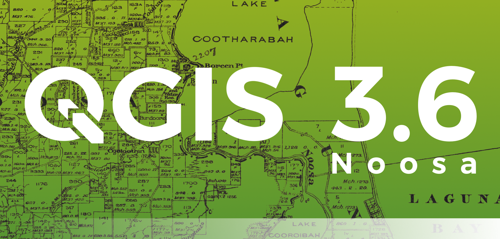
.. |image2| image:: images/entries/thumbnails/400e617d8059eddcd1228f3ce6861d6087f65794.png.400x300_q85_crop.png
   :class: img-responsive img-rounded 
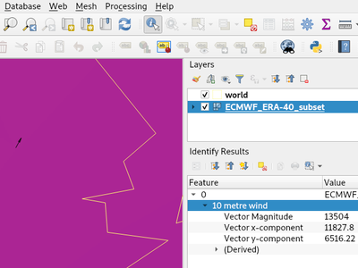
.. |image4| image:: images/entries/thumbnails/32e743ea5bf84c96b86ea31160b1677b6362eacf.png.400x300_q85_crop.png
   :class: img-responsive img-rounded 
.. |image5| image:: images/entries/thumbnails/511ac83d3b841be6ae81db5f5d0f319e07e9656e.png.400x300_q85_crop.png
   :class: img-responsive img-rounded 
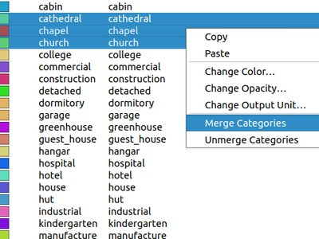
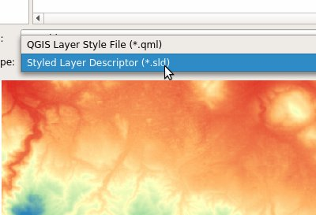
.. |image8| image:: images/entries/thumbnails/2d6278e2e65be30ceb12ff30f26d34dae6196e42.png.400x300_q85_crop.jpg
   :class: img-responsive img-rounded 
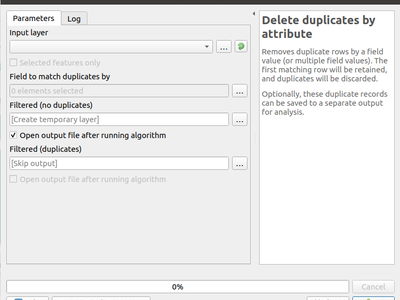
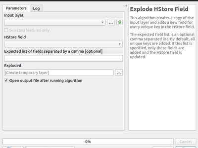
.. |image11| image:: images/entries/thumbnails/16db7b4b5931c9d96eba053701641defc6f52290.png.400x300_q85_crop.png
   :class: img-responsive img-rounded 
.. |image12| image:: images/entries/thumbnails/6715290eac02e216394b3f24045da0b982069c7d.png.400x300_q85_crop.png
   :class: img-responsive img-rounded 
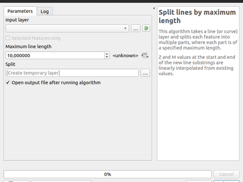
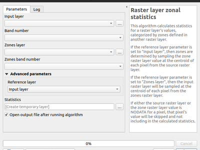
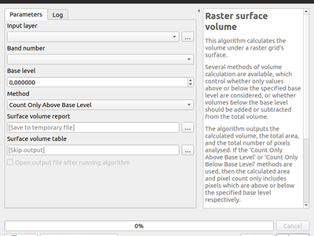
.. |image16| image:: images/entries/thumbnails/42b342e04b54d5e106ba1051b210d83af8712dd8.png.400x300_q85_crop.jpg
   :class: img-responsive img-rounded 
.. |image17| image:: images/entries/thumbnails/6b012542ef9ca282ba6f9087758f85d818dd5ec9.png.400x300_q85_crop.jpg
   :class: img-responsive img-rounded 
.. |image18| image:: images/entries/thumbnails/d939594c84d7aa186fe5f18f46ed7ad0c89d8c67.png.400x300_q85_crop.jpg
   :class: img-responsive img-rounded 
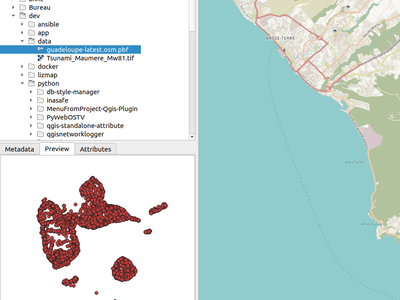
.. |image20| image:: images/entries/thumbnails/2bc8475b95a8413285b3c88a9a070f02f43cf5b9.png.400x300_q85_crop.jpg
   :class: img-responsive img-rounded 
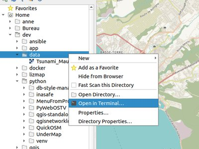
.. |image22| image:: images/entries/thumbnails/8e3fbce280478d8e88cab7e24b489b783c83fc13.png.400x300_q85_crop.png
   :class: img-responsive img-rounded 
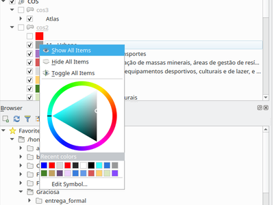
.. |image24| image:: images/entries/thumbnails/6a4648e447531099dfd8d5e113c2a79c8420df06.png.400x300_q85_crop.png
   :class: img-responsive img-rounded 
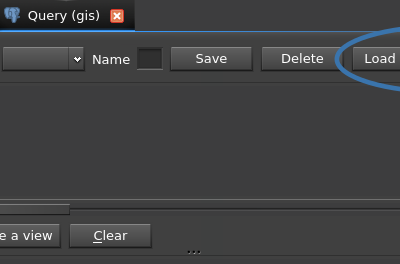
.. |image26| image:: images/entries/thumbnails/0825fbe986d774f7f2d5a0bdfdbc2487453ef49c.png.400x300_q85_crop.jpg
   :class: img-responsive img-rounded 
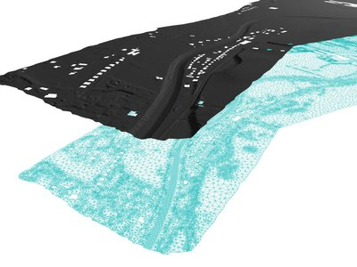
.. |image28| image:: images/projects/thumbnails/d5fd4af2929840586da0bd45110758c5b0a786ff.png.50x50_q85.png

