|image0|

Changelog for QGIS 3.8
======================

|image1|

QGIS 3.8 brings an extensive list of new changes and a lot of polishing of existing features - the highlights of which we will try to cover here. As always can we remind you that QGIS is an open source project and if you are able to, consider supporting our work through donations, sponsorship or contributions to the code documentation, web site and so on.

Thanks

We would like to thank the developers, documenters, testers and all the many folks out there who volunteer their time and effort (or fund people to do so). From the QGIS community we hope you enjoy this release! If you wish to donate time, money or otherwise get involved in making QGIS more awesome, please wander along to qgis.org and lend a hand!

QGIS is supported by donors and sponsors. A current list of donors who have made financial contributions large and small to the project can be seen on our donors list. If you would like to become an official project sponsor, please visit our sponsorship page for details. Sponsoring QGIS helps us to fund our six monthly developer meetings, maintain project infrastructure and fund bug fixing efforts. A complete list of current sponsors is provided below - our very great thank you to all of our sponsors!

QGIS is Free software and you are under no obligation to pay anything to use it - in fact we want to encourage people far and wide to use it regardless of what your financial or social status is - we believe empowering people with spatial decision making tools will result in a better society for all of humanity.

Map Tools
---------

Feature: Force Cartesian Measurements when Measuring Distances/Areas
~~~~~~~~~~~~~~~~~~~~~~~~~~~~~~~~~~~~~~~~~~~~~~~~~~~~~~~~~~~~~~~~~~~~

In 3.8, we added an option to the measurement tool which forces Cartesian measurements for distance or area measurements. Previously, the measurement tools always used ellipsoidal/geodesic area and distance calculations, but there's occasions when this is not desirable and users require pure Cartesian calculations instead.

|image2|

This feature was funded by `Oslandia <https://oslandia.com>`__

This feature was developed by `Loïc Bartoletti (Oslandia) <https://oslandia.com>`__

User Interface
--------------

Feature: Save to Template Button
~~~~~~~~~~~~~~~~~~~~~~~~~~~~~~~~

While QGIS has offered support for Project Templates for many years, we enhanced this in 3.8 and made it much simpler for users to create new templates. Now, users can create a new template from their current project by selecting "Save To -> Templates" from the "Project" menu.

|image3|

This feature was developed by `Matthias Kuhn (OPENGIS.ch) <http://www.opengis.ch/>`__

Feature: Improved "Zoom to Native Resolution" behavior
~~~~~~~~~~~~~~~~~~~~~~~~~~~~~~~~~~~~~~~~~~~~~~~~~~~~~~

We've improved the "Zoom to Native" action, so it now works correctly with tiled (e.g. WMTS/XYZ/ArcGIS MapServer) layers, by zooming to the closest native tile resolution. Additionally, we tweaked tile rendering so that pixel-perfect rendering occurs when the map is viewed at a native tile resolution. The result: super-crisp map renders when using tiled layer sources!

|image4|

Feature: Drag and Drop Layers to Map Layer widgets
~~~~~~~~~~~~~~~~~~~~~~~~~~~~~~~~~~~~~~~~~~~~~~~~~~

To improve the usability of large QGIS projects, we now support direct drag and drop of layers from the project table of contents to any widget which asks for a map layer selection (e.g. Processing algorithms). For complex projects, locating a layer in the table of contents and dragging it is much easier then picking it from the flat map layer widget combo box!

Additionally, for Processing algorithms, layers can be dragged direct from the Browser panel to input layer choices.

This feature was developed by `Nyall Dawson (North Road) <http://north-road.com>`__

Symbology
---------

Feature: Multi-character strings for font markers
~~~~~~~~~~~~~~~~~~~~~~~~~~~~~~~~~~~~~~~~~~~~~~~~~

While QGIS has long offered support for rendering points using font-based character markers, we've enhanced this functionality in 3.8 and now offer the ability to render multi-character strings! And since we're always aiming to make the QGIS application interface as user-friendly and pleasant to use as possible, we also took the opportunity to tweak the UI for font markers and squash a number of frustrating GUI issues which previous versions suffered from.

|image5|

This feature was developed by `Mathieu Pellerin <http://imhere-asia.com/>`__

Feature: Point Displacement label distance factor
~~~~~~~~~~~~~~~~~~~~~~~~~~~~~~~~~~~~~~~~~~~~~~~~~

Another addition to the new symbology features added in 3.8 is a brand new label distance factor control for Point Displacement markers. This option allows displaced marker labels to be placed at a distance based on the actual marker diagonal size instead of a fixed distance.

|image6|

This feature was developed by henrik

Feature: Hash Line symbol type
~~~~~~~~~~~~~~~~~~~~~~~~~~~~~~

QGIS loves cartography, and we know you love making pretty maps! So we've added a brand-new line symbology option for "Hashed Lines". This line symbol type is designed to replicate the ArcGIS Hash Line symbol layer type, and allows for a repeating line segment to be drawn over the length of a feature (with a line-sub symbol used to render each individual segment).

All options available for the existing Marker Line symbol layer are also available for hash lines, - e.g. first/last vertex, mid points, regular intervals, data-defined intervals, etc. The hash line length and angle can also have data defined overrides, which are evaluated per-line segment, allowing for the hash line to change size and angle over the length of a single rendered feature.

|image7|

This feature was funded by anonymous

This feature was developed by `Nyall Dawson (North Road) <http://north-road.com>`__

Feature: Average line angles for marker and hashed line symbology
~~~~~~~~~~~~~~~~~~~~~~~~~~~~~~~~~~~~~~~~~~~~~~~~~~~~~~~~~~~~~~~~~

In previous QGIS versions, when a marker line was rendered using interval or center point place placement, the symbol angles were determined by taking the exact line orientation at the position of the symbol. This often leads to undesirable rendering effects, where little "jaggies" or corners in lines which occur right at the position of the symbol cause the marker to be oriented at a very different angle to what the eye expects to see.

We want your maps to be as beautiful as possible, so in QGIS 3.8 the marker angle is instead calculated by averaging the line over a specified distance either side of the symbol. E.g. averaging the line angle over 4mm means we take the points along the line 2mm from either side of the symbol placement, and use these instead to calculate the line angle for that symbol. This has the effect of smoothing (or removing!) any tiny local deviations from the overall line direction, resulting in much nicer visual orientation of marker or hash lines.

Like all symbol settings, the average angle smoothing distance can be set using mm/pixels/map units/etc, and supports data-defined values. Closed rings also correctly consider wrapping around these average angles from the start/end vertex.

This option is available for both the marker line symbol and the new hash line symbol types.

|image8|

This feature was funded by anonymous

This feature was developed by `Nyall Dawson (North Road) <http://north-road.com>`__

Feature: Offset settings for point pattern fill symbol layers
~~~~~~~~~~~~~~~~~~~~~~~~~~~~~~~~~~~~~~~~~~~~~~~~~~~~~~~~~~~~~

To round out the new symbology options we've added in 3.8, the Point Pattern Fill symbol type has a new setting allowing for offsetting the markers in the pattern by a preset (or data-defined!) amount. This opens the door for many styling possibilities which were not possible in earlier versions, and further increases our compatibility with converted ArcGIS symbol and layer styles.

|image9|

This feature was developed by `Mathieu Pellerin <http://imhere-asia.com/>`__

Feature: Live Effects Blur Radius is now hi-dpi friendly
~~~~~~~~~~~~~~~~~~~~~~~~~~~~~~~~~~~~~~~~~~~~~~~~~~~~~~~~

QGIS 3.8 brings a highly-desired fix to layer effects' blurring radius (aka strength). In earlier QGIS versions, these blur settings did not take into account the DPI of the map render — resulting in inaccurate effects rendering when exporting canvases/layouts at high resolutions. In 3.8, this was fixed and high-resolution map exports now match the results shown on the map canvas and are completely resolution-independent.

This feature was developed by `Mathieu Pellerin <http://www.imhere-asia.com/>`__

Labelling
---------

Feature: Geometry generators for labeling
~~~~~~~~~~~~~~~~~~~~~~~~~~~~~~~~~~~~~~~~~

This is a huge one! During the developer's meeting in A Coruña, Matthias Kuhn took the opportunity to implement a frequently-asked-for feature in our labeling engine: Geometry Generator support.

Just like Geometry Generators for symbols, we now allow label paths and positions to be calculated using dynamically-evaluated geometry expressions. You can take advantage of the rich support for geometry processing which QGIS' expression engine exposes, and use this to do ALL sorts of pre-processing to your feature geometries before they are labelled. Want to place labels around the start or end point of linestring geometries? What about dynamically smoothing and simplifying the path used for labeling river features, based on the current map scale? How about buffering polygon objects inward by a percentage of their area, and then labeling around the perimeter of this shrunken area? Now, it's ALL possible, thanks to the power of labeling geometry generators!

|image10|

This feature was funded by `QGIS user group switzerland <https://www.qgis.ch>`__

This feature was developed by `Matthias Kuhn (OPENGIS.ch) <https://www.opengis.ch>`__

Feature: Label Map Tools now use click-click behavior
~~~~~~~~~~~~~~~~~~~~~~~~~~~~~~~~~~~~~~~~~~~~~~~~~~~~~

Like the other QGIS digitizing and map tools, the "Move Label" and "Rotate Label" tools now use the standard left-click-to-start edit, left-click-to-end behavior. Consistency is good!

3D Features
-----------

Feature: Wide lines and polygon edge highlighting
~~~~~~~~~~~~~~~~~~~~~~~~~~~~~~~~~~~~~~~~~~~~~~~~~

Like all recent QGIS releases, in version 3.8 we've significantly boosted QGIS' 3D rendering capabilities. New 3D rendering features include:

-  Configurable line width (in screen units) for "simple" 3D lines (in previous versions they were always 1px wide)
-  Optional highlighting of edges of 3D polygons

|image11|

This feature was funded by Andreas Neumann

This feature was developed by `Martin Dobias (Lutra Consulting) <https://www.lutraconsulting.co.uk>`__

Feature: Export 3d animations
~~~~~~~~~~~~~~~~~~~~~~~~~~~~~

Another exciting change we've introduced in QGIS 3.8 is the ability to export your 3D animations! These are exported as a series of png/jpg/... images, which can be easily merged into .avi or other standard video files (using external tools).

|image12|

This feature was funded by `Northumberland National Park Authority <https://www.northumberlandnationalpark.org.uk/>`__

This feature was developed by `Peter Petrik (Lutra Consulting) <https://www.lutraconsulting.co.uk>`__

Feature: Terrain from online sources
~~~~~~~~~~~~~~~~~~~~~~~~~~~~~~~~~~~~

With this new version 3.8 feature, you can now directly fetch terrains for your 3D scenes from online sources (e.g. tiles hosted on AWS). No more sourcing and preparing rasters with DEM, just enable this option and see beautiful 3D scenes out-of-the-box!

This feature was funded by `Crowdfunding: More QGIS 3D <https://www.lutraconsulting.co.uk/crowdfunding/more-qgis-3d/>`__

This feature was developed by `Martin Dobias (Lutra Consulting) <https://www.lutraconsulting.co.uk>`__

Feature: Configuration of field of view angle of camera
~~~~~~~~~~~~~~~~~~~~~~~~~~~~~~~~~~~~~~~~~~~~~~~~~~~~~~~

In QGIS 3.8, the field of view of the camera through which 3D scenes are rendered has gained a new configurable field of view settings.

|image13|

This feature was developed by `Mathieu Pellerin <http://www.imhere-asia.com/>`__

Print Layouts
-------------

Feature: Distribute spacing between items evenly
~~~~~~~~~~~~~~~~~~~~~~~~~~~~~~~~~~~~~~~~~~~~~~~~

To make it easy to create your perfect QGIS Print Layout, we added new tools for automatically re-positioning items so that horizontal or vertical space between them is equal. This addition nicely rounds out the existing options for aligning items, bringing more of the power of a dedicated DTP application directly inside the QGIS Print Layout Designer!

This feature was developed by Matteo Nastasi

Feature: North Arrow Creation
~~~~~~~~~~~~~~~~~~~~~~~~~~~~~

We've listened to user feedback which indicated that the previous approach for creating north arrows within print layouts was too difficult, and consequently have added a new button in the Print Layout Designer for direct north arrow creation. This button is a shortcut to adding a picture item, setting it to a north arrow picture, and linking it with a map. The end result is identical, but it's much easier for new users to understand if we expose it as an explicit "North Arrow" item!

Even experienced users will likely appreciate the improved workflow, including automatically linking the picture rotation to a sensible default map choice (if a map is selected, it's used. If not, the topmost map item under the newly drawn north arrow is used. If there's none, the layout's 'reference map' (or biggest map) is used as a fallback).

|image14|

This feature was funded by `North Road <http://north-road.com>`__

This feature was developed by `Nyall Dawson (North Road) <http://north-road.com>`__

Expressions
-----------

Feature: Order by support for expression aggregate and concatenation functions
~~~~~~~~~~~~~~~~~~~~~~~~~~~~~~~~~~~~~~~~~~~~~~~~~~~~~~~~~~~~~~~~~~~~~~~~~~~~~~

Since certain aggregate and concatenation expressions require results in a certain order, we now allow control over the order features are added to the aggregate during expression evaluation.

E.g. ``concatenate("Station",concatenator:=',', order_by:="Station")`` will give a comma-separated list of station names in alphabetical order, rather than layer feature order.

|image15|

This feature was funded by `SMEC/SJ <https://www.smec.com/>`__

This feature was developed by `Nyall Dawson (North Road) <http://north-road.com>`__

Feature: Simplified variant of "attribute" function
~~~~~~~~~~~~~~~~~~~~~~~~~~~~~~~~~~~~~~~~~~~~~~~~~~~

This improvement brings a second variant for the existing "attribute" function. The "attribute" function in previous QGIS releases required both a target feature and attribute name to be specified. The new version is much simpler, automatically using the current feature and only requiring an attribute name.

E.g.

Previous behavior:

``attribute($currentfeature, 'name' )`` -> returns value stored in 'name' attribute for the current feature

Improved behavior:

``attribute( 'name' )`` -> returns the value stored in 'name' attribute for the current feature

It's just a faster shorthand version!

|image16|

This feature was funded by `North Road <http://north-road.com>`__

This feature was developed by `Nyall Dawson (North Road) <http://north-road.com>`__

Feature: Retrieve vertices from the end of geometeries
~~~~~~~~~~~~~~~~~~~~~~~~~~~~~~~~~~~~~~~~~~~~~~~~~~~~~~

We added negative index support to the point\_n(), angle\_at\_vertex(), and distance\_to\_vertex() functions, allowing for retrieval of vertices counting backward from the end of a geometry.

|image17|

This feature was developed by `Mathieu Pellerin <http://imhere-asia.com/>`__

Feature: New expression functions
~~~~~~~~~~~~~~~~~~~~~~~~~~~~~~~~~

As always, a new QGIS release brings a bunch of new functions for use within QGIS' expression engine. These new functions add increased flexibility and power to the expression engine, and everywhere it's used throughout QGIS. This round, we've added a set of new functions which make it super-easy to operate on file names and paths.

New expression functions developed by Nyall Dawson of North Road:

-  **base\_file\_name:** Returns the base name of the file without the directory or file suffix.
-  **file\_exists:** Returns true if a file exists
-  **file\_name:** Returns the file name from a full path
-  **file\_path:** Returns the directory/path from a full file path
-  **file\_size:** Returns a file size
-  **file\_suffix:** Returns a files suffix/extension
-  **is\_directory:** Returns true if a file path is a directory
-  **is\_file:** Returns true if a file path is a file

New expressions functions developed by Mathieu Pellerin of iMHere Asia:

-  **array\_all:** Returns true if an array contains the all values of a given array.
-  **concatenate\_unique:** Returns all unique strings from a field or expression joined by a delimiter.

|image18|

Feature: New aggregation method: concatenate\_unique
~~~~~~~~~~~~~~~~~~~~~~~~~~~~~~~~~~~~~~~~~~~~~~~~~~~~

We added a new function ``concatenate_unique()`` to the expression engine (and Processing's "aggregate" algorithm) to support concatenating only unique values from a list or set of features.

|image19|

This feature was developed by `Mathieu Pellerin <http://www.imhere-asia.com/>`__

Digitising
----------

Feature: Floating widget for advanced input next to cursor
~~~~~~~~~~~~~~~~~~~~~~~~~~~~~~~~~~~~~~~~~~~~~~~~~~~~~~~~~~

To make the existing Advanced Digitizing tools easier to use, we added an option to show the current distance/angle/x/y values as a floating display next to the mouse cursor.

|image20|

This feature was funded by `Kanton Schaffhausen <https://sh.ch/CMS/Webseite/Kanton-Schaffhausen/Beh-rde/Verwaltung/Volkswirtschaftsdepartement/Amt-f-r-Geoinformation-3854-DE.html>`__

This feature was developed by `Olivier Dalang and OPENGIS.ch <https://www.opengis.ch>`__

Feature: Chained add vertex at the endpoint
~~~~~~~~~~~~~~~~~~~~~~~~~~~~~~~~~~~~~~~~~~~

In QGIS 3.0, we added the ability to extend an existing line feature by clicking a "+" indicator at the start or end of line features when using the node tool. Version 3.8 extends this functionality by allowing addition of more than one vertex using the "+" button.

|image21|

This feature was funded by `Kanton Schaffhausen <https://sh.ch/CMS/Webseite/Kanton-Schaffhausen/Beh-rde/Verwaltung/Volkswirtschaftsdepartement/Amt-f-r-Geoinformation-3854-DE.html>`__

This feature was developed by `Olivier Dalang and OPENGIS.ch <https://www.opengis.ch>`__

Feature: Improvements in the vertex editor
~~~~~~~~~~~~~~~~~~~~~~~~~~~~~~~~~~~~~~~~~~

For this release we improved the vertex editor so it will now properly link the *selected vertices on the canvas* with the *vertices for manual coordinate editing in the table*.

|image22|

This feature was funded by `QGIS User Group Switzerland <http://qgis.ch>`__

This feature was developed by `Denis Rouzaud, OPENGIS.ch <https://www.opengis.ch>`__

Forms and Widgets
-----------------

Feature: Allow browsing feature list
~~~~~~~~~~~~~~~~~~~~~~~~~~~~~~~~~~~~

| arrows allow browsing the feature list in the attribute table in form view
| the current edited feature can be highlighted and the map canvas automatically panned or zoomed

Feature: HTML Form Widget
~~~~~~~~~~~~~~~~~~~~~~~~~

Thanks to the generous sponsorship by A.R.P.A Piemonte (one of the italian regional environmental agencies) we developed a new form widget with HTML body and access to feature values and expressions.

|image23|

This feature was funded by `A.R.P.A. Piemonte <http://www.arpa.piemonte.it>`__

This feature was developed by `Alessandro Pasotti <https://www.itopen.it>`__

Feature: Form widgets custom background color
~~~~~~~~~~~~~~~~~~~~~~~~~~~~~~~~~~~~~~~~~~~~~

Thanks to the generous sponsorship by A.R.P.A Piemonte (one of the italian regional environmental agencies) we finally freed you from the boredom of gray backgrounds.

|image24|

This feature was funded by `A.R.P.A. Piemonte <http://www.arpa.piemonte.it>`__

This feature was developed by `Alessandro Pasotti <https://www.itopen.it>`__

Feature: Browse through features in the attribute table form view
~~~~~~~~~~~~~~~~~~~~~~~~~~~~~~~~~~~~~~~~~~~~~~~~~~~~~~~~~~~~~~~~~

| A new possibility to browse through the attributes of features has been integrated.
| This makes workflows for *asset management* a lot easier.

#. Define a filter
#. Browse through all matching features
#. Review and adjust

It allows to also pan and zoom to the geometry of the feature and highlights the current feature.

This replaces the ItemBrowser plugin with core functionality.

|image25|

This feature was funded by `regioDATA <https://www.regiodata-gmbh.de/>`__

This feature was developed by `Denis Rouzaud, OPENGIS.ch <https://www.opengis.ch>`__

Processing
----------

Feature: Add "Save layer styles into GeoPackage" option for Package Layers algorithm
~~~~~~~~~~~~~~~~~~~~~~~~~~~~~~~~~~~~~~~~~~~~~~~~~~~~~~~~~~~~~~~~~~~~~~~~~~~~~~~~~~~~

QGIS loves GeoPackage, so it's likely no surprise that every new QGIS version brings improvements to GeoPackage handling! In 3.8, we enhanced the "Package Layers" Processing algorithm so that it now allows embedding the current layer styles directly into the packaged layers!

|image26|

This feature was funded by `North Road <http://north-road.com>`__

This feature was developed by `Nyall Dawson (North Road) <http://north-road.com>`__

Feature: Overlap Analysis
~~~~~~~~~~~~~~~~~~~~~~~~~

This new Processing algorithm calculates the area and percentage cover by which features from an input layer are overlapped by features from a selection of overlay layers. New attributes are added to the output layer reporting the total area of overlap and percentage of the input feature overlapped by each of the selected overlay layers.

This is quite a common GIS task request, yet is full of traps for inexperienced users, and the amount of manual data work usually done by users to calculate these figures can often lead to mistakes and inaccurate results. We want to make spatial analysis as easy and foolproof as possible, so we've added Overlap Analysis as an inbuilt tool which allows this task to be done in a single step without risk of human error.

|image27|

This feature was funded by `North Road <http://north-road.com>`__

This feature was developed by `Nyall Dawson (North Road) <http://north-road.com>`__

Feature: Allow rounding values in Extract Layer Extent
~~~~~~~~~~~~~~~~~~~~~~~~~~~~~~~~~~~~~~~~~~~~~~~~~~~~~~

We've added a parameter to the Processing algorithm 'Extract Layer Extent' to round the extent bounding box coordinates to a certain interval. While rounding, the bounding box will only ever be enlarged, to ensure it will always cover the input data set. (I.e. the x and y minimum coordinates are rounded down, and x and y maximum coordinates are rounded up).

|image28|

This feature was developed by Raymond Nijssen

Feature: New options for autofilling batch Processing
~~~~~~~~~~~~~~~~~~~~~~~~~~~~~~~~~~~~~~~~~~~~~~~~~~~~~

In QGIS 3.8 we moved the existing "double click column header" to fill values down functionality to a new "Auto fill" button in the Processing Batch dialog, making this feature much more user-discoverable (we suspect many users had no idea this handy shortcut even existed!). In addition, we've added TONS of new functionality to easily auto-populate the batch table. These include:

-  File or layer parameters can now be batch populated by searching for files in a directory with a matching filename pattern (including recursive searches!). Ever needed to auto convert 100s of Shapefiles from a set of folders? Now it's easy to do!
-  An option to add calculated values from a QGIS expression, allowing complex range-based values to be added to the dialog (e.g. values from 100-1000, increasing by 50)
-  A "Calculate by Expression" option allows for updating existing batch table cells using the results of a QGIS expression. These expressions can freely utilise other parameter values from the input batch rows, making it easy to craft the exact output file name you desire based on the other columns values in a batch row.

|image29|

This feature was funded by `North Road <http://north-road.com>`__

This feature was developed by `Nyall Dawson (North Road) <http://north-road.com>`__

Feature: Generate raster XYZ tiles
~~~~~~~~~~~~~~~~~~~~~~~~~~~~~~~~~~

We've added a brand-new algorithm to generate raster "XYZ" tiles using the current QGIS project. Tile images can be saved as individual images in directory structure, or as a single file in the "MBTiles" format.

|image30|

This feature was funded by Hansestadt Herford, SWK mbH, Datenbankgesellschaft mbH

This feature was developed by `Lutra Consulting <https://www.lutraconsulting.co.uk/>`__

Feature: Resurrection of the OTB provider
~~~~~~~~~~~~~~~~~~~~~~~~~~~~~~~~~~~~~~~~~

QGIS 3.8 brings back the OTB Processing provider, which was removed in the QGIS 3.0 update. The provider was updated to use all the new goodies which are available in Processing in QGIS 3, and is once again available out-of-the-box for all your imagery analysis requirements!

(*Note that OTB is a third party dependency which must be manually installed by users. Instructions on installing OTB are available `here <https://gitlab.orfeo-toolbox.org/orfeotoolbox/qgis-otb-plugin#open-processing-settings>`__*)

|image31|

This feature was developed by Rashad Kanavath

Feature: Expression variables for a model
~~~~~~~~~~~~~~~~~~~~~~~~~~~~~~~~~~~~~~~~~

We've added a new "Model Variables" dock panel to the model editor, allowing you to create and set custom expression variables for use in your Processing models. These variables are available anywhere expressions are evaluated within the model, so you can use them as input parameter values for child algorithms, within data-defined dynamic parameters, etc.

The prime use case here is for models which use a constant value throughout multiple steps within the model (e.g. @target\_resolution: a target raster resolution, @max\_simplification: a simplification value for input features coming from different sources, etc). Previously, you'd need to hunt down and replace these values in multiple places when you wanted to tweak them. By replacing them with variables in your model you only have a single place you need to edit these values when you want to adjust them!

Model variables are stored within an individual Processing model itself, and are not exposed outside of the model designer dialog.

|image32|

This feature was funded by `North Road <http://north-road.com>`__

This feature was developed by `Nyall Dawson (North Road) <http://north-road.com>`__

Feature: Improved modeler UI
~~~~~~~~~~~~~~~~~~~~~~~~~~~~

We've added numerous usability improvements to the Processing Graphical Modeler, including

-  The addition of helpful tooltips when hovering over model components
-  Algorithms and inputs connected to model components are highlighted as you hover the mouse over different parts of the model, making it much easier to visualise the model flow and connections inside complex models
-  Input parameter types are now shown in the title of the parameter definition dialog
-  The data type for numeric parameters may now be specified, allowing for integer-only inputs for models

This feature was funded by `North Road <http://north-road.com>`__

This feature was developed by `Nyall Dawson (North Road) <http://north-road.com>`__

Feature: Flagging algorithms with known issues
~~~~~~~~~~~~~~~~~~~~~~~~~~~~~~~~~~~~~~~~~~~~~~

By default, we now hide 3rd party algorithms with known issues from the Processing toolbox, helping you avoid frustration (or misleading results) when running these algorithms. A new setting in the Processing options screen allows these algorithms to be shown, but they will be highlighted in the toolbox with a warning icon. Use at your own risk!

This feature was funded by `North Road <http://north-road.com>`__

This feature was developed by `Nyall Dawson (North Road) <http://north-road.com>`__

Feature: Raster Boolean logical OR/AND algorithms
~~~~~~~~~~~~~~~~~~~~~~~~~~~~~~~~~~~~~~~~~~~~~~~~~

In version 3.8 we've added new algorithms which calculate the boolean OR or AND for a set of input rasters. For AND, if all of the input rasters have a non-zero value for a pixel, that pixel will be set to 1 in the output raster, otherwise it will be set to 0. For OR, if ANY of the input rasters have a non-zero value for a pixel, that pixel will be set to 1 in the output raster, else 0.

A reference layer parameter allows you to specify an existing raster layer to use as a reference when creating the output raster. The output raster will have the same extent, CRS, and pixel dimensions as this layer.

By default, a nodata pixel in ANY of the input layers will result in a nodata pixel in the output raster. If you check the 'Treat nodata values as false' option, then nodata inputs will be treated the same as a 0 input value.

These new algorithms make for much simpler raster boolean logic calculation, without the complexity of using the raster calculator. They are also dynamically scalable to any number of input rasters (unlike the raster calculator), so are much more flexible when used within your Processing models.

This feature was funded by SMEC/SJ

This feature was developed by `Nyall Dawson (North Road) <http://north-road.com>`__

Feature: New input parameter types for Print Layouts and Print Layout Items
~~~~~~~~~~~~~~~~~~~~~~~~~~~~~~~~~~~~~~~~~~~~~~~~~~~~~~~~~~~~~~~~~~~~~~~~~~~

By adding new parameter types for Print Layouts and Print Layout items, we've opened up QGIS 3.8 to a whole new world of Processing algorithms which operate on print layouts. These new parameter types allow for creation of Processing algorithms and graphical models which prompt users to select a print layout and/or an item on the layout when run.

This feature was funded by SMEC/SJ

This feature was developed by `Nyall Dawson (North Road) <http://north-road.com>`__

Feature: New parameter type for Map Scales
~~~~~~~~~~~~~~~~~~~~~~~~~~~~~~~~~~~~~~~~~~

We've added a new parameter type specifically for map scales, QgsProcessingParameterScale. Scale values are evaluated using self.parameterAsDouble, which return the map scale denominator (matching the standard in other parts of the QGIS API).

Scale parameters are displayed to users using the standard QgsScaleWidget, which includes the combo box of predefined scales and a shortcut button to match the current map scale. The addition of this new parameter type allows you to create Processing algorithms and models which require a scale choice at run time.

This feature was funded by SMEC/SJ

This feature was developed by `Nyall Dawson (North Road) <http://north-road.com>`__

Feature: Improved "point" parameter handling
~~~~~~~~~~~~~~~~~~~~~~~~~~~~~~~~~~~~~~~~~~~~

We improved the workflow for algorithms with a "point" input parameter. When picking the point coordinate from a map you can now take advantage of QGIS snapping tools, allowing you to exactly match the point parameter to a feature's boundary.

This feature was funded by `North Road <http://north-road.com>`__

This feature was developed by `Nyall Dawson (North Road) <http://north-road.com>`__

Feature: New "Print Layout Map Extent to Layer" algorithm
~~~~~~~~~~~~~~~~~~~~~~~~~~~~~~~~~~~~~~~~~~~~~~~~~~~~~~~~~

Taking advantage of the new facilities for accessing Print Layouts in Processing, we added a new algorithm which creates a polygon layer containing the extent of a print layout map item. The output layer also includes handy attributes specifying the map size (in layout units), scale and rotation.

If you've ever wanted to create an advanced overview indicator, and the inbuilt layout tools haven't sufficed — this new algorithm is for you!

|image33|

This feature was funded by SMEC/SJ

This feature was developed by `Nyall Dawson (North Road) <http://north-road.com>`__

Feature: Add X/Y fields to layer
~~~~~~~~~~~~~~~~~~~~~~~~~~~~~~~~

This new algorithm is a handy shortcut for adding X and Y (or latitude/longitude) fields to a point layer. You can even calculate the X/Y values using a different coordinate reference system from the layer (e.g. creating latitude/longitude fields for a layer in a projected CRS).

|image34|

This feature was funded by SMEC/SJ

This feature was developed by `Nyall Dawson (North Road) <http://north-road.com>`__

Feature: "Join attributes by nearest" algorithm
~~~~~~~~~~~~~~~~~~~~~~~~~~~~~~~~~~~~~~~~~~~~~~~

You can now perform K-nearest neighbour joins from the Processing toolbox!

QGIS 3.8 brings a new algorithm which takes an input vector layer and creates a new vector layer with additional attributes in its attribute table. The additional attributes and their values are taken from a second vector layer, where features are joined by finding the closest features from each layer.

By default only the single nearest feature is joined, but optionally the join can use the n-nearest neighboring features instead. If a maximum distance is specified, then only features which are closer than this distance will be matched.

|image35|

This feature was funded by `North Road <http://north-road.com>`__

This feature was developed by `Nyall Dawson (North Road) <http://north-road.com>`__

Feature: Grass r.geomorphon algorithm
~~~~~~~~~~~~~~~~~~~~~~~~~~~~~~~~~~~~~

The upstream GRASS team has been hard at work creating a new GRASS module for terrain analysis — "r.geomorphon". In 3.8 we expose their efforts via a new Processing tool, which calculates geomorphons (terrain forms) and associated geometry using a machine learning approach.

|image36|

Feature: GDAL pansharpening algorithm
~~~~~~~~~~~~~~~~~~~~~~~~~~~~~~~~~~~~~

Another third party tool which we've added to the Processing toolbox in QGIS 3.8 is the GDAL pansharpening tool. Now it's easy to take advantage of this fast, powerful tool in your Processing analysis scripts and models.

|image37|

This feature was developed by Alexander Bruy

Feature: New fields prefix parameter for overlay algorithms
~~~~~~~~~~~~~~~~~~~~~~~~~~~~~~~~~~~~~~~~~~~~~~~~~~~~~~~~~~~

We've added overlay layer fields prefix parameter for the following algorithms:

-  intersection algorithm
-  line intersection algorithm
-  symmetrical difference algorithm
-  union algorithm

This can come in very handy to avoid arbitrary colliding field renaming when merging layers.

This feature was developed by `Mathieu Pellerin <http://imhere-asia.com/>`__

Browser
-------

Feature: Direct access to sheets from XLSX/ODS files
~~~~~~~~~~~~~~~~~~~~~~~~~~~~~~~~~~~~~~~~~~~~~~~~~~~~

QGIS 3.8 brings even more power to the browser panel, and now displays all sheets from spreadsheet files (e.g. Microsoft Excel and LibreOffice calc files) in the browser file tree.

|image38|

This feature was funded by `North Road <http://north-road.com>`__

This feature was developed by `Nyall Dawson (North Road) <http://north-road.com>`__

General
-------

Feature: QGIS projects inside geopackage files
~~~~~~~~~~~~~~~~~~~~~~~~~~~~~~~~~~~~~~~~~~~~~~

Did we already say that QGIS loves GeoPackage? Need any more proof of this? Well, in QGIS 3.8, we've added to ability to store QGIS projects directly inside GeoPackage files! Now you can create a totally self-contained GeoPackage which embeds a QGIS Project AND all the data used by the project. (Let's see Shapefiles match that one!)

|image39|

This feature was funded by `QCooperative <https://www.qcooperative.net>`__

This feature was developed by `Alessandro Pasotti <https://www.itopen.it>`__

Feature: Much Improved Coordinate Transform Handling
~~~~~~~~~~~~~~~~~~~~~~~~~~~~~~~~~~~~~~~~~~~~~~~~~~~~

Thanks to underlying work from the tireless PROJ and GDAL teams, QGIS now sports many huge improvements in geodetic and transformation capabilities! Highlights include:

-  The PROJ CRS database is now used to populate QGIS' CRS selection lists, removing the custom database we used in previous releases. This means that ALL responsibility for CRS definitions and updating these sit were they belong, upstream in the PROJ library -- and consequently you can expect to see QGIS CRS definitions being a closer match to the official definitions, and newer CRS definitions will be added much faster than in previous releases.. This change also means we'll be an exact match for projection handling as all other open-source geospatial tools which have completed the port to the latest PROJ version, such as GDAL 3.0.
-  We now rely entirely on PROJ's wonderful logic for generating the best coordinate operation to transform between CRS pairs. This means (amongst other stuff), we correctly support complex things like operations which require a "pivot datum", e.g. transformation to and from the GDA2020 coordinate systems.
-  Instead of the older approach QGIS used for datum transformations (carrying around our own table of when grid shift files can be used), we now use PROJ to determine these. This considerably changes the user interface shown when a user has opted into selecting manually a transform to use when multiple transforms exist, and we now show a simplified list of available (and non-available) pathways.
-  We also use PROJ's database to populate lists of available ellipsoids for use in distance and area calculations. This has cleaned up the ellipsoid choices considerably, and added many additional ellipsoid definitions as a result.
-  The UX for notifying users about issues in coordinate transforms is greatly improved, e.g. users are now alerted when a more accurate transform is possible, but not usable on their system (due to missing .GSB grid shift files). Wherever possible, we present users with direct download links to obtain these required/desired grid shift files. The intention here is to ensure users are informed when transforms can be improved, instead of silently falling back to less accurate options.
-  Users also now have the option of placing grid shift files in a "proj" folder under their QGIS user profile. This change means users can install grid shift files and make them available in QGIS without requiring administrative rights.
-  We've also completed a project which began back in the lead-up to 3.0, which ensures that project-specific transformation pathway settings are correctly respected EVERYWHERE a coordinate transform is performed. This also means we're ready for the next stage in handling 4d temporal based coordinate transforms (when these start to land in 2020 and beyond).

A lot of this is only possible thanks to improvements in the underlying PROJ and GDAL libraries, which landed as a result of the GDAL "barn raising" effort. On the QGIS side, it was ONLY possible thanks to funding from the Australian ICSM.

This feature was funded by `ICSM <https://www.icsm.gov.au/>`__

This feature was developed by `Nyall Dawson (North Road) <http://north-road.com>`__

Data Providers
--------------

Feature: postgres provider: add support for generated identity columns
~~~~~~~~~~~~~~~~~~~~~~~~~~~~~~~~~~~~~~~~~~~~~~~~~~~~~~~~~~~~~~~~~~~~~~

This feature was developed by jef-n

Feature: String List support for compatible layers
~~~~~~~~~~~~~~~~~~~~~~~~~~~~~~~~~~~~~~~~~~~~~~~~~~

QGIS 3.8 now fully supports disk-based layers with String List fields, allowing you to take advantage of QGIS' flexible handling of list field types with these formats.

This feature was developed by Mathieu Pellerin

Feature: Much Improved ArcGIS MapServer Handling
~~~~~~~~~~~~~~~~~~~~~~~~~~~~~~~~~~~~~~~~~~~~~~~~

We rebuilt the ArcGIS MapServer provider, adding significant improvements over previous versions:

-  Tiled layers are now loaded progressively, with immediate feedback
-  We significantly optimised the provider, resulting in much faster map redraws
-  MapServer layers now correctly respect authentication settings and HTTP referrer settings.
-  "Nested" services are correctly shown in the QGIS browser panel
-  ImageServer services can be added using the provider

End result: MapServer layers are now silky smooth in QGIS!

This feature was developed by Nyall Dawson (North Road) & Mathieu Pellerin (iMHere Asia)

Feature: SQL Server: handle v2 geometries, including curved and Z/M geometries
~~~~~~~~~~~~~~~~~~~~~~~~~~~~~~~~~~~~~~~~~~~~~~~~~~~~~~~~~~~~~~~~~~~~~~~~~~~~~~

SQL Server users rejoice: QGIS now fully supports curved geometry types (and other "version 2" geometry fields)!

In past QGIS versions, the SQL Server provider would only handle version 1 type geometries, and could only show straight feature types. In 3.8, we've added full support for version 2 geometries. This change also allows full support for Z or M enabled geometry types! Additionally, we fixed several known issues with geography field types.

This feature was developed by `Tamas Szekeres <https://github.com/szekerest>`__

Feature: WMS: Define one filter for several layers
~~~~~~~~~~~~~~~~~~~~~~~~~~~~~~~~~~~~~~~~~~~~~~~~~~

Sometimes, you need to define the same filter for every selected layer when making a WMS request (e.g. when accessing user-specific data). In previous QGIS versions we had to define the filter using the format:

``&FILTER=layer1:"column1" = 'value1';layer2:"column1" = 'value1';layer3:"column1" = 'value1'``

With QGIS 3.8, we've simplified this, and now allow the filter format:

``&FILTER=layer1,layer2,layer3:"column1" = 'value1'``

This feature was funded by VEOLIA

This feature was developed by `Julien Cabieces (Oslandia) <https://oslandia.com/en/>`__

QGIS Server
-----------

Feature: Allow configuring size for GetLegendGraphics
~~~~~~~~~~~~~~~~~~~~~~~~~~~~~~~~~~~~~~~~~~~~~~~~~~~~~

| For this release we improved how the legend for QGIS servers handles the size of symbols which are scaled by map units.
| Whenever possible, the server will determine the legend size based on the map canvas and resolution. Even more, for cases where this information is not available in the GetLegend request, it is now possible to configure a *default scale* in the project, symbols in the legend will then be drawn in the size they will have when rendered at this scale.

This feature was developed by `David Signer, OPENGIS.ch <https://www.opengis.ch>`__

Plugins
-------

Feature: Support for plugin dependencies
~~~~~~~~~~~~~~~~~~~~~~~~~~~~~~~~~~~~~~~~

In QGIS 3.8, we've introduced a long-sought-after feature for QGIS plugin developers: the ability to specify dependencies for your plugins.

To add a plugin dependancy, you can use the new metadata "plugin\_dependencies". The format is a comma-separated list of PIP-like plugin names (with optional version). E.g:

``plugin_dependencies=GeoCoding,IPyConsole==1.9``

The example above will require:

-  Any version of GeoCoding
-  Version 1.9 of IPyConsole

When a plugin is installed, the metadata is parsed and a user will be prompted with a dialog listing the dependencies. The user can then decide what to do with the dependencies:

-  Install
-  Upgrade/downgrade
-  Do nothing

|image40|

This feature was funded by `GISCE TI <https://gisce.net/>`__

This feature was developed by `Alessandro Pasotti <http://www.itopen.it/>`__

Programmability
---------------

Feature: REGEXP SQL syntax support for spatialite provider and python connections
~~~~~~~~~~~~~~~~~~~~~~~~~~~~~~~~~~~~~~~~~~~~~~~~~~~~~~~~~~~~~~~~~~~~~~~~~~~~~~~~~

We've enabled REGEX to be used with the spatialite provider. (This comes in handy when setting filters!). We've also added support for this syntax via any python connections made through Qgis.utils's "spatialite\_connection" API - allowing you to use REGEXP in your SQL queries from within DB Manager.

This feature was developed by `Mathieu Pellerin <http://www.imhere-asia.com/>`__

Feature: Nearest Neighbour search in QgsSpatialIndex
~~~~~~~~~~~~~~~~~~~~~~~~~~~~~~~~~~~~~~~~~~~~~~~~~~~~

| We added API to allow accurate nearest neighbor search based on QgsGeometry to QgsGeometry searches via QgsSpatialIndex. In previous QGIS versions only point to geometry nearest neighbour searches were possible. But with this change, you can safely and accurately use QgsSpatialIndex to determine the nearest neighbours between any types of
| geometries.

This feature was funded by `North Road <http://north-road.com>`__

This feature was developed by `Nyall Dawson (North Road) <http://north-road.com>`__

Notable Fixes
-------------

Feature: Support for curves in DXF export
~~~~~~~~~~~~~~~~~~~~~~~~~~~~~~~~~~~~~~~~~

You can now export curved geometry layers to DXF format without segmentizing the features — no more loss of curves!

|image41|

This feature was funded by `Kanton Schaffhausen <https://sh.ch/CMS/Webseite/Kanton-Schaffhausen/Beh-rde/Verwaltung/Volkswirtschaftsdepartement/Amt-f-r-Geoinformation-3854-DE.html>`__

This feature was developed by Jürgen Fischer in collaboration with Matthias Kuhn

Feature: Bug fixes by Alessandro Pasotti
~~~~~~~~~~~~~~~~~~~~~~~~~~~~~~~~~~~~~~~~

+---------------------------------------------------------------------------------------------------------------------+----------------------------------------------------------+-----------------------------------------------------------+--------------------------------+
| Bug Title                                                                                                           | URL issues.qgis.org (if reported)                        | URL Commit (Github)                                       | 3.4 backport commit (GitHub)   |
+=====================================================================================================================+==========================================================+===========================================================+================================+
| Raster Calculator wrong results                                                                                     | `#21405 <https://issues.qgis.org/issues/21405>`__        | fixed in master                                           |                                |
+---------------------------------------------------------------------------------------------------------------------+----------------------------------------------------------+-----------------------------------------------------------+--------------------------------+
| QGIS server ignores custom rendering order when loading parent group                                                | `#21917 <https://issues.qgis.org/issues/21917>`__        | `PR #9878 <https://github.com/qgis/QGIS/pull/9878>`__     | Done                           |
+---------------------------------------------------------------------------------------------------------------------+----------------------------------------------------------+-----------------------------------------------------------+--------------------------------+
| WMS Client: GetFeatureInfo in JSON format doesn't display numeric attribute values                                  | `#21735 <https://issues.qgis.org/issues/21735>`__        | `PR #9879 <https://github.com/qgis/QGIS/pull/9879>`__     | Done                           |
+---------------------------------------------------------------------------------------------------------------------+----------------------------------------------------------+-----------------------------------------------------------+--------------------------------+
| Crash when adding New Field to ShapeLayer                                                                           | `#22100 <https://issues.qgis.org/issues/22100>`__        |                                                           |                                |
+---------------------------------------------------------------------------------------------------------------------+----------------------------------------------------------+-----------------------------------------------------------+--------------------------------+
| Priority in labelling not greyed out when data defined settings are enabled                                         | `#22077 <https://issues.qgis.org/issues/22077>`__        | Invalid                                                   |                                |
+---------------------------------------------------------------------------------------------------------------------+----------------------------------------------------------+-----------------------------------------------------------+--------------------------------+
| $length return bad value                                                                                            | `#22105 <https://issues.qgis.org/issues/22105>`__        | works for me (and for everybody)                          |                                |
+---------------------------------------------------------------------------------------------------------------------+----------------------------------------------------------+-----------------------------------------------------------+--------------------------------+
| Relation reference widget wrong feature when "on map identification"                                                | `#22071 <https://issues.qgis.org/issues/22071>`__        |                                                           |                                |
+---------------------------------------------------------------------------------------------------------------------+----------------------------------------------------------+-----------------------------------------------------------+--------------------------------+
| Map composer: "href" HTML attribute issue in PDF output                                                             | `#22075 <https://issues.qgis.org/issues/22075>`__        | won't fix                                                 |                                |
+---------------------------------------------------------------------------------------------------------------------+----------------------------------------------------------+-----------------------------------------------------------+--------------------------------+
| Issue exporting raster layer to Geopackage                                                                          | `#20848 <https://issues.qgis.org/issues/20848>`__        | `PR #10036 <https://github.com/qgis/QGIS/pull/10036>`__   | Done                           |
+---------------------------------------------------------------------------------------------------------------------+----------------------------------------------------------+-----------------------------------------------------------+--------------------------------+
| Create vector New shapefile POLYGON                                                                                 | `#22107 <https://issues.qgis.org/issues/22107>`__        | invalid                                                   |                                |
+---------------------------------------------------------------------------------------------------------------------+----------------------------------------------------------+-----------------------------------------------------------+--------------------------------+
| "Export to PostgreSQL" python error if rather schema has an uppercase letter in its name                            | `#22035 <https://issues.qgis.org/issues/22035>`__        | `PR #10063 <https://github.com/qgis/QGIS/pull/10063>`__   |                                |
+---------------------------------------------------------------------------------------------------------------------+----------------------------------------------------------+-----------------------------------------------------------+--------------------------------+
| Relation reference widget wrong feature when "on map identification"                                                | `#22071 <https://issues.qgis.org/issues/22071>`__        | `PR #10047 <https://github.com/qgis/QGIS/pull/10047>`__   | Done                           |
+---------------------------------------------------------------------------------------------------------------------+----------------------------------------------------------+-----------------------------------------------------------+--------------------------------+
| DB Manger imports the wrong data                                                                                    | `#22033 <https://issues.qgis.org/issues/22033>`__        | `PR #10077 <https://github.com/qgis/QGIS/pull/10077>`__   | Done                           |
+---------------------------------------------------------------------------------------------------------------------+----------------------------------------------------------+-----------------------------------------------------------+--------------------------------+
| qgis crash when filtering a layer with an attachment field                                                          | `#21775 <https://issues.qgis.org/issues/21775>`__        | Fixed by Nyall                                            |                                |
+---------------------------------------------------------------------------------------------------------------------+----------------------------------------------------------+-----------------------------------------------------------+--------------------------------+
| Raster calculator, abs() not working                                                                                | `#29824 <https://github.com/qgis/QGIS/issues/29824>`__   | `PR #29965 <https://github.com/qgis/QGIS/pull/29965>`__   | Done                           |
+---------------------------------------------------------------------------------------------------------------------+----------------------------------------------------------+-----------------------------------------------------------+--------------------------------+
| Valid file URL link fails in Identify window                                                                        | `#29879 <https://github.com/qgis/QGIS/issues/29879>`__   | `PR #29967 <https://github.com/qgis/QGIS/pull/29967>`__   | Done                           |
+---------------------------------------------------------------------------------------------------------------------+----------------------------------------------------------+-----------------------------------------------------------+--------------------------------+
| QgsProject.instance().clear() crashes QGIS when LayoutDesigner Window is open                                       | `#29821 <https://github.com/qgis/QGIS/issues/29821>`__   | `PR #29968 <https://github.com/qgis/QGIS/pull/29968>`__   | Done                           |
+---------------------------------------------------------------------------------------------------------------------+----------------------------------------------------------+-----------------------------------------------------------+--------------------------------+
| QGIS Server WFS DescribeFeatureType advertises double precision virtual fields as integer                           | `#29767 <https://github.com/qgis/QGIS/issues/29767>`__   | `PR #29970 <https://github.com/qgis/QGIS/pull/29970>`__   | Done                           |
+---------------------------------------------------------------------------------------------------------------------+----------------------------------------------------------+-----------------------------------------------------------+--------------------------------+
| QGIS crahses when exporting a template                                                                              | `#29798 <https://github.com/qgis/QGIS/issues/29798>`__   | `PR #29981 <https://github.com/qgis/QGIS/pull/29981>`__   | Done                           |
+---------------------------------------------------------------------------------------------------------------------+----------------------------------------------------------+-----------------------------------------------------------+--------------------------------+
| Export atlas as image fail when expression filename contain dot                                                     | `#29980 <https://github.com/qgis/QGIS/issues/29980>`__   | `PR #29983 <https://github.com/qgis/QGIS/pull/29983>`__   | Done                           |
+---------------------------------------------------------------------------------------------------------------------+----------------------------------------------------------+-----------------------------------------------------------+--------------------------------+
| Buttons to adjust marker size in the digitizing tab of the general settings dialog not work                         | `#29987 <https://github.com/qgis/QGIS/issues/29987>`__   | `PR #29991 <https://github.com/qgis/QGIS/pull/29991>`__   |                                |
+---------------------------------------------------------------------------------------------------------------------+----------------------------------------------------------+-----------------------------------------------------------+--------------------------------+
| Map Composer crashes QGIS when copying mixture of elements in page layout                                           | `#29747 <https://github.com/qgis/QGIS/issues/29747>`__   | `PR #30017 <https://github.com/qgis/QGIS/pull/30017>`__   | TODO                           |
+---------------------------------------------------------------------------------------------------------------------+----------------------------------------------------------+-----------------------------------------------------------+--------------------------------+
| QGIS crashes with PostgreSQL views                                                                                  | `#29673 <https://github.com/qgis/QGIS/issues/29673>`__   | cannot reproduce and cannot ask for feedback              |                                |
+---------------------------------------------------------------------------------------------------------------------+----------------------------------------------------------+-----------------------------------------------------------+--------------------------------+
| Browser - "Project home" folder shortcut does not appear when a new project is saved                                | `#29919 <https://github.com/qgis/QGIS/issues/29919>`__   | `PR #30025 <https://github.com/qgis/QGIS/pull/30025>`__   | TODO                           |
+---------------------------------------------------------------------------------------------------------------------+----------------------------------------------------------+-----------------------------------------------------------+--------------------------------+
| Crash when calling QgsRasterHistogram.histogramVector                                                               | `#29700 <https://github.com/qgis/QGIS/issues/29700>`__   | `PR #30033 <https://github.com/qgis/QGIS/pull/30033>`__   | Done                           |
+---------------------------------------------------------------------------------------------------------------------+----------------------------------------------------------+-----------------------------------------------------------+--------------------------------+
| Do not offer to "Import settings from Qgis2?" if no such settings exist                                             | `#30082 <https://github.com/qgis/QGIS/issues/30082>`__   | `PR #30092 <https://github.com/qgis/QGIS/pull/30092>`__   | Done                           |
+---------------------------------------------------------------------------------------------------------------------+----------------------------------------------------------+-----------------------------------------------------------+--------------------------------+
| In gpkg, query builder prevents autogenerate of pasted feature with same fid as hidden feature                      | `#30062 <https://github.com/qgis/QGIS/issues/30062>`__   | `PR #30096 <https://github.com/qgis/QGIS/pull/30096>`__   | TODO                           |
+---------------------------------------------------------------------------------------------------------------------+----------------------------------------------------------+-----------------------------------------------------------+--------------------------------+
| Drag and drop geopackage from filesystem into map misses vector layers, loses names for raster layers               | `#30050 <https://github.com/qgis/QGIS/issues/30050>`__   | `PR #30098 <https://github.com/qgis/QGIS/pull/30098>`__   | Done                           |
+---------------------------------------------------------------------------------------------------------------------+----------------------------------------------------------+-----------------------------------------------------------+--------------------------------+
| Qgis crashes when try to identify a layer with duplicated fields                                                    | `#29937 <https://github.com/qgis/QGIS/issues/29937>`__   | `PR #30100 <https://github.com/qgis/QGIS/pull/30100>`__   | TODO                           |
+---------------------------------------------------------------------------------------------------------------------+----------------------------------------------------------+-----------------------------------------------------------+--------------------------------+
| label properties will not saved to project files (buffer and background)                                            | `#29882 <https://github.com/qgis/QGIS/issues/29882>`__   | works for me on release-3\_4 and master                   |                                |
+---------------------------------------------------------------------------------------------------------------------+----------------------------------------------------------+-----------------------------------------------------------+--------------------------------+
| Saving edits to a layer with JSON field throws an error                                                             | `#30131 <https://github.com/qgis/QGIS/issues/30131>`__   | `PR #30137 <https://github.com/qgis/QGIS/pull/30137>`__   | Risky?                         |
+---------------------------------------------------------------------------------------------------------------------+----------------------------------------------------------+-----------------------------------------------------------+--------------------------------+
| Value relation widget settings lost on import of layer definition file                                              | `#30115 <https://github.com/qgis/QGIS/issues/30115>`__   | `PR #30151 <https://github.com/qgis/QGIS/pull/30151>`__   | Risky?                         |
+---------------------------------------------------------------------------------------------------------------------+----------------------------------------------------------+-----------------------------------------------------------+--------------------------------+
| Unable to add new features in QGIS for PostGIS table using sequence for gid. Data type serial: 'integer overflow'   | `#30041 <https://github.com/qgis/QGIS/issues/30041>`__   | `PR #30184 <https://github.com/qgis/QGIS/pull/30184>`__   | Done                           |
+---------------------------------------------------------------------------------------------------------------------+----------------------------------------------------------+-----------------------------------------------------------+--------------------------------+

This feature was funded by `QGIS.ORG donors and sponsors <https://www.qgis.org/>`__

This feature was developed by `Alessandro Pasotti <https://www.itopen.it/>`__

Feature: Bug fixes by Alexander Bruy
~~~~~~~~~~~~~~~~~~~~~~~~~~~~~~~~~~~~

+-----------------------------------------------------------------------------------+----------------------------------------------------------+-----------------------------------------------------------+--------------------------------+
| Bug Title                                                                         | URL issues.qgis.org (if reported)                        | URL Commit (Github)                                       | 3.4 backport commit (GitHub)   |
+===================================================================================+==========================================================+===========================================================+================================+
| v.net.distance - node cost column                                                 | `#22013 <https://issues.qgis.org/issues/22013>`__        | `PR #10060 <https://github.com/qgis/QGIS/pull/10060>`__   | Done                           |
+-----------------------------------------------------------------------------------+----------------------------------------------------------+-----------------------------------------------------------+--------------------------------+
| shapefile to raster conversion does not work                                      | `#21922 <https://issues.qgis.org/issues/21922>`__        |                                                           |                                |
+-----------------------------------------------------------------------------------+----------------------------------------------------------+-----------------------------------------------------------+--------------------------------+
| GRASS r.in.lidar.info, can only choose *.txt not the intended* .las               | `#21910 <https://issues.qgis.org/issues/21910>`__        | `PR #10061 <https://github.com/qgis/QGIS/pull/10061>`__   | Done                           |
+-----------------------------------------------------------------------------------+----------------------------------------------------------+-----------------------------------------------------------+--------------------------------+
| SAGA OpenCV Image Analysis                                                        | `#21746 <https://issues.qgis.org/issues/21746>`__        |                                                           |                                |
+-----------------------------------------------------------------------------------+----------------------------------------------------------+-----------------------------------------------------------+--------------------------------+
| SAGA "saga split rgb bands" tool is not inside any (SAGA) group of tools          | `#21849 <https://issues.qgis.org/issues/21849>`__        | `PR #10062 <https://github.com/qgis/QGIS/pull/10062>`__   | Done                           |
+-----------------------------------------------------------------------------------+----------------------------------------------------------+-----------------------------------------------------------+--------------------------------+
| r.sun cannot be executed because it calls on two incompatible options             | `#21637 <https://issues.qgis.org/issues/21637>`__        | `PR #10074 <https://github.com/qgis/QGIS/pull/10074>`__   | Done                           |
+-----------------------------------------------------------------------------------+----------------------------------------------------------+-----------------------------------------------------------+--------------------------------+
| i.segment (GRASS 7.4.2) only produces a Goodness Raster but no Segmented Raster   | `#20646 <https://issues.qgis.org/issues/20646>`__        | works fine in master and 3.4                              |                                |
+-----------------------------------------------------------------------------------+----------------------------------------------------------+-----------------------------------------------------------+--------------------------------+
| Majority filter (SAGA) returns erroneous results if input is .tif                 | `#22118 <https://issues.qgis.org/issues/22118>`__        | invalid                                                   |                                |
+-----------------------------------------------------------------------------------+----------------------------------------------------------+-----------------------------------------------------------+--------------------------------+
| Processing batch process interface: no way to go back                             | `#16893 <https://issues.qgis.org/issues/16893>`__        | `PR #10080 <https://github.com/qgis/QGIS/pull/10080>`__   | Done                           |
+-----------------------------------------------------------------------------------+----------------------------------------------------------+-----------------------------------------------------------+--------------------------------+
| DB Manager rename PostGIS column error                                            | `#21425 <https://issues.qgis.org/issues/21425>`__        | `PR #10082 <https://github.com/qgis/QGIS/pull/10082>`__   | not needed                     |
+-----------------------------------------------------------------------------------+----------------------------------------------------------+-----------------------------------------------------------+--------------------------------+
| Word wrapping not working in maptips                                              | `#21388 <https://issues.qgis.org/issues/21388>`__        | `PR #10081 <https://github.com/qgis/QGIS/pull/10081>`__   | Done                           |
+-----------------------------------------------------------------------------------+----------------------------------------------------------+-----------------------------------------------------------+--------------------------------+
| Styles stored in QML files with same name as layer no longer auto loaded          | `#21691 <https://issues.qgis.org/issues/21691>`__        | `PR #14660 <https://github.com/qgis/QGIS/pull/14660>`__   | Done                           |
+-----------------------------------------------------------------------------------+----------------------------------------------------------+-----------------------------------------------------------+--------------------------------+
| QGIS 3.4.6 crashed when I tried classifying a layer                               | `#21693 <https://issues.qgis.org/issues/21693>`__        | `PR #29951 <https://github.com/qgis/QGIS/pull/29951>`__   | Done                           |
+-----------------------------------------------------------------------------------+----------------------------------------------------------+-----------------------------------------------------------+--------------------------------+
| Fixed table not working under User defined filter (SAGA)                          | `#29999 <https://github.com/qgis/QGIS/issues/29999>`__   | `PR #30001 <https://github.com/qgis/QGIS/pull/30001>`__   | Done                           |
+-----------------------------------------------------------------------------------+----------------------------------------------------------+-----------------------------------------------------------+--------------------------------+
| DB Manager Versioning: \_current view lacks primary key                           | `#25888 <https://github.com/qgis/QGIS/issues/25888>`__   | `PR #30045 <https://github.com/qgis/QGIS/pull/30045>`__   |                                |
+-----------------------------------------------------------------------------------+----------------------------------------------------------+-----------------------------------------------------------+--------------------------------+

This feature was funded by `QGIS.ORG donors and sponsors <https://www.qgis.org/>`__

This feature was developed by `Alexander Bruy <https://bruy.me/>`__

Feature: Bug fixes by Victor Olaya
~~~~~~~~~~~~~~~~~~~~~~~~~~~~~~~~~~

+-----------------------------------------------------------------------------------------------------------------------------------------------------------------------+----------------------------------------------------------+---------------------------------------------------------------------------------------------+--------------------------------+
| Bug Title                                                                                                                                                             | URL issues.qgis.org (if reported)                        | URL Commit (Github)                                                                         | 3.4 backport commit (GitHub)   |
+=======================================================================================================================================================================+==========================================================+=============================================================================================+================================+
| Processing "iterate" does not work anymore                                                                                                                            | `#21524 <https://issues.qgis.org/issues/21524>`__        | `PR #10078 <https://github.com/qgis/QGIS/pull/10078>`__                                     |                                |
+-----------------------------------------------------------------------------------------------------------------------------------------------------------------------+----------------------------------------------------------+---------------------------------------------------------------------------------------------+--------------------------------+
| parameter type error in SAGA Gaussian Filter                                                                                                                          | `#21797 <https://issues.qgis.org/issues/21797>`__        | `Commit <https://github.com/qgis/QGIS/commit/83e6dd3efe302de4749d68be23217d8dd4e667d2>`__   |                                |
+-----------------------------------------------------------------------------------------------------------------------------------------------------------------------+----------------------------------------------------------+---------------------------------------------------------------------------------------------+--------------------------------+
| Distance matrix does not maintain data type and precision for Input Point Layer in Linear (N\*k x 3)                                                                  | `#21501 <https://issues.qgis.org/issues/21501>`__        |                                                                                             |                                |
+-----------------------------------------------------------------------------------------------------------------------------------------------------------------------+----------------------------------------------------------+---------------------------------------------------------------------------------------------+--------------------------------+
| Processing "Build virtual vector" now fails in certain cases                                                                                                          | `#21519 <https://issues.qgis.org/issues/21519>`__        | `PR #10083 <https://github.com/qgis/QGIS/pull/10083>`__                                     |                                |
+-----------------------------------------------------------------------------------------------------------------------------------------------------------------------+----------------------------------------------------------+---------------------------------------------------------------------------------------------+--------------------------------+
| SAGA raster calculator loads more grids than selected when a sdat is supplied in XGRIDS                                                                               | `#22131 <https://issues.qgis.org/issues/22131>`__        | `PR #10085 <https://github.com/qgis/QGIS/pull/10085>`__                                     |                                |
+-----------------------------------------------------------------------------------------------------------------------------------------------------------------------+----------------------------------------------------------+---------------------------------------------------------------------------------------------+--------------------------------+
| Export selected Objects generated line layer not selectable in graphical modeller                                                                                     | `#21705 <https://issues.qgis.org/issues/21705>`__        | `PR #10093 <https://github.com/qgis/QGIS/pull/10093>`__                                     |                                |
+-----------------------------------------------------------------------------------------------------------------------------------------------------------------------+----------------------------------------------------------+---------------------------------------------------------------------------------------------+--------------------------------+
| Batch processing error in r.mapcalc.simple                                                                                                                            | `#29822 <https://github.com/qgis/QGIS/issues/29822>`__   |                                                                                             |                                |
+-----------------------------------------------------------------------------------------------------------------------------------------------------------------------+----------------------------------------------------------+---------------------------------------------------------------------------------------------+--------------------------------+
| Help for algorithms not visible in modeller                                                                                                                           | `#21536 <https://issues.qgis.org/issues/21536>`__        |                                                                                             |                                |
+-----------------------------------------------------------------------------------------------------------------------------------------------------------------------+----------------------------------------------------------+---------------------------------------------------------------------------------------------+--------------------------------+
| Bug fixes related the batch interface, not linked to any bug report. They are regressions introduced in recent changes, that i found while working on another issue   |                                                          | `PR #29948 <https://github.com/qgis/QGIS/pull/29948>`__                                     |                                |
+-----------------------------------------------------------------------------------------------------------------------------------------------------------------------+----------------------------------------------------------+---------------------------------------------------------------------------------------------+--------------------------------+
|                                                                                                                                                                       |                                                          | `PR #29950 <https://github.com/qgis/QGIS/pull/29950>`__                                     |                                |
+-----------------------------------------------------------------------------------------------------------------------------------------------------------------------+----------------------------------------------------------+---------------------------------------------------------------------------------------------+--------------------------------+

This feature was funded by `QGIS.ORG donors and sponsors <https://www.qgis.org/>`__

This feature was developed by `Victor Olaya <>`__

Feature: Bug fixes by Even Rouault
~~~~~~~~~~~~~~~~~~~~~~~~~~~~~~~~~~

+------------------------------------------------------------------------------+-----------------------------------------------------------+------------------------------------------------------------------------------------------------+--------------------------------+
| Bug Title                                                                    | URL issues.qgis.org (if reported)                         | URL Commit (Github)                                                                            | 3.4 backport commit (GitHub)   |
+==============================================================================+===========================================================+================================================================================================+================================+
| ENVI driver ignores "geo point" (GCP) metadata on reading                    | `#1528 <https://github.com/OSGeo/gdal/issues/1528>`__     | `Commit <https://github.com/rouault/gdal/commit/f2f29cd3a7708a4a9553f127b2d19b3cd72f9180>`__   |                                |
+------------------------------------------------------------------------------+-----------------------------------------------------------+------------------------------------------------------------------------------------------------+--------------------------------+
| WFS GetFeature fails on TypeNames parameter                                  | `#21768 <https://issues.qgis.org/issues/21768>`__         | `PR #29946 <https://github.com/qgis/QGIS/pull/29946>`__                                        | Done                           |
+------------------------------------------------------------------------------+-----------------------------------------------------------+------------------------------------------------------------------------------------------------+--------------------------------+
| Cannot load GPX file automatically after creating it QGIS 3.4.7 QGIS 3.6.2   | `#22005 <https://issues.qgis.org/issues/22005>`__         | `PR #29947 <https://github.com/qgis/QGIS/pull/29947>`__                                        | Done                           |
+------------------------------------------------------------------------------+-----------------------------------------------------------+------------------------------------------------------------------------------------------------+--------------------------------+
| Cannot create temporary SpatiaLite cache                                     | `#29819 <https://github.com/qgis/QGIS/issues/29819>`__    | `PR #29949 <https://github.com/qgis/QGIS/pull/29949>`__                                        | Done                           |
+------------------------------------------------------------------------------+-----------------------------------------------------------+------------------------------------------------------------------------------------------------+--------------------------------+
| PostGIS closed circle in Curved Polygon is not displayed                     | `#29895 <https://github.com/qgis/QGIS/issues/29895>`__    | `PR #30010 <https://github.com/qgis/QGIS/pull/30010>`__                                        | Done                           |
+------------------------------------------------------------------------------+-----------------------------------------------------------+------------------------------------------------------------------------------------------------+--------------------------------+
| Fix GeoJSON output of MultiPolygon/MultiSurface                              | `PR #30012 <https://github.com/qgis/QGIS/pull/30012>`__   | `PR #30012 <https://github.com/qgis/QGIS/pull/30012>`__                                        | Not needed                     |
+------------------------------------------------------------------------------+-----------------------------------------------------------+------------------------------------------------------------------------------------------------+--------------------------------+
| Multipatch features are not shown anymore                                    | `#29376 <https://github.com/qgis/QGIS/issues/29376>`__    | `PR #30024 <https://github.com/qgis/QGIS/pull/30024>`__                                        | Done                           |
+------------------------------------------------------------------------------+-----------------------------------------------------------+------------------------------------------------------------------------------------------------+--------------------------------+
| Multiple issues and deadlocks with WFS                                       | `#29258 <https://github.com/qgis/QGIS/issues/29258>`__    | `PR #30026 <https://github.com/qgis/QGIS/pull/30026>`__                                        | Done                           |
+------------------------------------------------------------------------------+-----------------------------------------------------------+------------------------------------------------------------------------------------------------+--------------------------------+
| WFS provider: Avoid dangling download progress dialog                        | `PR #30039 <https://github.com/qgis/QGIS/pull/30039>`__   | `PR #30039 <https://github.com/qgis/QGIS/pull/30039>`__                                        | Done                           |
+------------------------------------------------------------------------------+-----------------------------------------------------------+------------------------------------------------------------------------------------------------+--------------------------------+

This feature was funded by `QGIS.ORG donors and sponsors <https://www.qgis.org/>`__

This feature was developed by `Even Rouault <https://www.spatialys.com/>`__

Feature: Bug fixes by Denis Rouzaud
~~~~~~~~~~~~~~~~~~~~~~~~~~~~~~~~~~~

+-----------------------------+----------------------------------------------------------+---------------------------------------------------------------------------------------------------------------------+--------------------------------+
| Bug Title                   | URL issues.qgis.org (if reported)                        | URL Commit (Github)                                                                                                 | 3.4 backport commit (GitHub)   |
+=============================+==========================================================+=====================================================================================================================+================================+
| issues in embedded layers   | `#29678 <https://github.com/qgis/QGIS/issues/29678>`__   | `PR #9993 <https://github.com/qgis/QGIS/pull/9993>`__ and `PR #10004 <https://github.com/qgis/QGIS/pull/10004>`__   |                                |
+-----------------------------+----------------------------------------------------------+---------------------------------------------------------------------------------------------------------------------+--------------------------------+

This feature was funded by `QGIS.ORG donors and sponsors <https://www.qgis.org/>`__

This feature was developed by `Denis Rouzaud <https://www.opengis.ch/>`__

Feature: Bug fixes by Peter Petrik
~~~~~~~~~~~~~~~~~~~~~~~~~~~~~~~~~~

+------------------------------------------------------------------------------+----------------------------------------------------------+-----------------------------------------------------------+--------------------------------+
| Bug Title                                                                    | URL issues.qgis.org (if reported)                        | URL Commit (Github)                                       | 3.4 backport commit (GitHub)   |
+==============================================================================+==========================================================+===========================================================+================================+
| Editing a GeoPackage feature with spaces in the field names can crash QGIS   | `#29630 <https://github.com/qgis/QGIS/issues/29630>`__   | `PR #29997 <https://github.com/qgis/QGIS/pull/29997>`__   | TODO                           |
+------------------------------------------------------------------------------+----------------------------------------------------------+-----------------------------------------------------------+--------------------------------+
| Crash on update pg layer                                                     | `#29814 <https://github.com/qgis/QGIS/issues/29814>`__   | duplicate                                                 | N/A                            |
+------------------------------------------------------------------------------+----------------------------------------------------------+-----------------------------------------------------------+--------------------------------+
| XMDF file type missing from Madiera 3.4.5                                    | `#29381 <https://github.com/qgis/QGIS/issues/29381>`__   | invalid                                                   | N/A                            |
+------------------------------------------------------------------------------+----------------------------------------------------------+-----------------------------------------------------------+--------------------------------+
| Mesh calculator: crash when 'All Selected Dataset Times' button clicked      | `#30003 <https://github.com/qgis/QGIS/issues/30003>`__   | `PR #30005 <https://github.com/qgis/QGIS/pull/30005>`__   | N/A                            |
+------------------------------------------------------------------------------+----------------------------------------------------------+-----------------------------------------------------------+--------------------------------+
| Crash when editing fields                                                    | `#29200 <https://github.com/qgis/QGIS/issues/29200>`__   | unable to replicate                                       | N/A                            |
+------------------------------------------------------------------------------+----------------------------------------------------------+-----------------------------------------------------------+--------------------------------+
| Closing Vertex Edititor crashes the app                                      | `#30028 <https://github.com/qgis/QGIS/issues/30028>`__   | `PR #30030 <https://github.com/qgis/QGIS/pull/30030>`__   | TODO                           |
+------------------------------------------------------------------------------+----------------------------------------------------------+-----------------------------------------------------------+--------------------------------+
| Detached 3D view crash [macOS]                                               | `#29169 <https://github.com/qgis/QGIS/issues/29169>`__   | unable to replicate                                       |                                |
+------------------------------------------------------------------------------+----------------------------------------------------------+-----------------------------------------------------------+--------------------------------+

This feature was funded by `QGIS.ORG donors and sponsors <https://www.qgis.org/>`__

This feature was developed by `Peter Petrik <https://www.lutraconsulting.co.uk/>`__

Feature: Bug fixes by Loïc Bartoletti
~~~~~~~~~~~~~~~~~~~~~~~~~~~~~~~~~~~~~

+---------------------------------------------------------------------+----------------------------------------------------------+-----------------------------------------------------------+--------------------------------+
| Bug Title                                                           | URL issues.qgis.org (if reported)                        | URL Commit (Github)                                       | 3.4 backport commit (GitHub)   |
+=====================================================================+==========================================================+===========================================================+================================+
| No snap when selecting point of rotation                            | `#29706 <https://github.com/qgis/QGIS/issues/29706>`__   | duplicate / not a bug                                     |                                |
+---------------------------------------------------------------------+----------------------------------------------------------+-----------------------------------------------------------+--------------------------------+
| Crashs when working with auxiliary storage label and data defined   | `#30078 <https://github.com/qgis/QGIS/issues/30078>`__   | unable to replicate                                       |                                |
+---------------------------------------------------------------------+----------------------------------------------------------+-----------------------------------------------------------+--------------------------------+
| Improve the advanced digitizing by angle                            | `#30133 <https://github.com/qgis/QGIS/issues/30133>`__   | not a bug                                                 |                                |
+---------------------------------------------------------------------+----------------------------------------------------------+-----------------------------------------------------------+--------------------------------+
| Fix reshape for snapped point with Z                                |                                                          | `PR #30108 <https://github.com/qgis/QGIS/pull/30108>`__   |                                |
+---------------------------------------------------------------------+----------------------------------------------------------+-----------------------------------------------------------+--------------------------------+

This feature was funded by `QGIS.ORG donors and sponsors <https://www.qgis.org/>`__

This feature was developed by `Loïc Bartoletti <https://oslandia.com/en/>`__

Sponsors for QGIS version 3.8
-----------------------------

|image42| Gold : 9000 EUR
~~~~~~~~~~~~~~~~~~~~~~~~~

+--------------------------------------+--------------------------------------+
| |QGIS user group Denmark|            | |QGIS user group Switzerland|        |
| QGIS user group Denmark              | QGIS user group Switzerland          |
+--------------------------------------+--------------------------------------+
| |QGIS user group Sweden|             |                                      |
| QGIS user group Sweden               |                                      |
+--------------------------------------+--------------------------------------+

|image46| Silver : 3000 EUR
~~~~~~~~~~~~~~~~~~~~~~~~~~~

+--------------------------------------+--------------------------------------+
| |AERO ASAHI Corporation|             | |OPENGIS.ch GmbH|                    |
| AERO ASAHI Corporation               | OPENGIS.ch GmbH                      |
+--------------------------------------+--------------------------------------+
| |ARTOGIS a/s|                        | |OSGeo:UK|                           |
| ARTOGIS a/s                          | OSGeo:UK                             |
+--------------------------------------+--------------------------------------+
| |GAIA mbH|                           | |Office of Public Works, Flood Risk  |
| GAIA mbH                             | Management and Data Management       |
|                                      | Section|                             |
|                                      | Office of Public Works, Flood Risk   |
|                                      | Management and Data Management       |
|                                      | Section                              |
+--------------------------------------+--------------------------------------+
| |GIAP Spółka z Ograniczona           | |QGIS user group Germany|            |
| Odpowiedzialnoscia|                  | QGIS user group Germany              |
| GIAP Spółka z Ograniczona            |                                      |
| Odpowiedzialnoscia                   |                                      |
+--------------------------------------+--------------------------------------+
| |LIFA A/S Landinspektører|           | |SECON Private Limited|              |
| LIFA A/S Landinspektører             | SECON Private Limited                |
+--------------------------------------+--------------------------------------+
| |Land Vorarlberg|                    | |Spatial Networks, Inc.|             |
| Land Vorarlberg                      | Spatial Networks, Inc.               |
+--------------------------------------+--------------------------------------+
| |Lutra Consulting|                   | |Terraplan|                          |
| Lutra Consulting                     | Terraplan                            |
+--------------------------------------+--------------------------------------+
| |Mierune LLC|                        | |WIGeoGIS|                           |
| Mierune LLC                          | WIGeoGIS                             |
+--------------------------------------+--------------------------------------+

|image63| Bronze : 500 EUR
~~~~~~~~~~~~~~~~~~~~~~~~~~

+--------------------------------------+--------------------------------------+
| |2D3D.GIS|                           | |Kaplan Open Source Consulting Ltd|  |
| 2D3D.GIS                             | Kaplan Open Source Consulting Ltd    |
+--------------------------------------+--------------------------------------+
| |Agresta S. Coop.|                   | |Le Groupe SYGIF inc.|               |
| Agresta S. Coop.                     | Le Groupe SYGIF inc.                 |
+--------------------------------------+--------------------------------------+
| |Alta ehf|                           | |MHTC Ltd|                           |
| Alta ehf                             | MHTC Ltd                             |
+--------------------------------------+--------------------------------------+
| |Asociación Geoinnova|               | |MappingGIS|                         |
| Asociación Geoinnova                 | MappingGIS                           |
+--------------------------------------+--------------------------------------+
| |BGEO Open GIS, SL|                  | |NaturalGIS|                         |
| BGEO Open GIS, SL                    | NaturalGIS                           |
+--------------------------------------+--------------------------------------+
| |Bathurst Regional Council|          | |OPGK Kraków|                        |
| Bathurst Regional Council            | OPGK Kraków                          |
+--------------------------------------+--------------------------------------+
| |Baumsicht|                          | |OSGeo.JP|                           |
| Baumsicht                            | OSGeo.JP                             |
+--------------------------------------+--------------------------------------+
| |Beacon Environmental|               | |Oester Messtechnik GmbH|            |
| Beacon Environmental                 | Oester Messtechnik GmbH              |
+--------------------------------------+--------------------------------------+
| |CADaGEO|                            | |Omkeere|                            |
| CADaGEO                              | Omkeere                              |
+--------------------------------------+--------------------------------------+
| |CartoData|                          | |Orbitalnet Inc.|                    |
| CartoData                            | Orbitalnet Inc.                      |
+--------------------------------------+--------------------------------------+
| |Chartwell Consultants Ltd.|         | |QTibia Engineering|                 |
| Chartwell Consultants Ltd.           | QTibia Engineering                   |
+--------------------------------------+--------------------------------------+
| |City of Canning|                    | |RaumRegionMensch ZT GmbH|           |
| City of Canning                      | RaumRegionMensch ZT GmbH             |
+--------------------------------------+--------------------------------------+
| |EFN eifel-net Internetprovider      | |Region Midtjylland (Central Denmark |
| GmbH|                                | Region)|                             |
| EFN eifel-net Internetprovider GmbH  | Region Midtjylland (Central Denmark  |
|                                      | Region)                              |
+--------------------------------------+--------------------------------------+
| |Forest Design SRL|                  | |SIGMOÉ|                             |
| Forest Design SRL                    | SIGMOÉ                               |
+--------------------------------------+--------------------------------------+
| |GFI - Gesellschaft für              | |SOLTIG (Soluciones en Tecnologías   |
| Informationstechnologie mbH|         | de Información Geográfica)|          |
| GFI - Gesellschaft für               | SOLTIG (Soluciones en Tecnologías de |
| Informationstechnologie mbH          | Información Geográfica)              |
+--------------------------------------+--------------------------------------+
| |GIS Mexico - Soluciones Geográficas | |Septima|                            |
| de México SC|                        | Septima                              |
| GIS Mexico - Soluciones Geográficas  |                                      |
| de México SC                         |                                      |
+--------------------------------------+--------------------------------------+
| |GIS Support Sp. z o.o.|             | |Sherborn Forest Trails|             |
| GIS Support Sp. z o.o.               | Sherborn Forest Trails               |
+--------------------------------------+--------------------------------------+
| |GKG Kassel, (Dr.-Ing. Claas         | |Solargis s.r.o.|                    |
| Leiner)|                             | Solargis s.r.o.                      |
| GKG Kassel, (Dr.-Ing. Claas Leiner)  |                                      |
+--------------------------------------+--------------------------------------+
| |Gaia3D, Inc.|                       | |Solve Geosolutions|                 |
| Gaia3D, Inc.                         | Solve Geosolutions                   |
+--------------------------------------+--------------------------------------+
| |GeoS Geodätische Software Andreas   | |Syddjurs Kommune|                   |
| Hellinge|                            | Syddjurs Kommune                     |
| GeoS Geodätische Software Andreas    |                                      |
| Hellinge                             |                                      |
+--------------------------------------+--------------------------------------+
| |Gispo Oy|                           | |TYC GIS|                            |
| Gispo Oy                             | TYC GIS                              |
+--------------------------------------+--------------------------------------+
| |Gistree, Lda.|                      | |TerreLogiche|                       |
| Gistree, Lda.                        | TerreLogiche                         |
+--------------------------------------+--------------------------------------+
| |HermeSys, Inc.|                     | |Trage Wegen vzw|                    |
| HermeSys, Inc.                       | Trage Wegen vzw                      |
+--------------------------------------+--------------------------------------+
| |Inforest Research o.c.|             | |Urbsol|                             |
| Inforest Research o.c.               | Urbsol                               |
+--------------------------------------+--------------------------------------+
| |InfraGIS GmbH|                      | |Veitch Lister Consulting|           |
| InfraGIS GmbH                        | Veitch Lister Consulting             |
+--------------------------------------+--------------------------------------+
| |Infraplan Engineering Services Pvt. | |Västra Götalandsregionen|           |
| Ltd.|                                | Västra Götalandsregionen             |
| Infraplan Engineering Services Pvt.  |                                      |
| Ltd.                                 |                                      |
+--------------------------------------+--------------------------------------+
| |Ingenieurbüro Kauppert|             | |WhereGroup GmbH & Co. KG|           |
| Ingenieurbüro Kauppert               | WhereGroup GmbH & Co. KG             |
+--------------------------------------+--------------------------------------+
| |Ingenieurbüro Reinhard Beck GmbH &  | |correlate analytics gmbh|           |
| Co. KG|                              | correlate analytics gmbh             |
| Ingenieurbüro Reinhard Beck GmbH &   |                                      |
| Co. KG                               |                                      |
+--------------------------------------+--------------------------------------+
| |Integrate Sustainability Pty Ltd|   | |ePrime|                             |
| Integrate Sustainability Pty Ltd     | ePrime                               |
+--------------------------------------+--------------------------------------+
| |K + D Landschaftsplanung AG|        | |map-site|                           |
| K + D Landschaftsplanung AG          | map-site                             |
+--------------------------------------+--------------------------------------+

.. |image0| image:: images/projects/4ba1280c5037bc85ccedcbd39dab18eb725729c5.png
.. |image1| image:: images/projects/403e44c7e958cff5d07a1eaf12af76ade88c564d.png
   :class: img-responsive img-rounded center-block
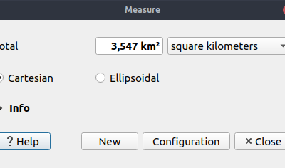
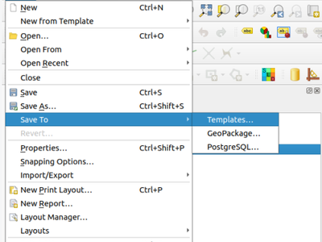
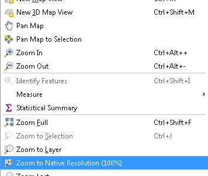
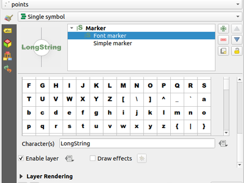
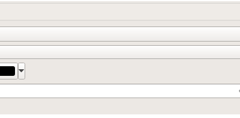
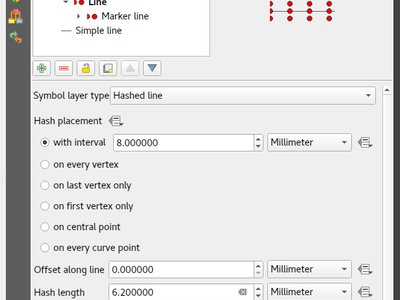
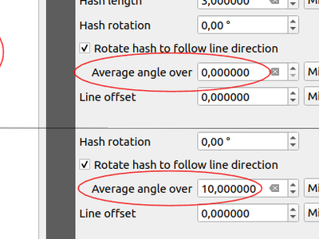
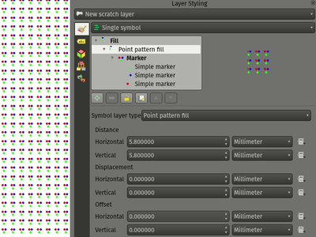
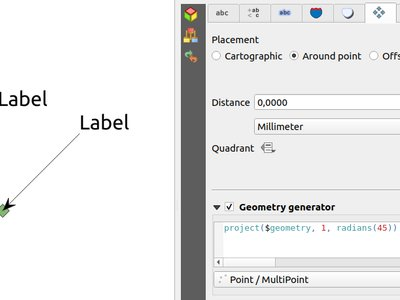
.. |image11| image:: images/entries/thumbnails/6e77320c7766d11f25893f9c2de2e7de57eab488.png.400x300_q85_crop.jpg
   :class: img-responsive img-rounded pull-right
   :name: images/entries/6e77320c7766d11f25893f9c2de2e7de57eab488.png
.. |image12| image:: images/entries/thumbnails/f0d7bb5632bfaa9c9feafb12e7b258c312ba66a6.png.400x300_q85_crop.png
   :class: img-responsive img-rounded pull-right
   :name: images/entries/f0d7bb5632bfaa9c9feafb12e7b258c312ba66a6.png
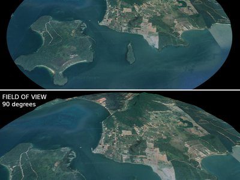
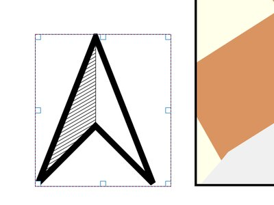
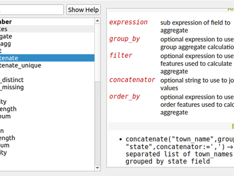
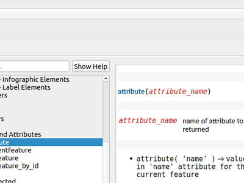
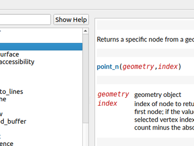
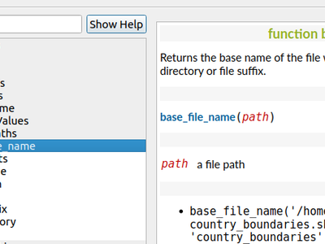
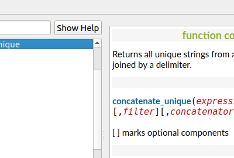
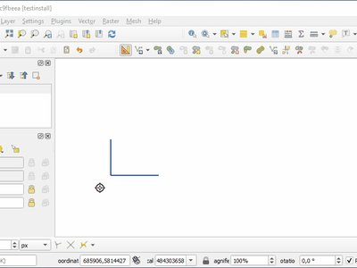
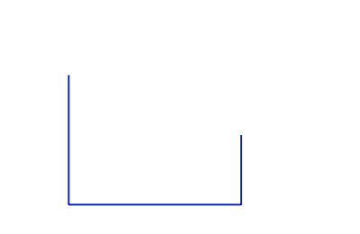
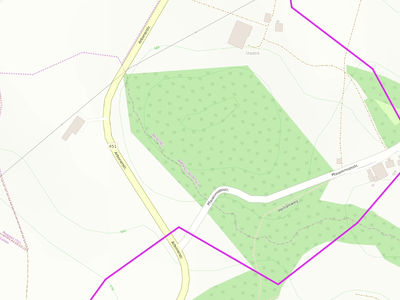
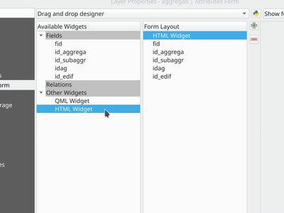
.. |image24| image:: images/entries/thumbnails/8627ae1acd4ed30ae116e3b79679ecb5cad3241a.gif.400x300_q85_crop.png
   :class: img-responsive img-rounded pull-right
   :name: images/entries/8627ae1acd4ed30ae116e3b79679ecb5cad3241a.gif
.. |image25| image:: images/entries/thumbnails/f034aaf2a173be885b5f8fca36e3b577795ad1de.png.400x300_q85_crop.png
   :class: img-responsive img-rounded pull-right
   :name: images/entries/f034aaf2a173be885b5f8fca36e3b577795ad1de.png
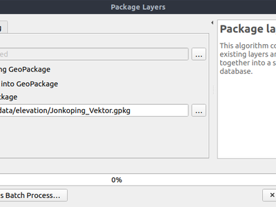
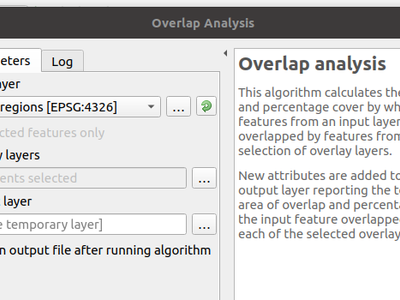
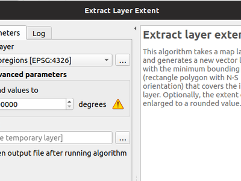
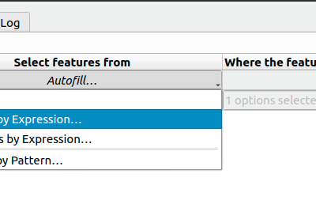
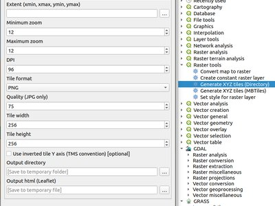
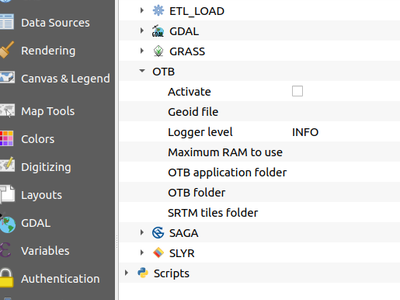
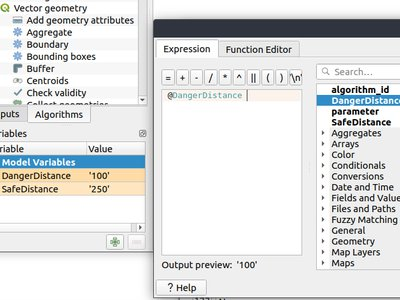
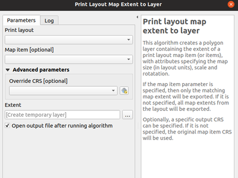
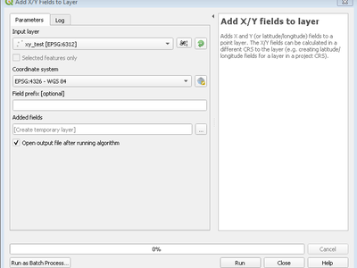
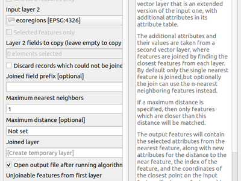
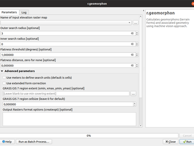
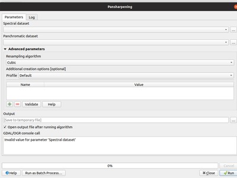
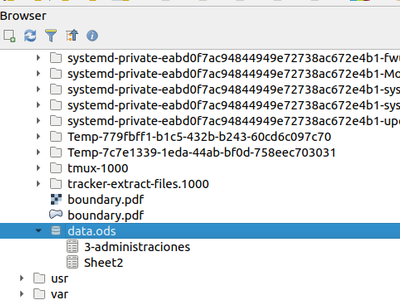
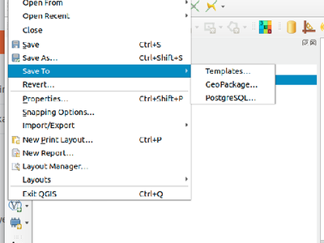
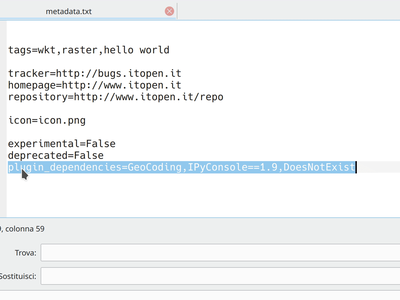
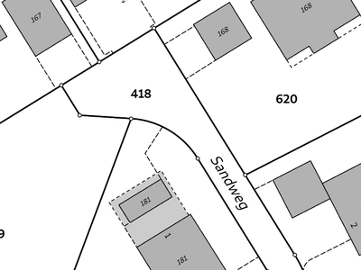
.. |image42| image:: images/projects/thumbnails/d5fd4af2929840586da0bd45110758c5b0a786ff.png.50x50_q85.png

.. |QGIS user group Switzerland| image:: images/projects/thumbnails/b9c08a00a74cba8e406e97f94a1f90595f5ac39d.png.150x50_q85.png
   :target: http://www.qgis.ch/
.. |QGIS user group Sweden| image:: images/projects/thumbnails/f534d8378b714e7eeab445ba4faf3fab460831e2.png.150x50_q85.png
   :target: http://www.qgis.se/
.. |image46| image:: images/projects/thumbnails/0d8ae6aad78ca052492dff96434ddb54d5401262.png.50x50_q85.png
.. |AERO ASAHI Corporation| image:: images/projects/thumbnails/c4dc52859104f35bfb44e25b4335fa67859ad587.png.150x50_q85.png
   :target: https://www.aeroasahi.co.jp/english/

.. |GAIA mbH| image:: images/projects/thumbnails/f6379f3083e612fd47917e1f948d795b6951dde9.png.150x50_q85.png
   :target: http://www.gaia-mbh.de/
.. |Office of Public Works, Flood Risk Management and Data Management Section| image:: images/projects/thumbnails/35602d87c0858381e9a95a481808b27249f0f592.jpg.150x50_q85.jpg
   :target: http://www.opw.ie/

.. |QGIS user group Germany| image:: images/projects/thumbnails/9e65278db4b4cbe588be7125347a5aa699911a98.png.150x50_q85.png
   :target: http://www.qgis.de/
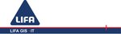

.. |Land Vorarlberg| image:: images/projects/thumbnails/5f50b148aecade6339b100f1ad30897b81ca9a09.jpg.150x50_q85.jpg
   :target: http://www.vorarlberg.at/

.. |Lutra Consulting| image:: images/projects/thumbnails/0d5fea827c8bfc486877065e21d3e28f89788e78.png.150x50_q85.png
   :target: http://www.lutraconsulting.co.uk/
.. |Terraplan| image:: images/projects/thumbnails/0a11f16bbeec25c03a5dd82f9d52d4fe708b1570.png.150x50_q85.png
   :target: http://www.terraplan.com/
.. |Mierune LLC| image:: images/projects/thumbnails/532f695887b3175497dee3675fb4dfd2cdf0fa98.png.150x50_q85.png
   :target: http://www.mierune.co.jp/
.. |WIGeoGIS| image:: images/projects/thumbnails/48df7ad58a98d7d7cb14062172a9ea6dca7e9587.png.150x50_q85.jpg
   :target: https://www.wigeogis.com/
.. |image63| image:: images/projects/thumbnails/0e2f6fb1efc89d41120cddf90509374642d400b4.png.50x50_q85.png
.. |2D3D.GIS| image:: images/projects/thumbnails/b3196a2b5781e788e6adac40ecf6964eddc4d38e.png.150x50_q85.png
   :target: http://www.2d3d-gis.com/
.. |Kaplan Open Source Consulting Ltd| image:: images/projects/thumbnails/a6c64bafe89acb6f788df38bcdd3fef64d74a6fb.png.150x50_q85.png
   :target: https://kaplanopensource.co.il/

.. |Alta ehf| image:: images/projects/thumbnails/f1efb1c25a3fee168c6b7570cd6a092901c16420.png.150x50_q85.png
   :target: http://www.alta.is/

.. |Asociación Geoinnova| image:: images/projects/thumbnails/bba9a55eb7e288e622e7bf40ee85326c28cf09f3.jpg.150x50_q85.jpg
   :target: http://geoinnova.org/
.. |MappingGIS| image:: images/projects/thumbnails/775de328b2774c112cc73fb5aaaee9696220649b.png.150x50_q85.png
   :target: http://www.mappinggis.com/
.. |BGEO Open GIS, SL| image:: images/projects/thumbnails/c8dbccba699fc2f34ef61b034f7b86adfd96f4c4.png.150x50_q85.jpg
   :target: www.bgeo.es

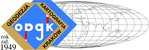

.. |OSGeo.JP| image:: images/projects/thumbnails/5e8de527e9b1398d315d33cdf359c3884a857165.png.150x50_q85.png
   :target: http://www.osgeo.jp/

.. |Chartwell Consultants Ltd.| image:: images/projects/thumbnails/6562e216c8bd122945b9658b7e4218e19eb60cc5.png.150x50_q85.png
   :target: http://www.chartwell-consultants.com/
.. |QTibia Engineering| image:: images/projects/thumbnails/07586ed5245a121df751e99bc4e9de865e2b1652.png.150x50_q85.png
   :target: https://qtibia.ro/
.. |City of Canning| image:: images/projects/thumbnails/fa16def6b9c0dddd8efd27bcecb8c2ead20d88be.png.150x50_q85.png
   :target: http://www.canning.wa.gov.au/

.. |SIGMOÉ| image:: images/projects/thumbnails/ad998390b607b98b219a98118a163b97cf3ceb1a.png.150x50_q85.png
   :target: http://sigmoe.fr/
.. |GFI - Gesellschaft für Informationstechnologie mbH| image:: images/projects/thumbnails/44113fc21a8e2cd84d93459d0f00b3a64850095c.png.150x50_q85.jpg
   :target: http://www.gfi-gis.de/
.. |SOLTIG (Soluciones en Tecnologías de Información Geográfica)| image:: images/projects/thumbnails/0baa83c55c7c6194627e87ca81c9dffd4eee9ad1.png.150x50_q85.png
   :target: http://www.soltig.net/
.. |GIS Mexico - Soluciones Geográficas de México SC| image:: images/projects/thumbnails/df7f93968d341c1de90c1c195fe0b9cbf33d9835.png.150x50_q85.png
   :target: http://www.gismexico.mx/
.. |Septima| image:: images/projects/thumbnails/037aae845f0e3957e65624216eb71b51d8c7c59c.png.150x50_q85.png
   :target: http://www.septima.dk/
.. |GIS Support Sp. z o.o.| image:: images/projects/thumbnails/879213e1d9dd7d4e4adb87abf81c96c26c25cd36.png.150x50_q85.jpg
   :target: http://www.gis-support.com/

.. |GKG Kassel, (Dr.-Ing. Claas Leiner)| image:: images/projects/thumbnails/06d9ce325f919f08b4ba76714d981182ce2c4f2f.png.150x50_q85.jpg
   :target: http://www.gkg-kassel.de/
.. |Solargis s.r.o.| image:: images/projects/thumbnails/307bd93f35f5edb9c25c4c313d30f8fe50e54877.png.150x50_q85.png
   :target: http://solargis.com/
.. |Gaia3D, Inc.| image:: images/projects/thumbnails/9d30ee055aaea7ef42b807b1b4fcd22566eef69d.png.150x50_q85.png
   :target: http://www.gaia3d.com/

.. |GeoS Geodätische Software Andreas Hellinge| image:: images/projects/thumbnails/8c5ddf3eac42e04913c403e828d959945a335941.png.150x50_q85.jpg
   :target: http://www.geos-hellinge.de/
.. |Syddjurs Kommune| image:: images/projects/thumbnails/ebeedeb0b3c357529d144efba284e3ee9d62f77d.png.150x50_q85.png
   :target: http://www.syddjurs.dk/

.. |TYC GIS| image:: images/projects/thumbnails/e2c84a2441203bc48c9ceaf96e7e7dcec0f8942f.png.150x50_q85.png
   :target: http://tycgis.com/

.. |TerreLogiche| image:: images/projects/thumbnails/9e23fb4e1f0416131843750f07e75a9f9d1e724d.jpg.150x50_q85.jpg
   :target: http://www.terrelogiche.com/

.. |Urbsol| image:: images/projects/thumbnails/af9b8c3a4363482f12c7b2dff14659fd9ff6240c.png.150x50_q85.jpg
   :target: http://www.urbsol.com.au/

.. |Infraplan Engineering Services Pvt. Ltd.| image:: images/projects/thumbnails/e0f5d8b0b418902b1f9dc17774d114e4657a6f6f.png.150x50_q85.jpg
   :target: http://www.infraplan.in/

.. |Ingenieurbüro Kauppert| image:: images/projects/thumbnails/abcdeb9f00b83e06992bc3a1aa146e523565773b.jpg.150x50_q85.jpg
   :target: http://www.ib-kauppert.de/

.. |ePrime| image:: images/projects/thumbnails/1876ed906c688bb1331df0f3887ea0b009132264.png.150x50_q85.png
   :target: http://www.eprime.cl/
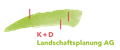

