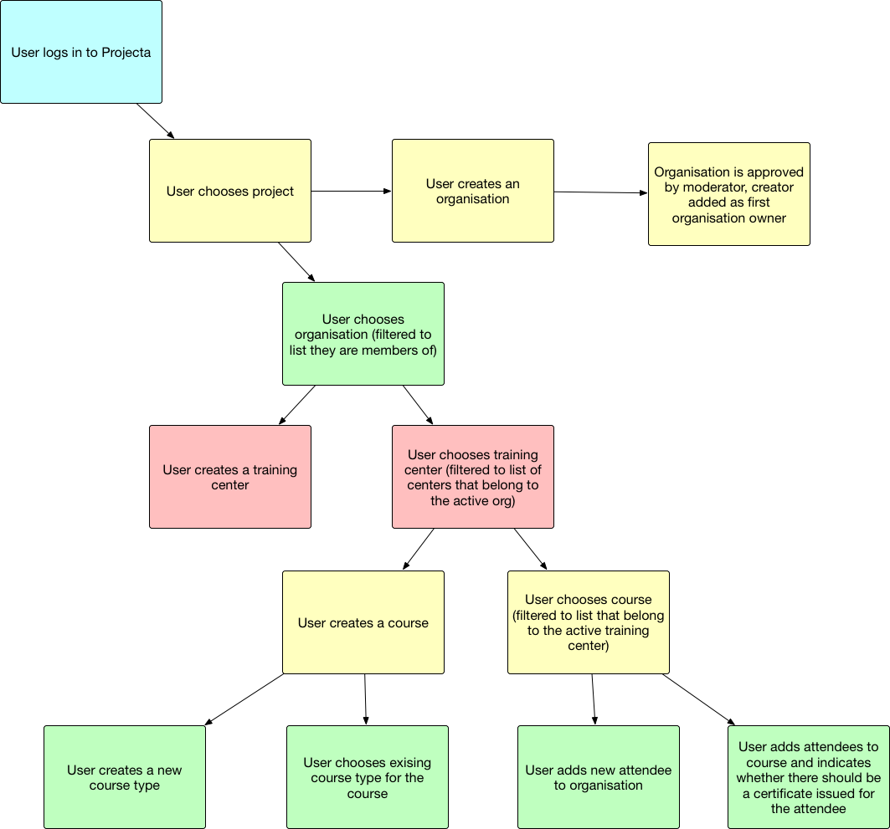

.. _certification:

Certification
=============

The QGIS Certificate Program is designed to promote both community involvement in the QGIS project and quality education for QGIS software. As such the application process requires applicants to both detail their contributions to the QGIS project and make their training materials available for review. Contributions to the QGIS project include activities such as:

- Development/commits to QGIS
- Contributions to the QGIS documentation and training materials
- Translation of QGIS materials
- Authoring plugins
- Filing bug reports
- Financially supporting new feature development
- Financial contributions to and sponsorship of QGIS
- Involvement in your local QGIS User Group
- Publication of open QGIS course ware
- Authoring QGIS books

To contact the certification team, please write to certification@qgis.org.

Certification Process
---------------------

Application
...........

You are required to provide the training material for each of your courses. This includes exercises, lectures and data. This material will be reviewed for currentness, accurate representation of the QGIS project and overall quality.
If the material is not of adequate quality, this can be cause for refusal.

Following an initial review, the application will be sent to local QGIS groups for their opinion. This portion of the review should take place in less than one month. If there is not a local QGIS user group the QGIS Project Steering Committee (PSC) will make a determination based on material provided and your reputation in the community. In this latter case you are encouraged to establish a local QGIS User Group. If you are not deemed to be a member of the QGIS community in good standing this can be cause for refusal.

The PSC will make the final determination. If accepted as a QGIS Certified Organization your contributions to the project will be published for transparency.

If approved you are required to pay a €20 certification fee to the QGIS project for each certificate you issue. This creates a mechanism for financial support of the project. Payments for certificates are made either using online credit card transactions or on request by regular invoice and SEPA wire transfer. Payments can
be handled in batches for many certificates at once.
 
You can apply through `this form <certification_link_>`_ (make sure to first create a `login <certification_login_>`_). You can find more details about the certification programme `here <certification_details_>`_ (we advise you to read this before registering).

.. _certification_link: https://changelog.qgis.org/en/qgis/create-certifyingorganisation/
.. _certification_details: https://changelog.qgis.org/en/qgis/about/
.. _certification_login: https://changelog.qgis.org/en/accounts/signup/

Course Certification Workflow
.............................

   Workflow Certification
