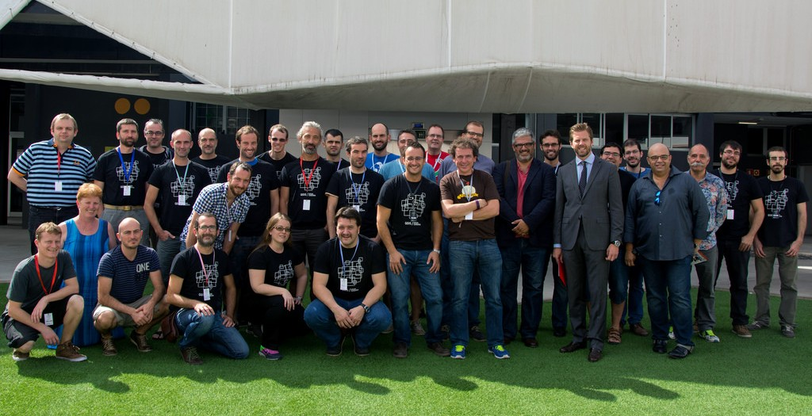

14th QGIS Developer Meeting in Las Palmas
-----------------------------------------

The 14th QGIS Developer Meeting from Nov 5th-8th 2015 was organised by.

- Universidad de las Palmas de Gran Canaria.
- Oficina de Software libre de la Universidad de las Palmas de Gran Canaria.
- Ayuntamiento de las Palmas de Gran Canaria.

Thanks for this! And kudos to Pablo Fernández Moniz and his crue for his efforts to make this a great hackfest.

Summary of what happened at the hackfest
========================================

* Matthias managed to compile QGIS with Python3 and Qt5
* Discussion about bug tracker to use
* Discussion about analysis tools
* We have a [FEATURE] webhook now which shoots an issue in QGIS-Documentation issue tracker (Raymond + Richard)
* Update of Website (Anita + Richard)

* please add ...