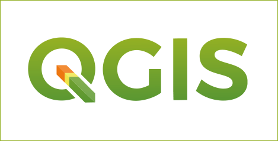
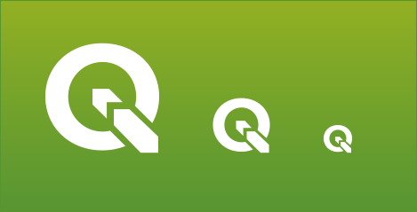
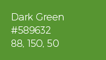
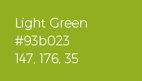
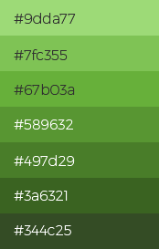
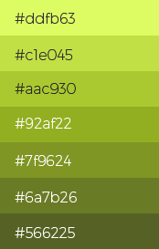
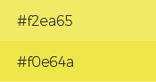

Visual Style Guide
==================

Version 1.0
-----------

This is our QGIS Visual Style Guide. This document defines
standards for the use of the our visual identity. It proposes
a modernization of the QGIS brand to make it stronger,
more visible and more adaptable to a broad range of use
cases.

The Visual Style Guide is a living document, initiated with
the goal of developing a consistent message and image
for QGIS. It is a “living” document because we expect
it to expand as we cover more use cases where visual
consistency is important and can be described using
simpler rules. The standards and simple policies described
here are designed to maintain the uniformity
of presentation necessary for successful promotion and
marketing efforts for the QGIS project.

Our visual identity symbolizes QGIS’s strength, promise of
quality and competence. Proper treatment of logo, fonts
and color ensures that QGIS will be recognized and stand
out amid communications clutter. Graphic standards are a
visual expression of QGIS and should serve as the base for
our overall communications strategy.

This first version of the Graphic Style Guide outlines the
core elements of the new QGIS logo. Future versions
will focus on branding assets and how to spread the
QGIS brand across the web, mobile devices and printed
materials.

Logotype
--------

Original
........

.. image:: images/main_logo_monochrome.png 

**Download logo file**

:download:`SVG logo <files/qgis-logo.svg>`

:download:`PNG logo <files/qgis-logo.png>`

:download:`SVG monochrome logo <files/qgis-logo-monochrome.svg>`

:download:`PNG monochrome logo <files/qgis-logo-monochrome.png>`

The new QGIS logo is presented here. Keeping the core
elements of the original QGIS logo (Q letter with an
arrow through it), this new version intends to be sharp
and scalable, introducing simpler and bolder shapes.

The proposed changes are listed below.

• The existing spirit is preserved but the logo is bold
• Shadows removed
• The Q is sans-serif
• The arrow becomes the part of Q letter
• The QGIS logo text is based on the free & libre Trueno Bold font.

Minimal
.......

.. image:: images/minimal.png

**Download minimal logo**

:download:`SVG 128px <files/qgis-icon128.svg>`
:download:`SVG 64px <files/qgis-icon64.svg>`
:download:`SVG 32px <files/qgis-icon32.svg>`

:download:`PNG 128px <files/qgis-icon128.png>`
:download:`PNG 64px <files/qgis-icon64.png>`
:download:`PNG 32px <files/qgis-icon32.png>`

.. image:: images/minimal_black.png

**Download minimal black**

:download:`SVG black 128px <files/qgis-icon-black128.svg>`
:download:`SVG black 64px <files/qgis-icon-black64.svg>`
:download:`SVG black 32px <files/qgis-icon-black32.svg>`

:download:`PNG black 128px <files/qgis-icon-black128.png>`
:download:`PNG black 64px <files/qgis-icon-black64.png>`
:download:`PNG black 32px <files/qgis-icon-black32.png>`

.. image:: images/minimal_green.png

**Download minimal green**

:download:`SVG green 128px <files/qgis-icon-green128.svg>`
:download:`SVG green 64px <files/qgis-icon-green64.svg>`
:download:`SVG green 32px <files/qgis-icon-green32.svg>`

:download:`PNG green 128px <files/qgis-icon-green128.png>`
:download:`PNG green 64px <files/qgis-icon-green64.png>`
:download:`PNG green 32px <files/qgis-icon-green32.png>`

**Download minimal white**

:download:`SVG white 128px <files/qgis-icon-white128.svg>`
:download:`SVG white 64px <files/qgis-icon-white64.svg>`
:download:`SVG white 32px <files/qgis-icon-white32.svg>`

:download:`PNG white 128px <files/qgis-icon-white128.png>`
:download:`PNG white 64px <files/qgis-icon-white64.png>`
:download:`PNG white 32px <files/qgis-icon-white32.png>`

Typography
----------

Trueno fonts
............

Trueno is a free Font Library serif font. In order to embed it, please use ``<link rel="stylesheet" media="screen" href="https://fontlibrary.org/face/trueno" type="text/css"/>`` in the site header

==================  =================
Name                Font-family
==================  =================
Trueno Ultra light  'TruenoUltraLight'
Trueno Regular      'TruenoRegular'
Trueno Bold         'TruenoBold'
==================  =================

Color
-----

Primary colors
..............

**Dark Green**

HEX: #589632

RGB: 88, 150, 50

CMYK: 70.53, 18.84, 100, 3.7

The QGIS Dark Green color to be used for every logo
element in the monochrome version. It can also be
used as background, primary headline or text color.

**Light Green**

HEX: #93b023

RGB: 147, 176, 35

CMYK: 50.62, 12.6, 100, 0.86

The QGIS Light Green color to be used for content
of lesser importance. It can be used as secondary
background, text or links color.

**The gradient**

.. image:: images/gradient.png

The two primary colors are used as a vertical linear
gradient in the logo, and this gradient can be used for
website and printed materials background

**Color Palette**

Secondary colors
................

**Lemon**

.. image:: images/lemon.png

HEX: #f0e64a

RGB: 240, 230, 74

CMYK: 11, 0, 79, 0

**Orange**

.. image:: images/orange.png

HEX: #ee7913 

RGB: 238, 121, 19

CMYK: 0, 62, 96, 0

The QGIS Lemon and Orange colors to be used for the accents and call-to-actions

**Color Palette**

.. image:: images/orange_palette.png
